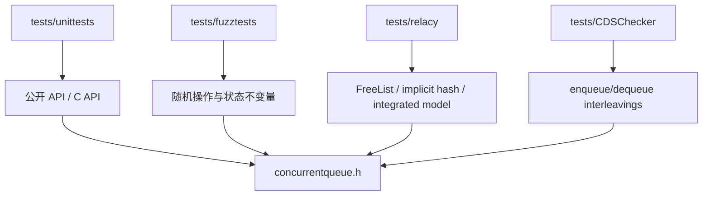

# M05 验证模块

- 文档目的：说明单元、fuzz、线程压力和模型检查如何覆盖核心协议。
- 证据状态：目录、构建入口和测试注册机制已确认；本次未执行。
- 最后更新：2026-09-10
- 前置阅读：[模块注册表](../module-registry.md)
- 后续阅读：[测试矩阵](test-matrix.md)

## 验证层次

## Unit test

`tests/unittests/unittests.cpp` 使用自定义 `minitest`，注册单项、bulk、threaded、异常、C API 和内部 free-list/hash 测试。主程序支持 `--help`、`--disable-prompt`、`--run TEST`、`--iterations N`。tracking allocator 和 `postTest` 检查测试后资源是否归零。

## 其他层

fuzz tests 探索更广操作序列；Relacy 和 CDSChecker 针对并发状态空间，但各自依赖外部/专用构建环境。它们是验证 harness，不是运行时组件。

## 验证状态

本知识库没有运行测试，因此只记录命令来源，不声称通过。

## 子页

- [test-matrix](test-matrix.md)
- [failure-triage](failure-triage.md)
