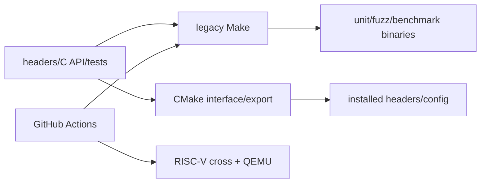

# M07 打包、构建与 CI

- 文档目的：解释 CMake、legacy Make、安装导出和 CI 的职责边界。
- 适用范围：本页及其直接关联的源码、测试和配置；第三方、生成物与动态结果仅在有证据时纳入。
- 对应源码版本：source/concurrency-queue HEAD 683b9e3（2026-09-15 只读确认）。
- 证据状态：配置静态确认；本次未执行构建。
- 最后更新：2026-09-10
- 前置阅读：[模块注册表](../module-registry.md)
- 后续阅读：[构建总览](../../00-overview/build-and-deploy.md)
## 结论摘要

本页聚焦 01-modules/M07-packaging-and-ci/README.md；具体事实以正文引用的目标源码版本为准，未执行的构建、运行和硬件行为保持未验证。

## 两套入口

- **CMake**：根 `CMakeLists.txt` 声明 `INTERFACE` library、include dirs、安装头文件和 `concurrentqueue::concurrentqueue` 导出；不编译 tests/benchmarks。
- **GNU Make**：`build/makefile` 编译 C API 对象、unit/fuzz/benchmark 可执行文件，并链接平台/第三方依赖。
- **CI**：native Linux unit test 和 RISC-V cross/QEMU 路径；它是自动验证环境，不是运行时模块。

## 交付流

## 审计卡片

| 维度 | 结论 |
|---|---|
| 运行时副作用 | 无 daemon；只构建/安装/运行测试 |
| ABI | CMake interface 是 header distribution；C API 由 Make 编译 `.cpp` |
| 平台 | native Linux 与 RISC-V CI 已确认 |
| 未知 | 当前机器工具链和完整安装结果 |

## 子页

- [line-level-analysis](line-level-analysis.md)
- [ci-matrix](ci-matrix.md)

## 文档元数据（规范补充）

- 文档目的：说明 `01-modules/M07-packaging-and-ci/README.md` 的源码分析范围、结论和维护入口。
- 适用范围：当前项目对应模块/入口的静态源码与测试分析。
- 对应源码版本：以本项目 `00-overview/analysis-state.md` 或同页版本字段为准。
- 证据状态：静态源码证据；未执行的构建、测试、GPU、网络或多进程行为保持“未验证”。
- 最后更新：2026-09-15
- 前置阅读：本项目根 README 与 `00-overview/analysis-state.md`。
- 后续阅读：本模块/示例的实现、测试和风险页面。

## 深度审计

| 分析对象 | 入口落地 | 正常路径 | 分支 | 异常 | 清理 | 数据生命周期 | 执行上下文 | 行级证据 | Demo 映射 | 状态/缺口 |
|---|---|---|---|---|---|---|---|---|---|---|
| concurrency-queue/01-modules/M07-packaging-and-ci/README.md | 已定位 | 已追踪代表路径 | 部分完成 | 部分完成 | 部分完成 | 部分完成 | 已标注 | 已引用或待补 | 已映射或无专用 Demo | 部分完成：动态构建、运行和硬件边界仍未验证 |

## 相关文档
- [项目入口](../../README.md)
- [分析状态](../../00-overview/analysis-state.md)
- [源码证据索引](../../00-overview/evidence-index.md)

## 源码证据摘要
本页结论所需的源码路径和行号以 [源码证据索引](../../00-overview/evidence-index.md) 及正文引用为准；本页不把未执行的构建、运行或硬件行为写成已验证事实。

## 未解决问题
目标环境、动态构建/运行、硬件和外部依赖行为未在本轮执行；缺少直接证据的结论仍标记为未知或未验证。

## 下一步阅读建议
先阅读 [分析状态](../../00-overview/analysis-state.md)，再沿本页已有链接进入对应模块、Demo 或跨模块流程。
