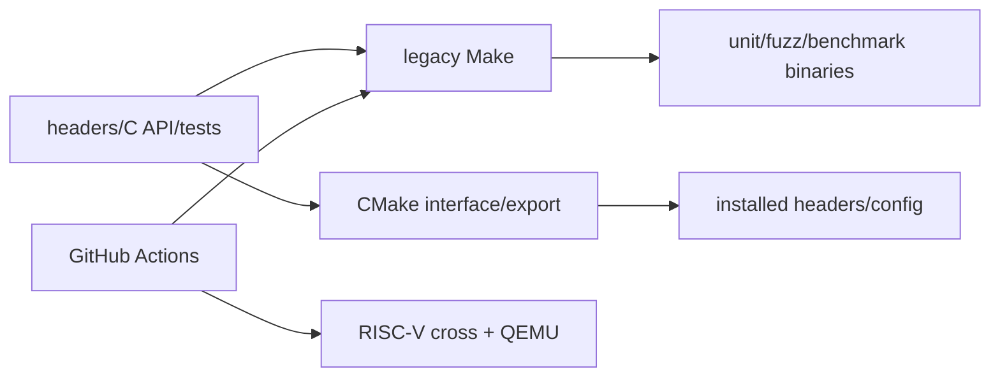

# M07 打包、构建与 CI

- 文档目的：解释 CMake、legacy Make、安装导出和 CI 的职责边界。
- 证据状态：配置静态确认；本次未执行构建。
- 最后更新：2026-09-10
- 前置阅读：[模块注册表](../module-registry.md)
- 后续阅读：[构建总览](../../00-overview/build-and-deploy.md)

## 两套入口

- **CMake**：根 `CMakeLists.txt` 声明 `INTERFACE` library、include dirs、安装头文件和 `concurrentqueue::concurrentqueue` 导出；不编译 tests/benchmarks。
- **GNU Make**：`build/makefile` 编译 C API 对象、unit/fuzz/benchmark 可执行文件，并链接平台/第三方依赖。
- **CI**：native Linux unit test 和 RISC-V cross/QEMU 路径；它是自动验证环境，不是运行时模块。

## 交付流

## 审计卡片

| 维度 | 结论 |
|---|---|
| 运行时副作用 | 无 daemon；只构建/安装/运行测试 |
| ABI | CMake interface 是 header distribution；C API 由 Make 编译 `.cpp` |
| 平台 | native Linux 与 RISC-V CI 已确认 |
| 未知 | 当前机器工具链和完整安装结果 |

## 子页

- [line-level-analysis](line-level-analysis.md)
- [ci-matrix](ci-matrix.md)
