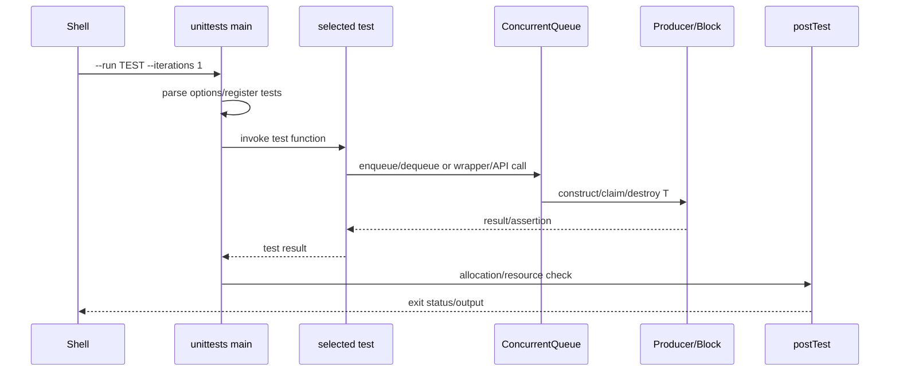

# D01 执行轨迹

- 文档目的：追踪从命令到真正算法副作用的端到端调用链。
- 证据状态：静态源码路径确认；未执行。
- 最后更新：2026-09-10
- 前置阅读：[D01 README](README.md)
- 后续阅读：[M01 调用链](../../01-modules/M01-core-queue/call-chains.md)

## 分支示例

- `enqueue_one_explicit`：token → explicit producer → block placement-new → dequeue/destructor。
- `enqueue_one_implicit`：thread-id → implicit hash → implicit producer。
- `test_threaded`：多个 worker 交错 producer/consumer，最终检查计数和资源。
- `c_api_try_dequeue`：C function → reinterpret-cast handle → C++ queue。
- throwing movable tests：验证异常路径而非只看 bool 结果。

## 真实副作用

测试断言不是核心副作用的终点；必须继续追踪到 `tailIndex` 发布、`headIndex` 领取、T 的 move/destructor 和 block empty/recycle，见 M01。
