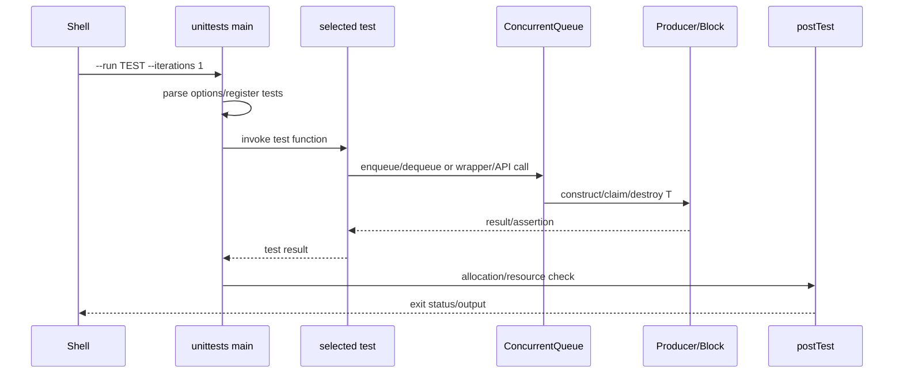

# D01 执行轨迹

- 文档目的：追踪从命令到真正算法副作用的端到端调用链。
- 适用范围：本页及其直接关联的源码、测试和配置；第三方、生成物与动态结果仅在有证据时纳入。
- 对应源码版本：source/concurrency-queue HEAD 683b9e3（2026-09-15 只读确认）。
- 证据状态：静态源码路径确认；未执行。
- 最后更新：2026-09-10
- 前置阅读：[D01 README](README.md)
- 后续阅读：[M01 调用链](../../01-modules/M01-core-queue/call-chains.md)
## 结论摘要

本页聚焦 80-demos/D01-unit-test-smoke/execution-trace.md；具体事实以正文引用的目标源码版本为准，未执行的构建、运行和硬件行为保持未验证。

## 分支示例

- `enqueue_one_explicit`：token → explicit producer → block placement-new → dequeue/destructor。
- `enqueue_one_implicit`：thread-id → implicit hash → implicit producer。
- `test_threaded`：多个 worker 交错 producer/consumer，最终检查计数和资源。
- `c_api_try_dequeue`：C function → reinterpret-cast handle → C++ queue。
- throwing movable tests：验证异常路径而非只看 bool 结果。

## 真实副作用

测试断言不是核心副作用的终点；必须继续追踪到 `tailIndex` 发布、`headIndex` 领取、T 的 move/destructor 和 block empty/recycle，见 M01。

## 相关文档
- [项目入口](../../README.md)
- [分析状态](../../00-overview/analysis-state.md)
- [源码证据索引](../../00-overview/evidence-index.md)

## 源码证据摘要
本页结论所需的源码路径和行号以 [源码证据索引](../../00-overview/evidence-index.md) 及正文引用为准；本页不把未执行的构建、运行或硬件行为写成已验证事实。

## 未解决问题
目标环境、动态构建/运行、硬件和外部依赖行为未在本轮执行；缺少直接证据的结论仍标记为未知或未验证。

## 下一步阅读建议
先阅读 [分析状态](../../00-overview/analysis-state.md)，再沿本页已有链接进入对应模块、Demo 或跨模块流程。
