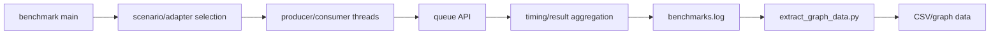

# D02 执行轨迹

- 文档目的：从 benchmark main 追踪到队列操作和结果文件。
- 适用范围：本页及其直接关联的源码、测试和配置；第三方、生成物与动态结果仅在有证据时纳入。
- 对应源码版本：source/concurrency-queue HEAD 683b9e3（2026-09-15 只读确认）。
- 证据状态：静态路径已确认；实际场景和输出列待运行确认。
- 最后更新：2026-09-10
- 前置阅读：[D02 README](README.md)
- 后续阅读：[M06](../../01-modules/M06-benchmarks/README.md)
## 结论摘要

本页聚焦 80-demos/D02-benchmark-run/execution-trace.md；具体事实以正文引用的目标源码版本为准，未执行的构建、运行和硬件行为保持未验证。

## 重要限制

不同 adapter 可能使用不同语义、预分配方式和线程模型；比较前必须检查场景是否等价。benchmark 的“最快”不代表满足某个 API 语义或异常安全要求。

## 相关文档
- [项目入口](../../README.md)
- [分析状态](../../00-overview/analysis-state.md)
- [源码证据索引](../../00-overview/evidence-index.md)

## 源码证据摘要
本页结论所需的源码路径和行号以 [源码证据索引](../../00-overview/evidence-index.md) 及正文引用为准；本页不把未执行的构建、运行或硬件行为写成已验证事实。

## 未解决问题
目标环境、动态构建/运行、硬件和外部依赖行为未在本轮执行；缺少直接证据的结论仍标记为未知或未验证。

## 下一步阅读建议
先阅读 [分析状态](../../00-overview/analysis-state.md)，再沿本页已有链接进入对应模块、Demo 或跨模块流程。
