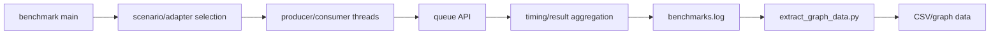

# D02 执行轨迹

- 文档目的：从 benchmark main 追踪到队列操作和结果文件。
- 证据状态：静态路径已确认；实际场景和输出列待运行确认。
- 最后更新：2026-09-10
- 前置阅读：[D02 README](README.md)
- 后续阅读：[M06](../../01-modules/M06-benchmarks/README.md)

## 重要限制

不同 adapter 可能使用不同语义、预分配方式和线程模型；比较前必须检查场景是否等价。benchmark 的“最快”不代表满足某个 API 语义或异常安全要求。
