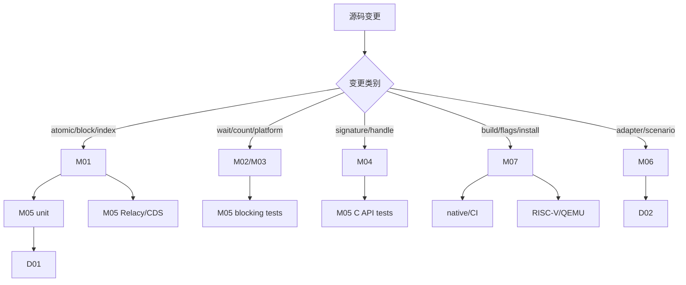

# 跨模块变更影响图

- 文档目的：把一个修改映射到实现、验证和交付范围。
- 证据状态：影响关系按源码依赖整理；实际回归范围需结合 patch。
- 最后更新：2026-09-10
- 前置阅读：[依赖地图](../00-overview/dependency-map.md)
- 后续阅读：[开发工作流](../99-roadmap/development-workflow.md)

## 核心协议改动最小集合

1. 重新检查 tail release/head acquire、overcommit、Guard 和 empty/recycle。
2. 编译并运行基本、bulk、异常、threaded tests。
3. 若改变 memory order 或 lock-free 结构，运行模型检查/压力测试。
4. 检查 blocking signal pairing、C ABI 和安装头文件是否受影响。
5. 更新 evidence-index 和 analysis-state。

## 不应默认执行

不要因为任何一个 header 改动就声称 benchmark 结果变化；不要因为 native 通过就省略 RISC-V 条件编译检查；不要为未受影响的第三方内部代码编造审计结论。
