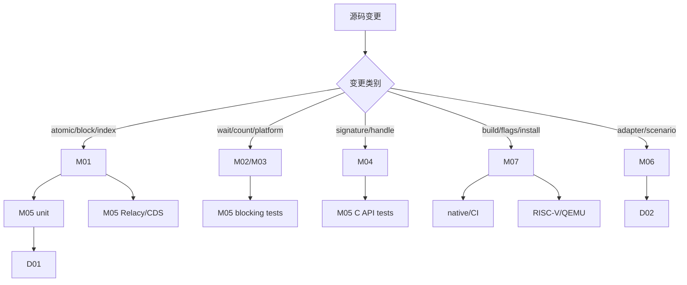

# 跨模块变更影响图

- 文档目的：把一个修改映射到实现、验证和交付范围。
- 适用范围：本页及其直接关联的源码、测试和配置；第三方、生成物与动态结果仅在有证据时纳入。
- 对应源码版本：source/concurrency-queue HEAD 683b9e3（2026-09-15 只读确认）。
- 证据状态：影响关系按源码依赖整理；实际回归范围需结合 patch。
- 最后更新：2026-09-10
- 前置阅读：[依赖地图](../00-overview/dependency-map.md)
- 后续阅读：[开发工作流](../99-roadmap/development-workflow.md)
## 结论摘要

本页聚焦 90-cross-module/change-impact-map.md；具体事实以正文引用的目标源码版本为准，未执行的构建、运行和硬件行为保持未验证。

## 核心协议改动最小集合

1. 重新检查 tail release/head acquire、overcommit、Guard 和 empty/recycle。
2. 编译并运行基本、bulk、异常、threaded tests。
3. 若改变 memory order 或 lock-free 结构，运行模型检查/压力测试。
4. 检查 blocking signal pairing、C ABI 和安装头文件是否受影响。
5. 更新 evidence-index 和 analysis-state。

## 不应默认执行

不要因为任何一个 header 改动就声称 benchmark 结果变化；不要因为 native 通过就省略 RISC-V 条件编译检查；不要为未受影响的第三方内部代码编造审计结论。

## 相关文档
- [项目入口](../README.md)
- [分析状态](../00-overview/analysis-state.md)
- [源码证据索引](../00-overview/evidence-index.md)

## 源码证据摘要
本页结论所需的源码路径和行号以 [源码证据索引](../00-overview/evidence-index.md) 及正文引用为准；本页不把未执行的构建、运行或硬件行为写成已验证事实。

## 未解决问题
目标环境、动态构建/运行、硬件和外部依赖行为未在本轮执行；缺少直接证据的结论仍标记为未知或未验证。

## 下一步阅读建议
先阅读 [分析状态](../00-overview/analysis-state.md)，再沿本页已有链接进入对应模块、Demo 或跨模块流程。
