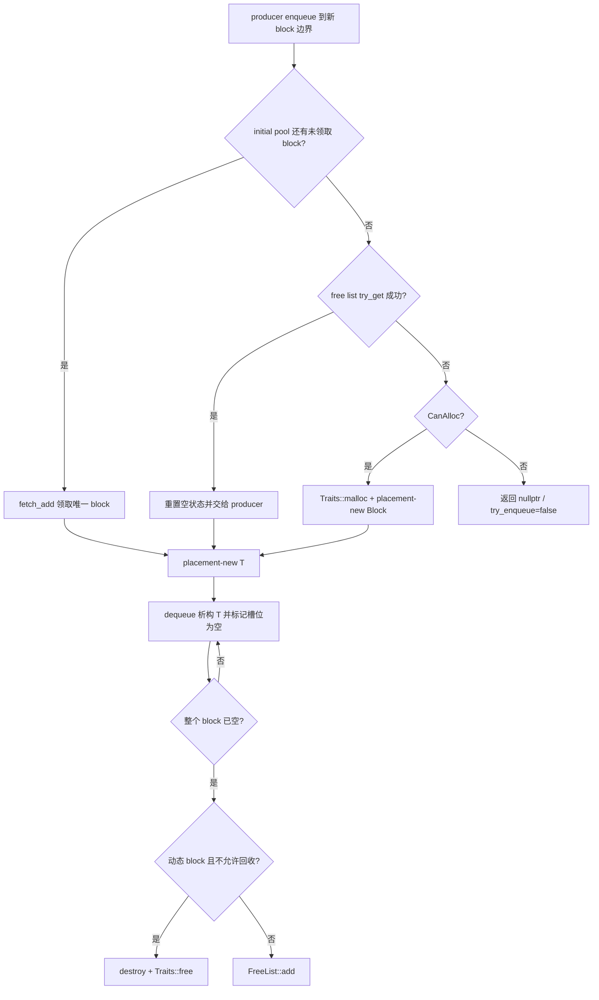

# 池化与资源管理专题

- 文档目的：说明 block、producer、索引和信号量资源如何创建、复用与释放。
- 适用范围：`concurrentqueue` `683b9e31ea15eb69f1b81cc1defc7850d5f20b71`。
- 对应源码版本：`master` / `683b9e3`。
- 证据状态：静态源码与单元测试已确认；跨平台等待行为未验证。
- 最后更新：2026-09-14
- 前置阅读：[运行时模型](../00-overview/runtime-model.md)、[M01 实现](../01-modules/M01-core-queue/implementation.md)
- 后续阅读：[线程与生命周期](threading-lifecycle.md)、[变更影响](change-impact-map.md)

## 结论摘要

`ConcurrentQueue` 不是通用 allocator，而是把元素存储按固定大小 `Block` 池化。队列构造时一次创建 initial block pool；producer 需要新块时依次尝试初始池、全局 free list，最后才按 `AllocationMode` 决定是否动态分配。[source/concurrency-queue/concurrentqueue.h:833-878] [source/concurrency-queue/concurrentqueue.h:3068-3143]

动态 block 的回收策略由 `Traits::RECYCLE_ALLOCATED_BLOCKS` 控制。默认值为 `false`：隐式 producer 归还动态块时直接释放，初始池块进入 free list；设为 `true` 才让动态块继续留在队列内复用。显式 producer 则长期持有其环形 block 链，token 析构只把 producer 标记为 inactive，不立即释放 block。[source/concurrency-queue/concurrentqueue.h:396-404] [source/concurrency-queue/concurrentqueue.h:715-721] [source/concurrency-queue/concurrentqueue.h:3096-3107]

因此，“队列已空”不等于“内存已归还给系统”。显式 producer、初始池和启用动态块回收时的 free-list 节点，通常都要等 queue 析构才最终释放；调用方必须先停止所有并发访问。[source/concurrency-queue/concurrentqueue.h:875-919] [source/concurrency-queue/tests/unittests/unittests.cpp:1010-1151]

Graph 边界：核心 `ConcurrentQueue`/`BlockingConcurrentQueue` 没有 GPU/CUDA Graph、capture/replay 或执行图内存池。源码中的 graph 主要来自 benchmark 使用的 TBB/dlib 依赖，不属于队列对象模型；本专题不把它们写成该项目的 Graph 资源。

## 池与资源清单

| 资源 | 创建者 | 运行期所有者 | 复用条件 | 最终释放 | 状态 |
|---|---|---|---|---|---|
| initial block pool | queue 构造函数 | `ConcurrentQueue` | block 槽位全部析构并归还 free list | queue 析构的 `destroy_array` | 已确认 |
| 动态 `Block` | `requisition_block<CanAlloc>` | explicit producer 或 implicit producer/free list | `RECYCLE_ALLOCATED_BLOCKS=true`，或它本来属于 initial pool | 默认可在 implicit 回收时释放；其余在 queue 析构释放 | 已确认 |
| `T` 槽位对象 | enqueue 的 placement-new | 对应 block | 不复用活对象；dequeue 后显式析构 | dequeue、异常 guard 或 producer 析构 | 已确认 |
| explicit producer | `ProducerToken` 构造路径 | queue 的 producer list | token 析构后 `inactive=true`，后续 token CAS 领取 | queue 析构 | 已确认 |
| implicit producer | 首次无 token 入队 | queue producer list + thread-id hash | 线程退出监听把 hash 槽标为 reusable，再把 producer 置 inactive | queue 析构 | 已确认（TLS 分支受平台宏影响） |
| block index/hash 历史表 | producer/hash resize | producer 或 queue | 不直接回缩；旧表通过 `prev` 链保留 | producer/queue 析构 | 已确认 |
| blocking semaphore | `BlockingConcurrentQueue` | blocking queue | permit 随成功 enqueue/successful wait 配对 | blocking queue 析构 | 已确认；销毁时存在 waiter 属调用方错误 |

## Block 请求与回收链路

入口和选择顺序在 `populate_initial_block_list`、`try_get_block_from_initial_pool`、`try_get_block_from_free_list` 与 `requisition_block` 中直接给出。[source/concurrency-queue/concurrentqueue.h:3068-3143]

`Block::set_empty`/`set_many_empty` 使用 empty flags 或 `elementsCompletelyDequeued` 计数证明最后一个活槽位已经完成销毁；只有满足这一条件才能回收 block。[source/concurrency-queue/concurrentqueue.h:1588-1697]

## FreeList 的并发安全边界

`FreeList` 是 CAS 栈，但它没有使用 hazard pointer，也不允许节点在 list 仍可被并发观察时释放。实现用 `freeListRefs` 的低 31 位保存临时引用，高位保存 SHOULD_BE_ON_FREELIST；`try_get` 先取得引用再读取 next，成功 CAS 移除后减去“临时引用 + list 引用”。[source/concurrency-queue/concurrentqueue.h:1466-1571]

关键约束：节点直到 free list 整体销毁前都不能被任意释放。默认不回收的动态 block 在进入 free list 之前由 `add_block_to_free_list` 直接销毁，避免破坏该约束；已经进入 list 的节点由 queue 析构在无并发条件下遍历释放。[source/concurrency-queue/concurrentqueue.h:1474-1477] [source/concurrency-queue/concurrentqueue.h:903-919] [source/concurrency-queue/concurrentqueue.h:3096-3107]

## Producer 生命周期与内存驻留

1. `ProducerToken(queue)` 调用 `recycle_or_create_producer(true)`，优先 CAS 领取同类型 inactive producer；没有可复用对象时才创建。[source/concurrency-queue/concurrentqueue.h:3256-3306] [source/concurrency-queue/concurrentqueue.h:3713-3727]
2. token move 会重新绑定 `producer->token`；token 析构只清空反向指针并 release-store `inactive=true`。[source/concurrency-queue/concurrentqueue.h:679-721]
3. explicit producer 的 block/index 没有随 token 销毁释放，目的是让下一 token 复用热状态；其代价是峰值 producer 数量决定驻留内存上界之一。[source/concurrency-queue/tests/unittests/unittests.cpp:1210-1363]
4. implicit producer 的 hash key 在线程退出时被替换为 reusable sentinel，随后 producer 进入 inactive 状态；无 TLS/thread-exit 支持的平台需要按实际宏分支验证回收时机。[source/concurrency-queue/concurrentqueue.h:3509-3599]

## 配置到资源行为

| 配置/调用 | 行为 | 影响 |
|---|---|---|
| 构造 `capacity` | 向上换算为 block 数，一次创建 initial pool | 降低早期分配；不是严格容量上限 |
| 三参数构造 | 按容量和 explicit/implicit producer 上限估算 block 数 | producer 多时预留更多块 |
| `BLOCK_SIZE` | 决定每块槽位数和空状态实现分支 | 影响浪费、索引频率、缓存局部性 |
| `RECYCLE_ALLOCATED_BLOCKS=false` | implicit producer 的动态空块直接释放 | 降低长期驻留，增加再次扩张分配 |
| `RECYCLE_ALLOCATED_BLOCKS=true` | 动态空块进入 global free list | 降低抖动，峰值内存可长期驻留 |
| `try_enqueue` | 走 `CannotAlloc` 路径 | 只能用现有 block/index；不足时返回 `false` |
| `enqueue` | 走 `CanAlloc` 路径 | 可调用 traits allocator；分配失败仍可能返回 `false` |

证据：[source/concurrency-queue/concurrentqueue.h:823-878] [source/concurrency-queue/concurrentqueue.h:1010-1138] [source/concurrency-queue/concurrentqueue.h:3068-3143]

## 正常、失败与清理路径

| 路径 | 已取得资源 | 处理 | 可观察结果 |
|---|---|---|---|
| 正常 enqueue/dequeue | producer、block、一个 `T` 槽位 | 发布 tail；消费后析构 `T`，最后槽位触发 block 回收 | enqueue/dequeue 成功 |
| `CannotAlloc` 无块 | 无新资源 | 不调用 allocator，返回失败 | `try_enqueue=false` |
| block/index 分配失败 | 可能已临时取得 block | 回滚 index/tail，归还或销毁 block | enqueue 返回 false 或构造异常传播 |
| `T` 构造抛异常 | block 槽位未发布 | 撤销已准备的结构，不能把半构造对象暴露给 consumer | 异常传播 |
| dequeue 输出赋值抛异常 | 元素已经被 consumer claim | guard 仍析构内部 `T` 并更新空状态 | 元素不会重新入队 |
| queue 析构 | producer/hash/free-list/initial pool | 要求无并发访问，逐层析构 | allocator 计数最终配平 |

异常安全主链见 [source/concurrency-queue/concurrentqueue.h:1877-2081]；析构闭环见 [source/concurrency-queue/concurrentqueue.h:875-919]。

## 测试证据与建议

- `block_alloc` 对比默认策略与 `RECYCLE_ALLOCATED_BLOCKS=true`：默认 implicit 动态 block 在队列仍存活时已有一次 `free`，回收策略则到 queue 析构才统一释放。[source/concurrency-queue/tests/unittests/unittests.cpp:1010-1202]
- `producer_reuse` 用“最大同时存活 token 数”验证 explicit producer 复用，并在线程退出场景检查 implicit producer 分配不会无界按线程次数增长。[source/concurrency-queue/tests/unittests/unittests.cpp:1275-1460]
- `core_free_list` 覆盖空表、单节点复用和多线程 ABA 压力路径。[source/concurrency-queue/tests/unittests/unittests.cpp:4852-4925]

后续若修改池化策略，应至少新增：固定分配失败点、构造异常、超对齐类型、block 边界 bulk 操作、queue move、线程退出复用，以及 ASan/TSan 与 Relacy free-list 验证。

## 风险与设计取舍

| 风险/取舍 | 触发条件 | 影响 | 控制方法 |
|---|---|---|---|
| 队列为空但内存不下降 | explicit producer 多或开启动态 block 回收 | 驻留内存接近历史峰值 | 预估 producer 上限；按负载选择 recycle trait；销毁并重建 queue |
| 提前销毁 queue | token、worker 或 waiter 仍访问 | 悬空指针/未定义行为 | 先停止线程并 join，再销毁 queue |
| 自定义 allocator 契约不完整 | 返回未对齐地址、错误释放、线程不安全 | 越界、崩溃、泄漏 | 保证 malloc/free 配对和最大对齐；运行 tracking allocator 测试 |
| block size 不适配对象 | 大对象或 producer 多且每个流很浅 | 内部碎片和缓存压力 | 用真实负载 benchmark，不把 `capacity` 当严格上限 |
| free-list 协议误改 | 释放仍可见节点或弱化原子序 | ABA/UAF/丢块 | 保留引用位协议并跑模型检查和并发压力测试 |

## 相关文档

- [M01 数据结构](../01-modules/M01-core-queue/data-structures.md)
- [M01 行级分析](../01-modules/M01-core-queue/line-level-analysis.md)
- [错误边界](error-boundaries.md)
- [ABI 与分配](abi-and-allocation.md)

## 源码证据摘要

池配置与 allocator：[source/concurrency-queue/concurrentqueue.h:396-430]；queue 构造/析构：[source/concurrency-queue/concurrentqueue.h:823-919]；free list：[source/concurrency-queue/concurrentqueue.h:1466-1571]；block 空状态：[source/concurrency-queue/concurrentqueue.h:1588-1714]；block pool：[source/concurrency-queue/concurrentqueue.h:3068-3143]；producer 复用：[source/concurrency-queue/concurrentqueue.h:3256-3306]。

## 未解决问题

- 各目标架构上的 atomic 是否真正 lock-free，需要运行时 `is_lock_free` 和平台实验。
- TLS/thread-exit notifier 的平台分支、销毁竞态和进程退出顺序尚未逐平台验证。
- benchmark 尚未形成不同 `BLOCK_SIZE`/recycle 策略的稳定内存—吞吐曲线。

## 下一步阅读建议

先沿 block 请求图阅读 M01 enqueue/dequeue，再用 `block_alloc` 和 `producer_reuse` 测试观察内存计数。
