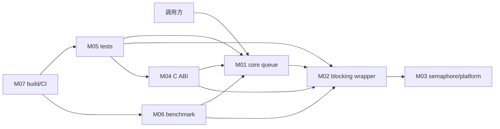

# 跨模块系统串联

- 文档目的：把 M01–M07 和 D01/D02 连接成可追踪系统路径。
- 适用范围：本页及其直接关联的源码、测试和配置；第三方、生成物与动态结果仅在有证据时纳入。
- 对应源码版本：source/concurrency-queue HEAD 683b9e3（2026-09-15 只读确认）。
- 证据状态：主要调用和构建关系已确认；运行结果未验证。
- 最后更新：2026-09-10
- 前置阅读：[总体架构](../00-overview/architecture.md)
- 后续阅读：[错误边界](error-boundaries.md)
## 结论摘要

本页聚焦 90-cross-module/system-wiring.md；具体事实以正文引用的目标源码版本为准，未执行的构建、运行和硬件行为保持未验证。

## 运行时串联



箭头含义：M02 组合 M01/M03；M04 转发到 M01/M02；M05/M06 调用被测 API；M07 构建或运行验证产物。M07 不参与 queue 运行时调度。

## 一条完整路径

`D01 shell command → unit main → selected test → C++ API/wrapper → producer/block/semaphore → object state change → assertion/tracking allocator → process exit`。

## 资源闭环

```text
queue constructor
  -> initial pool/hash
  -> producer requisition
  -> placement-new T
  -> dequeue destructor
  -> empty block/free list
  -> queue destructor
```

token、waiter 和 C handle 都是外部生命周期边界：库不会替调用方决定何时停止线程或释放 opaque value。

## 维护顺序

改公共核心协议：M01 → M05 unit/model → M02/M03（若 blocking 受影响）→ M04（若 ABI 受影响）→ CI/benchmark。改构建配置：先 M07，再执行受影响产物。

## 相关文档
- [项目入口](../README.md)
- [分析状态](../00-overview/analysis-state.md)
- [源码证据索引](../00-overview/evidence-index.md)

## 源码证据摘要
本页结论所需的源码路径和行号以 [源码证据索引](../00-overview/evidence-index.md) 及正文引用为准；本页不把未执行的构建、运行或硬件行为写成已验证事实。

## 未解决问题
目标环境、动态构建/运行、硬件和外部依赖行为未在本轮执行；缺少直接证据的结论仍标记为未知或未验证。

## 下一步阅读建议
先阅读 [分析状态](../00-overview/analysis-state.md)，再沿本页已有链接进入对应模块、Demo 或跨模块流程。
