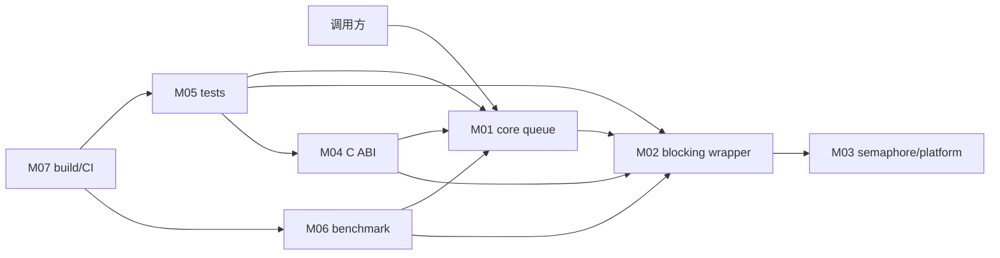

# 跨模块系统串联

- 文档目的：把 M01–M07 和 D01/D02 连接成可追踪系统路径。
- 证据状态：主要调用和构建关系已确认；运行结果未验证。
- 最后更新：2026-09-10
- 前置阅读：[总体架构](../00-overview/architecture.md)
- 后续阅读：[错误边界](error-boundaries.md)

## 运行时串联



箭头含义：M02 组合 M01/M03；M04 转发到 M01/M02；M05/M06 调用被测 API；M07 构建或运行验证产物。M07 不参与 queue 运行时调度。

## 一条完整路径

`D01 shell command → unit main → selected test → C++ API/wrapper → producer/block/semaphore → object state change → assertion/tracking allocator → process exit`。

## 资源闭环

```text
queue constructor
  -> initial pool/hash
  -> producer requisition
  -> placement-new T
  -> dequeue destructor
  -> empty block/free list
  -> queue destructor
```

token、waiter 和 C handle 都是外部生命周期边界：库不会替调用方决定何时停止线程或释放 opaque value。

## 维护顺序

改公共核心协议：M01 → M05 unit/model → M02/M03（若 blocking 受影响）→ M04（若 ABI 受影响）→ CI/benchmark。改构建配置：先 M07，再执行受影响产物。
