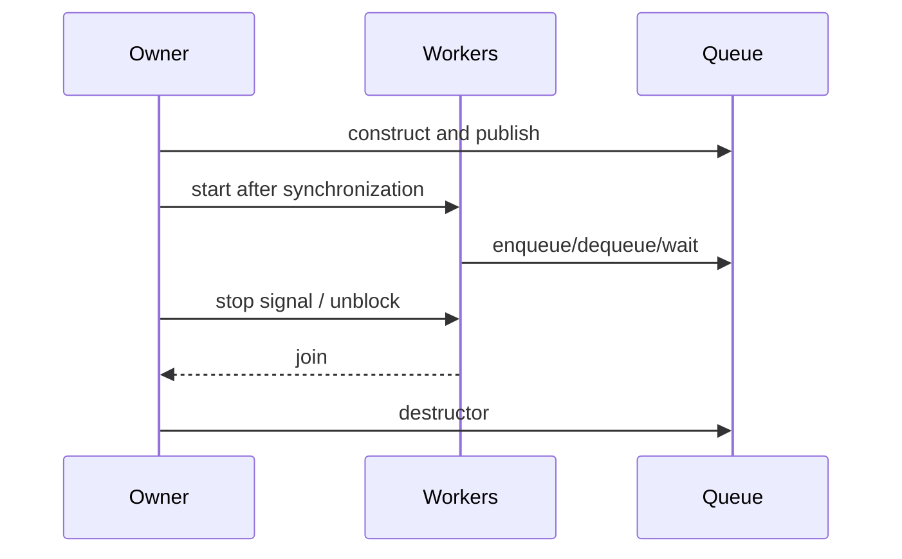

# 跨模块线程与生命周期

- 文档目的：解释调用方线程、producer、consumer、waiter 和析构 owner 的关系。
- 适用范围：本页及其直接关联的源码、测试和配置；第三方、生成物与动态结果仅在有证据时纳入。
- 对应源码版本：source/concurrency-queue HEAD 683b9e3（2026-09-15 只读确认）。
- 证据状态：队列契约和静态生命周期已确认。
- 最后更新：2026-09-10
- 前置阅读：[运行时模型](../00-overview/runtime-model.md)
- 后续阅读：[调试指南](../99-roadmap/debugging-guide.md)
## 结论摘要

本页聚焦 90-cross-module/threading-lifecycle.md；具体事实以正文引用的目标源码版本为准，未执行的构建、运行和硬件行为保持未验证。

## 角色

| 角色 | 可做 | 不应做 |
|---|---|---|
| producer thread | 复用自己的 explicit token 或 implicit producer 入队 | 与另一个线程并发共享同一 token |
| consumer thread | 使用 queue 或自己的 consumer token 出队 | 在 queue owner 析构后继续访问 |
| blocking waiter | wait/timed wait，按业务协议退出 | queue 析构时仍阻塞 |
| queue owner | 初始化、停止协议、join、析构 | 未同步发布对象后立刻让 worker 使用 |
| C caller | create/calls/destroy handle，管理 value | 把 opaque handle 当可复制对象或忽略返回码 |

## 生命周期图

库内部原子只覆盖队列算法协议，不替代应用的 start/stop/join 协议。

## 相关文档
- [项目入口](../README.md)
- [分析状态](../00-overview/analysis-state.md)
- [源码证据索引](../00-overview/evidence-index.md)

## 源码证据摘要
本页结论所需的源码路径和行号以 [源码证据索引](../00-overview/evidence-index.md) 及正文引用为准；本页不把未执行的构建、运行或硬件行为写成已验证事实。

## 未解决问题
目标环境、动态构建/运行、硬件和外部依赖行为未在本轮执行；缺少直接证据的结论仍标记为未知或未验证。

## 下一步阅读建议
先阅读 [分析状态](../00-overview/analysis-state.md)，再沿本页已有链接进入对应模块、Demo 或跨模块流程。
