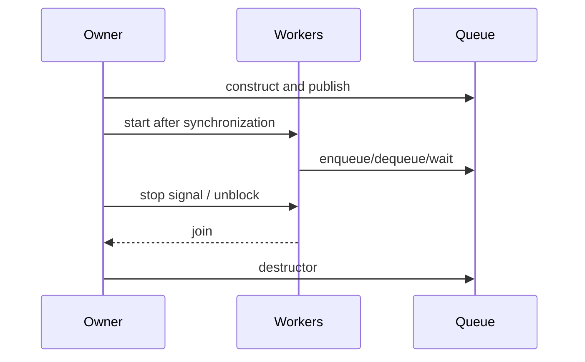

# 跨模块线程与生命周期

- 文档目的：解释调用方线程、producer、consumer、waiter 和析构 owner 的关系。
- 证据状态：队列契约和静态生命周期已确认。
- 最后更新：2026-09-10
- 前置阅读：[运行时模型](../00-overview/runtime-model.md)
- 后续阅读：[调试指南](../99-roadmap/debugging-guide.md)

## 角色

| 角色 | 可做 | 不应做 |
|---|---|---|
| producer thread | 复用自己的 explicit token 或 implicit producer 入队 | 与另一个线程并发共享同一 token |
| consumer thread | 使用 queue 或自己的 consumer token 出队 | 在 queue owner 析构后继续访问 |
| blocking waiter | wait/timed wait，按业务协议退出 | queue 析构时仍阻塞 |
| queue owner | 初始化、停止协议、join、析构 | 未同步发布对象后立刻让 worker 使用 |
| C caller | create/calls/destroy handle，管理 value | 把 opaque handle 当可复制对象或忽略返回码 |

## 生命周期图

库内部原子只覆盖队列算法协议，不替代应用的 start/stop/join 协议。
