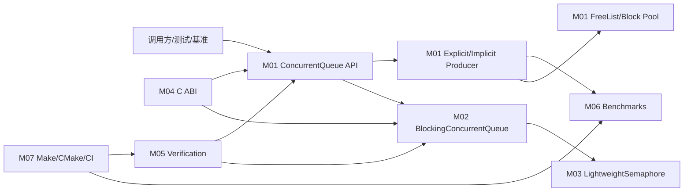

# concurrentqueue 项目理解知识库

- 文档目的：提供从整体架构到源码实现、Demo、测试和开发实践的统一入口。
- 适用范围：仓库 `master` 当前提交 `683b9e31ea15eb69f1b81cc1defc7850d5f20b71`（`v1.0.5-6-g683b9e3`）。
- 证据状态：总体模型已确认；部分性能、动态调度和未执行命令为推断或未验证。
- 最后更新：2026-09-10
- 前置阅读：无
- 后续阅读：[项目概览](00-overview/project-overview.md)、[架构](00-overview/architecture.md)、[模块注册表](01-modules/module-registry.md)

## 5 分钟理解

`concurrentqueue` 是一个 C++11 header-only 无锁多生产者/多消费者队列。用户调用 `ConcurrentQueue<T>::enqueue` 或 `try_dequeue`；队列内部将数据分散到每个 producer 的块状子队列，再通过 producer 链表和原子计数协调消费者。显式 token 可复用 producer/consumer 状态，隐式 API 则按线程查找或创建 implicit producer。阻塞版本在同一核心队列外加轻量信号量，使消费者可以等待数据。

核心不变量是：对象完成构造且构造效果对工作线程可见后才能并发使用；销毁前必须停止所有访问。该队列保证单个 producer 的顺序，但不提供独立 producer 之间的全局线性化顺序。[README.md:47-63](../../README.md#L47-L63) 和 [concurrentqueue.h:823-919](../../concurrentqueue.h#L823-L919)

## 总体架构



箭头表示源码调用、依赖或测试使用关系；不是进程间通信。M01–M07 的证据和边界见 [模块注册表](01-modules/module-registry.md)。

## 模块摘要

| ID | 模块 | 一句话职责 | 深度状态 |
|---|---|---|---|
| M01 | [core-queue](01-modules/M01-core-queue/README.md) | 块状 producer 子队列、原子协调、回收和核心 API | 部分完成（核心实现已展开，逐模块文档持续补齐） |
| M02 | [blocking-queue](01-modules/M02-blocking-queue/README.md) | 用信号量为核心队列增加等待/超时接口 | 部分完成 |
| M03 | [semaphore-and-platform](01-modules/M03-semaphore-and-platform/README.md) | 自旋、计数和平台 semaphore 适配 | 部分完成 |
| M04 | [c-api](01-modules/M04-c-api/README.md) | C ABI 不透明句柄包装 | 部分完成 |
| M05 | [verification](01-modules/M05-verification/README.md) | 单元、模糊、并发和模型检查验证 | 部分完成 |
| M06 | [benchmarks](01-modules/M06-benchmarks/README.md) | 对比测量和结果提取 | 部分完成 |
| M07 | [packaging-and-ci](01-modules/M07-packaging-and-ci/README.md) | Make/CMake 安装、构建和 CI | 部分完成 |

## 三条关键流程

1. **隐式入队/出队**：`ConcurrentQueue::enqueue` → `inner_enqueue` → `get_or_add_implicit_producer` → `ImplicitProducer::enqueue` → placement-new + release `tailIndex`；消费者通过 producer 链表选择子队列，再由子队列原子领取 head。详见 [M01 调用链](01-modules/M01-core-queue/call-chains.md)。
2. **阻塞消费**：`BlockingConcurrentQueue::enqueue` 成功后 signal 信号量；`wait_dequeue` 先等待许可，再调用内部 `try_dequeue`。详见 [M02 执行流程](01-modules/M02-blocking-queue/execution-flows.md)。
3. **测试执行**：Makefile 编译 C API 和测试源 → `unittests::main` 注册/解析选项 → `TestClass::run` 执行测试 → `postTest` 检查分配追踪 → 返回进程状态。详见 [D01 Demo](80-demos/D01-unit-test-smoke/README.md)。

## Demo 入口

- [D01-unit-test-smoke](80-demos/D01-unit-test-smoke/README.md)：主端到端测试轨迹；构建命令来自 `build/makefile` 和 CI，当前运行状态见 Demo 文档。
- [D02-benchmark-run](80-demos/D02-benchmark-run/README.md)：基准程序入口和测量轨迹。
- [Demo 注册表](80-demos/demo-registry.md)

## 构建和运行入口

```sh
cd build && make tests
./build/bin/unittests --disable-prompt --iterations 1
cd build && make benchmarks && ./bin/benchmarks
cmake -S . -B cmake-build && cmake --build cmake-build
```

这些命令的源码依据、验证状态和限制见 [构建总览](00-overview/build-and-deploy.md)；CMake 不生成测试目标。

## 推荐阅读路径

- 初学者：本页 → [项目概览](00-overview/project-overview.md) → [运行时模型](00-overview/runtime-model.md) → M01 README → D01 执行轨迹。
- 修改核心算法：架构 → [M01 design](01-modules/M01-core-queue/design.md) → [implementation](01-modules/M01-core-queue/implementation.md) → [line-level-analysis](01-modules/M01-core-queue/line-level-analysis.md) → M05 测试。
- 调试阻塞问题：M02 → M03 → [跨模块错误边界](90-cross-module/error-boundaries.md) → [调试指南](99-roadmap/debugging-guide.md)。
- 扩展 C 接口：M04 interfaces → [变更影响图](90-cross-module/change-impact-map.md) → 测试配方。

## 覆盖矩阵与状态

| 目标 | 证据入口 | 状态 |
|---|---|---|
| 核心队列 | `concurrentqueue.h`、M01、D01 | 已覆盖主路径；深度审计部分完成 |
| 阻塞/信号量 | `blockingconcurrentqueue.h`、`lightweightsemaphore.h`、M02/M03 | 已覆盖静态路径；运行验证待记录 |
| C ABI | `c_api/*`、M04、D01 C API 测试 | 已覆盖基本调用链 |
| 测试/基准 | `tests/*`、`benchmarks/*`、M05/M06 | 已覆盖入口和构建边界 |
| 安装/CI | `CMakeLists.txt`、`.github/workflows/ci.yml`、M07 | 已确认源码配置 |
| 端到端 Demo | D01、D02 | 静态确认；是否执行以文档为准 |

完整进度、缺口和深度审计见 [analysis-state.md](00-overview/analysis-state.md)。

## 相关文档

- [总览层](00-overview/)
- [模块层](01-modules/module-registry.md)
- [Demo 层](80-demos/demo-registry.md)
- [跨模块层](90-cross-module/system-wiring.md)
- [实践层](99-roadmap/quick-start.md)

## 源码证据摘要

核心入口集中在 `concurrentqueue.h:786-1420`；块和 producer 实现在 `concurrentqueue.h:1466-3061`；回收和隐式 producer 管理在 `concurrentqueue.h:3064-3550`；阻塞接口在 `blockingconcurrentqueue.h:117-548`；信号量在 `lightweightsemaphore.h:280-437`。

## 未解决问题

- 当前环境是否具备完整 GNU 编译器、Linux `-lrt`、RISC-V 交叉编译器和 QEMU，未在知识库生成阶段自动假定。
- 真实高并发性能数值、benchmark 完整输出和不同平台 semaphore 分支需要执行验证。

## 下一步阅读建议

先阅读 [M01 implementation](01-modules/M01-core-queue/implementation.md)，再阅读 [D01 execution trace](80-demos/D01-unit-test-smoke/execution-trace.md)。
