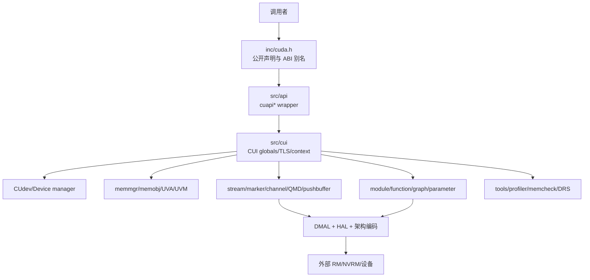

# 总体架构

- 文档目的：说明公开入口、内部运行时、资源管理、硬件抽象与外部驱动之间的分层关系。
- 适用范围：CUDA Driver API 主线，兼顾 OpenCL/工具旁路。
- 对应源码版本：CUDA 10.2 API 字段；提交未知。
- 证据状态：核心层次已确认，末端硬件调用部分推断。
- 最后更新：2026-09-11
- 前置阅读：[项目定位](project-overview.md)
- 后续阅读：[运行时模型](runtime-model.md)、[系统串联](../90-cross-module/system-wiring.md)

## 结论摘要

架构采用“公开 API wrapper → CUI（CUDA internal）对象/状态层 → 资源与调度层 → DMAL/HAL → RM/NVRM”的纵向路径；同时通过生成 API 表、导出 `.def`、架构条件编译和工具回调保持 ABI、平台和诊断能力。API wrapper 负责 ABI 版本、句柄、参数和初始化检查，CUI 才真正持有 context、memobj、stream、module/function 等状态并操作资源。

## 分层图

节点对应：M01–M08。箭头表示控制调用、对象访问或资源提交；外部 RM/NVRM 节点是当前源码边界，不能假装其内部实现已读。

## 关键设计结构

### API/ABI 层

`inc/cuda.h` 通过 `cuMemAlloc -> cuMemAlloc_v2`、PTDS/PTSZ 宏等维持符号兼容（`inc/cuda.h:76-170`），`.def` 文件列出公开导出（`src/cuda_master.def:21-99`）。构建时 `cuda.nvmk` 将 API 文件和生成 API 文件纳入 `CUDA_OBJECTS`，最后由 `LIBCUDA_OBJECTS` 链接。

### CUI 过程状态

`cuiInitInternal` 按依赖顺序创建 TLS、性能状态、全局状态、portable memory manager、平台属性、UVM manager、UVA manager、user VA manager、heap 和 primary memory managers；任一步失败跳到统一销毁段（`src/cui/cuiinit.c:3071-3208`）。这使“初始化完成”成为后续 API 的前置条件。

### 句柄和所有权

Context、stream、module/function、memobj 等是内部结构的指针/句柄。API 先从 TLS 找 current context，再在 context 或 pool 锁下修改状态。以 stream 为例，创建时从 pool 取对象，按需分配 QMD、UVM semaphore、CPU semaphore，建立 public handle 并登记 UVM；销毁先注销/释放异步资源，再放入 detached/free pool（`src/cui/cuistream.c:1740-1878,2004-2076`）。

### 硬件抽象

`CUdev->hal` 提供架构相关操作；Kernel launch 在 CUI 中完成参数/内存追踪和通用状态准备，再调用 `hal.launchCheck`、`encodeAbiConstBankGridParams` 等硬件特化操作（`src/cui/cuilaunch.c:229-319`）。实际启用哪个架构由 `NVCFG_GLOBAL_ARCH_*` 和 `cuda.nvmk` 条件决定，当前没有完整构建配置，属于未知。

## 结构性约束

- API wrapper 不应直接持有硬件资源；新行为通常应进入 CUI，避免 ABI 和内部状态耦合。
- CUI 的 context lock、stream pool lock、全局 mutex 有既定顺序；stream 创建特别在释放 context lock 后才登记 QMD semaphore（`src/api/apistream.c:82-108`），说明锁序是正确性约束。
- 异步操作的 API 返回不等于 GPU 工作完成；需要 marker/semaphore/stream synchronize 才能观察完成。

## 相关文档

- [设计原则](design-principles.md)
- [全局数据流](global-data-flow.md)
- [模块注册表](../01-modules/module-registry.md)

## 源码证据摘要

- `[src/api/apilaunch.c:234-299]` context/function/stream 关联及 capture 分支。
- `[src/cui/cuilaunch.c:176-217,242-319]` launch memory tracking、syscall callback、HAL check 和 ABI 编码。

## 未解决问题

DMAL 到 RM 的确切函数链、动态加载的模块实现选择和每个架构 HAL 的完整差异需要外部依赖或运行时构建日志。

## 下一步阅读建议

沿 [D01 执行轨迹](../80-demos/D01-cuda-test-memory-stream/execution-trace.md) 阅读具体对象如何跨层。
