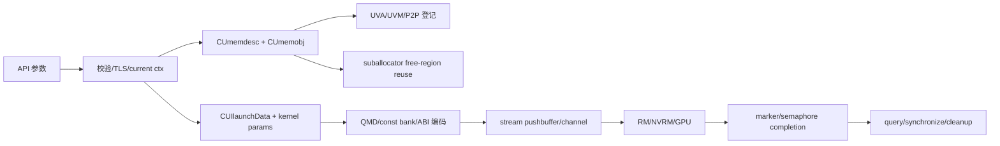

# 全局数据流

- 文档目的：描述初始化、指针、任务、完成信号和错误在系统中的传播。
- 适用范围：Driver API 内存与 Kernel launch 主线。
- 对应源码版本：CUDA 10.2 API 字段；提交未知。
- 证据状态：静态确认。
- 最后更新：2026-09-11
- 前置阅读：[运行时模型](runtime-model.md)
- 后续阅读：[端到端流程](../90-cross-module/end-to-end-flows.md)

## 结论摘要

外部参数先变成内部对象和描述符，再进入异步资源队列：host pointer/device pointer → `CUmemobj`/`CUmemdesc`；kernel 参数 → `CUIlaunchData`/packed buffer/QMD；stream → channel/marker/semaphore；最终 GPU 完成通过 marker/semaphore 使 host 查询、同步或 detached 回收可观察。

## 数据流图

## 内存对象流

`cuapiMemAlloc_common` 将 owner、location、apiSource、mapDevice 写入 `CUmemdesc`（`src/api/apimem.c:89-95`），在 context lock 下调用 `memobjAlloc`，之后调用 `memglobalsRegisterMemobj` 创建全局/P2P 关系，并通知 tools，最终返回 `memobjGetDevicePtr`（`:97-117`）。Free 先通过 unified VA 或当前 memmgr 找回对象，再检查 `apiSource` 和 base pointer，最后通知 tools 并 `memobjFree`（`:279-...`、`src/cui/cuimem.c:165-186`）。

对于可 suballocate 的请求，`memobjAllocMemblockBacking` 先按完整 descriptor 选择兼容 radix tree，再从已有 memblock 取 best-fit free region；未命中时才创建至少 `max(size, genericBlocksize)` 的新 block。free 将区域重新插入 tree 并合并相邻空闲区，最后一个 memobj 才触发 DMAL/UVA backing 释放（静态确认：[src/cui/memobj.c:265-375,878-943]；[src/cui/suballocator.c:163-220,343-405]）。

## Launch 数据流

`cuiLaunchKernel_nonreentrant` 先验证 packed/参数 metadata，设置 block shape 和 shared size，校验 grid，然后调用 `cuiProfilerLaunch`（`src/api/apilaunch.c:140-179`）。CUI setup 会追踪 function、syscall、context、module、reference 参数关联内存（`src/cui/cuilaunch.c:163-217`），调用 syscall callback、`hal.launchCheck`、常量 bank 和架构 ABI 编码（`:242-319`）。

Graph capture 将同一入口转为 graph node；instantiate 再将 node 转为 per-context QMD/constant-bank/internal stream/marker 资源，并可创建 scheduler device backing。launch 的 memory tracking 和 completion marker 将这些引用延长到异步完成边界（静态确认：[src/api/apilaunch.c:252-286]；[src/cui/cuigraph.c:1835-1933,3495-3575,4056-4162]）。

## 错误流

每一跳返回 `CUresult`；API wrapper 遇错立即返回，资源创建失败则执行局部回滚。Context sticky error 在 `cuiInitCheckCtx` 中在正常检查后返回（`cuiinit.c:3031-3037`），因此一个异步设备错误可能在后续 API 被观察到。

## 相关文档

- [内存实现](../01-modules/M04-memory-uvm/implementation.md)
- [Launch 实现](../01-modules/M06-module-launch/implementation.md)
- [全局错误模型](global-error-model.md)

## 源码证据摘要

- `[src/cui/cuilaunch.c:176-217]` launch 内存追踪。
- `[src/cui/cuistream.c:1805-1866]` semaphore、stream ID、UVM registration。

## 未解决问题

当前树不能证明 GPU firmware 对 QMD/marker 的最终消费顺序，只能确认 host 侧准备和提交边界。

## 下一步阅读建议

对照 D01 数据状态表阅读。
