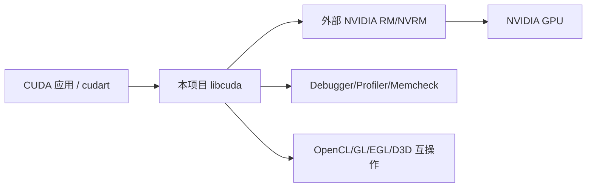

# 项目定位

- 文档目的：界定源码快照解决的问题、系统边界和证据范围。
- 适用范围：`source/cuda` 主源码、构建和测试。
- 对应源码版本：CUDA Driver API 10.2（源码推断）；提交未知。
- 证据状态：已确认与推断混合。
- 最后更新：2026-09-14
- 前置阅读：[根入口](../README.md)
- 后续阅读：[总体架构](architecture.md)

## 结论摘要

该项目是 NVIDIA 专有 CUDA 用户态驱动实现的一个源码快照，核心产物是 `libcuda`（并共享部分 OpenCL/互操作实现），为上层 CUDA Runtime、Driver API 调用和内部测试提供设备枚举、上下文、内存、流、模块、Kernel 提交、同步、工具集成及平台适配。它不是 CUDA Toolkit 的完整开源仓库，也不是普通 CUDA kernel 示例工程。

## 系统边界

**已确认**：公开 Driver API 从 `inc/cuda.h` 暴露，导出列表在 `src/cuda_master.def`；构建文件将 API 与 CUI 实现链接为 `libcuda`（`cuda.nvmk:1695-1704,1800-1817`）。**推断**：RM/NVRM 是设备资源最终管理者，因为本目录通过 `rm_*`、`nvrm` 接口和 dmal/HAL 适配接触它；其实现不在当前目录。

## 能力范围

| 能力 | 主实现 | 证据 |
|---|---|---|
| Driver API/ABI | `inc/`、`src/api/`、导出表 | `[inc/cuda.h:62-170]`、`[src/cuda_master.def:21-99]` |
| 进程初始化/TLS/全局状态 | `src/cui/cuiinit.c`、`cuitls.c` | `[src/cui/cuiinit.c:2909-2961,3060-3208]` |
| Context/device | `cuictx.c`、`cuidevice.c`、`devmgr.c` | `[src/cui/cuictx.c:240-385]` |
| Device/host/UVA memory + suballocator | `memmgr.c`、`memobj.c`、`memblock.c`、`suballocator.c`、`cuimem.c` | `[src/api/apimem.c:51-117]`、`[src/cui/memobj.c:265-375]`、`[src/cui/suballocator.c:163-220,343-405]` |
| Stream/sync/command | `cuistream.c`、channel、marker、QMD、pushbuffer | `[src/cui/cuistream.c:1740-1878]` |
| Module/function/launch/graph | `cuimod.c`、`cuifunc.c`、`cuilaunch.c`、`cuigraph.c` | `[src/api/apilaunch.c:211-299]`、`[src/cui/cuigraph.c:1835-1933,4056-4162]` |
| 架构与 kernel 辅助 | `src/cui/hal/`、`src/kernels/`、`src/syscalls/`、`src/asm/` | `[cuda.nvmk:513-... ]`（架构选择依配置） |
| 工具和诊断 | `src/devtools`、`src/profiler`、`src/etbl/tools` | `[cuda.nvmk:141-145,374-376]` |
| OpenCL/互操作 | `src/cl`、`src/icd_*` | `[opencl.nvmk]`、目录清单 |

## 非目标与边界

- 标准库如 cuBLAS/cuDNN、`nvcc` 编译器前端和完整 CUDA Toolkit 不在此源码范围内。
- 外部 `drivers/common`、`resman`、`compiler/gpgpucomp`、SDK 和硬件固件是构建/运行前置依赖，当前树未完整提供。
- `import/r*` 是历史依赖快照，不应与当前主源码的实现混淆。

## 相关文档

- [总体架构](architecture.md)
- [构建与部署](build-and-deploy.md)
- [模块注册表](../01-modules/module-registry.md)

## 源码证据摘要

- `[cuda.nvmk:349-376]` API 源文件清单。
- `[cuda.nvmk:380-492]` CUI 核心源文件清单。
- `[mods/Makefile:49-141]` MODS 构建所需外部目录与 include 依赖。

## 未解决问题

当前快照的许可证允许范围、分支提交和外部依赖锁定版本未在本目录中确认。

## 下一步阅读建议

读 [总体架构](architecture.md)，再读 [M01](../01-modules/M01-api-abi/README.md) 和 [M02](../01-modules/M02-runtime-context/README.md)。
