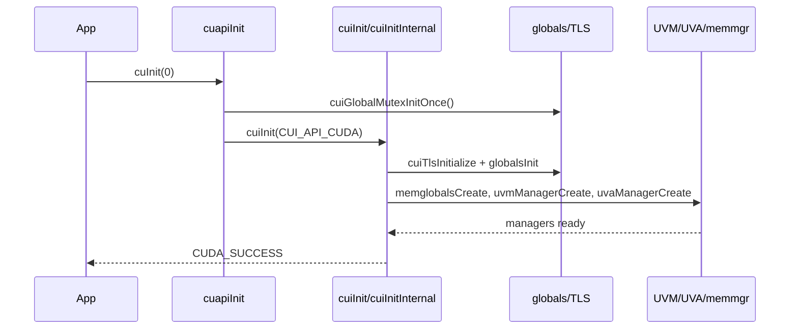

# 运行时模型

- 文档目的：追踪进程/线程从初始化到 API 调用、异步执行和清理的生命周期。
- 适用范围：CUDA Driver API 主路径。
- 对应源码版本：CUDA 10.2 API 字段；提交未知。
- 证据状态：初始化和对象清理已确认；进程退出行为部分未知。
- 最后更新：2026-09-14
- 前置阅读：[总体架构](architecture.md)
- 后续阅读：[全局数据流](global-data-flow.md)

## 结论摘要

运行时有三层状态：进程全局 `globals`、线程 TLS/current context、context 内的设备资源。`cuInit(0)` 首先初始化全局 mutex，再调用 `cuiInit`；`cuiInitInternal` 完成资源创建后，后续 API 通过 `cuiInitCheckEx` 验证 initialized、当前 context、context 状态和 sticky error。Context 创建后压入调用线程 TLS；销毁时先完成 context finalize/deinitialize，再释放关联 primary context。

## 启动流程

证据：`src/api/apiinit.c:29-46`；`src/cui/cuiinit.c:3060-3208`。错误从任一阶段跳到 `Error`，按反向顺序销毁 primary memmgr、user VA、UVA、UVM、globals。

## 运行与异步

一次 API 调用通常在宿主线程执行参数校验并持有 context lock；资源提交到 stream/channel 后，GPU 异步执行。Kernel launch 还可能进入 stream capture：`cuapiLaunchKernelCommon` 在 `src/api/apilaunch.c:251-285` 创建 graph node，而非立即提交；普通路径在 `:287-298` 调用 `cuiLaunchKernel_nonreentrant`。这一区分改变的是数据结构（graph node vs push/launch），不是简单的错误分支。Graph instantiate 随后为 node 建立 per-context QMD/constant-bank/internal stream/marker 和可选 scheduler backing，destroy 按异步完成边界反向释放（[src/cui/cuigraph.c:1835-1933,1035-1205]）。

## 关闭和回收

Context destroy 路径在 `src/cui/cuictx.c:363-385`：`cuiCtxFinalize` 做最终同步/工具 dump，`cuiCtxDeinitialize` 释放对象，若使用 primary TSG 再 release。Stream detach 不会立即 free：先注销 UVM、释放 public handle/semaphore/QMD，移到 detached list，只有 marker 表示 GPU 完成时才回收到 free pool（`src/cui/cuistream.c:2004-2076`）。

## 线程与锁

全局锁在 `cuiinit.c:172-214` 初始化；API 入口可能经过 TLS 初始化 once；context lock 保护 context-owned manager；stream pool mutex 保护 stream pool/list。线程安全不能仅由 C 函数名判断，应跟随 `cuiCtxLock`、`cuiMutexLock` 和 marker/semaphore 路径。

## 相关文档

- [全局错误模型](global-error-model.md)
- [M02 Runtime/Context](../01-modules/M02-runtime-context/README.md)
- [M05 Stream/Submit](../01-modules/M05-stream-submit/README.md)

## 源码证据摘要

- `[src/cui/cuiinit.c:2910-3039]` API 前置检查和 context 状态。
- `[src/cui/cuistream.c:1926-1954]` marker 完成后 detached→free。

## 未解决问题

未确认动态库加载时的 DllMain/constructor 具体平台路径；`common/version.h` 提供 GUID constructor 宏，但平台入口不完整。

## 下一步阅读建议

用 D01 跟随一次初始化后内存/stream 测试。
