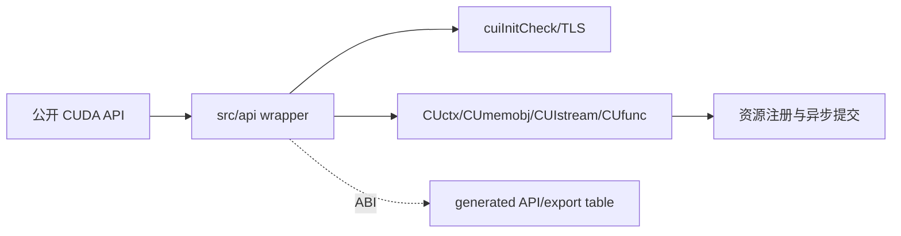

# M01 结构图

```mermaid
flowchart LR
 U[公开 CUDA API] --> W[src/api wrapper]
 W --> C[cuiInitCheck/TLS]
 W --> O[CUctx/CUmemobj/CUIstream/CUfunc]
 O --> R[资源注册与异步提交]
 W -. ABI .-> E[generated API/export table]
```

wrapper 到 CUI 是同步调用边界；CUI 到 stream/HAL 之后可能是异步副作用。
