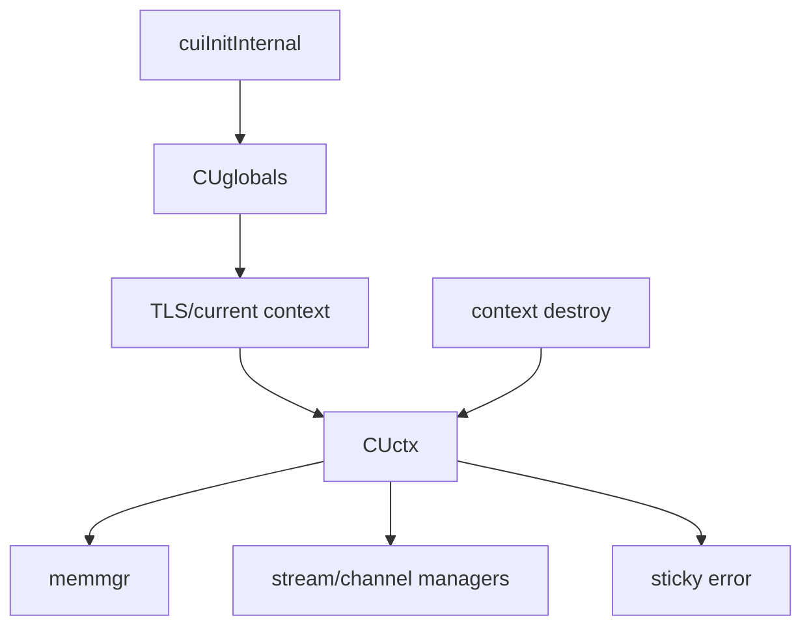

# M02 结构图

```mermaid
flowchart TB
 G[CUglobals] --> T[TLS/current context]
 T --> C[CUctx]
 C --> MM[memmgr]
 C --> SM[stream/channel managers]
 C --> E[sticky error]
 I[cuiInitInternal] --> G
 D[context destroy] --> C
```

`globals` 生命周期覆盖多个 context；context 释放不等于进程全局 deinitialize。
