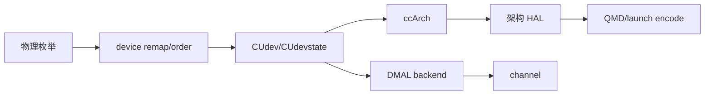

# M03 结构图

```mermaid
flowchart LR
 P[物理枚举] --> R[device remap/order]
 R --> D[CUdev/CUdevstate]
 D --> A[ccArch]
 A --> H[架构 HAL]
 D --> M[DMAL backend]
 M --> C[channel]
 H --> Q[QMD/launch encode]
```

同一 device 同时拥有架构 HAL 和平台 DMAL 两条特化轴。
