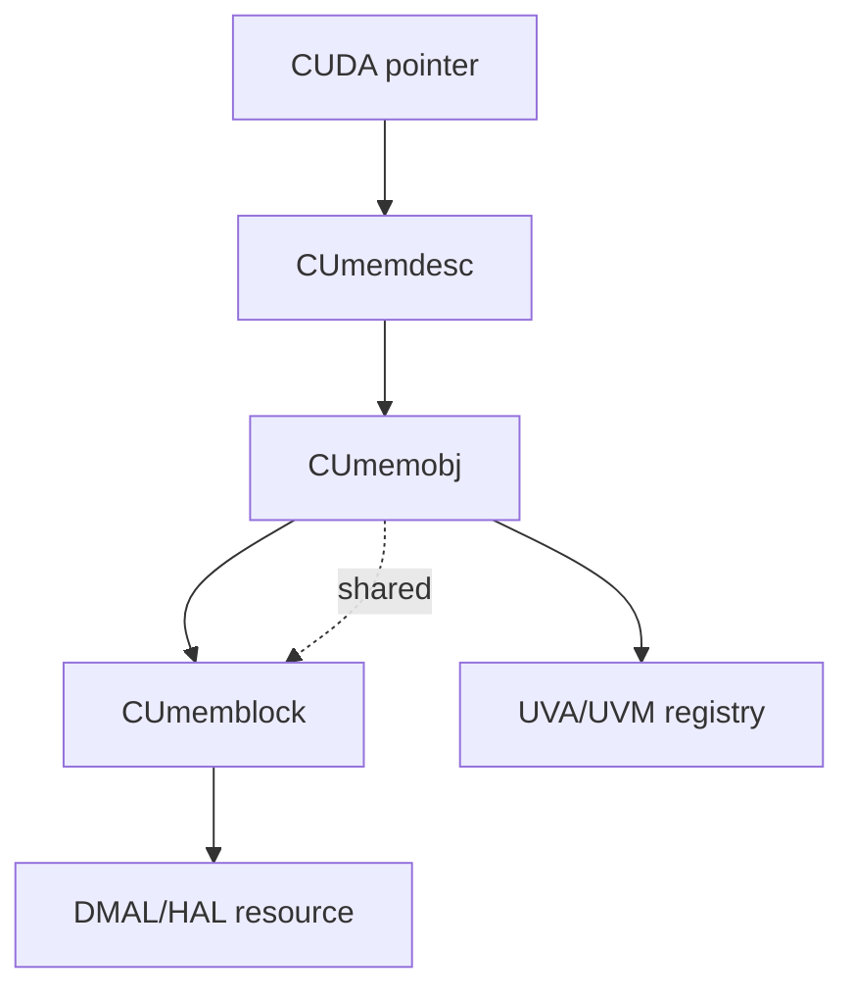
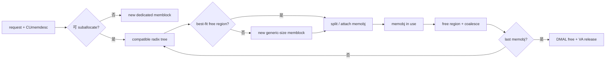

# M04 结构图

```mermaid
flowchart TB
 A[CUDA pointer] --> D[CUmemdesc]
 D --> O[CUmemobj]
 O --> B[CUmemblock]
 B --> H[DMAL/HAL resource]
 O --> U[UVA/UVM registry]
 O -. shared .-> B
```

多个 memobj 可以共享 backing block；pointer registry 则可能有多个 address/view。

## Suballocator 状态

```mermaid
flowchart LR
 R[request + CUmemdesc] --> C{可 suballocate?}
 C -- 否 --> B[new dedicated memblock]
 C -- 是 --> T[compatible radix tree]
 T --> F{best-fit free region?}
 F -- 是 --> S[split / attach memobj]
 F -- 否 --> N[new generic-size memblock]
 N --> S
 S --> U[memobj in use]
 U --> X[free region + coalesce]
 X --> E{last memobj?}
 E -- 否 --> T
 E -- 是 --> D[DMAL free + VA release]
```

`CUheap` 的 VA 管理不在此状态机内；它只在 new block 的 reserve/map 和 pointer lookup 阶段参与。
