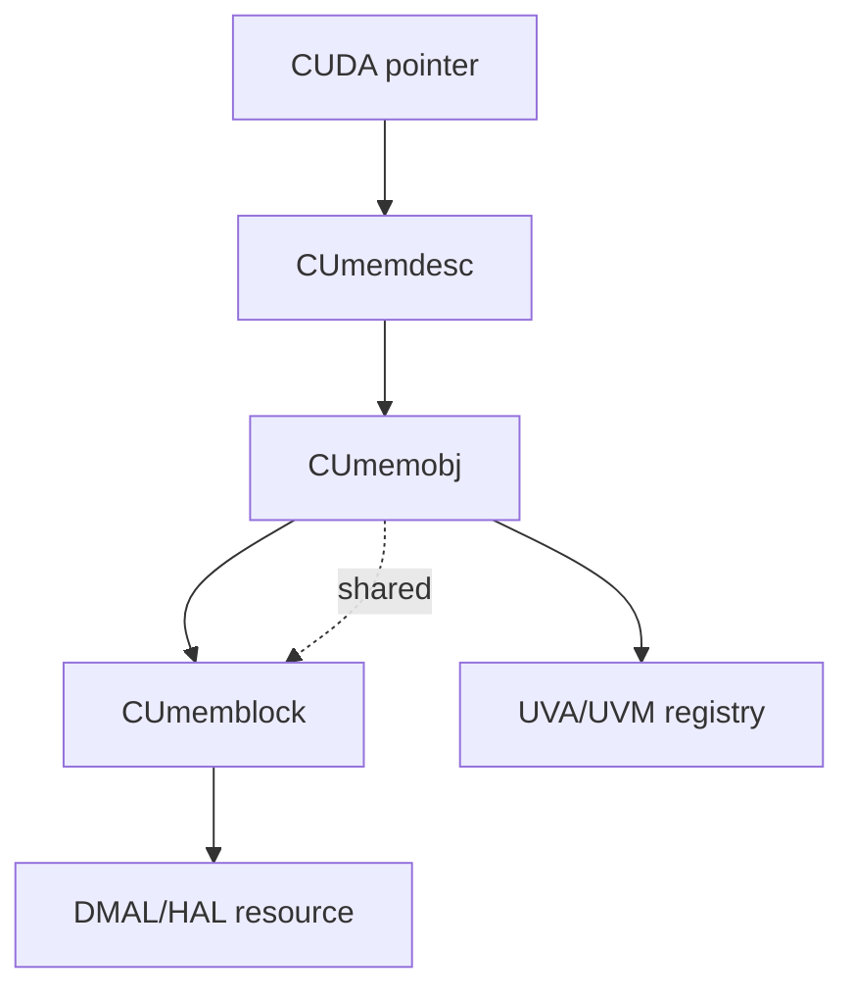

# M04 结构图

```mermaid
flowchart TB
 A[CUDA pointer] --> D[CUmemdesc]
 D --> O[CUmemobj]
 O --> B[CUmemblock]
 B --> H[DMAL/HAL resource]
 O --> U[UVA/UVM registry]
 O -. shared .-> B
```

多个 memobj 可以共享 backing block；pointer registry 则可能有多个 address/view。
