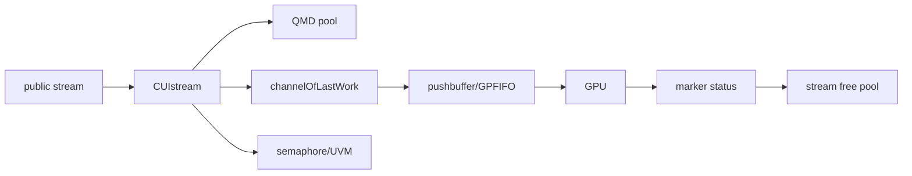

# M05 结构图

```mermaid
flowchart LR
 P[public stream] --> S[CUIstream]
 S --> Q[QMD pool]
 S --> C[channelOfLastWork]
 C --> PB[pushbuffer/GPFIFO]
 PB --> G[GPU]
 G --> MK[marker status]
 MK --> F[stream free pool]
 S --> SE[semaphore/UVM]
```

stream、channel、QMD 和 marker 的生命周期是交叉的，不能单独按 host handle 回收。
