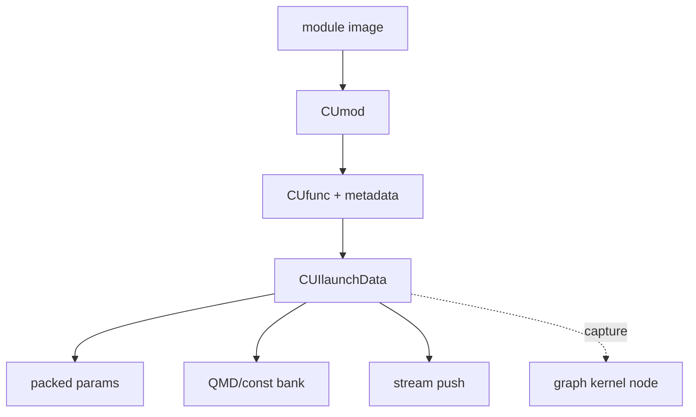

# M06 数据结构图

```mermaid
flowchart TB
 I[module image] --> M[CUmod]
 M --> F[CUfunc + metadata]
 F --> LD[CUIlaunchData]
 LD --> P[packed params]
 LD --> Q[QMD/const bank]
 LD --> S[stream push]
 LD -. capture .-> N[graph kernel node]
```

`CUfunc` 持有持久 metadata/引用；`CUIlaunchData` 绑定一次 launch，并被 tools/HAL 使用。
