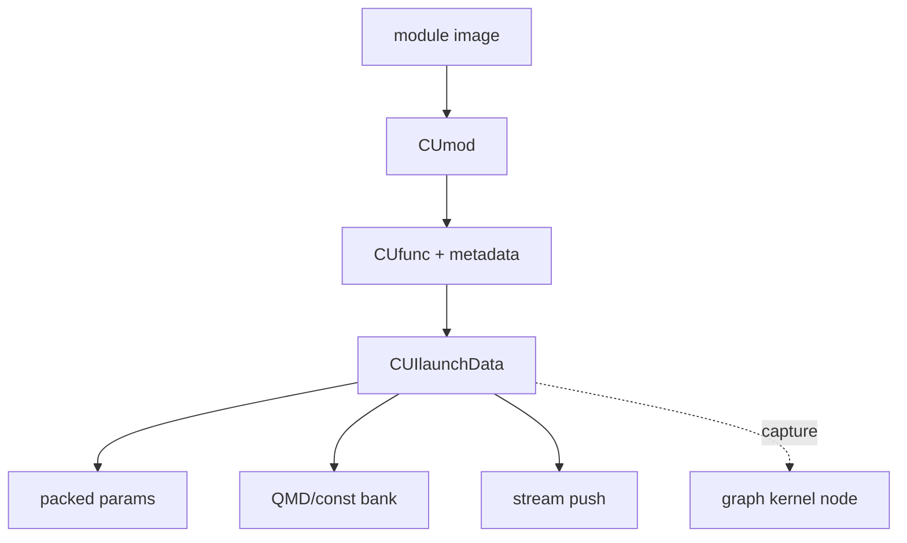
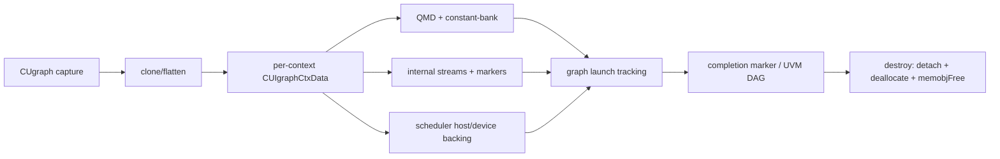

# M06 数据结构图

`CUfunc` 持有持久 metadata/引用；`CUIlaunchData` 绑定一次 launch，并被 tools/HAL 使用。

## Graph exec 资源

`CUIgraphCtxData` 是资源聚合点：device scheduler backing 是 `CUmemobj`，其余数组和 staging 为 host-side allocations；所有资源都必须等待异步 work 的 marker/tracking 边界后再释放（静态确认：[src/cui/cuigraph.h:218-267]；[src/cui/cuigraph.c:1835-1933,1035-1064]）。
