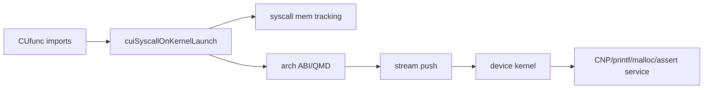

# M07 结构图

```mermaid
flowchart LR
 F[CUfunc imports] --> C[cuiSyscallOnKernelLaunch]
 C --> T[syscall mem tracking]
 C --> A[arch ABI/QMD]
 A --> P[stream push]
 P --> K[device kernel]
 K --> S[CNP/printf/malloc/assert service]
```

生成源、生成器、目标 binary 和 firmware service 分属不同边界。
