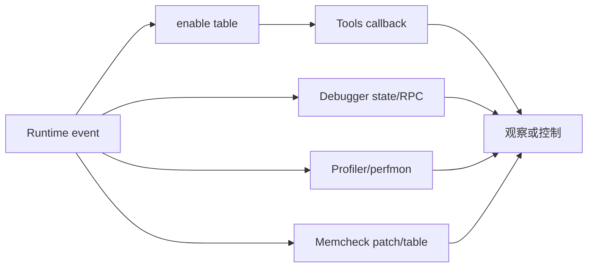

# M08 结构图

```mermaid
flowchart LR
 R[Runtime event] --> E[enable table]
 E --> CB[Tools callback]
 R --> D[Debugger state/RPC]
 R --> P[Profiler/perfmon]
 R --> MC[Memcheck patch/table]
 CB --> O[观察或控制]
 D --> O
 P --> O
 MC --> O
```

M08 依赖 M02/M04/M05/M06 的对象和同步边界。
