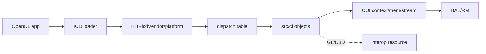

# M09 结构图

```mermaid
flowchart LR
 A[OpenCL app] --> I[ICD loader]
 I --> V[KHRicdVendor/platform]
 V --> D[dispatch table]
 D --> CL[src/cl objects]
 CL --> C[CUI context/mem/stream]
 C --> H[HAL/RM]
 CL -. GL/D3D .-> X[interop resource]
```
