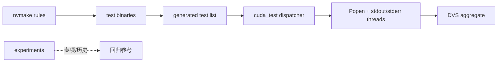

# M10 结构图

```mermaid
flowchart LR
 N[nvmake rules] --> B[test binaries]
 B --> L[generated test list]
 L --> D[cuda_test dispatcher]
 D --> P[Popen + stdout/stderr threads]
 P --> A[DVS aggregate]
 E[experiments] -.专项/历史.-> R[回归参考]
```
