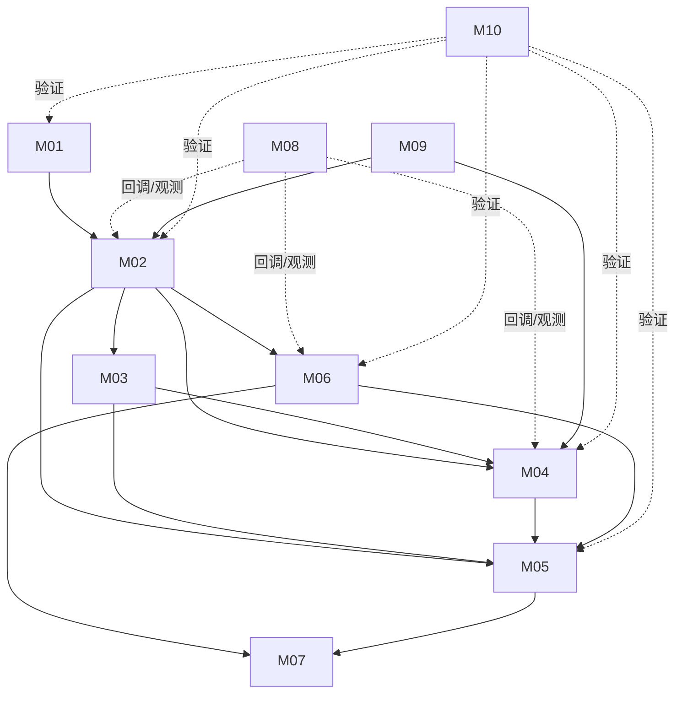

# 模块注册表

本页是 `01-modules` 的稳定导航。模块按运行时职责划分，不按目录机械拆分；源码证据均相对于 `source/cuda`，结论区分静态确认、推断和未知。

## 模块总表

| ID | 模块 | 核心目录/文件 | 深度 | 主职责 |
|---|---|---|---|---|
| M01 | API/ABI 与导出 | `inc/`、`src/api/`、`src/cuda_master.def`、`generated_cuapi*` | 深 | 参数校验、ABI 兼容、公开入口、导出 |
| M02 | Runtime/Context | `cuiinit.c`、`cuitls.c`、`cuictx.c`、`cuierror.c` | 深 | globals、TLS、context 生命周期、sticky error |
| M03 | Device/HAL | `devmgr.c`、`device.c`、`cuidevice.c`、`dmal/`、`hal/` | 中 | 设备枚举、排序、平台和架构分派 |
| M04 | Memory/UVA/UVM | `memmgr.c`、`memblock.c`、`memobj.c`、`suballocator.c`、`heap.c`、`cuiuvm.c`、`cuivamanager.c` | 深（静态） | memblock backing、descriptor-compatible suballocation、映射、统一地址、托管内存 |
| M05 | Stream/Submit | `cuistream.c`、`channel*.c`、`marker.c`、`qmd.c`、`pushbuffer.c` | 深 | 流池、通道、命令队列、同步和异步回收 |
| M06 | Module/Launch | `cuimod.c`、`cuifunc.c`、`cuiparam.c`、`cuilaunch.c`、`cuigraph.c`、`cuigraph.h`、`apigraph.c`、`apistream.c` | 深（静态） | 镜像加载、函数元数据、参数打包、Graph capture/instantiate/launch/update 及资源回收 |
| M07 | Kernel/Syscall | `src/kernels`、`src/syscalls`、`src/asm`、`cudaSyscalls.nvmk` | 中 | 内建 kernel、设备 syscall、架构生成物 |
| M08 | Tools/Debug | `src/devtools`、`src/profiler`、`src/drs`、`src/etbl/tools` | 中→深（host-side） | 工具回调、调试器、性能和配置旁路；memcheck device table |
| M09 | OpenCL/Interop | `src/cl`、`src/clh`、`src/icd_*`、互操作 CUI | 中→深（host-side） | OpenCL ICD、对象引用树、event marker、图形/外部资源互操作 |
| M10 | Tests/Experiments | `tests`、`mods`、`experiments` | 中→深（构建/聚合） | 构建适配、单元/集成测试、DVS/dispatcher 验证入口 |

## 依赖方向

## 阅读顺序

- API/运行时开发者：M01 → M02 → M04 → M05 → M06。
- 资源管理开发者：M04 [GPU 显存池化](M04-memory-uvm/gpu-memory-pooling.md) → M05 → M06 [Graph 资源生命周期](M06-module-launch/graph-resource-lifecycle.md)。
- 硬件提交开发者：M02 → M03 → M05 → M06 → M07。
- 调试/性能开发者：M02 → M05 → M06 → M08。
- 测试开发者：M10 → M01/M02 → 目标资源模块。

## 证据和缺口

M01–M02 已完成入口和核心生命周期的静态深读；M03–M07 已建立主路径，M04 suballocator 和 M06 Graph 资源 reverse path 已补充；HAL 实际编译选择、外部 RM/NVRM 末端、Graph 专用测试仍未确认；M08–M10 已补齐 host-side 工具/OpenCL 生命周期和构建/聚合语义。没有任何 GPU 构建或运行结果被标记为已验证。
