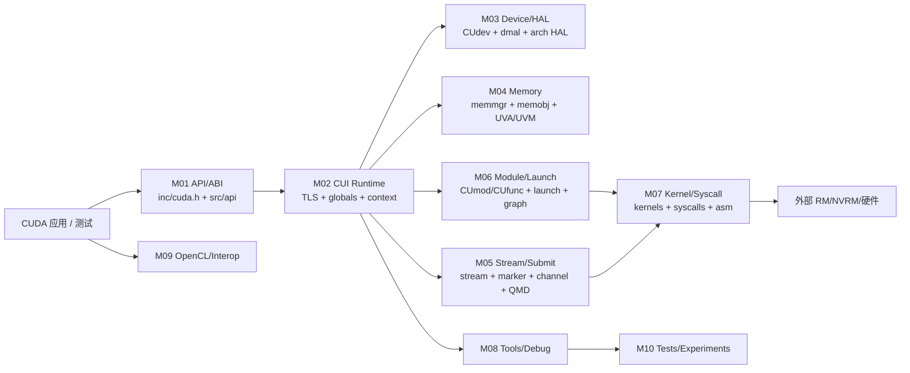

# CUDA 驱动项目理解知识库

- 文档目的：帮助未参与过该项目的开发者理解 `/home/mtuser/workspace/cuda` 中 NVIDIA CUDA Driver 组件的架构、实现、构建、测试与修改影响。
- 适用范围：源码快照、构建规则、测试和实验；不把标准 CUDA Toolkit 文档或外部 driver 树当成本仓库源码。
- 对应源码版本：源码推断为 CUDA Driver API 10.2（`CUDA_VERSION=10020`）；具体提交未知。
- 证据状态：核心初始化、上下文、内存、流、Kernel launch、UVM/GPFIFO/marker、module/ELF/JIT/graph、syscall host 侧生命周期、工具旁路、OpenCL 对象/interop host-side 生命周期和测试聚合入口已静态追踪；外部后端与设备执行未验证。
- 最后更新：2026-09-11
- 前置阅读：无
- 后续阅读：[项目定位](00-overview/project-overview.md) → [总体架构](00-overview/architecture.md) → [模块注册表](01-modules/module-registry.md) → [主 Demo](80-demos/D01-cuda-test-memory-stream/README.md)

## 5 分钟快速理解

这里不是一个可用 `cmake` 独立编译的 CUDA 应用，而是 NVIDIA 专有驱动树中负责 `libcuda`/OpenCL 相关用户态接口的一组 C/C++ 源码和 nvmake 构建片段。调用主线是：

```text
应用 / CUDA Driver API
  -> inc/cuda.h 的 ABI 兼容宏与公开声明
  -> src/api/ 的参数校验和版本适配
  -> src/cui/ 的 TLS、上下文、对象和状态管理
  -> memobj / stream / channel / pushbuffer / QMD
  -> dmal 与架构 HAL
  -> 外部 RM/NVRM/设备驱动
```

最值得先读的真实路径是：`cuInit` → `cuiInit` → `cuiInitInternal`；`cuCtxCreate_v2` → `cuiCtxCreate`；`cuMemAlloc_v2` → `cuapiMemAlloc_common` → `memobjAlloc`；`cuStreamCreate` → `cuiStreamCreate_UnderLock`；`cuLaunchKernel` → `cuapiLaunchKernelCommon` → `cuiLaunchKernel_nonreentrant` → `cuiLaunchSetup_common` 和后续 stream push/HAL 路径。

## 当前版本与范围说明

- **已确认**：`inc/cuda.h:209-211` 定义 `CUDA_VERSION 10020`；`common/version.h:16-28` 定义旧内部版本字段与 `NVCUDA_VER_MAJOR=10/NVCUDA_VER_MINOR=2/NVCUDA_VER_BUILD=0`。
- **已确认**：`cuda.nvmk` 将 `src/api`、`src/cui`、架构 HAL、工具和 kernel/syscall 对象组合成 `libcuda`；Linux 目标约在 `cuda.nvmk:1715-1817` 定义。
- **已确认**：M08 launch callback 可 skip/blocking，memcheck/profiler 会插入额外控制或 device-visible 资源；M09 的 ICD、`CLIobjectData` 引用树、event marker wait、GL registration 和 external memobj 创建均已有 host-side 源码证据。
- **未知**：目录无 `.git`，无法确认提交、分支和完整外部依赖版本。
- **不纳入核心实现**：`import/r384`、`r396`、`r400`、`r418` 是导入快照；`.cubins.c`、`.exe`、`.bin`、`tags` 和缓存/生成物只作为边界证据。

## 知识库导航

### 总览层

- [项目定位](00-overview/project-overview.md)
- [总体架构](00-overview/architecture.md)
- [设计原则与取舍](00-overview/design-principles.md)
- [运行时模型](00-overview/runtime-model.md)
- [全局数据流](00-overview/global-data-flow.md)
- [依赖地图](00-overview/dependency-map.md)
- [构建与部署](00-overview/build-and-deploy.md)
- [全局错误模型](00-overview/global-error-model.md)
- [术语表](00-overview/glossary.md)
- [源码证据索引](00-overview/evidence-index.md)
- [决策与冲突记录](00-overview/decision-log.md)
- [分析状态](00-overview/analysis-state.md)

### 模块层

- [模块注册表](01-modules/module-registry.md)
- [M01 API/ABI](01-modules/M01-api-abi/README.md)
- [M02 Runtime/Context](01-modules/M02-runtime-context/README.md)
- [M03 Device/HAL](01-modules/M03-device-hal/README.md)
- [M04 Memory/UVA/UVM](01-modules/M04-memory-uvm/README.md)
- [M05 Stream/Submit](01-modules/M05-stream-submit/README.md)
- [M06 Module/Launch](01-modules/M06-module-launch/README.md)
- [M07 Kernel/Syscall](01-modules/M07-kernel-syscall/README.md)
- [M08 Tools/Debug](01-modules/M08-tools-debug/README.md)
- [M09 OpenCL/Interop](01-modules/M09-opencl-interop/README.md)
- [M10 Tests/Experiments](01-modules/M10-tests-experiments/README.md)

### Demo、关联和实践层

- [Demo 注册表](80-demos/demo-registry.md)
- [D01 CUDA 测试主线](80-demos/D01-cuda-test-memory-stream/README.md)
- [D01 执行轨迹](80-demos/D01-cuda-test-memory-stream/execution-trace.md)
- [D01 数据与状态](80-demos/D01-cuda-test-memory-stream/data-and-state-trace.md)
- [跨模块系统串联](90-cross-module/system-wiring.md)
- [端到端流程](90-cross-module/end-to-end-flows.md)
- [修改影响图](90-cross-module/change-impact-map.md)
- [快速上手](99-roadmap/quick-start.md)
- [阅读指南](99-roadmap/reading-guide.md)
- [调试指南](99-roadmap/debugging-guide.md)
- [开发配方](99-roadmap/feature-development-recipes.md)
- [测试配方](99-roadmap/testing-recipes.md)
- [风险登记](99-roadmap/risk-register.md)
- [后续路线](99-roadmap/next-steps.md)

## 总体架构图



箭头代表源码调用或运行时资源/控制传递；M03、M07 的最终设备效果依赖本目录之外的 RM、common 和 compiler 树，当前只能静态追踪到边界。\

## 三条关键端到端流程

1. **初始化**：`cuInit(0)` 在 `src/api/apiinit.c:18-47` 校验 flags、初始化全局 mutex，然后进入 `src/cui/cuiinit.c:3226` 的 `cuiInit`，再由 `cuiInitInternal:3060-3208` 创建 TLS、全局状态、UVM/UVA manager、heap 和 primary memmgr。
2. **设备内存**：`cuMemAlloc_v2` 在 `src/api/apimem.c:128-136` 进入 common wrapper，构造 `CUmemdesc`，在 context lock 下调用 `memobjAlloc`（`src/api/apimem.c:89-117`），注册全局 UVA/P2P 映射并返回 `memobjGetDevicePtr`。
3. **Kernel/测试**：`basic_sanity.cu:168-236` 通过 Runtime 设置设备，再从内部 context/module 找到 `gpuIncrement`，发起 `<<<1,1>>>` launch，检查 `beginPushCount`、`launchCount`、CNP 结果和底层 compute channel；具体 launch 逻辑在 `src/api/apilaunch.c:211-299` 与 `src/cui/cuilaunch.c:229-319`。

## 文档状态

本知识库优先完成核心实现和真实测试静态轨迹；由于源码快照缺少 Git 元数据、外部 NVIDIA 构建树、GPU 和 nvmake 环境，构建、运行、硬件结果均不得写成已验证。详见 [分析状态](00-overview/analysis-state.md)。

## 相关文档

- [源码证据索引](00-overview/evidence-index.md)
- [模块注册表](01-modules/module-registry.md)

## 源码证据摘要

- `[inc/cuda.h:62-170]` API 版本与 PTDS/P契约宏；`[inc/cuda.h:209-211]` 版本。
- `[src/api/apiinit.c:18-47]` 初始化入口；`[src/cui/cuiinit.c:3060-3208]` 初始化实现与回滚。
- `[src/api/apimem.c:51-117]` 内存分配包装；`[src/cui/cuimem.c:66-186]` memobj 分配/释放。
- `[src/api/apilaunch.c:211-299]` launch 分派；`[src/cui/cuilaunch.c:229-319]` setup/HAL 检查。

## 未解决问题

1. 外部 RM/NVRM、compiler/gpgpucomp 和 common 树的精确版本未知。
2. 当前构建配置实际启用哪个架构 HAL 未知，需要完整 nvmake 配置或构建日志确认。
3. 真实 GPU、驱动权限和测试结果未验证。

## 下一步阅读建议

先读 M01、M02，再按 M04→M05→M06→M03/M07 跟随内存与 launch 主线，最后读 D01 和跨模块文档。
