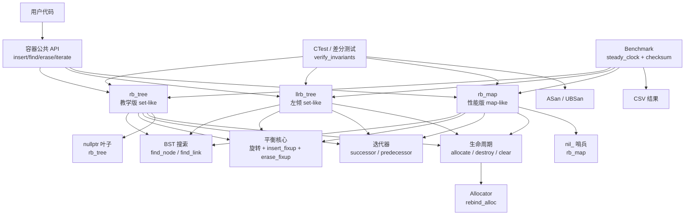
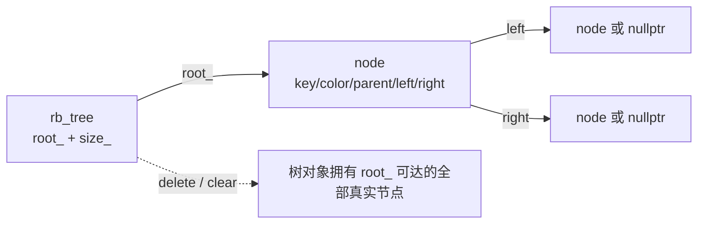
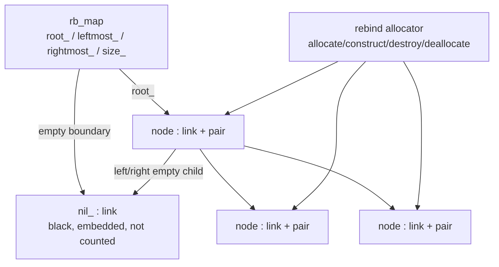
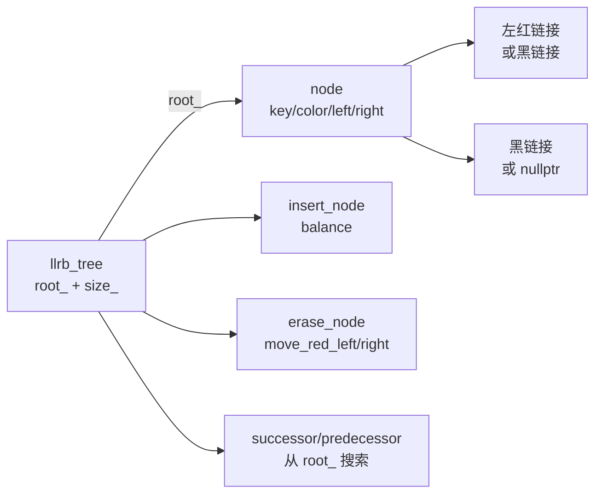
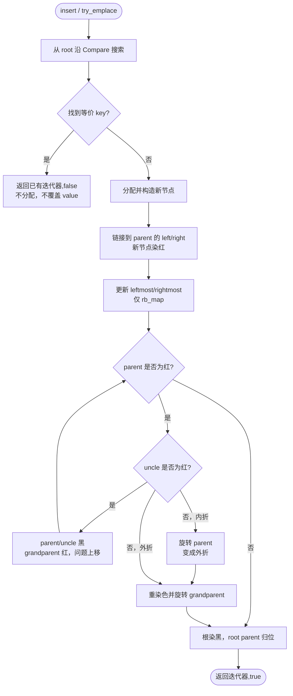
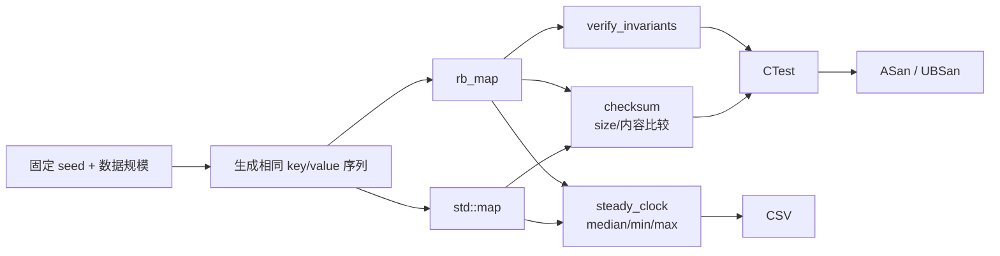
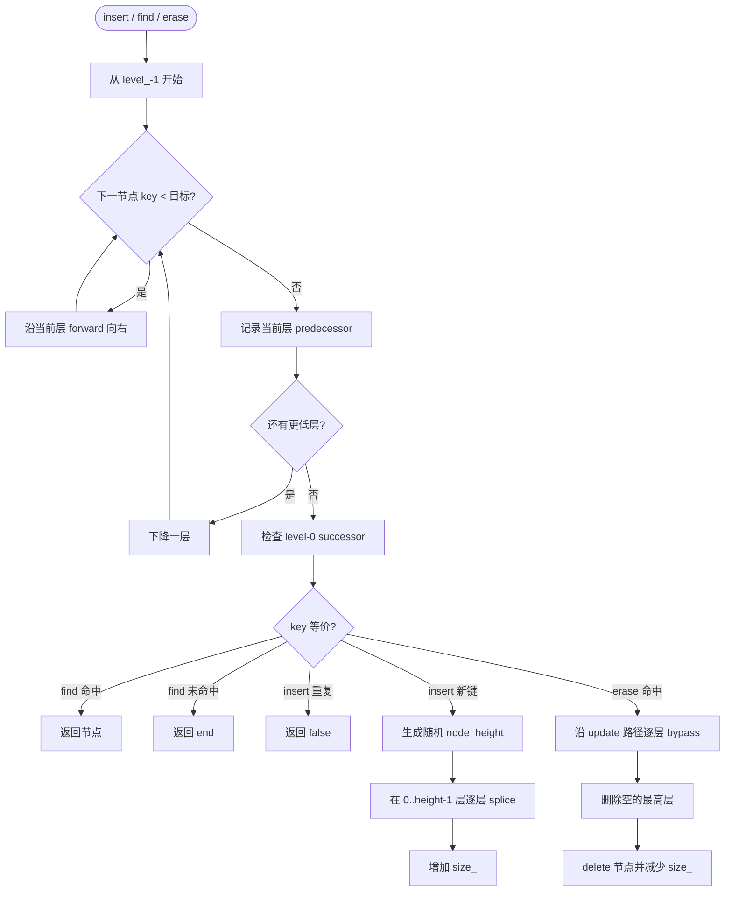

# 红黑树与跳表架构设计和运行流程

> 本文对应 `include/rbtree/rb_tree.hpp`、`include/rbtree/llrb_tree.hpp`、`include/rbtree/rb_map.hpp`、`include/rbtree/skip_list.hpp` 和两个 benchmark。代码注释解释“这一行为什么存在”，本文解释“这些对象如何组成一个系统”。图使用 Mermaid；如果 Markdown 阅读器不渲染 Mermaid，图下的文字说明仍然给出同样的结构。

## 1. 设计目标与实现分层

项目包含三种有意分开的 set/map 实现：

- **教学版 `rb_tree<Key, Compare>`**：set-like，只存储 `Key`，使用 `nullptr` 表示外部叶子。它把红黑树算法、父子链接和所有权暴露得更清楚，适合逐步学习。
- **左倾红黑树 `llrb_tree<Key, Compare>`**：set-like，只存储 `Key`，用左倾红链接表达 2-3 树，不保存 parent 指针；插入和删除采用递归 top-down 算法，适合与 parent-based 实现比较。
- **性能实验版 `rb_map<Key, T, Compare, Allocator>`**：map-like，存储 `std::pair<const Key, T>`，使用每棵树独有的黑色 `nil_` 哨兵、节点 allocator 和最左/最右节点缓存，适合与 `std::map` 做可复现比较。

三者的核心有序容器思想相同：普通 BST 搜索（跳表则为分层搜索）、结构调整和中序访问。差异集中在空叶表示、节点 value、内存生命周期、平衡机制和迭代器边界，不应把它们当作完全相同的对象布局。

## 2. 总体组件架构



### 2.1 组件职责

| 组件 | 责任 | 关键约束 |
|---|---|---|
| 公共 API | 暴露容器语义 | key 唯一；map 的 key 不可修改 |
| BST 搜索 | 沿比较器决定左/右路径 | 等价 key 必须停止，不能重复分配 |
| 旋转/结构调整 | 改变局部形状而不改变中序顺序 | `rb_tree`/`rb_map` 必须同步 parent；LLRB 必须同步中间子树和颜色 |
| 插入修复 | 消除红父红子或临时红右链接 | 根最终必须为黑 |
| 删除修复 | 恢复删除黑节点造成的黑高差异 | `rb_tree`/`rb_map` 使用 sibling cases；LLRB 使用 top-down 借红链接 |
| 迭代器 | 按中序访问 | 不返回 `nullptr` 或 `nil_`；旋转不移动节点地址 |
| 生命周期 | 分配、构造、销毁和清空 | 每个真实节点恰好销毁一次 |
| 验证器 | 检查结构而非优化性能 | 不放入 benchmark 热路径 |

## 3. 节点布局与所有权

### 3.1 教学版：`nullptr` 叶子



- `nullptr` 代表黑色外部叶子，不占用对象和分配空间；
- 空节点没有 `parent` 字段，因此删除修复接收额外的 `parent_of_current`；
- `unique_ptr<node>` 只在插入链接完成前作为临时所有者，`release()` 后由树负责销毁；
- `erase` 只让被删除节点的迭代器失效，旋转不会移动其他节点对象。

### 3.2 性能版：`link`、`node` 和 `nil_`



- `link` 只保存 `parent`、`left`、`right` 和颜色，`nil_` 因而不需要构造假的 key/value；
- `nil_` 是容器内嵌对象，不经过 allocator，也不计入 `size_`；
- `transplant` 可以暂时更新 `nil_.parent`，让删除修复找到缺失孩子的父节点；
- 旋转不能把共享哨兵当作普通节点无条件更新，否则可能污染后续删除修复；
- 删除修复结束后强制 `nil_` 为黑，根的 parent 指向 `nil_`；
- `leftmost_` 和 `rightmost_` 分别缓存最小、最大真实节点，空树时都指向 `nil_`。

### 3.3 左倾红黑树：无 parent 的 set-like 实现



- LLRB 只允许红链接指向左孩子；红右链接和连续左红链接都是非法状态；
- `rotate_left`、`rotate_right` 在提升节点时交换颜色，使局部结构继续表示 2-3 树；`balance` 在递归返回阶段消除临时右红链接；
- 删除前把根临时染红，在向下路径上通过 `move_red_left`/`move_red_right` 保证待访问方向拥有可借用的红链接，删除后再把根染黑；
- 每个真实节点仍由一次普通 `new` 创建、由一次 `delete` 销毁，不使用池化、Arena 或自定义 allocator；
- 因为节点没有 parent，迭代器不能沿父链上爬，`++`/`--` 每次从 `root_` 搜索 successor/predecessor，复杂度为 `O(log n)`；旋转仍不移动节点地址。

### 3.4 三种 set-like 容器的边界

`rb_tree` 是 parent-based 的教学实现，`llrb_tree` 是无 parent 的 top-down LLRB 实现，`skip_list` 是随机多层链表。它们共享唯一键、比较器和普通 `new/delete` 的语义，但节点布局、删除路径和迭代器成本不同；benchmark 必须把它们作为独立容器分别测量。

## 4. 红黑树不变量

对三种树实现都成立的逻辑约束：

1. 根为黑色；
2. 红节点不能有红色孩子；
3. 从任意节点到所有后代外部叶子的黑节点数相同；
4. BST 顺序严格成立：左 `<` 当前 `<` 右；
5. 每个真实孩子的 `parent` 指回父节点（仅 `rb_tree`/`rb_map`；LLRB 不保存 parent）；
6. `size_` 等于真实节点数量；
7. 中序遍历严格有序且无重复。

表示差异：

- `rb_tree` 的外部叶子是 `nullptr`，顶层 root 的 parent 是 `nullptr`；
- `rb_map` 的外部叶子是 `&nil_`，顶层 root 的 parent 是 `&nil_`，`nil_` 永远黑且不计数。

`verify_invariants()` 递归检查边界 key、（适用实现的）parent 链接、颜色约束、黑高和节点数；它是诊断工具，不是 benchmark 操作。LLRB 额外检查红链接左倾且没有连续左红链接。

## 5. 插入流程



### 5.1 状态变化

1. 搜索阶段只读链接和比较器；重复 key 在分配前返回；
2. 新节点先作为红叶插入，红色不会改变任一路径的黑高；
3. 只有“红 parent + 红 current”可能破坏不变量；
4. 红 uncle 时把红色问题向祖父上移；黑 uncle 时通过旋转把局部形状变为可修复的外折；
5. 最后统一把 root 染黑，避免第一节点或向上修复后的根保持红色。

复杂度：搜索和修复均为 `O(log n)`；节点分配为 `O(1)`，但会影响端到端插入时间。

## 6. 删除流程

```mermaid
flowchart TD
    Start([erase(key / iterator)]) --> Locate[定位 target]
    Locate --> Missing{target 不存在或是 end?}
    Missing -->|是| Noop[返回，不改变树]
    Missing -->|否| Children{target 的孩子数量}
    Children -->|0/仅右| ReplaceR[replacement = right\ntransplant]
    Children -->|仅左| ReplaceL[replacement = left\ntransplant]
    Children -->|2| Succ[取右子树最小后继]
    Succ --> Move[后继移到 target 位置\n继承 target 颜色]
    ReplaceR --> Record[记录实际移除节点的颜色]
    ReplaceL --> Record
    Move --> Record
    Record --> Destroy[销毁 target\nsize_--]
    Destroy --> Black{实际移除节点是黑色?}
    Black -->|否| Boundary[更新边界缓存和 root/sentinel]
    Black -->|是| Fix[erase_fixup\n处理 extra black]
    Fix --> Boundary
    Boundary --> Empty{树是否为空?}
    Empty -->|是| Reset[reset_nil / root=nullptr]
    Empty -->|否| Restore[恢复 root parent、nil_ 黑色\n重算必要边界]
    Reset --> Done([完成])
    Restore --> Done
```

### 6.1 删除修复的四类情况

以 `current` 是父节点左孩子为例：

1. **红 sibling**：sibling 染黑、parent 染红并左旋 parent，把问题转换成黑 sibling；
2. **黑 sibling + 两个黑孩子**：sibling 染红，把额外黑色上移到 parent；
3. **黑 sibling + 近孩子红、远孩子黑**：近孩子染黑、sibling 染红并右旋 sibling，转换为 case 4；
4. **远孩子红**：sibling 继承 parent 颜色、parent 染黑、远孩子染黑并左旋 parent，修复结束。

右侧分支完全镜像。`rb_tree` 需要显式保存 `parent_of_current`，因为 `current == nullptr` 没有 parent；`rb_map` 通过 `nil_.parent` 提供相同信息，但必须小心不把哨兵当作可染色的真实节点。

复杂度：定位、后继查找和修复均为 `O(log n)`；销毁单个节点为 `O(1)`。

## 7. 查找与迭代流程

```mermaid
flowchart TD
    Start([find / contains]) --> Current[current = root]
    Current --> Empty{current 是外部叶?}
    Empty -->|是| Miss[返回 end / false]
    Empty -->|否| Less{key < current key?}
    Less -->|是| Left[current = left]
    Less -->|否| Greater{current key < key?}
    Greater -->|是| Right[current = right]
    Greater -->|否| Hit[返回 current / true]
    Left --> Empty
    Right --> Empty

    IterStart([++it / --it]) --> Child{有对应右/左子树?}
    Child -->|是| Descend[取子树最小/最大]
    Child -->|否| Climb[沿 parent 上爬\n直到跨过相反方向边]
    Descend --> IterDone([下一个中序节点])
    Climb --> IterDone
    EndStart([--end()]) --> Cache[使用 rightmost_\nrb_map O(1)]
    EndStart2([--end() rb_tree]) --> Max[从 root 搜索 maximum\nO(log n)]
```

- `find` 不修改结构，成功和失败都不会分配；
- `successor`：有右子树取右子树最小值，否则向上爬到第一个当前节点位于其左侧的祖先；
- `predecessor` 是镜像；
- `rb_map` 的 `--end()` 直接使用 `rightmost_`；教学版通过 owner 从 root 求 maximum；
- 空容器上的解引用、越过 begin/end 等行为仍属于标准迭代器的未定义/未满足前置条件场景，调用者应遵守迭代器契约。

## 8. 测试与 benchmark 数据流



### 8.1 正确性验证

- 单元测试覆盖空树、旋转、重复 key、边界删除、迭代器和清空；
- map 差分测试用同一随机操作序列对照 `std::map`；
- 每个随机操作后检查不变量、size 和中序内容；
- ASan/UBSan 检查越界、use-after-free、double free 和未定义访问；
- CTest 负责统一运行测试目标。

### 8.2 性能验证

- insert 从空容器开始，计入节点分配和树平衡；
- find、iterate、erase 计时前都用相同数据填充，填充不计入对应 workload；
- checksum 证明循环产生了可观察结果；
- median 比单次时间更能抵抗调度抖动，但仍不能消除 CPU 频率、缓存和系统负载影响；
- 默认 allocator 是端到端比较，不等价于只比较旋转算法；
- 结果必须同时记录编译器、优化选项、CPU、seed、规模和重复次数。

## 9. 关键调用链速查

### 插入

```text
public insert/try_emplace
  -> insert_node
     -> Compare 搜索
     -> allocate_node / new node
     -> 链接到 parent
     -> insert_fixup
        -> left_rotate / right_rotate
```

### 删除

```text
public erase
  -> find_link/find_node
  -> transplant 或后继移动
  -> destroy_node/delete
  -> erase_fixup
     -> sibling case
     -> left_rotate / right_rotate
  -> 更新边界和 root/sentinel
```

### 迭代

```text
begin/end
  -> minimum / nil_
++it / --it
  -> successor / predecessor
--end()
  -> rightmost_ (rb_map) 或 maximum(root_) (rb_tree)
```

## 10. 设计边界与后续演进

当前实现优先保证单线程正确性、可读性和可重放测量，不包含并发、完整 STL 兼容 API、node handle、持久化或 SIMD。若继续优化，应按以下顺序验证：

1. 先用 profiler 确认插入瓶颈是 allocator、比较器还是旋转；
2. 只有确认分配成本占主导后，才增加节点池或 `pmr` 资源；
3. 为新 allocator 增加构造/销毁、异常回滚和重复 clear 测试；
4. 对双方使用等价内存条件重新 benchmark；
5. 只有某个固定 workload 稳定领先时，才描述为“该 workload 下优于 `std::map`”，不宣称普遍胜出。

## 11. 阅读入口

- [项目 README](../README.md)
- [实现笔记](implementation-notes.md)
- [红黑树不变量](invariants.md)
- [测试与验证](testing-and-verification.md)
- [benchmark 说明](../benchmark/README.md)
- [教学版实现](../include/rbtree/rb_tree.hpp)
- [map 性能版实现](../include/rbtree/rb_map.hpp)

## 12. 跳表实现

项目新增 `skip_list<Key, Compare, MaxLevel>`，它与两套红黑树一样是单线程、唯一键的有序容器，但采用随机层级而不是颜色修复来缩短搜索路径。具体实现见 [`../include/rbtree/skip_list.hpp`](../include/rbtree/skip_list.hpp)。

### 12.1 节点布局与所有权

```mermaid
flowchart LR
    List[skip_list\nheader_ / level_ / size_]
    H0[header_[0]]
    H1[header_[1]]
    H2[header_[2]]
    N1[node key=10\nheight=3]
    N2[node key=20\nheight=1]
    N3[node key=30\nheight=2]
    End[nullptr]

    List --> H0
    List --> H1
    List --> H2
    H2 -->|forward[2]| N1
    N1 -->|forward[2]| N3
    N3 -->|forward[2]| End
    H1 -->|forward[1]| N1
    N1 -->|forward[1]| N3
    N3 -->|forward[1]| End
    H0 -->|forward[0]| N1
    N1 -->|forward[0]| N2
    N2 -->|forward[0]| N3
    N3 -->|forward[0]| End
```

- `header_` 是嵌入容器的多层入口，不存储假的 `Key`；
- `forward[0]` 是完整有序链表，迭代器只沿这一层前进；
- 节点高度为 `height`，真实节点只为 `[0, height)` 的 forward 指针分配空间；
- `level_` 是当前最高有效层，范围为 `[1, MaxLevel]`；
- 真实节点由 level-0 链表唯一拥有，`clear()` 依次删除它们；header 和 forward 指针不拥有额外节点。

### 12.2 查找、插入和删除流程



搜索时 `update[index]` 记录第 `index` 层中最后一个小于目标 key 的节点；`nullptr` 表示从对应的 `header_[index]` 开始。插入先完成搜索，重复 key 在分配前返回；新节点生成随机高度后逐层插入。删除复用同一条路径逐层绕过目标，再从 level 0 释放节点并降低空的最高层。

查找、插入、删除的期望复杂度为 `O(log n)`，随机形状异常时最坏可能退化为 `O(n)`；迭代器每步沿 level 0 前进，复杂度为 `O(1)`。固定 seed 只影响层级形状，不改变底层有序结果。

### 12.3 跳表验证与边界

`verify_invariants()` 检查底层 key 严格有序、每层无环、高层节点也存在于 level 0、节点高度和 forward 范围合法、空的高层已被裁掉，以及 `size_` 与底层节点数量一致。当前跳表只提供 set-like API、前向迭代器和 `new/delete` 生命周期，不提供 map value、并发、节点池、完整 STL 兼容 API 或 benchmark 结论。

`skip_list_test.cpp` 使用固定 seed 与 `std::set<int>` 做随机差分，验证插入、删除、查找、size、有序遍历和不变量。`ordered_benchmark` 比较 `rb_tree<int>`、`skip_list<int>` 与 `std::set<int>`；记录结果时必须同时固定 `MaxLevel`、随机策略、seed、数据集和计时边界。
