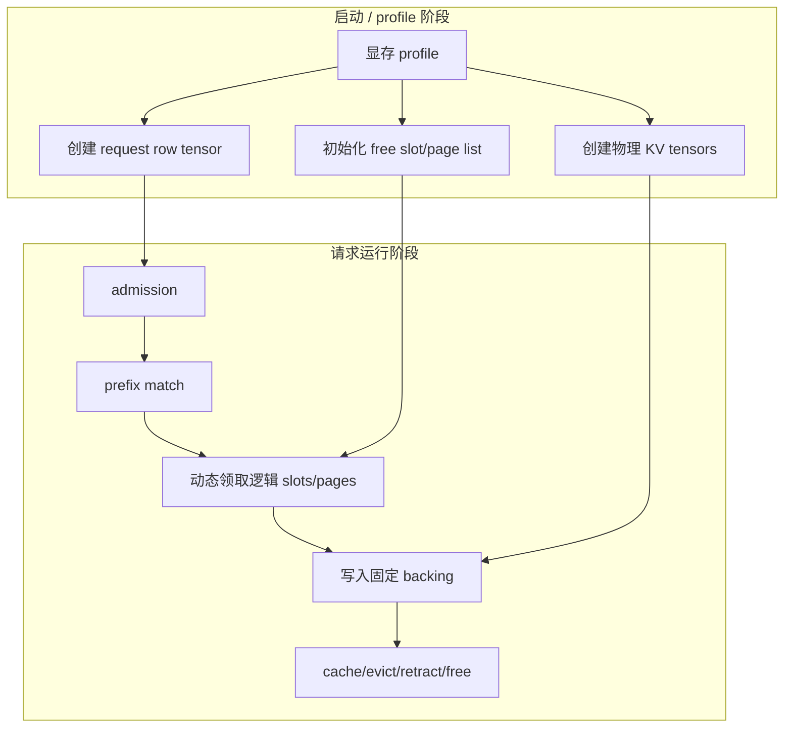

# 概念与分类轴：KV Cache 池化不只是一种 allocator

## 1. 为什么要先分类

大模型自回归推理中，KV cache 随输入 token 和输出 token 增长。若每个请求都把 KV 当作一块连续独占显存，会遇到三个问题：

1. 输出长度不确定，提前按最大长度预留会浪费显存；
2. 请求到达和结束时间不同，动态释放后容易产生外部碎片；
3. prefix reuse、chunked prefill、retraction、offload 和 CUDA Graph 都要求 KV 的“逻辑位置”和“物理 backing”可被分别管理。

因此，“池化技术”需要拆成多个层次讨论，而不是只问“用不用静态池”。

## 2. 三条分类轴

| 分类轴 | 静态含义 | 动态含义 | 常见误解 |
|---|---|---|---|
| 物理 backing | 启动/profile 后一次性创建 KV tensor 或大块显存 | 请求期间按需向 CUDA/驱动申请或映射物理页 | 把固定 backing 误认为每个请求独占固定长度 |
| 逻辑 slot/page | slot/page 总数固定 | 每个请求按 token 增长动态领取和归还 slot/page | 把逻辑动态分配误认为物理显存反复 malloc/free |
| 放置层级 | 只在 GPU HBM 中驻留 | 在 GPU/CPU/DRAM/SSD/远端节点间迁移、恢复、重算 | 把 offload 当作简单 memcpy，没有考虑带宽和一致性 |

## 3. 一个 KV token 的容量公式

对常规 MHA/GQA decoder-only 模型，可用近似公式估算每 token KV 显存：

```text
bytes_per_token = num_layers * 2(K,V) * num_kv_heads * head_dim * bytes_per_element
```

若采用 MLA、Mamba/SSM、KV 量化、paged layout、sliding window 或 layer/head-wise offload，公式中的维度和常数会变化。这个公式只用于容量一阶估算，不代表具体框架中的 tensor layout。

## 4. SGLang 文档中的三层池模型

[已确认] 当前 SGLang 知识库把池化分为三层：

| 层次 | 代表对象 | 存储内容 | owner | 典型问题 |
|---|---|---|---|---|
| 请求 row 映射池 | `ReqToTokenPool` | request row 到 token location 的 int32 映射 | pool 持有 tensor，Req 持有 row id | row 复用、row 0 padding、旧映射残留 |
| token/page allocator | `TokenToKVPoolAllocator` / `PagedTokenToKVPoolAllocator` | 可分配 slot/page index | allocator | page 对齐、deferred release、double free |
| 物理 cache pool | `MHATokenToKVPool`、`MLATokenToKVPool`、`MambaPool` | 真正的 K/V 或状态 tensor | ModelRunner/KVCache | dtype/layout、CUDA Graph 地址、offload/restore |
| prefix cache | `RadixCache` | prefix key 到 KV indices 的引用 | Radix tree + allocator 协作 | lock_ref、eviction、partial page |

来源：`../sglang/90-cross-module/pooling-and-resource-management.md`、`../sglang/01-modules/M08-kv-cache/README.md`。

## 5. 静态池与动态池的真实组合



节点解释：启动阶段的 `T/R/F` 是相对静态的容量边界；运行阶段的 `L/C` 是动态 ownership 转移。箭头代表资源依赖，不代表每次请求都重新创建 GPU tensor。

## 6. 面试时应主动澄清的问题

1. 你说的“静态/动态”是指物理显存 backing、逻辑 KV slot，还是跨 GPU/CPU/存储放置？
2. 目标优化是吞吐、TTFT、TPOT、P99、显存利用率、成本，还是可预测性？
3. 是否要求 CUDA Graph、prefix cache、P/D disaggregation、多租户隔离或长上下文？
4. 输出长度分布是否已知？是否允许 preemption、recompute 或 CPU offload？

## 7. 关键反例

- [反例] “静态池一定浪费，动态池一定高效”：动态物理分配可能引入 allocator 锁、同步、碎片和 tail latency；静态 backing + 动态 slot/page 反而常用于稳定地址和降低运行期 malloc。
- [反例] “PagedAttention 消除了所有碎片”：分页降低外部碎片，但仍可能有 page 内部浪费、partial page、元数据开销和 kernel/layout 复杂度。
- [反例] “CPU offload 只是把显存变大”：offload 把容量问题转化为 PCIe/NVLink/CPU 带宽、调度和恢复时延问题。
