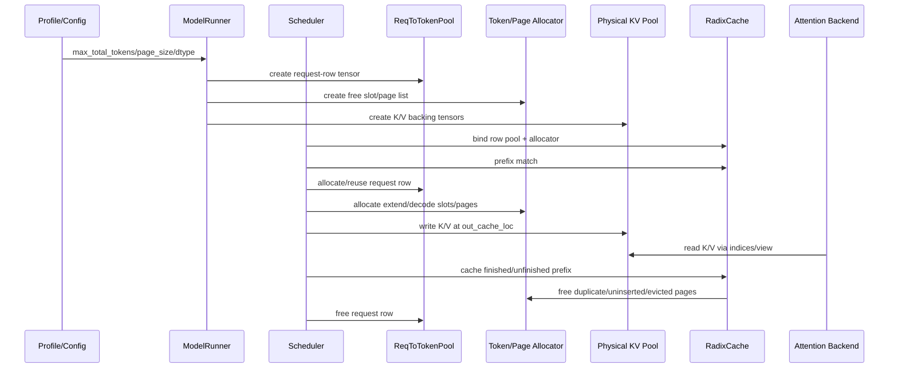
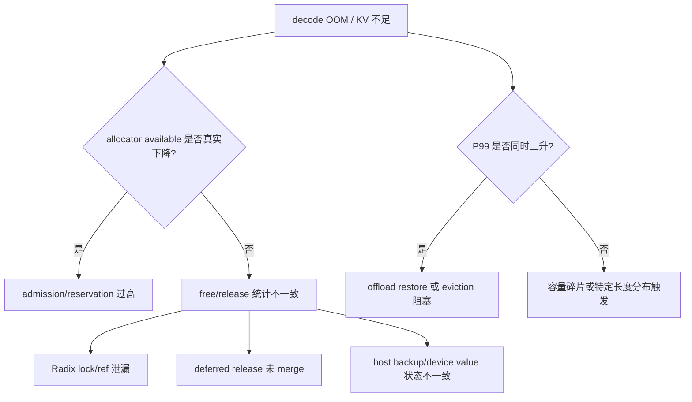

# KV Pool 生命周期与 Ownership

## 1. 端到端生命周期



图中：`ROW` 管 request 到 token location 的映射；`AL` 管 slot/page index；`PHY` 管真实 K/V tensor；`RAD` 只接管可复用 prefix 的索引引用。同步/异步边界取决于 scheduler loop、attention backend 和 transfer backend；本专题未执行真实 GPU 时序验证。

## 2. 关键 ownership 表

| 对象 | 实际 owner | 借用者 | 归还/释放点 | 不变量 | 破坏症状 |
|---|---|---|---|---|---|
| request row | `ReqToTokenPool` | `Req`、`ForwardBatch` | 请求结束、chunk 释放、flush | row id 不指向已释放请求 | 新请求读到旧 token location |
| KV slot/page index | allocator | Req、Radix node、backup/transfer | free、evict、retract、flush | 一个 index 同时只被合法 owner 集合引用 | double free、泄漏、UAF |
| 物理 K/V tensor | KVCache/ModelRunner | attention/backend/graph | pool teardown 或全局 flush | address/layout/dtype 与 backend 契约一致 | kernel 读错、graph replay 失败 |
| Radix node value | RadixCache | prefix match、eviction、HiCache | evict/delete/lock release | `lock_ref` 与请求/host 引用配对 | cache 永不淘汰或提前释放 |
| host/offload page | host pool/transfer layer | restore/prefetch | restore 完成、host eviction | device/host page id 显式映射 | 恢复错页、transfer race |
| CUDA Graph static buffer | graph runner | graph replay | runner teardown | capture batch/shape/LoRA/stream key 匹配 | fallback 或非法访问 |

## 3. 分配主线

### 3.1 容量预算

[已确认] SGLang 文档描述 ModelRunner 会先 profile 可用显存，再把用户 `max_total_tokens`、PP rank 最小容量和 `max_running_requests` 等约束投影到 memory pool config。来源：`../sglang/90-cross-module/pooling-and-resource-management.md`。

推荐面试表达：容量预算不是单个公式，而是以下约束的交集：

```text
available_hbm
  - model_weights
  - runtime_activations/reserved_workspace
  - cuda_graph_static_buffers
  - safety_margin
=> physical_kv_budget
=> max_total_tokens/page_count
=> admission budget per batch/request
```

### 3.2 Prefix match 与 extend

[已确认] prefix 命中的 KV indices 写入请求 row，未命中的 token 才需要 allocator 分配新位置；`prefix_indices` 与 `extend_range` 用于区分已拥有/命中和需要写入的区间。来源：`../../../sglang/01-modules/M08-kv-cache/README.md`。

### 3.3 Decode 增长

decode 每步通常为运行中请求追加新 token 的 KV。若 allocator 可用量不足，scheduler 可能执行 retraction/abort，把部分请求从 running batch 移出并释放或备份资源。

[待验证] 本仓库未运行 tiny-pool decode retraction 实验；相关行为仅按文档和源码引用分析。

## 4. 回收、淘汰与 flush

| 路径 | 触发 | 应更新的状态 | 容易漏掉的边界 |
|---|---|---|---|
| finished request cache | 请求完成 | row、Radix node、allocator duplicate/tail、lock_ref | 已插入 prefix 和未插入 tail 的分界 |
| unfinished/chunked cache | 分块 prefill 暂停 | row rematch、protected len、prefix indices、node lock | partial page 不能提前释放 |
| eviction | 可驱逐容量不足或显式清理 | Radix leaf、allocator free segment、metrics/event | lock_ref>0 不可驱逐 |
| retraction | decode 内存不足 | running batch、request state、allocator/host backup、abort | 释放前后差值与恢复失败处理 |
| flush | engine idle | Radix tree、request pool、KV allocator、可选 device cache | 非 idle 时强清会造成悬挂访问 |

## 5. Page size 与 partial page

分页减少外部碎片，但 page size 变大后，会带来 page 内部浪费和 partial page 生命周期问题：

```text
page_size = 16
sequence length = 35
full pages: [0..15], [16..31]
partial tail: [32..34]  # 可能尚不能作为完整 radix node 释放/复用
```

[推断] 如果系统把 partial tail 当成完整可共享 prefix，会造成后续请求读取未定义或错误的 K/V；如果永远不处理 partial tail，则表现为可用 token 低于预期。

## 6. 故障树



排查时先记录：`free pages`、`release pages`、`evictable/protected size`、running/waiting request 数、prefix hit、retract 次数、abort 原因、GPU memory snapshot 和 transfer time。

## 7. 修改影响清单

修改 `page_size`、allocator free logic、prefix key、Radix eviction 或 offload/restore 时，必须联查：

- admission 是否仍以同一粒度计算预算；
- `Req` 的 prefix length、cache protected length 和 output length 是否同步；
- attention backend 是否接受新 layout；
- CUDA Graph capture/replay 是否仍满足静态 shape/address；
- abort/retraction/flush 是否覆盖同样的 owner 集合；

## 8. 本轮静态与动态验证结果

### 8.1 环境前置条件

本机检查结果：

- `[未验证]` `nvidia-smi` 不可用（命令不存在）；无法确认 NVIDIA GPU、驱动和显存容量。
- `[未验证]` 当前 Python 环境没有 `torch`，因此无法执行 CUDA tensor、显存快照、真实 KV buffer 或 CUDA Graph replay。
- `[未验证]` 当前 Python 环境没有 `pytest`；尝试运行 SGLang memory-pool 测试时在测试收集前失败。
- `[已确认]` `source/sglang` 中存在 memory-cache 测试集合，包括 Radix、lock/ref、eviction、SWA、Mamba、Unified pool 和 storage/HiCache 测试；“存在测试文件”不等于测试已通过。

### 8.2 已执行的测试尝试

尝试运行 `source/sglang` 下的 Radix、ownership/eviction、SWA/Mamba 和 Unified/SLRU 测试。结果：所有 `pytest` 命令均在测试执行前因当前环境 `No module named pytest` 退出，没有测试通过记录，也不能据此判断实现失败。

随后尝试标准库 `unittest discover` 运行 Radix 测试，结果在测试收集阶段因当前环境无法导入 `sglang`（`No module named 'sglang'`）失败，没有执行测试用例。

### 8.3 结论状态

本轮没有把任何 GPU、CUDA Graph、prefix hit、Radix eviction、retraction、offload、RDMA 或吞吐/P99 结果改成“已验证”。现状保持：

- allocator/Radix 单元测试：`[待验证：依赖 pytest 和正确的 SGLang 安装/PYTHONPATH]`；
- GPU physical backing、显存峰值和 CUDA Graph：`[待验证：需要 torch + NVIDIA CUDA 环境]`；
- CPU offload/partial recompute：`[待验证：需要对应 backend、模型/张量和带宽实验]`；
- P/D transfer/RDMA：`[待验证：需要多进程、多设备和网络环境]`；
- 论文性能数字：仍是“论文作者报告”，不是本仓库实验结果。

完整执行条件和 oracle 见 [设计决策与验证路线](04-design-decision-and-validation.md)。
