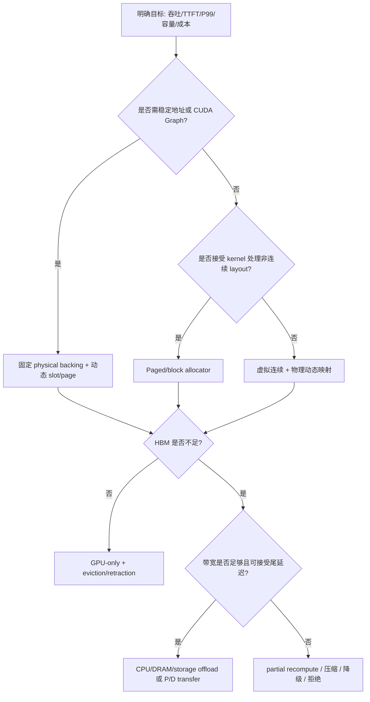

# 设计决策与验证路线

## 1. 先定义指标口径

| 指标 | 定义建议 | 不能替代的指标 |
|---|---|---|
| KV occupancy | live KV tokens/pages ÷ physical capacity | 不等于显存 allocator allocated |
| external fragmentation | free 总量与最大可满足请求/连续范围的差异 | 不等于 page 内浪费 |
| internal/page waste | 已占 page 中未使用 token 比例 | 不等于 Radix protected |
| prefix hit ratio | 命中的 token/page ÷ 请求需处理的 prefix token/page | 不等于 cache size |
| retraction rate | 被迫从 running batch 撤回的 request/step 比例 | 不等于 OOM 次数 |
| TTFT/TPOT/P99 | 端到端首次 token、每 token 和尾延迟 | 不等于 kernel latency |
| transfer cost | KV page 传输字节、时间、带宽利用率 | 不等于 restore 成功 |
| cost/request | GPU、CPU、存储、网络资源和重算折算 | 不等于吞吐 |

## 2. 容量估算

第一阶模型：

```text
KV_bytes = live_tokens × layers × 2 × kv_heads × head_dim × dtype_bytes
```

完整预算：

```text
HBM_for_KV = HBM_total
           - weights
           - runtime_workspace
           - activations
           - graph_static_buffers
           - communication_buffers
           - safety_margin

max_total_tokens ≈ floor(HBM_for_KV / bytes_per_token)
```

对于 page allocator：

```text
allocated_tokens = allocated_pages × page_size
page_waste = allocated_tokens - live_tokens
```

对于输出长度未知的请求，reservation 不能简单等于 `max_context_len`；需要用历史分布、SLO、preemption/recompute 成本和多租户配额共同决定。论文：[Robust KV Cache Management](https://arxiv.org/abs/2607.16892)。

## 3. 方案选择流程



每个分支都必须补充：容量边界、owner、失败恢复、指标和回滚方式。

## 4. 最小验证实验（均为 `[待验证]`）

### 4.1 allocator 正确性

- 输入：`page_size ∈ {1, 16, 64}`；短序列、刚好对齐、partial tail、重复 free、批量 free。
- 步骤：分配 → 写入 sentinel → 释放 → 再分配 → 检查新 owner 是否只读写自己的 index。
- oracle：无 double free；live index 集合互斥；free + live + deferred release = capacity；page 对齐不变量成立。
- 观测：free pages、release pages、最大可分配 segment、debug assertion、GPU memory snapshot。
- 失败判断：若计数闭合但 sentinel 被旧请求读到，说明 ownership/row 映射仍有 bug。

### 4.2 prefix cache / Radix eviction

- 输入：相同 prefix、不同 suffix、跨 page prefix、protected request、LRU/LFU/SLRU。
- 步骤：请求 A 完成并 cache；请求 B 命中；并发持有 lock；触发 eviction；检查 A/B 释放后再分配。
- oracle：命中部分不重复计算；lock_ref>0 节点不淘汰；eviction 只归还合法 page；释放后不存在悬挂 row。
- 观测：prefix hit tokens、evictable/protected size、lock_ref、free pages、recompute tokens。
- 失败判断：命中率正确但 attention 结果错误，优先查 page alignment、value/index 对应和 dtype/layout。

### 4.3 静态 backing 与动态索引的 graph 边界

- 输入：capture batch、非 capture batch、动态 embedding、不同 LoRA/stream variant。
- 步骤：capture → replay → 请求增减 → eager fallback → flush/teardown。
- oracle：满足 eligibility 的 batch replay 成功；不满足条件只 fallback，不释放仍在用的 KV backing；flush 非 idle 不破坏 live batch。
- 观测：graph key、地址、shape、fallback 次数、显存快照、CUDA error。
- 失败判断：若 replay 只在特定 batch 失败，检查 static buffer/shape/variant key；若 flush 后失败，检查 custom graph/KV pool 生命周期。

### 4.4 CPU offload / partial recompute

- 输入：上下文长度、并发、GPU/CPU 带宽、page 放置比例和预取窗口。
- 步骤：GPU-only baseline；按 page/layer offload；加入异步 prefetch；加入 partial recompute。
- oracle：在相同正确率和 SLO 约束下比较容量、TTFT、TPOT、P99、GPU idle、CPU 利用率和传输带宽。
- 失败判断：若平均 TPOT 改善但 P99 恶化，不能判定方案更优；定位 transfer queue、CPU contention 和恢复 miss。

## 5. 故障注入清单

| 故障 | 临时止损 | 永久修复验证 |
|---|---|---|
| KV slot 不足 | 限制 admission、retract、降级或拒绝 | tiny-pool 回归 + 资源计数闭合 |
| Radix lock 泄漏 | 暂停 eviction/隔离 worker | abort/finish/chunk 全路径 lock symmetry |
| duplicate/partial page | 禁止共享 tail，回退重算 | page-aligned oracle |
| offload transfer 超时 | 保留 GPU 热 cache、降低 offload、取消请求 | 超时重试/取消状态机和 P99 测试 |
| P/D 节点失联 | 路由到聚合实例或重算 prefill | transfer checkpoint、幂等恢复、数据校验 |
| graph pool/backing teardown | drain 后再 flush，eager fallback | capture→replay→drain→flush→restart |

## 6. 多租户和生产约束

[建议] 将物理容量拆成全局保留区、租户 quota、系统 emergency reserve 和 prefix shared 区；admission 必须同时检查 request row、KV page、CPU/offload quota 与 transfer queue，而不能只看 `torch.cuda.mem_get_info()`。

[建议] 记录每个请求的 reservation、实际 live tokens、prefix 命中、retract 次数和最终释放时间，才能识别“池不够”与“池有但不可用”的差异。

## 7. 面试复盘题纲

1. 为什么固定 physical backing + 动态 page allocation 往往比每请求 malloc 更适合 serving？
2. PagedAttention 和 vAttention 分别把哪一种碎片/布局问题转移到了哪里？
3. page size 如何在 kernel 开销、内部碎片、prefix 命中和 transfer 粒度之间取舍？
4. 输出长度未知时，reservation 过少/过多如何影响 preemption、吞吐和 P99？
5. offload、压缩和 partial recompute 哪些情况下是容量优化，哪些情况下只是把瓶颈搬家？
6. Radix eviction、host backup、retraction 和 flush 如何共同证明 ownership 闭合？
7. CUDA Graph 的静态地址约束与动态 KV pool 如何共存？
8. 设计一个从 GPU-only 逐步演进到 P/D disaggregation 的迁移和回滚方案。

## 9. 本轮可执行验证结果

### 9.1 环境检查

- `[未验证]` 本机没有 `nvidia-smi` 命令，无法确认 NVIDIA GPU、驱动和显存容量。
- `[已确认]` 已安装 `torch==2.14.0+cu130`，但 `torch.cuda.is_available()` 为 `False`、CUDA device count 为 `0`；没有可用 accelerator，不能执行 CUDA tensor、显存快照或 CUDA Graph replay。
- `[已确认]` 已安装 `pytest==9.1.1`，并通过 `PYTHONPATH=python` 导入 `source/sglang` 源码；为完成导入还补齐了本次 targeted 测试暴露的运行依赖。
- `[已确认]` `source/sglang` 中存在 Radix、allocator、SWA、Mamba、Unified、SLRU 及 storage/HiCache 测试文件。

### 9.2 测试执行记录

使用 `PYTHONPATH=python python3 -m pytest <test> -q` 执行了以下验证：

- `[部分已验证]` `test_radix_cache_unit.py -k 'not memory_allocated'`：35 passed，1 deselected，23 subtests passed。覆盖的 CPU-safe Radix 路径通过。
- `[已验证]` `test_evict_policy.py`：23 passed。
- `test_radix_cache_unit.py` 不排除 CUDA 用例时为 35 passed、1 failed；唯一失败为 `test_memory_allocated`，在 `torch.zeros(..., device="cuda")` 处因 `Found no NVIDIA driver on your system` 退出，属于环境前置条件失败，不是 allocator/Radix 断言失败。
- `test_decode_radix_lock_ref.py` 未进入用例执行：收集时 `ScheduleBatch` 的默认 device 调用 `get_device()`，因没有 CUDA/XPU/HPU/NPU/MUSA/MPS accelerator 而退出。
- `test_swa_unittest.py`、`test_mamba_unittest.py` 和 `test_unified_radix_cache_unittest.py` 也未形成通过记录：相关模块在收集阶段依赖 accelerator；SWA 测试还首先暴露了可选的 `datasets` 导入依赖。

此前从 `No module named pytest` 开始逐层补齐依赖；随后遇到的导入错误也均属于环境配置，不作为源码实现失败统计。

### 9.3 未完成验证及所需环境

| 内容 | 当前状态 | 需要补齐 |
|---|---|---|
| allocator/Radix correctness（CPU-safe） | `[部分已验证：35 passed]` | 继续运行适用的 CPU-safe 测试并固定依赖版本 |
| eviction policy（CPU-safe） | `[已验证：23 passed]` | 真实 GPU pool 场景仍需硬件 |
| GPU physical backing / memory snapshot | `[待验证：无 accelerator]` | NVIDIA GPU、驱动和兼容 PyTorch/CUDA |
| CUDA Graph capture/replay | `[待验证：无 accelerator]` | 支持 Graph 的 GPU、模型和可复现实例 |
| prefix hit / Radix eviction | `[部分已验证：CPU-safe 单元路径]` | 真实 GPU backing、并发 scheduler 和 tiny-pool 场景 |
| decode lock/ref/retraction | `[待验证：收集阶段即因无 accelerator 退出]` | 可用 accelerator 和对应 runtime |
| CPU offload/partial recompute | `[待验证]` | 对应 backend、模型/张量与带宽实验 |
| P/D transfer/RDMA | `[待验证]` | 多进程、多设备、网络/RDMA 环境 |
| throughput/TTFT/TPOT/P99 | `[待验证]` | 固定模型、输入分布、并发、warmup、重复次数和 baseline |

### 9.4 状态纪律

本轮将明确执行成功的 CPU-safe 测试记录为 `[已验证]` 或 `[部分已验证]`，但没有把 GPU、CUDA Graph、真实 decode/retraction、offload、RDMA 或性能结果改成已验证。论文数字仍是作者报告；源码结论继续区分 `[已确认]` 与 `[推断]`。
