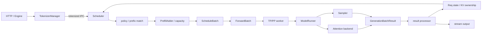
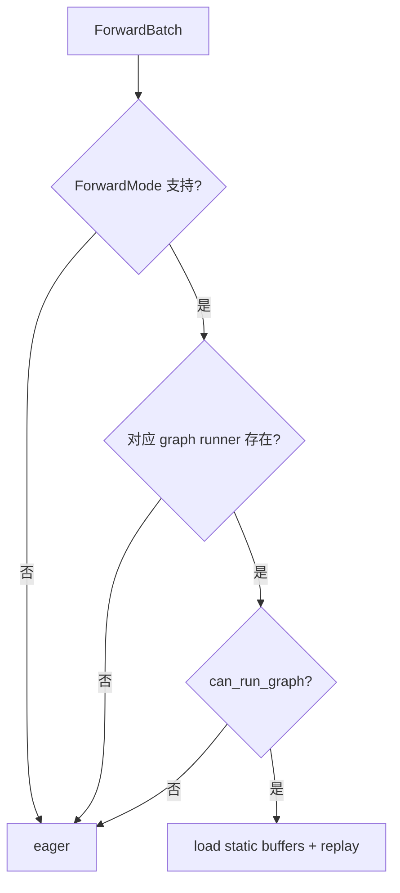
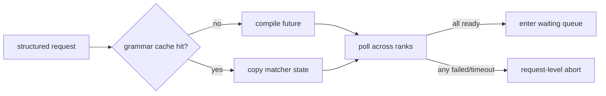
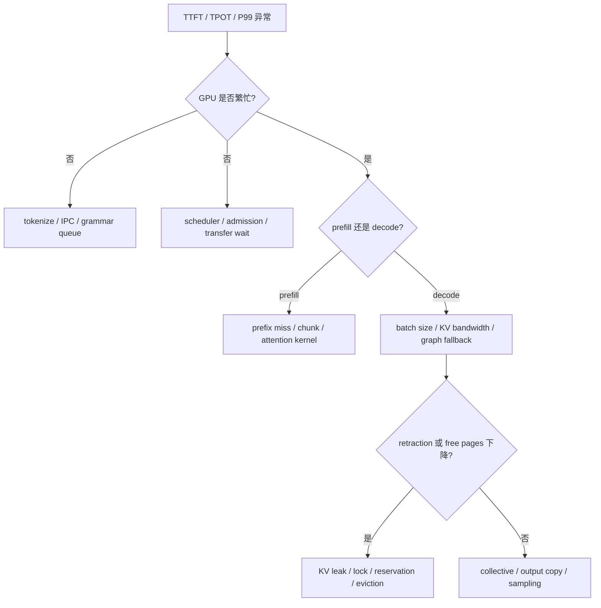

# SGLang 关键推理技术洞察：从调度计划到结果提交

- 主题：从跨模块视角分析 SGLang 在线推理中的调度、执行、CUDA Graph、异步重叠、采样、缓存与故障恢复。
- 适用读者：希望理解 SGLang/vLLM 类推理运行时、定位性能瓶颈或进行系统设计的工程师。
- 源码锚点：`source/sglang` HEAD `78be4b50af`（2026-09-15）。
- 证据边界：本文以当前仓库的源码级 SGLang 知识库和源码引用为依据；没有执行真实模型、GPU、多卡、RDMA 或端到端吞吐实验。
- 状态约定：`[已确认]` 表示当前源码/文档能够直接支持；`[推断]` 表示由源码机制推导出的工程含义；`[待验证]` 需要真实运行；`[建议]` 表示设计或排障建议。

## 1. 核心命题：一次 iteration 是“计划、执行、提交”

把 SGLang 理解成“循环调用模型”的程序会漏掉最关键的系统结构。更准确的抽象是：

```text
admission / planning
  -> immutable-ish execution view
  -> device execution
  -> result and ownership commit
```

一次推理迭代至少包含三种不同责任：

1. **计划**：哪些请求能进入本轮、每个请求计算多少 token、占用哪些 KV 位置；
2. **执行**：把计划翻译成设备 tensor 和 backend metadata，运行模型与采样；
3. **提交**：把 token、KV ownership、finish reason 和流式输出原子地反映到请求状态。



边界说明：

- `Req` 是 scheduler 进程内的可变请求状态；
- `ScheduleBatch` 是本轮的调度工作对象，仍持有请求与 engine-lifetime pool 引用；
- `ForwardBatch` 是 worker/device 执行所需的 tensor 与 metadata 视图；
- `GenerationBatchResult` 不是用户响应，仍需由 result processor 提交到 `Req`；
- TokenizerManager/Detokenizer 才将 token 状态转换为面向 API 的增量输出。

来源：[`M04 Scheduler`](../sglang/01-modules/M04-scheduler-batching/README.md)、[`M05 模型执行`](../sglang/01-modules/M05-model-execution/README.md)。

## 2. 洞察一：Scheduler 像一个小型计划编译器

### 2.1 输入不是一张等待队列

`Scheduler.get_next_batch_to_run` 的输入至少包含：

- 新到达的 waiting requests；
- 仍在 decode 的 `running_batch`；
- 上一轮 `last_batch`；
- chunked request；
- prefix cache 命中及锁状态；
- request row、KV slot/page 和 token budget；
- priority、LoRA、PP microbatch、speculative 和 backend tile 约束。

输出也不是单一 batch，而是 `NextBatchPlan`：它区分“本轮执行对象”和“决策后仍然活跃的 running 状态”。这使上一轮 prefill 请求可以并入后续 decode，而不粗暴覆盖正在运行的请求集合。

[已确认] 普通 event loop 每轮执行 `ingest_requests → get_next_batch_to_run → run_batch → process_batch_result`；无 batch 时进入 idle 维护。来源：[`scheduler.py:1893-1925`](../source/sglang/python/sglang/srt/managers/scheduler.py)。

### 2.2 admission 是多个预算的交集

`PrefillAdder` 可以理解为“入场检查器”，不是单纯按 batch size 截取数组。一个请求能否进入本轮取决于：

```text
admissible(request) =
    request-row budget
  ∩ prefill-token budget
  ∩ KV page/slot budget
  ∩ max-running-requests
  ∩ PP/DP/backend shape constraints
  ∩ LoRA / grammar / transfer readiness
  ∩ scheduling policy
```

例子：

```text
max_prefill_tokens = 4096
A 原始 prompt = 3000，prefix hit = 2000，实际 extend = 1000
B 原始 prompt = 3500，prefix hit = 0，实际 extend = 3500
```

按原始长度看 A+B 是 6500；按本轮实际计算量看是 4500，仍超过预算。调度器可以选择 A、对 B 做 chunked prefill，或推迟 B。这里同时涉及计算 token、KV 新页和请求行，任何单一计数都不能完整代表容量。

[已确认] `Req.prefix_indices` 表示已经命中/拥有的 KV，`extend_range` 表示本轮需要写入的区间；`prepare_for_extend` 只为未命中部分准备输入和 `out_cache_loc`。来源：[`M08 KV Cache`](../sglang/01-modules/M08-kv-cache/README.md)。

### 2.3 `ScheduleBatch → ForwardBatch` 是编译边界

`ScheduleBatch` 包含请求对象、pool 引用、forward mode、采样信息和运行时状态；`ForwardBatch.init_new` 将其翻译为设备执行视图：

- `input_ids`；
- `req_pool_indices`；
- `seq_lens`；
- `out_cache_loc`；
- extend/prefix lengths；
- sampling、LoRA、speculative 和 multimodal metadata。

[已确认] `ForwardBatch.init_new` 明确不应修改输入 `ScheduleBatch`。这一边界让 scheduler 能在 overlap 模式保存、过滤或合并自己的状态，同时 worker 获得对应本次 forward 的快照。来源：[`forward_batch_info.py:758-908`](../source/sglang/python/sglang/srt/model_executor/forward_batch_info.py)。

[推断] 如果新增字段只写进 `ScheduleBatch` 而没有同步到 `ForwardBatch`，常见症状不是立即报错，而是 backend 看到旧 shape、旧 row 或旧 cache location，最终表现为错误 token、非法访问或仅在 overlap/graph 下复现。

## 3. 洞察二：Prefill 和 Decode 是两种资源模型

| 维度 | Prefill / Extend | Decode |
|---|---|---|
| 每请求每轮 token | 可很多，长度差异大 | 通常每请求追加一个或少量 token |
| 主要目标 | 控制 TTFT、吸收长 prompt | 控制 TPOT/P99、保持活跃并发 |
| 批次预算 | token 数、chunk 大小、KV 新页 | 活跃 request 数、下一 token KV 容量 |
| 计算特征 | 较强计算密度，shape 波动大 | 小步反复，launch/内存带宽更敏感 |
| 主要风险 | 长 prompt 独占、TTFT 排队 | KV 耗尽、retraction、尾延迟 |

### 3.1 Continuous batching 不是修改正在执行的 kernel

动态性发生在 iteration 边界：本轮 forward 完成后，scheduler 重新组合下一轮 batch。新请求不会被插入已经发射的 GPU kernel。

```text
t0: A/B prefill
t1: A/B decode；C 到达等待
t2: C prefill（A/B 状态仍保留）
t3: A/B/C 组成后续 decode 状态
```

[已确认] 上一轮 extend batch 经过过滤后可并入 `running_batch`；若有可运行的新 prefill，则调度器可优先执行它，否则更新现有 decode batch。来源：[`调度器与连续批处理`](../sglang/02-request-flow/03-调度器与连续批处理.md)。

### 3.2 Chunked prefill 是公平性与资源峰值机制

对超长 prompt 分块有三个作用：

1. 限制单轮 token 和 activation 峰值；
2. 给 decode 或其他 prefill 留出调度机会；
3. 让已经计算的 chunk KV 跨轮保留。

但它也增加状态复杂度：同一 `Req` 必须复用 request row，partial page 和 `cache_protected_len` 不能按完整 prefix 处理，下一轮 input range 必须从已提交长度继续。

### 3.3 Cache-aware policy 也有 CPU 成本

LPM（最长前缀命中）可能减少 prefill 计算，HRRN 可引入等待老化，FCFS 更简单可预测。队列很大时，为所有候选做 prefix match 和复杂排序可能让 scheduler CPU 成为瓶颈。

[推断] 最优策略不是“始终最大 prefix hit”，而是最小化端到端目标：

```text
objective ≈ GPU compute saved
          - scheduler CPU overhead
          - fairness penalty
          - eviction/reload cost
          - SLO violation cost
```

[待验证] 不同策略对 TTFT、TPOT、吞吐和饥饿率的影响必须使用相同流量分布实测。

## 4. 洞察三：Attention backend 与 CUDA Graph 是能力协商

### 4.1 backend 名称不是完整执行语义

backend registry 先解析名称，再根据模型和部署模式实例化对象。MLA、普通 MHA、稀疏 attention、Mamba/linear state、PDMUX、two-batch overlap 和 speculative verify 可能生成不同对象拓扑。

分析 backend 必须同时记录：

```text
(model architecture,
 forward mode,
 KV/state pool type,
 page size,
 TP/DP/CP/DCP,
 speculative mode,
 graph mode)
```

仅知道 `--attention-backend` 不足以推断 KV layout、metadata 或 kernel。

### 4.2 metadata 被刻意拆成 graph 外和 graph 内

`AttentionBackend` 将准备过程分为：

- `init_forward_metadata`：eager 入口；
- `init_forward_metadata_out_graph`：`.cpu()`、`.item()`、动态 shape 等 graph 外工作；
- `init_forward_metadata_in_graph`：可捕获的静态 device 操作。

这个边界的本质是：CUDA Graph 要求重放时地址和 shape 契约稳定，但请求长度、CPU 决策和部分索引每轮变化。

### 4.3 `can_run_graph` 是运行时协商，不是总开关



可能触发 eager fallback 的条件包括：

- batch/token 数超过 capture bucket；
- padding waste 超过阈值；
- replace embeddings 或动态 embedding；
- speculative width/ragged verify 不兼容；
- LoRA/DSA variant 没有对应 graph key；
- DP/CP/MLP sync 条件不满足；
- backend 不支持该 mode 的 graph metadata。

[已确认] decode graph 与 prefill graph 使用独立 runner、bucket 和生命周期；prefill 可把实际 token 数填充到 aggregate capture bucket，但不满足 fitting/padding 条件时仍必须 eager。来源：[`M09 Attention 与 CUDA Graph`](../sglang/01-modules/M09-attention-cuda-graph/README.md)。

### 4.4 稳定 backing 与动态请求并不矛盾

CUDA Graph 的固定 input buffer、物理 KV tensor 的稳定地址和请求运行期动态领取 KV slot/page 属于不同层级。正确组合是：

```text
固定：graph static buffers / physical KV backing / capture bucket
动态：batch membership / logical row / slot-page indices / valid lengths
桥接：每轮把 live metadata 写入固定 view，再 replay
```

这也解释了为什么 `torch.cuda.empty_cache()` 不能证明 KV、Radix、graph static buffer 和 backend workspace 都已正确回收。

## 5. 洞察四：Overlap 的核心不是“并行”，而是生命周期

### 5.1 同时存在多个时间阶段

在 overlap loop 中，可能同时存在：

- 当前正在准备或发射的 batch；
- GPU 正在执行的 batch；
- `result_queue` 中等待 CPU 处理的上一批结果；
- 已更新 scheduler 状态但仍被异步 copy/closure 引用的 buffer。

因此“当前 Python 变量是什么”不能直接回答“设备上谁还在使用这块内存”。

### 5.2 三类 hazard

| Hazard | 示例 | 必须使用的边界 |
|---|---|---|
| RAW（读后依赖写） | sampler 等 logits forward 完成 | stream/event/future completion |
| WAR（写覆盖未完成读） | scheduler 重写 static input，而 graph 仍读 | backend `SharedReadEnds`/barrier |
| 生命周期悬挂 | delay-sample closure 持有 grammar mask | 明确 cleanup/ownership transfer |

[已确认] attention backend 声明共享读取何时结束；decode/verify 可以指向 replay 内的读结束点，未知模式采用保守 fence。来源：[`base_attn_backend.py:22-159`](../source/sglang/python/sglang/srt/layers/attention/base_attn_backend.py)。

### 5.3 一个典型反例

```text
1. batch A 创建 grammar_mask
2. forward 完成，sampling 被 delay_sample_func 延后
3. scheduler 认为 A 已结束，复用或保留 mask 引用
4. batch B 到来，占用更多显存
5. A 的 closure 尚未执行，mask 无法释放
```

这可能表现为显存缓慢增长，而不是立即错误。SGLang 在 logits preprocess 后主动清除 `grammar_mask`，就是为了避免 overlap 延迟闭包长期持有大 tensor。

[建议] 排查 overlap 问题时同时记录 batch id、forward pass id、CUDA stream/event、future 状态、static buffer generation 和 owner；只打印 request id 不足以定位跨轮 race。

## 6. 洞察五：采样不是“模型之后的 Python 后处理”

### 6.1 logits pipeline 是正确性路径

```text
raw logits
  -> custom processor / NaN-Inf sanitize
  -> repetition/presence/frequency penalty
  -> grammar mask
  -> post-grammar logit bias
  -> temperature
  -> top-k / top-p / min-p
  -> multinomial or argmax
  -> next token id
```

这些状态多数是 batch-aligned device tensor。过滤、合并或重排请求时，temperatures、top-p、grammar、penalty、seed、logprob 请求等必须与 `reqs[i]` 同步变化。

### 6.2 Grammar 是异步编译和 rank 一致性协议

Grammar backend 会缓存编译结果，并用 future 异步编译首次出现的 schema/regex。请求不能因为某个本地 rank 已准备好就直接进入执行：PP/DP/TP 相关 rank 需要形成 ready 交集和 failed 并集。



[已确认] 编译异常被包装为 `InvalidGrammarObject` 并转成请求级失败，而不是留到 sampler 中破坏整个 batch。来源：[`M10 采样与约束输出`](../sglang/01-modules/M10-sampling-constraints/README.md)。

[推断] grammar queue backlog 会直接影响结构化请求 TTFT，即使 GPU utilization 很低；因此只分析 GPU trace 会漏掉这一类延迟。

## 7. 洞察六：Speculative decoding 是事务式提交协议

推测解码的详细事务分析见 [`06-speculative-decoding-as-transaction.md`](06-speculative-decoding-as-transaction.md)。这里给出跨模块位置：

```text
draft proposal
  -> target verifies candidate block
  -> calculate accepted prefix / rejected suffix / bonus
  -> commit output + target KV for accepted part
  -> rollback/free invalid suffix
  -> publish new committed length
```

核心不变量：

1. 只有 accepted token 对用户可见；
2. target KV 只能提交到 accepted/合法 bonus 边界；
3. rejected suffix 不能继续占用请求有效 cache length；
4. `seq_lens`、next input、sampling state 和 output length 必须基于同一个 committed length；
5. future、IPC、grammar 或 transfer 失败不能留下“输出提交了但 KV 未提交”的半状态。

[推断] speculative 的性能收益不只取决于 acceptance rate，还取决于 verify batch shape、draft/target pool、graph bucket、rollback 成本和 scheduler 是否能利用减少的 target iterations。

## 8. 洞察七：并行必须按四层分析

详细矩阵见 [`07-parallel-and-backend-capability-matrix.md`](07-parallel-and-backend-capability-matrix.md)。最重要的分层是：

| 层 | 问题 | 代表对象 |
|---|---|---|
| 拓扑 | 哪些 rank 在一起？ | WORLD、TP、PP、ATTN_CP/TP、MOE_DP/EP/TP |
| 布局 | 每个 rank 持有什么？ | layer range、head、KV、expert、token slice |
| 通信 | 数据如何交换？ | all-reduce、all-gather、reduce-scatter、A2A、P2P |
| 调度 | shape 和时序如何满足？ | padding、microbatch、graph bucket、overlap |

例：`tp_size=8, dp_size=2, attn_cp_size=1` 时，attention TP 宽度是 4，形成两个 attention DP replica；但 MoE 的 DP/EP/TP 仍要按独立配置推导，不能直接复用 attention 坐标。

[已确认] `gpu_id`、global rank、TP rank、PP rank、rank-in-group 是不同坐标。一个进程可以同时属于多个不同成员顺序的 group。来源：[`M07 分布式并行`](../sglang/01-modules/M07-分布式并行.md)、[`M20 并行策略`](../sglang/01-modules/M20-parallel-strategies/README.md)。

## 9. 洞察八：P/D 与 HiCache 是两种可组合协议

两者不能混成“远端 KV cache”：

- **P/D disaggregation**：prefill owner 产生 KV，decode owner 通过 transfer 协议接收并提交；
- **HiCache**：本地 GPU cache 之外增加 host/storage 层，执行 prefetch、restore 和 eviction。

组合路径可能是：

```text
prefill instance KV
  -> sender / transfer metadata
  -> decode staging
  -> local GPU KV commit
  -> later HiCache host backup
  -> GPU eviction
  -> future restore
```

每次 ownership 转移都至少需要：源/目标 page layout、transfer id、completion 状态、abort/timeout、资源清理和提交点。`poll DONE` 之前，request 不能把未完整写入的目标 KV 当作可读 prefix。

[已确认] HiCache restore 失败、超时或 abort 必须清理 staging/prefetch 资源；P/D transfer 的 control metadata 与实际 payload 可走不同通道。来源：[`M13 分离部署与 HiCache`](../sglang/01-modules/M13-disaggregation-hicache/README.md)。

## 10. 端到端性能因果树

### 10.1 不要从单一指标下结论



### 10.2 建议指标表

| 阶段 | 必须观测 | 常见误判 |
|---|---|---|
| Tokenize/IPC | queue time、tokenize time、message size | 把低 GPU 利用率全归因于 batch 小 |
| Grammar | compile/cache hit、future wait、failed rank | 只看 sampler kernel |
| Admission | waiting/running、实际 extend tokens、拒绝原因 | 只看请求数 |
| Prefix/KV | hit tokens、free/release/protected、eviction | cache 大等于命中高 |
| Prefill | chunk size、token throughput、TTFT | 单请求 kernel 快等于 TTFT 好 |
| Decode | active requests、TPOT、graph replay/fallback | graph 开启等于实际 replay |
| Speculative | accepted length、verify width、rollback | acceptance 高等于吞吐必高 |
| Distributed | collective time、padding、rank skew | world size 正确等于 group 正确 |
| Transfer | bytes、queue、staging wait、timeout | 带宽峰值等于端到端恢复快 |
| Output | D2H、detokenize、stream backpressure | GPU 完成等于客户端收到 |

[建议] 优化结果至少同时报告吞吐、TTFT、TPOT、P99、显存峰值和错误/撤回率；平均值改善但 P99 或 abort 增加，不能直接判定整体更优。

## 11. 失败模型与降级路径

| 失败 | 正确降级/传播 | 不能接受的半状态 |
|---|---|---|
| prefill budget 不足 | chunk、等待或明确拒绝 | 已移出 waiting 但无 batch owner |
| decode KV 不足 | retract/requeue 或 request abort | row 已释放但 request 仍引用 |
| graph 不 eligible | eager fallback | 强行 replay 错误 shape |
| grammar 编译失败 | 请求级 abort | 某些 rank 继续运行 |
| overlap future 失败 | 取消依赖、保持提交边界 | token 已输出而 KV 未提交 |
| speculative reject | rollback suffix、更新 committed length | rejected KV 继续可见 |
| transfer timeout | abort/clear staging、可重算或重路由 | staging room 永久占用 |
| client disconnect | abort request、释放状态 | scheduler 继续无界生成 |
| worker/rank crash | 向父进程传播、清理 process group | 其他 rank 永久等待 collective |

## 12. 修改影响地图

### 修改 admission / schedule policy

联查：`PrefillAdder`、prefix match、request-row/KV capacity、chunked prefill、priority/preemption、metrics 和 starvation tests。

### 修改 `ScheduleBatch` / `ForwardBatch`

联查：extend/decode preparation、`ForwardBatch.init_new`、attention metadata、graph buffers、overlap snapshot、PP proxy、sampling 和 result processor。

### 修改 attention backend

联查：KV layout、ForwardMode、graph 内外 metadata、SharedReadEnds、TP/DP/CP shape、spec verify、fallback 与数值 oracle。

### 修改 sampling/grammar

联查：batch row alignment、penalty/mask 顺序、future cache、跨 rank ready/failed、seed/logprob、delay sampling cleanup 和请求级错误。

### 修改 speculative commit

联查：accepted length、target/draft KV、`Req.output_ids`、bonus、grammar、next input、IPC order 和 finished request cleanup。

### 修改并行宽度或 collective

联查：resolved args、group members、weight/head/expert layout、padding、graph bucket、collective order、PP layer ownership 和 destroy alias。

## 13. 最小验证矩阵

| 层级 | 可验证内容 | 当前状态 |
|---|---|---|
| 静态源码 | 对象、分支、调用链、显式断言 | `[已确认：本文主要证据]` |
| CPU-safe 单测 | Radix/eviction、部分 policy/grammar 逻辑 | `[部分已验证，见既有专题记录]` |
| 单 GPU | eager/graph、KV backing、sampling 数值、retraction | `[待验证]` |
| 多 GPU | TP/PP/DP/CP/EP group、collective、rank failure | `[待验证]` |
| 多实例/网络 | P/D、HiCache、RDMA、timeout/retry | `[待验证]` |
| 性能压测 | 吞吐、TTFT、TPOT、P99、成本 | `[待验证]` |

验证时应先固定：模型、dtype/量化、设备、并行配置、prompt/output 分布、并发、cache 热度、warmup 和重复次数。没有这些条件，性能数字不可比较。

## 14. 常见错误心智模型

- **错误**：“continuous batching 会把请求插入正在运行的 kernel。”  
  **正确**：它在 iteration 边界重新计划下一批。
- **错误**：“启用 CUDA Graph 后所有 decode 都 replay。”  
  **正确**：每个 batch 都要通过 mode、bucket、variant 和 backend eligibility。
- **错误**：“采样是 CPU 端的小后处理。”  
  **正确**：mask、penalty、概率过滤和 batch 对齐属于 device 正确性路径。
- **错误**：“speculative decoding 就是多输出几个 token。”  
  **正确**：它是 target 验证后的事务式提交与回滚。
- **错误**：“TP=8 表示所有 attention 都是 8-way。”  
  **正确**：DP Attention/CP 可派生不同 attention TP 宽度。
- **错误**：“P/D 和 HiCache 都是远端缓存，因此是一回事。”  
  **正确**：一个是跨实例生产/消费协议，一个是分层驻留/恢复机制。

## 15. 推荐阅读路线

1. [`M04 Scheduler`](../sglang/01-modules/M04-scheduler-batching/README.md)：理解计划如何形成；
2. [`M05 模型执行`](../sglang/01-modules/M05-model-execution/README.md)：理解执行视图；
3. [`M08 KV Cache`](../sglang/01-modules/M08-kv-cache/README.md)：理解 ownership；
4. [`M09 Attention 与 CUDA Graph`](../sglang/01-modules/M09-attention-cuda-graph/README.md)：理解 backend/graph 协商；
5. [`M10 Sampling`](../sglang/01-modules/M10-sampling-constraints/README.md)：理解 token 提交前的约束；
6. [`06 推测解码事务`](06-speculative-decoding-as-transaction.md)；
7. [`07 并行与后端能力矩阵`](07-parallel-and-backend-capability-matrix.md)；
8. [`性能关键路径`](../sglang/90-cross-module/performance-critical-paths.md) 与 [`错误边界`](../sglang/90-cross-module/error-boundaries.md)。

## 16. 证据纪律

- 本文不把静态调用链写成真实 GPU 已运行；
- 不把 graph runner 存在写成每个请求都会 replay；
- 不把测试文件存在写成测试通过；
- 不把论文或 benchmark 中的 “up to” 数字外推到当前环境；
- 不把一个 backend/模型的 layout 外推到所有 backend；
- 涉及吞吐、延迟、带宽和数值正确性的结论均需目标硬件验证。
