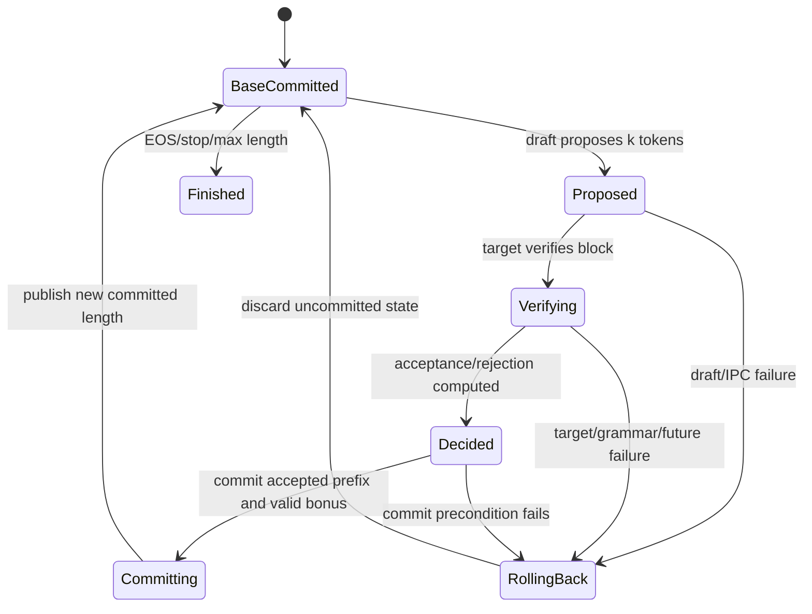

# SGLang 推测解码洞察：把 Draft/Verify 理解为事务协议

- 主题：从 correctness、KV ownership 和失败恢复角度分析 SGLang speculative decoding。
- 源码锚点：`source/sglang` HEAD `78be4b50af`（2026-09-15）。
- 证据边界：静态源码和仓库文档已确认；真实 acceptance rate、GPU 执行、CUDA Graph、跨进程吞吐和数值结果未验证。
- 前置阅读：[`SGLang 关键推理技术洞察`](05-sglang-inference-technical-insights.md)、[`M11 Speculative decoding`](../sglang/01-modules/M11-speculative-decoding/README.md)。

## 1. 核心命题

Speculative decoding 不是“用小模型一次猜多个 token”这么简单。系统真正需要保证的是：

> draft 可以产生任意候选，但只有经过 target 验证并完成状态提交的前缀，才能成为请求可见的事实。

这和事务系统非常相似：

```text
begin
  -> draft proposal
  -> target validation
  -> decide accepted prefix / replacement / bonus
  -> commit output, KV and sequence state together
or
  -> rollback rejected suffix / abort incomplete operation
```

目标不是让 draft 语义取代 target，而是在保持 target sampling distribution/correctness contract 的前提下，减少昂贵 target iteration 的次数。

## 2. 两阶段状态机



状态解释：

- **BaseCommitted**：请求对外可见的 token、target KV 和 sequence length 一致；
- **Proposed**：候选仅属于 draft 工作区，不应直接出现在用户输出；
- **Verifying**：target 计算候选块的概率/验证结果；
- **Decided**：已得到 accepted length、replacement 或 bonus，但尚未完成所有 owner 更新；
- **Committing**：将多个状态推进到同一个新边界；
- **RollingBack**：释放/截断未提交的 draft 或 target suffix。

[已确认] SGLang 的 speculative 抽象包括 target worker、可选 draft worker、draft memory pool、attention backend、graph runner，以及 verify 完成和 request 完成回调。来源：[`base_spec_worker.py`](../source/sglang/python/sglang/srt/speculative/base_spec_worker.py)。

## 3. 提交边界包含哪些状态

一次成功 commit 不只追加 `output_ids`，至少涉及：

| 状态 | 提交要求 | 失败症状 |
|---|---|---|
| accepted token ids | 只暴露连续合法前缀 | 用户看到 target 未接受 token |
| target KV | 长度与 accepted/bonus 边界一致 | 下一轮 attention 读错上下文 |
| draft KV/state | 为下一轮保留合法部分或重建 | draft 从错误位置继续 |
| `seq_lens` | 指向新的 committed length | cache location 与 position 错位 |
| request row mapping | 只引用有效 target slots | rejected suffix 悬挂 |
| sampling/grammar state | 消费与已提交 token 一致 | grammar matcher 多走或少走一步 |
| finish/stop state | 在提交后判断 EOS/stop | 重复输出或漏结束 |
| output stream | 不早于内部提交 | 客户端已见 token 但服务端回滚 |

因此理想的不变量是：

```text
visible_output_len
  == committed_target_token_len
  == grammar_consumed_len
  == request_valid_kv_len (按布局语义换算)
```

对于存在 bonus token、page alignment 或独立 draft pool 的实现，物理分配长度可以大于逻辑 committed length；但“有效边界”必须一致。

## 4. k=4 的最小例子

假设当前已提交序列为 `P`，draft 给出：

```text
candidate = [a, b, c, d]
```

target 验证后，只接受 `a`，并按 target 规则给出 replacement `x`：

```text
before: P
proposal: P + [a, b, c, d]
commit:   P + [a, x]
rollback: candidate suffix [b, c, d]
```

需要同步发生：

1. 用户输出追加 `a, x`，不是 `a, b, c, d`；
2. target KV 保留 `a` 和合法 replacement/bonus 对应状态；
3. `b,c,d` 的草稿或临时 cache 不再属于请求有效上下文；
4. grammar/penalty/ngram 状态按 `a,x` 推进；
5. 下一轮 positions、`seq_lens` 和 cache locations 从 `P+[a,x]` 开始。

“先输出 a，再异步处理 KV”也可能出错：如果 KV 提交失败，用户已经观察到不可回滚的外部状态。因此流式输出必须位于内部 commit 之后。

## 5. Acceptance 不是一个整数这么简单

不同算法可能使用 greedy match、rejection sampling、MTP/EAGLE、ngram、DFlash 或其他 proposal/verification 方式。但系统层都需要回答：

- accepted prefix 长度是多少；
- reject 点是否需要 target replacement；
- bonus token 是否存在且是否合法；
- 每个请求的 candidate width 是否相同；
- finished/EOS 出现在候选块中间时如何截断；
- grammar mask 对 draft 和 target 各在哪一步生效；
- logprob 返回对应 draft 分布还是 target 分布。

[已确认] 当前 checkout 包含 EAGLE/MTP、ngram、DFlash、DSpark、UNO、standalone/decoupled 等路径；它们共享 proposal/verify/commit 边界，但不共享所有 KV 和 graph 细节。来源：[`M11`](../sglang/01-modules/M11-speculative-decoding/README.md)。

## 6. KV ownership：target 与 draft 不能混账

### 6.1 三种常见布局

```text
A. shared/same worker pool
   target and draft coordinate within related pools/views

B. independent draft pool
   target KV owner != draft KV owner

C. decoupled draft service/process
   candidate state crosses IPC/network boundary
```

无论哪种布局，都要区分：

- target 已提交 KV；
- target 为 verify 临时写入的 KV；
- draft proposal KV/state；
- rejected suffix；
- accepted prefix 的下一轮可复用状态。

### 6.2 不能只截短 Python list

如果 reject 后只修改 `Req.output_ids`，但没有回收或更新：

- request-to-token row；
- target allocator slots/pages；
- draft allocator；
- graph/static metadata；
- prefix/radix protection；

下一轮仍可能读取 rejected suffix，或表现为 free page 持续下降。

[建议] 为每个 request 记录三个长度：

```text
visible_len      # 已输出
committed_len    # target 验证并提交
allocated_len    # 当前物理/逻辑预留
```

正确关系通常是 `visible_len == committed_len <= allocated_len`；若存在尚未输出但已内部提交的 buffering，需要显式记录差异原因，而不能让三个概念隐式混用。

## 7. Grammar 与 sampling 的交叉约束

### 7.1 Draft 合法不代表 target 必须接受

Grammar 只限定 token 是否处于合法语言中，不决定 target 概率是否接受候选。反过来，target 概率上可接受的 token 若违反当前 grammar state，也不能提交。

```text
candidate token
  -> grammar legality
  -> target probability/acceptance
  -> commit matcher state
```

具体算法可能调整顺序或融合计算，但提交后 grammar matcher 必须与可见 token 一致。

### 7.2 Penalty 和随机数状态

repetition/presence/frequency penalty 依赖已提交 token 历史；seeded sampling 依赖随机数消费顺序。被 reject 的 draft token不应永久推进 target 的 penalty/history/RNG 语义。

[推断] 若普通 decode 正确、speculative 模式偶发不一致，应优先比较：

1. target logits transform 顺序；
2. accepted/replacement token 对 penalty state 的更新；
3. grammar matcher commit 次数；
4. per-request seed/RNG 的消费位置；
5. logprob 对应的 token/position。

## 8. CUDA Graph 与 ragged verify

Speculative verify 比普通 decode 更难 graph 化：

- 每请求 candidate width 可能不同；
- accepted length 是运行后才知道的动态值；
- batch 中可能同时出现 finished、rejected 和 full-accepted 请求；
- graph capture width 与 live proposal width 必须兼容；
- backend 可能需要专用 ragged verify metadata。

[已确认] decode graph eligibility 会检查 speculative request width、ragged verify、batch size 和其他 variant；不匹配时 eager fallback 是正确行为。来源：[`M09`](../sglang/01-modules/M09-attention-cuda-graph/README.md)。

不能用“启用了 speculative + CUDA Graph”推断 verify 必定 replay。正确指标应区分：

```text
graph eligible batches
actual replay batches
fallback reason distribution
capture padding/waste
```

## 9. Overlap 与异步完成顺序

在 overlap 模式下可能出现：

```text
iteration N target verify on GPU
iteration N-1 acceptance processing on CPU
iteration N+1 draft preparation
```

正确性要求：

- N+1 不能基于尚未提交的 N 长度；
- acceptance future 失败必须阻止后续 publish；
- buffer 复用要等待 target/draft 对它的最后一次读取；
- request abort 必须取消或忽略所有旧 generation 的 future；
- 旧 result 不能写入已经复用给新请求的 row。

[建议] 使用 `(rid, request_generation, proposal_round)` 作为异步结果身份，而不只使用 `rid`。这是一项设计建议，是否与当前所有实现一致需要逐算法验证。

## 10. Decoupled speculative 的 IPC 提交顺序

当 draft 与 verifier 分离时，事务边界跨进程：

```text
DraftSync
  -> proposal segment(s)
  -> verifier result
  -> VerifyCommit(committed prefix)
  -> next DraftSync or DraftClose
```

需要额外保证：

- commit segment 有序；
- 重复消息幂等或可检测；
- request close 不早于最后 commit；
- timeout 后旧消息不能污染重新创建的同 rid 请求；
- partial transfer 不成为有效 proposal；
- verifier 与 drafter 对 committed length 达成一致。

[已确认] `decoupled_spec_io.py` 定义请求 key、同步、commit、close 和 committed token 校验等消息契约。来源：[`decoupled_spec_io.py`](../source/sglang/python/sglang/srt/speculative/decoupled_spec_io.py)。

## 11. 失败矩阵

| 失败点 | 应保持的最后安全状态 | 需要清理 |
|---|---|---|
| draft forward 失败 | 原 BaseCommitted | draft temp KV/buffer/future |
| proposal IPC 超时 | 原 BaseCommitted | partial segments/channel state |
| target verify 失败 | 原 BaseCommitted | target temporary suffix |
| acceptance CPU future 失败 | 不发布新长度 | result/future/static views |
| grammar 不兼容 | request abort 或回退普通 decode | draft request state |
| graph 不 eligible | eager verify | 不应回滚请求 |
| commit 中请求被取消 | 不再输出，释放两侧资源 | target/draft/IPC/row |
| bonus 触发 EOS | 提交到 EOS，之后结束 | EOS 后候选 suffix |
| worker crash | 传播至 scheduler/parent | 进程级 pool 与 peer wait |

关键区别：graph fallback 是能力降级，不是事务失败；target verify 或 commit 失败才需要回到安全提交点或终止请求。

## 12. 性能模型

粗略收益不能只看 acceptance rate。可用以下变量思考：

```text
k                 = proposal tokens per request
E[accepted]       = average committed draft tokens
C_draft           = draft cost
C_verify(k)       = target block verification cost
C_normal          = one normal target decode step
C_commit          = acceptance/rollback/CPU/IPC cost
```

理想化每个已提交 token 成本：

```text
cost_per_committed_token
  ≈ (C_draft + C_verify(k) + C_commit)
     / max(1, E[accepted] + bonus)
```

但真实系统还要加入：

- verify shape 对 kernel/graph 的影响；
- draft 与 target 的显存竞争；
- scheduler batch composition；
- rejection 后的 KV 回收；
- grammar/logprob 开销；
- CPU acceptance 与 IPC；
- 多请求 acceptance 方差导致的 raggedness。

[推断] 高 acceptance rate 仍可能性能变差，例如 draft 很重、verify 失去 graph、batch padding 过多或 CPU commit 成为瓶颈。

## 13. 必须观测的指标

| 类别 | 指标 |
|---|---|
| Proposal | draft steps、candidate width、draft latency |
| Acceptance | accepted length 分布、full/partial/reject 比例、bonus 比例 |
| Target | verify latency、target forwards/request、eager/graph 比例 |
| Memory | draft/target KV 峰值、rollback pages、泄漏计数 |
| Scheduler | batch size、ragged width、waiting time、fallback reason |
| Correctness | token equality/distribution、grammar violations、logprob delta |
| SLO | TTFT、TPOT、P50/P99、吞吐、abort rate |
| Decoupled | IPC bytes、queue time、timeout、duplicate/out-of-order |

## 14. 最小 correctness oracle

### 14.1 Greedy 模式

固定模型、prompt 和 greedy 参数：

1. 普通 decode 生成 baseline；
2. speculative 生成相同长度；
3. 比较 token-by-token 输出；
4. 每轮检查 `visible_len == committed_len`；
5. 完成后检查 request row、draft/target free pages 和 lock/ref 回到预期。

Greedy 输出应便于做严格相等比较；但仍需控制模型、dtype、backend 和数值确定性。

### 14.2 Sampling 模式

随机采样不应简单要求单次 token 完全相等，除非实现承诺相同 seed 与随机数轨迹。应验证：

- target distribution correctness 的算法 oracle；
- 大样本统计分布；
- seed 支持边界；
- grammar/stop/logprob 语义；
- 无非法 token 或重复 commit。

### 14.3 故障注入

在 draft、verify、acceptance future、commit、IPC send/poll 各点注入失败，断言：

```text
输出没有部分发布
committed length 不跨越失败点
rejected/temp KV 被释放
grammar/penalty 状态未多推进
请求能明确 abort、回退或重试
```

## 15. 修改影响清单

修改 proposal/acceptance 时联查：

- target distribution correctness；
- bonus/replacement/EOS；
- grammar、penalty、seed、logprob；
- accepted length 到 `Req`、KV row 和 next input 的投影；
- graph width 与 backend metadata；
- overlap future 和 decoupled IPC；
- finished/abort cleanup。

修改 draft pool 或 decoupled protocol 时还要联查 allocator ownership、generation id、timeout、重试幂等、close 顺序和 process teardown。

## 16. 当前验证状态

- `[已确认]`：公共抽象、proposal/verify/commit 静态控制流、消息契约和关键不变量来源；
- `[待验证]`：真实 GPU target/draft forward、acceptance 数值、grammar/spec 组合、CUDA Graph replay、decoupled 多进程、吞吐和 SLO；
- `[待验证]`：不同 speculative 算法是否对本文建议的 generation/round identity 采用完全一致实现。

本文不把“算法文件存在”写成该算法在当前模型或硬件上可用，也不把 acceptance rate 当作独立于 workload 的系统常数。
