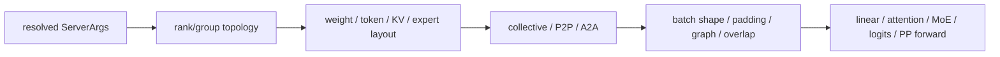

# SGLang 并行与后端能力矩阵：拓扑、布局、通信与调度

- 主题：从四个正交维度分析 SGLang 的 TP、PP、DP Attention、CP/DCP、EP/MoE 与 attention backend 组合。
- 源码锚点：`source/sglang` HEAD `78be4b50af`（2026-09-15）。
- 证据边界：配置、建组和静态消费点已由源码/文档定位；多 GPU collective、真实 kernel 数值和性能未验证。
- 前置阅读：[`SGLang 关键推理技术洞察`](05-sglang-inference-technical-insights.md)、[`M20 并行策略`](../sglang/01-modules/M20-parallel-strategies/README.md)、[`M09 Attention 与 CUDA Graph`](../sglang/01-modules/M09-attention-cuda-graph/README.md)。

## 1. 核心命题：并行不是一个开关

分析大模型推理并行时，至少要分开四层：

```text
拓扑 topology
  -> 哪些 global rank 组成哪类 group

布局 layout
  -> 每个 rank 持有哪些 layer/head/token/KV/expert

通信 collective
  -> 如何 gather/reduce/dispatch/传递 activation

调度 execution
  -> 如何 padding、切 microbatch、选择 graph、安排 overlap
```



[已确认] SGLang 的 `WORLD`、TP、PP、attention CP/TP/DP、MoE DP/EP/TP 和 DCP 可能对应不同 `GroupCoordinator`；相同成员时可以复用对象，但“group 名称”不等于一定有独立 communicator。来源：[`M07`](../sglang/01-modules/M07-分布式并行.md)。

## 2. 配置先决定合法空间

常见参数包括：

```text
tp_size, pp_size, dp_size,
attn_cp_size, decode_context_parallel_size,
moe_dp_size, expert_model_parallel_size,
attention backend, A2A backend, speculative mode
```

基础约束示意：

- `world_size = tp_size × pp_size`（普通路径）；
- TP 必须可被 attention CP/DP 组合整除；
- MoE DP/EP/TP 宽度必须满足对应整除关系；
- DP Attention 会重新推导 attention TP 宽度；
- DCP 需要独立的设备、整除和 backend 支持；
- PP、speculative、A2A、CUDA Graph 还会增加组合限制。

[已确认] 这些检查在建组和模型执行前完成，因此不能只看原始 CLI 参数；应检查 resolved `ServerArgs`。来源：[`server_args.py`](../source/sglang/python/sglang/srt/server_args.py)、[`M20`](../sglang/01-modules/M20-parallel-strategies/README.md)。

## 3. TP + PP：两个不同坐标

例：`world_size=8, tp_size=2, pp_size=4`：

```text
global rank: 0 1 2 3 4 5 6 7
TP groups:  [0,1] [2,3] [4,5] [6,7]
PP groups:  [0,2,4,6] [1,3,5,7]
```

对 global rank 2：

```text
TP group = [2,3], rank_in_tp = 0
PP group = [0,2,4,6], rank_in_pp = 1
```

这意味着 rank 2 同时：

- 与 rank 3 协同完成当前 pipeline stage 的 tensor 分片；
- 持有中间 stage 的 layer range；
- 通过 PP proxy/P2P 与其他 stage 传递 activation。

[推断] 只打印 global rank 和 world size 无法排查 PP/TP 错配；至少需要记录每个 group 的成员、rank-in-group、layer range 和 collective 次序。

## 4. DP Attention：全局 TP 不等于 attention TP

DP Attention 的典型坐标：

```python
attn_dp_size = dp_size if enable_dp_attention else 1
attn_tp_size = tp_size // attn_dp_size // attn_cp_size
attn_tp_rank = tp_rank % attn_tp_size
attn_dp_rank = tp_rank // (attn_tp_size * attn_cp_size)
```

例：

```text
tp_size=8, dp_size=2, attn_cp_size=1

TP rank:          0 1 2 3 | 4 5 6 7
attention DP:     0 0 0 0 | 1 1 1 1
attention TP:     0 1 2 3 | 0 1 2 3
```

因此 attention 层使用两个 DP replica、每个 replica 内 4-way attention TP。MoE 层是否采用相同布局，还要依据 `moe_dp_size`、EP 和 MoE TP 重新计算。

DP Attention 还改变 token buffer：不同 DP rank 的 token 数可能不同，非 graph 模式需要按前序 token 定位，graph 模式需要固定 slot/padding；gather/reduce-scatter 的 shape 由这些选择决定。

[已确认] DP Attention 的 rank 推导和 token buffer/padding 逻辑位于 `dp_attention.py`；静态代码不能证明具体 collective 的效率。来源：[`dp_attention.py`](../source/sglang/python/sglang/srt/layers/dp_attention.py)。

## 5. CP 与 DCP 不是同一个维度

### 5.1 Attention CP

Attention CP 参与 `(dp, cp, tp)` 坐标，通常影响长上下文或 prefill 的 token/KV 分布。它可能改变：

- local token/head 视图；
- KV 或 latent 的切分；
- all-gather/rerange 顺序；
- prefill graph 的 bucket 和 padding。

### 5.2 DCP

DCP 面向 decode context parallel，拥有独立 group、整除约束和 backend 条件。它不应被简单当成 prefill CP 的另一个名字。

### 5.3 DeepSeek MLA/DSA 等专用路径

模型可能先 split hidden/position，执行 local MLA/NSA/DSA，再 gather/rerange 恢复全局顺序；这会同时影响 KV layout、attention metadata、graph eligibility 和 collective。

[建议] 文档或排障记录应明确写 `attn_cp_size`、DCP、模型 attention 类型和 ForwardMode，不要只写“启用 CP”。

## 6. EP、MoE DP 与 MoE TP

MoE 需要同时考虑三种坐标：

```text
router top-k
  -> logical expert id
  -> physical/local expert mapping
  -> token dispatch（TP gather 或 A2A）
  -> local expert GEMM
  -> combine / shared expert
```

- **EP**：expert 放在不同 rank；
- **MoE DP**：多个 expert data replica 协作；
- **MoE TP**：单个 expert 内部进一步 tensor 切分；
- **A2A backend**：token 交换的执行方式，不是新的并行维度。

EPLB 可以改变 logical expert 到 physical expert 的映射，但不应改变 router 的 logical semantics。更新专家位置时必须避开正在使用旧 mapping 的 forward。

[已确认] standard dispatcher、EPLB 和 MoE model forward 分别消费 token、expert map 和 collective；量化/LoRA 又会改变权重或 per-token adapter metadata。来源：[`M14`](../sglang/01-modules/M14-moe-quantization-lora/README.md)、[`M20`](../sglang/01-modules/M20-parallel-strategies/README.md)。

## 7. Attention backend 能力矩阵

同一 backend 名称下，实际能力至少受以下组合影响：

| 维度 | 可能差异 |
|---|---|
| 模型结构 | MHA/GQA、MLA、DSA、Mamba、Hybrid |
| ForwardMode | EXTEND、DECODE、TARGET_VERIFY、IDLE |
| KV/state layout | token/page、latent、recurrent state、sparse index |
| 并行 | TP、DP Attention、CP/DCP、PP |
| 运行优化 | CUDA Graph、overlap、LoRA、dynamic embedding |
| 推测路径 | candidate width、ragged verify、draft/target metadata |

建议用以下矩阵记录实际部署，而不是只写 backend 字符串：

```text
backend
  × model attention type
  × forward mode
  × KV/state pool
  × parallel topology
  × speculative variant
  × graph eligibility
```

[已确认] `HybridAttnBackend` 可把 extend、decode/idle 和 TARGET_VERIFY 分派到不同子 backend；Torch native 是 correctness fallback；某些 MLA/backend 对特定 DCP+spec 组合会直接拒绝。来源：[`M09`](../sglang/01-modules/M09-attention-cuda-graph/README.md)。

## 8. 通信实现不改变逻辑拓扑

应区分：

```text
TP group members        = 拓扑
NCCL/custom all-reduce  = 执行实现
all-gather/reduce-scatter = collective 类型
A2A token dispatcher    = MoE token 交换路径
PP P2P/proxy            = stage 间 activation 路径
```

关闭 custom all-reduce 不应被描述为关闭 TP；更换 A2A backend 也不自动改变 expert 的逻辑归属。排查 collective hang 时，应按每个 group 分别记录：

- members 和 local rank；
- input/output shape；
- padding mode；
- collective 顺序；
- 是否 graph capture；
- rank 是否走了不同的 conditional branch。

## 9. 并行与 CUDA Graph 的交叉约束

DP/CP 可能造成每 rank token 数不同，PP 造成 stage-specific shape，EP/A2A 造成 token 数动态变化，speculative 造成 verify width 变化；这些都可能影响 graph bucket。

```text
parallel topology
  -> local token count / hidden shape
  -> padding or bucket selection
  -> attention metadata
  -> graph eligibility
  -> replay or eager fallback
```

[推断] “多卡配置正确”与“该 batch 能 graph replay”是两个命题。前者只证明拓扑/整除条件，后者还要求 shape、metadata、static address、variant 和 backend capability 同时满足。

## 10. 调试配方

### 10.1 shape/rank mismatch

1. 打印 resolved args；
2. 打印 WORLD/TP/PP/attention/MoE group members；
3. 对 rank 记录 local device 与 rank-in-group；
4. 对 batch 记录 token 数、padding、hidden/head/expert shape；
5. 按 collective 顺序比对每个 rank 的分支；
6. 再检查 graph/eager 和 backend fallback。

### 10.2 数值不一致

依次隔离：

```text
single GPU eager
  -> multi-GPU eager
  -> graph disabled/enabled
  -> TP/PP only
  -> DP/CP
  -> EP/A2A
  -> speculative/LoRA/quantization
```

这是一种排查建议，不代表当前仓库已执行该矩阵。

### 10.3 性能异常

同时记录：

- collective time 和 rank skew；
- padding waste；
- attention graph fallback；
- KV page/slot occupancy；
- expert load imbalance；
- PP bubble；
- output copy/detokenization。

不要只用 GPU utilization 推断瓶颈。

## 11. 生命周期和清理

并行资源生命周期为：

```text
init process group
  -> WORLD / derived groups
  -> model construction / layer ownership
  -> weight loading
  -> request collectives
  -> drain workers
  -> destroy model-parallel groups
  -> destroy distributed environment
```

某些 group 可能 alias 同一 coordinator；销毁时不能重复释放。EPLB、LoRA adapter、CUDA Graph buffer、KV pool 和 communicator 也有各自生命周期，不能用单一 `destroy` 或 `empty_cache` 代替所有清理。

## 12. 验证矩阵

| 层级 | Oracle | 当前状态 |
|---|---|---|
| 静态配置 | 整除、组合拒绝、resolved values | `[已确认]` |
| 单进程逻辑 | rank/group 公式、layout 计算 | `[已确认/部分完成]` |
| 单 GPU eager | 模型输出/attention 数值 | `[待验证]` |
| 单 GPU graph | capture/replay/fallback | `[待验证]` |
| 多 GPU | collective 完成、rank 对齐、数值一致 | `[待验证]` |
| MoE | dispatch/combine、load balance、EPLB | `[待验证]` |
| 多机 | network/A2A/PP failure recovery | `[待验证]` |
| 性能 | tokens/s、TTFT、TPOT、P99、通信占比 | `[待验证]` |

## 13. 证据与反例

- “TP=8，所以 attention 一定 8-way TP”是错误的；DP Attention/CP 会派生不同宽度。
- “A2A 是第八种 parallelism”是错误的；它是 token dispatch 的通信实现。
- “所有 rank 都初始化完成，所以 collective 一定正确”是错误的；成员顺序、local rank、shape 和调用次序仍可能不一致。
- “graph flag 开了，所以当前 batch 一定 replay”是错误的；必须通过 capability/shape/variant 协商。
- “模型支持 MLA，所以所有 MLA backend 都可用”是错误的；backend 对 DCP、spec、page layout 和设备能力可能有额外限制。

## 14. 当前验证状态

本文只记录当前 checkout 可由源码和已有文档支持的拓扑、配置约束、对象关系和静态分支。没有把多卡通信、模型权重加载、attention kernel、CUDA Graph replay、EP/A2A 或性能结果写成已验证事实。

进一步实验应固定模型、dtype、设备拓扑、并行配置、batch/workload 和 graph setting，并同时保存 rank/group、shape、fallback 和性能日志。

## 相关文档

- [`M07 分布式并行`](../sglang/01-modules/M07-分布式并行.md)
- [`M09 Attention 与 CUDA Graph`](../sglang/01-modules/M09-attention-cuda-graph/README.md)
- [`M14 MoE、量化与 LoRA`](../sglang/01-modules/M14-moe-quantization-lora/README.md)
- [`M19 DeepSeek 系列模型`](../sglang/01-modules/M19-deepseek-models/README.md)
- [`M20 并行策略`](../sglang/01-modules/M20-parallel-strategies/README.md)
