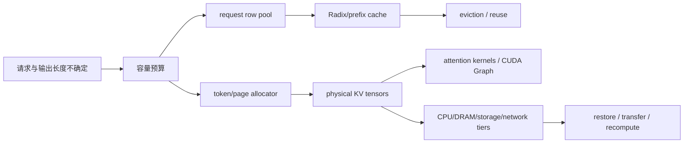

# KV Cache 池化技术专题

- 主题：大模型推理中的 KV cache 池化、动态显存池、静态显存池划分与跨层资源管理。
- 适用读者：准备推理系统、SGLang/vLLM、长上下文、GPU 显存管理和系统设计面试的工程师。
- 证据基线：本仓库 SGLang 知识库锚定 `source/sglang` HEAD `78be4b50af`；外部论文以 arXiv 页面、原始 PDF 解析材料和中文详译为索引。PDF、`pdftotext` 抽取文本、元数据和中文译文保存在 [`arxiv-pdf/`](arxiv-pdf/)。未执行 GPU、模型、RDMA、压测或端到端服务。
- 状态约定：`[已确认]` 来自当前仓库文档/源码引用；`[推断]` 为基于证据的工程推导；`[待验证]` 需要实验或线上指标；`[建议]` 为设计建议；`[存在争议]` 表示不同系统或论文方案取舍不同。

## 阅读顺序

1. [概念与分类轴](00-concepts-and-taxonomy.md)：先把“静态/动态池”这组词拆开，避免把 CUDA allocator、KV slot allocator 和 prefix cache 混为一谈。
2. [静态、动态与混合池方案](01-static-dynamic-hybrid-pools.md)：比较启动预留、按需分配、分页/虚拟化和异构内存方案。
3. [KV pool 生命周期与 ownership](02-kv-pool-lifecycle-and-ownership.md)：结合 SGLang 三层池模型追踪分配、命中、淘汰、retraction 和 flush。
4. [arXiv PDF 原文解析](03-arxiv-reading-notes.md)：梳理 PagedAttention、vAttention、NEO、P/D-Serve、eLLM 等论文 PDF 原文中可确认的机制、实验边界和不能外推的结论；中文详译见 [`arxiv-pdf/zh/`](arxiv-pdf/zh/)。
5. [设计决策与验证路线](04-design-decision-and-validation.md)：给出容量公式、指标、故障注入和面试复盘问题。
6. [SGLang 关键推理技术洞察](05-sglang-inference-technical-insights.md)：从跨模块视角分析调度计划、prefill/decode、Attention/CUDA Graph、overlap、采样、并行和分层 KV 协议。
7. [SGLang 推测解码事务](06-speculative-decoding-as-transaction.md)：把 draft/verify/accept/reject/bonus 解释为可提交、可回滚的状态协议。
8. [SGLang 并行与后端能力矩阵](07-parallel-and-backend-capability-matrix.md)：按拓扑、布局、通信和调度四层分析 TP/PP/DP/CP/EP 与 attention backend 组合。

## 专题核心结论

- [已确认] SGLang 文档中的池化模型至少分三层：request row 映射池、token/page 索引 allocator、物理 KV/Mamba tensor pool；RadixCache 保存的是 KV index 引用和锁状态，不是另一份 KV 数据副本。来源：`../../../sglang/90-cross-module/pooling-and-resource-management.md`。
- [推断] “静态显存池”和“动态显存池”不是二选一：生产推理系统常见的是**启动时预留物理 backing + 请求期间动态分配逻辑 slot/page + 按策略动态移动/淘汰 cache**的混合方案。
- [已确认] PagedAttention 把 KV cache 管理类比为分页，目标是降低动态 KV 带来的碎片和浪费；vAttention 则尝试用 CUDA virtual memory 保持虚拟连续、物理动态映射。来源见 [论文笔记](03-arxiv-reading-notes.md)。
- [待验证] 本专题没有复现任何论文吞吐提升、显存节省、D2D 传输优化或 SGLang 真实 GPU 行为；相关数字只作为论文报告结果记录。

## SGLang 技术洞察

新增的 `05`–`07` 文档将现有 KV Cache 池化专题放回完整的推理 runtime：

- [已确认] SGLang 的一次推理迭代可从 `admission plan → ScheduleBatch → ForwardBatch → ModelRunner/backend → result commit` 观察；调度、执行和结果提交之间存在明确的对象与生命周期边界。
- [已确认] CUDA Graph、speculative decoding、grammar、并行策略和 HiCache/P-D transfer 都不是孤立开关，而是会改变 metadata、shape、ownership、通信或提交协议的跨模块能力组合。
- [待验证] 新增文档不声称已验证 SGLang 的真实 GPU 性能、CUDA Graph replay、多卡通信、EP/A2A、RDMA/P-D transfer 或线上 P99；这些结论需要目标环境实验。

这些文章是跨模块的设计洞察，不替代 `sglang/01-modules/` 中的源码专题，也不重复 `00`–`04` 已完成的 KV pool 生命周期和论文逐篇解析。

## 面试/设计复盘主线

图中 `ROW/SLOT/PHY/RAD` 分别代表不同 owner 和生命周期；`TIER` 是异构/分离部署扩展，不等同于基础 GPU allocator。
