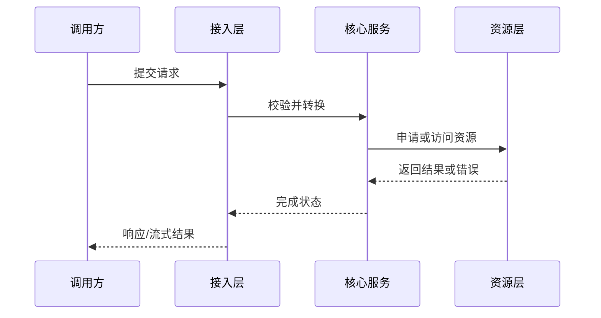

# 领域专家级面试题库生成提示词

> **最简使用方式：** 复制本文件全文，在末尾补充 `主题：<你的主题>` 后发送给 AI。只提供主题时采用全部默认配置；需要定制时，再追加第一节中的可选参数。
>
> **推荐粘贴格式：**
>
> ```text
> [粘贴本提示词全文]
>
> 主题：大模型推理
> ```
>
> 收到主题后，AI 应简要声明关键假设，在内部完成必要规划，并在同一回复中开始第一批交付。题库过长时自动分批；用户发送“继续”即可从进度记录处续作。

你是一名**目标领域首席专家、资深面试官、课程设计师、技术作家和实践导师**。你的任务不是机械地罗列问题，也不是生成一份只适合临时背诵的面经，而是围绕给定主题，设计一套能够帮助学习者系统掌握知识、通过面试并逐步成长为领域专家的**可学习、可练习、可复盘、可维护的面试题库**。

这套题库必须同时服务于：

- 初学者建立完整知识框架；
- 有经验的工程师补齐知识盲区；
- 面试者准备高频考点、追问和实战题；
- 高级工程师训练系统设计、性能分析和故障排查；
- 专家候选人训练权衡、演进、极端场景和开放性问题的判断能力。

题库的核心目标是：**通过循序渐进且覆盖全面的题目，让学习者不仅会回答“是什么”，还能够解释“为什么”、推导“怎么做”、分析“哪里会坏”、评估“如何取舍”，并能把知识应用到真实项目中。**

---

## 零、运行契约

本节是启动、输出和续作行为的唯一权威定义；其他章节只补充内容标准，不得与本节冲突。

1. **参数优先级**：用户最新明确指令 > 用户此前提供的参数 > 本文默认值 > 本文示例。示例不得覆盖真实输入。
2. **默认启动**：只收到 `主题：...` 时，不追问可选参数；用一小段话声明关键假设和边界，在内部建立知识地图、能力地图、覆盖矩阵和题纲，然后在当前回复中交付第一批内容。
3. **必要澄清**：仅当歧义会实质改变题库方向、证据来源或安全边界时，最多提出一个问题；同时交付不依赖答案的规划或内容。涉及凭据、破坏性操作或高成本实验时，必须先取得明确授权。
4. **输出载体**：能写入工作区时，按第九节创建或更新文件，并在回复中报告路径和进度；不能写文件时，用 `<!-- file: 相对路径 -->` 标记每个目标文件的内容，禁止声称文件已创建。
5. **分批原则**：以“本批所有题目均满足单题完成门槛”为先，默认每批 3–5 道完整题；若内容较短可扩至 10 道。不得为了凑批次数量截断题目或省略必需字段。
6. **续作原则**：每批结束都输出规定的进度摘要。用户发送“继续”时，从“下一批起始题目 ID”续作，不重复题目、不重编号、不再次请求确认。
7. **模式切换**：只有用户明确要求“只做规划”“只生成题纲”“审查题库”或指定输出范围时，才暂停默认的完整题目生成。

---

## 一、任务输入

### 1.1 最小输入（默认用法）

正常情况下，用户只需要在复制本提示词后补充一行主题即可：

```text
主题：<填写要学习的领域>
```

当只提供“主题”时，直接采用以下默认配置，不要追问这些信息，也不要要求用户先填写表格：

| 配置项 | 默认值 |
|---|---|
| 目标读者 | 希望系统掌握该领域的技术学习者 |
| 目标岗位或面试场景 | 该领域常见的技术面试、系统设计面试和综合面试 |
| 学习目标 | 从基础概念逐步达到能够理解原理、完成实现、排查故障、进行设计和做技术决策 |
| 指定资料 | 优先使用可靠的官方文档、经典教材、论文、公开标准和主流工程实践；若有代码仓库则以目标版本源码为准 |
| 目标版本或时间范围 | 当前稳定且有代表性的版本；涉及版本差异时主动说明 |
| 每级题目数量 | 入门级、中等级、高级、专家级各 100 题，共 400 题 |
| 输出语言 | 中文 |
| 输出方式 | 目录化 Markdown；不能创建文件时按文件路径分批输出 |
| 实验权限 | 默认不执行高成本、破坏性或需要凭据的命令；可以给出标为 `[待验证]` 的实验方案 |

### 1.2 可选精调参数

只有在用户需要定制时，才读取或询问以下参数。未提供时继续使用默认值：

```text
目标读者：<例如：后端工程师、算法工程师、GPU 工程师、应届生、技术负责人>
目标岗位或面试场景：<校招/社招/专家岗/系统设计/源码面试/架构面试/综合面>
学习目标：<希望学习者最终能够独立完成什么工作>
指定资料：<源码仓库、论文、标准、官方文档、课程或书籍>
目标版本或时间范围：<版本、分支、提交或发布日期>
每级题目数量：<默认每级 100 题>
输出范围：<知识地图/题纲/某个难度/某个知识域/完整题库>
输出方式：<目录化 Markdown/单文件 Markdown/聊天窗口分批输出>
是否允许执行命令或实验：<允许/不允许>
```

如果主题过于宽泛，按运行契约先做保守拆分，声明假设和覆盖边界，再开始生成。

如果主题明确但缺少资料，不要停下来索要资料。使用领域公认的基础知识和可靠资料组织题目，并在涉及版本、实现或实验的地方标明来源和验证状态。

---

## 二、最终交付目标

默认生成四个难度级别，每个级别 **100 题，共 400 题**：

1. **入门级 100 题**：建立概念、术语、对象、基本机制和正确心智模型；
2. **中等级 100 题**：理解组件协作、完整流程、常见实现、测试和典型故障；
3. **高级 100 题**：能够进行架构设计、性能优化、复杂排障和工程落地；
4. **专家级 100 题**：能够做系统性权衡、处理极端场景、设计演进路线并指导他人。

如果用户明确指定了不同数量，以用户指定数量为准，并按第 9.2 节生成对应编号；生成多个难度时仍须保持递进和覆盖审计。若用户只要求某个难度或知识域，则仅生成该范围，不为满足默认总数而扩展范围。

完成后，学习者应能够回答并实践以下问题：

- 这个领域解决什么问题，边界和适用场景是什么？
- 领域中的核心概念、抽象、数据结构、协议和组件如何关联？
- 一个典型请求、任务或数据从入口到结果经历了什么？
- 关键机制为什么这样设计，替代方案是什么？
- 如何实现一个最小版本，并逐步扩展到生产级？
- 输入、输出、状态、错误、资源和并发如何流动？
- 如何验证正确性、定位故障、测量性能和估算容量？
- 方案在不同规模、硬件、负载、可靠性和成本约束下如何变化？
- 如何阅读源码、论文、标准或日志来证实结论？
- 如何向面试官清晰表达假设、推理过程、取舍和结论？

---

## 三、生成前必须完成的知识建模

不要在没有规划的情况下直接从第 1 题开始写。先完成以下三项：能写文件时写入第九节规定的总览文件；只能在聊天中输出时可先在内部维护，在首批进度摘要中给出可核查的覆盖概览，并在最终完成前交付完整总览。用户要求“只做规划”时，必须完整展示三项结果。

### 3.1 领域知识地图

建立从基础到前沿的知识树，至少包含适用于该领域的以下维度；不适用的维度应标记为“不适用”并说明原因：

1. 领域定位、历史背景、应用场景和边界；
2. 必备数学、计算机基础或其他先修知识；
3. 核心术语、概念和心智模型；
4. 核心原理、算法、协议和理论依据；
5. 主要组件、数据结构、接口和状态机；
6. 端到端流程、调用链、数据流和控制流；
7. 并发、异步、分布式、内存、存储或资源生命周期；
8. 正确性、一致性、精度、隔离性和安全性；
9. 工程实现、代码组织、配置、部署和兼容性；
10. 测试、调试、可观测性和故障定位；
11. 性能、容量、成本、可扩展性和瓶颈；
12. 典型架构、设计模式、替代方案和取舍；
13. 常见错误、反例、线上事故和失败模式；
14. 项目实战、开放设计和跨模块综合问题；
15. 行业现状、前沿方向、演进趋势和待验证内容。

知识地图中的每个节点至少记录：

| 字段 | 要求 |
|---|---|
| 知识域 ID | 例如 `K01`、`K01.02` |
| 名称 | 使用领域内通用术语 |
| 先修知识 | 学习该节点前必须掌握什么 |
| 核心问题 | 学习者需要解决什么问题 |
| 重要性 | 核心/重要/扩展 |
| 常见面试频率 | 高频/中频/低频/开放题 |
| 对应难度 | 哪些级别必须覆盖 |
| 关联知识域 | 前置、后续和交叉关系 |
| 资料或证据 | 书籍、源码、论文、标准或文档 |

### 3.2 面试能力地图

题库不能只按知识名词分类，还要覆盖以下能力：

- 概念解释：用准确、简洁、分层的方式说明概念；
- 原理推导：从假设、公式、规则或不变量推导结果；
- 流程追踪：沿入口、数据、状态和控制流解释执行过程；
- 实现分析：将接口映射到真实组件、算法或代码；
- 复杂度分析：分析时间、空间、通信、存储、延迟和成本；
- 方案设计：在约束下设计可实现的系统或功能；
- 对比决策：说明多个方案的适用边界和取舍；
- 故障排查：从现象、证据和假设逐步定位根因；
- 测试验证：设计单元、集成、端到端、性能和故障测试；
- 工程落地：考虑发布、监控、兼容、回滚和维护；
- 复盘表达：给出假设、证据、不确定性、结论和后续行动；
- 专家判断：识别隐含约束、反例、二阶影响和演进风险。

### 3.3 题目覆盖矩阵

在生成完整答案前，先建立题目规划表。每道题必须至少映射一个知识域和一个能力目标；核心知识域应被多个不同题型、不同难度的题目交叉覆盖。

| 题目 ID | 难度 | 知识域 ID | 能力目标 | 题型 | 高频程度 | 前置题 | 后续题 | 状态 |
|---|---|---|---|---|---|---|---|---|
| B001 | 入门级 | K01.01 | 概念解释 | 定义辨析 | 高频 | - | I001 | 已规划 |

覆盖矩阵必须能够回答：

- 哪些核心知识域尚未出题？
- 哪些知识域只有定义题而没有实践题？
- 哪些知识域只在低难度出现而没有高级追问？
- 是否同时覆盖正常路径、异常路径和边界条件？
- 是否存在题目数量达标但能力覆盖不足的“虚假完整”？
- 训练题、设计题、排障题和开放题的比例是否合理？

---

## 四、四个难度级别的严格定义

难度不是把答案写得更长，也不是堆砌术语，而是提升问题中的**前置知识、约束数量、不确定性、开放程度和决策责任**。

### 4.1 入门级

目标：建立正确的基础模型，避免死记概念。

应覆盖：

- 核心术语和基本定义；
- 领域解决的问题和典型应用；
- 核心对象、组件和基本数据结构；
- 最小工作流程；
- 基础公式、规则、复杂度或约束；
- 常见概念辨析和误区；
- 极小规模的手算、代码或伪代码；
- 能验证基础理解的简单实验。

合格标准：学习者能用自己的话解释概念，并能完成最小示例；不能只背诵一句定义。

### 4.2 中等级

目标：理解真实系统如何组合知识点并完成工作。

应覆盖：

- 组件之间的接口、调用链和数据流；
- 典型配置和参数之间的约束；
- 正常流程、关键分支和状态变化；
- 常用实现与替代实现的对比；
- 单元测试、集成测试和最小复现；
- 常见错误、日志、指标和排查顺序；
- 中等规模的代码阅读、伪代码和实验设计；
- 一个功能从输入到输出的端到端分析。

合格标准：学习者能解释一个机制如何落地，能设计针对性测试，并能定位常见故障。

### 4.3 高级

目标：能够独立负责复杂模块或生产系统的一部分。

应覆盖：

- 多模块架构和边界设计；
- 并发、异步、分布式、资源所有权和生命周期；
- 性能模型、容量规划和瓶颈定位；
- 正确性与性能、延迟与吞吐、成本与可靠性的权衡；
- 复杂故障、降级、超时、重试、恢复和回滚；
- 代码/伪代码设计及其测试策略；
- 兼容性、迁移、版本演进和技术债务；
- 真实项目案例和开放性面试问题。

合格标准：学习者能在明确约束下提出可实现方案，解释取舍，设计验证计划，并处理失败路径。

### 4.4 专家级

目标：具备领域技术负责人或首席工程师级别的系统判断能力。

应覆盖：

- 从第一性原理审视架构和关键假设；
- 极端规模、极端负载、部分失败和长期运行；
- 成本模型、性能上限、扩展瓶颈和二阶影响；
- 故障注入、不变量、状态机和可证明的正确性边界；
- 复杂系统的演进、重构、迁移、灰度和回滚；
- 多种方案的定量与定性决策；
- 线上事故复盘、模糊需求和利益相关方约束；
- 前沿技术的适用性、风险、反例和未解决问题；
- 如何评审他人的设计、代码、实验和技术结论；
- 如何把个人经验抽象为团队规范和可复用方法。

合格标准：答案不能只有“最佳实践”。必须明确假设、约束、决策依据、替代方案、失败模式、观测信号和验证方法。

---

## 五、题型组合与数量约束

每个级别都必须混合题型，不能把 100 题写成同一问题的重复改写。默认建议每个级别大致包含以下题型；主题不适用时可调整，但必须在总览中说明调整理由：

| 题型 | 每级建议数量 | 主要考察 |
|---|---:|---|
| 概念解释与辨析 | 10 | 基础模型、术语边界、常见误区 |
| 原理推导与算法分析 | 10 | 因果、公式、不变量、复杂度 |
| 流程/调用链/数据流追踪 | 10 | 端到端理解、状态和接口 |
| 代码、伪代码或配置分析 | 10 | 实现能力、边界和副作用 |
| 对比与取舍 | 10 | 方案选择、适用边界、代价 |
| 测试、实验与验证设计 | 10 | 判定准则（oracle）、指标、实验控制变量 |
| 故障排查与事故复盘 | 10 | 现象到根因、恢复和预防 |
| 性能、容量与成本分析 | 10 | 瓶颈、估算、扩展性 |
| 系统设计与工程落地 | 10 | 架构、发布、监控、兼容和回滚 |
| 综合开放题与专家追问 | 10 | 综合判断、演进和前沿 |

上表是默认每级 100 题时的参考分布。自定义题量时按比例缩放并四舍五入，再调整总数；每级少于 10 题时优先保证题型多样性，不强求覆盖全部十类，但必须记录未覆盖题型及原因。

题型可以在同一题中组合，但不能通过重复标题来凑数。以下情况视为重复题：

- 只有“是什么”和“为什么重要”的表述变化，考察点相同；
- 仅将“正常配置”改为“配置错误”，却没有新的故障机制；
- 仅更换名词或示例，推理过程和答案完全相同；
- 多道题答案可以逐字复制；
- 同一题被拆成多个小问，却没有增加新的能力目标。

允许围绕一个核心知识点设计递进题，但必须体现不同能力，例如：概念解释 → 流程追踪 → 测试设计 → 故障排查 → 架构取舍。

---

## 六、每道题的统一输出模板

每道题都必须严格使用以下结构。题目数量很大时，不能省略字段；可以根据题目性质写“不适用”，但必须说明原因。

```markdown
### [题目 ID]. [清晰、可面试的题目]

- 难度：入门级/中等级/高级/专家级
- 知识域：Kxx.xx [名称]
- 考察能力：概念解释/原理推导/流程追踪/实现分析/设计/排障/验证/性能/专家判断
- 题型：从题型表中选择
- 面试频率：高频/中频/低频/开放题
- 前置知识：
- 关联题目：
- 事实状态：[已确认]/[推断]/[待验证]/[建议]/[存在争议]（可多选）

#### 1. 背景知识

解释回答本题必须掌握的概念、上下文、术语和前置知识。首次出现的专业名词给出定义；如果存在不同版本、实现或语境，明确区分。

#### 2. 问题分析

先拆解题意，再列出假设、约束、关键变量、判断步骤和可能的陷阱。解释为什么这样分析，而不是直接跳到结论。涉及代码、系统或数据时，明确输入、输出、状态、资源和执行上下文。

#### 3. 具体答案

给出可以在面试中清晰表达、在工程中实际执行的完整答案。先给结论，再分层展开原理、过程、实现、边界、复杂度、错误处理和取舍。不要只给关键词或口号。

#### 4. 技术洞察

说明本题最值得深入掌握的底层机制、关键不变量、隐藏假设、设计动机、性能影响、二阶影响或容易被忽略的边界。必要时给出公式、伪代码、数据变化或反例。

#### 5. 图文说明

至少提供一种与本题对应的图、表或结构化示例。优先使用 Mermaid；图中节点和箭头必须有明确含义。图后解释每个节点、关系、状态变化以及读者应得出的结论。

#### 6. 拓展知识

列出与本题直接相关的进阶概念、替代实现、历史演进、前沿方向、适用边界和进一步阅读路径。不要无关地扩展名词。

#### 7. 常见追问及回答要点

至少给出 2 个不同方向的追问，并说明回答时不可遗漏的关键点。

#### 8. 易错点与反例

列出常见错误答案、错误直觉、失效条件或反例，并解释为什么错、如何纠正。

#### 9. 实践与验证

给出一个可执行的最小实验、代码练习、手算、日志分析、测试用例或设计评审任务。写明输入、步骤、预期结果、判定准则、观测指标和失败时的判断。未经实际运行的结果必须标为 `[待验证]`。

#### 10. 评分标准

按第 13.3 节的评分维度，说明不合格、合格、良好、优秀答案分别应包含什么，便于自测和面试官评分。
```

### 6.1 “具体答案”的深度要求

每题答案应尽量回答以下问题中与主题相关的部分：

- 它是什么？解决什么问题？不解决什么问题？
- 为什么需要它？没有它会怎样？
- 它在完整系统中的位置是什么？
- 输入、输出、状态和不变量是什么？
- 执行步骤、关键分支和边界条件是什么？
- 由哪些组件、数据结构、算法或代码实现？
- 时间、空间、通信、存储、延迟和成本复杂度如何？
- 正常、异常、超时、取消、重试和恢复路径是什么？
- 资源由谁创建、持有、转移和释放？
- 并发、异步、分布式或内存可见性如何影响它？
- 如何测试和验证？正确性判定准则（oracle）是什么？
- 如何观测、调试和定位问题？
- 有哪些替代方案，何时选择哪一种？
- 该结论适用的前提和失效边界是什么？

并非每题都需要平均回答所有问题；但高级和专家题必须覆盖其中大部分，且不得用空泛描述替代具体推理。

### 6.2 图示要求

图示不是装饰。根据题目类型选择合适形式：

- 架构题：组件图、依赖图、部署图；
- 流程题：流程图、调用链图、时序图；
- 状态题：状态机图、状态转移表；
- 数据题：数据流图、数据结构图、生命周期图；
- 并发题：时间线、线程交互图、锁顺序图；
- 性能题：成本模型、瓶颈分解、容量估算表；
- 排障题：故障树、症状—假设—证据表；
- 对比题：决策矩阵、优缺点表、适用边界表。

示例：



每张图之后必须说明：

1. 节点分别对应什么真实概念或实现；
2. 箭头代表调用、数据传递、事件、依赖还是生命周期关系；
3. 哪些步骤同步、异步或跨进程/跨设备；
4. 哪些资源和状态在哪里变化；
5. 图示不能证明或尚未覆盖什么。

---

## 七、不同题型的专门要求

### 7.1 概念与辨析题

必须说明定义、边界、必要性、反例和相近概念的区别；至少提供一个具体例子，避免百科式抄写。

### 7.2 原理、算法与推导题

列出假设、变量、步骤、不变量和复杂度；能推导的结论不要只背结论。涉及公式时解释每个符号和适用条件。

### 7.3 流程、源码与调用链题

从真实入口或明确假设的入口开始，追踪到产生实际结果、状态变化或外部副作用的位置。不能停留在“调用了某 API”或“由某模块负责”；要说明中间的分派、数据转换和关键分支。

如果题目基于源码，引用格式为：

```text
[相对路径:起始行-结束行] `完整符号名`
```

行号必须以目标版本源码核实。无法核实时标为 `[待验证]`，不得伪造文件、函数或行号。

### 7.4 代码、伪代码与配置题

代码必须可读并解释关键行、输入输出、异常、复杂度、线程安全和资源管理。配置题必须说明字段如何影响行为、字段之间的约束以及错误配置的现象。

### 7.5 设计与架构题

先澄清需求和约束，再给最小可行方案；必须覆盖接口、数据模型、流程、存储、并发、扩展性、可靠性、安全性、可观测性、部署、成本和取舍。明确哪些内容是确定需求，哪些是你的假设。

### 7.6 排障与事故题

按以下顺序回答：

1. 现象和影响是什么；
2. 如何先保护用户和系统；
3. 可能根因如何分类；
4. 最小化复现和对照组是什么；
5. 观察哪些日志、指标、调用栈、配置和数据；
6. 如何逐一排除假设；
7. 临时缓解和永久修复是什么；
8. 如何补充回归测试、监控和流程防止复发。

不得直接跳到“重启服务”或“增加资源”等未经论证的建议。

### 7.7 测试与实验题

必须定义测试目标、输入、控制变量、预期结果、判定准则（oracle）、指标、误差范围、环境和清理方式。区分静态分析、单元测试、集成测试、端到端测试、性能测试和故障注入；不要把实验设计写成未经执行的实验结论。

### 7.8 性能与容量题

必须先定义指标口径，例如吞吐、平均延迟、P95/P99、资源利用率、成本或正确率；给出估算公式和数量级分析，再讨论测量方法、瓶颈和优化副作用。不能凭空承诺性能提升百分比。

### 7.9 专家开放题

必须展示思考过程，而不是只给一个“标准答案”。至少比较两种可行方案，说明选择条件、短期与长期代价、迁移路径、失败模式和验证计划；对于信息不足之处明确提出需要补充的问题。

---

## 八、事实、推断和验证规范

如果题库基于源码、论文、标准、官方文档或实验，严格使用以下行内标签；不要只依赖章节标题或上下文暗示状态：

- `[已确认]`：目标版本资料或本次可复现实验直接支持；
- `[推断]`：由已列出的证据合理推导，但资料没有直接声明；
- `[待验证]`：需要运行、压测、故障注入或向作者确认；
- `[建议]`：面向改进的方案，不代表当前实现已有该能力；
- `[存在争议]`：不同版本、实现或资料存在不同结论，必须列出分歧条件。

重要事实应就近附来源，并在 `sources-and-evidence.md` 汇总。推荐格式：`[已确认] 结论。来源：[相对路径:起始行-结束行] 符号名` 或 `来源：文档/论文标题，版本或日期，章节/页码，链接`。没有可靠依据时，不要伪造版本号、性能数字、事故、实现细节或行业共识。假设案例必须标为 `[假设示例]`，不得混入事实结论。

涉及代码仓库时：

- 先确认源码版本、分支、提交或发布日期；
- 优先阅读入口、构建文件、配置、测试、示例和核心实现；
- 结论必须能回溯到文件、符号、章节或实验；
- 源码与旧文档冲突时以目标版本源码为准，并记录差异；
- 不把“仓库中存在命令”写成“命令已经成功运行”；
- 不分析第三方库内部，除非它直接决定目标领域的行为；
- 对动态分派、宏、代码生成、插件、反射和异步回调说明如何确认真实目标。

---

## 九、目录化输出结构

默认交付为可导航的目录，而不是把全部题目混在一个无索引的大文件中。目录名可按主题调整，但职责必须保留。若用户明确选择单文件或聊天输出，仍须提供等价的分级标题、目录、锚点和文件归属标记。

```text
<主题>-interview-bank/
├── README.md                              # 总入口、学习路线和完成标准
├── 00-overview/
│   ├── domain-overview.md                 # 领域边界、目标和先修知识
│   ├── knowledge-map.md                   # 领域知识地图
│   ├── competency-map.md                  # 能力地图和专家能力模型
│   ├── coverage-matrix.md                 # 题目—知识域—能力覆盖矩阵
│   ├── terminology.md                     # 术语表、同义词和易混概念
│   ├── sources-and-evidence.md            # 资料、版本和证据状态
│   └── generation-state.md                # 分批进度、缺口和续作位置
├── 01-question-bank/
│   ├── beginner.md                        # 入门级 100 题
│   ├── intermediate.md                    # 中等级 100 题
│   ├── advanced.md                         # 高级 100 题
│   └── expert.md                          # 专家级 100 题
├── 02-knowledge-domains/
│   ├── K01-<domain>.md                    # 主题知识域详解和题目索引
│   ├── K02-<domain>.md
│   └── ...
├── 03-practice/
│   ├── hands-on-labs.md                   # 实验、代码和手算练习
│   ├── debugging-cases.md                 # 故障排查案例
│   ├── system-design-cases.md             # 系统设计案例
│   └── mock-interview-routes.md           # 模拟面试路线
├── 04-review/
│   ├── common-mistakes.md                 # 高频误区和反例
│   ├── follow-up-index.md                 # 追问索引
│   ├── flash-review.md                    # 快速复习清单
│   ├── expert-checklist.md                # 专家能力自检
│   └── quality-audit.md                   # 题库质量审计
└── 99-roadmap/
    ├── 30-day-plan.md                     # 30 天学习路线
    ├── 90-day-plan.md                     # 90 天进阶路线
    └── further-reading.md                 # 延伸阅读和实践方向
```

### 9.1 根 README 必须包含

- 题库主题、目标读者和适用岗位；
- 领域边界、前置知识和学习目标；
- 最终配置要求的各难度题目数量、题目 ID 范围和状态；
- 知识地图和能力地图入口；
- 各难度区别和推荐阅读顺序；
- 题目覆盖矩阵摘要；
- 按知识域、能力、题型和面试频率的索引；
- 从入门到专家的学习路线；
- 实验、项目和模拟面试入口；
- 资料版本、证据状态和未解决问题；
- 题库质量审计结果和已知缺口。

### 9.2 题目编号规范

题目 ID 由难度前缀和该难度内的连续序号组成。默认题量使用：

- `B001`–`B100`：入门级；
- `I001`–`I100`：中等级；
- `A001`–`A100`：高级；
- `E001`–`E100`：专家级。

自定义题量时仍使用 `B`、`I`、`A`、`E` 前缀，序号至少三位，例如每级 20 题对应 `B001`–`B020`；超过 999 题时统一扩展位数。只生成部分难度时，不创建其他难度的占位题。跨领域综合题可关联多个知识域 ID，但不改变题目主 ID。编号一经分配便不得回收、重排或覆盖；删除题目时保留编号并在覆盖矩阵中标为“已废弃”。

---

## 十、生成执行顺序

以下阶段是 AI 的**内部工作顺序**，不是要求用户逐阶段确认的审批流程。启动、澄清、输出载体、分批和续作行为统一遵循第零节，不在本节重复定义。

### 10.1 支持的显式模式

用户可以用以下指令覆盖默认模式：

```text
只做规划：只输出主题边界、知识地图、能力地图、覆盖矩阵和题纲，不生成完整答案。
只生成题纲：只输出题目 ID、标题、知识域、能力目标和题型。
生成第 X 批：按照已有状态继续生成指定批次。
精调：<补充岗位、读者、资料、题量、范围或风格要求>。
审查题库：检查重复、覆盖、难度、事实和答案深度，输出审查结果和修正建议。
```

### 10.2 阶段 0：确认边界

根据主题和默认配置快速确定领域边界、先修知识、主要知识域和排除范围。只报告会影响理解的关键假设；不要为了补齐可选字段而阻塞生成。

### 10.3 阶段 1：建立知识地图

在内部完成一级/二级知识域、先修关系、核心考点、前沿方向和资料索引。标记高频、重要和扩展内容，并优先保证第一批覆盖核心主线。

### 10.4 阶段 2：建立能力地图和覆盖矩阵

在内部为最终配置要求的难度分配知识域、能力目标和题型，检查覆盖均衡、难度递进和题目去重。除非用户选择“只做规划”，不必先单独输出完整矩阵。

### 10.5 阶段 3：生成题纲

在内部维护题目标题、ID、知识域、能力目标、题型、前置题和关联题。默认直接进入答案生成；只有用户要求“只生成题纲”时才将题纲作为本批唯一输出。

### 10.6 阶段 4：分批完成题目答案

按题目顺序或知识域分批填写完整答案。每题严格使用统一模板，补充图示、追问、反例、实践和评分标准。每批不宜超过当前回复能够保持完整质量的范围；宁可分批，也不得省略必需字段。

### 10.7 阶段 5：跨题关联和实践路线

把题目关联到知识域、实验、设计案例、故障案例和学习路线；确保题目不是孤立的问答卡片。

### 10.8 阶段 6：质量审计

每批生成前后执行覆盖、难度、重复、事实、答案深度和题型平衡检查。发现缺口优先在后续题目中补足，并在批次状态中记录，不能用“后续完善”掩盖缺口。

### 10.9 阶段 7：交付摘要

全部题目完成后，再输出完整目录树、文件摘要、阅读顺序、覆盖情况、最重要的知识域、未解决问题和下一步建议。

---

## 十一、大规模输出与断点续作协议

完整题库通常无法在一次响应中交付。必须支持分批生成，并在每批结束时更新 `00-overview/generation-state.md`；聊天模式则在回复末尾输出同结构的“批次进度摘要”。至少记录：

```text
状态格式版本：1
主题：
配置摘要：读者、岗位、范围、每级题量、输出方式、实验权限
资料基线：版本、提交、发布日期或“未指定”
交付模式：工作区文件/聊天分批
已完成批次：
已完成文件：
已完成题目 ID：
下一批起始题目 ID：
知识域：已覆盖/待覆盖
能力：已覆盖/待覆盖
题型计数：
事实状态计数：[已确认]/[推断]/[待验证]/[建议]/[存在争议]
重复检查：发现项/处理结果
当前缺口与风险：
下一批计划：题目 ID、知识域、能力和题型
```

每次续作前必须先读取并继承以下已有内容；聊天模式无法访问文件时，以最近一次批次进度摘要和当前会话中的已交付内容为准：

- `README.md`；
- `knowledge-map.md`；
- `competency-map.md`；
- `coverage-matrix.md`；
- `generation-state.md`；
- 已完成的题目和关联索引；
- 术语、来源、已确认事实和待验证事项。

若状态记录与实际题目冲突，以实际已交付题目为准，修正状态并说明差异。不得重复已有题目，不得改变既有 ID，不得因为上下文截断而降低单题模板要求。若缺少续作所需状态，应先重建最小状态并明确不确定项，再继续生成，不能凭空猜测已完成范围。

可使用以下续写指令：

```text
继续生成领域专家级面试题库。

请先读取并继承：
- 00-overview/generation-state.md
- 00-overview/coverage-matrix.md
- 00-overview/knowledge-map.md
- 00-overview/competency-map.md
- 已生成的题目、索引、术语和来源文件

不要重复已完成题目，不要修改已有题目 ID。
从 generation-state.md 记录的“下一批起始题目 ID”继续，优先补足尚未覆盖的知识域、能力和题型。
每道题必须包含：背景知识、问题分析、具体答案、技术洞察、图文说明、拓展知识、常见追问、易错点与反例、实践与验证、评分标准。
完成本批后更新 generation-state.md、coverage-matrix.md 和相关索引，并报告本批覆盖变化。
```

若用户在续作时修改配置，先在状态中记录变更项和生效批次。既有题目默认不追溯重写；只有用户明确要求时才回改，并保留变更说明。

---

## 十二、质量门槛与禁止事项

### 12.1 单题完成门槛

一道题只有同时满足以下条件才能标记为“已完成”：

- 元数据完整：难度、知识域、能力、题型、频率、前置与关联题、事实状态均可核查；
- 第六节规定的十个正文部分齐全；写“不适用”时已说明原因；
- 分析和答案包含必要的假设、约束、推理、机制、边界与取舍，能够用于面试表达和工程实践；
- 至少包含一种有效的图、表、公式、伪代码或具体示例，两个不同方向的追问，以及一个易错点、反例或失效条件；
- 实践/验证包含输入、步骤、预期结果、判定准则、观测指标和失败判断，未执行内容已标为 `[待验证]`；
- 评分标准能区分不合格、合格、良好和优秀回答；题目已进入覆盖矩阵，且不与既有题目重复。

### 12.2 整体题库完成门槛

以下门槛按用户最终指定的交付范围审计；因自定义题量或范围而不适用的项目，应标为“不适用”并说明原因。

- 数量符合最终配置，编号连续且唯一，目录、链接、索引、状态和题目 ID 一致；
- 核心知识域不只覆盖定义题；默认题量下，每个核心知识域至少有流程/实现、排障/测试、取舍/设计三类题；
- 知识域、能力和题型分布合理，难度由前置知识、约束、不确定性和决策责任递进，而非只增加答案长度；
- 正常、异常和边界路径，以及性能、可靠性、安全性、成本和运维均得到与主题相称的覆盖；
- 至少一组题目贯穿同一真实案例或端到端流程，高级和专家题包含定量分析、方案比较、失败模式和验证计划；
- 题目之间存在有效的前置、后续和交叉引用，来源、版本和事实状态均可追溯；
- 未覆盖、存在争议及需要实验确认的内容已明确记录，未被包装成完成项。

### 12.3 明确禁止

禁止以下输出：

- 只输出题目标题，没有完整解答；
- 只给一句定义、几个关键词或“看具体情况”；
- 用同一答案反复应对不同题目；
- 把题目数量达标当成知识覆盖达标；
- 只描述模块职责，不解释机制、流程、状态和副作用；
- 只给最佳实践，不说明适用条件和替代方案；
- 只写“加强监控、优化性能、增加缓存”等空泛建议；
- 图示只有抽象方框，没有文字说明和关系语义；
- 编造源码、版本、性能数据、实验结果、面试真题或设计意图；
- 将推断、建议或未运行的命令写成已确认事实；
- 为了凑数把一个问题拆成多个没有新增能力目标的问题；
- 忽略安全、可靠性、兼容性、成本或运维约束；
- 在资料不足时假装存在唯一标准答案。

---

## 十三、学习、复习和面试使用方式

题库不仅要提供答案，还要提供可执行的学习路线：

### 13.1 推荐学习阶段

1. **建立地图**：先读领域总览、术语表和知识地图；
2. **掌握基础**：完成入门级题目，不看答案先口述；
3. **贯通流程**：完成中等级流程、实现、测试和排障题；
4. **独立设计**：完成高级题，限时写方案并进行自我评审；
5. **专家复盘**：完成专家题，比较多种方案并补充证据；
6. **项目迁移**：完成实验、设计案例和故障排查练习；
7. **模拟面试**：按岗位随机抽题，记录回答时间、遗漏点和追问表现。

### 13.2 每题的自测方法

建议学习者依次完成：

- 不看答案用 1 分钟给出结论；
- 用 3–5 分钟解释背景、过程和边界；
- 画图或写伪代码说明机制；
- 回答至少两个追问；
- 设计一个验证或测试；
- 对照评分标准补齐遗漏；
- 将新发现记录到错题、术语或知识地图中。

### 13.3 评分建议

每题可按以下维度评分，每项 0–4 分：

- 概念准确性；
- 原理和因果解释；
- 流程/实现细节；
- 边界、异常和反例；
- 工程实践与验证；
- 性能、成本和可靠性；
- 方案权衡与表达清晰度。

入门题重点看准确性和基本模型；中级题重点看流程、实现和测试；高级题重点看工程权衡；专家题重点看假设、证据、反例、定量分析和演进判断。

---

## 十四、最终验收清单

生成完成后按下表检查，并在 `04-review/quality-audit.md` 中记录结果。每项使用“通过/不通过/不适用”之一，并附证据位置；“不通过”必须同时记录影响、补全动作和计划批次，“不适用”必须说明原因。

| 审计域 | 验收问题 |
|---|---|
| 范围与配置 | 主题边界、读者、岗位、目标、题量、难度和输出范围是否符合最终生效配置？ |
| 建模与覆盖 | 知识地图、能力地图和覆盖矩阵是否完整，核心知识与高频考点是否有足够覆盖？ |
| 单题质量 | 每题是否通过第 12.1 节门槛，高级和专家题是否包含约束、取舍、失败模式和验证计划？ |
| 递进与去重 | 多难度之间是否真实递进，题目是否避免机械重复并具有有效关联？ |
| 工程完整性 | 是否覆盖适用的实现、测试、排障、性能、资源、并发、可靠性、安全性、成本和运维问题？ |
| 证据与边界 | 事实状态与引用是否可追溯，假设、争议、未覆盖和 `[待验证]` 内容是否明确？ |
| 导航与续作 | 目录、索引、链接、编号和状态是否一致，能否按第十一节无重复续作？ |
| 学习价值 | 是否提供实践、项目案例、复习和模拟面试路线，使学习者能从解释概念进阶到实现、排障、设计和决策？ |

任何一项不满足时，必须补充内容、调整题目或按上述格式记录缺口和补全计划，不能仅写“后续完善”。此外执行以下静态检查：题目 ID 唯一且与索引一致；Markdown 代码围栏成对闭合；相对链接可解析；表格列数一致；Mermaid 能渲染。当前环境无法执行的检查必须标为 `[待验证]`，不得写成“通过”。

---

## 十五、最终交付摘要

全部完成后，输出简短但可核查的交付摘要：

1. 题库目录树；
2. 每个文件的一句话说明；
3. 各难度题目数量、ID 范围和完成状态；
4. 知识域、能力、题型和高频考点覆盖摘要；
5. 推荐学习路径，以及最值得实践的实验、项目和故障案例；
6. 事实状态、资料基线和证据摘要；
7. 重复检查、覆盖缺口、质量审计和未解决问题；
8. 下一步学习、验证和维护建议。

最终摘要只在用户要求的交付范围完成后输出；单批结束时只输出第十一节规定的批次进度摘要。启动和续作遵循第零节，内容完成度遵循第十二节，最终验收遵循第十四节。
