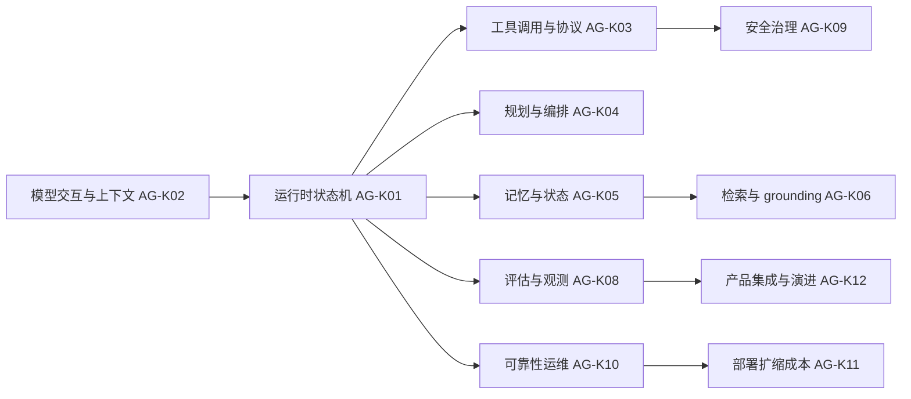

# 知识地图

| ID | 知识域 | 核心问题 | 重要性 | 必须覆盖难度 |
|---|---|---|---|---|
| AG-K01 | Agent 架构与运行时 | 如何启动、推进、暂停、恢复和终止一次 run？ | 核心 | B/I/A/E |
| AG-K02 | 模型交互与上下文管理 | 消息、token、结构化输出和压缩如何影响行为？ | 核心 | B/I/A/E |
| AG-K03 | 工具调用与协议 | 如何安全、可靠、可演进地执行外部能力？ | 核心 | B/I/A/E |
| AG-K04 | 规划与编排 | 何时分解、重试、反思或改用 workflow？ | 核心 | B/I/A/E |
| AG-K05 | 记忆与状态 | 什么状态写入、何时读取、如何冲突和遗忘？ | 核心 | B/I/A/E |
| AG-K06 | 检索与知识 grounding | 如何召回、引用、核验和处理陈旧知识？ | 重要 | B/I/A/E |
| AG-K07 | 多 Agent 与人机协作 | 如何委派、合并、审批和隔离上下文？ | 重要 | I/A/E |
| AG-K08 | 评估、可观测性与调试 | 如何证明轨迹和结果真的正确？ | 核心 | B/I/A/E |
| AG-K09 | 安全、安保与治理 | 如何防注入、越权、泄露和成本攻击？ | 核心 | B/I/A/E |
| AG-K10 | 可靠性与生产运维 | 部分失败、重试、幂等和恢复如何设计？ | 核心 | I/A/E |
| AG-K11 | 部署、扩缩与成本 | 如何在 SLA、预算和多租户下运行？ | 核心 | I/A/E |
| AG-K12 | 产品集成与演进 | 如何让 Agent 可解释、可取消、可迁移和可治理？ | 重要 | A/E |

## 依赖主线

箭头代表知识依赖而非必然运行时调用；例如安全控制必须同时存在于模型提示、工具网关和基础设施权限层。多 Agent 与人机协作（AG-K07）横跨规划、工具、安全和产品层。

## 高级专题审计

每个核心域最终都要有流程/实现、测试/排障和取舍/设计题，避免只覆盖定义；安全题必须有威胁模型，评估题必须有 oracle，性能题必须定义指标口径。
