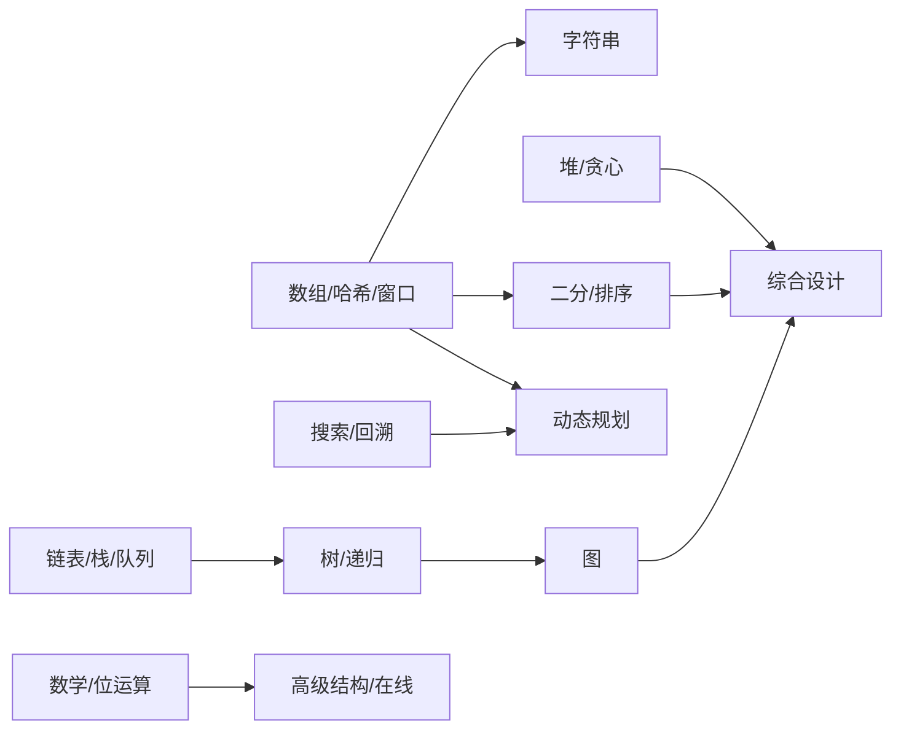

# 知识地图

| ID | 知识域 | 重点 | 重要性 | 覆盖难度 |
|---|---|---|---|---|
| K01 | 数组、哈希、前缀和、差分、双指针与滑动窗口 | 数组下标、频次映射、区间统计、原地更新、窗口不变量 | 核心 | B/I/A/E |
| K02 | 字符串、窗口统计、Trie 与字符串匹配 | 字符集、子串、字典树、KMP/Rolling Hash、编辑距离入口 | 核心 | B/I/A/E |
| K03 | 链表、栈、队列与单调结构 | 指针改写、栈匹配、队列模拟、单调栈/队列 | 核心 | B/I/A/E |
| K04 | 树、BST、递归遍历与序列化 | 递归定义、层序/DFS、路径、最近公共祖先、序列化 | 核心 | B/I/A/E |
| K05 | 堆、优先队列、贪心与区间 | 局部最优、交换论证、区间调度、TopK、双堆 | 核心 | B/I/A/E |
| K06 | 二分、排序、选择与分治 | 有序性、答案空间、稳定性、选择算法、归并分治 | 核心 | B/I/A/E |
| K07 | 图、拓扑、最短路、最小生成树与并查集 | 建图、连通性、BFS/DFS、Dijkstra、拓扑依赖 | 核心 | B/I/A/E |
| K08 | 动态规划 | 状态定义、转移、不变量、空间压缩、区间/树形/状态压缩 DP | 核心 | B/I/A/E |
| K09 | 回溯、搜索、剪枝与枚举 | 搜索树、去重、剪枝、分支界限、可行性证明 | 核心 | B/I/A/E |
| K10 | 位运算、数学、概率、组合与数论 | 位掩码、模运算、组合计数、随机化、概率期望 | 核心 | B/I/A/E |
| K11 | 高级数据结构与在线算法 | 线段树、Fenwick、LRU/LFU、数据流、跳表 | 核心 | B/I/A/E |
| K12 | 综合编码、算法设计与约束变化 | 多模式组合、工程约束、面试表达、开放变体 | 核心 | B/I/A/E |

## 依赖主线

箭头表示学习依赖，不表示唯一解法。每个核心知识域最终都应包含实现题、证明题、边界/反例题、测试题和追问题。
