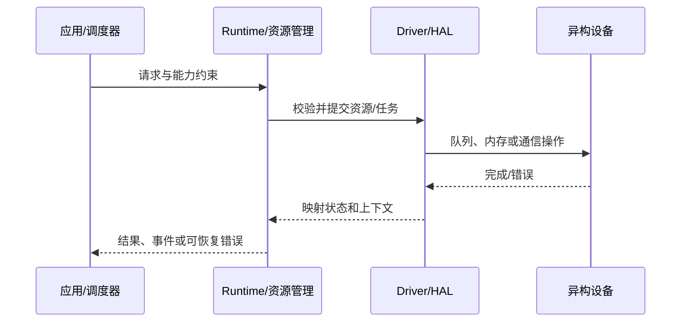
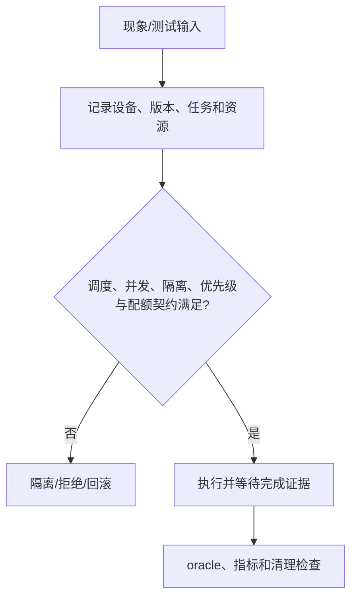
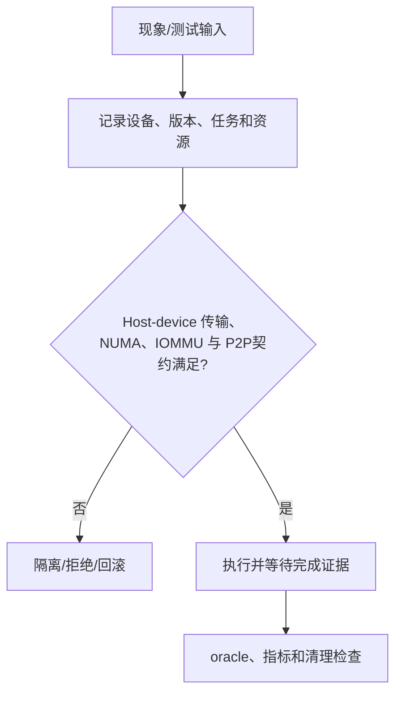
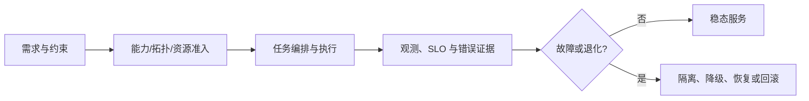

# 异构资源稳定性：高级面试题

- 题数：100
- 稳定 ID：`HRS-A001`–`HRS-A100`
- 生成规则：每题含十个正文部分、元数据、追问、反例、实践 oracle、评分和证据状态。

## HRS-A001. 稳定性目标、边界与故障模型：如何定义并划清边界？

- 难度：高级
- 知识域：K01 稳定性目标、边界与故障模型
- 考察能力：概念解释
- 题型：概念解释与辨析
- 面试频率：高频
- 前置知识：操作系统、并发、虚拟内存和基本可靠性指标
- 关联题目：前置 `-`；后续 `HRS-A002`
- 事实状态：`[已确认]` `[推断]` `[建议]`

#### 1. 背景知识

正确性、可用性、资源安全、可恢复性和可诊断性必须同时纳入稳定性契约。 本题属于高级，目标是在并发、性能、可靠性和成本约束下负责生产模块。异构平台同名对象不必拥有相同语义；涉及 CANN 时，GE、Runtime 和 Driver 的职责边界应以目标版本资料为准。把 API 返回成功等同于任务完成，或把超时直接判定为未执行。

#### 2. 问题分析

先给出定义和边界，再用反例区分相近概念。 先固定输入、输出、状态、资源所有权、执行上下文、版本和故障模型；再检查正常、异常和边界路径。不要把静态文档能够证明的事实、跨文档推断和必须通过运行验证的行为混在一起。

#### 3. 具体答案

高级方案需要在 稳定性目标、边界与故障模型 上同时满足正确性、尾延迟、资源预算和恢复时间。建议将静态能力与动态水位分开，将任务和资源建模为可审计状态机；对失败采用限次、幂等、隔离和回滚，而非无界重试。把 API 返回成功等同于任务完成，或把超时直接判定为未执行。

#### 4. 技术洞察

关键不变量是：任务仍可能引用的资源不能提前释放；每个请求只能有一个终态；底层原始错误不能被顶层映射吞掉；恢复动作不能突破故障域。可以用以下抽象检查问题：

```text
admit = static_capability ∧ topology_ok ∧ dynamic_budget
reuse = completion_proven ∧ refs == 0 ∧ owner_released
recover = failure_classified ∧ action_idempotent ∧ blast_radius_bounded
```

这些是用于推理和测试的模型，不是所有厂商 Runtime 的 API 契约。特定设备完成语义、错误码、带宽和容量需要目标环境核实。

#### 5. 图文说明



图中节点分别表示任务需求、资源/Runtime 控制面、Driver/HAL、设备和观测/恢复边界；箭头表示调用、数据传递或状态转移，具体含义取决于题型。图示强调控制流与资源生命周期，不能单独证明设备行为或性能收益。

#### 6. 拓展知识

可拓展到：稳定性目标、边界与故障模型 的厂商实现差异、设备 reset、容器/虚拟化、跨进程边界、SLO/错误预算和长期演进。相关证据入口为 `cann/docs/project-understanding/00-overview/global-error-model.md:29-42`；若源码、版本或硬件条件不同，应重新核实。

#### 7. 常见追问及回答要点

1. 如果资源水位或设备状态在检查后立即变化，如何避免误准入？回答需提到快照时效、提交处二次校验、预留/配额和结构化拒绝。
2. 如果任务已提交但完成证据丢失，能否重试？回答需区分 `SUCCESS/FAILURE/UNKNOWN`、幂等性、外部副作用、资源隔离和限次退避。
3. 如果面试官要求跨厂商迁移，哪些结论不能直接复用？回答需指出 API/ABI、Context/Stream/Event、内存可见性、错误码和拓扑语义必须重新验证。

#### 8. 易错点与反例

- 把“把 API 返回成功等同于任务完成，或把超时直接判定为未执行。”当作稳定性结论；
- 只给最佳实践，不写适用条件、反例和失败后的动作；
- 只看平均延迟或顶层错误，忽略尾延迟、原始错误、资源水位和时间线；
- 把未运行的硬件/网络/压测结果写成已验证；
- 忽略取消、超时、进程崩溃、重复回调和清理幂等性。

#### 9. 实践与验证

[待验证] 设计一个围绕“稳定性目标、边界与故障模型”的最小练习：

- 输入：两种设备能力/资源状态，任务包含必要的 shape、dtype、大小、超时和故障注入字段；
- 步骤：先生成带版本和时间戳的快照，执行准入/提交，注入一次边界或异步失败，再执行完成确认和清理；
- 预期结果：合法路径只有一个终态，资源在完成证据前不可复用，失败路径保留原始错误和上下文；
- 判定准则（oracle）：状态转移符合不变量，资源引用最终归零，结构化错误原因与注入点一致；
- 观测指标：成功率、P99、队列等待、资源峰值、错误类型、重试/回滚次数和泄漏数；
- 失败判断：出现提前释放、重复终态、无界重试、错误上下文缺失或跨故障域扩散即判失败。

真实设备、驱动、固件、网络、RDMA、多进程和性能结论当前未执行，均保持 `[待验证]`。

#### 10. 评分标准

- 不合格：只复述术语或给出“加资源、重试、加强监控”等无条件建议。
- 合格：能说明核心对象、正常流程、一个边界和基本验证方法。
- 良好：能给出状态/不变量、证据字段、异常处理、oracle 和方案取舍。
- 优秀：能在明确假设下做定量或故障域分析，比较替代路线，设计恢复/回滚、观测和长期演进，并主动标识 `[待验证]` 内容。

**证据与来源：** `cann/docs/project-understanding/00-overview/global-error-model.md:29-42`；本题通用机制中由证据推得的部分标为 `[推断]`，建议性设计标为 `[建议]`，硬件/网络/性能行为标为 `[待验证]`。

## HRS-A002. 设备发现、拓扑、能力协商与兼容：如何从假设和不变量推导行为？

- 难度：高级
- 知识域：K02 设备发现、拓扑、能力协商与兼容
- 考察能力：原理推导
- 题型：原理推导与算法分析
- 面试频率：高频
- 前置知识：HRS-A001
- 关联题目：前置 `HRS-A001`；后续 `HRS-A003`
- 事实状态：`[已确认]` `[推断]` `[建议]`

#### 1. 背景知识

设备身份、静态能力、版本配套、拓扑和动态资源共同决定任务准入。 本题属于高级，目标是在并发、性能、可靠性和成本约束下负责生产模块。异构平台同名对象不必拥有相同语义；涉及 CANN 时，GE、Runtime 和 Driver 的职责边界应以目标版本资料为准。只检查 device_id 或总显存，不检查 dtype、互联、权限、版本和快照时效。

#### 2. 问题分析

先写假设、变量和不变量，再推导正常与最坏路径。 先固定输入、输出、状态、资源所有权、执行上下文、版本和故障模型；再检查正常、异常和边界路径。不要把静态文档能够证明的事实、跨文档推断和必须通过运行验证的行为混在一起。

#### 3. 具体答案

高级方案需要在 设备发现、拓扑、能力协商与兼容 上同时满足正确性、尾延迟、资源预算和恢复时间。建议将静态能力与动态水位分开，将任务和资源建模为可审计状态机；对失败采用限次、幂等、隔离和回滚，而非无界重试。只检查 device_id 或总显存，不检查 dtype、互联、权限、版本和快照时效。

可用简化关系表达约束：`可复用资源 = 完成证据 ∧ 引用数为零 ∧ 所有权已归还`；容量问题则应把有效容量、峰值、碎片和安全余量分开。具体常数、硬件上限和性能收益不能从静态文档直接推出。

#### 4. 技术洞察

关键不变量是：任务仍可能引用的资源不能提前释放；每个请求只能有一个终态；底层原始错误不能被顶层映射吞掉；恢复动作不能突破故障域。可以用以下抽象检查问题：

```text
admit = static_capability ∧ topology_ok ∧ dynamic_budget
reuse = completion_proven ∧ refs == 0 ∧ owner_released
recover = failure_classified ∧ action_idempotent ∧ blast_radius_bounded
```

这些是用于推理和测试的模型，不是所有厂商 Runtime 的 API 契约。特定设备完成语义、错误码、带宽和容量需要目标环境核实。

#### 5. 图文说明


图中节点分别表示任务需求、资源/Runtime 控制面、Driver/HAL、设备和观测/恢复边界；箭头表示调用、数据传递或状态转移，具体含义取决于题型。图示强调控制流与资源生命周期，不能单独证明设备行为或性能收益。

#### 6. 拓展知识

可拓展到：设备发现、拓扑、能力协商与兼容 的厂商实现差异、设备 reset、容器/虚拟化、跨进程边界、SLO/错误预算和长期演进。相关证据入口为 `cann/docs/project-understanding/00-overview/architecture.md:50-53`；若源码、版本或硬件条件不同，应重新核实。

#### 7. 常见追问及回答要点

1. 如果资源水位或设备状态在检查后立即变化，如何避免误准入？回答需提到快照时效、提交处二次校验、预留/配额和结构化拒绝。
2. 如果任务已提交但完成证据丢失，能否重试？回答需区分 `SUCCESS/FAILURE/UNKNOWN`、幂等性、外部副作用、资源隔离和限次退避。
3. 如果面试官要求跨厂商迁移，哪些结论不能直接复用？回答需指出 API/ABI、Context/Stream/Event、内存可见性、错误码和拓扑语义必须重新验证。

#### 8. 易错点与反例

- 把“只检查 device_id 或总显存，不检查 dtype、互联、权限、版本和快照时效。”当作稳定性结论；
- 只给最佳实践，不写适用条件、反例和失败后的动作；
- 只看平均延迟或顶层错误，忽略尾延迟、原始错误、资源水位和时间线；
- 把未运行的硬件/网络/压测结果写成已验证；
- 忽略取消、超时、进程崩溃、重复回调和清理幂等性。

#### 9. 实践与验证

[待验证] 设计一个围绕“设备发现、拓扑、能力协商与兼容”的最小练习：

- 输入：两种设备能力/资源状态，任务包含必要的 shape、dtype、大小、超时和故障注入字段；
- 步骤：先生成带版本和时间戳的快照，执行准入/提交，注入一次边界或异步失败，再执行完成确认和清理；
- 预期结果：合法路径只有一个终态，资源在完成证据前不可复用，失败路径保留原始错误和上下文；
- 判定准则（oracle）：状态转移符合不变量，资源引用最终归零，结构化错误原因与注入点一致；
- 观测指标：成功率、P99、队列等待、资源峰值、错误类型、重试/回滚次数和泄漏数；
- 失败判断：出现提前释放、重复终态、无界重试、错误上下文缺失或跨故障域扩散即判失败。

真实设备、驱动、固件、网络、RDMA、多进程和性能结论当前未执行，均保持 `[待验证]`。

#### 10. 评分标准

- 不合格：只复述术语或给出“加资源、重试、加强监控”等无条件建议。
- 合格：能说明核心对象、正常流程、一个边界和基本验证方法。
- 良好：能给出状态/不变量、证据字段、异常处理、oracle 和方案取舍。
- 优秀：能在明确假设下做定量或故障域分析，比较替代路线，设计恢复/回滚、观测和长期演进，并主动标识 `[待验证]` 内容。

**证据与来源：** `cann/docs/project-understanding/00-overview/architecture.md:50-53`；本题通用机制中由证据推得的部分标为 `[推断]`，建议性设计标为 `[建议]`，硬件/网络/性能行为标为 `[待验证]`。

## HRS-A003. Context、Stream、Event 与 Queue 生命周期：请从入口追踪到最终结果和资源回收？

- 难度：高级
- 知识域：K03 Context、Stream、Event 与 Queue 生命周期
- 考察能力：流程追踪
- 题型：流程/调用链/数据流追踪
- 面试频率：开放题
- 前置知识：HRS-A002
- 关联题目：前置 `HRS-A002`；后续 `HRS-A004`
- 事实状态：`[已确认]` `[推断]` `[待验证]`

#### 1. 背景知识

执行对象要按依赖关系创建、绑定、完成、teardown 和引用归零；销毁通常是依赖图逆拓扑序。 本题属于高级，目标是在并发、性能、可靠性和成本约束下负责生产模块。异构平台同名对象不必拥有相同语义；涉及 CANN 时，GE、Runtime 和 Driver 的职责边界应以目标版本资料为准。句柄非空就销毁 Context，或在 pending task 时释放 child object。

#### 2. 问题分析

从入口沿数据、控制和资源流追踪到完成或副作用位置。 先固定输入、输出、状态、资源所有权、执行上下文、版本和故障模型；再检查正常、异常和边界路径。不要把静态文档能够证明的事实、跨文档推断和必须通过运行验证的行为混在一起。

#### 3. 具体答案

高级方案需要在 Context、Stream、Event 与 Queue 生命周期 上同时满足正确性、尾延迟、资源预算和恢复时间。建议将静态能力与动态水位分开，将任务和资源建模为可审计状态机；对失败采用限次、幂等、隔离和回滚，而非无界重试。句柄非空就销毁 Context，或在 pending task 时释放 child object。

#### 4. 技术洞察

关键不变量是：任务仍可能引用的资源不能提前释放；每个请求只能有一个终态；底层原始错误不能被顶层映射吞掉；恢复动作不能突破故障域。可以用以下抽象检查问题：

```text
admit = static_capability ∧ topology_ok ∧ dynamic_budget
reuse = completion_proven ∧ refs == 0 ∧ owner_released
recover = failure_classified ∧ action_idempotent ∧ blast_radius_bounded
```

这些是用于推理和测试的模型，不是所有厂商 Runtime 的 API 契约。特定设备完成语义、错误码、带宽和容量需要目标环境核实。

#### 5. 图文说明


图中节点分别表示任务需求、资源/Runtime 控制面、Driver/HAL、设备和观测/恢复边界；箭头表示调用、数据传递或状态转移，具体含义取决于题型。图示强调控制流与资源生命周期，不能单独证明设备行为或性能收益。

#### 6. 拓展知识

可拓展到：Context、Stream、Event 与 Queue 生命周期 的厂商实现差异、设备 reset、容器/虚拟化、跨进程边界、SLO/错误预算和长期演进。相关证据入口为 `cann/docs/project-understanding/90-cross-module/memory-and-resource-lifecycle.md:38-55`；若源码、版本或硬件条件不同，应重新核实。

#### 7. 常见追问及回答要点

1. 如果资源水位或设备状态在检查后立即变化，如何避免误准入？回答需提到快照时效、提交处二次校验、预留/配额和结构化拒绝。
2. 如果任务已提交但完成证据丢失，能否重试？回答需区分 `SUCCESS/FAILURE/UNKNOWN`、幂等性、外部副作用、资源隔离和限次退避。
3. 如果面试官要求跨厂商迁移，哪些结论不能直接复用？回答需指出 API/ABI、Context/Stream/Event、内存可见性、错误码和拓扑语义必须重新验证。

#### 8. 易错点与反例

- 把“句柄非空就销毁 Context，或在 pending task 时释放 child object。”当作稳定性结论；
- 只给最佳实践，不写适用条件、反例和失败后的动作；
- 只看平均延迟或顶层错误，忽略尾延迟、原始错误、资源水位和时间线；
- 把未运行的硬件/网络/压测结果写成已验证；
- 忽略取消、超时、进程崩溃、重复回调和清理幂等性。

#### 9. 实践与验证

[待验证] 设计一个围绕“Context、Stream、Event 与 Queue 生命周期”的最小练习：

- 输入：两种设备能力/资源状态，任务包含必要的 shape、dtype、大小、超时和故障注入字段；
- 步骤：先生成带版本和时间戳的快照，执行准入/提交，注入一次边界或异步失败，再执行完成确认和清理；
- 预期结果：合法路径只有一个终态，资源在完成证据前不可复用，失败路径保留原始错误和上下文；
- 判定准则（oracle）：状态转移符合不变量，资源引用最终归零，结构化错误原因与注入点一致；
- 观测指标：成功率、P99、队列等待、资源峰值、错误类型、重试/回滚次数和泄漏数；
- 失败判断：出现提前释放、重复终态、无界重试、错误上下文缺失或跨故障域扩散即判失败。

真实设备、驱动、固件、网络、RDMA、多进程和性能结论当前未执行，均保持 `[待验证]`。

#### 10. 评分标准

- 不合格：只复述术语或给出“加资源、重试、加强监控”等无条件建议。
- 合格：能说明核心对象、正常流程、一个边界和基本验证方法。
- 良好：能给出状态/不变量、证据字段、异常处理、oracle 和方案取舍。
- 优秀：能在明确假设下做定量或故障域分析，比较替代路线，设计恢复/回滚、观测和长期演进，并主动标识 `[待验证]` 内容。

**证据与来源：** `cann/docs/project-understanding/90-cross-module/memory-and-resource-lifecycle.md:38-55`；本题通用机制中由证据推得的部分标为 `[推断]`，建议性设计标为 `[建议]`，硬件/网络/性能行为标为 `[待验证]`。

## HRS-A004. 设备/主机内存、地址空间与内存池：请设计最小伪代码或状态机？

- 难度：高级
- 知识域：K04 设备/主机内存、地址空间与内存池
- 考察能力：实现分析
- 题型：代码、伪代码或配置分析
- 面试频率：高频
- 前置知识：HRS-A003
- 关联题目：前置 `HRS-A003`；后续 `HRS-A005`
- 事实状态：`[已确认]` `[推断]` `[待验证]`

#### 1. 背景知识

虚拟地址、物理 backing、主机 pin/map、设备内存池和缓存段具有不同所有权与可见性。 本题属于高级，目标是在并发、性能、可靠性和成本约束下负责生产模块。异构平台同名对象不必拥有相同语义；涉及 CANN 时，GE、Runtime 和 Driver 的职责边界应以目标版本资料为准。把总显存当可分配容量，或把 cached、free 和 busy 段混为一谈。

#### 2. 问题分析

明确输入、输出、状态、锁/队列、异常和释放责任，再给伪代码。 先固定输入、输出、状态、资源所有权、执行上下文、版本和故障模型；再检查正常、异常和边界路径。不要把静态文档能够证明的事实、跨文档推断和必须通过运行验证的行为混在一起。

#### 3. 具体答案

高级方案需要在 设备/主机内存、地址空间与内存池 上同时满足正确性、尾延迟、资源预算和恢复时间。建议将静态能力与动态水位分开，将任务和资源建模为可审计状态机；对失败采用限次、幂等、隔离和回滚，而非无界重试。把总显存当可分配容量，或把 cached、free 和 busy 段混为一谈。

#### 4. 技术洞察

关键不变量是：任务仍可能引用的资源不能提前释放；每个请求只能有一个终态；底层原始错误不能被顶层映射吞掉；恢复动作不能突破故障域。可以用以下抽象检查问题：

```text
admit = static_capability ∧ topology_ok ∧ dynamic_budget
reuse = completion_proven ∧ refs == 0 ∧ owner_released
recover = failure_classified ∧ action_idempotent ∧ blast_radius_bounded
```

这些是用于推理和测试的模型，不是所有厂商 Runtime 的 API 契约。特定设备完成语义、错误码、带宽和容量需要目标环境核实。

#### 5. 图文说明


图中节点分别表示任务需求、资源/Runtime 控制面、Driver/HAL、设备和观测/恢复边界；箭头表示调用、数据传递或状态转移，具体含义取决于题型。图示强调控制流与资源生命周期，不能单独证明设备行为或性能收益。

#### 6. 拓展知识

可拓展到：设备/主机内存、地址空间与内存池 的厂商实现差异、设备 reset、容器/虚拟化、跨进程边界、SLO/错误预算和长期演进。相关证据入口为 `cann/docs/project-understanding/90-cross-module/memory-and-resource-lifecycle.md:57-85`；若源码、版本或硬件条件不同，应重新核实。

#### 7. 常见追问及回答要点

1. 如果资源水位或设备状态在检查后立即变化，如何避免误准入？回答需提到快照时效、提交处二次校验、预留/配额和结构化拒绝。
2. 如果任务已提交但完成证据丢失，能否重试？回答需区分 `SUCCESS/FAILURE/UNKNOWN`、幂等性、外部副作用、资源隔离和限次退避。
3. 如果面试官要求跨厂商迁移，哪些结论不能直接复用？回答需指出 API/ABI、Context/Stream/Event、内存可见性、错误码和拓扑语义必须重新验证。

#### 8. 易错点与反例

- 把“把总显存当可分配容量，或把 cached、free 和 busy 段混为一谈。”当作稳定性结论；
- 只给最佳实践，不写适用条件、反例和失败后的动作；
- 只看平均延迟或顶层错误，忽略尾延迟、原始错误、资源水位和时间线；
- 把未运行的硬件/网络/压测结果写成已验证；
- 忽略取消、超时、进程崩溃、重复回调和清理幂等性。

#### 9. 实践与验证

[待验证] 设计一个围绕“设备/主机内存、地址空间与内存池”的最小练习：

- 输入：两种设备能力/资源状态，任务包含必要的 shape、dtype、大小、超时和故障注入字段；
- 步骤：先生成带版本和时间戳的快照，执行准入/提交，注入一次边界或异步失败，再执行完成确认和清理；
- 预期结果：合法路径只有一个终态，资源在完成证据前不可复用，失败路径保留原始错误和上下文；
- 判定准则（oracle）：状态转移符合不变量，资源引用最终归零，结构化错误原因与注入点一致；
- 观测指标：成功率、P99、队列等待、资源峰值、错误类型、重试/回滚次数和泄漏数；
- 失败判断：出现提前释放、重复终态、无界重试、错误上下文缺失或跨故障域扩散即判失败。

真实设备、驱动、固件、网络、RDMA、多进程和性能结论当前未执行，均保持 `[待验证]`。

#### 10. 评分标准

- 不合格：只复述术语或给出“加资源、重试、加强监控”等无条件建议。
- 合格：能说明核心对象、正常流程、一个边界和基本验证方法。
- 良好：能给出状态/不变量、证据字段、异常处理、oracle 和方案取舍。
- 优秀：能在明确假设下做定量或故障域分析，比较替代路线，设计恢复/回滚、观测和长期演进，并主动标识 `[待验证]` 内容。

**证据与来源：** `cann/docs/project-understanding/90-cross-module/memory-and-resource-lifecycle.md:57-85`；本题通用机制中由证据推得的部分标为 `[推断]`，建议性设计标为 `[建议]`，硬件/网络/性能行为标为 `[待验证]`。

## HRS-A005. 异步提交、完成语义与内存可见性：两种常见方案的适用边界是什么？

- 难度：高级
- 知识域：K05 异步提交、完成语义与内存可见性
- 考察能力：对比决策
- 题型：对比与取舍
- 面试频率：高频
- 前置知识：HRS-A004
- 关联题目：前置 `HRS-A004`；后续 `HRS-A006`
- 事实状态：`[推断]` `[待验证]` `[建议]`

#### 1. 背景知识

提交、设备消费、事件完成、主机可见和资源可复用是不同完成边界。 本题属于高级，目标是在并发、性能、可靠性和成本约束下负责生产模块。异构平台同名对象不必拥有相同语义；涉及 CANN 时，GE、Runtime 和 Driver 的职责边界应以目标版本资料为准。用 sleep 或 API 返回值代替事件/同步完成证明。

#### 2. 问题分析

先列约束和指标，再比较至少两种方案的适用边界与二阶代价。 先固定输入、输出、状态、资源所有权、执行上下文、版本和故障模型；再检查正常、异常和边界路径。不要把静态文档能够证明的事实、跨文档推断和必须通过运行验证的行为混在一起。

#### 3. 具体答案

高级方案需要在 异步提交、完成语义与内存可见性 上同时满足正确性、尾延迟、资源预算和恢复时间。建议将静态能力与动态水位分开，将任务和资源建模为可审计状态机；对失败采用限次、幂等、隔离和回滚，而非无界重试。用 sleep 或 API 返回值代替事件/同步完成证明。

#### 4. 技术洞察

关键不变量是：任务仍可能引用的资源不能提前释放；每个请求只能有一个终态；底层原始错误不能被顶层映射吞掉；恢复动作不能突破故障域。可以用以下抽象检查问题：

```text
admit = static_capability ∧ topology_ok ∧ dynamic_budget
reuse = completion_proven ∧ refs == 0 ∧ owner_released
recover = failure_classified ∧ action_idempotent ∧ blast_radius_bounded
```

这些是用于推理和测试的模型，不是所有厂商 Runtime 的 API 契约。特定设备完成语义、错误码、带宽和容量需要目标环境核实。

#### 5. 图文说明

| 维度 | 方案一 | 方案二 | 判断依据 |
|---|---|---|---|
| 延迟 | 取决于等待和路径 | 取决于搬迁/重试 | P99 与队列 |
| 资源 | 占用可预测性 | 峰值和碎片 | 水位与容量 |
| 故障 | 隔离粒度 | 恢复复杂度 | 故障域与幂等 |
| 成本 | 开发/运维成本 | 硬件/通信成本 | 总拥有成本 |

图中节点分别表示任务需求、资源/Runtime 控制面、Driver/HAL、设备和观测/恢复边界；箭头表示调用、数据传递或状态转移，具体含义取决于题型。图示强调控制流与资源生命周期，不能单独证明设备行为或性能收益。

#### 6. 拓展知识

可拓展到：异步提交、完成语义与内存可见性 的厂商实现差异、设备 reset、容器/虚拟化、跨进程边界、SLO/错误预算和长期演进。相关证据入口为 `cann/docs/project-understanding/90-cross-module/memory-and-resource-lifecycle.md:88-100`；若源码、版本或硬件条件不同，应重新核实。

#### 7. 常见追问及回答要点

1. 如果资源水位或设备状态在检查后立即变化，如何避免误准入？回答需提到快照时效、提交处二次校验、预留/配额和结构化拒绝。
2. 如果任务已提交但完成证据丢失，能否重试？回答需区分 `SUCCESS/FAILURE/UNKNOWN`、幂等性、外部副作用、资源隔离和限次退避。
3. 如果面试官要求跨厂商迁移，哪些结论不能直接复用？回答需指出 API/ABI、Context/Stream/Event、内存可见性、错误码和拓扑语义必须重新验证。

#### 8. 易错点与反例

- 把“用 sleep 或 API 返回值代替事件/同步完成证明。”当作稳定性结论；
- 只给最佳实践，不写适用条件、反例和失败后的动作；
- 只看平均延迟或顶层错误，忽略尾延迟、原始错误、资源水位和时间线；
- 把未运行的硬件/网络/压测结果写成已验证；
- 忽略取消、超时、进程崩溃、重复回调和清理幂等性。

#### 9. 实践与验证

[待验证] 设计一个围绕“异步提交、完成语义与内存可见性”的最小练习：

- 输入：两种设备能力/资源状态，任务包含必要的 shape、dtype、大小、超时和故障注入字段；
- 步骤：先生成带版本和时间戳的快照，执行准入/提交，注入一次边界或异步失败，再执行完成确认和清理；
- 预期结果：合法路径只有一个终态，资源在完成证据前不可复用，失败路径保留原始错误和上下文；
- 判定准则（oracle）：状态转移符合不变量，资源引用最终归零，结构化错误原因与注入点一致；
- 观测指标：成功率、P99、队列等待、资源峰值、错误类型、重试/回滚次数和泄漏数；
- 失败判断：出现提前释放、重复终态、无界重试、错误上下文缺失或跨故障域扩散即判失败。

真实设备、驱动、固件、网络、RDMA、多进程和性能结论当前未执行，均保持 `[待验证]`。

#### 10. 评分标准

- 不合格：只复述术语或给出“加资源、重试、加强监控”等无条件建议。
- 合格：能说明核心对象、正常流程、一个边界和基本验证方法。
- 良好：能给出状态/不变量、证据字段、异常处理、oracle 和方案取舍。
- 优秀：能在明确假设下做定量或故障域分析，比较替代路线，设计恢复/回滚、观测和长期演进，并主动标识 `[待验证]` 内容。

**证据与来源：** `cann/docs/project-understanding/90-cross-module/memory-and-resource-lifecycle.md:88-100`；本题通用机制中由证据推得的部分标为 `[推断]`，建议性设计标为 `[建议]`，硬件/网络/性能行为标为 `[待验证]`。

## HRS-A006. 调度、并发、隔离、优先级与配额：如何设计正常、异常和边界用例？

- 难度：高级
- 知识域：K06 调度、并发、隔离、优先级与配额
- 考察能力：测试验证
- 题型：测试、实验与验证设计
- 面试频率：开放题
- 前置知识：HRS-A005
- 关联题目：前置 `HRS-A005`；后续 `HRS-A007`
- 事实状态：`[已确认]` `[待验证]` `[建议]`

#### 1. 背景知识

共享异构设备需要处理队列、公平性、优先级、租户配额、背压和故障隔离。 本题属于高级，目标是在并发、性能、可靠性和成本约束下负责生产模块。异构平台同名对象不必拥有相同语义；涉及 CANN 时，GE、Runtime 和 Driver 的职责边界应以目标版本资料为准。只追求平均利用率，忽略尾延迟、饥饿、优先级反转和 noisy neighbor。

#### 2. 问题分析

先定义控制变量、oracle、指标和环境，再安排正常、异常、边界用例。 先固定输入、输出、状态、资源所有权、执行上下文、版本和故障模型；再检查正常、异常和边界路径。不要把静态文档能够证明的事实、跨文档推断和必须通过运行验证的行为混在一起。

#### 3. 具体答案

高级方案需要在 调度、并发、隔离、优先级与配额 上同时满足正确性、尾延迟、资源预算和恢复时间。建议将静态能力与动态水位分开，将任务和资源建模为可审计状态机；对失败采用限次、幂等、隔离和回滚，而非无界重试。只追求平均利用率，忽略尾延迟、饥饿、优先级反转和 noisy neighbor。

#### 4. 技术洞察

关键不变量是：任务仍可能引用的资源不能提前释放；每个请求只能有一个终态；底层原始错误不能被顶层映射吞掉；恢复动作不能突破故障域。可以用以下抽象检查问题：

```text
admit = static_capability ∧ topology_ok ∧ dynamic_budget
reuse = completion_proven ∧ refs == 0 ∧ owner_released
recover = failure_classified ∧ action_idempotent ∧ blast_radius_bounded
```

这些是用于推理和测试的模型，不是所有厂商 Runtime 的 API 契约。特定设备完成语义、错误码、带宽和容量需要目标环境核实。

#### 5. 图文说明



图中节点分别表示任务需求、资源/Runtime 控制面、Driver/HAL、设备和观测/恢复边界；箭头表示调用、数据传递或状态转移，具体含义取决于题型。图示强调控制流与资源生命周期，不能单独证明设备行为或性能收益。

#### 6. 拓展知识

可拓展到：调度、并发、隔离、优先级与配额 的厂商实现差异、设备 reset、容器/虚拟化、跨进程边界、SLO/错误预算和长期演进。相关证据入口为 `cann/docs/project-understanding/90-cross-module/performance-critical-paths.md:24-43`；若源码、版本或硬件条件不同，应重新核实。

#### 7. 常见追问及回答要点

1. 如果资源水位或设备状态在检查后立即变化，如何避免误准入？回答需提到快照时效、提交处二次校验、预留/配额和结构化拒绝。
2. 如果任务已提交但完成证据丢失，能否重试？回答需区分 `SUCCESS/FAILURE/UNKNOWN`、幂等性、外部副作用、资源隔离和限次退避。
3. 如果面试官要求跨厂商迁移，哪些结论不能直接复用？回答需指出 API/ABI、Context/Stream/Event、内存可见性、错误码和拓扑语义必须重新验证。

#### 8. 易错点与反例

- 把“只追求平均利用率，忽略尾延迟、饥饿、优先级反转和 noisy neighbor。”当作稳定性结论；
- 只给最佳实践，不写适用条件、反例和失败后的动作；
- 只看平均延迟或顶层错误，忽略尾延迟、原始错误、资源水位和时间线；
- 把未运行的硬件/网络/压测结果写成已验证；
- 忽略取消、超时、进程崩溃、重复回调和清理幂等性。

#### 9. 实践与验证

[待验证] 设计一个围绕“调度、并发、隔离、优先级与配额”的最小练习：

- 输入：两种设备能力/资源状态，任务包含必要的 shape、dtype、大小、超时和故障注入字段；
- 步骤：先生成带版本和时间戳的快照，执行准入/提交，注入一次边界或异步失败，再执行完成确认和清理；
- 预期结果：合法路径只有一个终态，资源在完成证据前不可复用，失败路径保留原始错误和上下文；
- 判定准则（oracle）：状态转移符合不变量，资源引用最终归零，结构化错误原因与注入点一致；
- 观测指标：成功率、P99、队列等待、资源峰值、错误类型、重试/回滚次数和泄漏数；
- 失败判断：出现提前释放、重复终态、无界重试、错误上下文缺失或跨故障域扩散即判失败。

真实设备、驱动、固件、网络、RDMA、多进程和性能结论当前未执行，均保持 `[待验证]`。

#### 10. 评分标准

- 不合格：只复述术语或给出“加资源、重试、加强监控”等无条件建议。
- 合格：能说明核心对象、正常流程、一个边界和基本验证方法。
- 良好：能给出状态/不变量、证据字段、异常处理、oracle 和方案取舍。
- 优秀：能在明确假设下做定量或故障域分析，比较替代路线，设计恢复/回滚、观测和长期演进，并主动标识 `[待验证]` 内容。

**证据与来源：** `cann/docs/project-understanding/90-cross-module/performance-critical-paths.md:24-43`；本题通用机制中由证据推得的部分标为 `[推断]`，建议性设计标为 `[建议]`，硬件/网络/性能行为标为 `[待验证]`。

## HRS-A007. Host-device 传输、NUMA、IOMMU 与 P2P：现象和影响如何分层？

- 难度：高级
- 知识域：K07 Host-device 传输、NUMA、IOMMU 与 P2P
- 考察能力：故障排查
- 题型：故障排查与事故复盘
- 面试频率：高频
- 前置知识：HRS-A006
- 关联题目：前置 `HRS-A006`；后续 `HRS-A008`
- 事实状态：`[已确认]` `[待验证]` `[建议]`

#### 1. 背景知识

传输路径受内存位置、pin/map、DMA、NUMA、IOMMU、PCIe 和 P2P 能力共同约束。 本题属于高级，目标是在并发、性能、可靠性和成本约束下负责生产模块。异构平台同名对象不必拥有相同语义；涉及 CANN 时，GE、Runtime 和 Driver 的职责边界应以目标版本资料为准。把能访问指针当作高效 DMA，把设备可见当作传输已完成。

#### 2. 问题分析

按现象、保护、假设、证据、排除、缓解、修复和复盘顺序处理。 先固定输入、输出、状态、资源所有权、执行上下文、版本和故障模型；再检查正常、异常和边界路径。不要把静态文档能够证明的事实、跨文档推断和必须通过运行验证的行为混在一起。

#### 3. 具体答案

高级方案需要在 Host-device 传输、NUMA、IOMMU 与 P2P 上同时满足正确性、尾延迟、资源预算和恢复时间。建议将静态能力与动态水位分开，将任务和资源建模为可审计状态机；对失败采用限次、幂等、隔离和回滚，而非无界重试。把能访问指针当作高效 DMA，把设备可见当作传输已完成。

临时措施是先停止扩大影响、隔离故障域和保留证据；永久修复要补回归测试、监控和恢复演练。超时后的结果可能是 `UNKNOWN`，不能未经幂等性判断直接重试。

#### 4. 技术洞察

关键不变量是：任务仍可能引用的资源不能提前释放；每个请求只能有一个终态；底层原始错误不能被顶层映射吞掉；恢复动作不能突破故障域。可以用以下抽象检查问题：

```text
admit = static_capability ∧ topology_ok ∧ dynamic_budget
reuse = completion_proven ∧ refs == 0 ∧ owner_released
recover = failure_classified ∧ action_idempotent ∧ blast_radius_bounded
```

这些是用于推理和测试的模型，不是所有厂商 Runtime 的 API 契约。特定设备完成语义、错误码、带宽和容量需要目标环境核实。

#### 5. 图文说明



图中节点分别表示任务需求、资源/Runtime 控制面、Driver/HAL、设备和观测/恢复边界；箭头表示调用、数据传递或状态转移，具体含义取决于题型。图示强调控制流与资源生命周期，不能单独证明设备行为或性能收益。

#### 6. 拓展知识

可拓展到：Host-device 传输、NUMA、IOMMU 与 P2P 的厂商实现差异、设备 reset、容器/虚拟化、跨进程边界、SLO/错误预算和长期演进。相关证据入口为 `cann/docs/project-understanding/90-cross-module/performance-critical-paths.md:24-30`；若源码、版本或硬件条件不同，应重新核实。

#### 7. 常见追问及回答要点

1. 如果资源水位或设备状态在检查后立即变化，如何避免误准入？回答需提到快照时效、提交处二次校验、预留/配额和结构化拒绝。
2. 如果任务已提交但完成证据丢失，能否重试？回答需区分 `SUCCESS/FAILURE/UNKNOWN`、幂等性、外部副作用、资源隔离和限次退避。
3. 如果面试官要求跨厂商迁移，哪些结论不能直接复用？回答需指出 API/ABI、Context/Stream/Event、内存可见性、错误码和拓扑语义必须重新验证。

#### 8. 易错点与反例

- 把“把能访问指针当作高效 DMA，把设备可见当作传输已完成。”当作稳定性结论；
- 只给最佳实践，不写适用条件、反例和失败后的动作；
- 只看平均延迟或顶层错误，忽略尾延迟、原始错误、资源水位和时间线；
- 把未运行的硬件/网络/压测结果写成已验证；
- 忽略取消、超时、进程崩溃、重复回调和清理幂等性。

#### 9. 实践与验证

[待验证] 设计一个围绕“Host-device 传输、NUMA、IOMMU 与 P2P”的最小练习：

- 输入：两种设备能力/资源状态，任务包含必要的 shape、dtype、大小、超时和故障注入字段；
- 步骤：先生成带版本和时间戳的快照，执行准入/提交，注入一次边界或异步失败，再执行完成确认和清理；
- 预期结果：合法路径只有一个终态，资源在完成证据前不可复用，失败路径保留原始错误和上下文；
- 判定准则（oracle）：状态转移符合不变量，资源引用最终归零，结构化错误原因与注入点一致；
- 观测指标：成功率、P99、队列等待、资源峰值、错误类型、重试/回滚次数和泄漏数；
- 失败判断：出现提前释放、重复终态、无界重试、错误上下文缺失或跨故障域扩散即判失败。

真实设备、驱动、固件、网络、RDMA、多进程和性能结论当前未执行，均保持 `[待验证]`。

#### 10. 评分标准

- 不合格：只复述术语或给出“加资源、重试、加强监控”等无条件建议。
- 合格：能说明核心对象、正常流程、一个边界和基本验证方法。
- 良好：能给出状态/不变量、证据字段、异常处理、oracle 和方案取舍。
- 优秀：能在明确假设下做定量或故障域分析，比较替代路线，设计恢复/回滚、观测和长期演进，并主动标识 `[待验证]` 内容。

**证据与来源：** `cann/docs/project-understanding/90-cross-module/performance-critical-paths.md:24-30`；本题通用机制中由证据推得的部分标为 `[推断]`，建议性设计标为 `[建议]`，硬件/网络/性能行为标为 `[待验证]`。

## HRS-A008. 跨卡/跨节点通信、集合通信与 RDMA：如何定义吞吐、P99、利用率和成本口径？

- 难度：高级
- 知识域：K08 跨卡/跨节点通信、集合通信与 RDMA
- 考察能力：性能分析
- 题型：性能、容量与成本分析
- 面试频率：高频
- 前置知识：HRS-A007
- 关联题目：前置 `HRS-A007`；后续 `HRS-A009`
- 事实状态：`[已确认]` `[待验证]` `[建议]`

#### 1. 背景知识

集体通信要求参与者、顺序、拓扑、缓冲区和完成协议一致；局部失败可能导致全局阻塞。 本题属于高级，目标是在并发、性能、可靠性和成本约束下负责生产模块。异构平台同名对象不必拥有相同语义；涉及 CANN 时，GE、Runtime 和 Driver 的职责边界应以目标版本资料为准。只在单卡测试通信，或对 collective 超时无限重试。

#### 2. 问题分析

先统一指标口径并做数量级估算，再定位瓶颈和优化副作用。 先固定输入、输出、状态、资源所有权、执行上下文、版本和故障模型；再检查正常、异常和边界路径。不要把静态文档能够证明的事实、跨文档推断和必须通过运行验证的行为混在一起。

#### 3. 具体答案

高级方案需要在 跨卡/跨节点通信、集合通信与 RDMA 上同时满足正确性、尾延迟、资源预算和恢复时间。建议将静态能力与动态水位分开，将任务和资源建模为可审计状态机；对失败采用限次、幂等、隔离和回滚，而非无界重试。只在单卡测试通信，或对 collective 超时无限重试。

至少报告吞吐、P50/P95/P99、队列等待、设备利用率、内存峰值、错误率和单位请求成本；没有实际运行记录的数字必须写为 `[待验证]`。

#### 4. 技术洞察

关键不变量是：任务仍可能引用的资源不能提前释放；每个请求只能有一个终态；底层原始错误不能被顶层映射吞掉；恢复动作不能突破故障域。可以用以下抽象检查问题：

```text
admit = static_capability ∧ topology_ok ∧ dynamic_budget
reuse = completion_proven ∧ refs == 0 ∧ owner_released
recover = failure_classified ∧ action_idempotent ∧ blast_radius_bounded
```

这些是用于推理和测试的模型，不是所有厂商 Runtime 的 API 契约。特定设备完成语义、错误码、带宽和容量需要目标环境核实。

#### 5. 图文说明


图中节点分别表示任务需求、资源/Runtime 控制面、Driver/HAL、设备和观测/恢复边界；箭头表示调用、数据传递或状态转移，具体含义取决于题型。图示强调控制流与资源生命周期，不能单独证明设备行为或性能收益。

#### 6. 拓展知识

可拓展到：跨卡/跨节点通信、集合通信与 RDMA 的厂商实现差异、设备 reset、容器/虚拟化、跨进程边界、SLO/错误预算和长期演进。相关证据入口为 `cann/docs/project-understanding/90-cross-module/error-boundaries.md:40-48`；若源码、版本或硬件条件不同，应重新核实。

#### 7. 常见追问及回答要点

1. 如果资源水位或设备状态在检查后立即变化，如何避免误准入？回答需提到快照时效、提交处二次校验、预留/配额和结构化拒绝。
2. 如果任务已提交但完成证据丢失，能否重试？回答需区分 `SUCCESS/FAILURE/UNKNOWN`、幂等性、外部副作用、资源隔离和限次退避。
3. 如果面试官要求跨厂商迁移，哪些结论不能直接复用？回答需指出 API/ABI、Context/Stream/Event、内存可见性、错误码和拓扑语义必须重新验证。

#### 8. 易错点与反例

- 把“只在单卡测试通信，或对 collective 超时无限重试。”当作稳定性结论；
- 只给最佳实践，不写适用条件、反例和失败后的动作；
- 只看平均延迟或顶层错误，忽略尾延迟、原始错误、资源水位和时间线；
- 把未运行的硬件/网络/压测结果写成已验证；
- 忽略取消、超时、进程崩溃、重复回调和清理幂等性。

#### 9. 实践与验证

[待验证] 设计一个围绕“跨卡/跨节点通信、集合通信与 RDMA”的最小练习：

- 输入：两种设备能力/资源状态，任务包含必要的 shape、dtype、大小、超时和故障注入字段；
- 步骤：先生成带版本和时间戳的快照，执行准入/提交，注入一次边界或异步失败，再执行完成确认和清理；
- 预期结果：合法路径只有一个终态，资源在完成证据前不可复用，失败路径保留原始错误和上下文；
- 判定准则（oracle）：状态转移符合不变量，资源引用最终归零，结构化错误原因与注入点一致；
- 观测指标：成功率、P99、队列等待、资源峰值、错误类型、重试/回滚次数和泄漏数；
- 失败判断：出现提前释放、重复终态、无界重试、错误上下文缺失或跨故障域扩散即判失败。

真实设备、驱动、固件、网络、RDMA、多进程和性能结论当前未执行，均保持 `[待验证]`。

#### 10. 评分标准

- 不合格：只复述术语或给出“加资源、重试、加强监控”等无条件建议。
- 合格：能说明核心对象、正常流程、一个边界和基本验证方法。
- 良好：能给出状态/不变量、证据字段、异常处理、oracle 和方案取舍。
- 优秀：能在明确假设下做定量或故障域分析，比较替代路线，设计恢复/回滚、观测和长期演进，并主动标识 `[待验证]` 内容。

**证据与来源：** `cann/docs/project-understanding/90-cross-module/error-boundaries.md:40-48`；本题通用机制中由证据推得的部分标为 `[推断]`，建议性设计标为 `[建议]`，硬件/网络/性能行为标为 `[待验证]`。

## HRS-A009. 错误传播、超时、取消、恢复与故障注入：请先澄清需求和约束再给最小方案？

- 难度：高级
- 知识域：K09 错误传播、超时、取消、恢复与故障注入
- 考察能力：系统设计
- 题型：系统设计与工程落地
- 面试频率：开放题
- 前置知识：HRS-A008
- 关联题目：前置 `HRS-A008`；后续 `HRS-A010`
- 事实状态：`[推断]` `[待验证]` `[建议]`

#### 1. 背景知识

错误要跨 Driver/HAL/Runtime/ACL/GE 保留上下文，并以状态机区分失败、成功和未知。 本题属于高级，目标是在并发、性能、可靠性和成本约束下负责生产模块。异构平台同名对象不必拥有相同语义；涉及 CANN 时，GE、Runtime 和 Driver 的职责边界应以目标版本资料为准。丢弃原始错误码、无限重试或未经幂等性判断执行补偿。

#### 2. 问题分析

先澄清需求与故障模型，再给最小架构、接口、状态、运维和回滚。 先固定输入、输出、状态、资源所有权、执行上下文、版本和故障模型；再检查正常、异常和边界路径。不要把静态文档能够证明的事实、跨文档推断和必须通过运行验证的行为混在一起。

#### 3. 具体答案

高级方案需要在 错误传播、超时、取消、恢复与故障注入 上同时满足正确性、尾延迟、资源预算和恢复时间。建议将静态能力与动态水位分开，将任务和资源建模为可审计状态机；对失败采用限次、幂等、隔离和回滚，而非无界重试。丢弃原始错误码、无限重试或未经幂等性判断执行补偿。

接口应返回结构化状态和诊断上下文；资源层应提供配额、取消、回收和健康检查；发布必须有灰度、回滚和兼容矩阵。

#### 4. 技术洞察

关键不变量是：任务仍可能引用的资源不能提前释放；每个请求只能有一个终态；底层原始错误不能被顶层映射吞掉；恢复动作不能突破故障域。可以用以下抽象检查问题：

```text
admit = static_capability ∧ topology_ok ∧ dynamic_budget
reuse = completion_proven ∧ refs == 0 ∧ owner_released
recover = failure_classified ∧ action_idempotent ∧ blast_radius_bounded
```

这些是用于推理和测试的模型，不是所有厂商 Runtime 的 API 契约。特定设备完成语义、错误码、带宽和容量需要目标环境核实。

#### 5. 图文说明



图中节点分别表示任务需求、资源/Runtime 控制面、Driver/HAL、设备和观测/恢复边界；箭头表示调用、数据传递或状态转移，具体含义取决于题型。图示强调控制流与资源生命周期，不能单独证明设备行为或性能收益。

#### 6. 拓展知识

可拓展到：错误传播、超时、取消、恢复与故障注入 的厂商实现差异、设备 reset、容器/虚拟化、跨进程边界、SLO/错误预算和长期演进。相关证据入口为 `cann/docs/project-understanding/90-cross-module/error-boundaries.md:25-48`；若源码、版本或硬件条件不同，应重新核实。

#### 7. 常见追问及回答要点

1. 如果资源水位或设备状态在检查后立即变化，如何避免误准入？回答需提到快照时效、提交处二次校验、预留/配额和结构化拒绝。
2. 如果任务已提交但完成证据丢失，能否重试？回答需区分 `SUCCESS/FAILURE/UNKNOWN`、幂等性、外部副作用、资源隔离和限次退避。
3. 如果面试官要求跨厂商迁移，哪些结论不能直接复用？回答需指出 API/ABI、Context/Stream/Event、内存可见性、错误码和拓扑语义必须重新验证。

#### 8. 易错点与反例

- 把“丢弃原始错误码、无限重试或未经幂等性判断执行补偿。”当作稳定性结论；
- 只给最佳实践，不写适用条件、反例和失败后的动作；
- 只看平均延迟或顶层错误，忽略尾延迟、原始错误、资源水位和时间线；
- 把未运行的硬件/网络/压测结果写成已验证；
- 忽略取消、超时、进程崩溃、重复回调和清理幂等性。

#### 9. 实践与验证

[待验证] 设计一个围绕“错误传播、超时、取消、恢复与故障注入”的最小练习：

- 输入：两种设备能力/资源状态，任务包含必要的 shape、dtype、大小、超时和故障注入字段；
- 步骤：先生成带版本和时间戳的快照，执行准入/提交，注入一次边界或异步失败，再执行完成确认和清理；
- 预期结果：合法路径只有一个终态，资源在完成证据前不可复用，失败路径保留原始错误和上下文；
- 判定准则（oracle）：状态转移符合不变量，资源引用最终归零，结构化错误原因与注入点一致；
- 观测指标：成功率、P99、队列等待、资源峰值、错误类型、重试/回滚次数和泄漏数；
- 失败判断：出现提前释放、重复终态、无界重试、错误上下文缺失或跨故障域扩散即判失败。

真实设备、驱动、固件、网络、RDMA、多进程和性能结论当前未执行，均保持 `[待验证]`。

#### 10. 评分标准

- 不合格：只复述术语或给出“加资源、重试、加强监控”等无条件建议。
- 合格：能说明核心对象、正常流程、一个边界和基本验证方法。
- 良好：能给出状态/不变量、证据字段、异常处理、oracle 和方案取舍。
- 优秀：能在明确假设下做定量或故障域分析，比较替代路线，设计恢复/回滚、观测和长期演进，并主动标识 `[待验证]` 内容。

**证据与来源：** `cann/docs/project-understanding/90-cross-module/error-boundaries.md:25-48`；本题通用机制中由证据推得的部分标为 `[推断]`，建议性设计标为 `[建议]`，硬件/网络/性能行为标为 `[待验证]`。

## HRS-A010. 日志、指标、Tracing、dump、SLO 与诊断证据链：在信息不完整时你会先声明哪些假设？

- 难度：高级
- 知识域：K10 日志、指标、Tracing、dump、SLO 与诊断证据链
- 考察能力：专家判断
- 题型：综合开放题与专家追问
- 面试频率：高频
- 前置知识：HRS-A009
- 关联题目：前置 `HRS-A009`；后续 `HRS-A011`
- 事实状态：`[推断]` `[待验证]` `[建议]`

#### 1. 背景知识

可观测性要关联时间、设备、Context、任务、资源、版本和错误边界，支持从症状回溯根因。 本题属于高级，目标是在并发、性能、可靠性和成本约束下负责生产模块。异构平台同名对象不必拥有相同语义；涉及 CANN 时，GE、Runtime 和 Driver 的职责边界应以目标版本资料为准。只采集平均延迟或只记录顶层错误，无法重建跨层时间线。

#### 2. 问题分析

显式写出事实、假设和未知，比较路线并定义验证与演进门槛。 先固定输入、输出、状态、资源所有权、执行上下文、版本和故障模型；再检查正常、异常和边界路径。不要把静态文档能够证明的事实、跨文档推断和必须通过运行验证的行为混在一起。

#### 3. 具体答案

高级方案需要在 日志、指标、Tracing、dump、SLO 与诊断证据链 上同时满足正确性、尾延迟、资源预算和恢复时间。建议将静态能力与动态水位分开，将任务和资源建模为可审计状态机；对失败采用限次、幂等、隔离和回滚，而非无界重试。只采集平均延迟或只记录顶层错误，无法重建跨层时间线。

没有唯一最佳方案：选择应由 SLO、故障域、数据一致性、运维能力和总成本决定。凡依赖具体驱动、固件、网络或硬件的行为都要列入验证清单。

#### 4. 技术洞察

关键不变量是：任务仍可能引用的资源不能提前释放；每个请求只能有一个终态；底层原始错误不能被顶层映射吞掉；恢复动作不能突破故障域。可以用以下抽象检查问题：

```text
admit = static_capability ∧ topology_ok ∧ dynamic_budget
reuse = completion_proven ∧ refs == 0 ∧ owner_released
recover = failure_classified ∧ action_idempotent ∧ blast_radius_bounded
```

这些是用于推理和测试的模型，不是所有厂商 Runtime 的 API 契约。特定设备完成语义、错误码、带宽和容量需要目标环境核实。

#### 5. 图文说明


图中节点分别表示任务需求、资源/Runtime 控制面、Driver/HAL、设备和观测/恢复边界；箭头表示调用、数据传递或状态转移，具体含义取决于题型。图示强调控制流与资源生命周期，不能单独证明设备行为或性能收益。

#### 6. 拓展知识

可拓展到：日志、指标、Tracing、dump、SLO 与诊断证据链 的厂商实现差异、设备 reset、容器/虚拟化、跨进程边界、SLO/错误预算和长期演进。相关证据入口为 `cann/docs/project-understanding/00-overview/global-error-model.md:38-42`；若源码、版本或硬件条件不同，应重新核实。

#### 7. 常见追问及回答要点

1. 如果资源水位或设备状态在检查后立即变化，如何避免误准入？回答需提到快照时效、提交处二次校验、预留/配额和结构化拒绝。
2. 如果任务已提交但完成证据丢失，能否重试？回答需区分 `SUCCESS/FAILURE/UNKNOWN`、幂等性、外部副作用、资源隔离和限次退避。
3. 如果面试官要求跨厂商迁移，哪些结论不能直接复用？回答需指出 API/ABI、Context/Stream/Event、内存可见性、错误码和拓扑语义必须重新验证。

#### 8. 易错点与反例

- 把“只采集平均延迟或只记录顶层错误，无法重建跨层时间线。”当作稳定性结论；
- 只给最佳实践，不写适用条件、反例和失败后的动作；
- 只看平均延迟或顶层错误，忽略尾延迟、原始错误、资源水位和时间线；
- 把未运行的硬件/网络/压测结果写成已验证；
- 忽略取消、超时、进程崩溃、重复回调和清理幂等性。

#### 9. 实践与验证

[待验证] 设计一个围绕“日志、指标、Tracing、dump、SLO 与诊断证据链”的最小练习：

- 输入：两种设备能力/资源状态，任务包含必要的 shape、dtype、大小、超时和故障注入字段；
- 步骤：先生成带版本和时间戳的快照，执行准入/提交，注入一次边界或异步失败，再执行完成确认和清理；
- 预期结果：合法路径只有一个终态，资源在完成证据前不可复用，失败路径保留原始错误和上下文；
- 判定准则（oracle）：状态转移符合不变量，资源引用最终归零，结构化错误原因与注入点一致；
- 观测指标：成功率、P99、队列等待、资源峰值、错误类型、重试/回滚次数和泄漏数；
- 失败判断：出现提前释放、重复终态、无界重试、错误上下文缺失或跨故障域扩散即判失败。

真实设备、驱动、固件、网络、RDMA、多进程和性能结论当前未执行，均保持 `[待验证]`。

#### 10. 评分标准

- 不合格：只复述术语或给出“加资源、重试、加强监控”等无条件建议。
- 合格：能说明核心对象、正常流程、一个边界和基本验证方法。
- 良好：能给出状态/不变量、证据字段、异常处理、oracle 和方案取舍。
- 优秀：能在明确假设下做定量或故障域分析，比较替代路线，设计恢复/回滚、观测和长期演进，并主动标识 `[待验证]` 内容。

**证据与来源：** `cann/docs/project-understanding/00-overview/global-error-model.md:38-42`；本题通用机制中由证据推得的部分标为 `[推断]`，建议性设计标为 `[建议]`，硬件/网络/性能行为标为 `[待验证]`。

## HRS-A011. 性能、容量、碎片、成本与降级：为什么不能用一个简单指标替代它？

- 难度：高级
- 知识域：K11 性能、容量、碎片、成本与降级
- 考察能力：概念解释
- 题型：概念解释与辨析
- 面试频率：高频
- 前置知识：HRS-A010
- 关联题目：前置 `HRS-A010`；后续 `HRS-A012`
- 事实状态：`[已确认]` `[推断]` `[建议]`

#### 1. 背景知识

稳定性容量要同时建模吞吐、尾延迟、队列、内存、碎片、通信和成本，并设计可验证降级。 本题属于高级，目标是在并发、性能、可靠性和成本约束下负责生产模块。异构平台同名对象不必拥有相同语义；涉及 CANN 时，GE、Runtime 和 Driver 的职责边界应以目标版本资料为准。凭空承诺百分比收益，或只增加资源而不定位瓶颈。

#### 2. 问题分析

先给出定义和边界，再用反例区分相近概念。 先固定输入、输出、状态、资源所有权、执行上下文、版本和故障模型；再检查正常、异常和边界路径。不要把静态文档能够证明的事实、跨文档推断和必须通过运行验证的行为混在一起。

#### 3. 具体答案

高级方案需要在 性能、容量、碎片、成本与降级 上同时满足正确性、尾延迟、资源预算和恢复时间。建议将静态能力与动态水位分开，将任务和资源建模为可审计状态机；对失败采用限次、幂等、隔离和回滚，而非无界重试。凭空承诺百分比收益，或只增加资源而不定位瓶颈。

#### 4. 技术洞察

关键不变量是：任务仍可能引用的资源不能提前释放；每个请求只能有一个终态；底层原始错误不能被顶层映射吞掉；恢复动作不能突破故障域。可以用以下抽象检查问题：

```text
admit = static_capability ∧ topology_ok ∧ dynamic_budget
reuse = completion_proven ∧ refs == 0 ∧ owner_released
recover = failure_classified ∧ action_idempotent ∧ blast_radius_bounded
```

这些是用于推理和测试的模型，不是所有厂商 Runtime 的 API 契约。特定设备完成语义、错误码、带宽和容量需要目标环境核实。

#### 5. 图文说明


图中节点分别表示任务需求、资源/Runtime 控制面、Driver/HAL、设备和观测/恢复边界；箭头表示调用、数据传递或状态转移，具体含义取决于题型。图示强调控制流与资源生命周期，不能单独证明设备行为或性能收益。

#### 6. 拓展知识

可拓展到：性能、容量、碎片、成本与降级 的厂商实现差异、设备 reset、容器/虚拟化、跨进程边界、SLO/错误预算和长期演进。相关证据入口为 `cann/docs/project-understanding/90-cross-module/performance-critical-paths.md:24-43`；若源码、版本或硬件条件不同，应重新核实。

#### 7. 常见追问及回答要点

1. 如果资源水位或设备状态在检查后立即变化，如何避免误准入？回答需提到快照时效、提交处二次校验、预留/配额和结构化拒绝。
2. 如果任务已提交但完成证据丢失，能否重试？回答需区分 `SUCCESS/FAILURE/UNKNOWN`、幂等性、外部副作用、资源隔离和限次退避。
3. 如果面试官要求跨厂商迁移，哪些结论不能直接复用？回答需指出 API/ABI、Context/Stream/Event、内存可见性、错误码和拓扑语义必须重新验证。

#### 8. 易错点与反例

- 把“凭空承诺百分比收益，或只增加资源而不定位瓶颈。”当作稳定性结论；
- 只给最佳实践，不写适用条件、反例和失败后的动作；
- 只看平均延迟或顶层错误，忽略尾延迟、原始错误、资源水位和时间线；
- 把未运行的硬件/网络/压测结果写成已验证；
- 忽略取消、超时、进程崩溃、重复回调和清理幂等性。

#### 9. 实践与验证

[待验证] 设计一个围绕“性能、容量、碎片、成本与降级”的最小练习：

- 输入：两种设备能力/资源状态，任务包含必要的 shape、dtype、大小、超时和故障注入字段；
- 步骤：先生成带版本和时间戳的快照，执行准入/提交，注入一次边界或异步失败，再执行完成确认和清理；
- 预期结果：合法路径只有一个终态，资源在完成证据前不可复用，失败路径保留原始错误和上下文；
- 判定准则（oracle）：状态转移符合不变量，资源引用最终归零，结构化错误原因与注入点一致；
- 观测指标：成功率、P99、队列等待、资源峰值、错误类型、重试/回滚次数和泄漏数；
- 失败判断：出现提前释放、重复终态、无界重试、错误上下文缺失或跨故障域扩散即判失败。

真实设备、驱动、固件、网络、RDMA、多进程和性能结论当前未执行，均保持 `[待验证]`。

#### 10. 评分标准

- 不合格：只复述术语或给出“加资源、重试、加强监控”等无条件建议。
- 合格：能说明核心对象、正常流程、一个边界和基本验证方法。
- 良好：能给出状态/不变量、证据字段、异常处理、oracle 和方案取舍。
- 优秀：能在明确假设下做定量或故障域分析，比较替代路线，设计恢复/回滚、观测和长期演进，并主动标识 `[待验证]` 内容。

**证据与来源：** `cann/docs/project-understanding/90-cross-module/performance-critical-paths.md:24-43`；本题通用机制中由证据推得的部分标为 `[推断]`，建议性设计标为 `[建议]`，硬件/网络/性能行为标为 `[待验证]`。

## HRS-A012. 生产架构、发布迁移、灾备与前沿演进：如何建立时间、空间或通信复杂度模型？

- 难度：高级
- 知识域：K12 生产架构、发布迁移、灾备与前沿演进
- 考察能力：原理推导
- 题型：原理推导与算法分析
- 面试频率：开放题
- 前置知识：HRS-A011
- 关联题目：前置 `HRS-A011`；后续 `HRS-A013`
- 事实状态：`[已确认]` `[推断]` `[建议]`

#### 1. 背景知识

生产系统需跨设备、版本、节点和故障域进行灰度、兼容、迁移、回滚和灾备治理。 本题属于高级，目标是在并发、性能、可靠性和成本约束下负责生产模块。异构平台同名对象不必拥有相同语义；涉及 CANN 时，GE、Runtime 和 Driver 的职责边界应以目标版本资料为准。把单环境成功当作可发布，把热升级和 reset 当作无影响操作。

#### 2. 问题分析

先写假设、变量和不变量，再推导正常与最坏路径。 先固定输入、输出、状态、资源所有权、执行上下文、版本和故障模型；再检查正常、异常和边界路径。不要把静态文档能够证明的事实、跨文档推断和必须通过运行验证的行为混在一起。

#### 3. 具体答案

高级方案需要在 生产架构、发布迁移、灾备与前沿演进 上同时满足正确性、尾延迟、资源预算和恢复时间。建议将静态能力与动态水位分开，将任务和资源建模为可审计状态机；对失败采用限次、幂等、隔离和回滚，而非无界重试。把单环境成功当作可发布，把热升级和 reset 当作无影响操作。

可用简化关系表达约束：`可复用资源 = 完成证据 ∧ 引用数为零 ∧ 所有权已归还`；容量问题则应把有效容量、峰值、碎片和安全余量分开。具体常数、硬件上限和性能收益不能从静态文档直接推出。

#### 4. 技术洞察

关键不变量是：任务仍可能引用的资源不能提前释放；每个请求只能有一个终态；底层原始错误不能被顶层映射吞掉；恢复动作不能突破故障域。可以用以下抽象检查问题：

```text
admit = static_capability ∧ topology_ok ∧ dynamic_budget
reuse = completion_proven ∧ refs == 0 ∧ owner_released
recover = failure_classified ∧ action_idempotent ∧ blast_radius_bounded
```

这些是用于推理和测试的模型，不是所有厂商 Runtime 的 API 契约。特定设备完成语义、错误码、带宽和容量需要目标环境核实。

#### 5. 图文说明


图中节点分别表示任务需求、资源/Runtime 控制面、Driver/HAL、设备和观测/恢复边界；箭头表示调用、数据传递或状态转移，具体含义取决于题型。图示强调控制流与资源生命周期，不能单独证明设备行为或性能收益。

#### 6. 拓展知识

可拓展到：生产架构、发布迁移、灾备与前沿演进 的厂商实现差异、设备 reset、容器/虚拟化、跨进程边界、SLO/错误预算和长期演进。相关证据入口为 `cann/docs/project-understanding/00-overview/architecture.md:50-53`；若源码、版本或硬件条件不同，应重新核实。

#### 7. 常见追问及回答要点

1. 如果资源水位或设备状态在检查后立即变化，如何避免误准入？回答需提到快照时效、提交处二次校验、预留/配额和结构化拒绝。
2. 如果任务已提交但完成证据丢失，能否重试？回答需区分 `SUCCESS/FAILURE/UNKNOWN`、幂等性、外部副作用、资源隔离和限次退避。
3. 如果面试官要求跨厂商迁移，哪些结论不能直接复用？回答需指出 API/ABI、Context/Stream/Event、内存可见性、错误码和拓扑语义必须重新验证。

#### 8. 易错点与反例

- 把“把单环境成功当作可发布，把热升级和 reset 当作无影响操作。”当作稳定性结论；
- 只给最佳实践，不写适用条件、反例和失败后的动作；
- 只看平均延迟或顶层错误，忽略尾延迟、原始错误、资源水位和时间线；
- 把未运行的硬件/网络/压测结果写成已验证；
- 忽略取消、超时、进程崩溃、重复回调和清理幂等性。

#### 9. 实践与验证

[待验证] 设计一个围绕“生产架构、发布迁移、灾备与前沿演进”的最小练习：

- 输入：两种设备能力/资源状态，任务包含必要的 shape、dtype、大小、超时和故障注入字段；
- 步骤：先生成带版本和时间戳的快照，执行准入/提交，注入一次边界或异步失败，再执行完成确认和清理；
- 预期结果：合法路径只有一个终态，资源在完成证据前不可复用，失败路径保留原始错误和上下文；
- 判定准则（oracle）：状态转移符合不变量，资源引用最终归零，结构化错误原因与注入点一致；
- 观测指标：成功率、P99、队列等待、资源峰值、错误类型、重试/回滚次数和泄漏数；
- 失败判断：出现提前释放、重复终态、无界重试、错误上下文缺失或跨故障域扩散即判失败。

真实设备、驱动、固件、网络、RDMA、多进程和性能结论当前未执行，均保持 `[待验证]`。

#### 10. 评分标准

- 不合格：只复述术语或给出“加资源、重试、加强监控”等无条件建议。
- 合格：能说明核心对象、正常流程、一个边界和基本验证方法。
- 良好：能给出状态/不变量、证据字段、异常处理、oracle 和方案取舍。
- 优秀：能在明确假设下做定量或故障域分析，比较替代路线，设计恢复/回滚、观测和长期演进，并主动标识 `[待验证]` 内容。

**证据与来源：** `cann/docs/project-understanding/00-overview/architecture.md:50-53`；本题通用机制中由证据推得的部分标为 `[推断]`，建议性设计标为 `[建议]`，硬件/网络/性能行为标为 `[待验证]`。

## HRS-A013. 稳定性目标、边界与故障模型：正常路径中有哪些关键分派和转换？

- 难度：高级
- 知识域：K01 稳定性目标、边界与故障模型
- 考察能力：流程追踪
- 题型：流程/调用链/数据流追踪
- 面试频率：高频
- 前置知识：HRS-A012
- 关联题目：前置 `HRS-A012`；后续 `HRS-A014`
- 事实状态：`[已确认]` `[推断]` `[待验证]`

#### 1. 背景知识

正确性、可用性、资源安全、可恢复性和可诊断性必须同时纳入稳定性契约。 本题属于高级，目标是在并发、性能、可靠性和成本约束下负责生产模块。异构平台同名对象不必拥有相同语义；涉及 CANN 时，GE、Runtime 和 Driver 的职责边界应以目标版本资料为准。把 API 返回成功等同于任务完成，或把超时直接判定为未执行。

#### 2. 问题分析

从入口沿数据、控制和资源流追踪到完成或副作用位置。 先固定输入、输出、状态、资源所有权、执行上下文、版本和故障模型；再检查正常、异常和边界路径。不要把静态文档能够证明的事实、跨文档推断和必须通过运行验证的行为混在一起。

#### 3. 具体答案

高级方案需要在 稳定性目标、边界与故障模型 上同时满足正确性、尾延迟、资源预算和恢复时间。建议将静态能力与动态水位分开，将任务和资源建模为可审计状态机；对失败采用限次、幂等、隔离和回滚，而非无界重试。把 API 返回成功等同于任务完成，或把超时直接判定为未执行。

#### 4. 技术洞察

关键不变量是：任务仍可能引用的资源不能提前释放；每个请求只能有一个终态；底层原始错误不能被顶层映射吞掉；恢复动作不能突破故障域。可以用以下抽象检查问题：

```text
admit = static_capability ∧ topology_ok ∧ dynamic_budget
reuse = completion_proven ∧ refs == 0 ∧ owner_released
recover = failure_classified ∧ action_idempotent ∧ blast_radius_bounded
```

这些是用于推理和测试的模型，不是所有厂商 Runtime 的 API 契约。特定设备完成语义、错误码、带宽和容量需要目标环境核实。

#### 5. 图文说明


图中节点分别表示任务需求、资源/Runtime 控制面、Driver/HAL、设备和观测/恢复边界；箭头表示调用、数据传递或状态转移，具体含义取决于题型。图示强调控制流与资源生命周期，不能单独证明设备行为或性能收益。

#### 6. 拓展知识

可拓展到：稳定性目标、边界与故障模型 的厂商实现差异、设备 reset、容器/虚拟化、跨进程边界、SLO/错误预算和长期演进。相关证据入口为 `cann/docs/project-understanding/00-overview/global-error-model.md:29-42`；若源码、版本或硬件条件不同，应重新核实。

#### 7. 常见追问及回答要点

1. 如果资源水位或设备状态在检查后立即变化，如何避免误准入？回答需提到快照时效、提交处二次校验、预留/配额和结构化拒绝。
2. 如果任务已提交但完成证据丢失，能否重试？回答需区分 `SUCCESS/FAILURE/UNKNOWN`、幂等性、外部副作用、资源隔离和限次退避。
3. 如果面试官要求跨厂商迁移，哪些结论不能直接复用？回答需指出 API/ABI、Context/Stream/Event、内存可见性、错误码和拓扑语义必须重新验证。

#### 8. 易错点与反例

- 把“把 API 返回成功等同于任务完成，或把超时直接判定为未执行。”当作稳定性结论；
- 只给最佳实践，不写适用条件、反例和失败后的动作；
- 只看平均延迟或顶层错误，忽略尾延迟、原始错误、资源水位和时间线；
- 把未运行的硬件/网络/压测结果写成已验证；
- 忽略取消、超时、进程崩溃、重复回调和清理幂等性。

#### 9. 实践与验证

[待验证] 设计一个围绕“稳定性目标、边界与故障模型”的最小练习：

- 输入：两种设备能力/资源状态，任务包含必要的 shape、dtype、大小、超时和故障注入字段；
- 步骤：先生成带版本和时间戳的快照，执行准入/提交，注入一次边界或异步失败，再执行完成确认和清理；
- 预期结果：合法路径只有一个终态，资源在完成证据前不可复用，失败路径保留原始错误和上下文；
- 判定准则（oracle）：状态转移符合不变量，资源引用最终归零，结构化错误原因与注入点一致；
- 观测指标：成功率、P99、队列等待、资源峰值、错误类型、重试/回滚次数和泄漏数；
- 失败判断：出现提前释放、重复终态、无界重试、错误上下文缺失或跨故障域扩散即判失败。

真实设备、驱动、固件、网络、RDMA、多进程和性能结论当前未执行，均保持 `[待验证]`。

#### 10. 评分标准

- 不合格：只复述术语或给出“加资源、重试、加强监控”等无条件建议。
- 合格：能说明核心对象、正常流程、一个边界和基本验证方法。
- 良好：能给出状态/不变量、证据字段、异常处理、oracle 和方案取舍。
- 优秀：能在明确假设下做定量或故障域分析，比较替代路线，设计恢复/回滚、观测和长期演进，并主动标识 `[待验证]` 内容。

**证据与来源：** `cann/docs/project-understanding/00-overview/global-error-model.md:29-42`；本题通用机制中由证据推得的部分标为 `[推断]`，建议性设计标为 `[建议]`，硬件/网络/性能行为标为 `[待验证]`。

## HRS-A014. 设备发现、拓扑、能力协商与兼容：配置字段如何投影到运行时行为？

- 难度：高级
- 知识域：K02 设备发现、拓扑、能力协商与兼容
- 考察能力：实现分析
- 题型：代码、伪代码或配置分析
- 面试频率：高频
- 前置知识：HRS-A013
- 关联题目：前置 `HRS-A013`；后续 `HRS-A015`
- 事实状态：`[已确认]` `[推断]` `[待验证]`

#### 1. 背景知识

设备身份、静态能力、版本配套、拓扑和动态资源共同决定任务准入。 本题属于高级，目标是在并发、性能、可靠性和成本约束下负责生产模块。异构平台同名对象不必拥有相同语义；涉及 CANN 时，GE、Runtime 和 Driver 的职责边界应以目标版本资料为准。只检查 device_id 或总显存，不检查 dtype、互联、权限、版本和快照时效。

#### 2. 问题分析

明确输入、输出、状态、锁/队列、异常和释放责任，再给伪代码。 先固定输入、输出、状态、资源所有权、执行上下文、版本和故障模型；再检查正常、异常和边界路径。不要把静态文档能够证明的事实、跨文档推断和必须通过运行验证的行为混在一起。

#### 3. 具体答案

高级方案需要在 设备发现、拓扑、能力协商与兼容 上同时满足正确性、尾延迟、资源预算和恢复时间。建议将静态能力与动态水位分开，将任务和资源建模为可审计状态机；对失败采用限次、幂等、隔离和回滚，而非无界重试。只检查 device_id 或总显存，不检查 dtype、互联、权限、版本和快照时效。

#### 4. 技术洞察

关键不变量是：任务仍可能引用的资源不能提前释放；每个请求只能有一个终态；底层原始错误不能被顶层映射吞掉；恢复动作不能突破故障域。可以用以下抽象检查问题：

```text
admit = static_capability ∧ topology_ok ∧ dynamic_budget
reuse = completion_proven ∧ refs == 0 ∧ owner_released
recover = failure_classified ∧ action_idempotent ∧ blast_radius_bounded
```

这些是用于推理和测试的模型，不是所有厂商 Runtime 的 API 契约。特定设备完成语义、错误码、带宽和容量需要目标环境核实。

#### 5. 图文说明


图中节点分别表示任务需求、资源/Runtime 控制面、Driver/HAL、设备和观测/恢复边界；箭头表示调用、数据传递或状态转移，具体含义取决于题型。图示强调控制流与资源生命周期，不能单独证明设备行为或性能收益。

#### 6. 拓展知识

可拓展到：设备发现、拓扑、能力协商与兼容 的厂商实现差异、设备 reset、容器/虚拟化、跨进程边界、SLO/错误预算和长期演进。相关证据入口为 `cann/docs/project-understanding/00-overview/architecture.md:50-53`；若源码、版本或硬件条件不同，应重新核实。

#### 7. 常见追问及回答要点

1. 如果资源水位或设备状态在检查后立即变化，如何避免误准入？回答需提到快照时效、提交处二次校验、预留/配额和结构化拒绝。
2. 如果任务已提交但完成证据丢失，能否重试？回答需区分 `SUCCESS/FAILURE/UNKNOWN`、幂等性、外部副作用、资源隔离和限次退避。
3. 如果面试官要求跨厂商迁移，哪些结论不能直接复用？回答需指出 API/ABI、Context/Stream/Event、内存可见性、错误码和拓扑语义必须重新验证。

#### 8. 易错点与反例

- 把“只检查 device_id 或总显存，不检查 dtype、互联、权限、版本和快照时效。”当作稳定性结论；
- 只给最佳实践，不写适用条件、反例和失败后的动作；
- 只看平均延迟或顶层错误，忽略尾延迟、原始错误、资源水位和时间线；
- 把未运行的硬件/网络/压测结果写成已验证；
- 忽略取消、超时、进程崩溃、重复回调和清理幂等性。

#### 9. 实践与验证

[待验证] 设计一个围绕“设备发现、拓扑、能力协商与兼容”的最小练习：

- 输入：两种设备能力/资源状态，任务包含必要的 shape、dtype、大小、超时和故障注入字段；
- 步骤：先生成带版本和时间戳的快照，执行准入/提交，注入一次边界或异步失败，再执行完成确认和清理；
- 预期结果：合法路径只有一个终态，资源在完成证据前不可复用，失败路径保留原始错误和上下文；
- 判定准则（oracle）：状态转移符合不变量，资源引用最终归零，结构化错误原因与注入点一致；
- 观测指标：成功率、P99、队列等待、资源峰值、错误类型、重试/回滚次数和泄漏数；
- 失败判断：出现提前释放、重复终态、无界重试、错误上下文缺失或跨故障域扩散即判失败。

真实设备、驱动、固件、网络、RDMA、多进程和性能结论当前未执行，均保持 `[待验证]`。

#### 10. 评分标准

- 不合格：只复述术语或给出“加资源、重试、加强监控”等无条件建议。
- 合格：能说明核心对象、正常流程、一个边界和基本验证方法。
- 良好：能给出状态/不变量、证据字段、异常处理、oracle 和方案取舍。
- 优秀：能在明确假设下做定量或故障域分析，比较替代路线，设计恢复/回滚、观测和长期演进，并主动标识 `[待验证]` 内容。

**证据与来源：** `cann/docs/project-understanding/00-overview/architecture.md:50-53`；本题通用机制中由证据推得的部分标为 `[推断]`，建议性设计标为 `[建议]`，硬件/网络/性能行为标为 `[待验证]`。

## HRS-A015. Context、Stream、Event 与 Queue 生命周期：延迟、吞吐、可靠性和成本如何取舍？

- 难度：高级
- 知识域：K03 Context、Stream、Event 与 Queue 生命周期
- 考察能力：对比决策
- 题型：对比与取舍
- 面试频率：开放题
- 前置知识：HRS-A014
- 关联题目：前置 `HRS-A014`；后续 `HRS-A016`
- 事实状态：`[推断]` `[待验证]` `[建议]`

#### 1. 背景知识

执行对象要按依赖关系创建、绑定、完成、teardown 和引用归零；销毁通常是依赖图逆拓扑序。 本题属于高级，目标是在并发、性能、可靠性和成本约束下负责生产模块。异构平台同名对象不必拥有相同语义；涉及 CANN 时，GE、Runtime 和 Driver 的职责边界应以目标版本资料为准。句柄非空就销毁 Context，或在 pending task 时释放 child object。

#### 2. 问题分析

先列约束和指标，再比较至少两种方案的适用边界与二阶代价。 先固定输入、输出、状态、资源所有权、执行上下文、版本和故障模型；再检查正常、异常和边界路径。不要把静态文档能够证明的事实、跨文档推断和必须通过运行验证的行为混在一起。

#### 3. 具体答案

高级方案需要在 Context、Stream、Event 与 Queue 生命周期 上同时满足正确性、尾延迟、资源预算和恢复时间。建议将静态能力与动态水位分开，将任务和资源建模为可审计状态机；对失败采用限次、幂等、隔离和回滚，而非无界重试。句柄非空就销毁 Context，或在 pending task 时释放 child object。

#### 4. 技术洞察

关键不变量是：任务仍可能引用的资源不能提前释放；每个请求只能有一个终态；底层原始错误不能被顶层映射吞掉；恢复动作不能突破故障域。可以用以下抽象检查问题：

```text
admit = static_capability ∧ topology_ok ∧ dynamic_budget
reuse = completion_proven ∧ refs == 0 ∧ owner_released
recover = failure_classified ∧ action_idempotent ∧ blast_radius_bounded
```

这些是用于推理和测试的模型，不是所有厂商 Runtime 的 API 契约。特定设备完成语义、错误码、带宽和容量需要目标环境核实。

#### 5. 图文说明

| 维度 | 方案一 | 方案二 | 判断依据 |
|---|---|---|---|
| 延迟 | 取决于等待和路径 | 取决于搬迁/重试 | P99 与队列 |
| 资源 | 占用可预测性 | 峰值和碎片 | 水位与容量 |
| 故障 | 隔离粒度 | 恢复复杂度 | 故障域与幂等 |
| 成本 | 开发/运维成本 | 硬件/通信成本 | 总拥有成本 |

图中节点分别表示任务需求、资源/Runtime 控制面、Driver/HAL、设备和观测/恢复边界；箭头表示调用、数据传递或状态转移，具体含义取决于题型。图示强调控制流与资源生命周期，不能单独证明设备行为或性能收益。

#### 6. 拓展知识

可拓展到：Context、Stream、Event 与 Queue 生命周期 的厂商实现差异、设备 reset、容器/虚拟化、跨进程边界、SLO/错误预算和长期演进。相关证据入口为 `cann/docs/project-understanding/90-cross-module/memory-and-resource-lifecycle.md:38-55`；若源码、版本或硬件条件不同，应重新核实。

#### 7. 常见追问及回答要点

1. 如果资源水位或设备状态在检查后立即变化，如何避免误准入？回答需提到快照时效、提交处二次校验、预留/配额和结构化拒绝。
2. 如果任务已提交但完成证据丢失，能否重试？回答需区分 `SUCCESS/FAILURE/UNKNOWN`、幂等性、外部副作用、资源隔离和限次退避。
3. 如果面试官要求跨厂商迁移，哪些结论不能直接复用？回答需指出 API/ABI、Context/Stream/Event、内存可见性、错误码和拓扑语义必须重新验证。

#### 8. 易错点与反例

- 把“句柄非空就销毁 Context，或在 pending task 时释放 child object。”当作稳定性结论；
- 只给最佳实践，不写适用条件、反例和失败后的动作；
- 只看平均延迟或顶层错误，忽略尾延迟、原始错误、资源水位和时间线；
- 把未运行的硬件/网络/压测结果写成已验证；
- 忽略取消、超时、进程崩溃、重复回调和清理幂等性。

#### 9. 实践与验证

[待验证] 设计一个围绕“Context、Stream、Event 与 Queue 生命周期”的最小练习：

- 输入：两种设备能力/资源状态，任务包含必要的 shape、dtype、大小、超时和故障注入字段；
- 步骤：先生成带版本和时间戳的快照，执行准入/提交，注入一次边界或异步失败，再执行完成确认和清理；
- 预期结果：合法路径只有一个终态，资源在完成证据前不可复用，失败路径保留原始错误和上下文；
- 判定准则（oracle）：状态转移符合不变量，资源引用最终归零，结构化错误原因与注入点一致；
- 观测指标：成功率、P99、队列等待、资源峰值、错误类型、重试/回滚次数和泄漏数；
- 失败判断：出现提前释放、重复终态、无界重试、错误上下文缺失或跨故障域扩散即判失败。

真实设备、驱动、固件、网络、RDMA、多进程和性能结论当前未执行，均保持 `[待验证]`。

#### 10. 评分标准

- 不合格：只复述术语或给出“加资源、重试、加强监控”等无条件建议。
- 合格：能说明核心对象、正常流程、一个边界和基本验证方法。
- 良好：能给出状态/不变量、证据字段、异常处理、oracle 和方案取舍。
- 优秀：能在明确假设下做定量或故障域分析，比较替代路线，设计恢复/回滚、观测和长期演进，并主动标识 `[待验证]` 内容。

**证据与来源：** `cann/docs/project-understanding/90-cross-module/memory-and-resource-lifecycle.md:38-55`；本题通用机制中由证据推得的部分标为 `[推断]`，建议性设计标为 `[建议]`，硬件/网络/性能行为标为 `[待验证]`。

## HRS-A016. 设备/主机内存、地址空间与内存池：正确性 oracle 和性能指标分别是什么？

- 难度：高级
- 知识域：K04 设备/主机内存、地址空间与内存池
- 考察能力：测试验证
- 题型：测试、实验与验证设计
- 面试频率：高频
- 前置知识：HRS-A015
- 关联题目：前置 `HRS-A015`；后续 `HRS-A017`
- 事实状态：`[已确认]` `[待验证]` `[建议]`

#### 1. 背景知识

虚拟地址、物理 backing、主机 pin/map、设备内存池和缓存段具有不同所有权与可见性。 本题属于高级，目标是在并发、性能、可靠性和成本约束下负责生产模块。异构平台同名对象不必拥有相同语义；涉及 CANN 时，GE、Runtime 和 Driver 的职责边界应以目标版本资料为准。把总显存当可分配容量，或把 cached、free 和 busy 段混为一谈。

#### 2. 问题分析

先定义控制变量、oracle、指标和环境，再安排正常、异常、边界用例。 先固定输入、输出、状态、资源所有权、执行上下文、版本和故障模型；再检查正常、异常和边界路径。不要把静态文档能够证明的事实、跨文档推断和必须通过运行验证的行为混在一起。

#### 3. 具体答案

高级方案需要在 设备/主机内存、地址空间与内存池 上同时满足正确性、尾延迟、资源预算和恢复时间。建议将静态能力与动态水位分开，将任务和资源建模为可审计状态机；对失败采用限次、幂等、隔离和回滚，而非无界重试。把总显存当可分配容量，或把 cached、free 和 busy 段混为一谈。

#### 4. 技术洞察

关键不变量是：任务仍可能引用的资源不能提前释放；每个请求只能有一个终态；底层原始错误不能被顶层映射吞掉；恢复动作不能突破故障域。可以用以下抽象检查问题：

```text
admit = static_capability ∧ topology_ok ∧ dynamic_budget
reuse = completion_proven ∧ refs == 0 ∧ owner_released
recover = failure_classified ∧ action_idempotent ∧ blast_radius_bounded
```

这些是用于推理和测试的模型，不是所有厂商 Runtime 的 API 契约。特定设备完成语义、错误码、带宽和容量需要目标环境核实。

#### 5. 图文说明


图中节点分别表示任务需求、资源/Runtime 控制面、Driver/HAL、设备和观测/恢复边界；箭头表示调用、数据传递或状态转移，具体含义取决于题型。图示强调控制流与资源生命周期，不能单独证明设备行为或性能收益。

#### 6. 拓展知识

可拓展到：设备/主机内存、地址空间与内存池 的厂商实现差异、设备 reset、容器/虚拟化、跨进程边界、SLO/错误预算和长期演进。相关证据入口为 `cann/docs/project-understanding/90-cross-module/memory-and-resource-lifecycle.md:57-85`；若源码、版本或硬件条件不同，应重新核实。

#### 7. 常见追问及回答要点

1. 如果资源水位或设备状态在检查后立即变化，如何避免误准入？回答需提到快照时效、提交处二次校验、预留/配额和结构化拒绝。
2. 如果任务已提交但完成证据丢失，能否重试？回答需区分 `SUCCESS/FAILURE/UNKNOWN`、幂等性、外部副作用、资源隔离和限次退避。
3. 如果面试官要求跨厂商迁移，哪些结论不能直接复用？回答需指出 API/ABI、Context/Stream/Event、内存可见性、错误码和拓扑语义必须重新验证。

#### 8. 易错点与反例

- 把“把总显存当可分配容量，或把 cached、free 和 busy 段混为一谈。”当作稳定性结论；
- 只给最佳实践，不写适用条件、反例和失败后的动作；
- 只看平均延迟或顶层错误，忽略尾延迟、原始错误、资源水位和时间线；
- 把未运行的硬件/网络/压测结果写成已验证；
- 忽略取消、超时、进程崩溃、重复回调和清理幂等性。

#### 9. 实践与验证

[待验证] 设计一个围绕“设备/主机内存、地址空间与内存池”的最小练习：

- 输入：两种设备能力/资源状态，任务包含必要的 shape、dtype、大小、超时和故障注入字段；
- 步骤：先生成带版本和时间戳的快照，执行准入/提交，注入一次边界或异步失败，再执行完成确认和清理；
- 预期结果：合法路径只有一个终态，资源在完成证据前不可复用，失败路径保留原始错误和上下文；
- 判定准则（oracle）：状态转移符合不变量，资源引用最终归零，结构化错误原因与注入点一致；
- 观测指标：成功率、P99、队列等待、资源峰值、错误类型、重试/回滚次数和泄漏数；
- 失败判断：出现提前释放、重复终态、无界重试、错误上下文缺失或跨故障域扩散即判失败。

真实设备、驱动、固件、网络、RDMA、多进程和性能结论当前未执行，均保持 `[待验证]`。

#### 10. 评分标准

- 不合格：只复述术语或给出“加资源、重试、加强监控”等无条件建议。
- 合格：能说明核心对象、正常流程、一个边界和基本验证方法。
- 良好：能给出状态/不变量、证据字段、异常处理、oracle 和方案取舍。
- 优秀：能在明确假设下做定量或故障域分析，比较替代路线，设计恢复/回滚、观测和长期演进，并主动标识 `[待验证]` 内容。

**证据与来源：** `cann/docs/project-understanding/90-cross-module/memory-and-resource-lifecycle.md:57-85`；本题通用机制中由证据推得的部分标为 `[推断]`，建议性设计标为 `[建议]`，硬件/网络/性能行为标为 `[待验证]`。

## HRS-A017. 异步提交、完成语义与内存可见性：如何先保护用户和故障域？

- 难度：高级
- 知识域：K05 异步提交、完成语义与内存可见性
- 考察能力：故障排查
- 题型：故障排查与事故复盘
- 面试频率：高频
- 前置知识：HRS-A016
- 关联题目：前置 `HRS-A016`；后续 `HRS-A018`
- 事实状态：`[已确认]` `[待验证]` `[建议]`

#### 1. 背景知识

提交、设备消费、事件完成、主机可见和资源可复用是不同完成边界。 本题属于高级，目标是在并发、性能、可靠性和成本约束下负责生产模块。异构平台同名对象不必拥有相同语义；涉及 CANN 时，GE、Runtime 和 Driver 的职责边界应以目标版本资料为准。用 sleep 或 API 返回值代替事件/同步完成证明。

#### 2. 问题分析

按现象、保护、假设、证据、排除、缓解、修复和复盘顺序处理。 先固定输入、输出、状态、资源所有权、执行上下文、版本和故障模型；再检查正常、异常和边界路径。不要把静态文档能够证明的事实、跨文档推断和必须通过运行验证的行为混在一起。

#### 3. 具体答案

高级方案需要在 异步提交、完成语义与内存可见性 上同时满足正确性、尾延迟、资源预算和恢复时间。建议将静态能力与动态水位分开，将任务和资源建模为可审计状态机；对失败采用限次、幂等、隔离和回滚，而非无界重试。用 sleep 或 API 返回值代替事件/同步完成证明。

临时措施是先停止扩大影响、隔离故障域和保留证据；永久修复要补回归测试、监控和恢复演练。超时后的结果可能是 `UNKNOWN`，不能未经幂等性判断直接重试。

#### 4. 技术洞察

关键不变量是：任务仍可能引用的资源不能提前释放；每个请求只能有一个终态；底层原始错误不能被顶层映射吞掉；恢复动作不能突破故障域。可以用以下抽象检查问题：

```text
admit = static_capability ∧ topology_ok ∧ dynamic_budget
reuse = completion_proven ∧ refs == 0 ∧ owner_released
recover = failure_classified ∧ action_idempotent ∧ blast_radius_bounded
```

这些是用于推理和测试的模型，不是所有厂商 Runtime 的 API 契约。特定设备完成语义、错误码、带宽和容量需要目标环境核实。

#### 5. 图文说明


图中节点分别表示任务需求、资源/Runtime 控制面、Driver/HAL、设备和观测/恢复边界；箭头表示调用、数据传递或状态转移，具体含义取决于题型。图示强调控制流与资源生命周期，不能单独证明设备行为或性能收益。

#### 6. 拓展知识

可拓展到：异步提交、完成语义与内存可见性 的厂商实现差异、设备 reset、容器/虚拟化、跨进程边界、SLO/错误预算和长期演进。相关证据入口为 `cann/docs/project-understanding/90-cross-module/memory-and-resource-lifecycle.md:88-100`；若源码、版本或硬件条件不同，应重新核实。

#### 7. 常见追问及回答要点

1. 如果资源水位或设备状态在检查后立即变化，如何避免误准入？回答需提到快照时效、提交处二次校验、预留/配额和结构化拒绝。
2. 如果任务已提交但完成证据丢失，能否重试？回答需区分 `SUCCESS/FAILURE/UNKNOWN`、幂等性、外部副作用、资源隔离和限次退避。
3. 如果面试官要求跨厂商迁移，哪些结论不能直接复用？回答需指出 API/ABI、Context/Stream/Event、内存可见性、错误码和拓扑语义必须重新验证。

#### 8. 易错点与反例

- 把“用 sleep 或 API 返回值代替事件/同步完成证明。”当作稳定性结论；
- 只给最佳实践，不写适用条件、反例和失败后的动作；
- 只看平均延迟或顶层错误，忽略尾延迟、原始错误、资源水位和时间线；
- 把未运行的硬件/网络/压测结果写成已验证；
- 忽略取消、超时、进程崩溃、重复回调和清理幂等性。

#### 9. 实践与验证

[待验证] 设计一个围绕“异步提交、完成语义与内存可见性”的最小练习：

- 输入：两种设备能力/资源状态，任务包含必要的 shape、dtype、大小、超时和故障注入字段；
- 步骤：先生成带版本和时间戳的快照，执行准入/提交，注入一次边界或异步失败，再执行完成确认和清理；
- 预期结果：合法路径只有一个终态，资源在完成证据前不可复用，失败路径保留原始错误和上下文；
- 判定准则（oracle）：状态转移符合不变量，资源引用最终归零，结构化错误原因与注入点一致；
- 观测指标：成功率、P99、队列等待、资源峰值、错误类型、重试/回滚次数和泄漏数；
- 失败判断：出现提前释放、重复终态、无界重试、错误上下文缺失或跨故障域扩散即判失败。

真实设备、驱动、固件、网络、RDMA、多进程和性能结论当前未执行，均保持 `[待验证]`。

#### 10. 评分标准

- 不合格：只复述术语或给出“加资源、重试、加强监控”等无条件建议。
- 合格：能说明核心对象、正常流程、一个边界和基本验证方法。
- 良好：能给出状态/不变量、证据字段、异常处理、oracle 和方案取舍。
- 优秀：能在明确假设下做定量或故障域分析，比较替代路线，设计恢复/回滚、观测和长期演进，并主动标识 `[待验证]` 内容。

**证据与来源：** `cann/docs/project-understanding/90-cross-module/memory-and-resource-lifecycle.md:88-100`；本题通用机制中由证据推得的部分标为 `[推断]`，建议性设计标为 `[建议]`，硬件/网络/性能行为标为 `[待验证]`。

## HRS-A018. 调度、并发、隔离、优先级与配额：如何做数量级容量估算？

- 难度：高级
- 知识域：K06 调度、并发、隔离、优先级与配额
- 考察能力：性能分析
- 题型：性能、容量与成本分析
- 面试频率：开放题
- 前置知识：HRS-A017
- 关联题目：前置 `HRS-A017`；后续 `HRS-A019`
- 事实状态：`[已确认]` `[待验证]` `[建议]`

#### 1. 背景知识

共享异构设备需要处理队列、公平性、优先级、租户配额、背压和故障隔离。 本题属于高级，目标是在并发、性能、可靠性和成本约束下负责生产模块。异构平台同名对象不必拥有相同语义；涉及 CANN 时，GE、Runtime 和 Driver 的职责边界应以目标版本资料为准。只追求平均利用率，忽略尾延迟、饥饿、优先级反转和 noisy neighbor。

#### 2. 问题分析

先统一指标口径并做数量级估算，再定位瓶颈和优化副作用。 先固定输入、输出、状态、资源所有权、执行上下文、版本和故障模型；再检查正常、异常和边界路径。不要把静态文档能够证明的事实、跨文档推断和必须通过运行验证的行为混在一起。

#### 3. 具体答案

高级方案需要在 调度、并发、隔离、优先级与配额 上同时满足正确性、尾延迟、资源预算和恢复时间。建议将静态能力与动态水位分开，将任务和资源建模为可审计状态机；对失败采用限次、幂等、隔离和回滚，而非无界重试。只追求平均利用率，忽略尾延迟、饥饿、优先级反转和 noisy neighbor。

至少报告吞吐、P50/P95/P99、队列等待、设备利用率、内存峰值、错误率和单位请求成本；没有实际运行记录的数字必须写为 `[待验证]`。

#### 4. 技术洞察

关键不变量是：任务仍可能引用的资源不能提前释放；每个请求只能有一个终态；底层原始错误不能被顶层映射吞掉；恢复动作不能突破故障域。可以用以下抽象检查问题：

```text
admit = static_capability ∧ topology_ok ∧ dynamic_budget
reuse = completion_proven ∧ refs == 0 ∧ owner_released
recover = failure_classified ∧ action_idempotent ∧ blast_radius_bounded
```

这些是用于推理和测试的模型，不是所有厂商 Runtime 的 API 契约。特定设备完成语义、错误码、带宽和容量需要目标环境核实。

#### 5. 图文说明


图中节点分别表示任务需求、资源/Runtime 控制面、Driver/HAL、设备和观测/恢复边界；箭头表示调用、数据传递或状态转移，具体含义取决于题型。图示强调控制流与资源生命周期，不能单独证明设备行为或性能收益。

#### 6. 拓展知识

可拓展到：调度、并发、隔离、优先级与配额 的厂商实现差异、设备 reset、容器/虚拟化、跨进程边界、SLO/错误预算和长期演进。相关证据入口为 `cann/docs/project-understanding/90-cross-module/performance-critical-paths.md:24-43`；若源码、版本或硬件条件不同，应重新核实。

#### 7. 常见追问及回答要点

1. 如果资源水位或设备状态在检查后立即变化，如何避免误准入？回答需提到快照时效、提交处二次校验、预留/配额和结构化拒绝。
2. 如果任务已提交但完成证据丢失，能否重试？回答需区分 `SUCCESS/FAILURE/UNKNOWN`、幂等性、外部副作用、资源隔离和限次退避。
3. 如果面试官要求跨厂商迁移，哪些结论不能直接复用？回答需指出 API/ABI、Context/Stream/Event、内存可见性、错误码和拓扑语义必须重新验证。

#### 8. 易错点与反例

- 把“只追求平均利用率，忽略尾延迟、饥饿、优先级反转和 noisy neighbor。”当作稳定性结论；
- 只给最佳实践，不写适用条件、反例和失败后的动作；
- 只看平均延迟或顶层错误，忽略尾延迟、原始错误、资源水位和时间线；
- 把未运行的硬件/网络/压测结果写成已验证；
- 忽略取消、超时、进程崩溃、重复回调和清理幂等性。

#### 9. 实践与验证

[待验证] 设计一个围绕“调度、并发、隔离、优先级与配额”的最小练习：

- 输入：两种设备能力/资源状态，任务包含必要的 shape、dtype、大小、超时和故障注入字段；
- 步骤：先生成带版本和时间戳的快照，执行准入/提交，注入一次边界或异步失败，再执行完成确认和清理；
- 预期结果：合法路径只有一个终态，资源在完成证据前不可复用，失败路径保留原始错误和上下文；
- 判定准则（oracle）：状态转移符合不变量，资源引用最终归零，结构化错误原因与注入点一致；
- 观测指标：成功率、P99、队列等待、资源峰值、错误类型、重试/回滚次数和泄漏数；
- 失败判断：出现提前释放、重复终态、无界重试、错误上下文缺失或跨故障域扩散即判失败。

真实设备、驱动、固件、网络、RDMA、多进程和性能结论当前未执行，均保持 `[待验证]`。

#### 10. 评分标准

- 不合格：只复述术语或给出“加资源、重试、加强监控”等无条件建议。
- 合格：能说明核心对象、正常流程、一个边界和基本验证方法。
- 良好：能给出状态/不变量、证据字段、异常处理、oracle 和方案取舍。
- 优秀：能在明确假设下做定量或故障域分析，比较替代路线，设计恢复/回滚、观测和长期演进，并主动标识 `[待验证]` 内容。

**证据与来源：** `cann/docs/project-understanding/90-cross-module/performance-critical-paths.md:24-43`；本题通用机制中由证据推得的部分标为 `[推断]`，建议性设计标为 `[建议]`，硬件/网络/性能行为标为 `[待验证]`。

## HRS-A019. Host-device 传输、NUMA、IOMMU 与 P2P：接口、数据模型和状态机如何设计？

- 难度：高级
- 知识域：K07 Host-device 传输、NUMA、IOMMU 与 P2P
- 考察能力：系统设计
- 题型：系统设计与工程落地
- 面试频率：高频
- 前置知识：HRS-A018
- 关联题目：前置 `HRS-A018`；后续 `HRS-A020`
- 事实状态：`[推断]` `[待验证]` `[建议]`

#### 1. 背景知识

传输路径受内存位置、pin/map、DMA、NUMA、IOMMU、PCIe 和 P2P 能力共同约束。 本题属于高级，目标是在并发、性能、可靠性和成本约束下负责生产模块。异构平台同名对象不必拥有相同语义；涉及 CANN 时，GE、Runtime 和 Driver 的职责边界应以目标版本资料为准。把能访问指针当作高效 DMA，把设备可见当作传输已完成。

#### 2. 问题分析

先澄清需求与故障模型，再给最小架构、接口、状态、运维和回滚。 先固定输入、输出、状态、资源所有权、执行上下文、版本和故障模型；再检查正常、异常和边界路径。不要把静态文档能够证明的事实、跨文档推断和必须通过运行验证的行为混在一起。

#### 3. 具体答案

高级方案需要在 Host-device 传输、NUMA、IOMMU 与 P2P 上同时满足正确性、尾延迟、资源预算和恢复时间。建议将静态能力与动态水位分开，将任务和资源建模为可审计状态机；对失败采用限次、幂等、隔离和回滚，而非无界重试。把能访问指针当作高效 DMA，把设备可见当作传输已完成。

接口应返回结构化状态和诊断上下文；资源层应提供配额、取消、回收和健康检查；发布必须有灰度、回滚和兼容矩阵。

#### 4. 技术洞察

关键不变量是：任务仍可能引用的资源不能提前释放；每个请求只能有一个终态；底层原始错误不能被顶层映射吞掉；恢复动作不能突破故障域。可以用以下抽象检查问题：

```text
admit = static_capability ∧ topology_ok ∧ dynamic_budget
reuse = completion_proven ∧ refs == 0 ∧ owner_released
recover = failure_classified ∧ action_idempotent ∧ blast_radius_bounded
```

这些是用于推理和测试的模型，不是所有厂商 Runtime 的 API 契约。特定设备完成语义、错误码、带宽和容量需要目标环境核实。

#### 5. 图文说明


图中节点分别表示任务需求、资源/Runtime 控制面、Driver/HAL、设备和观测/恢复边界；箭头表示调用、数据传递或状态转移，具体含义取决于题型。图示强调控制流与资源生命周期，不能单独证明设备行为或性能收益。

#### 6. 拓展知识

可拓展到：Host-device 传输、NUMA、IOMMU 与 P2P 的厂商实现差异、设备 reset、容器/虚拟化、跨进程边界、SLO/错误预算和长期演进。相关证据入口为 `cann/docs/project-understanding/90-cross-module/performance-critical-paths.md:24-30`；若源码、版本或硬件条件不同，应重新核实。

#### 7. 常见追问及回答要点

1. 如果资源水位或设备状态在检查后立即变化，如何避免误准入？回答需提到快照时效、提交处二次校验、预留/配额和结构化拒绝。
2. 如果任务已提交但完成证据丢失，能否重试？回答需区分 `SUCCESS/FAILURE/UNKNOWN`、幂等性、外部副作用、资源隔离和限次退避。
3. 如果面试官要求跨厂商迁移，哪些结论不能直接复用？回答需指出 API/ABI、Context/Stream/Event、内存可见性、错误码和拓扑语义必须重新验证。

#### 8. 易错点与反例

- 把“把能访问指针当作高效 DMA，把设备可见当作传输已完成。”当作稳定性结论；
- 只给最佳实践，不写适用条件、反例和失败后的动作；
- 只看平均延迟或顶层错误，忽略尾延迟、原始错误、资源水位和时间线；
- 把未运行的硬件/网络/压测结果写成已验证；
- 忽略取消、超时、进程崩溃、重复回调和清理幂等性。

#### 9. 实践与验证

[待验证] 设计一个围绕“Host-device 传输、NUMA、IOMMU 与 P2P”的最小练习：

- 输入：两种设备能力/资源状态，任务包含必要的 shape、dtype、大小、超时和故障注入字段；
- 步骤：先生成带版本和时间戳的快照，执行准入/提交，注入一次边界或异步失败，再执行完成确认和清理；
- 预期结果：合法路径只有一个终态，资源在完成证据前不可复用，失败路径保留原始错误和上下文；
- 判定准则（oracle）：状态转移符合不变量，资源引用最终归零，结构化错误原因与注入点一致；
- 观测指标：成功率、P99、队列等待、资源峰值、错误类型、重试/回滚次数和泄漏数；
- 失败判断：出现提前释放、重复终态、无界重试、错误上下文缺失或跨故障域扩散即判失败。

真实设备、驱动、固件、网络、RDMA、多进程和性能结论当前未执行，均保持 `[待验证]`。

#### 10. 评分标准

- 不合格：只复述术语或给出“加资源、重试、加强监控”等无条件建议。
- 合格：能说明核心对象、正常流程、一个边界和基本验证方法。
- 良好：能给出状态/不变量、证据字段、异常处理、oracle 和方案取舍。
- 优秀：能在明确假设下做定量或故障域分析，比较替代路线，设计恢复/回滚、观测和长期演进，并主动标识 `[待验证]` 内容。

**证据与来源：** `cann/docs/project-understanding/90-cross-module/performance-critical-paths.md:24-30`；本题通用机制中由证据推得的部分标为 `[推断]`，建议性设计标为 `[建议]`，硬件/网络/性能行为标为 `[待验证]`。

## HRS-A020. 跨卡/跨节点通信、集合通信与 RDMA：哪个隐藏约束最可能推翻方案？

- 难度：高级
- 知识域：K08 跨卡/跨节点通信、集合通信与 RDMA
- 考察能力：专家判断
- 题型：综合开放题与专家追问
- 面试频率：高频
- 前置知识：HRS-A019
- 关联题目：前置 `HRS-A019`；后续 `HRS-A021`
- 事实状态：`[推断]` `[待验证]` `[建议]`

#### 1. 背景知识

集体通信要求参与者、顺序、拓扑、缓冲区和完成协议一致；局部失败可能导致全局阻塞。 本题属于高级，目标是在并发、性能、可靠性和成本约束下负责生产模块。异构平台同名对象不必拥有相同语义；涉及 CANN 时，GE、Runtime 和 Driver 的职责边界应以目标版本资料为准。只在单卡测试通信，或对 collective 超时无限重试。

#### 2. 问题分析

显式写出事实、假设和未知，比较路线并定义验证与演进门槛。 先固定输入、输出、状态、资源所有权、执行上下文、版本和故障模型；再检查正常、异常和边界路径。不要把静态文档能够证明的事实、跨文档推断和必须通过运行验证的行为混在一起。

#### 3. 具体答案

高级方案需要在 跨卡/跨节点通信、集合通信与 RDMA 上同时满足正确性、尾延迟、资源预算和恢复时间。建议将静态能力与动态水位分开，将任务和资源建模为可审计状态机；对失败采用限次、幂等、隔离和回滚，而非无界重试。只在单卡测试通信，或对 collective 超时无限重试。

没有唯一最佳方案：选择应由 SLO、故障域、数据一致性、运维能力和总成本决定。凡依赖具体驱动、固件、网络或硬件的行为都要列入验证清单。

#### 4. 技术洞察

关键不变量是：任务仍可能引用的资源不能提前释放；每个请求只能有一个终态；底层原始错误不能被顶层映射吞掉；恢复动作不能突破故障域。可以用以下抽象检查问题：

```text
admit = static_capability ∧ topology_ok ∧ dynamic_budget
reuse = completion_proven ∧ refs == 0 ∧ owner_released
recover = failure_classified ∧ action_idempotent ∧ blast_radius_bounded
```

这些是用于推理和测试的模型，不是所有厂商 Runtime 的 API 契约。特定设备完成语义、错误码、带宽和容量需要目标环境核实。

#### 5. 图文说明


图中节点分别表示任务需求、资源/Runtime 控制面、Driver/HAL、设备和观测/恢复边界；箭头表示调用、数据传递或状态转移，具体含义取决于题型。图示强调控制流与资源生命周期，不能单独证明设备行为或性能收益。

#### 6. 拓展知识

可拓展到：跨卡/跨节点通信、集合通信与 RDMA 的厂商实现差异、设备 reset、容器/虚拟化、跨进程边界、SLO/错误预算和长期演进。相关证据入口为 `cann/docs/project-understanding/90-cross-module/error-boundaries.md:40-48`；若源码、版本或硬件条件不同，应重新核实。

#### 7. 常见追问及回答要点

1. 如果资源水位或设备状态在检查后立即变化，如何避免误准入？回答需提到快照时效、提交处二次校验、预留/配额和结构化拒绝。
2. 如果任务已提交但完成证据丢失，能否重试？回答需区分 `SUCCESS/FAILURE/UNKNOWN`、幂等性、外部副作用、资源隔离和限次退避。
3. 如果面试官要求跨厂商迁移，哪些结论不能直接复用？回答需指出 API/ABI、Context/Stream/Event、内存可见性、错误码和拓扑语义必须重新验证。

#### 8. 易错点与反例

- 把“只在单卡测试通信，或对 collective 超时无限重试。”当作稳定性结论；
- 只给最佳实践，不写适用条件、反例和失败后的动作；
- 只看平均延迟或顶层错误，忽略尾延迟、原始错误、资源水位和时间线；
- 把未运行的硬件/网络/压测结果写成已验证；
- 忽略取消、超时、进程崩溃、重复回调和清理幂等性。

#### 9. 实践与验证

[待验证] 设计一个围绕“跨卡/跨节点通信、集合通信与 RDMA”的最小练习：

- 输入：两种设备能力/资源状态，任务包含必要的 shape、dtype、大小、超时和故障注入字段；
- 步骤：先生成带版本和时间戳的快照，执行准入/提交，注入一次边界或异步失败，再执行完成确认和清理；
- 预期结果：合法路径只有一个终态，资源在完成证据前不可复用，失败路径保留原始错误和上下文；
- 判定准则（oracle）：状态转移符合不变量，资源引用最终归零，结构化错误原因与注入点一致；
- 观测指标：成功率、P99、队列等待、资源峰值、错误类型、重试/回滚次数和泄漏数；
- 失败判断：出现提前释放、重复终态、无界重试、错误上下文缺失或跨故障域扩散即判失败。

真实设备、驱动、固件、网络、RDMA、多进程和性能结论当前未执行，均保持 `[待验证]`。

#### 10. 评分标准

- 不合格：只复述术语或给出“加资源、重试、加强监控”等无条件建议。
- 合格：能说明核心对象、正常流程、一个边界和基本验证方法。
- 良好：能给出状态/不变量、证据字段、异常处理、oracle 和方案取舍。
- 优秀：能在明确假设下做定量或故障域分析，比较替代路线，设计恢复/回滚、观测和长期演进，并主动标识 `[待验证]` 内容。

**证据与来源：** `cann/docs/project-understanding/90-cross-module/error-boundaries.md:40-48`；本题通用机制中由证据推得的部分标为 `[推断]`，建议性设计标为 `[建议]`，硬件/网络/性能行为标为 `[待验证]`。

## HRS-A021. 错误传播、超时、取消、恢复与故障注入：它与最相近的两个概念有何区别？

- 难度：高级
- 知识域：K09 错误传播、超时、取消、恢复与故障注入
- 考察能力：概念解释
- 题型：概念解释与辨析
- 面试频率：开放题
- 前置知识：HRS-A020
- 关联题目：前置 `HRS-A020`；后续 `HRS-A022`
- 事实状态：`[已确认]` `[推断]` `[建议]`

#### 1. 背景知识

错误要跨 Driver/HAL/Runtime/ACL/GE 保留上下文，并以状态机区分失败、成功和未知。 本题属于高级，目标是在并发、性能、可靠性和成本约束下负责生产模块。异构平台同名对象不必拥有相同语义；涉及 CANN 时，GE、Runtime 和 Driver 的职责边界应以目标版本资料为准。丢弃原始错误码、无限重试或未经幂等性判断执行补偿。

#### 2. 问题分析

先给出定义和边界，再用反例区分相近概念。 先固定输入、输出、状态、资源所有权、执行上下文、版本和故障模型；再检查正常、异常和边界路径。不要把静态文档能够证明的事实、跨文档推断和必须通过运行验证的行为混在一起。

#### 3. 具体答案

高级方案需要在 错误传播、超时、取消、恢复与故障注入 上同时满足正确性、尾延迟、资源预算和恢复时间。建议将静态能力与动态水位分开，将任务和资源建模为可审计状态机；对失败采用限次、幂等、隔离和回滚，而非无界重试。丢弃原始错误码、无限重试或未经幂等性判断执行补偿。

#### 4. 技术洞察

关键不变量是：任务仍可能引用的资源不能提前释放；每个请求只能有一个终态；底层原始错误不能被顶层映射吞掉；恢复动作不能突破故障域。可以用以下抽象检查问题：

```text
admit = static_capability ∧ topology_ok ∧ dynamic_budget
reuse = completion_proven ∧ refs == 0 ∧ owner_released
recover = failure_classified ∧ action_idempotent ∧ blast_radius_bounded
```

这些是用于推理和测试的模型，不是所有厂商 Runtime 的 API 契约。特定设备完成语义、错误码、带宽和容量需要目标环境核实。

#### 5. 图文说明


图中节点分别表示任务需求、资源/Runtime 控制面、Driver/HAL、设备和观测/恢复边界；箭头表示调用、数据传递或状态转移，具体含义取决于题型。图示强调控制流与资源生命周期，不能单独证明设备行为或性能收益。

#### 6. 拓展知识

可拓展到：错误传播、超时、取消、恢复与故障注入 的厂商实现差异、设备 reset、容器/虚拟化、跨进程边界、SLO/错误预算和长期演进。相关证据入口为 `cann/docs/project-understanding/90-cross-module/error-boundaries.md:25-48`；若源码、版本或硬件条件不同，应重新核实。

#### 7. 常见追问及回答要点

1. 如果资源水位或设备状态在检查后立即变化，如何避免误准入？回答需提到快照时效、提交处二次校验、预留/配额和结构化拒绝。
2. 如果任务已提交但完成证据丢失，能否重试？回答需区分 `SUCCESS/FAILURE/UNKNOWN`、幂等性、外部副作用、资源隔离和限次退避。
3. 如果面试官要求跨厂商迁移，哪些结论不能直接复用？回答需指出 API/ABI、Context/Stream/Event、内存可见性、错误码和拓扑语义必须重新验证。

#### 8. 易错点与反例

- 把“丢弃原始错误码、无限重试或未经幂等性判断执行补偿。”当作稳定性结论；
- 只给最佳实践，不写适用条件、反例和失败后的动作；
- 只看平均延迟或顶层错误，忽略尾延迟、原始错误、资源水位和时间线；
- 把未运行的硬件/网络/压测结果写成已验证；
- 忽略取消、超时、进程崩溃、重复回调和清理幂等性。

#### 9. 实践与验证

[待验证] 设计一个围绕“错误传播、超时、取消、恢复与故障注入”的最小练习：

- 输入：两种设备能力/资源状态，任务包含必要的 shape、dtype、大小、超时和故障注入字段；
- 步骤：先生成带版本和时间戳的快照，执行准入/提交，注入一次边界或异步失败，再执行完成确认和清理；
- 预期结果：合法路径只有一个终态，资源在完成证据前不可复用，失败路径保留原始错误和上下文；
- 判定准则（oracle）：状态转移符合不变量，资源引用最终归零，结构化错误原因与注入点一致；
- 观测指标：成功率、P99、队列等待、资源峰值、错误类型、重试/回滚次数和泄漏数；
- 失败判断：出现提前释放、重复终态、无界重试、错误上下文缺失或跨故障域扩散即判失败。

真实设备、驱动、固件、网络、RDMA、多进程和性能结论当前未执行，均保持 `[待验证]`。

#### 10. 评分标准

- 不合格：只复述术语或给出“加资源、重试、加强监控”等无条件建议。
- 合格：能说明核心对象、正常流程、一个边界和基本验证方法。
- 良好：能给出状态/不变量、证据字段、异常处理、oracle 和方案取舍。
- 优秀：能在明确假设下做定量或故障域分析，比较替代路线，设计恢复/回滚、观测和长期演进，并主动标识 `[待验证]` 内容。

**证据与来源：** `cann/docs/project-understanding/90-cross-module/error-boundaries.md:25-48`；本题通用机制中由证据推得的部分标为 `[推断]`，建议性设计标为 `[建议]`，硬件/网络/性能行为标为 `[待验证]`。

## HRS-A022. 日志、指标、Tracing、dump、SLO 与诊断证据链：哪个状态转移决定正确性？

- 难度：高级
- 知识域：K10 日志、指标、Tracing、dump、SLO 与诊断证据链
- 考察能力：原理推导
- 题型：原理推导与算法分析
- 面试频率：高频
- 前置知识：HRS-A021
- 关联题目：前置 `HRS-A021`；后续 `HRS-A023`
- 事实状态：`[已确认]` `[推断]` `[建议]`

#### 1. 背景知识

可观测性要关联时间、设备、Context、任务、资源、版本和错误边界，支持从症状回溯根因。 本题属于高级，目标是在并发、性能、可靠性和成本约束下负责生产模块。异构平台同名对象不必拥有相同语义；涉及 CANN 时，GE、Runtime 和 Driver 的职责边界应以目标版本资料为准。只采集平均延迟或只记录顶层错误，无法重建跨层时间线。

#### 2. 问题分析

先写假设、变量和不变量，再推导正常与最坏路径。 先固定输入、输出、状态、资源所有权、执行上下文、版本和故障模型；再检查正常、异常和边界路径。不要把静态文档能够证明的事实、跨文档推断和必须通过运行验证的行为混在一起。

#### 3. 具体答案

高级方案需要在 日志、指标、Tracing、dump、SLO 与诊断证据链 上同时满足正确性、尾延迟、资源预算和恢复时间。建议将静态能力与动态水位分开，将任务和资源建模为可审计状态机；对失败采用限次、幂等、隔离和回滚，而非无界重试。只采集平均延迟或只记录顶层错误，无法重建跨层时间线。

可用简化关系表达约束：`可复用资源 = 完成证据 ∧ 引用数为零 ∧ 所有权已归还`；容量问题则应把有效容量、峰值、碎片和安全余量分开。具体常数、硬件上限和性能收益不能从静态文档直接推出。

#### 4. 技术洞察

关键不变量是：任务仍可能引用的资源不能提前释放；每个请求只能有一个终态；底层原始错误不能被顶层映射吞掉；恢复动作不能突破故障域。可以用以下抽象检查问题：

```text
admit = static_capability ∧ topology_ok ∧ dynamic_budget
reuse = completion_proven ∧ refs == 0 ∧ owner_released
recover = failure_classified ∧ action_idempotent ∧ blast_radius_bounded
```

这些是用于推理和测试的模型，不是所有厂商 Runtime 的 API 契约。特定设备完成语义、错误码、带宽和容量需要目标环境核实。

#### 5. 图文说明


图中节点分别表示任务需求、资源/Runtime 控制面、Driver/HAL、设备和观测/恢复边界；箭头表示调用、数据传递或状态转移，具体含义取决于题型。图示强调控制流与资源生命周期，不能单独证明设备行为或性能收益。

#### 6. 拓展知识

可拓展到：日志、指标、Tracing、dump、SLO 与诊断证据链 的厂商实现差异、设备 reset、容器/虚拟化、跨进程边界、SLO/错误预算和长期演进。相关证据入口为 `cann/docs/project-understanding/00-overview/global-error-model.md:38-42`；若源码、版本或硬件条件不同，应重新核实。

#### 7. 常见追问及回答要点

1. 如果资源水位或设备状态在检查后立即变化，如何避免误准入？回答需提到快照时效、提交处二次校验、预留/配额和结构化拒绝。
2. 如果任务已提交但完成证据丢失，能否重试？回答需区分 `SUCCESS/FAILURE/UNKNOWN`、幂等性、外部副作用、资源隔离和限次退避。
3. 如果面试官要求跨厂商迁移，哪些结论不能直接复用？回答需指出 API/ABI、Context/Stream/Event、内存可见性、错误码和拓扑语义必须重新验证。

#### 8. 易错点与反例

- 把“只采集平均延迟或只记录顶层错误，无法重建跨层时间线。”当作稳定性结论；
- 只给最佳实践，不写适用条件、反例和失败后的动作；
- 只看平均延迟或顶层错误，忽略尾延迟、原始错误、资源水位和时间线；
- 把未运行的硬件/网络/压测结果写成已验证；
- 忽略取消、超时、进程崩溃、重复回调和清理幂等性。

#### 9. 实践与验证

[待验证] 设计一个围绕“日志、指标、Tracing、dump、SLO 与诊断证据链”的最小练习：

- 输入：两种设备能力/资源状态，任务包含必要的 shape、dtype、大小、超时和故障注入字段；
- 步骤：先生成带版本和时间戳的快照，执行准入/提交，注入一次边界或异步失败，再执行完成确认和清理；
- 预期结果：合法路径只有一个终态，资源在完成证据前不可复用，失败路径保留原始错误和上下文；
- 判定准则（oracle）：状态转移符合不变量，资源引用最终归零，结构化错误原因与注入点一致；
- 观测指标：成功率、P99、队列等待、资源峰值、错误类型、重试/回滚次数和泄漏数；
- 失败判断：出现提前释放、重复终态、无界重试、错误上下文缺失或跨故障域扩散即判失败。

真实设备、驱动、固件、网络、RDMA、多进程和性能结论当前未执行，均保持 `[待验证]`。

#### 10. 评分标准

- 不合格：只复述术语或给出“加资源、重试、加强监控”等无条件建议。
- 合格：能说明核心对象、正常流程、一个边界和基本验证方法。
- 良好：能给出状态/不变量、证据字段、异常处理、oracle 和方案取舍。
- 优秀：能在明确假设下做定量或故障域分析，比较替代路线，设计恢复/回滚、观测和长期演进，并主动标识 `[待验证]` 内容。

**证据与来源：** `cann/docs/project-understanding/00-overview/global-error-model.md:38-42`；本题通用机制中由证据推得的部分标为 `[推断]`，建议性设计标为 `[建议]`，硬件/网络/性能行为标为 `[待验证]`。

## HRS-A023. 性能、容量、碎片、成本与降级：异常路径在哪个边界最早暴露？

- 难度：高级
- 知识域：K11 性能、容量、碎片、成本与降级
- 考察能力：流程追踪
- 题型：流程/调用链/数据流追踪
- 面试频率：高频
- 前置知识：HRS-A022
- 关联题目：前置 `HRS-A022`；后续 `HRS-A024`
- 事实状态：`[已确认]` `[推断]` `[待验证]`

#### 1. 背景知识

稳定性容量要同时建模吞吐、尾延迟、队列、内存、碎片、通信和成本，并设计可验证降级。 本题属于高级，目标是在并发、性能、可靠性和成本约束下负责生产模块。异构平台同名对象不必拥有相同语义；涉及 CANN 时，GE、Runtime 和 Driver 的职责边界应以目标版本资料为准。凭空承诺百分比收益，或只增加资源而不定位瓶颈。

#### 2. 问题分析

从入口沿数据、控制和资源流追踪到完成或副作用位置。 先固定输入、输出、状态、资源所有权、执行上下文、版本和故障模型；再检查正常、异常和边界路径。不要把静态文档能够证明的事实、跨文档推断和必须通过运行验证的行为混在一起。

#### 3. 具体答案

高级方案需要在 性能、容量、碎片、成本与降级 上同时满足正确性、尾延迟、资源预算和恢复时间。建议将静态能力与动态水位分开，将任务和资源建模为可审计状态机；对失败采用限次、幂等、隔离和回滚，而非无界重试。凭空承诺百分比收益，或只增加资源而不定位瓶颈。

#### 4. 技术洞察

关键不变量是：任务仍可能引用的资源不能提前释放；每个请求只能有一个终态；底层原始错误不能被顶层映射吞掉；恢复动作不能突破故障域。可以用以下抽象检查问题：

```text
admit = static_capability ∧ topology_ok ∧ dynamic_budget
reuse = completion_proven ∧ refs == 0 ∧ owner_released
recover = failure_classified ∧ action_idempotent ∧ blast_radius_bounded
```

这些是用于推理和测试的模型，不是所有厂商 Runtime 的 API 契约。特定设备完成语义、错误码、带宽和容量需要目标环境核实。

#### 5. 图文说明

```mermaid
sequenceDiagram
    participant A as 应用/调度器
    participant R as Runtime/资源管理
    participant D as Driver/HAL
    participant H as 异构设备
    A->>R: 请求与能力约束
    R->>D: 校验并提交资源/任务
    D->>H: 队列、内存或通信操作
    H-->>D: 完成/错误
    D-->>R: 映射状态和上下文
    R-->>A: 结果、事件或可恢复错误
```

图中节点分别表示任务需求、资源/Runtime 控制面、Driver/HAL、设备和观测/恢复边界；箭头表示调用、数据传递或状态转移，具体含义取决于题型。图示强调控制流与资源生命周期，不能单独证明设备行为或性能收益。

#### 6. 拓展知识

可拓展到：性能、容量、碎片、成本与降级 的厂商实现差异、设备 reset、容器/虚拟化、跨进程边界、SLO/错误预算和长期演进。相关证据入口为 `cann/docs/project-understanding/90-cross-module/performance-critical-paths.md:24-43`；若源码、版本或硬件条件不同，应重新核实。

#### 7. 常见追问及回答要点

1. 如果资源水位或设备状态在检查后立即变化，如何避免误准入？回答需提到快照时效、提交处二次校验、预留/配额和结构化拒绝。
2. 如果任务已提交但完成证据丢失，能否重试？回答需区分 `SUCCESS/FAILURE/UNKNOWN`、幂等性、外部副作用、资源隔离和限次退避。
3. 如果面试官要求跨厂商迁移，哪些结论不能直接复用？回答需指出 API/ABI、Context/Stream/Event、内存可见性、错误码和拓扑语义必须重新验证。

#### 8. 易错点与反例

- 把“凭空承诺百分比收益，或只增加资源而不定位瓶颈。”当作稳定性结论；
- 只给最佳实践，不写适用条件、反例和失败后的动作；
- 只看平均延迟或顶层错误，忽略尾延迟、原始错误、资源水位和时间线；
- 把未运行的硬件/网络/压测结果写成已验证；
- 忽略取消、超时、进程崩溃、重复回调和清理幂等性。

#### 9. 实践与验证

[待验证] 设计一个围绕“性能、容量、碎片、成本与降级”的最小练习：

- 输入：两种设备能力/资源状态，任务包含必要的 shape、dtype、大小、超时和故障注入字段；
- 步骤：先生成带版本和时间戳的快照，执行准入/提交，注入一次边界或异步失败，再执行完成确认和清理；
- 预期结果：合法路径只有一个终态，资源在完成证据前不可复用，失败路径保留原始错误和上下文；
- 判定准则（oracle）：状态转移符合不变量，资源引用最终归零，结构化错误原因与注入点一致；
- 观测指标：成功率、P99、队列等待、资源峰值、错误类型、重试/回滚次数和泄漏数；
- 失败判断：出现提前释放、重复终态、无界重试、错误上下文缺失或跨故障域扩散即判失败。

真实设备、驱动、固件、网络、RDMA、多进程和性能结论当前未执行，均保持 `[待验证]`。

#### 10. 评分标准

- 不合格：只复述术语或给出“加资源、重试、加强监控”等无条件建议。
- 合格：能说明核心对象、正常流程、一个边界和基本验证方法。
- 良好：能给出状态/不变量、证据字段、异常处理、oracle 和方案取舍。
- 优秀：能在明确假设下做定量或故障域分析，比较替代路线，设计恢复/回滚、观测和长期演进，并主动标识 `[待验证]` 内容。

**证据与来源：** `cann/docs/project-understanding/90-cross-module/performance-critical-paths.md:24-43`；本题通用机制中由证据推得的部分标为 `[推断]`，建议性设计标为 `[建议]`，硬件/网络/性能行为标为 `[待验证]`。

## HRS-A024. 生产架构、发布迁移、灾备与前沿演进：如何处理并发、异常和资源释放？

- 难度：高级
- 知识域：K12 生产架构、发布迁移、灾备与前沿演进
- 考察能力：实现分析
- 题型：代码、伪代码或配置分析
- 面试频率：开放题
- 前置知识：HRS-A023
- 关联题目：前置 `HRS-A023`；后续 `HRS-A025`
- 事实状态：`[已确认]` `[推断]` `[待验证]`

#### 1. 背景知识

生产系统需跨设备、版本、节点和故障域进行灰度、兼容、迁移、回滚和灾备治理。 本题属于高级，目标是在并发、性能、可靠性和成本约束下负责生产模块。异构平台同名对象不必拥有相同语义；涉及 CANN 时，GE、Runtime 和 Driver 的职责边界应以目标版本资料为准。把单环境成功当作可发布，把热升级和 reset 当作无影响操作。

#### 2. 问题分析

明确输入、输出、状态、锁/队列、异常和释放责任，再给伪代码。 先固定输入、输出、状态、资源所有权、执行上下文、版本和故障模型；再检查正常、异常和边界路径。不要把静态文档能够证明的事实、跨文档推断和必须通过运行验证的行为混在一起。

#### 3. 具体答案

高级方案需要在 生产架构、发布迁移、灾备与前沿演进 上同时满足正确性、尾延迟、资源预算和恢复时间。建议将静态能力与动态水位分开，将任务和资源建模为可审计状态机；对失败采用限次、幂等、隔离和回滚，而非无界重试。把单环境成功当作可发布，把热升级和 reset 当作无影响操作。

#### 4. 技术洞察

关键不变量是：任务仍可能引用的资源不能提前释放；每个请求只能有一个终态；底层原始错误不能被顶层映射吞掉；恢复动作不能突破故障域。可以用以下抽象检查问题：

```text
admit = static_capability ∧ topology_ok ∧ dynamic_budget
reuse = completion_proven ∧ refs == 0 ∧ owner_released
recover = failure_classified ∧ action_idempotent ∧ blast_radius_bounded
```

这些是用于推理和测试的模型，不是所有厂商 Runtime 的 API 契约。特定设备完成语义、错误码、带宽和容量需要目标环境核实。

#### 5. 图文说明

```mermaid
sequenceDiagram
    participant A as 应用/调度器
    participant R as Runtime/资源管理
    participant D as Driver/HAL
    participant H as 异构设备
    A->>R: 请求与能力约束
    R->>D: 校验并提交资源/任务
    D->>H: 队列、内存或通信操作
    H-->>D: 完成/错误
    D-->>R: 映射状态和上下文
    R-->>A: 结果、事件或可恢复错误
```

图中节点分别表示任务需求、资源/Runtime 控制面、Driver/HAL、设备和观测/恢复边界；箭头表示调用、数据传递或状态转移，具体含义取决于题型。图示强调控制流与资源生命周期，不能单独证明设备行为或性能收益。

#### 6. 拓展知识

可拓展到：生产架构、发布迁移、灾备与前沿演进 的厂商实现差异、设备 reset、容器/虚拟化、跨进程边界、SLO/错误预算和长期演进。相关证据入口为 `cann/docs/project-understanding/00-overview/architecture.md:50-53`；若源码、版本或硬件条件不同，应重新核实。

#### 7. 常见追问及回答要点

1. 如果资源水位或设备状态在检查后立即变化，如何避免误准入？回答需提到快照时效、提交处二次校验、预留/配额和结构化拒绝。
2. 如果任务已提交但完成证据丢失，能否重试？回答需区分 `SUCCESS/FAILURE/UNKNOWN`、幂等性、外部副作用、资源隔离和限次退避。
3. 如果面试官要求跨厂商迁移，哪些结论不能直接复用？回答需指出 API/ABI、Context/Stream/Event、内存可见性、错误码和拓扑语义必须重新验证。

#### 8. 易错点与反例

- 把“把单环境成功当作可发布，把热升级和 reset 当作无影响操作。”当作稳定性结论；
- 只给最佳实践，不写适用条件、反例和失败后的动作；
- 只看平均延迟或顶层错误，忽略尾延迟、原始错误、资源水位和时间线；
- 把未运行的硬件/网络/压测结果写成已验证；
- 忽略取消、超时、进程崩溃、重复回调和清理幂等性。

#### 9. 实践与验证

[待验证] 设计一个围绕“生产架构、发布迁移、灾备与前沿演进”的最小练习：

- 输入：两种设备能力/资源状态，任务包含必要的 shape、dtype、大小、超时和故障注入字段；
- 步骤：先生成带版本和时间戳的快照，执行准入/提交，注入一次边界或异步失败，再执行完成确认和清理；
- 预期结果：合法路径只有一个终态，资源在完成证据前不可复用，失败路径保留原始错误和上下文；
- 判定准则（oracle）：状态转移符合不变量，资源引用最终归零，结构化错误原因与注入点一致；
- 观测指标：成功率、P99、队列等待、资源峰值、错误类型、重试/回滚次数和泄漏数；
- 失败判断：出现提前释放、重复终态、无界重试、错误上下文缺失或跨故障域扩散即判失败。

真实设备、驱动、固件、网络、RDMA、多进程和性能结论当前未执行，均保持 `[待验证]`。

#### 10. 评分标准

- 不合格：只复述术语或给出“加资源、重试、加强监控”等无条件建议。
- 合格：能说明核心对象、正常流程、一个边界和基本验证方法。
- 良好：能给出状态/不变量、证据字段、异常处理、oracle 和方案取舍。
- 优秀：能在明确假设下做定量或故障域分析，比较替代路线，设计恢复/回滚、观测和长期演进，并主动标识 `[待验证]` 内容。

**证据与来源：** `cann/docs/project-understanding/00-overview/architecture.md:50-53`；本题通用机制中由证据推得的部分标为 `[推断]`，建议性设计标为 `[建议]`，硬件/网络/性能行为标为 `[待验证]`。

## HRS-A025. 稳定性目标、边界与故障模型：何时选择排队而不是迁移？

- 难度：高级
- 知识域：K01 稳定性目标、边界与故障模型
- 考察能力：对比决策
- 题型：对比与取舍
- 面试频率：高频
- 前置知识：HRS-A024
- 关联题目：前置 `HRS-A024`；后续 `HRS-A026`
- 事实状态：`[推断]` `[待验证]` `[建议]`

#### 1. 背景知识

正确性、可用性、资源安全、可恢复性和可诊断性必须同时纳入稳定性契约。 本题属于高级，目标是在并发、性能、可靠性和成本约束下负责生产模块。异构平台同名对象不必拥有相同语义；涉及 CANN 时，GE、Runtime 和 Driver 的职责边界应以目标版本资料为准。把 API 返回成功等同于任务完成，或把超时直接判定为未执行。

#### 2. 问题分析

先列约束和指标，再比较至少两种方案的适用边界与二阶代价。 先固定输入、输出、状态、资源所有权、执行上下文、版本和故障模型；再检查正常、异常和边界路径。不要把静态文档能够证明的事实、跨文档推断和必须通过运行验证的行为混在一起。

#### 3. 具体答案

高级方案需要在 稳定性目标、边界与故障模型 上同时满足正确性、尾延迟、资源预算和恢复时间。建议将静态能力与动态水位分开，将任务和资源建模为可审计状态机；对失败采用限次、幂等、隔离和回滚，而非无界重试。把 API 返回成功等同于任务完成，或把超时直接判定为未执行。

#### 4. 技术洞察

关键不变量是：任务仍可能引用的资源不能提前释放；每个请求只能有一个终态；底层原始错误不能被顶层映射吞掉；恢复动作不能突破故障域。可以用以下抽象检查问题：

```text
admit = static_capability ∧ topology_ok ∧ dynamic_budget
reuse = completion_proven ∧ refs == 0 ∧ owner_released
recover = failure_classified ∧ action_idempotent ∧ blast_radius_bounded
```

这些是用于推理和测试的模型，不是所有厂商 Runtime 的 API 契约。特定设备完成语义、错误码、带宽和容量需要目标环境核实。

#### 5. 图文说明

| 维度 | 方案一 | 方案二 | 判断依据 |
|---|---|---|---|
| 延迟 | 取决于等待和路径 | 取决于搬迁/重试 | P99 与队列 |
| 资源 | 占用可预测性 | 峰值和碎片 | 水位与容量 |
| 故障 | 隔离粒度 | 恢复复杂度 | 故障域与幂等 |
| 成本 | 开发/运维成本 | 硬件/通信成本 | 总拥有成本 |

图中节点分别表示任务需求、资源/Runtime 控制面、Driver/HAL、设备和观测/恢复边界；箭头表示调用、数据传递或状态转移，具体含义取决于题型。图示强调控制流与资源生命周期，不能单独证明设备行为或性能收益。

#### 6. 拓展知识

可拓展到：稳定性目标、边界与故障模型 的厂商实现差异、设备 reset、容器/虚拟化、跨进程边界、SLO/错误预算和长期演进。相关证据入口为 `cann/docs/project-understanding/00-overview/global-error-model.md:29-42`；若源码、版本或硬件条件不同，应重新核实。

#### 7. 常见追问及回答要点

1. 如果资源水位或设备状态在检查后立即变化，如何避免误准入？回答需提到快照时效、提交处二次校验、预留/配额和结构化拒绝。
2. 如果任务已提交但完成证据丢失，能否重试？回答需区分 `SUCCESS/FAILURE/UNKNOWN`、幂等性、外部副作用、资源隔离和限次退避。
3. 如果面试官要求跨厂商迁移，哪些结论不能直接复用？回答需指出 API/ABI、Context/Stream/Event、内存可见性、错误码和拓扑语义必须重新验证。

#### 8. 易错点与反例

- 把“把 API 返回成功等同于任务完成，或把超时直接判定为未执行。”当作稳定性结论；
- 只给最佳实践，不写适用条件、反例和失败后的动作；
- 只看平均延迟或顶层错误，忽略尾延迟、原始错误、资源水位和时间线；
- 把未运行的硬件/网络/压测结果写成已验证；
- 忽略取消、超时、进程崩溃、重复回调和清理幂等性。

#### 9. 实践与验证

[待验证] 设计一个围绕“稳定性目标、边界与故障模型”的最小练习：

- 输入：两种设备能力/资源状态，任务包含必要的 shape、dtype、大小、超时和故障注入字段；
- 步骤：先生成带版本和时间戳的快照，执行准入/提交，注入一次边界或异步失败，再执行完成确认和清理；
- 预期结果：合法路径只有一个终态，资源在完成证据前不可复用，失败路径保留原始错误和上下文；
- 判定准则（oracle）：状态转移符合不变量，资源引用最终归零，结构化错误原因与注入点一致；
- 观测指标：成功率、P99、队列等待、资源峰值、错误类型、重试/回滚次数和泄漏数；
- 失败判断：出现提前释放、重复终态、无界重试、错误上下文缺失或跨故障域扩散即判失败。

真实设备、驱动、固件、网络、RDMA、多进程和性能结论当前未执行，均保持 `[待验证]`。

#### 10. 评分标准

- 不合格：只复述术语或给出“加资源、重试、加强监控”等无条件建议。
- 合格：能说明核心对象、正常流程、一个边界和基本验证方法。
- 良好：能给出状态/不变量、证据字段、异常处理、oracle 和方案取舍。
- 优秀：能在明确假设下做定量或故障域分析，比较替代路线，设计恢复/回滚、观测和长期演进，并主动标识 `[待验证]` 内容。

**证据与来源：** `cann/docs/project-understanding/00-overview/global-error-model.md:29-42`；本题通用机制中由证据推得的部分标为 `[推断]`，建议性设计标为 `[建议]`，硬件/网络/性能行为标为 `[待验证]`。

## HRS-A026. 设备发现、拓扑、能力协商与兼容：如何控制变量并构造对照组？

- 难度：高级
- 知识域：K02 设备发现、拓扑、能力协商与兼容
- 考察能力：测试验证
- 题型：测试、实验与验证设计
- 面试频率：高频
- 前置知识：HRS-A025
- 关联题目：前置 `HRS-A025`；后续 `HRS-A027`
- 事实状态：`[已确认]` `[待验证]` `[建议]`

#### 1. 背景知识

设备身份、静态能力、版本配套、拓扑和动态资源共同决定任务准入。 本题属于高级，目标是在并发、性能、可靠性和成本约束下负责生产模块。异构平台同名对象不必拥有相同语义；涉及 CANN 时，GE、Runtime 和 Driver 的职责边界应以目标版本资料为准。只检查 device_id 或总显存，不检查 dtype、互联、权限、版本和快照时效。

#### 2. 问题分析

先定义控制变量、oracle、指标和环境，再安排正常、异常、边界用例。 先固定输入、输出、状态、资源所有权、执行上下文、版本和故障模型；再检查正常、异常和边界路径。不要把静态文档能够证明的事实、跨文档推断和必须通过运行验证的行为混在一起。

#### 3. 具体答案

高级方案需要在 设备发现、拓扑、能力协商与兼容 上同时满足正确性、尾延迟、资源预算和恢复时间。建议将静态能力与动态水位分开，将任务和资源建模为可审计状态机；对失败采用限次、幂等、隔离和回滚，而非无界重试。只检查 device_id 或总显存，不检查 dtype、互联、权限、版本和快照时效。

#### 4. 技术洞察

关键不变量是：任务仍可能引用的资源不能提前释放；每个请求只能有一个终态；底层原始错误不能被顶层映射吞掉；恢复动作不能突破故障域。可以用以下抽象检查问题：

```text
admit = static_capability ∧ topology_ok ∧ dynamic_budget
reuse = completion_proven ∧ refs == 0 ∧ owner_released
recover = failure_classified ∧ action_idempotent ∧ blast_radius_bounded
```

这些是用于推理和测试的模型，不是所有厂商 Runtime 的 API 契约。特定设备完成语义、错误码、带宽和容量需要目标环境核实。

#### 5. 图文说明

```mermaid
flowchart TD
    A[现象/测试输入] --> B[记录设备、版本、任务和资源]
    B --> C{设备发现、拓扑、能力协商与兼容契约满足?}
    C -- 否 --> D1[隔离/拒绝/回滚]
    C -- 是 --> D2[执行并等待完成证据]
    D2 --> E[oracle、指标和清理检查]
```

图中节点分别表示任务需求、资源/Runtime 控制面、Driver/HAL、设备和观测/恢复边界；箭头表示调用、数据传递或状态转移，具体含义取决于题型。图示强调控制流与资源生命周期，不能单独证明设备行为或性能收益。

#### 6. 拓展知识

可拓展到：设备发现、拓扑、能力协商与兼容 的厂商实现差异、设备 reset、容器/虚拟化、跨进程边界、SLO/错误预算和长期演进。相关证据入口为 `cann/docs/project-understanding/00-overview/architecture.md:50-53`；若源码、版本或硬件条件不同，应重新核实。

#### 7. 常见追问及回答要点

1. 如果资源水位或设备状态在检查后立即变化，如何避免误准入？回答需提到快照时效、提交处二次校验、预留/配额和结构化拒绝。
2. 如果任务已提交但完成证据丢失，能否重试？回答需区分 `SUCCESS/FAILURE/UNKNOWN`、幂等性、外部副作用、资源隔离和限次退避。
3. 如果面试官要求跨厂商迁移，哪些结论不能直接复用？回答需指出 API/ABI、Context/Stream/Event、内存可见性、错误码和拓扑语义必须重新验证。

#### 8. 易错点与反例

- 把“只检查 device_id 或总显存，不检查 dtype、互联、权限、版本和快照时效。”当作稳定性结论；
- 只给最佳实践，不写适用条件、反例和失败后的动作；
- 只看平均延迟或顶层错误，忽略尾延迟、原始错误、资源水位和时间线；
- 把未运行的硬件/网络/压测结果写成已验证；
- 忽略取消、超时、进程崩溃、重复回调和清理幂等性。

#### 9. 实践与验证

[待验证] 设计一个围绕“设备发现、拓扑、能力协商与兼容”的最小练习：

- 输入：两种设备能力/资源状态，任务包含必要的 shape、dtype、大小、超时和故障注入字段；
- 步骤：先生成带版本和时间戳的快照，执行准入/提交，注入一次边界或异步失败，再执行完成确认和清理；
- 预期结果：合法路径只有一个终态，资源在完成证据前不可复用，失败路径保留原始错误和上下文；
- 判定准则（oracle）：状态转移符合不变量，资源引用最终归零，结构化错误原因与注入点一致；
- 观测指标：成功率、P99、队列等待、资源峰值、错误类型、重试/回滚次数和泄漏数；
- 失败判断：出现提前释放、重复终态、无界重试、错误上下文缺失或跨故障域扩散即判失败。

真实设备、驱动、固件、网络、RDMA、多进程和性能结论当前未执行，均保持 `[待验证]`。

#### 10. 评分标准

- 不合格：只复述术语或给出“加资源、重试、加强监控”等无条件建议。
- 合格：能说明核心对象、正常流程、一个边界和基本验证方法。
- 良好：能给出状态/不变量、证据字段、异常处理、oracle 和方案取舍。
- 优秀：能在明确假设下做定量或故障域分析，比较替代路线，设计恢复/回滚、观测和长期演进，并主动标识 `[待验证]` 内容。

**证据与来源：** `cann/docs/project-understanding/00-overview/architecture.md:50-53`；本题通用机制中由证据推得的部分标为 `[推断]`，建议性设计标为 `[建议]`，硬件/网络/性能行为标为 `[待验证]`。

## HRS-A027. Context、Stream、Event 与 Queue 生命周期：如何找到第一个失败边界？

- 难度：高级
- 知识域：K03 Context、Stream、Event 与 Queue 生命周期
- 考察能力：故障排查
- 题型：故障排查与事故复盘
- 面试频率：开放题
- 前置知识：HRS-A026
- 关联题目：前置 `HRS-A026`；后续 `HRS-A028`
- 事实状态：`[已确认]` `[待验证]` `[建议]`

#### 1. 背景知识

执行对象要按依赖关系创建、绑定、完成、teardown 和引用归零；销毁通常是依赖图逆拓扑序。 本题属于高级，目标是在并发、性能、可靠性和成本约束下负责生产模块。异构平台同名对象不必拥有相同语义；涉及 CANN 时，GE、Runtime 和 Driver 的职责边界应以目标版本资料为准。句柄非空就销毁 Context，或在 pending task 时释放 child object。

#### 2. 问题分析

按现象、保护、假设、证据、排除、缓解、修复和复盘顺序处理。 先固定输入、输出、状态、资源所有权、执行上下文、版本和故障模型；再检查正常、异常和边界路径。不要把静态文档能够证明的事实、跨文档推断和必须通过运行验证的行为混在一起。

#### 3. 具体答案

高级方案需要在 Context、Stream、Event 与 Queue 生命周期 上同时满足正确性、尾延迟、资源预算和恢复时间。建议将静态能力与动态水位分开，将任务和资源建模为可审计状态机；对失败采用限次、幂等、隔离和回滚，而非无界重试。句柄非空就销毁 Context，或在 pending task 时释放 child object。

临时措施是先停止扩大影响、隔离故障域和保留证据；永久修复要补回归测试、监控和恢复演练。超时后的结果可能是 `UNKNOWN`，不能未经幂等性判断直接重试。

#### 4. 技术洞察

关键不变量是：任务仍可能引用的资源不能提前释放；每个请求只能有一个终态；底层原始错误不能被顶层映射吞掉；恢复动作不能突破故障域。可以用以下抽象检查问题：

```text
admit = static_capability ∧ topology_ok ∧ dynamic_budget
reuse = completion_proven ∧ refs == 0 ∧ owner_released
recover = failure_classified ∧ action_idempotent ∧ blast_radius_bounded
```

这些是用于推理和测试的模型，不是所有厂商 Runtime 的 API 契约。特定设备完成语义、错误码、带宽和容量需要目标环境核实。

#### 5. 图文说明

```mermaid
flowchart TD
    A[现象/测试输入] --> B[记录设备、版本、任务和资源]
    B --> C{Context、Stream、Event 与 Queue 生命周期契约满足?}
    C -- 否 --> D1[隔离/拒绝/回滚]
    C -- 是 --> D2[执行并等待完成证据]
    D2 --> E[oracle、指标和清理检查]
```

图中节点分别表示任务需求、资源/Runtime 控制面、Driver/HAL、设备和观测/恢复边界；箭头表示调用、数据传递或状态转移，具体含义取决于题型。图示强调控制流与资源生命周期，不能单独证明设备行为或性能收益。

#### 6. 拓展知识

可拓展到：Context、Stream、Event 与 Queue 生命周期 的厂商实现差异、设备 reset、容器/虚拟化、跨进程边界、SLO/错误预算和长期演进。相关证据入口为 `cann/docs/project-understanding/90-cross-module/memory-and-resource-lifecycle.md:38-55`；若源码、版本或硬件条件不同，应重新核实。

#### 7. 常见追问及回答要点

1. 如果资源水位或设备状态在检查后立即变化，如何避免误准入？回答需提到快照时效、提交处二次校验、预留/配额和结构化拒绝。
2. 如果任务已提交但完成证据丢失，能否重试？回答需区分 `SUCCESS/FAILURE/UNKNOWN`、幂等性、外部副作用、资源隔离和限次退避。
3. 如果面试官要求跨厂商迁移，哪些结论不能直接复用？回答需指出 API/ABI、Context/Stream/Event、内存可见性、错误码和拓扑语义必须重新验证。

#### 8. 易错点与反例

- 把“句柄非空就销毁 Context，或在 pending task 时释放 child object。”当作稳定性结论；
- 只给最佳实践，不写适用条件、反例和失败后的动作；
- 只看平均延迟或顶层错误，忽略尾延迟、原始错误、资源水位和时间线；
- 把未运行的硬件/网络/压测结果写成已验证；
- 忽略取消、超时、进程崩溃、重复回调和清理幂等性。

#### 9. 实践与验证

[待验证] 设计一个围绕“Context、Stream、Event 与 Queue 生命周期”的最小练习：

- 输入：两种设备能力/资源状态，任务包含必要的 shape、dtype、大小、超时和故障注入字段；
- 步骤：先生成带版本和时间戳的快照，执行准入/提交，注入一次边界或异步失败，再执行完成确认和清理；
- 预期结果：合法路径只有一个终态，资源在完成证据前不可复用，失败路径保留原始错误和上下文；
- 判定准则（oracle）：状态转移符合不变量，资源引用最终归零，结构化错误原因与注入点一致；
- 观测指标：成功率、P99、队列等待、资源峰值、错误类型、重试/回滚次数和泄漏数；
- 失败判断：出现提前释放、重复终态、无界重试、错误上下文缺失或跨故障域扩散即判失败。

真实设备、驱动、固件、网络、RDMA、多进程和性能结论当前未执行，均保持 `[待验证]`。

#### 10. 评分标准

- 不合格：只复述术语或给出“加资源、重试、加强监控”等无条件建议。
- 合格：能说明核心对象、正常流程、一个边界和基本验证方法。
- 良好：能给出状态/不变量、证据字段、异常处理、oracle 和方案取舍。
- 优秀：能在明确假设下做定量或故障域分析，比较替代路线，设计恢复/回滚、观测和长期演进，并主动标识 `[待验证]` 内容。

**证据与来源：** `cann/docs/project-understanding/90-cross-module/memory-and-resource-lifecycle.md:38-55`；本题通用机制中由证据推得的部分标为 `[推断]`，建议性设计标为 `[建议]`，硬件/网络/性能行为标为 `[待验证]`。

## HRS-A028. 设备/主机内存、地址空间与内存池：潜在瓶颈如何分层定位？

- 难度：高级
- 知识域：K04 设备/主机内存、地址空间与内存池
- 考察能力：性能分析
- 题型：性能、容量与成本分析
- 面试频率：高频
- 前置知识：HRS-A027
- 关联题目：前置 `HRS-A027`；后续 `HRS-A029`
- 事实状态：`[已确认]` `[待验证]` `[建议]`

#### 1. 背景知识

虚拟地址、物理 backing、主机 pin/map、设备内存池和缓存段具有不同所有权与可见性。 本题属于高级，目标是在并发、性能、可靠性和成本约束下负责生产模块。异构平台同名对象不必拥有相同语义；涉及 CANN 时，GE、Runtime 和 Driver 的职责边界应以目标版本资料为准。把总显存当可分配容量，或把 cached、free 和 busy 段混为一谈。

#### 2. 问题分析

先统一指标口径并做数量级估算，再定位瓶颈和优化副作用。 先固定输入、输出、状态、资源所有权、执行上下文、版本和故障模型；再检查正常、异常和边界路径。不要把静态文档能够证明的事实、跨文档推断和必须通过运行验证的行为混在一起。

#### 3. 具体答案

高级方案需要在 设备/主机内存、地址空间与内存池 上同时满足正确性、尾延迟、资源预算和恢复时间。建议将静态能力与动态水位分开，将任务和资源建模为可审计状态机；对失败采用限次、幂等、隔离和回滚，而非无界重试。把总显存当可分配容量，或把 cached、free 和 busy 段混为一谈。

至少报告吞吐、P50/P95/P99、队列等待、设备利用率、内存峰值、错误率和单位请求成本；没有实际运行记录的数字必须写为 `[待验证]`。

#### 4. 技术洞察

关键不变量是：任务仍可能引用的资源不能提前释放；每个请求只能有一个终态；底层原始错误不能被顶层映射吞掉；恢复动作不能突破故障域。可以用以下抽象检查问题：

```text
admit = static_capability ∧ topology_ok ∧ dynamic_budget
reuse = completion_proven ∧ refs == 0 ∧ owner_released
recover = failure_classified ∧ action_idempotent ∧ blast_radius_bounded
```

这些是用于推理和测试的模型，不是所有厂商 Runtime 的 API 契约。特定设备完成语义、错误码、带宽和容量需要目标环境核实。

#### 5. 图文说明

```mermaid
sequenceDiagram
    participant A as 应用/调度器
    participant R as Runtime/资源管理
    participant D as Driver/HAL
    participant H as 异构设备
    A->>R: 请求与能力约束
    R->>D: 校验并提交资源/任务
    D->>H: 队列、内存或通信操作
    H-->>D: 完成/错误
    D-->>R: 映射状态和上下文
    R-->>A: 结果、事件或可恢复错误
```

图中节点分别表示任务需求、资源/Runtime 控制面、Driver/HAL、设备和观测/恢复边界；箭头表示调用、数据传递或状态转移，具体含义取决于题型。图示强调控制流与资源生命周期，不能单独证明设备行为或性能收益。

#### 6. 拓展知识

可拓展到：设备/主机内存、地址空间与内存池 的厂商实现差异、设备 reset、容器/虚拟化、跨进程边界、SLO/错误预算和长期演进。相关证据入口为 `cann/docs/project-understanding/90-cross-module/memory-and-resource-lifecycle.md:57-85`；若源码、版本或硬件条件不同，应重新核实。

#### 7. 常见追问及回答要点

1. 如果资源水位或设备状态在检查后立即变化，如何避免误准入？回答需提到快照时效、提交处二次校验、预留/配额和结构化拒绝。
2. 如果任务已提交但完成证据丢失，能否重试？回答需区分 `SUCCESS/FAILURE/UNKNOWN`、幂等性、外部副作用、资源隔离和限次退避。
3. 如果面试官要求跨厂商迁移，哪些结论不能直接复用？回答需指出 API/ABI、Context/Stream/Event、内存可见性、错误码和拓扑语义必须重新验证。

#### 8. 易错点与反例

- 把“把总显存当可分配容量，或把 cached、free 和 busy 段混为一谈。”当作稳定性结论；
- 只给最佳实践，不写适用条件、反例和失败后的动作；
- 只看平均延迟或顶层错误，忽略尾延迟、原始错误、资源水位和时间线；
- 把未运行的硬件/网络/压测结果写成已验证；
- 忽略取消、超时、进程崩溃、重复回调和清理幂等性。

#### 9. 实践与验证

[待验证] 设计一个围绕“设备/主机内存、地址空间与内存池”的最小练习：

- 输入：两种设备能力/资源状态，任务包含必要的 shape、dtype、大小、超时和故障注入字段；
- 步骤：先生成带版本和时间戳的快照，执行准入/提交，注入一次边界或异步失败，再执行完成确认和清理；
- 预期结果：合法路径只有一个终态，资源在完成证据前不可复用，失败路径保留原始错误和上下文；
- 判定准则（oracle）：状态转移符合不变量，资源引用最终归零，结构化错误原因与注入点一致；
- 观测指标：成功率、P99、队列等待、资源峰值、错误类型、重试/回滚次数和泄漏数；
- 失败判断：出现提前释放、重复终态、无界重试、错误上下文缺失或跨故障域扩散即判失败。

真实设备、驱动、固件、网络、RDMA、多进程和性能结论当前未执行，均保持 `[待验证]`。

#### 10. 评分标准

- 不合格：只复述术语或给出“加资源、重试、加强监控”等无条件建议。
- 合格：能说明核心对象、正常流程、一个边界和基本验证方法。
- 良好：能给出状态/不变量、证据字段、异常处理、oracle 和方案取舍。
- 优秀：能在明确假设下做定量或故障域分析，比较替代路线，设计恢复/回滚、观测和长期演进，并主动标识 `[待验证]` 内容。

**证据与来源：** `cann/docs/project-understanding/90-cross-module/memory-and-resource-lifecycle.md:57-85`；本题通用机制中由证据推得的部分标为 `[推断]`，建议性设计标为 `[建议]`，硬件/网络/性能行为标为 `[待验证]`。

## HRS-A029. 异步提交、完成语义与内存可见性：如何处理资源所有权和并发？

- 难度：高级
- 知识域：K05 异步提交、完成语义与内存可见性
- 考察能力：系统设计
- 题型：系统设计与工程落地
- 面试频率：高频
- 前置知识：HRS-A028
- 关联题目：前置 `HRS-A028`；后续 `HRS-A030`
- 事实状态：`[推断]` `[待验证]` `[建议]`

#### 1. 背景知识

提交、设备消费、事件完成、主机可见和资源可复用是不同完成边界。 本题属于高级，目标是在并发、性能、可靠性和成本约束下负责生产模块。异构平台同名对象不必拥有相同语义；涉及 CANN 时，GE、Runtime 和 Driver 的职责边界应以目标版本资料为准。用 sleep 或 API 返回值代替事件/同步完成证明。

#### 2. 问题分析

先澄清需求与故障模型，再给最小架构、接口、状态、运维和回滚。 先固定输入、输出、状态、资源所有权、执行上下文、版本和故障模型；再检查正常、异常和边界路径。不要把静态文档能够证明的事实、跨文档推断和必须通过运行验证的行为混在一起。

#### 3. 具体答案

高级方案需要在 异步提交、完成语义与内存可见性 上同时满足正确性、尾延迟、资源预算和恢复时间。建议将静态能力与动态水位分开，将任务和资源建模为可审计状态机；对失败采用限次、幂等、隔离和回滚，而非无界重试。用 sleep 或 API 返回值代替事件/同步完成证明。

接口应返回结构化状态和诊断上下文；资源层应提供配额、取消、回收和健康检查；发布必须有灰度、回滚和兼容矩阵。

#### 4. 技术洞察

关键不变量是：任务仍可能引用的资源不能提前释放；每个请求只能有一个终态；底层原始错误不能被顶层映射吞掉；恢复动作不能突破故障域。可以用以下抽象检查问题：

```text
admit = static_capability ∧ topology_ok ∧ dynamic_budget
reuse = completion_proven ∧ refs == 0 ∧ owner_released
recover = failure_classified ∧ action_idempotent ∧ blast_radius_bounded
```

这些是用于推理和测试的模型，不是所有厂商 Runtime 的 API 契约。特定设备完成语义、错误码、带宽和容量需要目标环境核实。

#### 5. 图文说明

```mermaid
flowchart LR
    R[需求与约束] --> P[能力/拓扑/资源准入]
    P --> X[任务编排与执行]
    X --> O[观测、SLO 与错误证据]
    O --> G{故障或退化?}
    G -- 否 --> S[稳态服务]
    G -- 是 --> F[隔离、降级、恢复或回滚]
```

图中节点分别表示任务需求、资源/Runtime 控制面、Driver/HAL、设备和观测/恢复边界；箭头表示调用、数据传递或状态转移，具体含义取决于题型。图示强调控制流与资源生命周期，不能单独证明设备行为或性能收益。

#### 6. 拓展知识

可拓展到：异步提交、完成语义与内存可见性 的厂商实现差异、设备 reset、容器/虚拟化、跨进程边界、SLO/错误预算和长期演进。相关证据入口为 `cann/docs/project-understanding/90-cross-module/memory-and-resource-lifecycle.md:88-100`；若源码、版本或硬件条件不同，应重新核实。

#### 7. 常见追问及回答要点

1. 如果资源水位或设备状态在检查后立即变化，如何避免误准入？回答需提到快照时效、提交处二次校验、预留/配额和结构化拒绝。
2. 如果任务已提交但完成证据丢失，能否重试？回答需区分 `SUCCESS/FAILURE/UNKNOWN`、幂等性、外部副作用、资源隔离和限次退避。
3. 如果面试官要求跨厂商迁移，哪些结论不能直接复用？回答需指出 API/ABI、Context/Stream/Event、内存可见性、错误码和拓扑语义必须重新验证。

#### 8. 易错点与反例

- 把“用 sleep 或 API 返回值代替事件/同步完成证明。”当作稳定性结论；
- 只给最佳实践，不写适用条件、反例和失败后的动作；
- 只看平均延迟或顶层错误，忽略尾延迟、原始错误、资源水位和时间线；
- 把未运行的硬件/网络/压测结果写成已验证；
- 忽略取消、超时、进程崩溃、重复回调和清理幂等性。

#### 9. 实践与验证

[待验证] 设计一个围绕“异步提交、完成语义与内存可见性”的最小练习：

- 输入：两种设备能力/资源状态，任务包含必要的 shape、dtype、大小、超时和故障注入字段；
- 步骤：先生成带版本和时间戳的快照，执行准入/提交，注入一次边界或异步失败，再执行完成确认和清理；
- 预期结果：合法路径只有一个终态，资源在完成证据前不可复用，失败路径保留原始错误和上下文；
- 判定准则（oracle）：状态转移符合不变量，资源引用最终归零，结构化错误原因与注入点一致；
- 观测指标：成功率、P99、队列等待、资源峰值、错误类型、重试/回滚次数和泄漏数；
- 失败判断：出现提前释放、重复终态、无界重试、错误上下文缺失或跨故障域扩散即判失败。

真实设备、驱动、固件、网络、RDMA、多进程和性能结论当前未执行，均保持 `[待验证]`。

#### 10. 评分标准

- 不合格：只复述术语或给出“加资源、重试、加强监控”等无条件建议。
- 合格：能说明核心对象、正常流程、一个边界和基本验证方法。
- 良好：能给出状态/不变量、证据字段、异常处理、oracle 和方案取舍。
- 优秀：能在明确假设下做定量或故障域分析，比较替代路线，设计恢复/回滚、观测和长期演进，并主动标识 `[待验证]` 内容。

**证据与来源：** `cann/docs/project-understanding/90-cross-module/memory-and-resource-lifecycle.md:88-100`；本题通用机制中由证据推得的部分标为 `[推断]`，建议性设计标为 `[建议]`，硬件/网络/性能行为标为 `[待验证]`。

## HRS-A030. 调度、并发、隔离、优先级与配额：如何比较至少两种可行路线？

- 难度：高级
- 知识域：K06 调度、并发、隔离、优先级与配额
- 考察能力：专家判断
- 题型：综合开放题与专家追问
- 面试频率：开放题
- 前置知识：HRS-A029
- 关联题目：前置 `HRS-A029`；后续 `HRS-A031`
- 事实状态：`[推断]` `[待验证]` `[建议]`

#### 1. 背景知识

共享异构设备需要处理队列、公平性、优先级、租户配额、背压和故障隔离。 本题属于高级，目标是在并发、性能、可靠性和成本约束下负责生产模块。异构平台同名对象不必拥有相同语义；涉及 CANN 时，GE、Runtime 和 Driver 的职责边界应以目标版本资料为准。只追求平均利用率，忽略尾延迟、饥饿、优先级反转和 noisy neighbor。

#### 2. 问题分析

显式写出事实、假设和未知，比较路线并定义验证与演进门槛。 先固定输入、输出、状态、资源所有权、执行上下文、版本和故障模型；再检查正常、异常和边界路径。不要把静态文档能够证明的事实、跨文档推断和必须通过运行验证的行为混在一起。

#### 3. 具体答案

高级方案需要在 调度、并发、隔离、优先级与配额 上同时满足正确性、尾延迟、资源预算和恢复时间。建议将静态能力与动态水位分开，将任务和资源建模为可审计状态机；对失败采用限次、幂等、隔离和回滚，而非无界重试。只追求平均利用率，忽略尾延迟、饥饿、优先级反转和 noisy neighbor。

没有唯一最佳方案：选择应由 SLO、故障域、数据一致性、运维能力和总成本决定。凡依赖具体驱动、固件、网络或硬件的行为都要列入验证清单。

#### 4. 技术洞察

关键不变量是：任务仍可能引用的资源不能提前释放；每个请求只能有一个终态；底层原始错误不能被顶层映射吞掉；恢复动作不能突破故障域。可以用以下抽象检查问题：

```text
admit = static_capability ∧ topology_ok ∧ dynamic_budget
reuse = completion_proven ∧ refs == 0 ∧ owner_released
recover = failure_classified ∧ action_idempotent ∧ blast_radius_bounded
```

这些是用于推理和测试的模型，不是所有厂商 Runtime 的 API 契约。特定设备完成语义、错误码、带宽和容量需要目标环境核实。

#### 5. 图文说明

```mermaid
flowchart LR
    R[需求与约束] --> P[能力/拓扑/资源准入]
    P --> X[任务编排与执行]
    X --> O[观测、SLO 与错误证据]
    O --> G{故障或退化?}
    G -- 否 --> S[稳态服务]
    G -- 是 --> F[隔离、降级、恢复或回滚]
```

图中节点分别表示任务需求、资源/Runtime 控制面、Driver/HAL、设备和观测/恢复边界；箭头表示调用、数据传递或状态转移，具体含义取决于题型。图示强调控制流与资源生命周期，不能单独证明设备行为或性能收益。

#### 6. 拓展知识

可拓展到：调度、并发、隔离、优先级与配额 的厂商实现差异、设备 reset、容器/虚拟化、跨进程边界、SLO/错误预算和长期演进。相关证据入口为 `cann/docs/project-understanding/90-cross-module/performance-critical-paths.md:24-43`；若源码、版本或硬件条件不同，应重新核实。

#### 7. 常见追问及回答要点

1. 如果资源水位或设备状态在检查后立即变化，如何避免误准入？回答需提到快照时效、提交处二次校验、预留/配额和结构化拒绝。
2. 如果任务已提交但完成证据丢失，能否重试？回答需区分 `SUCCESS/FAILURE/UNKNOWN`、幂等性、外部副作用、资源隔离和限次退避。
3. 如果面试官要求跨厂商迁移，哪些结论不能直接复用？回答需指出 API/ABI、Context/Stream/Event、内存可见性、错误码和拓扑语义必须重新验证。

#### 8. 易错点与反例

- 把“只追求平均利用率，忽略尾延迟、饥饿、优先级反转和 noisy neighbor。”当作稳定性结论；
- 只给最佳实践，不写适用条件、反例和失败后的动作；
- 只看平均延迟或顶层错误，忽略尾延迟、原始错误、资源水位和时间线；
- 把未运行的硬件/网络/压测结果写成已验证；
- 忽略取消、超时、进程崩溃、重复回调和清理幂等性。

#### 9. 实践与验证

[待验证] 设计一个围绕“调度、并发、隔离、优先级与配额”的最小练习：

- 输入：两种设备能力/资源状态，任务包含必要的 shape、dtype、大小、超时和故障注入字段；
- 步骤：先生成带版本和时间戳的快照，执行准入/提交，注入一次边界或异步失败，再执行完成确认和清理；
- 预期结果：合法路径只有一个终态，资源在完成证据前不可复用，失败路径保留原始错误和上下文；
- 判定准则（oracle）：状态转移符合不变量，资源引用最终归零，结构化错误原因与注入点一致；
- 观测指标：成功率、P99、队列等待、资源峰值、错误类型、重试/回滚次数和泄漏数；
- 失败判断：出现提前释放、重复终态、无界重试、错误上下文缺失或跨故障域扩散即判失败。

真实设备、驱动、固件、网络、RDMA、多进程和性能结论当前未执行，均保持 `[待验证]`。

#### 10. 评分标准

- 不合格：只复述术语或给出“加资源、重试、加强监控”等无条件建议。
- 合格：能说明核心对象、正常流程、一个边界和基本验证方法。
- 良好：能给出状态/不变量、证据字段、异常处理、oracle 和方案取舍。
- 优秀：能在明确假设下做定量或故障域分析，比较替代路线，设计恢复/回滚、观测和长期演进，并主动标识 `[待验证]` 内容。

**证据与来源：** `cann/docs/project-understanding/90-cross-module/performance-critical-paths.md:24-43`；本题通用机制中由证据推得的部分标为 `[推断]`，建议性设计标为 `[建议]`，硬件/网络/性能行为标为 `[待验证]`。

## HRS-A031. Host-device 传输、NUMA、IOMMU 与 P2P：哪些对象和状态必须纳入模型？

- 难度：高级
- 知识域：K07 Host-device 传输、NUMA、IOMMU 与 P2P
- 考察能力：概念解释
- 题型：概念解释与辨析
- 面试频率：高频
- 前置知识：HRS-A030
- 关联题目：前置 `HRS-A030`；后续 `HRS-A032`
- 事实状态：`[已确认]` `[推断]` `[建议]`

#### 1. 背景知识

传输路径受内存位置、pin/map、DMA、NUMA、IOMMU、PCIe 和 P2P 能力共同约束。 本题属于高级，目标是在并发、性能、可靠性和成本约束下负责生产模块。异构平台同名对象不必拥有相同语义；涉及 CANN 时，GE、Runtime 和 Driver 的职责边界应以目标版本资料为准。把能访问指针当作高效 DMA，把设备可见当作传输已完成。

#### 2. 问题分析

先给出定义和边界，再用反例区分相近概念。 先固定输入、输出、状态、资源所有权、执行上下文、版本和故障模型；再检查正常、异常和边界路径。不要把静态文档能够证明的事实、跨文档推断和必须通过运行验证的行为混在一起。

#### 3. 具体答案

高级方案需要在 Host-device 传输、NUMA、IOMMU 与 P2P 上同时满足正确性、尾延迟、资源预算和恢复时间。建议将静态能力与动态水位分开，将任务和资源建模为可审计状态机；对失败采用限次、幂等、隔离和回滚，而非无界重试。把能访问指针当作高效 DMA，把设备可见当作传输已完成。

#### 4. 技术洞察

关键不变量是：任务仍可能引用的资源不能提前释放；每个请求只能有一个终态；底层原始错误不能被顶层映射吞掉；恢复动作不能突破故障域。可以用以下抽象检查问题：

```text
admit = static_capability ∧ topology_ok ∧ dynamic_budget
reuse = completion_proven ∧ refs == 0 ∧ owner_released
recover = failure_classified ∧ action_idempotent ∧ blast_radius_bounded
```

这些是用于推理和测试的模型，不是所有厂商 Runtime 的 API 契约。特定设备完成语义、错误码、带宽和容量需要目标环境核实。

#### 5. 图文说明

```mermaid
sequenceDiagram
    participant A as 应用/调度器
    participant R as Runtime/资源管理
    participant D as Driver/HAL
    participant H as 异构设备
    A->>R: 请求与能力约束
    R->>D: 校验并提交资源/任务
    D->>H: 队列、内存或通信操作
    H-->>D: 完成/错误
    D-->>R: 映射状态和上下文
    R-->>A: 结果、事件或可恢复错误
```

图中节点分别表示任务需求、资源/Runtime 控制面、Driver/HAL、设备和观测/恢复边界；箭头表示调用、数据传递或状态转移，具体含义取决于题型。图示强调控制流与资源生命周期，不能单独证明设备行为或性能收益。

#### 6. 拓展知识

可拓展到：Host-device 传输、NUMA、IOMMU 与 P2P 的厂商实现差异、设备 reset、容器/虚拟化、跨进程边界、SLO/错误预算和长期演进。相关证据入口为 `cann/docs/project-understanding/90-cross-module/performance-critical-paths.md:24-30`；若源码、版本或硬件条件不同，应重新核实。

#### 7. 常见追问及回答要点

1. 如果资源水位或设备状态在检查后立即变化，如何避免误准入？回答需提到快照时效、提交处二次校验、预留/配额和结构化拒绝。
2. 如果任务已提交但完成证据丢失，能否重试？回答需区分 `SUCCESS/FAILURE/UNKNOWN`、幂等性、外部副作用、资源隔离和限次退避。
3. 如果面试官要求跨厂商迁移，哪些结论不能直接复用？回答需指出 API/ABI、Context/Stream/Event、内存可见性、错误码和拓扑语义必须重新验证。

#### 8. 易错点与反例

- 把“把能访问指针当作高效 DMA，把设备可见当作传输已完成。”当作稳定性结论；
- 只给最佳实践，不写适用条件、反例和失败后的动作；
- 只看平均延迟或顶层错误，忽略尾延迟、原始错误、资源水位和时间线；
- 把未运行的硬件/网络/压测结果写成已验证；
- 忽略取消、超时、进程崩溃、重复回调和清理幂等性。

#### 9. 实践与验证

[待验证] 设计一个围绕“Host-device 传输、NUMA、IOMMU 与 P2P”的最小练习：

- 输入：两种设备能力/资源状态，任务包含必要的 shape、dtype、大小、超时和故障注入字段；
- 步骤：先生成带版本和时间戳的快照，执行准入/提交，注入一次边界或异步失败，再执行完成确认和清理；
- 预期结果：合法路径只有一个终态，资源在完成证据前不可复用，失败路径保留原始错误和上下文；
- 判定准则（oracle）：状态转移符合不变量，资源引用最终归零，结构化错误原因与注入点一致；
- 观测指标：成功率、P99、队列等待、资源峰值、错误类型、重试/回滚次数和泄漏数；
- 失败判断：出现提前释放、重复终态、无界重试、错误上下文缺失或跨故障域扩散即判失败。

真实设备、驱动、固件、网络、RDMA、多进程和性能结论当前未执行，均保持 `[待验证]`。

#### 10. 评分标准

- 不合格：只复述术语或给出“加资源、重试、加强监控”等无条件建议。
- 合格：能说明核心对象、正常流程、一个边界和基本验证方法。
- 良好：能给出状态/不变量、证据字段、异常处理、oracle 和方案取舍。
- 优秀：能在明确假设下做定量或故障域分析，比较替代路线，设计恢复/回滚、观测和长期演进，并主动标识 `[待验证]` 内容。

**证据与来源：** `cann/docs/project-understanding/90-cross-module/performance-critical-paths.md:24-30`；本题通用机制中由证据推得的部分标为 `[推断]`，建议性设计标为 `[建议]`，硬件/网络/性能行为标为 `[待验证]`。

## HRS-A032. 跨卡/跨节点通信、集合通信与 RDMA：资源竞争时为什么会出现该现象？

- 难度：高级
- 知识域：K08 跨卡/跨节点通信、集合通信与 RDMA
- 考察能力：原理推导
- 题型：原理推导与算法分析
- 面试频率：高频
- 前置知识：HRS-A031
- 关联题目：前置 `HRS-A031`；后续 `HRS-A033`
- 事实状态：`[已确认]` `[推断]` `[建议]`

#### 1. 背景知识

集体通信要求参与者、顺序、拓扑、缓冲区和完成协议一致；局部失败可能导致全局阻塞。 本题属于高级，目标是在并发、性能、可靠性和成本约束下负责生产模块。异构平台同名对象不必拥有相同语义；涉及 CANN 时，GE、Runtime 和 Driver 的职责边界应以目标版本资料为准。只在单卡测试通信，或对 collective 超时无限重试。

#### 2. 问题分析

先写假设、变量和不变量，再推导正常与最坏路径。 先固定输入、输出、状态、资源所有权、执行上下文、版本和故障模型；再检查正常、异常和边界路径。不要把静态文档能够证明的事实、跨文档推断和必须通过运行验证的行为混在一起。

#### 3. 具体答案

高级方案需要在 跨卡/跨节点通信、集合通信与 RDMA 上同时满足正确性、尾延迟、资源预算和恢复时间。建议将静态能力与动态水位分开，将任务和资源建模为可审计状态机；对失败采用限次、幂等、隔离和回滚，而非无界重试。只在单卡测试通信，或对 collective 超时无限重试。

可用简化关系表达约束：`可复用资源 = 完成证据 ∧ 引用数为零 ∧ 所有权已归还`；容量问题则应把有效容量、峰值、碎片和安全余量分开。具体常数、硬件上限和性能收益不能从静态文档直接推出。

#### 4. 技术洞察

关键不变量是：任务仍可能引用的资源不能提前释放；每个请求只能有一个终态；底层原始错误不能被顶层映射吞掉；恢复动作不能突破故障域。可以用以下抽象检查问题：

```text
admit = static_capability ∧ topology_ok ∧ dynamic_budget
reuse = completion_proven ∧ refs == 0 ∧ owner_released
recover = failure_classified ∧ action_idempotent ∧ blast_radius_bounded
```

这些是用于推理和测试的模型，不是所有厂商 Runtime 的 API 契约。特定设备完成语义、错误码、带宽和容量需要目标环境核实。

#### 5. 图文说明

```mermaid
sequenceDiagram
    participant A as 应用/调度器
    participant R as Runtime/资源管理
    participant D as Driver/HAL
    participant H as 异构设备
    A->>R: 请求与能力约束
    R->>D: 校验并提交资源/任务
    D->>H: 队列、内存或通信操作
    H-->>D: 完成/错误
    D-->>R: 映射状态和上下文
    R-->>A: 结果、事件或可恢复错误
```

图中节点分别表示任务需求、资源/Runtime 控制面、Driver/HAL、设备和观测/恢复边界；箭头表示调用、数据传递或状态转移，具体含义取决于题型。图示强调控制流与资源生命周期，不能单独证明设备行为或性能收益。

#### 6. 拓展知识

可拓展到：跨卡/跨节点通信、集合通信与 RDMA 的厂商实现差异、设备 reset、容器/虚拟化、跨进程边界、SLO/错误预算和长期演进。相关证据入口为 `cann/docs/project-understanding/90-cross-module/error-boundaries.md:40-48`；若源码、版本或硬件条件不同，应重新核实。

#### 7. 常见追问及回答要点

1. 如果资源水位或设备状态在检查后立即变化，如何避免误准入？回答需提到快照时效、提交处二次校验、预留/配额和结构化拒绝。
2. 如果任务已提交但完成证据丢失，能否重试？回答需区分 `SUCCESS/FAILURE/UNKNOWN`、幂等性、外部副作用、资源隔离和限次退避。
3. 如果面试官要求跨厂商迁移，哪些结论不能直接复用？回答需指出 API/ABI、Context/Stream/Event、内存可见性、错误码和拓扑语义必须重新验证。

#### 8. 易错点与反例

- 把“只在单卡测试通信，或对 collective 超时无限重试。”当作稳定性结论；
- 只给最佳实践，不写适用条件、反例和失败后的动作；
- 只看平均延迟或顶层错误，忽略尾延迟、原始错误、资源水位和时间线；
- 把未运行的硬件/网络/压测结果写成已验证；
- 忽略取消、超时、进程崩溃、重复回调和清理幂等性。

#### 9. 实践与验证

[待验证] 设计一个围绕“跨卡/跨节点通信、集合通信与 RDMA”的最小练习：

- 输入：两种设备能力/资源状态，任务包含必要的 shape、dtype、大小、超时和故障注入字段；
- 步骤：先生成带版本和时间戳的快照，执行准入/提交，注入一次边界或异步失败，再执行完成确认和清理；
- 预期结果：合法路径只有一个终态，资源在完成证据前不可复用，失败路径保留原始错误和上下文；
- 判定准则（oracle）：状态转移符合不变量，资源引用最终归零，结构化错误原因与注入点一致；
- 观测指标：成功率、P99、队列等待、资源峰值、错误类型、重试/回滚次数和泄漏数；
- 失败判断：出现提前释放、重复终态、无界重试、错误上下文缺失或跨故障域扩散即判失败。

真实设备、驱动、固件、网络、RDMA、多进程和性能结论当前未执行，均保持 `[待验证]`。

#### 10. 评分标准

- 不合格：只复述术语或给出“加资源、重试、加强监控”等无条件建议。
- 合格：能说明核心对象、正常流程、一个边界和基本验证方法。
- 良好：能给出状态/不变量、证据字段、异常处理、oracle 和方案取舍。
- 优秀：能在明确假设下做定量或故障域分析，比较替代路线，设计恢复/回滚、观测和长期演进，并主动标识 `[待验证]` 内容。

**证据与来源：** `cann/docs/project-understanding/90-cross-module/error-boundaries.md:40-48`；本题通用机制中由证据推得的部分标为 `[推断]`，建议性设计标为 `[建议]`，硬件/网络/性能行为标为 `[待验证]`。

## HRS-A033. 错误传播、超时、取消、恢复与故障注入：哪些状态跨线程、进程或设备传播？

- 难度：高级
- 知识域：K09 错误传播、超时、取消、恢复与故障注入
- 考察能力：流程追踪
- 题型：流程/调用链/数据流追踪
- 面试频率：开放题
- 前置知识：HRS-A032
- 关联题目：前置 `HRS-A032`；后续 `HRS-A034`
- 事实状态：`[已确认]` `[推断]` `[待验证]`

#### 1. 背景知识

错误要跨 Driver/HAL/Runtime/ACL/GE 保留上下文，并以状态机区分失败、成功和未知。 本题属于高级，目标是在并发、性能、可靠性和成本约束下负责生产模块。异构平台同名对象不必拥有相同语义；涉及 CANN 时，GE、Runtime 和 Driver 的职责边界应以目标版本资料为准。丢弃原始错误码、无限重试或未经幂等性判断执行补偿。

#### 2. 问题分析

从入口沿数据、控制和资源流追踪到完成或副作用位置。 先固定输入、输出、状态、资源所有权、执行上下文、版本和故障模型；再检查正常、异常和边界路径。不要把静态文档能够证明的事实、跨文档推断和必须通过运行验证的行为混在一起。

#### 3. 具体答案

高级方案需要在 错误传播、超时、取消、恢复与故障注入 上同时满足正确性、尾延迟、资源预算和恢复时间。建议将静态能力与动态水位分开，将任务和资源建模为可审计状态机；对失败采用限次、幂等、隔离和回滚，而非无界重试。丢弃原始错误码、无限重试或未经幂等性判断执行补偿。

#### 4. 技术洞察

关键不变量是：任务仍可能引用的资源不能提前释放；每个请求只能有一个终态；底层原始错误不能被顶层映射吞掉；恢复动作不能突破故障域。可以用以下抽象检查问题：

```text
admit = static_capability ∧ topology_ok ∧ dynamic_budget
reuse = completion_proven ∧ refs == 0 ∧ owner_released
recover = failure_classified ∧ action_idempotent ∧ blast_radius_bounded
```

这些是用于推理和测试的模型，不是所有厂商 Runtime 的 API 契约。特定设备完成语义、错误码、带宽和容量需要目标环境核实。

#### 5. 图文说明

```mermaid
sequenceDiagram
    participant A as 应用/调度器
    participant R as Runtime/资源管理
    participant D as Driver/HAL
    participant H as 异构设备
    A->>R: 请求与能力约束
    R->>D: 校验并提交资源/任务
    D->>H: 队列、内存或通信操作
    H-->>D: 完成/错误
    D-->>R: 映射状态和上下文
    R-->>A: 结果、事件或可恢复错误
```

图中节点分别表示任务需求、资源/Runtime 控制面、Driver/HAL、设备和观测/恢复边界；箭头表示调用、数据传递或状态转移，具体含义取决于题型。图示强调控制流与资源生命周期，不能单独证明设备行为或性能收益。

#### 6. 拓展知识

可拓展到：错误传播、超时、取消、恢复与故障注入 的厂商实现差异、设备 reset、容器/虚拟化、跨进程边界、SLO/错误预算和长期演进。相关证据入口为 `cann/docs/project-understanding/90-cross-module/error-boundaries.md:25-48`；若源码、版本或硬件条件不同，应重新核实。

#### 7. 常见追问及回答要点

1. 如果资源水位或设备状态在检查后立即变化，如何避免误准入？回答需提到快照时效、提交处二次校验、预留/配额和结构化拒绝。
2. 如果任务已提交但完成证据丢失，能否重试？回答需区分 `SUCCESS/FAILURE/UNKNOWN`、幂等性、外部副作用、资源隔离和限次退避。
3. 如果面试官要求跨厂商迁移，哪些结论不能直接复用？回答需指出 API/ABI、Context/Stream/Event、内存可见性、错误码和拓扑语义必须重新验证。

#### 8. 易错点与反例

- 把“丢弃原始错误码、无限重试或未经幂等性判断执行补偿。”当作稳定性结论；
- 只给最佳实践，不写适用条件、反例和失败后的动作；
- 只看平均延迟或顶层错误，忽略尾延迟、原始错误、资源水位和时间线；
- 把未运行的硬件/网络/压测结果写成已验证；
- 忽略取消、超时、进程崩溃、重复回调和清理幂等性。

#### 9. 实践与验证

[待验证] 设计一个围绕“错误传播、超时、取消、恢复与故障注入”的最小练习：

- 输入：两种设备能力/资源状态，任务包含必要的 shape、dtype、大小、超时和故障注入字段；
- 步骤：先生成带版本和时间戳的快照，执行准入/提交，注入一次边界或异步失败，再执行完成确认和清理；
- 预期结果：合法路径只有一个终态，资源在完成证据前不可复用，失败路径保留原始错误和上下文；
- 判定准则（oracle）：状态转移符合不变量，资源引用最终归零，结构化错误原因与注入点一致；
- 观测指标：成功率、P99、队列等待、资源峰值、错误类型、重试/回滚次数和泄漏数；
- 失败判断：出现提前释放、重复终态、无界重试、错误上下文缺失或跨故障域扩散即判失败。

真实设备、驱动、固件、网络、RDMA、多进程和性能结论当前未执行，均保持 `[待验证]`。

#### 10. 评分标准

- 不合格：只复述术语或给出“加资源、重试、加强监控”等无条件建议。
- 合格：能说明核心对象、正常流程、一个边界和基本验证方法。
- 良好：能给出状态/不变量、证据字段、异常处理、oracle 和方案取舍。
- 优秀：能在明确假设下做定量或故障域分析，比较替代路线，设计恢复/回滚、观测和长期演进，并主动标识 `[待验证]` 内容。

**证据与来源：** `cann/docs/project-understanding/90-cross-module/error-boundaries.md:25-48`；本题通用机制中由证据推得的部分标为 `[推断]`，建议性设计标为 `[建议]`，硬件/网络/性能行为标为 `[待验证]`。

## HRS-A034. 日志、指标、Tracing、dump、SLO 与诊断证据链：如何避免悬空句柄和重复清理？

- 难度：高级
- 知识域：K10 日志、指标、Tracing、dump、SLO 与诊断证据链
- 考察能力：实现分析
- 题型：代码、伪代码或配置分析
- 面试频率：高频
- 前置知识：HRS-A033
- 关联题目：前置 `HRS-A033`；后续 `HRS-A035`
- 事实状态：`[已确认]` `[推断]` `[待验证]`

#### 1. 背景知识

可观测性要关联时间、设备、Context、任务、资源、版本和错误边界，支持从症状回溯根因。 本题属于高级，目标是在并发、性能、可靠性和成本约束下负责生产模块。异构平台同名对象不必拥有相同语义；涉及 CANN 时，GE、Runtime 和 Driver 的职责边界应以目标版本资料为准。只采集平均延迟或只记录顶层错误，无法重建跨层时间线。

#### 2. 问题分析

明确输入、输出、状态、锁/队列、异常和释放责任，再给伪代码。 先固定输入、输出、状态、资源所有权、执行上下文、版本和故障模型；再检查正常、异常和边界路径。不要把静态文档能够证明的事实、跨文档推断和必须通过运行验证的行为混在一起。

#### 3. 具体答案

高级方案需要在 日志、指标、Tracing、dump、SLO 与诊断证据链 上同时满足正确性、尾延迟、资源预算和恢复时间。建议将静态能力与动态水位分开，将任务和资源建模为可审计状态机；对失败采用限次、幂等、隔离和回滚，而非无界重试。只采集平均延迟或只记录顶层错误，无法重建跨层时间线。

#### 4. 技术洞察

关键不变量是：任务仍可能引用的资源不能提前释放；每个请求只能有一个终态；底层原始错误不能被顶层映射吞掉；恢复动作不能突破故障域。可以用以下抽象检查问题：

```text
admit = static_capability ∧ topology_ok ∧ dynamic_budget
reuse = completion_proven ∧ refs == 0 ∧ owner_released
recover = failure_classified ∧ action_idempotent ∧ blast_radius_bounded
```

这些是用于推理和测试的模型，不是所有厂商 Runtime 的 API 契约。特定设备完成语义、错误码、带宽和容量需要目标环境核实。

#### 5. 图文说明

```mermaid
sequenceDiagram
    participant A as 应用/调度器
    participant R as Runtime/资源管理
    participant D as Driver/HAL
    participant H as 异构设备
    A->>R: 请求与能力约束
    R->>D: 校验并提交资源/任务
    D->>H: 队列、内存或通信操作
    H-->>D: 完成/错误
    D-->>R: 映射状态和上下文
    R-->>A: 结果、事件或可恢复错误
```

图中节点分别表示任务需求、资源/Runtime 控制面、Driver/HAL、设备和观测/恢复边界；箭头表示调用、数据传递或状态转移，具体含义取决于题型。图示强调控制流与资源生命周期，不能单独证明设备行为或性能收益。

#### 6. 拓展知识

可拓展到：日志、指标、Tracing、dump、SLO 与诊断证据链 的厂商实现差异、设备 reset、容器/虚拟化、跨进程边界、SLO/错误预算和长期演进。相关证据入口为 `cann/docs/project-understanding/00-overview/global-error-model.md:38-42`；若源码、版本或硬件条件不同，应重新核实。

#### 7. 常见追问及回答要点

1. 如果资源水位或设备状态在检查后立即变化，如何避免误准入？回答需提到快照时效、提交处二次校验、预留/配额和结构化拒绝。
2. 如果任务已提交但完成证据丢失，能否重试？回答需区分 `SUCCESS/FAILURE/UNKNOWN`、幂等性、外部副作用、资源隔离和限次退避。
3. 如果面试官要求跨厂商迁移，哪些结论不能直接复用？回答需指出 API/ABI、Context/Stream/Event、内存可见性、错误码和拓扑语义必须重新验证。

#### 8. 易错点与反例

- 把“只采集平均延迟或只记录顶层错误，无法重建跨层时间线。”当作稳定性结论；
- 只给最佳实践，不写适用条件、反例和失败后的动作；
- 只看平均延迟或顶层错误，忽略尾延迟、原始错误、资源水位和时间线；
- 把未运行的硬件/网络/压测结果写成已验证；
- 忽略取消、超时、进程崩溃、重复回调和清理幂等性。

#### 9. 实践与验证

[待验证] 设计一个围绕“日志、指标、Tracing、dump、SLO 与诊断证据链”的最小练习：

- 输入：两种设备能力/资源状态，任务包含必要的 shape、dtype、大小、超时和故障注入字段；
- 步骤：先生成带版本和时间戳的快照，执行准入/提交，注入一次边界或异步失败，再执行完成确认和清理；
- 预期结果：合法路径只有一个终态，资源在完成证据前不可复用，失败路径保留原始错误和上下文；
- 判定准则（oracle）：状态转移符合不变量，资源引用最终归零，结构化错误原因与注入点一致；
- 观测指标：成功率、P99、队列等待、资源峰值、错误类型、重试/回滚次数和泄漏数；
- 失败判断：出现提前释放、重复终态、无界重试、错误上下文缺失或跨故障域扩散即判失败。

真实设备、驱动、固件、网络、RDMA、多进程和性能结论当前未执行，均保持 `[待验证]`。

#### 10. 评分标准

- 不合格：只复述术语或给出“加资源、重试、加强监控”等无条件建议。
- 合格：能说明核心对象、正常流程、一个边界和基本验证方法。
- 良好：能给出状态/不变量、证据字段、异常处理、oracle 和方案取舍。
- 优秀：能在明确假设下做定量或故障域分析，比较替代路线，设计恢复/回滚、观测和长期演进，并主动标识 `[待验证]` 内容。

**证据与来源：** `cann/docs/project-understanding/00-overview/global-error-model.md:38-42`；本题通用机制中由证据推得的部分标为 `[推断]`，建议性设计标为 `[建议]`，硬件/网络/性能行为标为 `[待验证]`。

## HRS-A035. 性能、容量、碎片、成本与降级：何时选择缓存而不是重新分配？

- 难度：高级
- 知识域：K11 性能、容量、碎片、成本与降级
- 考察能力：对比决策
- 题型：对比与取舍
- 面试频率：高频
- 前置知识：HRS-A034
- 关联题目：前置 `HRS-A034`；后续 `HRS-A036`
- 事实状态：`[推断]` `[待验证]` `[建议]`

#### 1. 背景知识

稳定性容量要同时建模吞吐、尾延迟、队列、内存、碎片、通信和成本，并设计可验证降级。 本题属于高级，目标是在并发、性能、可靠性和成本约束下负责生产模块。异构平台同名对象不必拥有相同语义；涉及 CANN 时，GE、Runtime 和 Driver 的职责边界应以目标版本资料为准。凭空承诺百分比收益，或只增加资源而不定位瓶颈。

#### 2. 问题分析

先列约束和指标，再比较至少两种方案的适用边界与二阶代价。 先固定输入、输出、状态、资源所有权、执行上下文、版本和故障模型；再检查正常、异常和边界路径。不要把静态文档能够证明的事实、跨文档推断和必须通过运行验证的行为混在一起。

#### 3. 具体答案

高级方案需要在 性能、容量、碎片、成本与降级 上同时满足正确性、尾延迟、资源预算和恢复时间。建议将静态能力与动态水位分开，将任务和资源建模为可审计状态机；对失败采用限次、幂等、隔离和回滚，而非无界重试。凭空承诺百分比收益，或只增加资源而不定位瓶颈。

#### 4. 技术洞察

关键不变量是：任务仍可能引用的资源不能提前释放；每个请求只能有一个终态；底层原始错误不能被顶层映射吞掉；恢复动作不能突破故障域。可以用以下抽象检查问题：

```text
admit = static_capability ∧ topology_ok ∧ dynamic_budget
reuse = completion_proven ∧ refs == 0 ∧ owner_released
recover = failure_classified ∧ action_idempotent ∧ blast_radius_bounded
```

这些是用于推理和测试的模型，不是所有厂商 Runtime 的 API 契约。特定设备完成语义、错误码、带宽和容量需要目标环境核实。

#### 5. 图文说明

| 维度 | 方案一 | 方案二 | 判断依据 |
|---|---|---|---|
| 延迟 | 取决于等待和路径 | 取决于搬迁/重试 | P99 与队列 |
| 资源 | 占用可预测性 | 峰值和碎片 | 水位与容量 |
| 故障 | 隔离粒度 | 恢复复杂度 | 故障域与幂等 |
| 成本 | 开发/运维成本 | 硬件/通信成本 | 总拥有成本 |

图中节点分别表示任务需求、资源/Runtime 控制面、Driver/HAL、设备和观测/恢复边界；箭头表示调用、数据传递或状态转移，具体含义取决于题型。图示强调控制流与资源生命周期，不能单独证明设备行为或性能收益。

#### 6. 拓展知识

可拓展到：性能、容量、碎片、成本与降级 的厂商实现差异、设备 reset、容器/虚拟化、跨进程边界、SLO/错误预算和长期演进。相关证据入口为 `cann/docs/project-understanding/90-cross-module/performance-critical-paths.md:24-43`；若源码、版本或硬件条件不同，应重新核实。

#### 7. 常见追问及回答要点

1. 如果资源水位或设备状态在检查后立即变化，如何避免误准入？回答需提到快照时效、提交处二次校验、预留/配额和结构化拒绝。
2. 如果任务已提交但完成证据丢失，能否重试？回答需区分 `SUCCESS/FAILURE/UNKNOWN`、幂等性、外部副作用、资源隔离和限次退避。
3. 如果面试官要求跨厂商迁移，哪些结论不能直接复用？回答需指出 API/ABI、Context/Stream/Event、内存可见性、错误码和拓扑语义必须重新验证。

#### 8. 易错点与反例

- 把“凭空承诺百分比收益，或只增加资源而不定位瓶颈。”当作稳定性结论；
- 只给最佳实践，不写适用条件、反例和失败后的动作；
- 只看平均延迟或顶层错误，忽略尾延迟、原始错误、资源水位和时间线；
- 把未运行的硬件/网络/压测结果写成已验证；
- 忽略取消、超时、进程崩溃、重复回调和清理幂等性。

#### 9. 实践与验证

[待验证] 设计一个围绕“性能、容量、碎片、成本与降级”的最小练习：

- 输入：两种设备能力/资源状态，任务包含必要的 shape、dtype、大小、超时和故障注入字段；
- 步骤：先生成带版本和时间戳的快照，执行准入/提交，注入一次边界或异步失败，再执行完成确认和清理；
- 预期结果：合法路径只有一个终态，资源在完成证据前不可复用，失败路径保留原始错误和上下文；
- 判定准则（oracle）：状态转移符合不变量，资源引用最终归零，结构化错误原因与注入点一致；
- 观测指标：成功率、P99、队列等待、资源峰值、错误类型、重试/回滚次数和泄漏数；
- 失败判断：出现提前释放、重复终态、无界重试、错误上下文缺失或跨故障域扩散即判失败。

真实设备、驱动、固件、网络、RDMA、多进程和性能结论当前未执行，均保持 `[待验证]`。

#### 10. 评分标准

- 不合格：只复述术语或给出“加资源、重试、加强监控”等无条件建议。
- 合格：能说明核心对象、正常流程、一个边界和基本验证方法。
- 良好：能给出状态/不变量、证据字段、异常处理、oracle 和方案取舍。
- 优秀：能在明确假设下做定量或故障域分析，比较替代路线，设计恢复/回滚、观测和长期演进，并主动标识 `[待验证]` 内容。

**证据与来源：** `cann/docs/project-understanding/90-cross-module/performance-critical-paths.md:24-43`；本题通用机制中由证据推得的部分标为 `[推断]`，建议性设计标为 `[建议]`，硬件/网络/性能行为标为 `[待验证]`。

## HRS-A036. 生产架构、发布迁移、灾备与前沿演进：如何注入延迟、丢失或部分失败？

- 难度：高级
- 知识域：K12 生产架构、发布迁移、灾备与前沿演进
- 考察能力：测试验证
- 题型：测试、实验与验证设计
- 面试频率：开放题
- 前置知识：HRS-A035
- 关联题目：前置 `HRS-A035`；后续 `HRS-A037`
- 事实状态：`[已确认]` `[待验证]` `[建议]`

#### 1. 背景知识

生产系统需跨设备、版本、节点和故障域进行灰度、兼容、迁移、回滚和灾备治理。 本题属于高级，目标是在并发、性能、可靠性和成本约束下负责生产模块。异构平台同名对象不必拥有相同语义；涉及 CANN 时，GE、Runtime 和 Driver 的职责边界应以目标版本资料为准。把单环境成功当作可发布，把热升级和 reset 当作无影响操作。

#### 2. 问题分析

先定义控制变量、oracle、指标和环境，再安排正常、异常、边界用例。 先固定输入、输出、状态、资源所有权、执行上下文、版本和故障模型；再检查正常、异常和边界路径。不要把静态文档能够证明的事实、跨文档推断和必须通过运行验证的行为混在一起。

#### 3. 具体答案

高级方案需要在 生产架构、发布迁移、灾备与前沿演进 上同时满足正确性、尾延迟、资源预算和恢复时间。建议将静态能力与动态水位分开，将任务和资源建模为可审计状态机；对失败采用限次、幂等、隔离和回滚，而非无界重试。把单环境成功当作可发布，把热升级和 reset 当作无影响操作。

#### 4. 技术洞察

关键不变量是：任务仍可能引用的资源不能提前释放；每个请求只能有一个终态；底层原始错误不能被顶层映射吞掉；恢复动作不能突破故障域。可以用以下抽象检查问题：

```text
admit = static_capability ∧ topology_ok ∧ dynamic_budget
reuse = completion_proven ∧ refs == 0 ∧ owner_released
recover = failure_classified ∧ action_idempotent ∧ blast_radius_bounded
```

这些是用于推理和测试的模型，不是所有厂商 Runtime 的 API 契约。特定设备完成语义、错误码、带宽和容量需要目标环境核实。

#### 5. 图文说明

```mermaid
flowchart TD
    A[现象/测试输入] --> B[记录设备、版本、任务和资源]
    B --> C{生产架构、发布迁移、灾备与前沿演进契约满足?}
    C -- 否 --> D1[隔离/拒绝/回滚]
    C -- 是 --> D2[执行并等待完成证据]
    D2 --> E[oracle、指标和清理检查]
```

图中节点分别表示任务需求、资源/Runtime 控制面、Driver/HAL、设备和观测/恢复边界；箭头表示调用、数据传递或状态转移，具体含义取决于题型。图示强调控制流与资源生命周期，不能单独证明设备行为或性能收益。

#### 6. 拓展知识

可拓展到：生产架构、发布迁移、灾备与前沿演进 的厂商实现差异、设备 reset、容器/虚拟化、跨进程边界、SLO/错误预算和长期演进。相关证据入口为 `cann/docs/project-understanding/00-overview/architecture.md:50-53`；若源码、版本或硬件条件不同，应重新核实。

#### 7. 常见追问及回答要点

1. 如果资源水位或设备状态在检查后立即变化，如何避免误准入？回答需提到快照时效、提交处二次校验、预留/配额和结构化拒绝。
2. 如果任务已提交但完成证据丢失，能否重试？回答需区分 `SUCCESS/FAILURE/UNKNOWN`、幂等性、外部副作用、资源隔离和限次退避。
3. 如果面试官要求跨厂商迁移，哪些结论不能直接复用？回答需指出 API/ABI、Context/Stream/Event、内存可见性、错误码和拓扑语义必须重新验证。

#### 8. 易错点与反例

- 把“把单环境成功当作可发布，把热升级和 reset 当作无影响操作。”当作稳定性结论；
- 只给最佳实践，不写适用条件、反例和失败后的动作；
- 只看平均延迟或顶层错误，忽略尾延迟、原始错误、资源水位和时间线；
- 把未运行的硬件/网络/压测结果写成已验证；
- 忽略取消、超时、进程崩溃、重复回调和清理幂等性。

#### 9. 实践与验证

[待验证] 设计一个围绕“生产架构、发布迁移、灾备与前沿演进”的最小练习：

- 输入：两种设备能力/资源状态，任务包含必要的 shape、dtype、大小、超时和故障注入字段；
- 步骤：先生成带版本和时间戳的快照，执行准入/提交，注入一次边界或异步失败，再执行完成确认和清理；
- 预期结果：合法路径只有一个终态，资源在完成证据前不可复用，失败路径保留原始错误和上下文；
- 判定准则（oracle）：状态转移符合不变量，资源引用最终归零，结构化错误原因与注入点一致；
- 观测指标：成功率、P99、队列等待、资源峰值、错误类型、重试/回滚次数和泄漏数；
- 失败判断：出现提前释放、重复终态、无界重试、错误上下文缺失或跨故障域扩散即判失败。

真实设备、驱动、固件、网络、RDMA、多进程和性能结论当前未执行，均保持 `[待验证]`。

#### 10. 评分标准

- 不合格：只复述术语或给出“加资源、重试、加强监控”等无条件建议。
- 合格：能说明核心对象、正常流程、一个边界和基本验证方法。
- 良好：能给出状态/不变量、证据字段、异常处理、oracle 和方案取舍。
- 优秀：能在明确假设下做定量或故障域分析，比较替代路线，设计恢复/回滚、观测和长期演进，并主动标识 `[待验证]` 内容。

**证据与来源：** `cann/docs/project-understanding/00-overview/architecture.md:50-53`；本题通用机制中由证据推得的部分标为 `[推断]`，建议性设计标为 `[建议]`，硬件/网络/性能行为标为 `[待验证]`。

## HRS-A037. 稳定性目标、边界与故障模型：应采集哪些日志、指标和调用栈？

- 难度：高级
- 知识域：K01 稳定性目标、边界与故障模型
- 考察能力：故障排查
- 题型：故障排查与事故复盘
- 面试频率：高频
- 前置知识：HRS-A036
- 关联题目：前置 `HRS-A036`；后续 `HRS-A038`
- 事实状态：`[已确认]` `[待验证]` `[建议]`

#### 1. 背景知识

正确性、可用性、资源安全、可恢复性和可诊断性必须同时纳入稳定性契约。 本题属于高级，目标是在并发、性能、可靠性和成本约束下负责生产模块。异构平台同名对象不必拥有相同语义；涉及 CANN 时，GE、Runtime 和 Driver 的职责边界应以目标版本资料为准。把 API 返回成功等同于任务完成，或把超时直接判定为未执行。

#### 2. 问题分析

按现象、保护、假设、证据、排除、缓解、修复和复盘顺序处理。 先固定输入、输出、状态、资源所有权、执行上下文、版本和故障模型；再检查正常、异常和边界路径。不要把静态文档能够证明的事实、跨文档推断和必须通过运行验证的行为混在一起。

#### 3. 具体答案

高级方案需要在 稳定性目标、边界与故障模型 上同时满足正确性、尾延迟、资源预算和恢复时间。建议将静态能力与动态水位分开，将任务和资源建模为可审计状态机；对失败采用限次、幂等、隔离和回滚，而非无界重试。把 API 返回成功等同于任务完成，或把超时直接判定为未执行。

临时措施是先停止扩大影响、隔离故障域和保留证据；永久修复要补回归测试、监控和恢复演练。超时后的结果可能是 `UNKNOWN`，不能未经幂等性判断直接重试。

#### 4. 技术洞察

关键不变量是：任务仍可能引用的资源不能提前释放；每个请求只能有一个终态；底层原始错误不能被顶层映射吞掉；恢复动作不能突破故障域。可以用以下抽象检查问题：

```text
admit = static_capability ∧ topology_ok ∧ dynamic_budget
reuse = completion_proven ∧ refs == 0 ∧ owner_released
recover = failure_classified ∧ action_idempotent ∧ blast_radius_bounded
```

这些是用于推理和测试的模型，不是所有厂商 Runtime 的 API 契约。特定设备完成语义、错误码、带宽和容量需要目标环境核实。

#### 5. 图文说明

```mermaid
flowchart TD
    A[现象/测试输入] --> B[记录设备、版本、任务和资源]
    B --> C{稳定性目标、边界与故障模型契约满足?}
    C -- 否 --> D1[隔离/拒绝/回滚]
    C -- 是 --> D2[执行并等待完成证据]
    D2 --> E[oracle、指标和清理检查]
```

图中节点分别表示任务需求、资源/Runtime 控制面、Driver/HAL、设备和观测/恢复边界；箭头表示调用、数据传递或状态转移，具体含义取决于题型。图示强调控制流与资源生命周期，不能单独证明设备行为或性能收益。

#### 6. 拓展知识

可拓展到：稳定性目标、边界与故障模型 的厂商实现差异、设备 reset、容器/虚拟化、跨进程边界、SLO/错误预算和长期演进。相关证据入口为 `cann/docs/project-understanding/00-overview/global-error-model.md:29-42`；若源码、版本或硬件条件不同，应重新核实。

#### 7. 常见追问及回答要点

1. 如果资源水位或设备状态在检查后立即变化，如何避免误准入？回答需提到快照时效、提交处二次校验、预留/配额和结构化拒绝。
2. 如果任务已提交但完成证据丢失，能否重试？回答需区分 `SUCCESS/FAILURE/UNKNOWN`、幂等性、外部副作用、资源隔离和限次退避。
3. 如果面试官要求跨厂商迁移，哪些结论不能直接复用？回答需指出 API/ABI、Context/Stream/Event、内存可见性、错误码和拓扑语义必须重新验证。

#### 8. 易错点与反例

- 把“把 API 返回成功等同于任务完成，或把超时直接判定为未执行。”当作稳定性结论；
- 只给最佳实践，不写适用条件、反例和失败后的动作；
- 只看平均延迟或顶层错误，忽略尾延迟、原始错误、资源水位和时间线；
- 把未运行的硬件/网络/压测结果写成已验证；
- 忽略取消、超时、进程崩溃、重复回调和清理幂等性。

#### 9. 实践与验证

[待验证] 设计一个围绕“稳定性目标、边界与故障模型”的最小练习：

- 输入：两种设备能力/资源状态，任务包含必要的 shape、dtype、大小、超时和故障注入字段；
- 步骤：先生成带版本和时间戳的快照，执行准入/提交，注入一次边界或异步失败，再执行完成确认和清理；
- 预期结果：合法路径只有一个终态，资源在完成证据前不可复用，失败路径保留原始错误和上下文；
- 判定准则（oracle）：状态转移符合不变量，资源引用最终归零，结构化错误原因与注入点一致；
- 观测指标：成功率、P99、队列等待、资源峰值、错误类型、重试/回滚次数和泄漏数；
- 失败判断：出现提前释放、重复终态、无界重试、错误上下文缺失或跨故障域扩散即判失败。

真实设备、驱动、固件、网络、RDMA、多进程和性能结论当前未执行，均保持 `[待验证]`。

#### 10. 评分标准

- 不合格：只复述术语或给出“加资源、重试、加强监控”等无条件建议。
- 合格：能说明核心对象、正常流程、一个边界和基本验证方法。
- 良好：能给出状态/不变量、证据字段、异常处理、oracle 和方案取舍。
- 优秀：能在明确假设下做定量或故障域分析，比较替代路线，设计恢复/回滚、观测和长期演进，并主动标识 `[待验证]` 内容。

**证据与来源：** `cann/docs/project-understanding/00-overview/global-error-model.md:29-42`；本题通用机制中由证据推得的部分标为 `[推断]`，建议性设计标为 `[建议]`，硬件/网络/性能行为标为 `[待验证]`。

## HRS-A038. 设备发现、拓扑、能力协商与兼容：碎片、同步或通信如何影响尾延迟？

- 难度：高级
- 知识域：K02 设备发现、拓扑、能力协商与兼容
- 考察能力：性能分析
- 题型：性能、容量与成本分析
- 面试频率：高频
- 前置知识：HRS-A037
- 关联题目：前置 `HRS-A037`；后续 `HRS-A039`
- 事实状态：`[已确认]` `[待验证]` `[建议]`

#### 1. 背景知识

设备身份、静态能力、版本配套、拓扑和动态资源共同决定任务准入。 本题属于高级，目标是在并发、性能、可靠性和成本约束下负责生产模块。异构平台同名对象不必拥有相同语义；涉及 CANN 时，GE、Runtime 和 Driver 的职责边界应以目标版本资料为准。只检查 device_id 或总显存，不检查 dtype、互联、权限、版本和快照时效。

#### 2. 问题分析

先统一指标口径并做数量级估算，再定位瓶颈和优化副作用。 先固定输入、输出、状态、资源所有权、执行上下文、版本和故障模型；再检查正常、异常和边界路径。不要把静态文档能够证明的事实、跨文档推断和必须通过运行验证的行为混在一起。

#### 3. 具体答案

高级方案需要在 设备发现、拓扑、能力协商与兼容 上同时满足正确性、尾延迟、资源预算和恢复时间。建议将静态能力与动态水位分开，将任务和资源建模为可审计状态机；对失败采用限次、幂等、隔离和回滚，而非无界重试。只检查 device_id 或总显存，不检查 dtype、互联、权限、版本和快照时效。

至少报告吞吐、P50/P95/P99、队列等待、设备利用率、内存峰值、错误率和单位请求成本；没有实际运行记录的数字必须写为 `[待验证]`。

#### 4. 技术洞察

关键不变量是：任务仍可能引用的资源不能提前释放；每个请求只能有一个终态；底层原始错误不能被顶层映射吞掉；恢复动作不能突破故障域。可以用以下抽象检查问题：

```text
admit = static_capability ∧ topology_ok ∧ dynamic_budget
reuse = completion_proven ∧ refs == 0 ∧ owner_released
recover = failure_classified ∧ action_idempotent ∧ blast_radius_bounded
```

这些是用于推理和测试的模型，不是所有厂商 Runtime 的 API 契约。特定设备完成语义、错误码、带宽和容量需要目标环境核实。

#### 5. 图文说明

```mermaid
sequenceDiagram
    participant A as 应用/调度器
    participant R as Runtime/资源管理
    participant D as Driver/HAL
    participant H as 异构设备
    A->>R: 请求与能力约束
    R->>D: 校验并提交资源/任务
    D->>H: 队列、内存或通信操作
    H-->>D: 完成/错误
    D-->>R: 映射状态和上下文
    R-->>A: 结果、事件或可恢复错误
```

图中节点分别表示任务需求、资源/Runtime 控制面、Driver/HAL、设备和观测/恢复边界；箭头表示调用、数据传递或状态转移，具体含义取决于题型。图示强调控制流与资源生命周期，不能单独证明设备行为或性能收益。

#### 6. 拓展知识

可拓展到：设备发现、拓扑、能力协商与兼容 的厂商实现差异、设备 reset、容器/虚拟化、跨进程边界、SLO/错误预算和长期演进。相关证据入口为 `cann/docs/project-understanding/00-overview/architecture.md:50-53`；若源码、版本或硬件条件不同，应重新核实。

#### 7. 常见追问及回答要点

1. 如果资源水位或设备状态在检查后立即变化，如何避免误准入？回答需提到快照时效、提交处二次校验、预留/配额和结构化拒绝。
2. 如果任务已提交但完成证据丢失，能否重试？回答需区分 `SUCCESS/FAILURE/UNKNOWN`、幂等性、外部副作用、资源隔离和限次退避。
3. 如果面试官要求跨厂商迁移，哪些结论不能直接复用？回答需指出 API/ABI、Context/Stream/Event、内存可见性、错误码和拓扑语义必须重新验证。

#### 8. 易错点与反例

- 把“只检查 device_id 或总显存，不检查 dtype、互联、权限、版本和快照时效。”当作稳定性结论；
- 只给最佳实践，不写适用条件、反例和失败后的动作；
- 只看平均延迟或顶层错误，忽略尾延迟、原始错误、资源水位和时间线；
- 把未运行的硬件/网络/压测结果写成已验证；
- 忽略取消、超时、进程崩溃、重复回调和清理幂等性。

#### 9. 实践与验证

[待验证] 设计一个围绕“设备发现、拓扑、能力协商与兼容”的最小练习：

- 输入：两种设备能力/资源状态，任务包含必要的 shape、dtype、大小、超时和故障注入字段；
- 步骤：先生成带版本和时间戳的快照，执行准入/提交，注入一次边界或异步失败，再执行完成确认和清理；
- 预期结果：合法路径只有一个终态，资源在完成证据前不可复用，失败路径保留原始错误和上下文；
- 判定准则（oracle）：状态转移符合不变量，资源引用最终归零，结构化错误原因与注入点一致；
- 观测指标：成功率、P99、队列等待、资源峰值、错误类型、重试/回滚次数和泄漏数；
- 失败判断：出现提前释放、重复终态、无界重试、错误上下文缺失或跨故障域扩散即判失败。

真实设备、驱动、固件、网络、RDMA、多进程和性能结论当前未执行，均保持 `[待验证]`。

#### 10. 评分标准

- 不合格：只复述术语或给出“加资源、重试、加强监控”等无条件建议。
- 合格：能说明核心对象、正常流程、一个边界和基本验证方法。
- 良好：能给出状态/不变量、证据字段、异常处理、oracle 和方案取舍。
- 优秀：能在明确假设下做定量或故障域分析，比较替代路线，设计恢复/回滚、观测和长期演进，并主动标识 `[待验证]` 内容。

**证据与来源：** `cann/docs/project-understanding/00-overview/architecture.md:50-53`；本题通用机制中由证据推得的部分标为 `[推断]`，建议性设计标为 `[建议]`，硬件/网络/性能行为标为 `[待验证]`。

## HRS-A039. Context、Stream、Event 与 Queue 生命周期：如何做限流、隔离和降级？

- 难度：高级
- 知识域：K03 Context、Stream、Event 与 Queue 生命周期
- 考察能力：系统设计
- 题型：系统设计与工程落地
- 面试频率：开放题
- 前置知识：HRS-A038
- 关联题目：前置 `HRS-A038`；后续 `HRS-A040`
- 事实状态：`[推断]` `[待验证]` `[建议]`

#### 1. 背景知识

执行对象要按依赖关系创建、绑定、完成、teardown 和引用归零；销毁通常是依赖图逆拓扑序。 本题属于高级，目标是在并发、性能、可靠性和成本约束下负责生产模块。异构平台同名对象不必拥有相同语义；涉及 CANN 时，GE、Runtime 和 Driver 的职责边界应以目标版本资料为准。句柄非空就销毁 Context，或在 pending task 时释放 child object。

#### 2. 问题分析

先澄清需求与故障模型，再给最小架构、接口、状态、运维和回滚。 先固定输入、输出、状态、资源所有权、执行上下文、版本和故障模型；再检查正常、异常和边界路径。不要把静态文档能够证明的事实、跨文档推断和必须通过运行验证的行为混在一起。

#### 3. 具体答案

高级方案需要在 Context、Stream、Event 与 Queue 生命周期 上同时满足正确性、尾延迟、资源预算和恢复时间。建议将静态能力与动态水位分开，将任务和资源建模为可审计状态机；对失败采用限次、幂等、隔离和回滚，而非无界重试。句柄非空就销毁 Context，或在 pending task 时释放 child object。

接口应返回结构化状态和诊断上下文；资源层应提供配额、取消、回收和健康检查；发布必须有灰度、回滚和兼容矩阵。

#### 4. 技术洞察

关键不变量是：任务仍可能引用的资源不能提前释放；每个请求只能有一个终态；底层原始错误不能被顶层映射吞掉；恢复动作不能突破故障域。可以用以下抽象检查问题：

```text
admit = static_capability ∧ topology_ok ∧ dynamic_budget
reuse = completion_proven ∧ refs == 0 ∧ owner_released
recover = failure_classified ∧ action_idempotent ∧ blast_radius_bounded
```

这些是用于推理和测试的模型，不是所有厂商 Runtime 的 API 契约。特定设备完成语义、错误码、带宽和容量需要目标环境核实。

#### 5. 图文说明

```mermaid
flowchart LR
    R[需求与约束] --> P[能力/拓扑/资源准入]
    P --> X[任务编排与执行]
    X --> O[观测、SLO 与错误证据]
    O --> G{故障或退化?}
    G -- 否 --> S[稳态服务]
    G -- 是 --> F[隔离、降级、恢复或回滚]
```

图中节点分别表示任务需求、资源/Runtime 控制面、Driver/HAL、设备和观测/恢复边界；箭头表示调用、数据传递或状态转移，具体含义取决于题型。图示强调控制流与资源生命周期，不能单独证明设备行为或性能收益。

#### 6. 拓展知识

可拓展到：Context、Stream、Event 与 Queue 生命周期 的厂商实现差异、设备 reset、容器/虚拟化、跨进程边界、SLO/错误预算和长期演进。相关证据入口为 `cann/docs/project-understanding/90-cross-module/memory-and-resource-lifecycle.md:38-55`；若源码、版本或硬件条件不同，应重新核实。

#### 7. 常见追问及回答要点

1. 如果资源水位或设备状态在检查后立即变化，如何避免误准入？回答需提到快照时效、提交处二次校验、预留/配额和结构化拒绝。
2. 如果任务已提交但完成证据丢失，能否重试？回答需区分 `SUCCESS/FAILURE/UNKNOWN`、幂等性、外部副作用、资源隔离和限次退避。
3. 如果面试官要求跨厂商迁移，哪些结论不能直接复用？回答需指出 API/ABI、Context/Stream/Event、内存可见性、错误码和拓扑语义必须重新验证。

#### 8. 易错点与反例

- 把“句柄非空就销毁 Context，或在 pending task 时释放 child object。”当作稳定性结论；
- 只给最佳实践，不写适用条件、反例和失败后的动作；
- 只看平均延迟或顶层错误，忽略尾延迟、原始错误、资源水位和时间线；
- 把未运行的硬件/网络/压测结果写成已验证；
- 忽略取消、超时、进程崩溃、重复回调和清理幂等性。

#### 9. 实践与验证

[待验证] 设计一个围绕“Context、Stream、Event 与 Queue 生命周期”的最小练习：

- 输入：两种设备能力/资源状态，任务包含必要的 shape、dtype、大小、超时和故障注入字段；
- 步骤：先生成带版本和时间戳的快照，执行准入/提交，注入一次边界或异步失败，再执行完成确认和清理；
- 预期结果：合法路径只有一个终态，资源在完成证据前不可复用，失败路径保留原始错误和上下文；
- 判定准则（oracle）：状态转移符合不变量，资源引用最终归零，结构化错误原因与注入点一致；
- 观测指标：成功率、P99、队列等待、资源峰值、错误类型、重试/回滚次数和泄漏数；
- 失败判断：出现提前释放、重复终态、无界重试、错误上下文缺失或跨故障域扩散即判失败。

真实设备、驱动、固件、网络、RDMA、多进程和性能结论当前未执行，均保持 `[待验证]`。

#### 10. 评分标准

- 不合格：只复述术语或给出“加资源、重试、加强监控”等无条件建议。
- 合格：能说明核心对象、正常流程、一个边界和基本验证方法。
- 良好：能给出状态/不变量、证据字段、异常处理、oracle 和方案取舍。
- 优秀：能在明确假设下做定量或故障域分析，比较替代路线，设计恢复/回滚、观测和长期演进，并主动标识 `[待验证]` 内容。

**证据与来源：** `cann/docs/project-understanding/90-cross-module/memory-and-resource-lifecycle.md:38-55`；本题通用机制中由证据推得的部分标为 `[推断]`，建议性设计标为 `[建议]`，硬件/网络/性能行为标为 `[待验证]`。

## HRS-A040. 设备/主机内存、地址空间与内存池：如何处理极端规模和长期运行？

- 难度：高级
- 知识域：K04 设备/主机内存、地址空间与内存池
- 考察能力：专家判断
- 题型：综合开放题与专家追问
- 面试频率：高频
- 前置知识：HRS-A039
- 关联题目：前置 `HRS-A039`；后续 `HRS-A041`
- 事实状态：`[推断]` `[待验证]` `[建议]`

#### 1. 背景知识

虚拟地址、物理 backing、主机 pin/map、设备内存池和缓存段具有不同所有权与可见性。 本题属于高级，目标是在并发、性能、可靠性和成本约束下负责生产模块。异构平台同名对象不必拥有相同语义；涉及 CANN 时，GE、Runtime 和 Driver 的职责边界应以目标版本资料为准。把总显存当可分配容量，或把 cached、free 和 busy 段混为一谈。

#### 2. 问题分析

显式写出事实、假设和未知，比较路线并定义验证与演进门槛。 先固定输入、输出、状态、资源所有权、执行上下文、版本和故障模型；再检查正常、异常和边界路径。不要把静态文档能够证明的事实、跨文档推断和必须通过运行验证的行为混在一起。

#### 3. 具体答案

高级方案需要在 设备/主机内存、地址空间与内存池 上同时满足正确性、尾延迟、资源预算和恢复时间。建议将静态能力与动态水位分开，将任务和资源建模为可审计状态机；对失败采用限次、幂等、隔离和回滚，而非无界重试。把总显存当可分配容量，或把 cached、free 和 busy 段混为一谈。

没有唯一最佳方案：选择应由 SLO、故障域、数据一致性、运维能力和总成本决定。凡依赖具体驱动、固件、网络或硬件的行为都要列入验证清单。

#### 4. 技术洞察

关键不变量是：任务仍可能引用的资源不能提前释放；每个请求只能有一个终态；底层原始错误不能被顶层映射吞掉；恢复动作不能突破故障域。可以用以下抽象检查问题：

```text
admit = static_capability ∧ topology_ok ∧ dynamic_budget
reuse = completion_proven ∧ refs == 0 ∧ owner_released
recover = failure_classified ∧ action_idempotent ∧ blast_radius_bounded
```

这些是用于推理和测试的模型，不是所有厂商 Runtime 的 API 契约。特定设备完成语义、错误码、带宽和容量需要目标环境核实。

#### 5. 图文说明

```mermaid
flowchart LR
    R[需求与约束] --> P[能力/拓扑/资源准入]
    P --> X[任务编排与执行]
    X --> O[观测、SLO 与错误证据]
    O --> G{故障或退化?}
    G -- 否 --> S[稳态服务]
    G -- 是 --> F[隔离、降级、恢复或回滚]
```

图中节点分别表示任务需求、资源/Runtime 控制面、Driver/HAL、设备和观测/恢复边界；箭头表示调用、数据传递或状态转移，具体含义取决于题型。图示强调控制流与资源生命周期，不能单独证明设备行为或性能收益。

#### 6. 拓展知识

可拓展到：设备/主机内存、地址空间与内存池 的厂商实现差异、设备 reset、容器/虚拟化、跨进程边界、SLO/错误预算和长期演进。相关证据入口为 `cann/docs/project-understanding/90-cross-module/memory-and-resource-lifecycle.md:57-85`；若源码、版本或硬件条件不同，应重新核实。

#### 7. 常见追问及回答要点

1. 如果资源水位或设备状态在检查后立即变化，如何避免误准入？回答需提到快照时效、提交处二次校验、预留/配额和结构化拒绝。
2. 如果任务已提交但完成证据丢失，能否重试？回答需区分 `SUCCESS/FAILURE/UNKNOWN`、幂等性、外部副作用、资源隔离和限次退避。
3. 如果面试官要求跨厂商迁移，哪些结论不能直接复用？回答需指出 API/ABI、Context/Stream/Event、内存可见性、错误码和拓扑语义必须重新验证。

#### 8. 易错点与反例

- 把“把总显存当可分配容量，或把 cached、free 和 busy 段混为一谈。”当作稳定性结论；
- 只给最佳实践，不写适用条件、反例和失败后的动作；
- 只看平均延迟或顶层错误，忽略尾延迟、原始错误、资源水位和时间线；
- 把未运行的硬件/网络/压测结果写成已验证；
- 忽略取消、超时、进程崩溃、重复回调和清理幂等性。

#### 9. 实践与验证

[待验证] 设计一个围绕“设备/主机内存、地址空间与内存池”的最小练习：

- 输入：两种设备能力/资源状态，任务包含必要的 shape、dtype、大小、超时和故障注入字段；
- 步骤：先生成带版本和时间戳的快照，执行准入/提交，注入一次边界或异步失败，再执行完成确认和清理；
- 预期结果：合法路径只有一个终态，资源在完成证据前不可复用，失败路径保留原始错误和上下文；
- 判定准则（oracle）：状态转移符合不变量，资源引用最终归零，结构化错误原因与注入点一致；
- 观测指标：成功率、P99、队列等待、资源峰值、错误类型、重试/回滚次数和泄漏数；
- 失败判断：出现提前释放、重复终态、无界重试、错误上下文缺失或跨故障域扩散即判失败。

真实设备、驱动、固件、网络、RDMA、多进程和性能结论当前未执行，均保持 `[待验证]`。

#### 10. 评分标准

- 不合格：只复述术语或给出“加资源、重试、加强监控”等无条件建议。
- 合格：能说明核心对象、正常流程、一个边界和基本验证方法。
- 良好：能给出状态/不变量、证据字段、异常处理、oracle 和方案取舍。
- 优秀：能在明确假设下做定量或故障域分析，比较替代路线，设计恢复/回滚、观测和长期演进，并主动标识 `[待验证]` 内容。

**证据与来源：** `cann/docs/project-understanding/90-cross-module/memory-and-resource-lifecycle.md:57-85`；本题通用机制中由证据推得的部分标为 `[推断]`，建议性设计标为 `[建议]`，硬件/网络/性能行为标为 `[待验证]`。

## HRS-A041. 异步提交、完成语义与内存可见性：在最小系统中它如何体现？

- 难度：高级
- 知识域：K05 异步提交、完成语义与内存可见性
- 考察能力：概念解释
- 题型：概念解释与辨析
- 面试频率：高频
- 前置知识：HRS-A040
- 关联题目：前置 `HRS-A040`；后续 `HRS-A042`
- 事实状态：`[已确认]` `[推断]` `[建议]`

#### 1. 背景知识

提交、设备消费、事件完成、主机可见和资源可复用是不同完成边界。 本题属于高级，目标是在并发、性能、可靠性和成本约束下负责生产模块。异构平台同名对象不必拥有相同语义；涉及 CANN 时，GE、Runtime 和 Driver 的职责边界应以目标版本资料为准。用 sleep 或 API 返回值代替事件/同步完成证明。

#### 2. 问题分析

先给出定义和边界，再用反例区分相近概念。 先固定输入、输出、状态、资源所有权、执行上下文、版本和故障模型；再检查正常、异常和边界路径。不要把静态文档能够证明的事实、跨文档推断和必须通过运行验证的行为混在一起。

#### 3. 具体答案

高级方案需要在 异步提交、完成语义与内存可见性 上同时满足正确性、尾延迟、资源预算和恢复时间。建议将静态能力与动态水位分开，将任务和资源建模为可审计状态机；对失败采用限次、幂等、隔离和回滚，而非无界重试。用 sleep 或 API 返回值代替事件/同步完成证明。

#### 4. 技术洞察

关键不变量是：任务仍可能引用的资源不能提前释放；每个请求只能有一个终态；底层原始错误不能被顶层映射吞掉；恢复动作不能突破故障域。可以用以下抽象检查问题：

```text
admit = static_capability ∧ topology_ok ∧ dynamic_budget
reuse = completion_proven ∧ refs == 0 ∧ owner_released
recover = failure_classified ∧ action_idempotent ∧ blast_radius_bounded
```

这些是用于推理和测试的模型，不是所有厂商 Runtime 的 API 契约。特定设备完成语义、错误码、带宽和容量需要目标环境核实。

#### 5. 图文说明

```mermaid
sequenceDiagram
    participant A as 应用/调度器
    participant R as Runtime/资源管理
    participant D as Driver/HAL
    participant H as 异构设备
    A->>R: 请求与能力约束
    R->>D: 校验并提交资源/任务
    D->>H: 队列、内存或通信操作
    H-->>D: 完成/错误
    D-->>R: 映射状态和上下文
    R-->>A: 结果、事件或可恢复错误
```

图中节点分别表示任务需求、资源/Runtime 控制面、Driver/HAL、设备和观测/恢复边界；箭头表示调用、数据传递或状态转移，具体含义取决于题型。图示强调控制流与资源生命周期，不能单独证明设备行为或性能收益。

#### 6. 拓展知识

可拓展到：异步提交、完成语义与内存可见性 的厂商实现差异、设备 reset、容器/虚拟化、跨进程边界、SLO/错误预算和长期演进。相关证据入口为 `cann/docs/project-understanding/90-cross-module/memory-and-resource-lifecycle.md:88-100`；若源码、版本或硬件条件不同，应重新核实。

#### 7. 常见追问及回答要点

1. 如果资源水位或设备状态在检查后立即变化，如何避免误准入？回答需提到快照时效、提交处二次校验、预留/配额和结构化拒绝。
2. 如果任务已提交但完成证据丢失，能否重试？回答需区分 `SUCCESS/FAILURE/UNKNOWN`、幂等性、外部副作用、资源隔离和限次退避。
3. 如果面试官要求跨厂商迁移，哪些结论不能直接复用？回答需指出 API/ABI、Context/Stream/Event、内存可见性、错误码和拓扑语义必须重新验证。

#### 8. 易错点与反例

- 把“用 sleep 或 API 返回值代替事件/同步完成证明。”当作稳定性结论；
- 只给最佳实践，不写适用条件、反例和失败后的动作；
- 只看平均延迟或顶层错误，忽略尾延迟、原始错误、资源水位和时间线；
- 把未运行的硬件/网络/压测结果写成已验证；
- 忽略取消、超时、进程崩溃、重复回调和清理幂等性。

#### 9. 实践与验证

[待验证] 设计一个围绕“异步提交、完成语义与内存可见性”的最小练习：

- 输入：两种设备能力/资源状态，任务包含必要的 shape、dtype、大小、超时和故障注入字段；
- 步骤：先生成带版本和时间戳的快照，执行准入/提交，注入一次边界或异步失败，再执行完成确认和清理；
- 预期结果：合法路径只有一个终态，资源在完成证据前不可复用，失败路径保留原始错误和上下文；
- 判定准则（oracle）：状态转移符合不变量，资源引用最终归零，结构化错误原因与注入点一致；
- 观测指标：成功率、P99、队列等待、资源峰值、错误类型、重试/回滚次数和泄漏数；
- 失败判断：出现提前释放、重复终态、无界重试、错误上下文缺失或跨故障域扩散即判失败。

真实设备、驱动、固件、网络、RDMA、多进程和性能结论当前未执行，均保持 `[待验证]`。

#### 10. 评分标准

- 不合格：只复述术语或给出“加资源、重试、加强监控”等无条件建议。
- 合格：能说明核心对象、正常流程、一个边界和基本验证方法。
- 良好：能给出状态/不变量、证据字段、异常处理、oracle 和方案取舍。
- 优秀：能在明确假设下做定量或故障域分析，比较替代路线，设计恢复/回滚、观测和长期演进，并主动标识 `[待验证]` 内容。

**证据与来源：** `cann/docs/project-understanding/90-cross-module/memory-and-resource-lifecycle.md:88-100`；本题通用机制中由证据推得的部分标为 `[推断]`，建议性设计标为 `[建议]`，硬件/网络/性能行为标为 `[待验证]`。

## HRS-A042. 调度、并发、隔离、优先级与配额：如何用反例检验推导？

- 难度：高级
- 知识域：K06 调度、并发、隔离、优先级与配额
- 考察能力：原理推导
- 题型：原理推导与算法分析
- 面试频率：开放题
- 前置知识：HRS-A041
- 关联题目：前置 `HRS-A041`；后续 `HRS-A043`
- 事实状态：`[已确认]` `[推断]` `[建议]`

#### 1. 背景知识

共享异构设备需要处理队列、公平性、优先级、租户配额、背压和故障隔离。 本题属于高级，目标是在并发、性能、可靠性和成本约束下负责生产模块。异构平台同名对象不必拥有相同语义；涉及 CANN 时，GE、Runtime 和 Driver 的职责边界应以目标版本资料为准。只追求平均利用率，忽略尾延迟、饥饿、优先级反转和 noisy neighbor。

#### 2. 问题分析

先写假设、变量和不变量，再推导正常与最坏路径。 先固定输入、输出、状态、资源所有权、执行上下文、版本和故障模型；再检查正常、异常和边界路径。不要把静态文档能够证明的事实、跨文档推断和必须通过运行验证的行为混在一起。

#### 3. 具体答案

高级方案需要在 调度、并发、隔离、优先级与配额 上同时满足正确性、尾延迟、资源预算和恢复时间。建议将静态能力与动态水位分开，将任务和资源建模为可审计状态机；对失败采用限次、幂等、隔离和回滚，而非无界重试。只追求平均利用率，忽略尾延迟、饥饿、优先级反转和 noisy neighbor。

可用简化关系表达约束：`可复用资源 = 完成证据 ∧ 引用数为零 ∧ 所有权已归还`；容量问题则应把有效容量、峰值、碎片和安全余量分开。具体常数、硬件上限和性能收益不能从静态文档直接推出。

#### 4. 技术洞察

关键不变量是：任务仍可能引用的资源不能提前释放；每个请求只能有一个终态；底层原始错误不能被顶层映射吞掉；恢复动作不能突破故障域。可以用以下抽象检查问题：

```text
admit = static_capability ∧ topology_ok ∧ dynamic_budget
reuse = completion_proven ∧ refs == 0 ∧ owner_released
recover = failure_classified ∧ action_idempotent ∧ blast_radius_bounded
```

这些是用于推理和测试的模型，不是所有厂商 Runtime 的 API 契约。特定设备完成语义、错误码、带宽和容量需要目标环境核实。

#### 5. 图文说明

```mermaid
sequenceDiagram
    participant A as 应用/调度器
    participant R as Runtime/资源管理
    participant D as Driver/HAL
    participant H as 异构设备
    A->>R: 请求与能力约束
    R->>D: 校验并提交资源/任务
    D->>H: 队列、内存或通信操作
    H-->>D: 完成/错误
    D-->>R: 映射状态和上下文
    R-->>A: 结果、事件或可恢复错误
```

图中节点分别表示任务需求、资源/Runtime 控制面、Driver/HAL、设备和观测/恢复边界；箭头表示调用、数据传递或状态转移，具体含义取决于题型。图示强调控制流与资源生命周期，不能单独证明设备行为或性能收益。

#### 6. 拓展知识

可拓展到：调度、并发、隔离、优先级与配额 的厂商实现差异、设备 reset、容器/虚拟化、跨进程边界、SLO/错误预算和长期演进。相关证据入口为 `cann/docs/project-understanding/90-cross-module/performance-critical-paths.md:24-43`；若源码、版本或硬件条件不同，应重新核实。

#### 7. 常见追问及回答要点

1. 如果资源水位或设备状态在检查后立即变化，如何避免误准入？回答需提到快照时效、提交处二次校验、预留/配额和结构化拒绝。
2. 如果任务已提交但完成证据丢失，能否重试？回答需区分 `SUCCESS/FAILURE/UNKNOWN`、幂等性、外部副作用、资源隔离和限次退避。
3. 如果面试官要求跨厂商迁移，哪些结论不能直接复用？回答需指出 API/ABI、Context/Stream/Event、内存可见性、错误码和拓扑语义必须重新验证。

#### 8. 易错点与反例

- 把“只追求平均利用率，忽略尾延迟、饥饿、优先级反转和 noisy neighbor。”当作稳定性结论；
- 只给最佳实践，不写适用条件、反例和失败后的动作；
- 只看平均延迟或顶层错误，忽略尾延迟、原始错误、资源水位和时间线；
- 把未运行的硬件/网络/压测结果写成已验证；
- 忽略取消、超时、进程崩溃、重复回调和清理幂等性。

#### 9. 实践与验证

[待验证] 设计一个围绕“调度、并发、隔离、优先级与配额”的最小练习：

- 输入：两种设备能力/资源状态，任务包含必要的 shape、dtype、大小、超时和故障注入字段；
- 步骤：先生成带版本和时间戳的快照，执行准入/提交，注入一次边界或异步失败，再执行完成确认和清理；
- 预期结果：合法路径只有一个终态，资源在完成证据前不可复用，失败路径保留原始错误和上下文；
- 判定准则（oracle）：状态转移符合不变量，资源引用最终归零，结构化错误原因与注入点一致；
- 观测指标：成功率、P99、队列等待、资源峰值、错误类型、重试/回滚次数和泄漏数；
- 失败判断：出现提前释放、重复终态、无界重试、错误上下文缺失或跨故障域扩散即判失败。

真实设备、驱动、固件、网络、RDMA、多进程和性能结论当前未执行，均保持 `[待验证]`。

#### 10. 评分标准

- 不合格：只复述术语或给出“加资源、重试、加强监控”等无条件建议。
- 合格：能说明核心对象、正常流程、一个边界和基本验证方法。
- 良好：能给出状态/不变量、证据字段、异常处理、oracle 和方案取舍。
- 优秀：能在明确假设下做定量或故障域分析，比较替代路线，设计恢复/回滚、观测和长期演进，并主动标识 `[待验证]` 内容。

**证据与来源：** `cann/docs/project-understanding/90-cross-module/performance-critical-paths.md:24-43`；本题通用机制中由证据推得的部分标为 `[推断]`，建议性设计标为 `[建议]`，硬件/网络/性能行为标为 `[待验证]`。

## HRS-A043. Host-device 传输、NUMA、IOMMU 与 P2P：如何确认异步回调对应的真实任务？

- 难度：高级
- 知识域：K07 Host-device 传输、NUMA、IOMMU 与 P2P
- 考察能力：流程追踪
- 题型：流程/调用链/数据流追踪
- 面试频率：高频
- 前置知识：HRS-A042
- 关联题目：前置 `HRS-A042`；后续 `HRS-A044`
- 事实状态：`[已确认]` `[推断]` `[待验证]`

#### 1. 背景知识

传输路径受内存位置、pin/map、DMA、NUMA、IOMMU、PCIe 和 P2P 能力共同约束。 本题属于高级，目标是在并发、性能、可靠性和成本约束下负责生产模块。异构平台同名对象不必拥有相同语义；涉及 CANN 时，GE、Runtime 和 Driver 的职责边界应以目标版本资料为准。把能访问指针当作高效 DMA，把设备可见当作传输已完成。

#### 2. 问题分析

从入口沿数据、控制和资源流追踪到完成或副作用位置。 先固定输入、输出、状态、资源所有权、执行上下文、版本和故障模型；再检查正常、异常和边界路径。不要把静态文档能够证明的事实、跨文档推断和必须通过运行验证的行为混在一起。

#### 3. 具体答案

高级方案需要在 Host-device 传输、NUMA、IOMMU 与 P2P 上同时满足正确性、尾延迟、资源预算和恢复时间。建议将静态能力与动态水位分开，将任务和资源建模为可审计状态机；对失败采用限次、幂等、隔离和回滚，而非无界重试。把能访问指针当作高效 DMA，把设备可见当作传输已完成。

#### 4. 技术洞察

关键不变量是：任务仍可能引用的资源不能提前释放；每个请求只能有一个终态；底层原始错误不能被顶层映射吞掉；恢复动作不能突破故障域。可以用以下抽象检查问题：

```text
admit = static_capability ∧ topology_ok ∧ dynamic_budget
reuse = completion_proven ∧ refs == 0 ∧ owner_released
recover = failure_classified ∧ action_idempotent ∧ blast_radius_bounded
```

这些是用于推理和测试的模型，不是所有厂商 Runtime 的 API 契约。特定设备完成语义、错误码、带宽和容量需要目标环境核实。

#### 5. 图文说明

```mermaid
sequenceDiagram
    participant A as 应用/调度器
    participant R as Runtime/资源管理
    participant D as Driver/HAL
    participant H as 异构设备
    A->>R: 请求与能力约束
    R->>D: 校验并提交资源/任务
    D->>H: 队列、内存或通信操作
    H-->>D: 完成/错误
    D-->>R: 映射状态和上下文
    R-->>A: 结果、事件或可恢复错误
```

图中节点分别表示任务需求、资源/Runtime 控制面、Driver/HAL、设备和观测/恢复边界；箭头表示调用、数据传递或状态转移，具体含义取决于题型。图示强调控制流与资源生命周期，不能单独证明设备行为或性能收益。

#### 6. 拓展知识

可拓展到：Host-device 传输、NUMA、IOMMU 与 P2P 的厂商实现差异、设备 reset、容器/虚拟化、跨进程边界、SLO/错误预算和长期演进。相关证据入口为 `cann/docs/project-understanding/90-cross-module/performance-critical-paths.md:24-30`；若源码、版本或硬件条件不同，应重新核实。

#### 7. 常见追问及回答要点

1. 如果资源水位或设备状态在检查后立即变化，如何避免误准入？回答需提到快照时效、提交处二次校验、预留/配额和结构化拒绝。
2. 如果任务已提交但完成证据丢失，能否重试？回答需区分 `SUCCESS/FAILURE/UNKNOWN`、幂等性、外部副作用、资源隔离和限次退避。
3. 如果面试官要求跨厂商迁移，哪些结论不能直接复用？回答需指出 API/ABI、Context/Stream/Event、内存可见性、错误码和拓扑语义必须重新验证。

#### 8. 易错点与反例

- 把“把能访问指针当作高效 DMA，把设备可见当作传输已完成。”当作稳定性结论；
- 只给最佳实践，不写适用条件、反例和失败后的动作；
- 只看平均延迟或顶层错误，忽略尾延迟、原始错误、资源水位和时间线；
- 把未运行的硬件/网络/压测结果写成已验证；
- 忽略取消、超时、进程崩溃、重复回调和清理幂等性。

#### 9. 实践与验证

[待验证] 设计一个围绕“Host-device 传输、NUMA、IOMMU 与 P2P”的最小练习：

- 输入：两种设备能力/资源状态，任务包含必要的 shape、dtype、大小、超时和故障注入字段；
- 步骤：先生成带版本和时间戳的快照，执行准入/提交，注入一次边界或异步失败，再执行完成确认和清理；
- 预期结果：合法路径只有一个终态，资源在完成证据前不可复用，失败路径保留原始错误和上下文；
- 判定准则（oracle）：状态转移符合不变量，资源引用最终归零，结构化错误原因与注入点一致；
- 观测指标：成功率、P99、队列等待、资源峰值、错误类型、重试/回滚次数和泄漏数；
- 失败判断：出现提前释放、重复终态、无界重试、错误上下文缺失或跨故障域扩散即判失败。

真实设备、驱动、固件、网络、RDMA、多进程和性能结论当前未执行，均保持 `[待验证]`。

#### 10. 评分标准

- 不合格：只复述术语或给出“加资源、重试、加强监控”等无条件建议。
- 合格：能说明核心对象、正常流程、一个边界和基本验证方法。
- 良好：能给出状态/不变量、证据字段、异常处理、oracle 和方案取舍。
- 优秀：能在明确假设下做定量或故障域分析，比较替代路线，设计恢复/回滚、观测和长期演进，并主动标识 `[待验证]` 内容。

**证据与来源：** `cann/docs/project-understanding/90-cross-module/performance-critical-paths.md:24-30`；本题通用机制中由证据推得的部分标为 `[推断]`，建议性设计标为 `[建议]`，硬件/网络/性能行为标为 `[待验证]`。

## HRS-A044. 跨卡/跨节点通信、集合通信与 RDMA：代码中应记录哪些上下文？

- 难度：高级
- 知识域：K08 跨卡/跨节点通信、集合通信与 RDMA
- 考察能力：实现分析
- 题型：代码、伪代码或配置分析
- 面试频率：高频
- 前置知识：HRS-A043
- 关联题目：前置 `HRS-A043`；后续 `HRS-A045`
- 事实状态：`[已确认]` `[推断]` `[待验证]`

#### 1. 背景知识

集体通信要求参与者、顺序、拓扑、缓冲区和完成协议一致；局部失败可能导致全局阻塞。 本题属于高级，目标是在并发、性能、可靠性和成本约束下负责生产模块。异构平台同名对象不必拥有相同语义；涉及 CANN 时，GE、Runtime 和 Driver 的职责边界应以目标版本资料为准。只在单卡测试通信，或对 collective 超时无限重试。

#### 2. 问题分析

明确输入、输出、状态、锁/队列、异常和释放责任，再给伪代码。 先固定输入、输出、状态、资源所有权、执行上下文、版本和故障模型；再检查正常、异常和边界路径。不要把静态文档能够证明的事实、跨文档推断和必须通过运行验证的行为混在一起。

#### 3. 具体答案

高级方案需要在 跨卡/跨节点通信、集合通信与 RDMA 上同时满足正确性、尾延迟、资源预算和恢复时间。建议将静态能力与动态水位分开，将任务和资源建模为可审计状态机；对失败采用限次、幂等、隔离和回滚，而非无界重试。只在单卡测试通信，或对 collective 超时无限重试。

#### 4. 技术洞察

关键不变量是：任务仍可能引用的资源不能提前释放；每个请求只能有一个终态；底层原始错误不能被顶层映射吞掉；恢复动作不能突破故障域。可以用以下抽象检查问题：

```text
admit = static_capability ∧ topology_ok ∧ dynamic_budget
reuse = completion_proven ∧ refs == 0 ∧ owner_released
recover = failure_classified ∧ action_idempotent ∧ blast_radius_bounded
```

这些是用于推理和测试的模型，不是所有厂商 Runtime 的 API 契约。特定设备完成语义、错误码、带宽和容量需要目标环境核实。

#### 5. 图文说明

```mermaid
sequenceDiagram
    participant A as 应用/调度器
    participant R as Runtime/资源管理
    participant D as Driver/HAL
    participant H as 异构设备
    A->>R: 请求与能力约束
    R->>D: 校验并提交资源/任务
    D->>H: 队列、内存或通信操作
    H-->>D: 完成/错误
    D-->>R: 映射状态和上下文
    R-->>A: 结果、事件或可恢复错误
```

图中节点分别表示任务需求、资源/Runtime 控制面、Driver/HAL、设备和观测/恢复边界；箭头表示调用、数据传递或状态转移，具体含义取决于题型。图示强调控制流与资源生命周期，不能单独证明设备行为或性能收益。

#### 6. 拓展知识

可拓展到：跨卡/跨节点通信、集合通信与 RDMA 的厂商实现差异、设备 reset、容器/虚拟化、跨进程边界、SLO/错误预算和长期演进。相关证据入口为 `cann/docs/project-understanding/90-cross-module/error-boundaries.md:40-48`；若源码、版本或硬件条件不同，应重新核实。

#### 7. 常见追问及回答要点

1. 如果资源水位或设备状态在检查后立即变化，如何避免误准入？回答需提到快照时效、提交处二次校验、预留/配额和结构化拒绝。
2. 如果任务已提交但完成证据丢失，能否重试？回答需区分 `SUCCESS/FAILURE/UNKNOWN`、幂等性、外部副作用、资源隔离和限次退避。
3. 如果面试官要求跨厂商迁移，哪些结论不能直接复用？回答需指出 API/ABI、Context/Stream/Event、内存可见性、错误码和拓扑语义必须重新验证。

#### 8. 易错点与反例

- 把“只在单卡测试通信，或对 collective 超时无限重试。”当作稳定性结论；
- 只给最佳实践，不写适用条件、反例和失败后的动作；
- 只看平均延迟或顶层错误，忽略尾延迟、原始错误、资源水位和时间线；
- 把未运行的硬件/网络/压测结果写成已验证；
- 忽略取消、超时、进程崩溃、重复回调和清理幂等性。

#### 9. 实践与验证

[待验证] 设计一个围绕“跨卡/跨节点通信、集合通信与 RDMA”的最小练习：

- 输入：两种设备能力/资源状态，任务包含必要的 shape、dtype、大小、超时和故障注入字段；
- 步骤：先生成带版本和时间戳的快照，执行准入/提交，注入一次边界或异步失败，再执行完成确认和清理；
- 预期结果：合法路径只有一个终态，资源在完成证据前不可复用，失败路径保留原始错误和上下文；
- 判定准则（oracle）：状态转移符合不变量，资源引用最终归零，结构化错误原因与注入点一致；
- 观测指标：成功率、P99、队列等待、资源峰值、错误类型、重试/回滚次数和泄漏数；
- 失败判断：出现提前释放、重复终态、无界重试、错误上下文缺失或跨故障域扩散即判失败。

真实设备、驱动、固件、网络、RDMA、多进程和性能结论当前未执行，均保持 `[待验证]`。

#### 10. 评分标准

- 不合格：只复述术语或给出“加资源、重试、加强监控”等无条件建议。
- 合格：能说明核心对象、正常流程、一个边界和基本验证方法。
- 良好：能给出状态/不变量、证据字段、异常处理、oracle 和方案取舍。
- 优秀：能在明确假设下做定量或故障域分析，比较替代路线，设计恢复/回滚、观测和长期演进，并主动标识 `[待验证]` 内容。

**证据与来源：** `cann/docs/project-understanding/90-cross-module/error-boundaries.md:40-48`；本题通用机制中由证据推得的部分标为 `[推断]`，建议性设计标为 `[建议]`，硬件/网络/性能行为标为 `[待验证]`。

## HRS-A045. 错误传播、超时、取消、恢复与故障注入：统一抽象和厂商特化各自代价是什么？

- 难度：高级
- 知识域：K09 错误传播、超时、取消、恢复与故障注入
- 考察能力：对比决策
- 题型：对比与取舍
- 面试频率：开放题
- 前置知识：HRS-A044
- 关联题目：前置 `HRS-A044`；后续 `HRS-A046`
- 事实状态：`[推断]` `[待验证]` `[建议]`

#### 1. 背景知识

错误要跨 Driver/HAL/Runtime/ACL/GE 保留上下文，并以状态机区分失败、成功和未知。 本题属于高级，目标是在并发、性能、可靠性和成本约束下负责生产模块。异构平台同名对象不必拥有相同语义；涉及 CANN 时，GE、Runtime 和 Driver 的职责边界应以目标版本资料为准。丢弃原始错误码、无限重试或未经幂等性判断执行补偿。

#### 2. 问题分析

先列约束和指标，再比较至少两种方案的适用边界与二阶代价。 先固定输入、输出、状态、资源所有权、执行上下文、版本和故障模型；再检查正常、异常和边界路径。不要把静态文档能够证明的事实、跨文档推断和必须通过运行验证的行为混在一起。

#### 3. 具体答案

高级方案需要在 错误传播、超时、取消、恢复与故障注入 上同时满足正确性、尾延迟、资源预算和恢复时间。建议将静态能力与动态水位分开，将任务和资源建模为可审计状态机；对失败采用限次、幂等、隔离和回滚，而非无界重试。丢弃原始错误码、无限重试或未经幂等性判断执行补偿。

#### 4. 技术洞察

关键不变量是：任务仍可能引用的资源不能提前释放；每个请求只能有一个终态；底层原始错误不能被顶层映射吞掉；恢复动作不能突破故障域。可以用以下抽象检查问题：

```text
admit = static_capability ∧ topology_ok ∧ dynamic_budget
reuse = completion_proven ∧ refs == 0 ∧ owner_released
recover = failure_classified ∧ action_idempotent ∧ blast_radius_bounded
```

这些是用于推理和测试的模型，不是所有厂商 Runtime 的 API 契约。特定设备完成语义、错误码、带宽和容量需要目标环境核实。

#### 5. 图文说明

| 维度 | 方案一 | 方案二 | 判断依据 |
|---|---|---|---|
| 延迟 | 取决于等待和路径 | 取决于搬迁/重试 | P99 与队列 |
| 资源 | 占用可预测性 | 峰值和碎片 | 水位与容量 |
| 故障 | 隔离粒度 | 恢复复杂度 | 故障域与幂等 |
| 成本 | 开发/运维成本 | 硬件/通信成本 | 总拥有成本 |

图中节点分别表示任务需求、资源/Runtime 控制面、Driver/HAL、设备和观测/恢复边界；箭头表示调用、数据传递或状态转移，具体含义取决于题型。图示强调控制流与资源生命周期，不能单独证明设备行为或性能收益。

#### 6. 拓展知识

可拓展到：错误传播、超时、取消、恢复与故障注入 的厂商实现差异、设备 reset、容器/虚拟化、跨进程边界、SLO/错误预算和长期演进。相关证据入口为 `cann/docs/project-understanding/90-cross-module/error-boundaries.md:25-48`；若源码、版本或硬件条件不同，应重新核实。

#### 7. 常见追问及回答要点

1. 如果资源水位或设备状态在检查后立即变化，如何避免误准入？回答需提到快照时效、提交处二次校验、预留/配额和结构化拒绝。
2. 如果任务已提交但完成证据丢失，能否重试？回答需区分 `SUCCESS/FAILURE/UNKNOWN`、幂等性、外部副作用、资源隔离和限次退避。
3. 如果面试官要求跨厂商迁移，哪些结论不能直接复用？回答需指出 API/ABI、Context/Stream/Event、内存可见性、错误码和拓扑语义必须重新验证。

#### 8. 易错点与反例

- 把“丢弃原始错误码、无限重试或未经幂等性判断执行补偿。”当作稳定性结论；
- 只给最佳实践，不写适用条件、反例和失败后的动作；
- 只看平均延迟或顶层错误，忽略尾延迟、原始错误、资源水位和时间线；
- 把未运行的硬件/网络/压测结果写成已验证；
- 忽略取消、超时、进程崩溃、重复回调和清理幂等性。

#### 9. 实践与验证

[待验证] 设计一个围绕“错误传播、超时、取消、恢复与故障注入”的最小练习：

- 输入：两种设备能力/资源状态，任务包含必要的 shape、dtype、大小、超时和故障注入字段；
- 步骤：先生成带版本和时间戳的快照，执行准入/提交，注入一次边界或异步失败，再执行完成确认和清理；
- 预期结果：合法路径只有一个终态，资源在完成证据前不可复用，失败路径保留原始错误和上下文；
- 判定准则（oracle）：状态转移符合不变量，资源引用最终归零，结构化错误原因与注入点一致；
- 观测指标：成功率、P99、队列等待、资源峰值、错误类型、重试/回滚次数和泄漏数；
- 失败判断：出现提前释放、重复终态、无界重试、错误上下文缺失或跨故障域扩散即判失败。

真实设备、驱动、固件、网络、RDMA、多进程和性能结论当前未执行，均保持 `[待验证]`。

#### 10. 评分标准

- 不合格：只复述术语或给出“加资源、重试、加强监控”等无条件建议。
- 合格：能说明核心对象、正常流程、一个边界和基本验证方法。
- 良好：能给出状态/不变量、证据字段、异常处理、oracle 和方案取舍。
- 优秀：能在明确假设下做定量或故障域分析，比较替代路线，设计恢复/回滚、观测和长期演进，并主动标识 `[待验证]` 内容。

**证据与来源：** `cann/docs/project-understanding/90-cross-module/error-boundaries.md:25-48`；本题通用机制中由证据推得的部分标为 `[推断]`，建议性设计标为 `[建议]`，硬件/网络/性能行为标为 `[待验证]`。

## HRS-A046. 日志、指标、Tracing、dump、SLO 与诊断证据链：怎样验证资源最终归还？

- 难度：高级
- 知识域：K10 日志、指标、Tracing、dump、SLO 与诊断证据链
- 考察能力：测试验证
- 题型：测试、实验与验证设计
- 面试频率：高频
- 前置知识：HRS-A045
- 关联题目：前置 `HRS-A045`；后续 `HRS-A047`
- 事实状态：`[已确认]` `[待验证]` `[建议]`

#### 1. 背景知识

可观测性要关联时间、设备、Context、任务、资源、版本和错误边界，支持从症状回溯根因。 本题属于高级，目标是在并发、性能、可靠性和成本约束下负责生产模块。异构平台同名对象不必拥有相同语义；涉及 CANN 时，GE、Runtime 和 Driver 的职责边界应以目标版本资料为准。只采集平均延迟或只记录顶层错误，无法重建跨层时间线。

#### 2. 问题分析

先定义控制变量、oracle、指标和环境，再安排正常、异常、边界用例。 先固定输入、输出、状态、资源所有权、执行上下文、版本和故障模型；再检查正常、异常和边界路径。不要把静态文档能够证明的事实、跨文档推断和必须通过运行验证的行为混在一起。

#### 3. 具体答案

高级方案需要在 日志、指标、Tracing、dump、SLO 与诊断证据链 上同时满足正确性、尾延迟、资源预算和恢复时间。建议将静态能力与动态水位分开，将任务和资源建模为可审计状态机；对失败采用限次、幂等、隔离和回滚，而非无界重试。只采集平均延迟或只记录顶层错误，无法重建跨层时间线。

#### 4. 技术洞察

关键不变量是：任务仍可能引用的资源不能提前释放；每个请求只能有一个终态；底层原始错误不能被顶层映射吞掉；恢复动作不能突破故障域。可以用以下抽象检查问题：

```text
admit = static_capability ∧ topology_ok ∧ dynamic_budget
reuse = completion_proven ∧ refs == 0 ∧ owner_released
recover = failure_classified ∧ action_idempotent ∧ blast_radius_bounded
```

这些是用于推理和测试的模型，不是所有厂商 Runtime 的 API 契约。特定设备完成语义、错误码、带宽和容量需要目标环境核实。

#### 5. 图文说明

```mermaid
flowchart TD
    A[现象/测试输入] --> B[记录设备、版本、任务和资源]
    B --> C{日志、指标、Tracing、dump、SLO 与诊断证据链契约满足?}
    C -- 否 --> D1[隔离/拒绝/回滚]
    C -- 是 --> D2[执行并等待完成证据]
    D2 --> E[oracle、指标和清理检查]
```

图中节点分别表示任务需求、资源/Runtime 控制面、Driver/HAL、设备和观测/恢复边界；箭头表示调用、数据传递或状态转移，具体含义取决于题型。图示强调控制流与资源生命周期，不能单独证明设备行为或性能收益。

#### 6. 拓展知识

可拓展到：日志、指标、Tracing、dump、SLO 与诊断证据链 的厂商实现差异、设备 reset、容器/虚拟化、跨进程边界、SLO/错误预算和长期演进。相关证据入口为 `cann/docs/project-understanding/00-overview/global-error-model.md:38-42`；若源码、版本或硬件条件不同，应重新核实。

#### 7. 常见追问及回答要点

1. 如果资源水位或设备状态在检查后立即变化，如何避免误准入？回答需提到快照时效、提交处二次校验、预留/配额和结构化拒绝。
2. 如果任务已提交但完成证据丢失，能否重试？回答需区分 `SUCCESS/FAILURE/UNKNOWN`、幂等性、外部副作用、资源隔离和限次退避。
3. 如果面试官要求跨厂商迁移，哪些结论不能直接复用？回答需指出 API/ABI、Context/Stream/Event、内存可见性、错误码和拓扑语义必须重新验证。

#### 8. 易错点与反例

- 把“只采集平均延迟或只记录顶层错误，无法重建跨层时间线。”当作稳定性结论；
- 只给最佳实践，不写适用条件、反例和失败后的动作；
- 只看平均延迟或顶层错误，忽略尾延迟、原始错误、资源水位和时间线；
- 把未运行的硬件/网络/压测结果写成已验证；
- 忽略取消、超时、进程崩溃、重复回调和清理幂等性。

#### 9. 实践与验证

[待验证] 设计一个围绕“日志、指标、Tracing、dump、SLO 与诊断证据链”的最小练习：

- 输入：两种设备能力/资源状态，任务包含必要的 shape、dtype、大小、超时和故障注入字段；
- 步骤：先生成带版本和时间戳的快照，执行准入/提交，注入一次边界或异步失败，再执行完成确认和清理；
- 预期结果：合法路径只有一个终态，资源在完成证据前不可复用，失败路径保留原始错误和上下文；
- 判定准则（oracle）：状态转移符合不变量，资源引用最终归零，结构化错误原因与注入点一致；
- 观测指标：成功率、P99、队列等待、资源峰值、错误类型、重试/回滚次数和泄漏数；
- 失败判断：出现提前释放、重复终态、无界重试、错误上下文缺失或跨故障域扩散即判失败。

真实设备、驱动、固件、网络、RDMA、多进程和性能结论当前未执行，均保持 `[待验证]`。

#### 10. 评分标准

- 不合格：只复述术语或给出“加资源、重试、加强监控”等无条件建议。
- 合格：能说明核心对象、正常流程、一个边界和基本验证方法。
- 良好：能给出状态/不变量、证据字段、异常处理、oracle 和方案取舍。
- 优秀：能在明确假设下做定量或故障域分析，比较替代路线，设计恢复/回滚、观测和长期演进，并主动标识 `[待验证]` 内容。

**证据与来源：** `cann/docs/project-understanding/00-overview/global-error-model.md:38-42`；本题通用机制中由证据推得的部分标为 `[推断]`，建议性设计标为 `[建议]`，硬件/网络/性能行为标为 `[待验证]`。

## HRS-A047. 性能、容量、碎片、成本与降级：如何建立最小复现和对照组？

- 难度：高级
- 知识域：K11 性能、容量、碎片、成本与降级
- 考察能力：故障排查
- 题型：故障排查与事故复盘
- 面试频率：高频
- 前置知识：HRS-A046
- 关联题目：前置 `HRS-A046`；后续 `HRS-A048`
- 事实状态：`[已确认]` `[待验证]` `[建议]`

#### 1. 背景知识

稳定性容量要同时建模吞吐、尾延迟、队列、内存、碎片、通信和成本，并设计可验证降级。 本题属于高级，目标是在并发、性能、可靠性和成本约束下负责生产模块。异构平台同名对象不必拥有相同语义；涉及 CANN 时，GE、Runtime 和 Driver 的职责边界应以目标版本资料为准。凭空承诺百分比收益，或只增加资源而不定位瓶颈。

#### 2. 问题分析

按现象、保护、假设、证据、排除、缓解、修复和复盘顺序处理。 先固定输入、输出、状态、资源所有权、执行上下文、版本和故障模型；再检查正常、异常和边界路径。不要把静态文档能够证明的事实、跨文档推断和必须通过运行验证的行为混在一起。

#### 3. 具体答案

高级方案需要在 性能、容量、碎片、成本与降级 上同时满足正确性、尾延迟、资源预算和恢复时间。建议将静态能力与动态水位分开，将任务和资源建模为可审计状态机；对失败采用限次、幂等、隔离和回滚，而非无界重试。凭空承诺百分比收益，或只增加资源而不定位瓶颈。

临时措施是先停止扩大影响、隔离故障域和保留证据；永久修复要补回归测试、监控和恢复演练。超时后的结果可能是 `UNKNOWN`，不能未经幂等性判断直接重试。

#### 4. 技术洞察

关键不变量是：任务仍可能引用的资源不能提前释放；每个请求只能有一个终态；底层原始错误不能被顶层映射吞掉；恢复动作不能突破故障域。可以用以下抽象检查问题：

```text
admit = static_capability ∧ topology_ok ∧ dynamic_budget
reuse = completion_proven ∧ refs == 0 ∧ owner_released
recover = failure_classified ∧ action_idempotent ∧ blast_radius_bounded
```

这些是用于推理和测试的模型，不是所有厂商 Runtime 的 API 契约。特定设备完成语义、错误码、带宽和容量需要目标环境核实。

#### 5. 图文说明

```mermaid
flowchart TD
    A[现象/测试输入] --> B[记录设备、版本、任务和资源]
    B --> C{性能、容量、碎片、成本与降级契约满足?}
    C -- 否 --> D1[隔离/拒绝/回滚]
    C -- 是 --> D2[执行并等待完成证据]
    D2 --> E[oracle、指标和清理检查]
```

图中节点分别表示任务需求、资源/Runtime 控制面、Driver/HAL、设备和观测/恢复边界；箭头表示调用、数据传递或状态转移，具体含义取决于题型。图示强调控制流与资源生命周期，不能单独证明设备行为或性能收益。

#### 6. 拓展知识

可拓展到：性能、容量、碎片、成本与降级 的厂商实现差异、设备 reset、容器/虚拟化、跨进程边界、SLO/错误预算和长期演进。相关证据入口为 `cann/docs/project-understanding/90-cross-module/performance-critical-paths.md:24-43`；若源码、版本或硬件条件不同，应重新核实。

#### 7. 常见追问及回答要点

1. 如果资源水位或设备状态在检查后立即变化，如何避免误准入？回答需提到快照时效、提交处二次校验、预留/配额和结构化拒绝。
2. 如果任务已提交但完成证据丢失，能否重试？回答需区分 `SUCCESS/FAILURE/UNKNOWN`、幂等性、外部副作用、资源隔离和限次退避。
3. 如果面试官要求跨厂商迁移，哪些结论不能直接复用？回答需指出 API/ABI、Context/Stream/Event、内存可见性、错误码和拓扑语义必须重新验证。

#### 8. 易错点与反例

- 把“凭空承诺百分比收益，或只增加资源而不定位瓶颈。”当作稳定性结论；
- 只给最佳实践，不写适用条件、反例和失败后的动作；
- 只看平均延迟或顶层错误，忽略尾延迟、原始错误、资源水位和时间线；
- 把未运行的硬件/网络/压测结果写成已验证；
- 忽略取消、超时、进程崩溃、重复回调和清理幂等性。

#### 9. 实践与验证

[待验证] 设计一个围绕“性能、容量、碎片、成本与降级”的最小练习：

- 输入：两种设备能力/资源状态，任务包含必要的 shape、dtype、大小、超时和故障注入字段；
- 步骤：先生成带版本和时间戳的快照，执行准入/提交，注入一次边界或异步失败，再执行完成确认和清理；
- 预期结果：合法路径只有一个终态，资源在完成证据前不可复用，失败路径保留原始错误和上下文；
- 判定准则（oracle）：状态转移符合不变量，资源引用最终归零，结构化错误原因与注入点一致；
- 观测指标：成功率、P99、队列等待、资源峰值、错误类型、重试/回滚次数和泄漏数；
- 失败判断：出现提前释放、重复终态、无界重试、错误上下文缺失或跨故障域扩散即判失败。

真实设备、驱动、固件、网络、RDMA、多进程和性能结论当前未执行，均保持 `[待验证]`。

#### 10. 评分标准

- 不合格：只复述术语或给出“加资源、重试、加强监控”等无条件建议。
- 合格：能说明核心对象、正常流程、一个边界和基本验证方法。
- 良好：能给出状态/不变量、证据字段、异常处理、oracle 和方案取舍。
- 优秀：能在明确假设下做定量或故障域分析，比较替代路线，设计恢复/回滚、观测和长期演进，并主动标识 `[待验证]` 内容。

**证据与来源：** `cann/docs/project-understanding/90-cross-module/performance-critical-paths.md:24-43`；本题通用机制中由证据推得的部分标为 `[推断]`，建议性设计标为 `[建议]`，硬件/网络/性能行为标为 `[待验证]`。

## HRS-A048. 生产架构、发布迁移、灾备与前沿演进：优化可能破坏什么正确性或隔离性？

- 难度：高级
- 知识域：K12 生产架构、发布迁移、灾备与前沿演进
- 考察能力：性能分析
- 题型：性能、容量与成本分析
- 面试频率：开放题
- 前置知识：HRS-A047
- 关联题目：前置 `HRS-A047`；后续 `HRS-A049`
- 事实状态：`[已确认]` `[待验证]` `[建议]`

#### 1. 背景知识

生产系统需跨设备、版本、节点和故障域进行灰度、兼容、迁移、回滚和灾备治理。 本题属于高级，目标是在并发、性能、可靠性和成本约束下负责生产模块。异构平台同名对象不必拥有相同语义；涉及 CANN 时，GE、Runtime 和 Driver 的职责边界应以目标版本资料为准。把单环境成功当作可发布，把热升级和 reset 当作无影响操作。

#### 2. 问题分析

先统一指标口径并做数量级估算，再定位瓶颈和优化副作用。 先固定输入、输出、状态、资源所有权、执行上下文、版本和故障模型；再检查正常、异常和边界路径。不要把静态文档能够证明的事实、跨文档推断和必须通过运行验证的行为混在一起。

#### 3. 具体答案

高级方案需要在 生产架构、发布迁移、灾备与前沿演进 上同时满足正确性、尾延迟、资源预算和恢复时间。建议将静态能力与动态水位分开，将任务和资源建模为可审计状态机；对失败采用限次、幂等、隔离和回滚，而非无界重试。把单环境成功当作可发布，把热升级和 reset 当作无影响操作。

至少报告吞吐、P50/P95/P99、队列等待、设备利用率、内存峰值、错误率和单位请求成本；没有实际运行记录的数字必须写为 `[待验证]`。

#### 4. 技术洞察

关键不变量是：任务仍可能引用的资源不能提前释放；每个请求只能有一个终态；底层原始错误不能被顶层映射吞掉；恢复动作不能突破故障域。可以用以下抽象检查问题：

```text
admit = static_capability ∧ topology_ok ∧ dynamic_budget
reuse = completion_proven ∧ refs == 0 ∧ owner_released
recover = failure_classified ∧ action_idempotent ∧ blast_radius_bounded
```

这些是用于推理和测试的模型，不是所有厂商 Runtime 的 API 契约。特定设备完成语义、错误码、带宽和容量需要目标环境核实。

#### 5. 图文说明

```mermaid
sequenceDiagram
    participant A as 应用/调度器
    participant R as Runtime/资源管理
    participant D as Driver/HAL
    participant H as 异构设备
    A->>R: 请求与能力约束
    R->>D: 校验并提交资源/任务
    D->>H: 队列、内存或通信操作
    H-->>D: 完成/错误
    D-->>R: 映射状态和上下文
    R-->>A: 结果、事件或可恢复错误
```

图中节点分别表示任务需求、资源/Runtime 控制面、Driver/HAL、设备和观测/恢复边界；箭头表示调用、数据传递或状态转移，具体含义取决于题型。图示强调控制流与资源生命周期，不能单独证明设备行为或性能收益。

#### 6. 拓展知识

可拓展到：生产架构、发布迁移、灾备与前沿演进 的厂商实现差异、设备 reset、容器/虚拟化、跨进程边界、SLO/错误预算和长期演进。相关证据入口为 `cann/docs/project-understanding/00-overview/architecture.md:50-53`；若源码、版本或硬件条件不同，应重新核实。

#### 7. 常见追问及回答要点

1. 如果资源水位或设备状态在检查后立即变化，如何避免误准入？回答需提到快照时效、提交处二次校验、预留/配额和结构化拒绝。
2. 如果任务已提交但完成证据丢失，能否重试？回答需区分 `SUCCESS/FAILURE/UNKNOWN`、幂等性、外部副作用、资源隔离和限次退避。
3. 如果面试官要求跨厂商迁移，哪些结论不能直接复用？回答需指出 API/ABI、Context/Stream/Event、内存可见性、错误码和拓扑语义必须重新验证。

#### 8. 易错点与反例

- 把“把单环境成功当作可发布，把热升级和 reset 当作无影响操作。”当作稳定性结论；
- 只给最佳实践，不写适用条件、反例和失败后的动作；
- 只看平均延迟或顶层错误，忽略尾延迟、原始错误、资源水位和时间线；
- 把未运行的硬件/网络/压测结果写成已验证；
- 忽略取消、超时、进程崩溃、重复回调和清理幂等性。

#### 9. 实践与验证

[待验证] 设计一个围绕“生产架构、发布迁移、灾备与前沿演进”的最小练习：

- 输入：两种设备能力/资源状态，任务包含必要的 shape、dtype、大小、超时和故障注入字段；
- 步骤：先生成带版本和时间戳的快照，执行准入/提交，注入一次边界或异步失败，再执行完成确认和清理；
- 预期结果：合法路径只有一个终态，资源在完成证据前不可复用，失败路径保留原始错误和上下文；
- 判定准则（oracle）：状态转移符合不变量，资源引用最终归零，结构化错误原因与注入点一致；
- 观测指标：成功率、P99、队列等待、资源峰值、错误类型、重试/回滚次数和泄漏数；
- 失败判断：出现提前释放、重复终态、无界重试、错误上下文缺失或跨故障域扩散即判失败。

真实设备、驱动、固件、网络、RDMA、多进程和性能结论当前未执行，均保持 `[待验证]`。

#### 10. 评分标准

- 不合格：只复述术语或给出“加资源、重试、加强监控”等无条件建议。
- 合格：能说明核心对象、正常流程、一个边界和基本验证方法。
- 良好：能给出状态/不变量、证据字段、异常处理、oracle 和方案取舍。
- 优秀：能在明确假设下做定量或故障域分析，比较替代路线，设计恢复/回滚、观测和长期演进，并主动标识 `[待验证]` 内容。

**证据与来源：** `cann/docs/project-understanding/00-overview/architecture.md:50-53`；本题通用机制中由证据推得的部分标为 `[推断]`，建议性设计标为 `[建议]`，硬件/网络/性能行为标为 `[待验证]`。

## HRS-A049. 稳定性目标、边界与故障模型：如何观测、发布和回滚？

- 难度：高级
- 知识域：K01 稳定性目标、边界与故障模型
- 考察能力：系统设计
- 题型：系统设计与工程落地
- 面试频率：高频
- 前置知识：HRS-A048
- 关联题目：前置 `HRS-A048`；后续 `HRS-A050`
- 事实状态：`[推断]` `[待验证]` `[建议]`

#### 1. 背景知识

正确性、可用性、资源安全、可恢复性和可诊断性必须同时纳入稳定性契约。 本题属于高级，目标是在并发、性能、可靠性和成本约束下负责生产模块。异构平台同名对象不必拥有相同语义；涉及 CANN 时，GE、Runtime 和 Driver 的职责边界应以目标版本资料为准。把 API 返回成功等同于任务完成，或把超时直接判定为未执行。

#### 2. 问题分析

先澄清需求与故障模型，再给最小架构、接口、状态、运维和回滚。 先固定输入、输出、状态、资源所有权、执行上下文、版本和故障模型；再检查正常、异常和边界路径。不要把静态文档能够证明的事实、跨文档推断和必须通过运行验证的行为混在一起。

#### 3. 具体答案

高级方案需要在 稳定性目标、边界与故障模型 上同时满足正确性、尾延迟、资源预算和恢复时间。建议将静态能力与动态水位分开，将任务和资源建模为可审计状态机；对失败采用限次、幂等、隔离和回滚，而非无界重试。把 API 返回成功等同于任务完成，或把超时直接判定为未执行。

接口应返回结构化状态和诊断上下文；资源层应提供配额、取消、回收和健康检查；发布必须有灰度、回滚和兼容矩阵。

#### 4. 技术洞察

关键不变量是：任务仍可能引用的资源不能提前释放；每个请求只能有一个终态；底层原始错误不能被顶层映射吞掉；恢复动作不能突破故障域。可以用以下抽象检查问题：

```text
admit = static_capability ∧ topology_ok ∧ dynamic_budget
reuse = completion_proven ∧ refs == 0 ∧ owner_released
recover = failure_classified ∧ action_idempotent ∧ blast_radius_bounded
```

这些是用于推理和测试的模型，不是所有厂商 Runtime 的 API 契约。特定设备完成语义、错误码、带宽和容量需要目标环境核实。

#### 5. 图文说明

```mermaid
flowchart LR
    R[需求与约束] --> P[能力/拓扑/资源准入]
    P --> X[任务编排与执行]
    X --> O[观测、SLO 与错误证据]
    O --> G{故障或退化?}
    G -- 否 --> S[稳态服务]
    G -- 是 --> F[隔离、降级、恢复或回滚]
```

图中节点分别表示任务需求、资源/Runtime 控制面、Driver/HAL、设备和观测/恢复边界；箭头表示调用、数据传递或状态转移，具体含义取决于题型。图示强调控制流与资源生命周期，不能单独证明设备行为或性能收益。

#### 6. 拓展知识

可拓展到：稳定性目标、边界与故障模型 的厂商实现差异、设备 reset、容器/虚拟化、跨进程边界、SLO/错误预算和长期演进。相关证据入口为 `cann/docs/project-understanding/00-overview/global-error-model.md:29-42`；若源码、版本或硬件条件不同，应重新核实。

#### 7. 常见追问及回答要点

1. 如果资源水位或设备状态在检查后立即变化，如何避免误准入？回答需提到快照时效、提交处二次校验、预留/配额和结构化拒绝。
2. 如果任务已提交但完成证据丢失，能否重试？回答需区分 `SUCCESS/FAILURE/UNKNOWN`、幂等性、外部副作用、资源隔离和限次退避。
3. 如果面试官要求跨厂商迁移，哪些结论不能直接复用？回答需指出 API/ABI、Context/Stream/Event、内存可见性、错误码和拓扑语义必须重新验证。

#### 8. 易错点与反例

- 把“把 API 返回成功等同于任务完成，或把超时直接判定为未执行。”当作稳定性结论；
- 只给最佳实践，不写适用条件、反例和失败后的动作；
- 只看平均延迟或顶层错误，忽略尾延迟、原始错误、资源水位和时间线；
- 把未运行的硬件/网络/压测结果写成已验证；
- 忽略取消、超时、进程崩溃、重复回调和清理幂等性。

#### 9. 实践与验证

[待验证] 设计一个围绕“稳定性目标、边界与故障模型”的最小练习：

- 输入：两种设备能力/资源状态，任务包含必要的 shape、dtype、大小、超时和故障注入字段；
- 步骤：先生成带版本和时间戳的快照，执行准入/提交，注入一次边界或异步失败，再执行完成确认和清理；
- 预期结果：合法路径只有一个终态，资源在完成证据前不可复用，失败路径保留原始错误和上下文；
- 判定准则（oracle）：状态转移符合不变量，资源引用最终归零，结构化错误原因与注入点一致；
- 观测指标：成功率、P99、队列等待、资源峰值、错误类型、重试/回滚次数和泄漏数；
- 失败判断：出现提前释放、重复终态、无界重试、错误上下文缺失或跨故障域扩散即判失败。

真实设备、驱动、固件、网络、RDMA、多进程和性能结论当前未执行，均保持 `[待验证]`。

#### 10. 评分标准

- 不合格：只复述术语或给出“加资源、重试、加强监控”等无条件建议。
- 合格：能说明核心对象、正常流程、一个边界和基本验证方法。
- 良好：能给出状态/不变量、证据字段、异常处理、oracle 和方案取舍。
- 优秀：能在明确假设下做定量或故障域分析，比较替代路线，设计恢复/回滚、观测和长期演进，并主动标识 `[待验证]` 内容。

**证据与来源：** `cann/docs/project-understanding/00-overview/global-error-model.md:29-42`；本题通用机制中由证据推得的部分标为 `[推断]`，建议性设计标为 `[建议]`，硬件/网络/性能行为标为 `[待验证]`。

## HRS-A050. 设备发现、拓扑、能力协商与兼容：部分失败时哪些不变量必须保持？

- 难度：高级
- 知识域：K02 设备发现、拓扑、能力协商与兼容
- 考察能力：专家判断
- 题型：综合开放题与专家追问
- 面试频率：高频
- 前置知识：HRS-A049
- 关联题目：前置 `HRS-A049`；后续 `HRS-A051`
- 事实状态：`[推断]` `[待验证]` `[建议]`

#### 1. 背景知识

设备身份、静态能力、版本配套、拓扑和动态资源共同决定任务准入。 本题属于高级，目标是在并发、性能、可靠性和成本约束下负责生产模块。异构平台同名对象不必拥有相同语义；涉及 CANN 时，GE、Runtime 和 Driver 的职责边界应以目标版本资料为准。只检查 device_id 或总显存，不检查 dtype、互联、权限、版本和快照时效。

#### 2. 问题分析

显式写出事实、假设和未知，比较路线并定义验证与演进门槛。 先固定输入、输出、状态、资源所有权、执行上下文、版本和故障模型；再检查正常、异常和边界路径。不要把静态文档能够证明的事实、跨文档推断和必须通过运行验证的行为混在一起。

#### 3. 具体答案

高级方案需要在 设备发现、拓扑、能力协商与兼容 上同时满足正确性、尾延迟、资源预算和恢复时间。建议将静态能力与动态水位分开，将任务和资源建模为可审计状态机；对失败采用限次、幂等、隔离和回滚，而非无界重试。只检查 device_id 或总显存，不检查 dtype、互联、权限、版本和快照时效。

没有唯一最佳方案：选择应由 SLO、故障域、数据一致性、运维能力和总成本决定。凡依赖具体驱动、固件、网络或硬件的行为都要列入验证清单。

#### 4. 技术洞察

关键不变量是：任务仍可能引用的资源不能提前释放；每个请求只能有一个终态；底层原始错误不能被顶层映射吞掉；恢复动作不能突破故障域。可以用以下抽象检查问题：

```text
admit = static_capability ∧ topology_ok ∧ dynamic_budget
reuse = completion_proven ∧ refs == 0 ∧ owner_released
recover = failure_classified ∧ action_idempotent ∧ blast_radius_bounded
```

这些是用于推理和测试的模型，不是所有厂商 Runtime 的 API 契约。特定设备完成语义、错误码、带宽和容量需要目标环境核实。

#### 5. 图文说明

```mermaid
flowchart LR
    R[需求与约束] --> P[能力/拓扑/资源准入]
    P --> X[任务编排与执行]
    X --> O[观测、SLO 与错误证据]
    O --> G{故障或退化?}
    G -- 否 --> S[稳态服务]
    G -- 是 --> F[隔离、降级、恢复或回滚]
```

图中节点分别表示任务需求、资源/Runtime 控制面、Driver/HAL、设备和观测/恢复边界；箭头表示调用、数据传递或状态转移，具体含义取决于题型。图示强调控制流与资源生命周期，不能单独证明设备行为或性能收益。

#### 6. 拓展知识

可拓展到：设备发现、拓扑、能力协商与兼容 的厂商实现差异、设备 reset、容器/虚拟化、跨进程边界、SLO/错误预算和长期演进。相关证据入口为 `cann/docs/project-understanding/00-overview/architecture.md:50-53`；若源码、版本或硬件条件不同，应重新核实。

#### 7. 常见追问及回答要点

1. 如果资源水位或设备状态在检查后立即变化，如何避免误准入？回答需提到快照时效、提交处二次校验、预留/配额和结构化拒绝。
2. 如果任务已提交但完成证据丢失，能否重试？回答需区分 `SUCCESS/FAILURE/UNKNOWN`、幂等性、外部副作用、资源隔离和限次退避。
3. 如果面试官要求跨厂商迁移，哪些结论不能直接复用？回答需指出 API/ABI、Context/Stream/Event、内存可见性、错误码和拓扑语义必须重新验证。

#### 8. 易错点与反例

- 把“只检查 device_id 或总显存，不检查 dtype、互联、权限、版本和快照时效。”当作稳定性结论；
- 只给最佳实践，不写适用条件、反例和失败后的动作；
- 只看平均延迟或顶层错误，忽略尾延迟、原始错误、资源水位和时间线；
- 把未运行的硬件/网络/压测结果写成已验证；
- 忽略取消、超时、进程崩溃、重复回调和清理幂等性。

#### 9. 实践与验证

[待验证] 设计一个围绕“设备发现、拓扑、能力协商与兼容”的最小练习：

- 输入：两种设备能力/资源状态，任务包含必要的 shape、dtype、大小、超时和故障注入字段；
- 步骤：先生成带版本和时间戳的快照，执行准入/提交，注入一次边界或异步失败，再执行完成确认和清理；
- 预期结果：合法路径只有一个终态，资源在完成证据前不可复用，失败路径保留原始错误和上下文；
- 判定准则（oracle）：状态转移符合不变量，资源引用最终归零，结构化错误原因与注入点一致；
- 观测指标：成功率、P99、队列等待、资源峰值、错误类型、重试/回滚次数和泄漏数；
- 失败判断：出现提前释放、重复终态、无界重试、错误上下文缺失或跨故障域扩散即判失败。

真实设备、驱动、固件、网络、RDMA、多进程和性能结论当前未执行，均保持 `[待验证]`。

#### 10. 评分标准

- 不合格：只复述术语或给出“加资源、重试、加强监控”等无条件建议。
- 合格：能说明核心对象、正常流程、一个边界和基本验证方法。
- 良好：能给出状态/不变量、证据字段、异常处理、oracle 和方案取舍。
- 优秀：能在明确假设下做定量或故障域分析，比较替代路线，设计恢复/回滚、观测和长期演进，并主动标识 `[待验证]` 内容。

**证据与来源：** `cann/docs/project-understanding/00-overview/architecture.md:50-53`；本题通用机制中由证据推得的部分标为 `[推断]`，建议性设计标为 `[建议]`，硬件/网络/性能行为标为 `[待验证]`。

## HRS-A051. Context、Stream、Event 与 Queue 生命周期：什么条件下该抽象会失效？

- 难度：高级
- 知识域：K03 Context、Stream、Event 与 Queue 生命周期
- 考察能力：概念解释
- 题型：概念解释与辨析
- 面试频率：开放题
- 前置知识：HRS-A050
- 关联题目：前置 `HRS-A050`；后续 `HRS-A052`
- 事实状态：`[已确认]` `[推断]` `[建议]`

#### 1. 背景知识

执行对象要按依赖关系创建、绑定、完成、teardown 和引用归零；销毁通常是依赖图逆拓扑序。 本题属于高级，目标是在并发、性能、可靠性和成本约束下负责生产模块。异构平台同名对象不必拥有相同语义；涉及 CANN 时，GE、Runtime 和 Driver 的职责边界应以目标版本资料为准。句柄非空就销毁 Context，或在 pending task 时释放 child object。

#### 2. 问题分析

先给出定义和边界，再用反例区分相近概念。 先固定输入、输出、状态、资源所有权、执行上下文、版本和故障模型；再检查正常、异常和边界路径。不要把静态文档能够证明的事实、跨文档推断和必须通过运行验证的行为混在一起。

#### 3. 具体答案

高级方案需要在 Context、Stream、Event 与 Queue 生命周期 上同时满足正确性、尾延迟、资源预算和恢复时间。建议将静态能力与动态水位分开，将任务和资源建模为可审计状态机；对失败采用限次、幂等、隔离和回滚，而非无界重试。句柄非空就销毁 Context，或在 pending task 时释放 child object。

#### 4. 技术洞察

关键不变量是：任务仍可能引用的资源不能提前释放；每个请求只能有一个终态；底层原始错误不能被顶层映射吞掉；恢复动作不能突破故障域。可以用以下抽象检查问题：

```text
admit = static_capability ∧ topology_ok ∧ dynamic_budget
reuse = completion_proven ∧ refs == 0 ∧ owner_released
recover = failure_classified ∧ action_idempotent ∧ blast_radius_bounded
```

这些是用于推理和测试的模型，不是所有厂商 Runtime 的 API 契约。特定设备完成语义、错误码、带宽和容量需要目标环境核实。

#### 5. 图文说明

```mermaid
sequenceDiagram
    participant A as 应用/调度器
    participant R as Runtime/资源管理
    participant D as Driver/HAL
    participant H as 异构设备
    A->>R: 请求与能力约束
    R->>D: 校验并提交资源/任务
    D->>H: 队列、内存或通信操作
    H-->>D: 完成/错误
    D-->>R: 映射状态和上下文
    R-->>A: 结果、事件或可恢复错误
```

图中节点分别表示任务需求、资源/Runtime 控制面、Driver/HAL、设备和观测/恢复边界；箭头表示调用、数据传递或状态转移，具体含义取决于题型。图示强调控制流与资源生命周期，不能单独证明设备行为或性能收益。

#### 6. 拓展知识

可拓展到：Context、Stream、Event 与 Queue 生命周期 的厂商实现差异、设备 reset、容器/虚拟化、跨进程边界、SLO/错误预算和长期演进。相关证据入口为 `cann/docs/project-understanding/90-cross-module/memory-and-resource-lifecycle.md:38-55`；若源码、版本或硬件条件不同，应重新核实。

#### 7. 常见追问及回答要点

1. 如果资源水位或设备状态在检查后立即变化，如何避免误准入？回答需提到快照时效、提交处二次校验、预留/配额和结构化拒绝。
2. 如果任务已提交但完成证据丢失，能否重试？回答需区分 `SUCCESS/FAILURE/UNKNOWN`、幂等性、外部副作用、资源隔离和限次退避。
3. 如果面试官要求跨厂商迁移，哪些结论不能直接复用？回答需指出 API/ABI、Context/Stream/Event、内存可见性、错误码和拓扑语义必须重新验证。

#### 8. 易错点与反例

- 把“句柄非空就销毁 Context，或在 pending task 时释放 child object。”当作稳定性结论；
- 只给最佳实践，不写适用条件、反例和失败后的动作；
- 只看平均延迟或顶层错误，忽略尾延迟、原始错误、资源水位和时间线；
- 把未运行的硬件/网络/压测结果写成已验证；
- 忽略取消、超时、进程崩溃、重复回调和清理幂等性。

#### 9. 实践与验证

[待验证] 设计一个围绕“Context、Stream、Event 与 Queue 生命周期”的最小练习：

- 输入：两种设备能力/资源状态，任务包含必要的 shape、dtype、大小、超时和故障注入字段；
- 步骤：先生成带版本和时间戳的快照，执行准入/提交，注入一次边界或异步失败，再执行完成确认和清理；
- 预期结果：合法路径只有一个终态，资源在完成证据前不可复用，失败路径保留原始错误和上下文；
- 判定准则（oracle）：状态转移符合不变量，资源引用最终归零，结构化错误原因与注入点一致；
- 观测指标：成功率、P99、队列等待、资源峰值、错误类型、重试/回滚次数和泄漏数；
- 失败判断：出现提前释放、重复终态、无界重试、错误上下文缺失或跨故障域扩散即判失败。

真实设备、驱动、固件、网络、RDMA、多进程和性能结论当前未执行，均保持 `[待验证]`。

#### 10. 评分标准

- 不合格：只复述术语或给出“加资源、重试、加强监控”等无条件建议。
- 合格：能说明核心对象、正常流程、一个边界和基本验证方法。
- 良好：能给出状态/不变量、证据字段、异常处理、oracle 和方案取舍。
- 优秀：能在明确假设下做定量或故障域分析，比较替代路线，设计恢复/回滚、观测和长期演进，并主动标识 `[待验证]` 内容。

**证据与来源：** `cann/docs/project-understanding/90-cross-module/memory-and-resource-lifecycle.md:38-55`；本题通用机制中由证据推得的部分标为 `[推断]`，建议性设计标为 `[建议]`，硬件/网络/性能行为标为 `[待验证]`。

## HRS-A052. 设备/主机内存、地址空间与内存池：哪些变量是静态的，哪些会随负载变化？

- 难度：高级
- 知识域：K04 设备/主机内存、地址空间与内存池
- 考察能力：原理推导
- 题型：原理推导与算法分析
- 面试频率：高频
- 前置知识：HRS-A051
- 关联题目：前置 `HRS-A051`；后续 `HRS-A053`
- 事实状态：`[已确认]` `[推断]` `[建议]`

#### 1. 背景知识

虚拟地址、物理 backing、主机 pin/map、设备内存池和缓存段具有不同所有权与可见性。 本题属于高级，目标是在并发、性能、可靠性和成本约束下负责生产模块。异构平台同名对象不必拥有相同语义；涉及 CANN 时，GE、Runtime 和 Driver 的职责边界应以目标版本资料为准。把总显存当可分配容量，或把 cached、free 和 busy 段混为一谈。

#### 2. 问题分析

先写假设、变量和不变量，再推导正常与最坏路径。 先固定输入、输出、状态、资源所有权、执行上下文、版本和故障模型；再检查正常、异常和边界路径。不要把静态文档能够证明的事实、跨文档推断和必须通过运行验证的行为混在一起。

#### 3. 具体答案

高级方案需要在 设备/主机内存、地址空间与内存池 上同时满足正确性、尾延迟、资源预算和恢复时间。建议将静态能力与动态水位分开，将任务和资源建模为可审计状态机；对失败采用限次、幂等、隔离和回滚，而非无界重试。把总显存当可分配容量，或把 cached、free 和 busy 段混为一谈。

可用简化关系表达约束：`可复用资源 = 完成证据 ∧ 引用数为零 ∧ 所有权已归还`；容量问题则应把有效容量、峰值、碎片和安全余量分开。具体常数、硬件上限和性能收益不能从静态文档直接推出。

#### 4. 技术洞察

关键不变量是：任务仍可能引用的资源不能提前释放；每个请求只能有一个终态；底层原始错误不能被顶层映射吞掉；恢复动作不能突破故障域。可以用以下抽象检查问题：

```text
admit = static_capability ∧ topology_ok ∧ dynamic_budget
reuse = completion_proven ∧ refs == 0 ∧ owner_released
recover = failure_classified ∧ action_idempotent ∧ blast_radius_bounded
```

这些是用于推理和测试的模型，不是所有厂商 Runtime 的 API 契约。特定设备完成语义、错误码、带宽和容量需要目标环境核实。

#### 5. 图文说明

```mermaid
sequenceDiagram
    participant A as 应用/调度器
    participant R as Runtime/资源管理
    participant D as Driver/HAL
    participant H as 异构设备
    A->>R: 请求与能力约束
    R->>D: 校验并提交资源/任务
    D->>H: 队列、内存或通信操作
    H-->>D: 完成/错误
    D-->>R: 映射状态和上下文
    R-->>A: 结果、事件或可恢复错误
```

图中节点分别表示任务需求、资源/Runtime 控制面、Driver/HAL、设备和观测/恢复边界；箭头表示调用、数据传递或状态转移，具体含义取决于题型。图示强调控制流与资源生命周期，不能单独证明设备行为或性能收益。

#### 6. 拓展知识

可拓展到：设备/主机内存、地址空间与内存池 的厂商实现差异、设备 reset、容器/虚拟化、跨进程边界、SLO/错误预算和长期演进。相关证据入口为 `cann/docs/project-understanding/90-cross-module/memory-and-resource-lifecycle.md:57-85`；若源码、版本或硬件条件不同，应重新核实。

#### 7. 常见追问及回答要点

1. 如果资源水位或设备状态在检查后立即变化，如何避免误准入？回答需提到快照时效、提交处二次校验、预留/配额和结构化拒绝。
2. 如果任务已提交但完成证据丢失，能否重试？回答需区分 `SUCCESS/FAILURE/UNKNOWN`、幂等性、外部副作用、资源隔离和限次退避。
3. 如果面试官要求跨厂商迁移，哪些结论不能直接复用？回答需指出 API/ABI、Context/Stream/Event、内存可见性、错误码和拓扑语义必须重新验证。

#### 8. 易错点与反例

- 把“把总显存当可分配容量，或把 cached、free 和 busy 段混为一谈。”当作稳定性结论；
- 只给最佳实践，不写适用条件、反例和失败后的动作；
- 只看平均延迟或顶层错误，忽略尾延迟、原始错误、资源水位和时间线；
- 把未运行的硬件/网络/压测结果写成已验证；
- 忽略取消、超时、进程崩溃、重复回调和清理幂等性。

#### 9. 实践与验证

[待验证] 设计一个围绕“设备/主机内存、地址空间与内存池”的最小练习：

- 输入：两种设备能力/资源状态，任务包含必要的 shape、dtype、大小、超时和故障注入字段；
- 步骤：先生成带版本和时间戳的快照，执行准入/提交，注入一次边界或异步失败，再执行完成确认和清理；
- 预期结果：合法路径只有一个终态，资源在完成证据前不可复用，失败路径保留原始错误和上下文；
- 判定准则（oracle）：状态转移符合不变量，资源引用最终归零，结构化错误原因与注入点一致；
- 观测指标：成功率、P99、队列等待、资源峰值、错误类型、重试/回滚次数和泄漏数；
- 失败判断：出现提前释放、重复终态、无界重试、错误上下文缺失或跨故障域扩散即判失败。

真实设备、驱动、固件、网络、RDMA、多进程和性能结论当前未执行，均保持 `[待验证]`。

#### 10. 评分标准

- 不合格：只复述术语或给出“加资源、重试、加强监控”等无条件建议。
- 合格：能说明核心对象、正常流程、一个边界和基本验证方法。
- 良好：能给出状态/不变量、证据字段、异常处理、oracle 和方案取舍。
- 优秀：能在明确假设下做定量或故障域分析，比较替代路线，设计恢复/回滚、观测和长期演进，并主动标识 `[待验证]` 内容。

**证据与来源：** `cann/docs/project-understanding/90-cross-module/memory-and-resource-lifecycle.md:57-85`；本题通用机制中由证据推得的部分标为 `[推断]`，建议性设计标为 `[建议]`，硬件/网络/性能行为标为 `[待验证]`。

## HRS-A053. 异步提交、完成语义与内存可见性：哪个对象负责创建、持有和释放资源？

- 难度：高级
- 知识域：K05 异步提交、完成语义与内存可见性
- 考察能力：流程追踪
- 题型：流程/调用链/数据流追踪
- 面试频率：高频
- 前置知识：HRS-A052
- 关联题目：前置 `HRS-A052`；后续 `HRS-A054`
- 事实状态：`[已确认]` `[推断]` `[待验证]`

#### 1. 背景知识

提交、设备消费、事件完成、主机可见和资源可复用是不同完成边界。 本题属于高级，目标是在并发、性能、可靠性和成本约束下负责生产模块。异构平台同名对象不必拥有相同语义；涉及 CANN 时，GE、Runtime 和 Driver 的职责边界应以目标版本资料为准。用 sleep 或 API 返回值代替事件/同步完成证明。

#### 2. 问题分析

从入口沿数据、控制和资源流追踪到完成或副作用位置。 先固定输入、输出、状态、资源所有权、执行上下文、版本和故障模型；再检查正常、异常和边界路径。不要把静态文档能够证明的事实、跨文档推断和必须通过运行验证的行为混在一起。

#### 3. 具体答案

高级方案需要在 异步提交、完成语义与内存可见性 上同时满足正确性、尾延迟、资源预算和恢复时间。建议将静态能力与动态水位分开，将任务和资源建模为可审计状态机；对失败采用限次、幂等、隔离和回滚，而非无界重试。用 sleep 或 API 返回值代替事件/同步完成证明。

#### 4. 技术洞察

关键不变量是：任务仍可能引用的资源不能提前释放；每个请求只能有一个终态；底层原始错误不能被顶层映射吞掉；恢复动作不能突破故障域。可以用以下抽象检查问题：

```text
admit = static_capability ∧ topology_ok ∧ dynamic_budget
reuse = completion_proven ∧ refs == 0 ∧ owner_released
recover = failure_classified ∧ action_idempotent ∧ blast_radius_bounded
```

这些是用于推理和测试的模型，不是所有厂商 Runtime 的 API 契约。特定设备完成语义、错误码、带宽和容量需要目标环境核实。

#### 5. 图文说明

```mermaid
sequenceDiagram
    participant A as 应用/调度器
    participant R as Runtime/资源管理
    participant D as Driver/HAL
    participant H as 异构设备
    A->>R: 请求与能力约束
    R->>D: 校验并提交资源/任务
    D->>H: 队列、内存或通信操作
    H-->>D: 完成/错误
    D-->>R: 映射状态和上下文
    R-->>A: 结果、事件或可恢复错误
```

图中节点分别表示任务需求、资源/Runtime 控制面、Driver/HAL、设备和观测/恢复边界；箭头表示调用、数据传递或状态转移，具体含义取决于题型。图示强调控制流与资源生命周期，不能单独证明设备行为或性能收益。

#### 6. 拓展知识

可拓展到：异步提交、完成语义与内存可见性 的厂商实现差异、设备 reset、容器/虚拟化、跨进程边界、SLO/错误预算和长期演进。相关证据入口为 `cann/docs/project-understanding/90-cross-module/memory-and-resource-lifecycle.md:88-100`；若源码、版本或硬件条件不同，应重新核实。

#### 7. 常见追问及回答要点

1. 如果资源水位或设备状态在检查后立即变化，如何避免误准入？回答需提到快照时效、提交处二次校验、预留/配额和结构化拒绝。
2. 如果任务已提交但完成证据丢失，能否重试？回答需区分 `SUCCESS/FAILURE/UNKNOWN`、幂等性、外部副作用、资源隔离和限次退避。
3. 如果面试官要求跨厂商迁移，哪些结论不能直接复用？回答需指出 API/ABI、Context/Stream/Event、内存可见性、错误码和拓扑语义必须重新验证。

#### 8. 易错点与反例

- 把“用 sleep 或 API 返回值代替事件/同步完成证明。”当作稳定性结论；
- 只给最佳实践，不写适用条件、反例和失败后的动作；
- 只看平均延迟或顶层错误，忽略尾延迟、原始错误、资源水位和时间线；
- 把未运行的硬件/网络/压测结果写成已验证；
- 忽略取消、超时、进程崩溃、重复回调和清理幂等性。

#### 9. 实践与验证

[待验证] 设计一个围绕“异步提交、完成语义与内存可见性”的最小练习：

- 输入：两种设备能力/资源状态，任务包含必要的 shape、dtype、大小、超时和故障注入字段；
- 步骤：先生成带版本和时间戳的快照，执行准入/提交，注入一次边界或异步失败，再执行完成确认和清理；
- 预期结果：合法路径只有一个终态，资源在完成证据前不可复用，失败路径保留原始错误和上下文；
- 判定准则（oracle）：状态转移符合不变量，资源引用最终归零，结构化错误原因与注入点一致；
- 观测指标：成功率、P99、队列等待、资源峰值、错误类型、重试/回滚次数和泄漏数；
- 失败判断：出现提前释放、重复终态、无界重试、错误上下文缺失或跨故障域扩散即判失败。

真实设备、驱动、固件、网络、RDMA、多进程和性能结论当前未执行，均保持 `[待验证]`。

#### 10. 评分标准

- 不合格：只复述术语或给出“加资源、重试、加强监控”等无条件建议。
- 合格：能说明核心对象、正常流程、一个边界和基本验证方法。
- 良好：能给出状态/不变量、证据字段、异常处理、oracle 和方案取舍。
- 优秀：能在明确假设下做定量或故障域分析，比较替代路线，设计恢复/回滚、观测和长期演进，并主动标识 `[待验证]` 内容。

**证据与来源：** `cann/docs/project-understanding/90-cross-module/memory-and-resource-lifecycle.md:88-100`；本题通用机制中由证据推得的部分标为 `[推断]`，建议性设计标为 `[建议]`，硬件/网络/性能行为标为 `[待验证]`。

## HRS-A054. 调度、并发、隔离、优先级与配额：如何让失败操作幂等？

- 难度：高级
- 知识域：K06 调度、并发、隔离、优先级与配额
- 考察能力：实现分析
- 题型：代码、伪代码或配置分析
- 面试频率：开放题
- 前置知识：HRS-A053
- 关联题目：前置 `HRS-A053`；后续 `HRS-A055`
- 事实状态：`[已确认]` `[推断]` `[待验证]`

#### 1. 背景知识

共享异构设备需要处理队列、公平性、优先级、租户配额、背压和故障隔离。 本题属于高级，目标是在并发、性能、可靠性和成本约束下负责生产模块。异构平台同名对象不必拥有相同语义；涉及 CANN 时，GE、Runtime 和 Driver 的职责边界应以目标版本资料为准。只追求平均利用率，忽略尾延迟、饥饿、优先级反转和 noisy neighbor。

#### 2. 问题分析

明确输入、输出、状态、锁/队列、异常和释放责任，再给伪代码。 先固定输入、输出、状态、资源所有权、执行上下文、版本和故障模型；再检查正常、异常和边界路径。不要把静态文档能够证明的事实、跨文档推断和必须通过运行验证的行为混在一起。

#### 3. 具体答案

高级方案需要在 调度、并发、隔离、优先级与配额 上同时满足正确性、尾延迟、资源预算和恢复时间。建议将静态能力与动态水位分开，将任务和资源建模为可审计状态机；对失败采用限次、幂等、隔离和回滚，而非无界重试。只追求平均利用率，忽略尾延迟、饥饿、优先级反转和 noisy neighbor。

#### 4. 技术洞察

关键不变量是：任务仍可能引用的资源不能提前释放；每个请求只能有一个终态；底层原始错误不能被顶层映射吞掉；恢复动作不能突破故障域。可以用以下抽象检查问题：

```text
admit = static_capability ∧ topology_ok ∧ dynamic_budget
reuse = completion_proven ∧ refs == 0 ∧ owner_released
recover = failure_classified ∧ action_idempotent ∧ blast_radius_bounded
```

这些是用于推理和测试的模型，不是所有厂商 Runtime 的 API 契约。特定设备完成语义、错误码、带宽和容量需要目标环境核实。

#### 5. 图文说明

```mermaid
sequenceDiagram
    participant A as 应用/调度器
    participant R as Runtime/资源管理
    participant D as Driver/HAL
    participant H as 异构设备
    A->>R: 请求与能力约束
    R->>D: 校验并提交资源/任务
    D->>H: 队列、内存或通信操作
    H-->>D: 完成/错误
    D-->>R: 映射状态和上下文
    R-->>A: 结果、事件或可恢复错误
```

图中节点分别表示任务需求、资源/Runtime 控制面、Driver/HAL、设备和观测/恢复边界；箭头表示调用、数据传递或状态转移，具体含义取决于题型。图示强调控制流与资源生命周期，不能单独证明设备行为或性能收益。

#### 6. 拓展知识

可拓展到：调度、并发、隔离、优先级与配额 的厂商实现差异、设备 reset、容器/虚拟化、跨进程边界、SLO/错误预算和长期演进。相关证据入口为 `cann/docs/project-understanding/90-cross-module/performance-critical-paths.md:24-43`；若源码、版本或硬件条件不同，应重新核实。

#### 7. 常见追问及回答要点

1. 如果资源水位或设备状态在检查后立即变化，如何避免误准入？回答需提到快照时效、提交处二次校验、预留/配额和结构化拒绝。
2. 如果任务已提交但完成证据丢失，能否重试？回答需区分 `SUCCESS/FAILURE/UNKNOWN`、幂等性、外部副作用、资源隔离和限次退避。
3. 如果面试官要求跨厂商迁移，哪些结论不能直接复用？回答需指出 API/ABI、Context/Stream/Event、内存可见性、错误码和拓扑语义必须重新验证。

#### 8. 易错点与反例

- 把“只追求平均利用率，忽略尾延迟、饥饿、优先级反转和 noisy neighbor。”当作稳定性结论；
- 只给最佳实践，不写适用条件、反例和失败后的动作；
- 只看平均延迟或顶层错误，忽略尾延迟、原始错误、资源水位和时间线；
- 把未运行的硬件/网络/压测结果写成已验证；
- 忽略取消、超时、进程崩溃、重复回调和清理幂等性。

#### 9. 实践与验证

[待验证] 设计一个围绕“调度、并发、隔离、优先级与配额”的最小练习：

- 输入：两种设备能力/资源状态，任务包含必要的 shape、dtype、大小、超时和故障注入字段；
- 步骤：先生成带版本和时间戳的快照，执行准入/提交，注入一次边界或异步失败，再执行完成确认和清理；
- 预期结果：合法路径只有一个终态，资源在完成证据前不可复用，失败路径保留原始错误和上下文；
- 判定准则（oracle）：状态转移符合不变量，资源引用最终归零，结构化错误原因与注入点一致；
- 观测指标：成功率、P99、队列等待、资源峰值、错误类型、重试/回滚次数和泄漏数；
- 失败判断：出现提前释放、重复终态、无界重试、错误上下文缺失或跨故障域扩散即判失败。

真实设备、驱动、固件、网络、RDMA、多进程和性能结论当前未执行，均保持 `[待验证]`。

#### 10. 评分标准

- 不合格：只复述术语或给出“加资源、重试、加强监控”等无条件建议。
- 合格：能说明核心对象、正常流程、一个边界和基本验证方法。
- 良好：能给出状态/不变量、证据字段、异常处理、oracle 和方案取舍。
- 优秀：能在明确假设下做定量或故障域分析，比较替代路线，设计恢复/回滚、观测和长期演进，并主动标识 `[待验证]` 内容。

**证据与来源：** `cann/docs/project-understanding/90-cross-module/performance-critical-paths.md:24-43`；本题通用机制中由证据推得的部分标为 `[推断]`，建议性设计标为 `[建议]`，硬件/网络/性能行为标为 `[待验证]`。

## HRS-A055. Host-device 传输、NUMA、IOMMU 与 P2P：同步和异步方案如何比较？

- 难度：高级
- 知识域：K07 Host-device 传输、NUMA、IOMMU 与 P2P
- 考察能力：对比决策
- 题型：对比与取舍
- 面试频率：高频
- 前置知识：HRS-A054
- 关联题目：前置 `HRS-A054`；后续 `HRS-A056`
- 事实状态：`[推断]` `[待验证]` `[建议]`

#### 1. 背景知识

传输路径受内存位置、pin/map、DMA、NUMA、IOMMU、PCIe 和 P2P 能力共同约束。 本题属于高级，目标是在并发、性能、可靠性和成本约束下负责生产模块。异构平台同名对象不必拥有相同语义；涉及 CANN 时，GE、Runtime 和 Driver 的职责边界应以目标版本资料为准。把能访问指针当作高效 DMA，把设备可见当作传输已完成。

#### 2. 问题分析

先列约束和指标，再比较至少两种方案的适用边界与二阶代价。 先固定输入、输出、状态、资源所有权、执行上下文、版本和故障模型；再检查正常、异常和边界路径。不要把静态文档能够证明的事实、跨文档推断和必须通过运行验证的行为混在一起。

#### 3. 具体答案

高级方案需要在 Host-device 传输、NUMA、IOMMU 与 P2P 上同时满足正确性、尾延迟、资源预算和恢复时间。建议将静态能力与动态水位分开，将任务和资源建模为可审计状态机；对失败采用限次、幂等、隔离和回滚，而非无界重试。把能访问指针当作高效 DMA，把设备可见当作传输已完成。

#### 4. 技术洞察

关键不变量是：任务仍可能引用的资源不能提前释放；每个请求只能有一个终态；底层原始错误不能被顶层映射吞掉；恢复动作不能突破故障域。可以用以下抽象检查问题：

```text
admit = static_capability ∧ topology_ok ∧ dynamic_budget
reuse = completion_proven ∧ refs == 0 ∧ owner_released
recover = failure_classified ∧ action_idempotent ∧ blast_radius_bounded
```

这些是用于推理和测试的模型，不是所有厂商 Runtime 的 API 契约。特定设备完成语义、错误码、带宽和容量需要目标环境核实。

#### 5. 图文说明

| 维度 | 方案一 | 方案二 | 判断依据 |
|---|---|---|---|
| 延迟 | 取决于等待和路径 | 取决于搬迁/重试 | P99 与队列 |
| 资源 | 占用可预测性 | 峰值和碎片 | 水位与容量 |
| 故障 | 隔离粒度 | 恢复复杂度 | 故障域与幂等 |
| 成本 | 开发/运维成本 | 硬件/通信成本 | 总拥有成本 |

图中节点分别表示任务需求、资源/Runtime 控制面、Driver/HAL、设备和观测/恢复边界；箭头表示调用、数据传递或状态转移，具体含义取决于题型。图示强调控制流与资源生命周期，不能单独证明设备行为或性能收益。

#### 6. 拓展知识

可拓展到：Host-device 传输、NUMA、IOMMU 与 P2P 的厂商实现差异、设备 reset、容器/虚拟化、跨进程边界、SLO/错误预算和长期演进。相关证据入口为 `cann/docs/project-understanding/90-cross-module/performance-critical-paths.md:24-30`；若源码、版本或硬件条件不同，应重新核实。

#### 7. 常见追问及回答要点

1. 如果资源水位或设备状态在检查后立即变化，如何避免误准入？回答需提到快照时效、提交处二次校验、预留/配额和结构化拒绝。
2. 如果任务已提交但完成证据丢失，能否重试？回答需区分 `SUCCESS/FAILURE/UNKNOWN`、幂等性、外部副作用、资源隔离和限次退避。
3. 如果面试官要求跨厂商迁移，哪些结论不能直接复用？回答需指出 API/ABI、Context/Stream/Event、内存可见性、错误码和拓扑语义必须重新验证。

#### 8. 易错点与反例

- 把“把能访问指针当作高效 DMA，把设备可见当作传输已完成。”当作稳定性结论；
- 只给最佳实践，不写适用条件、反例和失败后的动作；
- 只看平均延迟或顶层错误，忽略尾延迟、原始错误、资源水位和时间线；
- 把未运行的硬件/网络/压测结果写成已验证；
- 忽略取消、超时、进程崩溃、重复回调和清理幂等性。

#### 9. 实践与验证

[待验证] 设计一个围绕“Host-device 传输、NUMA、IOMMU 与 P2P”的最小练习：

- 输入：两种设备能力/资源状态，任务包含必要的 shape、dtype、大小、超时和故障注入字段；
- 步骤：先生成带版本和时间戳的快照，执行准入/提交，注入一次边界或异步失败，再执行完成确认和清理；
- 预期结果：合法路径只有一个终态，资源在完成证据前不可复用，失败路径保留原始错误和上下文；
- 判定准则（oracle）：状态转移符合不变量，资源引用最终归零，结构化错误原因与注入点一致；
- 观测指标：成功率、P99、队列等待、资源峰值、错误类型、重试/回滚次数和泄漏数；
- 失败判断：出现提前释放、重复终态、无界重试、错误上下文缺失或跨故障域扩散即判失败。

真实设备、驱动、固件、网络、RDMA、多进程和性能结论当前未执行，均保持 `[待验证]`。

#### 10. 评分标准

- 不合格：只复述术语或给出“加资源、重试、加强监控”等无条件建议。
- 合格：能说明核心对象、正常流程、一个边界和基本验证方法。
- 良好：能给出状态/不变量、证据字段、异常处理、oracle 和方案取舍。
- 优秀：能在明确假设下做定量或故障域分析，比较替代路线，设计恢复/回滚、观测和长期演进，并主动标识 `[待验证]` 内容。

**证据与来源：** `cann/docs/project-understanding/90-cross-module/performance-critical-paths.md:24-30`；本题通用机制中由证据推得的部分标为 `[推断]`，建议性设计标为 `[建议]`，硬件/网络/性能行为标为 `[待验证]`。

## HRS-A056. 跨卡/跨节点通信、集合通信与 RDMA：如何避免把实验方案写成实验结论？

- 难度：高级
- 知识域：K08 跨卡/跨节点通信、集合通信与 RDMA
- 考察能力：测试验证
- 题型：测试、实验与验证设计
- 面试频率：高频
- 前置知识：HRS-A055
- 关联题目：前置 `HRS-A055`；后续 `HRS-A057`
- 事实状态：`[已确认]` `[待验证]` `[建议]`

#### 1. 背景知识

集体通信要求参与者、顺序、拓扑、缓冲区和完成协议一致；局部失败可能导致全局阻塞。 本题属于高级，目标是在并发、性能、可靠性和成本约束下负责生产模块。异构平台同名对象不必拥有相同语义；涉及 CANN 时，GE、Runtime 和 Driver 的职责边界应以目标版本资料为准。只在单卡测试通信，或对 collective 超时无限重试。

#### 2. 问题分析

先定义控制变量、oracle、指标和环境，再安排正常、异常、边界用例。 先固定输入、输出、状态、资源所有权、执行上下文、版本和故障模型；再检查正常、异常和边界路径。不要把静态文档能够证明的事实、跨文档推断和必须通过运行验证的行为混在一起。

#### 3. 具体答案

高级方案需要在 跨卡/跨节点通信、集合通信与 RDMA 上同时满足正确性、尾延迟、资源预算和恢复时间。建议将静态能力与动态水位分开，将任务和资源建模为可审计状态机；对失败采用限次、幂等、隔离和回滚，而非无界重试。只在单卡测试通信，或对 collective 超时无限重试。

#### 4. 技术洞察

关键不变量是：任务仍可能引用的资源不能提前释放；每个请求只能有一个终态；底层原始错误不能被顶层映射吞掉；恢复动作不能突破故障域。可以用以下抽象检查问题：

```text
admit = static_capability ∧ topology_ok ∧ dynamic_budget
reuse = completion_proven ∧ refs == 0 ∧ owner_released
recover = failure_classified ∧ action_idempotent ∧ blast_radius_bounded
```

这些是用于推理和测试的模型，不是所有厂商 Runtime 的 API 契约。特定设备完成语义、错误码、带宽和容量需要目标环境核实。

#### 5. 图文说明

```mermaid
flowchart TD
    A[现象/测试输入] --> B[记录设备、版本、任务和资源]
    B --> C{跨卡/跨节点通信、集合通信与 RDMA契约满足?}
    C -- 否 --> D1[隔离/拒绝/回滚]
    C -- 是 --> D2[执行并等待完成证据]
    D2 --> E[oracle、指标和清理检查]
```

图中节点分别表示任务需求、资源/Runtime 控制面、Driver/HAL、设备和观测/恢复边界；箭头表示调用、数据传递或状态转移，具体含义取决于题型。图示强调控制流与资源生命周期，不能单独证明设备行为或性能收益。

#### 6. 拓展知识

可拓展到：跨卡/跨节点通信、集合通信与 RDMA 的厂商实现差异、设备 reset、容器/虚拟化、跨进程边界、SLO/错误预算和长期演进。相关证据入口为 `cann/docs/project-understanding/90-cross-module/error-boundaries.md:40-48`；若源码、版本或硬件条件不同，应重新核实。

#### 7. 常见追问及回答要点

1. 如果资源水位或设备状态在检查后立即变化，如何避免误准入？回答需提到快照时效、提交处二次校验、预留/配额和结构化拒绝。
2. 如果任务已提交但完成证据丢失，能否重试？回答需区分 `SUCCESS/FAILURE/UNKNOWN`、幂等性、外部副作用、资源隔离和限次退避。
3. 如果面试官要求跨厂商迁移，哪些结论不能直接复用？回答需指出 API/ABI、Context/Stream/Event、内存可见性、错误码和拓扑语义必须重新验证。

#### 8. 易错点与反例

- 把“只在单卡测试通信，或对 collective 超时无限重试。”当作稳定性结论；
- 只给最佳实践，不写适用条件、反例和失败后的动作；
- 只看平均延迟或顶层错误，忽略尾延迟、原始错误、资源水位和时间线；
- 把未运行的硬件/网络/压测结果写成已验证；
- 忽略取消、超时、进程崩溃、重复回调和清理幂等性。

#### 9. 实践与验证

[待验证] 设计一个围绕“跨卡/跨节点通信、集合通信与 RDMA”的最小练习：

- 输入：两种设备能力/资源状态，任务包含必要的 shape、dtype、大小、超时和故障注入字段；
- 步骤：先生成带版本和时间戳的快照，执行准入/提交，注入一次边界或异步失败，再执行完成确认和清理；
- 预期结果：合法路径只有一个终态，资源在完成证据前不可复用，失败路径保留原始错误和上下文；
- 判定准则（oracle）：状态转移符合不变量，资源引用最终归零，结构化错误原因与注入点一致；
- 观测指标：成功率、P99、队列等待、资源峰值、错误类型、重试/回滚次数和泄漏数；
- 失败判断：出现提前释放、重复终态、无界重试、错误上下文缺失或跨故障域扩散即判失败。

真实设备、驱动、固件、网络、RDMA、多进程和性能结论当前未执行，均保持 `[待验证]`。

#### 10. 评分标准

- 不合格：只复述术语或给出“加资源、重试、加强监控”等无条件建议。
- 合格：能说明核心对象、正常流程、一个边界和基本验证方法。
- 良好：能给出状态/不变量、证据字段、异常处理、oracle 和方案取舍。
- 优秀：能在明确假设下做定量或故障域分析，比较替代路线，设计恢复/回滚、观测和长期演进，并主动标识 `[待验证]` 内容。

**证据与来源：** `cann/docs/project-understanding/90-cross-module/error-boundaries.md:40-48`；本题通用机制中由证据推得的部分标为 `[推断]`，建议性设计标为 `[建议]`，硬件/网络/性能行为标为 `[待验证]`。

## HRS-A057. 错误传播、超时、取消、恢复与故障注入：何时可以重试、取消或迁移？

- 难度：高级
- 知识域：K09 错误传播、超时、取消、恢复与故障注入
- 考察能力：故障排查
- 题型：故障排查与事故复盘
- 面试频率：开放题
- 前置知识：HRS-A056
- 关联题目：前置 `HRS-A056`；后续 `HRS-A058`
- 事实状态：`[已确认]` `[待验证]` `[建议]`

#### 1. 背景知识

错误要跨 Driver/HAL/Runtime/ACL/GE 保留上下文，并以状态机区分失败、成功和未知。 本题属于高级，目标是在并发、性能、可靠性和成本约束下负责生产模块。异构平台同名对象不必拥有相同语义；涉及 CANN 时，GE、Runtime 和 Driver 的职责边界应以目标版本资料为准。丢弃原始错误码、无限重试或未经幂等性判断执行补偿。

#### 2. 问题分析

按现象、保护、假设、证据、排除、缓解、修复和复盘顺序处理。 先固定输入、输出、状态、资源所有权、执行上下文、版本和故障模型；再检查正常、异常和边界路径。不要把静态文档能够证明的事实、跨文档推断和必须通过运行验证的行为混在一起。

#### 3. 具体答案

高级方案需要在 错误传播、超时、取消、恢复与故障注入 上同时满足正确性、尾延迟、资源预算和恢复时间。建议将静态能力与动态水位分开，将任务和资源建模为可审计状态机；对失败采用限次、幂等、隔离和回滚，而非无界重试。丢弃原始错误码、无限重试或未经幂等性判断执行补偿。

临时措施是先停止扩大影响、隔离故障域和保留证据；永久修复要补回归测试、监控和恢复演练。超时后的结果可能是 `UNKNOWN`，不能未经幂等性判断直接重试。

#### 4. 技术洞察

关键不变量是：任务仍可能引用的资源不能提前释放；每个请求只能有一个终态；底层原始错误不能被顶层映射吞掉；恢复动作不能突破故障域。可以用以下抽象检查问题：

```text
admit = static_capability ∧ topology_ok ∧ dynamic_budget
reuse = completion_proven ∧ refs == 0 ∧ owner_released
recover = failure_classified ∧ action_idempotent ∧ blast_radius_bounded
```

这些是用于推理和测试的模型，不是所有厂商 Runtime 的 API 契约。特定设备完成语义、错误码、带宽和容量需要目标环境核实。

#### 5. 图文说明

```mermaid
flowchart TD
    A[现象/测试输入] --> B[记录设备、版本、任务和资源]
    B --> C{错误传播、超时、取消、恢复与故障注入契约满足?}
    C -- 否 --> D1[隔离/拒绝/回滚]
    C -- 是 --> D2[执行并等待完成证据]
    D2 --> E[oracle、指标和清理检查]
```

图中节点分别表示任务需求、资源/Runtime 控制面、Driver/HAL、设备和观测/恢复边界；箭头表示调用、数据传递或状态转移，具体含义取决于题型。图示强调控制流与资源生命周期，不能单独证明设备行为或性能收益。

#### 6. 拓展知识

可拓展到：错误传播、超时、取消、恢复与故障注入 的厂商实现差异、设备 reset、容器/虚拟化、跨进程边界、SLO/错误预算和长期演进。相关证据入口为 `cann/docs/project-understanding/90-cross-module/error-boundaries.md:25-48`；若源码、版本或硬件条件不同，应重新核实。

#### 7. 常见追问及回答要点

1. 如果资源水位或设备状态在检查后立即变化，如何避免误准入？回答需提到快照时效、提交处二次校验、预留/配额和结构化拒绝。
2. 如果任务已提交但完成证据丢失，能否重试？回答需区分 `SUCCESS/FAILURE/UNKNOWN`、幂等性、外部副作用、资源隔离和限次退避。
3. 如果面试官要求跨厂商迁移，哪些结论不能直接复用？回答需指出 API/ABI、Context/Stream/Event、内存可见性、错误码和拓扑语义必须重新验证。

#### 8. 易错点与反例

- 把“丢弃原始错误码、无限重试或未经幂等性判断执行补偿。”当作稳定性结论；
- 只给最佳实践，不写适用条件、反例和失败后的动作；
- 只看平均延迟或顶层错误，忽略尾延迟、原始错误、资源水位和时间线；
- 把未运行的硬件/网络/压测结果写成已验证；
- 忽略取消、超时、进程崩溃、重复回调和清理幂等性。

#### 9. 实践与验证

[待验证] 设计一个围绕“错误传播、超时、取消、恢复与故障注入”的最小练习：

- 输入：两种设备能力/资源状态，任务包含必要的 shape、dtype、大小、超时和故障注入字段；
- 步骤：先生成带版本和时间戳的快照，执行准入/提交，注入一次边界或异步失败，再执行完成确认和清理；
- 预期结果：合法路径只有一个终态，资源在完成证据前不可复用，失败路径保留原始错误和上下文；
- 判定准则（oracle）：状态转移符合不变量，资源引用最终归零，结构化错误原因与注入点一致；
- 观测指标：成功率、P99、队列等待、资源峰值、错误类型、重试/回滚次数和泄漏数；
- 失败判断：出现提前释放、重复终态、无界重试、错误上下文缺失或跨故障域扩散即判失败。

真实设备、驱动、固件、网络、RDMA、多进程和性能结论当前未执行，均保持 `[待验证]`。

#### 10. 评分标准

- 不合格：只复述术语或给出“加资源、重试、加强监控”等无条件建议。
- 合格：能说明核心对象、正常流程、一个边界和基本验证方法。
- 良好：能给出状态/不变量、证据字段、异常处理、oracle 和方案取舍。
- 优秀：能在明确假设下做定量或故障域分析，比较替代路线，设计恢复/回滚、观测和长期演进，并主动标识 `[待验证]` 内容。

**证据与来源：** `cann/docs/project-understanding/90-cross-module/error-boundaries.md:25-48`；本题通用机制中由证据推得的部分标为 `[推断]`，建议性设计标为 `[建议]`，硬件/网络/性能行为标为 `[待验证]`。

## HRS-A058. 日志、指标、Tracing、dump、SLO 与诊断证据链：如何设计稳态和长时间压测？

- 难度：高级
- 知识域：K10 日志、指标、Tracing、dump、SLO 与诊断证据链
- 考察能力：性能分析
- 题型：性能、容量与成本分析
- 面试频率：高频
- 前置知识：HRS-A057
- 关联题目：前置 `HRS-A057`；后续 `HRS-A059`
- 事实状态：`[已确认]` `[待验证]` `[建议]`

#### 1. 背景知识

可观测性要关联时间、设备、Context、任务、资源、版本和错误边界，支持从症状回溯根因。 本题属于高级，目标是在并发、性能、可靠性和成本约束下负责生产模块。异构平台同名对象不必拥有相同语义；涉及 CANN 时，GE、Runtime 和 Driver 的职责边界应以目标版本资料为准。只采集平均延迟或只记录顶层错误，无法重建跨层时间线。

#### 2. 问题分析

先统一指标口径并做数量级估算，再定位瓶颈和优化副作用。 先固定输入、输出、状态、资源所有权、执行上下文、版本和故障模型；再检查正常、异常和边界路径。不要把静态文档能够证明的事实、跨文档推断和必须通过运行验证的行为混在一起。

#### 3. 具体答案

高级方案需要在 日志、指标、Tracing、dump、SLO 与诊断证据链 上同时满足正确性、尾延迟、资源预算和恢复时间。建议将静态能力与动态水位分开，将任务和资源建模为可审计状态机；对失败采用限次、幂等、隔离和回滚，而非无界重试。只采集平均延迟或只记录顶层错误，无法重建跨层时间线。

至少报告吞吐、P50/P95/P99、队列等待、设备利用率、内存峰值、错误率和单位请求成本；没有实际运行记录的数字必须写为 `[待验证]`。

#### 4. 技术洞察

关键不变量是：任务仍可能引用的资源不能提前释放；每个请求只能有一个终态；底层原始错误不能被顶层映射吞掉；恢复动作不能突破故障域。可以用以下抽象检查问题：

```text
admit = static_capability ∧ topology_ok ∧ dynamic_budget
reuse = completion_proven ∧ refs == 0 ∧ owner_released
recover = failure_classified ∧ action_idempotent ∧ blast_radius_bounded
```

这些是用于推理和测试的模型，不是所有厂商 Runtime 的 API 契约。特定设备完成语义、错误码、带宽和容量需要目标环境核实。

#### 5. 图文说明

```mermaid
sequenceDiagram
    participant A as 应用/调度器
    participant R as Runtime/资源管理
    participant D as Driver/HAL
    participant H as 异构设备
    A->>R: 请求与能力约束
    R->>D: 校验并提交资源/任务
    D->>H: 队列、内存或通信操作
    H-->>D: 完成/错误
    D-->>R: 映射状态和上下文
    R-->>A: 结果、事件或可恢复错误
```

图中节点分别表示任务需求、资源/Runtime 控制面、Driver/HAL、设备和观测/恢复边界；箭头表示调用、数据传递或状态转移，具体含义取决于题型。图示强调控制流与资源生命周期，不能单独证明设备行为或性能收益。

#### 6. 拓展知识

可拓展到：日志、指标、Tracing、dump、SLO 与诊断证据链 的厂商实现差异、设备 reset、容器/虚拟化、跨进程边界、SLO/错误预算和长期演进。相关证据入口为 `cann/docs/project-understanding/00-overview/global-error-model.md:38-42`；若源码、版本或硬件条件不同，应重新核实。

#### 7. 常见追问及回答要点

1. 如果资源水位或设备状态在检查后立即变化，如何避免误准入？回答需提到快照时效、提交处二次校验、预留/配额和结构化拒绝。
2. 如果任务已提交但完成证据丢失，能否重试？回答需区分 `SUCCESS/FAILURE/UNKNOWN`、幂等性、外部副作用、资源隔离和限次退避。
3. 如果面试官要求跨厂商迁移，哪些结论不能直接复用？回答需指出 API/ABI、Context/Stream/Event、内存可见性、错误码和拓扑语义必须重新验证。

#### 8. 易错点与反例

- 把“只采集平均延迟或只记录顶层错误，无法重建跨层时间线。”当作稳定性结论；
- 只给最佳实践，不写适用条件、反例和失败后的动作；
- 只看平均延迟或顶层错误，忽略尾延迟、原始错误、资源水位和时间线；
- 把未运行的硬件/网络/压测结果写成已验证；
- 忽略取消、超时、进程崩溃、重复回调和清理幂等性。

#### 9. 实践与验证

[待验证] 设计一个围绕“日志、指标、Tracing、dump、SLO 与诊断证据链”的最小练习：

- 输入：两种设备能力/资源状态，任务包含必要的 shape、dtype、大小、超时和故障注入字段；
- 步骤：先生成带版本和时间戳的快照，执行准入/提交，注入一次边界或异步失败，再执行完成确认和清理；
- 预期结果：合法路径只有一个终态，资源在完成证据前不可复用，失败路径保留原始错误和上下文；
- 判定准则（oracle）：状态转移符合不变量，资源引用最终归零，结构化错误原因与注入点一致；
- 观测指标：成功率、P99、队列等待、资源峰值、错误类型、重试/回滚次数和泄漏数；
- 失败判断：出现提前释放、重复终态、无界重试、错误上下文缺失或跨故障域扩散即判失败。

真实设备、驱动、固件、网络、RDMA、多进程和性能结论当前未执行，均保持 `[待验证]`。

#### 10. 评分标准

- 不合格：只复述术语或给出“加资源、重试、加强监控”等无条件建议。
- 合格：能说明核心对象、正常流程、一个边界和基本验证方法。
- 良好：能给出状态/不变量、证据字段、异常处理、oracle 和方案取舍。
- 优秀：能在明确假设下做定量或故障域分析，比较替代路线，设计恢复/回滚、观测和长期演进，并主动标识 `[待验证]` 内容。

**证据与来源：** `cann/docs/project-understanding/00-overview/global-error-model.md:38-42`；本题通用机制中由证据推得的部分标为 `[推断]`，建议性设计标为 `[建议]`，硬件/网络/性能行为标为 `[待验证]`。

## HRS-A059. 性能、容量、碎片、成本与降级：故障域如何划分？

- 难度：高级
- 知识域：K11 性能、容量、碎片、成本与降级
- 考察能力：系统设计
- 题型：系统设计与工程落地
- 面试频率：高频
- 前置知识：HRS-A058
- 关联题目：前置 `HRS-A058`；后续 `HRS-A060`
- 事实状态：`[推断]` `[待验证]` `[建议]`

#### 1. 背景知识

稳定性容量要同时建模吞吐、尾延迟、队列、内存、碎片、通信和成本，并设计可验证降级。 本题属于高级，目标是在并发、性能、可靠性和成本约束下负责生产模块。异构平台同名对象不必拥有相同语义；涉及 CANN 时，GE、Runtime 和 Driver 的职责边界应以目标版本资料为准。凭空承诺百分比收益，或只增加资源而不定位瓶颈。

#### 2. 问题分析

先澄清需求与故障模型，再给最小架构、接口、状态、运维和回滚。 先固定输入、输出、状态、资源所有权、执行上下文、版本和故障模型；再检查正常、异常和边界路径。不要把静态文档能够证明的事实、跨文档推断和必须通过运行验证的行为混在一起。

#### 3. 具体答案

高级方案需要在 性能、容量、碎片、成本与降级 上同时满足正确性、尾延迟、资源预算和恢复时间。建议将静态能力与动态水位分开，将任务和资源建模为可审计状态机；对失败采用限次、幂等、隔离和回滚，而非无界重试。凭空承诺百分比收益，或只增加资源而不定位瓶颈。

接口应返回结构化状态和诊断上下文；资源层应提供配额、取消、回收和健康检查；发布必须有灰度、回滚和兼容矩阵。

#### 4. 技术洞察

关键不变量是：任务仍可能引用的资源不能提前释放；每个请求只能有一个终态；底层原始错误不能被顶层映射吞掉；恢复动作不能突破故障域。可以用以下抽象检查问题：

```text
admit = static_capability ∧ topology_ok ∧ dynamic_budget
reuse = completion_proven ∧ refs == 0 ∧ owner_released
recover = failure_classified ∧ action_idempotent ∧ blast_radius_bounded
```

这些是用于推理和测试的模型，不是所有厂商 Runtime 的 API 契约。特定设备完成语义、错误码、带宽和容量需要目标环境核实。

#### 5. 图文说明

```mermaid
flowchart LR
    R[需求与约束] --> P[能力/拓扑/资源准入]
    P --> X[任务编排与执行]
    X --> O[观测、SLO 与错误证据]
    O --> G{故障或退化?}
    G -- 否 --> S[稳态服务]
    G -- 是 --> F[隔离、降级、恢复或回滚]
```

图中节点分别表示任务需求、资源/Runtime 控制面、Driver/HAL、设备和观测/恢复边界；箭头表示调用、数据传递或状态转移，具体含义取决于题型。图示强调控制流与资源生命周期，不能单独证明设备行为或性能收益。

#### 6. 拓展知识

可拓展到：性能、容量、碎片、成本与降级 的厂商实现差异、设备 reset、容器/虚拟化、跨进程边界、SLO/错误预算和长期演进。相关证据入口为 `cann/docs/project-understanding/90-cross-module/performance-critical-paths.md:24-43`；若源码、版本或硬件条件不同，应重新核实。

#### 7. 常见追问及回答要点

1. 如果资源水位或设备状态在检查后立即变化，如何避免误准入？回答需提到快照时效、提交处二次校验、预留/配额和结构化拒绝。
2. 如果任务已提交但完成证据丢失，能否重试？回答需区分 `SUCCESS/FAILURE/UNKNOWN`、幂等性、外部副作用、资源隔离和限次退避。
3. 如果面试官要求跨厂商迁移，哪些结论不能直接复用？回答需指出 API/ABI、Context/Stream/Event、内存可见性、错误码和拓扑语义必须重新验证。

#### 8. 易错点与反例

- 把“凭空承诺百分比收益，或只增加资源而不定位瓶颈。”当作稳定性结论；
- 只给最佳实践，不写适用条件、反例和失败后的动作；
- 只看平均延迟或顶层错误，忽略尾延迟、原始错误、资源水位和时间线；
- 把未运行的硬件/网络/压测结果写成已验证；
- 忽略取消、超时、进程崩溃、重复回调和清理幂等性。

#### 9. 实践与验证

[待验证] 设计一个围绕“性能、容量、碎片、成本与降级”的最小练习：

- 输入：两种设备能力/资源状态，任务包含必要的 shape、dtype、大小、超时和故障注入字段；
- 步骤：先生成带版本和时间戳的快照，执行准入/提交，注入一次边界或异步失败，再执行完成确认和清理；
- 预期结果：合法路径只有一个终态，资源在完成证据前不可复用，失败路径保留原始错误和上下文；
- 判定准则（oracle）：状态转移符合不变量，资源引用最终归零，结构化错误原因与注入点一致；
- 观测指标：成功率、P99、队列等待、资源峰值、错误类型、重试/回滚次数和泄漏数；
- 失败判断：出现提前释放、重复终态、无界重试、错误上下文缺失或跨故障域扩散即判失败。

真实设备、驱动、固件、网络、RDMA、多进程和性能结论当前未执行，均保持 `[待验证]`。

#### 10. 评分标准

- 不合格：只复述术语或给出“加资源、重试、加强监控”等无条件建议。
- 合格：能说明核心对象、正常流程、一个边界和基本验证方法。
- 良好：能给出状态/不变量、证据字段、异常处理、oracle 和方案取舍。
- 优秀：能在明确假设下做定量或故障域分析，比较替代路线，设计恢复/回滚、观测和长期演进，并主动标识 `[待验证]` 内容。

**证据与来源：** `cann/docs/project-understanding/90-cross-module/performance-critical-paths.md:24-43`；本题通用机制中由证据推得的部分标为 `[推断]`，建议性设计标为 `[建议]`，硬件/网络/性能行为标为 `[待验证]`。

## HRS-A060. 生产架构、发布迁移、灾备与前沿演进：短期、长期和二阶影响是什么？

- 难度：高级
- 知识域：K12 生产架构、发布迁移、灾备与前沿演进
- 考察能力：专家判断
- 题型：综合开放题与专家追问
- 面试频率：开放题
- 前置知识：HRS-A059
- 关联题目：前置 `HRS-A059`；后续 `HRS-A061`
- 事实状态：`[推断]` `[待验证]` `[建议]`

#### 1. 背景知识

生产系统需跨设备、版本、节点和故障域进行灰度、兼容、迁移、回滚和灾备治理。 本题属于高级，目标是在并发、性能、可靠性和成本约束下负责生产模块。异构平台同名对象不必拥有相同语义；涉及 CANN 时，GE、Runtime 和 Driver 的职责边界应以目标版本资料为准。把单环境成功当作可发布，把热升级和 reset 当作无影响操作。

#### 2. 问题分析

显式写出事实、假设和未知，比较路线并定义验证与演进门槛。 先固定输入、输出、状态、资源所有权、执行上下文、版本和故障模型；再检查正常、异常和边界路径。不要把静态文档能够证明的事实、跨文档推断和必须通过运行验证的行为混在一起。

#### 3. 具体答案

高级方案需要在 生产架构、发布迁移、灾备与前沿演进 上同时满足正确性、尾延迟、资源预算和恢复时间。建议将静态能力与动态水位分开，将任务和资源建模为可审计状态机；对失败采用限次、幂等、隔离和回滚，而非无界重试。把单环境成功当作可发布，把热升级和 reset 当作无影响操作。

没有唯一最佳方案：选择应由 SLO、故障域、数据一致性、运维能力和总成本决定。凡依赖具体驱动、固件、网络或硬件的行为都要列入验证清单。

#### 4. 技术洞察

关键不变量是：任务仍可能引用的资源不能提前释放；每个请求只能有一个终态；底层原始错误不能被顶层映射吞掉；恢复动作不能突破故障域。可以用以下抽象检查问题：

```text
admit = static_capability ∧ topology_ok ∧ dynamic_budget
reuse = completion_proven ∧ refs == 0 ∧ owner_released
recover = failure_classified ∧ action_idempotent ∧ blast_radius_bounded
```

这些是用于推理和测试的模型，不是所有厂商 Runtime 的 API 契约。特定设备完成语义、错误码、带宽和容量需要目标环境核实。

#### 5. 图文说明

```mermaid
flowchart LR
    R[需求与约束] --> P[能力/拓扑/资源准入]
    P --> X[任务编排与执行]
    X --> O[观测、SLO 与错误证据]
    O --> G{故障或退化?}
    G -- 否 --> S[稳态服务]
    G -- 是 --> F[隔离、降级、恢复或回滚]
```

图中节点分别表示任务需求、资源/Runtime 控制面、Driver/HAL、设备和观测/恢复边界；箭头表示调用、数据传递或状态转移，具体含义取决于题型。图示强调控制流与资源生命周期，不能单独证明设备行为或性能收益。

#### 6. 拓展知识

可拓展到：生产架构、发布迁移、灾备与前沿演进 的厂商实现差异、设备 reset、容器/虚拟化、跨进程边界、SLO/错误预算和长期演进。相关证据入口为 `cann/docs/project-understanding/00-overview/architecture.md:50-53`；若源码、版本或硬件条件不同，应重新核实。

#### 7. 常见追问及回答要点

1. 如果资源水位或设备状态在检查后立即变化，如何避免误准入？回答需提到快照时效、提交处二次校验、预留/配额和结构化拒绝。
2. 如果任务已提交但完成证据丢失，能否重试？回答需区分 `SUCCESS/FAILURE/UNKNOWN`、幂等性、外部副作用、资源隔离和限次退避。
3. 如果面试官要求跨厂商迁移，哪些结论不能直接复用？回答需指出 API/ABI、Context/Stream/Event、内存可见性、错误码和拓扑语义必须重新验证。

#### 8. 易错点与反例

- 把“把单环境成功当作可发布，把热升级和 reset 当作无影响操作。”当作稳定性结论；
- 只给最佳实践，不写适用条件、反例和失败后的动作；
- 只看平均延迟或顶层错误，忽略尾延迟、原始错误、资源水位和时间线；
- 把未运行的硬件/网络/压测结果写成已验证；
- 忽略取消、超时、进程崩溃、重复回调和清理幂等性。

#### 9. 实践与验证

[待验证] 设计一个围绕“生产架构、发布迁移、灾备与前沿演进”的最小练习：

- 输入：两种设备能力/资源状态，任务包含必要的 shape、dtype、大小、超时和故障注入字段；
- 步骤：先生成带版本和时间戳的快照，执行准入/提交，注入一次边界或异步失败，再执行完成确认和清理；
- 预期结果：合法路径只有一个终态，资源在完成证据前不可复用，失败路径保留原始错误和上下文；
- 判定准则（oracle）：状态转移符合不变量，资源引用最终归零，结构化错误原因与注入点一致；
- 观测指标：成功率、P99、队列等待、资源峰值、错误类型、重试/回滚次数和泄漏数；
- 失败判断：出现提前释放、重复终态、无界重试、错误上下文缺失或跨故障域扩散即判失败。

真实设备、驱动、固件、网络、RDMA、多进程和性能结论当前未执行，均保持 `[待验证]`。

#### 10. 评分标准

- 不合格：只复述术语或给出“加资源、重试、加强监控”等无条件建议。
- 合格：能说明核心对象、正常流程、一个边界和基本验证方法。
- 良好：能给出状态/不变量、证据字段、异常处理、oracle 和方案取舍。
- 优秀：能在明确假设下做定量或故障域分析，比较替代路线，设计恢复/回滚、观测和长期演进，并主动标识 `[待验证]` 内容。

**证据与来源：** `cann/docs/project-understanding/00-overview/architecture.md:50-53`；本题通用机制中由证据推得的部分标为 `[推断]`，建议性设计标为 `[建议]`，硬件/网络/性能行为标为 `[待验证]`。

## HRS-A061. 稳定性目标、边界与故障模型：如何向跨领域面试官解释？

- 难度：高级
- 知识域：K01 稳定性目标、边界与故障模型
- 考察能力：概念解释
- 题型：概念解释与辨析
- 面试频率：高频
- 前置知识：HRS-A060
- 关联题目：前置 `HRS-A060`；后续 `HRS-A062`
- 事实状态：`[已确认]` `[推断]` `[建议]`

#### 1. 背景知识

正确性、可用性、资源安全、可恢复性和可诊断性必须同时纳入稳定性契约。 本题属于高级，目标是在并发、性能、可靠性和成本约束下负责生产模块。异构平台同名对象不必拥有相同语义；涉及 CANN 时，GE、Runtime 和 Driver 的职责边界应以目标版本资料为准。把 API 返回成功等同于任务完成，或把超时直接判定为未执行。

#### 2. 问题分析

先给出定义和边界，再用反例区分相近概念。 先固定输入、输出、状态、资源所有权、执行上下文、版本和故障模型；再检查正常、异常和边界路径。不要把静态文档能够证明的事实、跨文档推断和必须通过运行验证的行为混在一起。

#### 3. 具体答案

高级方案需要在 稳定性目标、边界与故障模型 上同时满足正确性、尾延迟、资源预算和恢复时间。建议将静态能力与动态水位分开，将任务和资源建模为可审计状态机；对失败采用限次、幂等、隔离和回滚，而非无界重试。把 API 返回成功等同于任务完成，或把超时直接判定为未执行。

#### 4. 技术洞察

关键不变量是：任务仍可能引用的资源不能提前释放；每个请求只能有一个终态；底层原始错误不能被顶层映射吞掉；恢复动作不能突破故障域。可以用以下抽象检查问题：

```text
admit = static_capability ∧ topology_ok ∧ dynamic_budget
reuse = completion_proven ∧ refs == 0 ∧ owner_released
recover = failure_classified ∧ action_idempotent ∧ blast_radius_bounded
```

这些是用于推理和测试的模型，不是所有厂商 Runtime 的 API 契约。特定设备完成语义、错误码、带宽和容量需要目标环境核实。

#### 5. 图文说明

```mermaid
sequenceDiagram
    participant A as 应用/调度器
    participant R as Runtime/资源管理
    participant D as Driver/HAL
    participant H as 异构设备
    A->>R: 请求与能力约束
    R->>D: 校验并提交资源/任务
    D->>H: 队列、内存或通信操作
    H-->>D: 完成/错误
    D-->>R: 映射状态和上下文
    R-->>A: 结果、事件或可恢复错误
```

图中节点分别表示任务需求、资源/Runtime 控制面、Driver/HAL、设备和观测/恢复边界；箭头表示调用、数据传递或状态转移，具体含义取决于题型。图示强调控制流与资源生命周期，不能单独证明设备行为或性能收益。

#### 6. 拓展知识

可拓展到：稳定性目标、边界与故障模型 的厂商实现差异、设备 reset、容器/虚拟化、跨进程边界、SLO/错误预算和长期演进。相关证据入口为 `cann/docs/project-understanding/00-overview/global-error-model.md:29-42`；若源码、版本或硬件条件不同，应重新核实。

#### 7. 常见追问及回答要点

1. 如果资源水位或设备状态在检查后立即变化，如何避免误准入？回答需提到快照时效、提交处二次校验、预留/配额和结构化拒绝。
2. 如果任务已提交但完成证据丢失，能否重试？回答需区分 `SUCCESS/FAILURE/UNKNOWN`、幂等性、外部副作用、资源隔离和限次退避。
3. 如果面试官要求跨厂商迁移，哪些结论不能直接复用？回答需指出 API/ABI、Context/Stream/Event、内存可见性、错误码和拓扑语义必须重新验证。

#### 8. 易错点与反例

- 把“把 API 返回成功等同于任务完成，或把超时直接判定为未执行。”当作稳定性结论；
- 只给最佳实践，不写适用条件、反例和失败后的动作；
- 只看平均延迟或顶层错误，忽略尾延迟、原始错误、资源水位和时间线；
- 把未运行的硬件/网络/压测结果写成已验证；
- 忽略取消、超时、进程崩溃、重复回调和清理幂等性。

#### 9. 实践与验证

[待验证] 设计一个围绕“稳定性目标、边界与故障模型”的最小练习：

- 输入：两种设备能力/资源状态，任务包含必要的 shape、dtype、大小、超时和故障注入字段；
- 步骤：先生成带版本和时间戳的快照，执行准入/提交，注入一次边界或异步失败，再执行完成确认和清理；
- 预期结果：合法路径只有一个终态，资源在完成证据前不可复用，失败路径保留原始错误和上下文；
- 判定准则（oracle）：状态转移符合不变量，资源引用最终归零，结构化错误原因与注入点一致；
- 观测指标：成功率、P99、队列等待、资源峰值、错误类型、重试/回滚次数和泄漏数；
- 失败判断：出现提前释放、重复终态、无界重试、错误上下文缺失或跨故障域扩散即判失败。

真实设备、驱动、固件、网络、RDMA、多进程和性能结论当前未执行，均保持 `[待验证]`。

#### 10. 评分标准

- 不合格：只复述术语或给出“加资源、重试、加强监控”等无条件建议。
- 合格：能说明核心对象、正常流程、一个边界和基本验证方法。
- 良好：能给出状态/不变量、证据字段、异常处理、oracle 和方案取舍。
- 优秀：能在明确假设下做定量或故障域分析，比较替代路线，设计恢复/回滚、观测和长期演进，并主动标识 `[待验证]` 内容。

**证据与来源：** `cann/docs/project-understanding/00-overview/global-error-model.md:29-42`；本题通用机制中由证据推得的部分标为 `[推断]`，建议性设计标为 `[建议]`，硬件/网络/性能行为标为 `[待验证]`。

## HRS-A062. 设备发现、拓扑、能力协商与兼容：如何推导最坏情况边界？

- 难度：高级
- 知识域：K02 设备发现、拓扑、能力协商与兼容
- 考察能力：原理推导
- 题型：原理推导与算法分析
- 面试频率：高频
- 前置知识：HRS-A061
- 关联题目：前置 `HRS-A061`；后续 `HRS-A063`
- 事实状态：`[已确认]` `[推断]` `[建议]`

#### 1. 背景知识

设备身份、静态能力、版本配套、拓扑和动态资源共同决定任务准入。 本题属于高级，目标是在并发、性能、可靠性和成本约束下负责生产模块。异构平台同名对象不必拥有相同语义；涉及 CANN 时，GE、Runtime 和 Driver 的职责边界应以目标版本资料为准。只检查 device_id 或总显存，不检查 dtype、互联、权限、版本和快照时效。

#### 2. 问题分析

先写假设、变量和不变量，再推导正常与最坏路径。 先固定输入、输出、状态、资源所有权、执行上下文、版本和故障模型；再检查正常、异常和边界路径。不要把静态文档能够证明的事实、跨文档推断和必须通过运行验证的行为混在一起。

#### 3. 具体答案

高级方案需要在 设备发现、拓扑、能力协商与兼容 上同时满足正确性、尾延迟、资源预算和恢复时间。建议将静态能力与动态水位分开，将任务和资源建模为可审计状态机；对失败采用限次、幂等、隔离和回滚，而非无界重试。只检查 device_id 或总显存，不检查 dtype、互联、权限、版本和快照时效。

可用简化关系表达约束：`可复用资源 = 完成证据 ∧ 引用数为零 ∧ 所有权已归还`；容量问题则应把有效容量、峰值、碎片和安全余量分开。具体常数、硬件上限和性能收益不能从静态文档直接推出。

#### 4. 技术洞察

关键不变量是：任务仍可能引用的资源不能提前释放；每个请求只能有一个终态；底层原始错误不能被顶层映射吞掉；恢复动作不能突破故障域。可以用以下抽象检查问题：

```text
admit = static_capability ∧ topology_ok ∧ dynamic_budget
reuse = completion_proven ∧ refs == 0 ∧ owner_released
recover = failure_classified ∧ action_idempotent ∧ blast_radius_bounded
```

这些是用于推理和测试的模型，不是所有厂商 Runtime 的 API 契约。特定设备完成语义、错误码、带宽和容量需要目标环境核实。

#### 5. 图文说明

```mermaid
sequenceDiagram
    participant A as 应用/调度器
    participant R as Runtime/资源管理
    participant D as Driver/HAL
    participant H as 异构设备
    A->>R: 请求与能力约束
    R->>D: 校验并提交资源/任务
    D->>H: 队列、内存或通信操作
    H-->>D: 完成/错误
    D-->>R: 映射状态和上下文
    R-->>A: 结果、事件或可恢复错误
```

图中节点分别表示任务需求、资源/Runtime 控制面、Driver/HAL、设备和观测/恢复边界；箭头表示调用、数据传递或状态转移，具体含义取决于题型。图示强调控制流与资源生命周期，不能单独证明设备行为或性能收益。

#### 6. 拓展知识

可拓展到：设备发现、拓扑、能力协商与兼容 的厂商实现差异、设备 reset、容器/虚拟化、跨进程边界、SLO/错误预算和长期演进。相关证据入口为 `cann/docs/project-understanding/00-overview/architecture.md:50-53`；若源码、版本或硬件条件不同，应重新核实。

#### 7. 常见追问及回答要点

1. 如果资源水位或设备状态在检查后立即变化，如何避免误准入？回答需提到快照时效、提交处二次校验、预留/配额和结构化拒绝。
2. 如果任务已提交但完成证据丢失，能否重试？回答需区分 `SUCCESS/FAILURE/UNKNOWN`、幂等性、外部副作用、资源隔离和限次退避。
3. 如果面试官要求跨厂商迁移，哪些结论不能直接复用？回答需指出 API/ABI、Context/Stream/Event、内存可见性、错误码和拓扑语义必须重新验证。

#### 8. 易错点与反例

- 把“只检查 device_id 或总显存，不检查 dtype、互联、权限、版本和快照时效。”当作稳定性结论；
- 只给最佳实践，不写适用条件、反例和失败后的动作；
- 只看平均延迟或顶层错误，忽略尾延迟、原始错误、资源水位和时间线；
- 把未运行的硬件/网络/压测结果写成已验证；
- 忽略取消、超时、进程崩溃、重复回调和清理幂等性。

#### 9. 实践与验证

[待验证] 设计一个围绕“设备发现、拓扑、能力协商与兼容”的最小练习：

- 输入：两种设备能力/资源状态，任务包含必要的 shape、dtype、大小、超时和故障注入字段；
- 步骤：先生成带版本和时间戳的快照，执行准入/提交，注入一次边界或异步失败，再执行完成确认和清理；
- 预期结果：合法路径只有一个终态，资源在完成证据前不可复用，失败路径保留原始错误和上下文；
- 判定准则（oracle）：状态转移符合不变量，资源引用最终归零，结构化错误原因与注入点一致；
- 观测指标：成功率、P99、队列等待、资源峰值、错误类型、重试/回滚次数和泄漏数；
- 失败判断：出现提前释放、重复终态、无界重试、错误上下文缺失或跨故障域扩散即判失败。

真实设备、驱动、固件、网络、RDMA、多进程和性能结论当前未执行，均保持 `[待验证]`。

#### 10. 评分标准

- 不合格：只复述术语或给出“加资源、重试、加强监控”等无条件建议。
- 合格：能说明核心对象、正常流程、一个边界和基本验证方法。
- 良好：能给出状态/不变量、证据字段、异常处理、oracle 和方案取舍。
- 优秀：能在明确假设下做定量或故障域分析，比较替代路线，设计恢复/回滚、观测和长期演进，并主动标识 `[待验证]` 内容。

**证据与来源：** `cann/docs/project-understanding/00-overview/architecture.md:50-53`；本题通用机制中由证据推得的部分标为 `[推断]`，建议性设计标为 `[建议]`，硬件/网络/性能行为标为 `[待验证]`。

## HRS-A063. Context、Stream、Event 与 Queue 生命周期：如何区分提交、执行和完成？

- 难度：高级
- 知识域：K03 Context、Stream、Event 与 Queue 生命周期
- 考察能力：流程追踪
- 题型：流程/调用链/数据流追踪
- 面试频率：开放题
- 前置知识：HRS-A062
- 关联题目：前置 `HRS-A062`；后续 `HRS-A064`
- 事实状态：`[已确认]` `[推断]` `[待验证]`

#### 1. 背景知识

执行对象要按依赖关系创建、绑定、完成、teardown 和引用归零；销毁通常是依赖图逆拓扑序。 本题属于高级，目标是在并发、性能、可靠性和成本约束下负责生产模块。异构平台同名对象不必拥有相同语义；涉及 CANN 时，GE、Runtime 和 Driver 的职责边界应以目标版本资料为准。句柄非空就销毁 Context，或在 pending task 时释放 child object。

#### 2. 问题分析

从入口沿数据、控制和资源流追踪到完成或副作用位置。 先固定输入、输出、状态、资源所有权、执行上下文、版本和故障模型；再检查正常、异常和边界路径。不要把静态文档能够证明的事实、跨文档推断和必须通过运行验证的行为混在一起。

#### 3. 具体答案

高级方案需要在 Context、Stream、Event 与 Queue 生命周期 上同时满足正确性、尾延迟、资源预算和恢复时间。建议将静态能力与动态水位分开，将任务和资源建模为可审计状态机；对失败采用限次、幂等、隔离和回滚，而非无界重试。句柄非空就销毁 Context，或在 pending task 时释放 child object。

#### 4. 技术洞察

关键不变量是：任务仍可能引用的资源不能提前释放；每个请求只能有一个终态；底层原始错误不能被顶层映射吞掉；恢复动作不能突破故障域。可以用以下抽象检查问题：

```text
admit = static_capability ∧ topology_ok ∧ dynamic_budget
reuse = completion_proven ∧ refs == 0 ∧ owner_released
recover = failure_classified ∧ action_idempotent ∧ blast_radius_bounded
```

这些是用于推理和测试的模型，不是所有厂商 Runtime 的 API 契约。特定设备完成语义、错误码、带宽和容量需要目标环境核实。

#### 5. 图文说明

```mermaid
sequenceDiagram
    participant A as 应用/调度器
    participant R as Runtime/资源管理
    participant D as Driver/HAL
    participant H as 异构设备
    A->>R: 请求与能力约束
    R->>D: 校验并提交资源/任务
    D->>H: 队列、内存或通信操作
    H-->>D: 完成/错误
    D-->>R: 映射状态和上下文
    R-->>A: 结果、事件或可恢复错误
```

图中节点分别表示任务需求、资源/Runtime 控制面、Driver/HAL、设备和观测/恢复边界；箭头表示调用、数据传递或状态转移，具体含义取决于题型。图示强调控制流与资源生命周期，不能单独证明设备行为或性能收益。

#### 6. 拓展知识

可拓展到：Context、Stream、Event 与 Queue 生命周期 的厂商实现差异、设备 reset、容器/虚拟化、跨进程边界、SLO/错误预算和长期演进。相关证据入口为 `cann/docs/project-understanding/90-cross-module/memory-and-resource-lifecycle.md:38-55`；若源码、版本或硬件条件不同，应重新核实。

#### 7. 常见追问及回答要点

1. 如果资源水位或设备状态在检查后立即变化，如何避免误准入？回答需提到快照时效、提交处二次校验、预留/配额和结构化拒绝。
2. 如果任务已提交但完成证据丢失，能否重试？回答需区分 `SUCCESS/FAILURE/UNKNOWN`、幂等性、外部副作用、资源隔离和限次退避。
3. 如果面试官要求跨厂商迁移，哪些结论不能直接复用？回答需指出 API/ABI、Context/Stream/Event、内存可见性、错误码和拓扑语义必须重新验证。

#### 8. 易错点与反例

- 把“句柄非空就销毁 Context，或在 pending task 时释放 child object。”当作稳定性结论；
- 只给最佳实践，不写适用条件、反例和失败后的动作；
- 只看平均延迟或顶层错误，忽略尾延迟、原始错误、资源水位和时间线；
- 把未运行的硬件/网络/压测结果写成已验证；
- 忽略取消、超时、进程崩溃、重复回调和清理幂等性。

#### 9. 实践与验证

[待验证] 设计一个围绕“Context、Stream、Event 与 Queue 生命周期”的最小练习：

- 输入：两种设备能力/资源状态，任务包含必要的 shape、dtype、大小、超时和故障注入字段；
- 步骤：先生成带版本和时间戳的快照，执行准入/提交，注入一次边界或异步失败，再执行完成确认和清理；
- 预期结果：合法路径只有一个终态，资源在完成证据前不可复用，失败路径保留原始错误和上下文；
- 判定准则（oracle）：状态转移符合不变量，资源引用最终归零，结构化错误原因与注入点一致；
- 观测指标：成功率、P99、队列等待、资源峰值、错误类型、重试/回滚次数和泄漏数；
- 失败判断：出现提前释放、重复终态、无界重试、错误上下文缺失或跨故障域扩散即判失败。

真实设备、驱动、固件、网络、RDMA、多进程和性能结论当前未执行，均保持 `[待验证]`。

#### 10. 评分标准

- 不合格：只复述术语或给出“加资源、重试、加强监控”等无条件建议。
- 合格：能说明核心对象、正常流程、一个边界和基本验证方法。
- 良好：能给出状态/不变量、证据字段、异常处理、oracle 和方案取舍。
- 优秀：能在明确假设下做定量或故障域分析，比较替代路线，设计恢复/回滚、观测和长期演进，并主动标识 `[待验证]` 内容。

**证据与来源：** `cann/docs/project-understanding/90-cross-module/memory-and-resource-lifecycle.md:38-55`；本题通用机制中由证据推得的部分标为 `[推断]`，建议性设计标为 `[建议]`，硬件/网络/性能行为标为 `[待验证]`。

## HRS-A064. 设备/主机内存、地址空间与内存池：如何测试这个实现的边界？

- 难度：高级
- 知识域：K04 设备/主机内存、地址空间与内存池
- 考察能力：实现分析
- 题型：代码、伪代码或配置分析
- 面试频率：高频
- 前置知识：HRS-A063
- 关联题目：前置 `HRS-A063`；后续 `HRS-A065`
- 事实状态：`[已确认]` `[推断]` `[待验证]`

#### 1. 背景知识

虚拟地址、物理 backing、主机 pin/map、设备内存池和缓存段具有不同所有权与可见性。 本题属于高级，目标是在并发、性能、可靠性和成本约束下负责生产模块。异构平台同名对象不必拥有相同语义；涉及 CANN 时，GE、Runtime 和 Driver 的职责边界应以目标版本资料为准。把总显存当可分配容量，或把 cached、free 和 busy 段混为一谈。

#### 2. 问题分析

明确输入、输出、状态、锁/队列、异常和释放责任，再给伪代码。 先固定输入、输出、状态、资源所有权、执行上下文、版本和故障模型；再检查正常、异常和边界路径。不要把静态文档能够证明的事实、跨文档推断和必须通过运行验证的行为混在一起。

#### 3. 具体答案

高级方案需要在 设备/主机内存、地址空间与内存池 上同时满足正确性、尾延迟、资源预算和恢复时间。建议将静态能力与动态水位分开，将任务和资源建模为可审计状态机；对失败采用限次、幂等、隔离和回滚，而非无界重试。把总显存当可分配容量，或把 cached、free 和 busy 段混为一谈。

#### 4. 技术洞察

关键不变量是：任务仍可能引用的资源不能提前释放；每个请求只能有一个终态；底层原始错误不能被顶层映射吞掉；恢复动作不能突破故障域。可以用以下抽象检查问题：

```text
admit = static_capability ∧ topology_ok ∧ dynamic_budget
reuse = completion_proven ∧ refs == 0 ∧ owner_released
recover = failure_classified ∧ action_idempotent ∧ blast_radius_bounded
```

这些是用于推理和测试的模型，不是所有厂商 Runtime 的 API 契约。特定设备完成语义、错误码、带宽和容量需要目标环境核实。

#### 5. 图文说明

```mermaid
sequenceDiagram
    participant A as 应用/调度器
    participant R as Runtime/资源管理
    participant D as Driver/HAL
    participant H as 异构设备
    A->>R: 请求与能力约束
    R->>D: 校验并提交资源/任务
    D->>H: 队列、内存或通信操作
    H-->>D: 完成/错误
    D-->>R: 映射状态和上下文
    R-->>A: 结果、事件或可恢复错误
```

图中节点分别表示任务需求、资源/Runtime 控制面、Driver/HAL、设备和观测/恢复边界；箭头表示调用、数据传递或状态转移，具体含义取决于题型。图示强调控制流与资源生命周期，不能单独证明设备行为或性能收益。

#### 6. 拓展知识

可拓展到：设备/主机内存、地址空间与内存池 的厂商实现差异、设备 reset、容器/虚拟化、跨进程边界、SLO/错误预算和长期演进。相关证据入口为 `cann/docs/project-understanding/90-cross-module/memory-and-resource-lifecycle.md:57-85`；若源码、版本或硬件条件不同，应重新核实。

#### 7. 常见追问及回答要点

1. 如果资源水位或设备状态在检查后立即变化，如何避免误准入？回答需提到快照时效、提交处二次校验、预留/配额和结构化拒绝。
2. 如果任务已提交但完成证据丢失，能否重试？回答需区分 `SUCCESS/FAILURE/UNKNOWN`、幂等性、外部副作用、资源隔离和限次退避。
3. 如果面试官要求跨厂商迁移，哪些结论不能直接复用？回答需指出 API/ABI、Context/Stream/Event、内存可见性、错误码和拓扑语义必须重新验证。

#### 8. 易错点与反例

- 把“把总显存当可分配容量，或把 cached、free 和 busy 段混为一谈。”当作稳定性结论；
- 只给最佳实践，不写适用条件、反例和失败后的动作；
- 只看平均延迟或顶层错误，忽略尾延迟、原始错误、资源水位和时间线；
- 把未运行的硬件/网络/压测结果写成已验证；
- 忽略取消、超时、进程崩溃、重复回调和清理幂等性。

#### 9. 实践与验证

[待验证] 设计一个围绕“设备/主机内存、地址空间与内存池”的最小练习：

- 输入：两种设备能力/资源状态，任务包含必要的 shape、dtype、大小、超时和故障注入字段；
- 步骤：先生成带版本和时间戳的快照，执行准入/提交，注入一次边界或异步失败，再执行完成确认和清理；
- 预期结果：合法路径只有一个终态，资源在完成证据前不可复用，失败路径保留原始错误和上下文；
- 判定准则（oracle）：状态转移符合不变量，资源引用最终归零，结构化错误原因与注入点一致；
- 观测指标：成功率、P99、队列等待、资源峰值、错误类型、重试/回滚次数和泄漏数；
- 失败判断：出现提前释放、重复终态、无界重试、错误上下文缺失或跨故障域扩散即判失败。

真实设备、驱动、固件、网络、RDMA、多进程和性能结论当前未执行，均保持 `[待验证]`。

#### 10. 评分标准

- 不合格：只复述术语或给出“加资源、重试、加强监控”等无条件建议。
- 合格：能说明核心对象、正常流程、一个边界和基本验证方法。
- 良好：能给出状态/不变量、证据字段、异常处理、oracle 和方案取舍。
- 优秀：能在明确假设下做定量或故障域分析，比较替代路线，设计恢复/回滚、观测和长期演进，并主动标识 `[待验证]` 内容。

**证据与来源：** `cann/docs/project-understanding/90-cross-module/memory-and-resource-lifecycle.md:57-85`；本题通用机制中由证据推得的部分标为 `[推断]`，建议性设计标为 `[建议]`，硬件/网络/性能行为标为 `[待验证]`。

## HRS-A065. 异步提交、完成语义与内存可见性：集中式和分布式控制面如何比较？

- 难度：高级
- 知识域：K05 异步提交、完成语义与内存可见性
- 考察能力：对比决策
- 题型：对比与取舍
- 面试频率：高频
- 前置知识：HRS-A064
- 关联题目：前置 `HRS-A064`；后续 `HRS-A066`
- 事实状态：`[推断]` `[待验证]` `[建议]`

#### 1. 背景知识

提交、设备消费、事件完成、主机可见和资源可复用是不同完成边界。 本题属于高级，目标是在并发、性能、可靠性和成本约束下负责生产模块。异构平台同名对象不必拥有相同语义；涉及 CANN 时，GE、Runtime 和 Driver 的职责边界应以目标版本资料为准。用 sleep 或 API 返回值代替事件/同步完成证明。

#### 2. 问题分析

先列约束和指标，再比较至少两种方案的适用边界与二阶代价。 先固定输入、输出、状态、资源所有权、执行上下文、版本和故障模型；再检查正常、异常和边界路径。不要把静态文档能够证明的事实、跨文档推断和必须通过运行验证的行为混在一起。

#### 3. 具体答案

高级方案需要在 异步提交、完成语义与内存可见性 上同时满足正确性、尾延迟、资源预算和恢复时间。建议将静态能力与动态水位分开，将任务和资源建模为可审计状态机；对失败采用限次、幂等、隔离和回滚，而非无界重试。用 sleep 或 API 返回值代替事件/同步完成证明。

#### 4. 技术洞察

关键不变量是：任务仍可能引用的资源不能提前释放；每个请求只能有一个终态；底层原始错误不能被顶层映射吞掉；恢复动作不能突破故障域。可以用以下抽象检查问题：

```text
admit = static_capability ∧ topology_ok ∧ dynamic_budget
reuse = completion_proven ∧ refs == 0 ∧ owner_released
recover = failure_classified ∧ action_idempotent ∧ blast_radius_bounded
```

这些是用于推理和测试的模型，不是所有厂商 Runtime 的 API 契约。特定设备完成语义、错误码、带宽和容量需要目标环境核实。

#### 5. 图文说明

| 维度 | 方案一 | 方案二 | 判断依据 |
|---|---|---|---|
| 延迟 | 取决于等待和路径 | 取决于搬迁/重试 | P99 与队列 |
| 资源 | 占用可预测性 | 峰值和碎片 | 水位与容量 |
| 故障 | 隔离粒度 | 恢复复杂度 | 故障域与幂等 |
| 成本 | 开发/运维成本 | 硬件/通信成本 | 总拥有成本 |

图中节点分别表示任务需求、资源/Runtime 控制面、Driver/HAL、设备和观测/恢复边界；箭头表示调用、数据传递或状态转移，具体含义取决于题型。图示强调控制流与资源生命周期，不能单独证明设备行为或性能收益。

#### 6. 拓展知识

可拓展到：异步提交、完成语义与内存可见性 的厂商实现差异、设备 reset、容器/虚拟化、跨进程边界、SLO/错误预算和长期演进。相关证据入口为 `cann/docs/project-understanding/90-cross-module/memory-and-resource-lifecycle.md:88-100`；若源码、版本或硬件条件不同，应重新核实。

#### 7. 常见追问及回答要点

1. 如果资源水位或设备状态在检查后立即变化，如何避免误准入？回答需提到快照时效、提交处二次校验、预留/配额和结构化拒绝。
2. 如果任务已提交但完成证据丢失，能否重试？回答需区分 `SUCCESS/FAILURE/UNKNOWN`、幂等性、外部副作用、资源隔离和限次退避。
3. 如果面试官要求跨厂商迁移，哪些结论不能直接复用？回答需指出 API/ABI、Context/Stream/Event、内存可见性、错误码和拓扑语义必须重新验证。

#### 8. 易错点与反例

- 把“用 sleep 或 API 返回值代替事件/同步完成证明。”当作稳定性结论；
- 只给最佳实践，不写适用条件、反例和失败后的动作；
- 只看平均延迟或顶层错误，忽略尾延迟、原始错误、资源水位和时间线；
- 把未运行的硬件/网络/压测结果写成已验证；
- 忽略取消、超时、进程崩溃、重复回调和清理幂等性。

#### 9. 实践与验证

[待验证] 设计一个围绕“异步提交、完成语义与内存可见性”的最小练习：

- 输入：两种设备能力/资源状态，任务包含必要的 shape、dtype、大小、超时和故障注入字段；
- 步骤：先生成带版本和时间戳的快照，执行准入/提交，注入一次边界或异步失败，再执行完成确认和清理；
- 预期结果：合法路径只有一个终态，资源在完成证据前不可复用，失败路径保留原始错误和上下文；
- 判定准则（oracle）：状态转移符合不变量，资源引用最终归零，结构化错误原因与注入点一致；
- 观测指标：成功率、P99、队列等待、资源峰值、错误类型、重试/回滚次数和泄漏数；
- 失败判断：出现提前释放、重复终态、无界重试、错误上下文缺失或跨故障域扩散即判失败。

真实设备、驱动、固件、网络、RDMA、多进程和性能结论当前未执行，均保持 `[待验证]`。

#### 10. 评分标准

- 不合格：只复述术语或给出“加资源、重试、加强监控”等无条件建议。
- 合格：能说明核心对象、正常流程、一个边界和基本验证方法。
- 良好：能给出状态/不变量、证据字段、异常处理、oracle 和方案取舍。
- 优秀：能在明确假设下做定量或故障域分析，比较替代路线，设计恢复/回滚、观测和长期演进，并主动标识 `[待验证]` 内容。

**证据与来源：** `cann/docs/project-understanding/90-cross-module/memory-and-resource-lifecycle.md:88-100`；本题通用机制中由证据推得的部分标为 `[推断]`，建议性设计标为 `[建议]`，硬件/网络/性能行为标为 `[待验证]`。

## HRS-A066. 调度、并发、隔离、优先级与配额：如何做单元到端到端分层测试？

- 难度：高级
- 知识域：K06 调度、并发、隔离、优先级与配额
- 考察能力：测试验证
- 题型：测试、实验与验证设计
- 面试频率：开放题
- 前置知识：HRS-A065
- 关联题目：前置 `HRS-A065`；后续 `HRS-A067`
- 事实状态：`[已确认]` `[待验证]` `[建议]`

#### 1. 背景知识

共享异构设备需要处理队列、公平性、优先级、租户配额、背压和故障隔离。 本题属于高级，目标是在并发、性能、可靠性和成本约束下负责生产模块。异构平台同名对象不必拥有相同语义；涉及 CANN 时，GE、Runtime 和 Driver 的职责边界应以目标版本资料为准。只追求平均利用率，忽略尾延迟、饥饿、优先级反转和 noisy neighbor。

#### 2. 问题分析

先定义控制变量、oracle、指标和环境，再安排正常、异常、边界用例。 先固定输入、输出、状态、资源所有权、执行上下文、版本和故障模型；再检查正常、异常和边界路径。不要把静态文档能够证明的事实、跨文档推断和必须通过运行验证的行为混在一起。

#### 3. 具体答案

高级方案需要在 调度、并发、隔离、优先级与配额 上同时满足正确性、尾延迟、资源预算和恢复时间。建议将静态能力与动态水位分开，将任务和资源建模为可审计状态机；对失败采用限次、幂等、隔离和回滚，而非无界重试。只追求平均利用率，忽略尾延迟、饥饿、优先级反转和 noisy neighbor。

#### 4. 技术洞察

关键不变量是：任务仍可能引用的资源不能提前释放；每个请求只能有一个终态；底层原始错误不能被顶层映射吞掉；恢复动作不能突破故障域。可以用以下抽象检查问题：

```text
admit = static_capability ∧ topology_ok ∧ dynamic_budget
reuse = completion_proven ∧ refs == 0 ∧ owner_released
recover = failure_classified ∧ action_idempotent ∧ blast_radius_bounded
```

这些是用于推理和测试的模型，不是所有厂商 Runtime 的 API 契约。特定设备完成语义、错误码、带宽和容量需要目标环境核实。

#### 5. 图文说明

```mermaid
flowchart TD
    A[现象/测试输入] --> B[记录设备、版本、任务和资源]
    B --> C{调度、并发、隔离、优先级与配额契约满足?}
    C -- 否 --> D1[隔离/拒绝/回滚]
    C -- 是 --> D2[执行并等待完成证据]
    D2 --> E[oracle、指标和清理检查]
```

图中节点分别表示任务需求、资源/Runtime 控制面、Driver/HAL、设备和观测/恢复边界；箭头表示调用、数据传递或状态转移，具体含义取决于题型。图示强调控制流与资源生命周期，不能单独证明设备行为或性能收益。

#### 6. 拓展知识

可拓展到：调度、并发、隔离、优先级与配额 的厂商实现差异、设备 reset、容器/虚拟化、跨进程边界、SLO/错误预算和长期演进。相关证据入口为 `cann/docs/project-understanding/90-cross-module/performance-critical-paths.md:24-43`；若源码、版本或硬件条件不同，应重新核实。

#### 7. 常见追问及回答要点

1. 如果资源水位或设备状态在检查后立即变化，如何避免误准入？回答需提到快照时效、提交处二次校验、预留/配额和结构化拒绝。
2. 如果任务已提交但完成证据丢失，能否重试？回答需区分 `SUCCESS/FAILURE/UNKNOWN`、幂等性、外部副作用、资源隔离和限次退避。
3. 如果面试官要求跨厂商迁移，哪些结论不能直接复用？回答需指出 API/ABI、Context/Stream/Event、内存可见性、错误码和拓扑语义必须重新验证。

#### 8. 易错点与反例

- 把“只追求平均利用率，忽略尾延迟、饥饿、优先级反转和 noisy neighbor。”当作稳定性结论；
- 只给最佳实践，不写适用条件、反例和失败后的动作；
- 只看平均延迟或顶层错误，忽略尾延迟、原始错误、资源水位和时间线；
- 把未运行的硬件/网络/压测结果写成已验证；
- 忽略取消、超时、进程崩溃、重复回调和清理幂等性。

#### 9. 实践与验证

[待验证] 设计一个围绕“调度、并发、隔离、优先级与配额”的最小练习：

- 输入：两种设备能力/资源状态，任务包含必要的 shape、dtype、大小、超时和故障注入字段；
- 步骤：先生成带版本和时间戳的快照，执行准入/提交，注入一次边界或异步失败，再执行完成确认和清理；
- 预期结果：合法路径只有一个终态，资源在完成证据前不可复用，失败路径保留原始错误和上下文；
- 判定准则（oracle）：状态转移符合不变量，资源引用最终归零，结构化错误原因与注入点一致；
- 观测指标：成功率、P99、队列等待、资源峰值、错误类型、重试/回滚次数和泄漏数；
- 失败判断：出现提前释放、重复终态、无界重试、错误上下文缺失或跨故障域扩散即判失败。

真实设备、驱动、固件、网络、RDMA、多进程和性能结论当前未执行，均保持 `[待验证]`。

#### 10. 评分标准

- 不合格：只复述术语或给出“加资源、重试、加强监控”等无条件建议。
- 合格：能说明核心对象、正常流程、一个边界和基本验证方法。
- 良好：能给出状态/不变量、证据字段、异常处理、oracle 和方案取舍。
- 优秀：能在明确假设下做定量或故障域分析，比较替代路线，设计恢复/回滚、观测和长期演进，并主动标识 `[待验证]` 内容。

**证据与来源：** `cann/docs/project-understanding/90-cross-module/performance-critical-paths.md:24-43`；本题通用机制中由证据推得的部分标为 `[推断]`，建议性设计标为 `[建议]`，硬件/网络/性能行为标为 `[待验证]`。

## HRS-A067. Host-device 传输、NUMA、IOMMU 与 P2P：临时缓解与永久修复分别是什么？

- 难度：高级
- 知识域：K07 Host-device 传输、NUMA、IOMMU 与 P2P
- 考察能力：故障排查
- 题型：故障排查与事故复盘
- 面试频率：高频
- 前置知识：HRS-A066
- 关联题目：前置 `HRS-A066`；后续 `HRS-A068`
- 事实状态：`[已确认]` `[待验证]` `[建议]`

#### 1. 背景知识

传输路径受内存位置、pin/map、DMA、NUMA、IOMMU、PCIe 和 P2P 能力共同约束。 本题属于高级，目标是在并发、性能、可靠性和成本约束下负责生产模块。异构平台同名对象不必拥有相同语义；涉及 CANN 时，GE、Runtime 和 Driver 的职责边界应以目标版本资料为准。把能访问指针当作高效 DMA，把设备可见当作传输已完成。

#### 2. 问题分析

按现象、保护、假设、证据、排除、缓解、修复和复盘顺序处理。 先固定输入、输出、状态、资源所有权、执行上下文、版本和故障模型；再检查正常、异常和边界路径。不要把静态文档能够证明的事实、跨文档推断和必须通过运行验证的行为混在一起。

#### 3. 具体答案

高级方案需要在 Host-device 传输、NUMA、IOMMU 与 P2P 上同时满足正确性、尾延迟、资源预算和恢复时间。建议将静态能力与动态水位分开，将任务和资源建模为可审计状态机；对失败采用限次、幂等、隔离和回滚，而非无界重试。把能访问指针当作高效 DMA，把设备可见当作传输已完成。

临时措施是先停止扩大影响、隔离故障域和保留证据；永久修复要补回归测试、监控和恢复演练。超时后的结果可能是 `UNKNOWN`，不能未经幂等性判断直接重试。

#### 4. 技术洞察

关键不变量是：任务仍可能引用的资源不能提前释放；每个请求只能有一个终态；底层原始错误不能被顶层映射吞掉；恢复动作不能突破故障域。可以用以下抽象检查问题：

```text
admit = static_capability ∧ topology_ok ∧ dynamic_budget
reuse = completion_proven ∧ refs == 0 ∧ owner_released
recover = failure_classified ∧ action_idempotent ∧ blast_radius_bounded
```

这些是用于推理和测试的模型，不是所有厂商 Runtime 的 API 契约。特定设备完成语义、错误码、带宽和容量需要目标环境核实。

#### 5. 图文说明

```mermaid
flowchart TD
    A[现象/测试输入] --> B[记录设备、版本、任务和资源]
    B --> C{Host-device 传输、NUMA、IOMMU 与 P2P契约满足?}
    C -- 否 --> D1[隔离/拒绝/回滚]
    C -- 是 --> D2[执行并等待完成证据]
    D2 --> E[oracle、指标和清理检查]
```

图中节点分别表示任务需求、资源/Runtime 控制面、Driver/HAL、设备和观测/恢复边界；箭头表示调用、数据传递或状态转移，具体含义取决于题型。图示强调控制流与资源生命周期，不能单独证明设备行为或性能收益。

#### 6. 拓展知识

可拓展到：Host-device 传输、NUMA、IOMMU 与 P2P 的厂商实现差异、设备 reset、容器/虚拟化、跨进程边界、SLO/错误预算和长期演进。相关证据入口为 `cann/docs/project-understanding/90-cross-module/performance-critical-paths.md:24-30`；若源码、版本或硬件条件不同，应重新核实。

#### 7. 常见追问及回答要点

1. 如果资源水位或设备状态在检查后立即变化，如何避免误准入？回答需提到快照时效、提交处二次校验、预留/配额和结构化拒绝。
2. 如果任务已提交但完成证据丢失，能否重试？回答需区分 `SUCCESS/FAILURE/UNKNOWN`、幂等性、外部副作用、资源隔离和限次退避。
3. 如果面试官要求跨厂商迁移，哪些结论不能直接复用？回答需指出 API/ABI、Context/Stream/Event、内存可见性、错误码和拓扑语义必须重新验证。

#### 8. 易错点与反例

- 把“把能访问指针当作高效 DMA，把设备可见当作传输已完成。”当作稳定性结论；
- 只给最佳实践，不写适用条件、反例和失败后的动作；
- 只看平均延迟或顶层错误，忽略尾延迟、原始错误、资源水位和时间线；
- 把未运行的硬件/网络/压测结果写成已验证；
- 忽略取消、超时、进程崩溃、重复回调和清理幂等性。

#### 9. 实践与验证

[待验证] 设计一个围绕“Host-device 传输、NUMA、IOMMU 与 P2P”的最小练习：

- 输入：两种设备能力/资源状态，任务包含必要的 shape、dtype、大小、超时和故障注入字段；
- 步骤：先生成带版本和时间戳的快照，执行准入/提交，注入一次边界或异步失败，再执行完成确认和清理；
- 预期结果：合法路径只有一个终态，资源在完成证据前不可复用，失败路径保留原始错误和上下文；
- 判定准则（oracle）：状态转移符合不变量，资源引用最终归零，结构化错误原因与注入点一致；
- 观测指标：成功率、P99、队列等待、资源峰值、错误类型、重试/回滚次数和泄漏数；
- 失败判断：出现提前释放、重复终态、无界重试、错误上下文缺失或跨故障域扩散即判失败。

真实设备、驱动、固件、网络、RDMA、多进程和性能结论当前未执行，均保持 `[待验证]`。

#### 10. 评分标准

- 不合格：只复述术语或给出“加资源、重试、加强监控”等无条件建议。
- 合格：能说明核心对象、正常流程、一个边界和基本验证方法。
- 良好：能给出状态/不变量、证据字段、异常处理、oracle 和方案取舍。
- 优秀：能在明确假设下做定量或故障域分析，比较替代路线，设计恢复/回滚、观测和长期演进，并主动标识 `[待验证]` 内容。

**证据与来源：** `cann/docs/project-understanding/90-cross-module/performance-critical-paths.md:24-30`；本题通用机制中由证据推得的部分标为 `[推断]`，建议性设计标为 `[建议]`，硬件/网络/性能行为标为 `[待验证]`。

## HRS-A068. 跨卡/跨节点通信、集合通信与 RDMA：如何比较命中、miss、fallback 和 shrink？

- 难度：高级
- 知识域：K08 跨卡/跨节点通信、集合通信与 RDMA
- 考察能力：性能分析
- 题型：性能、容量与成本分析
- 面试频率：高频
- 前置知识：HRS-A067
- 关联题目：前置 `HRS-A067`；后续 `HRS-A069`
- 事实状态：`[已确认]` `[待验证]` `[建议]`

#### 1. 背景知识

集体通信要求参与者、顺序、拓扑、缓冲区和完成协议一致；局部失败可能导致全局阻塞。 本题属于高级，目标是在并发、性能、可靠性和成本约束下负责生产模块。异构平台同名对象不必拥有相同语义；涉及 CANN 时，GE、Runtime 和 Driver 的职责边界应以目标版本资料为准。只在单卡测试通信，或对 collective 超时无限重试。

#### 2. 问题分析

先统一指标口径并做数量级估算，再定位瓶颈和优化副作用。 先固定输入、输出、状态、资源所有权、执行上下文、版本和故障模型；再检查正常、异常和边界路径。不要把静态文档能够证明的事实、跨文档推断和必须通过运行验证的行为混在一起。

#### 3. 具体答案

高级方案需要在 跨卡/跨节点通信、集合通信与 RDMA 上同时满足正确性、尾延迟、资源预算和恢复时间。建议将静态能力与动态水位分开，将任务和资源建模为可审计状态机；对失败采用限次、幂等、隔离和回滚，而非无界重试。只在单卡测试通信，或对 collective 超时无限重试。

至少报告吞吐、P50/P95/P99、队列等待、设备利用率、内存峰值、错误率和单位请求成本；没有实际运行记录的数字必须写为 `[待验证]`。

#### 4. 技术洞察

关键不变量是：任务仍可能引用的资源不能提前释放；每个请求只能有一个终态；底层原始错误不能被顶层映射吞掉；恢复动作不能突破故障域。可以用以下抽象检查问题：

```text
admit = static_capability ∧ topology_ok ∧ dynamic_budget
reuse = completion_proven ∧ refs == 0 ∧ owner_released
recover = failure_classified ∧ action_idempotent ∧ blast_radius_bounded
```

这些是用于推理和测试的模型，不是所有厂商 Runtime 的 API 契约。特定设备完成语义、错误码、带宽和容量需要目标环境核实。

#### 5. 图文说明

```mermaid
sequenceDiagram
    participant A as 应用/调度器
    participant R as Runtime/资源管理
    participant D as Driver/HAL
    participant H as 异构设备
    A->>R: 请求与能力约束
    R->>D: 校验并提交资源/任务
    D->>H: 队列、内存或通信操作
    H-->>D: 完成/错误
    D-->>R: 映射状态和上下文
    R-->>A: 结果、事件或可恢复错误
```

图中节点分别表示任务需求、资源/Runtime 控制面、Driver/HAL、设备和观测/恢复边界；箭头表示调用、数据传递或状态转移，具体含义取决于题型。图示强调控制流与资源生命周期，不能单独证明设备行为或性能收益。

#### 6. 拓展知识

可拓展到：跨卡/跨节点通信、集合通信与 RDMA 的厂商实现差异、设备 reset、容器/虚拟化、跨进程边界、SLO/错误预算和长期演进。相关证据入口为 `cann/docs/project-understanding/90-cross-module/error-boundaries.md:40-48`；若源码、版本或硬件条件不同，应重新核实。

#### 7. 常见追问及回答要点

1. 如果资源水位或设备状态在检查后立即变化，如何避免误准入？回答需提到快照时效、提交处二次校验、预留/配额和结构化拒绝。
2. 如果任务已提交但完成证据丢失，能否重试？回答需区分 `SUCCESS/FAILURE/UNKNOWN`、幂等性、外部副作用、资源隔离和限次退避。
3. 如果面试官要求跨厂商迁移，哪些结论不能直接复用？回答需指出 API/ABI、Context/Stream/Event、内存可见性、错误码和拓扑语义必须重新验证。

#### 8. 易错点与反例

- 把“只在单卡测试通信，或对 collective 超时无限重试。”当作稳定性结论；
- 只给最佳实践，不写适用条件、反例和失败后的动作；
- 只看平均延迟或顶层错误，忽略尾延迟、原始错误、资源水位和时间线；
- 把未运行的硬件/网络/压测结果写成已验证；
- 忽略取消、超时、进程崩溃、重复回调和清理幂等性。

#### 9. 实践与验证

[待验证] 设计一个围绕“跨卡/跨节点通信、集合通信与 RDMA”的最小练习：

- 输入：两种设备能力/资源状态，任务包含必要的 shape、dtype、大小、超时和故障注入字段；
- 步骤：先生成带版本和时间戳的快照，执行准入/提交，注入一次边界或异步失败，再执行完成确认和清理；
- 预期结果：合法路径只有一个终态，资源在完成证据前不可复用，失败路径保留原始错误和上下文；
- 判定准则（oracle）：状态转移符合不变量，资源引用最终归零，结构化错误原因与注入点一致；
- 观测指标：成功率、P99、队列等待、资源峰值、错误类型、重试/回滚次数和泄漏数；
- 失败判断：出现提前释放、重复终态、无界重试、错误上下文缺失或跨故障域扩散即判失败。

真实设备、驱动、固件、网络、RDMA、多进程和性能结论当前未执行，均保持 `[待验证]`。

#### 10. 评分标准

- 不合格：只复述术语或给出“加资源、重试、加强监控”等无条件建议。
- 合格：能说明核心对象、正常流程、一个边界和基本验证方法。
- 良好：能给出状态/不变量、证据字段、异常处理、oracle 和方案取舍。
- 优秀：能在明确假设下做定量或故障域分析，比较替代路线，设计恢复/回滚、观测和长期演进，并主动标识 `[待验证]` 内容。

**证据与来源：** `cann/docs/project-understanding/90-cross-module/error-boundaries.md:40-48`；本题通用机制中由证据推得的部分标为 `[推断]`，建议性设计标为 `[建议]`，硬件/网络/性能行为标为 `[待验证]`。

## HRS-A069. 错误传播、超时、取消、恢复与故障注入：如何估算容量和成本？

- 难度：高级
- 知识域：K09 错误传播、超时、取消、恢复与故障注入
- 考察能力：系统设计
- 题型：系统设计与工程落地
- 面试频率：开放题
- 前置知识：HRS-A068
- 关联题目：前置 `HRS-A068`；后续 `HRS-A070`
- 事实状态：`[推断]` `[待验证]` `[建议]`

#### 1. 背景知识

错误要跨 Driver/HAL/Runtime/ACL/GE 保留上下文，并以状态机区分失败、成功和未知。 本题属于高级，目标是在并发、性能、可靠性和成本约束下负责生产模块。异构平台同名对象不必拥有相同语义；涉及 CANN 时，GE、Runtime 和 Driver 的职责边界应以目标版本资料为准。丢弃原始错误码、无限重试或未经幂等性判断执行补偿。

#### 2. 问题分析

先澄清需求与故障模型，再给最小架构、接口、状态、运维和回滚。 先固定输入、输出、状态、资源所有权、执行上下文、版本和故障模型；再检查正常、异常和边界路径。不要把静态文档能够证明的事实、跨文档推断和必须通过运行验证的行为混在一起。

#### 3. 具体答案

高级方案需要在 错误传播、超时、取消、恢复与故障注入 上同时满足正确性、尾延迟、资源预算和恢复时间。建议将静态能力与动态水位分开，将任务和资源建模为可审计状态机；对失败采用限次、幂等、隔离和回滚，而非无界重试。丢弃原始错误码、无限重试或未经幂等性判断执行补偿。

接口应返回结构化状态和诊断上下文；资源层应提供配额、取消、回收和健康检查；发布必须有灰度、回滚和兼容矩阵。

#### 4. 技术洞察

关键不变量是：任务仍可能引用的资源不能提前释放；每个请求只能有一个终态；底层原始错误不能被顶层映射吞掉；恢复动作不能突破故障域。可以用以下抽象检查问题：

```text
admit = static_capability ∧ topology_ok ∧ dynamic_budget
reuse = completion_proven ∧ refs == 0 ∧ owner_released
recover = failure_classified ∧ action_idempotent ∧ blast_radius_bounded
```

这些是用于推理和测试的模型，不是所有厂商 Runtime 的 API 契约。特定设备完成语义、错误码、带宽和容量需要目标环境核实。

#### 5. 图文说明

```mermaid
flowchart LR
    R[需求与约束] --> P[能力/拓扑/资源准入]
    P --> X[任务编排与执行]
    X --> O[观测、SLO 与错误证据]
    O --> G{故障或退化?}
    G -- 否 --> S[稳态服务]
    G -- 是 --> F[隔离、降级、恢复或回滚]
```

图中节点分别表示任务需求、资源/Runtime 控制面、Driver/HAL、设备和观测/恢复边界；箭头表示调用、数据传递或状态转移，具体含义取决于题型。图示强调控制流与资源生命周期，不能单独证明设备行为或性能收益。

#### 6. 拓展知识

可拓展到：错误传播、超时、取消、恢复与故障注入 的厂商实现差异、设备 reset、容器/虚拟化、跨进程边界、SLO/错误预算和长期演进。相关证据入口为 `cann/docs/project-understanding/90-cross-module/error-boundaries.md:25-48`；若源码、版本或硬件条件不同，应重新核实。

#### 7. 常见追问及回答要点

1. 如果资源水位或设备状态在检查后立即变化，如何避免误准入？回答需提到快照时效、提交处二次校验、预留/配额和结构化拒绝。
2. 如果任务已提交但完成证据丢失，能否重试？回答需区分 `SUCCESS/FAILURE/UNKNOWN`、幂等性、外部副作用、资源隔离和限次退避。
3. 如果面试官要求跨厂商迁移，哪些结论不能直接复用？回答需指出 API/ABI、Context/Stream/Event、内存可见性、错误码和拓扑语义必须重新验证。

#### 8. 易错点与反例

- 把“丢弃原始错误码、无限重试或未经幂等性判断执行补偿。”当作稳定性结论；
- 只给最佳实践，不写适用条件、反例和失败后的动作；
- 只看平均延迟或顶层错误，忽略尾延迟、原始错误、资源水位和时间线；
- 把未运行的硬件/网络/压测结果写成已验证；
- 忽略取消、超时、进程崩溃、重复回调和清理幂等性。

#### 9. 实践与验证

[待验证] 设计一个围绕“错误传播、超时、取消、恢复与故障注入”的最小练习：

- 输入：两种设备能力/资源状态，任务包含必要的 shape、dtype、大小、超时和故障注入字段；
- 步骤：先生成带版本和时间戳的快照，执行准入/提交，注入一次边界或异步失败，再执行完成确认和清理；
- 预期结果：合法路径只有一个终态，资源在完成证据前不可复用，失败路径保留原始错误和上下文；
- 判定准则（oracle）：状态转移符合不变量，资源引用最终归零，结构化错误原因与注入点一致；
- 观测指标：成功率、P99、队列等待、资源峰值、错误类型、重试/回滚次数和泄漏数；
- 失败判断：出现提前释放、重复终态、无界重试、错误上下文缺失或跨故障域扩散即判失败。

真实设备、驱动、固件、网络、RDMA、多进程和性能结论当前未执行，均保持 `[待验证]`。

#### 10. 评分标准

- 不合格：只复述术语或给出“加资源、重试、加强监控”等无条件建议。
- 合格：能说明核心对象、正常流程、一个边界和基本验证方法。
- 良好：能给出状态/不变量、证据字段、异常处理、oracle 和方案取舍。
- 优秀：能在明确假设下做定量或故障域分析，比较替代路线，设计恢复/回滚、观测和长期演进，并主动标识 `[待验证]` 内容。

**证据与来源：** `cann/docs/project-understanding/90-cross-module/error-boundaries.md:25-48`；本题通用机制中由证据推得的部分标为 `[推断]`，建议性设计标为 `[建议]`，硬件/网络/性能行为标为 `[待验证]`。

## HRS-A070. 日志、指标、Tracing、dump、SLO 与诊断证据链：如何用证据评审他人的结论？

- 难度：高级
- 知识域：K10 日志、指标、Tracing、dump、SLO 与诊断证据链
- 考察能力：专家判断
- 题型：综合开放题与专家追问
- 面试频率：高频
- 前置知识：HRS-A069
- 关联题目：前置 `HRS-A069`；后续 `HRS-A071`
- 事实状态：`[推断]` `[待验证]` `[建议]`

#### 1. 背景知识

可观测性要关联时间、设备、Context、任务、资源、版本和错误边界，支持从症状回溯根因。 本题属于高级，目标是在并发、性能、可靠性和成本约束下负责生产模块。异构平台同名对象不必拥有相同语义；涉及 CANN 时，GE、Runtime 和 Driver 的职责边界应以目标版本资料为准。只采集平均延迟或只记录顶层错误，无法重建跨层时间线。

#### 2. 问题分析

显式写出事实、假设和未知，比较路线并定义验证与演进门槛。 先固定输入、输出、状态、资源所有权、执行上下文、版本和故障模型；再检查正常、异常和边界路径。不要把静态文档能够证明的事实、跨文档推断和必须通过运行验证的行为混在一起。

#### 3. 具体答案

高级方案需要在 日志、指标、Tracing、dump、SLO 与诊断证据链 上同时满足正确性、尾延迟、资源预算和恢复时间。建议将静态能力与动态水位分开，将任务和资源建模为可审计状态机；对失败采用限次、幂等、隔离和回滚，而非无界重试。只采集平均延迟或只记录顶层错误，无法重建跨层时间线。

没有唯一最佳方案：选择应由 SLO、故障域、数据一致性、运维能力和总成本决定。凡依赖具体驱动、固件、网络或硬件的行为都要列入验证清单。

#### 4. 技术洞察

关键不变量是：任务仍可能引用的资源不能提前释放；每个请求只能有一个终态；底层原始错误不能被顶层映射吞掉；恢复动作不能突破故障域。可以用以下抽象检查问题：

```text
admit = static_capability ∧ topology_ok ∧ dynamic_budget
reuse = completion_proven ∧ refs == 0 ∧ owner_released
recover = failure_classified ∧ action_idempotent ∧ blast_radius_bounded
```

这些是用于推理和测试的模型，不是所有厂商 Runtime 的 API 契约。特定设备完成语义、错误码、带宽和容量需要目标环境核实。

#### 5. 图文说明

```mermaid
flowchart LR
    R[需求与约束] --> P[能力/拓扑/资源准入]
    P --> X[任务编排与执行]
    X --> O[观测、SLO 与错误证据]
    O --> G{故障或退化?}
    G -- 否 --> S[稳态服务]
    G -- 是 --> F[隔离、降级、恢复或回滚]
```

图中节点分别表示任务需求、资源/Runtime 控制面、Driver/HAL、设备和观测/恢复边界；箭头表示调用、数据传递或状态转移，具体含义取决于题型。图示强调控制流与资源生命周期，不能单独证明设备行为或性能收益。

#### 6. 拓展知识

可拓展到：日志、指标、Tracing、dump、SLO 与诊断证据链 的厂商实现差异、设备 reset、容器/虚拟化、跨进程边界、SLO/错误预算和长期演进。相关证据入口为 `cann/docs/project-understanding/00-overview/global-error-model.md:38-42`；若源码、版本或硬件条件不同，应重新核实。

#### 7. 常见追问及回答要点

1. 如果资源水位或设备状态在检查后立即变化，如何避免误准入？回答需提到快照时效、提交处二次校验、预留/配额和结构化拒绝。
2. 如果任务已提交但完成证据丢失，能否重试？回答需区分 `SUCCESS/FAILURE/UNKNOWN`、幂等性、外部副作用、资源隔离和限次退避。
3. 如果面试官要求跨厂商迁移，哪些结论不能直接复用？回答需指出 API/ABI、Context/Stream/Event、内存可见性、错误码和拓扑语义必须重新验证。

#### 8. 易错点与反例

- 把“只采集平均延迟或只记录顶层错误，无法重建跨层时间线。”当作稳定性结论；
- 只给最佳实践，不写适用条件、反例和失败后的动作；
- 只看平均延迟或顶层错误，忽略尾延迟、原始错误、资源水位和时间线；
- 把未运行的硬件/网络/压测结果写成已验证；
- 忽略取消、超时、进程崩溃、重复回调和清理幂等性。

#### 9. 实践与验证

[待验证] 设计一个围绕“日志、指标、Tracing、dump、SLO 与诊断证据链”的最小练习：

- 输入：两种设备能力/资源状态，任务包含必要的 shape、dtype、大小、超时和故障注入字段；
- 步骤：先生成带版本和时间戳的快照，执行准入/提交，注入一次边界或异步失败，再执行完成确认和清理；
- 预期结果：合法路径只有一个终态，资源在完成证据前不可复用，失败路径保留原始错误和上下文；
- 判定准则（oracle）：状态转移符合不变量，资源引用最终归零，结构化错误原因与注入点一致；
- 观测指标：成功率、P99、队列等待、资源峰值、错误类型、重试/回滚次数和泄漏数；
- 失败判断：出现提前释放、重复终态、无界重试、错误上下文缺失或跨故障域扩散即判失败。

真实设备、驱动、固件、网络、RDMA、多进程和性能结论当前未执行，均保持 `[待验证]`。

#### 10. 评分标准

- 不合格：只复述术语或给出“加资源、重试、加强监控”等无条件建议。
- 合格：能说明核心对象、正常流程、一个边界和基本验证方法。
- 良好：能给出状态/不变量、证据字段、异常处理、oracle 和方案取舍。
- 优秀：能在明确假设下做定量或故障域分析，比较替代路线，设计恢复/回滚、观测和长期演进，并主动标识 `[待验证]` 内容。

**证据与来源：** `cann/docs/project-understanding/00-overview/global-error-model.md:38-42`；本题通用机制中由证据推得的部分标为 `[推断]`，建议性设计标为 `[建议]`，硬件/网络/性能行为标为 `[待验证]`。

## HRS-A071. 性能、容量、碎片、成本与降级：如何识别一个看似正确的错误答案？

- 难度：高级
- 知识域：K11 性能、容量、碎片、成本与降级
- 考察能力：概念解释
- 题型：概念解释与辨析
- 面试频率：高频
- 前置知识：HRS-A070
- 关联题目：前置 `HRS-A070`；后续 `HRS-A072`
- 事实状态：`[已确认]` `[推断]` `[建议]`

#### 1. 背景知识

稳定性容量要同时建模吞吐、尾延迟、队列、内存、碎片、通信和成本，并设计可验证降级。 本题属于高级，目标是在并发、性能、可靠性和成本约束下负责生产模块。异构平台同名对象不必拥有相同语义；涉及 CANN 时，GE、Runtime 和 Driver 的职责边界应以目标版本资料为准。凭空承诺百分比收益，或只增加资源而不定位瓶颈。

#### 2. 问题分析

先给出定义和边界，再用反例区分相近概念。 先固定输入、输出、状态、资源所有权、执行上下文、版本和故障模型；再检查正常、异常和边界路径。不要把静态文档能够证明的事实、跨文档推断和必须通过运行验证的行为混在一起。

#### 3. 具体答案

高级方案需要在 性能、容量、碎片、成本与降级 上同时满足正确性、尾延迟、资源预算和恢复时间。建议将静态能力与动态水位分开，将任务和资源建模为可审计状态机；对失败采用限次、幂等、隔离和回滚，而非无界重试。凭空承诺百分比收益，或只增加资源而不定位瓶颈。

#### 4. 技术洞察

关键不变量是：任务仍可能引用的资源不能提前释放；每个请求只能有一个终态；底层原始错误不能被顶层映射吞掉；恢复动作不能突破故障域。可以用以下抽象检查问题：

```text
admit = static_capability ∧ topology_ok ∧ dynamic_budget
reuse = completion_proven ∧ refs == 0 ∧ owner_released
recover = failure_classified ∧ action_idempotent ∧ blast_radius_bounded
```

这些是用于推理和测试的模型，不是所有厂商 Runtime 的 API 契约。特定设备完成语义、错误码、带宽和容量需要目标环境核实。

#### 5. 图文说明

```mermaid
sequenceDiagram
    participant A as 应用/调度器
    participant R as Runtime/资源管理
    participant D as Driver/HAL
    participant H as 异构设备
    A->>R: 请求与能力约束
    R->>D: 校验并提交资源/任务
    D->>H: 队列、内存或通信操作
    H-->>D: 完成/错误
    D-->>R: 映射状态和上下文
    R-->>A: 结果、事件或可恢复错误
```

图中节点分别表示任务需求、资源/Runtime 控制面、Driver/HAL、设备和观测/恢复边界；箭头表示调用、数据传递或状态转移，具体含义取决于题型。图示强调控制流与资源生命周期，不能单独证明设备行为或性能收益。

#### 6. 拓展知识

可拓展到：性能、容量、碎片、成本与降级 的厂商实现差异、设备 reset、容器/虚拟化、跨进程边界、SLO/错误预算和长期演进。相关证据入口为 `cann/docs/project-understanding/90-cross-module/performance-critical-paths.md:24-43`；若源码、版本或硬件条件不同，应重新核实。

#### 7. 常见追问及回答要点

1. 如果资源水位或设备状态在检查后立即变化，如何避免误准入？回答需提到快照时效、提交处二次校验、预留/配额和结构化拒绝。
2. 如果任务已提交但完成证据丢失，能否重试？回答需区分 `SUCCESS/FAILURE/UNKNOWN`、幂等性、外部副作用、资源隔离和限次退避。
3. 如果面试官要求跨厂商迁移，哪些结论不能直接复用？回答需指出 API/ABI、Context/Stream/Event、内存可见性、错误码和拓扑语义必须重新验证。

#### 8. 易错点与反例

- 把“凭空承诺百分比收益，或只增加资源而不定位瓶颈。”当作稳定性结论；
- 只给最佳实践，不写适用条件、反例和失败后的动作；
- 只看平均延迟或顶层错误，忽略尾延迟、原始错误、资源水位和时间线；
- 把未运行的硬件/网络/压测结果写成已验证；
- 忽略取消、超时、进程崩溃、重复回调和清理幂等性。

#### 9. 实践与验证

[待验证] 设计一个围绕“性能、容量、碎片、成本与降级”的最小练习：

- 输入：两种设备能力/资源状态，任务包含必要的 shape、dtype、大小、超时和故障注入字段；
- 步骤：先生成带版本和时间戳的快照，执行准入/提交，注入一次边界或异步失败，再执行完成确认和清理；
- 预期结果：合法路径只有一个终态，资源在完成证据前不可复用，失败路径保留原始错误和上下文；
- 判定准则（oracle）：状态转移符合不变量，资源引用最终归零，结构化错误原因与注入点一致；
- 观测指标：成功率、P99、队列等待、资源峰值、错误类型、重试/回滚次数和泄漏数；
- 失败判断：出现提前释放、重复终态、无界重试、错误上下文缺失或跨故障域扩散即判失败。

真实设备、驱动、固件、网络、RDMA、多进程和性能结论当前未执行，均保持 `[待验证]`。

#### 10. 评分标准

- 不合格：只复述术语或给出“加资源、重试、加强监控”等无条件建议。
- 合格：能说明核心对象、正常流程、一个边界和基本验证方法。
- 良好：能给出状态/不变量、证据字段、异常处理、oracle 和方案取舍。
- 优秀：能在明确假设下做定量或故障域分析，比较替代路线，设计恢复/回滚、观测和长期演进，并主动标识 `[待验证]` 内容。

**证据与来源：** `cann/docs/project-understanding/90-cross-module/performance-critical-paths.md:24-43`；本题通用机制中由证据推得的部分标为 `[推断]`，建议性设计标为 `[建议]`，硬件/网络/性能行为标为 `[待验证]`。

## HRS-A072. 生产架构、发布迁移、灾备与前沿演进：如何比较两种算法的代价？

- 难度：高级
- 知识域：K12 生产架构、发布迁移、灾备与前沿演进
- 考察能力：原理推导
- 题型：原理推导与算法分析
- 面试频率：开放题
- 前置知识：HRS-A071
- 关联题目：前置 `HRS-A071`；后续 `HRS-A073`
- 事实状态：`[已确认]` `[推断]` `[建议]`

#### 1. 背景知识

生产系统需跨设备、版本、节点和故障域进行灰度、兼容、迁移、回滚和灾备治理。 本题属于高级，目标是在并发、性能、可靠性和成本约束下负责生产模块。异构平台同名对象不必拥有相同语义；涉及 CANN 时，GE、Runtime 和 Driver 的职责边界应以目标版本资料为准。把单环境成功当作可发布，把热升级和 reset 当作无影响操作。

#### 2. 问题分析

先写假设、变量和不变量，再推导正常与最坏路径。 先固定输入、输出、状态、资源所有权、执行上下文、版本和故障模型；再检查正常、异常和边界路径。不要把静态文档能够证明的事实、跨文档推断和必须通过运行验证的行为混在一起。

#### 3. 具体答案

高级方案需要在 生产架构、发布迁移、灾备与前沿演进 上同时满足正确性、尾延迟、资源预算和恢复时间。建议将静态能力与动态水位分开，将任务和资源建模为可审计状态机；对失败采用限次、幂等、隔离和回滚，而非无界重试。把单环境成功当作可发布，把热升级和 reset 当作无影响操作。

可用简化关系表达约束：`可复用资源 = 完成证据 ∧ 引用数为零 ∧ 所有权已归还`；容量问题则应把有效容量、峰值、碎片和安全余量分开。具体常数、硬件上限和性能收益不能从静态文档直接推出。

#### 4. 技术洞察

关键不变量是：任务仍可能引用的资源不能提前释放；每个请求只能有一个终态；底层原始错误不能被顶层映射吞掉；恢复动作不能突破故障域。可以用以下抽象检查问题：

```text
admit = static_capability ∧ topology_ok ∧ dynamic_budget
reuse = completion_proven ∧ refs == 0 ∧ owner_released
recover = failure_classified ∧ action_idempotent ∧ blast_radius_bounded
```

这些是用于推理和测试的模型，不是所有厂商 Runtime 的 API 契约。特定设备完成语义、错误码、带宽和容量需要目标环境核实。

#### 5. 图文说明

```mermaid
sequenceDiagram
    participant A as 应用/调度器
    participant R as Runtime/资源管理
    participant D as Driver/HAL
    participant H as 异构设备
    A->>R: 请求与能力约束
    R->>D: 校验并提交资源/任务
    D->>H: 队列、内存或通信操作
    H-->>D: 完成/错误
    D-->>R: 映射状态和上下文
    R-->>A: 结果、事件或可恢复错误
```

图中节点分别表示任务需求、资源/Runtime 控制面、Driver/HAL、设备和观测/恢复边界；箭头表示调用、数据传递或状态转移，具体含义取决于题型。图示强调控制流与资源生命周期，不能单独证明设备行为或性能收益。

#### 6. 拓展知识

可拓展到：生产架构、发布迁移、灾备与前沿演进 的厂商实现差异、设备 reset、容器/虚拟化、跨进程边界、SLO/错误预算和长期演进。相关证据入口为 `cann/docs/project-understanding/00-overview/architecture.md:50-53`；若源码、版本或硬件条件不同，应重新核实。

#### 7. 常见追问及回答要点

1. 如果资源水位或设备状态在检查后立即变化，如何避免误准入？回答需提到快照时效、提交处二次校验、预留/配额和结构化拒绝。
2. 如果任务已提交但完成证据丢失，能否重试？回答需区分 `SUCCESS/FAILURE/UNKNOWN`、幂等性、外部副作用、资源隔离和限次退避。
3. 如果面试官要求跨厂商迁移，哪些结论不能直接复用？回答需指出 API/ABI、Context/Stream/Event、内存可见性、错误码和拓扑语义必须重新验证。

#### 8. 易错点与反例

- 把“把单环境成功当作可发布，把热升级和 reset 当作无影响操作。”当作稳定性结论；
- 只给最佳实践，不写适用条件、反例和失败后的动作；
- 只看平均延迟或顶层错误，忽略尾延迟、原始错误、资源水位和时间线；
- 把未运行的硬件/网络/压测结果写成已验证；
- 忽略取消、超时、进程崩溃、重复回调和清理幂等性。

#### 9. 实践与验证

[待验证] 设计一个围绕“生产架构、发布迁移、灾备与前沿演进”的最小练习：

- 输入：两种设备能力/资源状态，任务包含必要的 shape、dtype、大小、超时和故障注入字段；
- 步骤：先生成带版本和时间戳的快照，执行准入/提交，注入一次边界或异步失败，再执行完成确认和清理；
- 预期结果：合法路径只有一个终态，资源在完成证据前不可复用，失败路径保留原始错误和上下文；
- 判定准则（oracle）：状态转移符合不变量，资源引用最终归零，结构化错误原因与注入点一致；
- 观测指标：成功率、P99、队列等待、资源峰值、错误类型、重试/回滚次数和泄漏数；
- 失败判断：出现提前释放、重复终态、无界重试、错误上下文缺失或跨故障域扩散即判失败。

真实设备、驱动、固件、网络、RDMA、多进程和性能结论当前未执行，均保持 `[待验证]`。

#### 10. 评分标准

- 不合格：只复述术语或给出“加资源、重试、加强监控”等无条件建议。
- 合格：能说明核心对象、正常流程、一个边界和基本验证方法。
- 良好：能给出状态/不变量、证据字段、异常处理、oracle 和方案取舍。
- 优秀：能在明确假设下做定量或故障域分析，比较替代路线，设计恢复/回滚、观测和长期演进，并主动标识 `[待验证]` 内容。

**证据与来源：** `cann/docs/project-understanding/00-overview/architecture.md:50-53`；本题通用机制中由证据推得的部分标为 `[推断]`，建议性设计标为 `[建议]`，硬件/网络/性能行为标为 `[待验证]`。

## HRS-A073. 稳定性目标、边界与故障模型：版本差异会改变哪一步？

- 难度：高级
- 知识域：K01 稳定性目标、边界与故障模型
- 考察能力：流程追踪
- 题型：流程/调用链/数据流追踪
- 面试频率：高频
- 前置知识：HRS-A072
- 关联题目：前置 `HRS-A072`；后续 `HRS-A074`
- 事实状态：`[已确认]` `[推断]` `[待验证]`

#### 1. 背景知识

正确性、可用性、资源安全、可恢复性和可诊断性必须同时纳入稳定性契约。 本题属于高级，目标是在并发、性能、可靠性和成本约束下负责生产模块。异构平台同名对象不必拥有相同语义；涉及 CANN 时，GE、Runtime 和 Driver 的职责边界应以目标版本资料为准。把 API 返回成功等同于任务完成，或把超时直接判定为未执行。

#### 2. 问题分析

从入口沿数据、控制和资源流追踪到完成或副作用位置。 先固定输入、输出、状态、资源所有权、执行上下文、版本和故障模型；再检查正常、异常和边界路径。不要把静态文档能够证明的事实、跨文档推断和必须通过运行验证的行为混在一起。

#### 3. 具体答案

高级方案需要在 稳定性目标、边界与故障模型 上同时满足正确性、尾延迟、资源预算和恢复时间。建议将静态能力与动态水位分开，将任务和资源建模为可审计状态机；对失败采用限次、幂等、隔离和回滚，而非无界重试。把 API 返回成功等同于任务完成，或把超时直接判定为未执行。

#### 4. 技术洞察

关键不变量是：任务仍可能引用的资源不能提前释放；每个请求只能有一个终态；底层原始错误不能被顶层映射吞掉；恢复动作不能突破故障域。可以用以下抽象检查问题：

```text
admit = static_capability ∧ topology_ok ∧ dynamic_budget
reuse = completion_proven ∧ refs == 0 ∧ owner_released
recover = failure_classified ∧ action_idempotent ∧ blast_radius_bounded
```

这些是用于推理和测试的模型，不是所有厂商 Runtime 的 API 契约。特定设备完成语义、错误码、带宽和容量需要目标环境核实。

#### 5. 图文说明

```mermaid
sequenceDiagram
    participant A as 应用/调度器
    participant R as Runtime/资源管理
    participant D as Driver/HAL
    participant H as 异构设备
    A->>R: 请求与能力约束
    R->>D: 校验并提交资源/任务
    D->>H: 队列、内存或通信操作
    H-->>D: 完成/错误
    D-->>R: 映射状态和上下文
    R-->>A: 结果、事件或可恢复错误
```

图中节点分别表示任务需求、资源/Runtime 控制面、Driver/HAL、设备和观测/恢复边界；箭头表示调用、数据传递或状态转移，具体含义取决于题型。图示强调控制流与资源生命周期，不能单独证明设备行为或性能收益。

#### 6. 拓展知识

可拓展到：稳定性目标、边界与故障模型 的厂商实现差异、设备 reset、容器/虚拟化、跨进程边界、SLO/错误预算和长期演进。相关证据入口为 `cann/docs/project-understanding/00-overview/global-error-model.md:29-42`；若源码、版本或硬件条件不同，应重新核实。

#### 7. 常见追问及回答要点

1. 如果资源水位或设备状态在检查后立即变化，如何避免误准入？回答需提到快照时效、提交处二次校验、预留/配额和结构化拒绝。
2. 如果任务已提交但完成证据丢失，能否重试？回答需区分 `SUCCESS/FAILURE/UNKNOWN`、幂等性、外部副作用、资源隔离和限次退避。
3. 如果面试官要求跨厂商迁移，哪些结论不能直接复用？回答需指出 API/ABI、Context/Stream/Event、内存可见性、错误码和拓扑语义必须重新验证。

#### 8. 易错点与反例

- 把“把 API 返回成功等同于任务完成，或把超时直接判定为未执行。”当作稳定性结论；
- 只给最佳实践，不写适用条件、反例和失败后的动作；
- 只看平均延迟或顶层错误，忽略尾延迟、原始错误、资源水位和时间线；
- 把未运行的硬件/网络/压测结果写成已验证；
- 忽略取消、超时、进程崩溃、重复回调和清理幂等性。

#### 9. 实践与验证

[待验证] 设计一个围绕“稳定性目标、边界与故障模型”的最小练习：

- 输入：两种设备能力/资源状态，任务包含必要的 shape、dtype、大小、超时和故障注入字段；
- 步骤：先生成带版本和时间戳的快照，执行准入/提交，注入一次边界或异步失败，再执行完成确认和清理；
- 预期结果：合法路径只有一个终态，资源在完成证据前不可复用，失败路径保留原始错误和上下文；
- 判定准则（oracle）：状态转移符合不变量，资源引用最终归零，结构化错误原因与注入点一致；
- 观测指标：成功率、P99、队列等待、资源峰值、错误类型、重试/回滚次数和泄漏数；
- 失败判断：出现提前释放、重复终态、无界重试、错误上下文缺失或跨故障域扩散即判失败。

真实设备、驱动、固件、网络、RDMA、多进程和性能结论当前未执行，均保持 `[待验证]`。

#### 10. 评分标准

- 不合格：只复述术语或给出“加资源、重试、加强监控”等无条件建议。
- 合格：能说明核心对象、正常流程、一个边界和基本验证方法。
- 良好：能给出状态/不变量、证据字段、异常处理、oracle 和方案取舍。
- 优秀：能在明确假设下做定量或故障域分析，比较替代路线，设计恢复/回滚、观测和长期演进，并主动标识 `[待验证]` 内容。

**证据与来源：** `cann/docs/project-understanding/00-overview/global-error-model.md:29-42`；本题通用机制中由证据推得的部分标为 `[推断]`，建议性设计标为 `[建议]`，硬件/网络/性能行为标为 `[待验证]`。

## HRS-A074. 设备发现、拓扑、能力协商与兼容：哪个锁或队列范围最值得审查？

- 难度：高级
- 知识域：K02 设备发现、拓扑、能力协商与兼容
- 考察能力：实现分析
- 题型：代码、伪代码或配置分析
- 面试频率：高频
- 前置知识：HRS-A073
- 关联题目：前置 `HRS-A073`；后续 `HRS-A075`
- 事实状态：`[已确认]` `[推断]` `[待验证]`

#### 1. 背景知识

设备身份、静态能力、版本配套、拓扑和动态资源共同决定任务准入。 本题属于高级，目标是在并发、性能、可靠性和成本约束下负责生产模块。异构平台同名对象不必拥有相同语义；涉及 CANN 时，GE、Runtime 和 Driver 的职责边界应以目标版本资料为准。只检查 device_id 或总显存，不检查 dtype、互联、权限、版本和快照时效。

#### 2. 问题分析

明确输入、输出、状态、锁/队列、异常和释放责任，再给伪代码。 先固定输入、输出、状态、资源所有权、执行上下文、版本和故障模型；再检查正常、异常和边界路径。不要把静态文档能够证明的事实、跨文档推断和必须通过运行验证的行为混在一起。

#### 3. 具体答案

高级方案需要在 设备发现、拓扑、能力协商与兼容 上同时满足正确性、尾延迟、资源预算和恢复时间。建议将静态能力与动态水位分开，将任务和资源建模为可审计状态机；对失败采用限次、幂等、隔离和回滚，而非无界重试。只检查 device_id 或总显存，不检查 dtype、互联、权限、版本和快照时效。

#### 4. 技术洞察

关键不变量是：任务仍可能引用的资源不能提前释放；每个请求只能有一个终态；底层原始错误不能被顶层映射吞掉；恢复动作不能突破故障域。可以用以下抽象检查问题：

```text
admit = static_capability ∧ topology_ok ∧ dynamic_budget
reuse = completion_proven ∧ refs == 0 ∧ owner_released
recover = failure_classified ∧ action_idempotent ∧ blast_radius_bounded
```

这些是用于推理和测试的模型，不是所有厂商 Runtime 的 API 契约。特定设备完成语义、错误码、带宽和容量需要目标环境核实。

#### 5. 图文说明

```mermaid
sequenceDiagram
    participant A as 应用/调度器
    participant R as Runtime/资源管理
    participant D as Driver/HAL
    participant H as 异构设备
    A->>R: 请求与能力约束
    R->>D: 校验并提交资源/任务
    D->>H: 队列、内存或通信操作
    H-->>D: 完成/错误
    D-->>R: 映射状态和上下文
    R-->>A: 结果、事件或可恢复错误
```

图中节点分别表示任务需求、资源/Runtime 控制面、Driver/HAL、设备和观测/恢复边界；箭头表示调用、数据传递或状态转移，具体含义取决于题型。图示强调控制流与资源生命周期，不能单独证明设备行为或性能收益。

#### 6. 拓展知识

可拓展到：设备发现、拓扑、能力协商与兼容 的厂商实现差异、设备 reset、容器/虚拟化、跨进程边界、SLO/错误预算和长期演进。相关证据入口为 `cann/docs/project-understanding/00-overview/architecture.md:50-53`；若源码、版本或硬件条件不同，应重新核实。

#### 7. 常见追问及回答要点

1. 如果资源水位或设备状态在检查后立即变化，如何避免误准入？回答需提到快照时效、提交处二次校验、预留/配额和结构化拒绝。
2. 如果任务已提交但完成证据丢失，能否重试？回答需区分 `SUCCESS/FAILURE/UNKNOWN`、幂等性、外部副作用、资源隔离和限次退避。
3. 如果面试官要求跨厂商迁移，哪些结论不能直接复用？回答需指出 API/ABI、Context/Stream/Event、内存可见性、错误码和拓扑语义必须重新验证。

#### 8. 易错点与反例

- 把“只检查 device_id 或总显存，不检查 dtype、互联、权限、版本和快照时效。”当作稳定性结论；
- 只给最佳实践，不写适用条件、反例和失败后的动作；
- 只看平均延迟或顶层错误，忽略尾延迟、原始错误、资源水位和时间线；
- 把未运行的硬件/网络/压测结果写成已验证；
- 忽略取消、超时、进程崩溃、重复回调和清理幂等性。

#### 9. 实践与验证

[待验证] 设计一个围绕“设备发现、拓扑、能力协商与兼容”的最小练习：

- 输入：两种设备能力/资源状态，任务包含必要的 shape、dtype、大小、超时和故障注入字段；
- 步骤：先生成带版本和时间戳的快照，执行准入/提交，注入一次边界或异步失败，再执行完成确认和清理；
- 预期结果：合法路径只有一个终态，资源在完成证据前不可复用，失败路径保留原始错误和上下文；
- 判定准则（oracle）：状态转移符合不变量，资源引用最终归零，结构化错误原因与注入点一致；
- 观测指标：成功率、P99、队列等待、资源峰值、错误类型、重试/回滚次数和泄漏数；
- 失败判断：出现提前释放、重复终态、无界重试、错误上下文缺失或跨故障域扩散即判失败。

真实设备、驱动、固件、网络、RDMA、多进程和性能结论当前未执行，均保持 `[待验证]`。

#### 10. 评分标准

- 不合格：只复述术语或给出“加资源、重试、加强监控”等无条件建议。
- 合格：能说明核心对象、正常流程、一个边界和基本验证方法。
- 良好：能给出状态/不变量、证据字段、异常处理、oracle 和方案取舍。
- 优秀：能在明确假设下做定量或故障域分析，比较替代路线，设计恢复/回滚、观测和长期演进，并主动标识 `[待验证]` 内容。

**证据与来源：** `cann/docs/project-understanding/00-overview/architecture.md:50-53`；本题通用机制中由证据推得的部分标为 `[推断]`，建议性设计标为 `[建议]`，硬件/网络/性能行为标为 `[待验证]`。

## HRS-A075. Context、Stream、Event 与 Queue 生命周期：强隔离和高利用率如何平衡？

- 难度：高级
- 知识域：K03 Context、Stream、Event 与 Queue 生命周期
- 考察能力：对比决策
- 题型：对比与取舍
- 面试频率：开放题
- 前置知识：HRS-A074
- 关联题目：前置 `HRS-A074`；后续 `HRS-A076`
- 事实状态：`[推断]` `[待验证]` `[建议]`

#### 1. 背景知识

执行对象要按依赖关系创建、绑定、完成、teardown 和引用归零；销毁通常是依赖图逆拓扑序。 本题属于高级，目标是在并发、性能、可靠性和成本约束下负责生产模块。异构平台同名对象不必拥有相同语义；涉及 CANN 时，GE、Runtime 和 Driver 的职责边界应以目标版本资料为准。句柄非空就销毁 Context，或在 pending task 时释放 child object。

#### 2. 问题分析

先列约束和指标，再比较至少两种方案的适用边界与二阶代价。 先固定输入、输出、状态、资源所有权、执行上下文、版本和故障模型；再检查正常、异常和边界路径。不要把静态文档能够证明的事实、跨文档推断和必须通过运行验证的行为混在一起。

#### 3. 具体答案

高级方案需要在 Context、Stream、Event 与 Queue 生命周期 上同时满足正确性、尾延迟、资源预算和恢复时间。建议将静态能力与动态水位分开，将任务和资源建模为可审计状态机；对失败采用限次、幂等、隔离和回滚，而非无界重试。句柄非空就销毁 Context，或在 pending task 时释放 child object。

#### 4. 技术洞察

关键不变量是：任务仍可能引用的资源不能提前释放；每个请求只能有一个终态；底层原始错误不能被顶层映射吞掉；恢复动作不能突破故障域。可以用以下抽象检查问题：

```text
admit = static_capability ∧ topology_ok ∧ dynamic_budget
reuse = completion_proven ∧ refs == 0 ∧ owner_released
recover = failure_classified ∧ action_idempotent ∧ blast_radius_bounded
```

这些是用于推理和测试的模型，不是所有厂商 Runtime 的 API 契约。特定设备完成语义、错误码、带宽和容量需要目标环境核实。

#### 5. 图文说明

| 维度 | 方案一 | 方案二 | 判断依据 |
|---|---|---|---|
| 延迟 | 取决于等待和路径 | 取决于搬迁/重试 | P99 与队列 |
| 资源 | 占用可预测性 | 峰值和碎片 | 水位与容量 |
| 故障 | 隔离粒度 | 恢复复杂度 | 故障域与幂等 |
| 成本 | 开发/运维成本 | 硬件/通信成本 | 总拥有成本 |

图中节点分别表示任务需求、资源/Runtime 控制面、Driver/HAL、设备和观测/恢复边界；箭头表示调用、数据传递或状态转移，具体含义取决于题型。图示强调控制流与资源生命周期，不能单独证明设备行为或性能收益。

#### 6. 拓展知识

可拓展到：Context、Stream、Event 与 Queue 生命周期 的厂商实现差异、设备 reset、容器/虚拟化、跨进程边界、SLO/错误预算和长期演进。相关证据入口为 `cann/docs/project-understanding/90-cross-module/memory-and-resource-lifecycle.md:38-55`；若源码、版本或硬件条件不同，应重新核实。

#### 7. 常见追问及回答要点

1. 如果资源水位或设备状态在检查后立即变化，如何避免误准入？回答需提到快照时效、提交处二次校验、预留/配额和结构化拒绝。
2. 如果任务已提交但完成证据丢失，能否重试？回答需区分 `SUCCESS/FAILURE/UNKNOWN`、幂等性、外部副作用、资源隔离和限次退避。
3. 如果面试官要求跨厂商迁移，哪些结论不能直接复用？回答需指出 API/ABI、Context/Stream/Event、内存可见性、错误码和拓扑语义必须重新验证。

#### 8. 易错点与反例

- 把“句柄非空就销毁 Context，或在 pending task 时释放 child object。”当作稳定性结论；
- 只给最佳实践，不写适用条件、反例和失败后的动作；
- 只看平均延迟或顶层错误，忽略尾延迟、原始错误、资源水位和时间线；
- 把未运行的硬件/网络/压测结果写成已验证；
- 忽略取消、超时、进程崩溃、重复回调和清理幂等性。

#### 9. 实践与验证

[待验证] 设计一个围绕“Context、Stream、Event 与 Queue 生命周期”的最小练习：

- 输入：两种设备能力/资源状态，任务包含必要的 shape、dtype、大小、超时和故障注入字段；
- 步骤：先生成带版本和时间戳的快照，执行准入/提交，注入一次边界或异步失败，再执行完成确认和清理；
- 预期结果：合法路径只有一个终态，资源在完成证据前不可复用，失败路径保留原始错误和上下文；
- 判定准则（oracle）：状态转移符合不变量，资源引用最终归零，结构化错误原因与注入点一致；
- 观测指标：成功率、P99、队列等待、资源峰值、错误类型、重试/回滚次数和泄漏数；
- 失败判断：出现提前释放、重复终态、无界重试、错误上下文缺失或跨故障域扩散即判失败。

真实设备、驱动、固件、网络、RDMA、多进程和性能结论当前未执行，均保持 `[待验证]`。

#### 10. 评分标准

- 不合格：只复述术语或给出“加资源、重试、加强监控”等无条件建议。
- 合格：能说明核心对象、正常流程、一个边界和基本验证方法。
- 良好：能给出状态/不变量、证据字段、异常处理、oracle 和方案取舍。
- 优秀：能在明确假设下做定量或故障域分析，比较替代路线，设计恢复/回滚、观测和长期演进，并主动标识 `[待验证]` 内容。

**证据与来源：** `cann/docs/project-understanding/90-cross-module/memory-and-resource-lifecycle.md:38-55`；本题通用机制中由证据推得的部分标为 `[推断]`，建议性设计标为 `[建议]`，硬件/网络/性能行为标为 `[待验证]`。

## HRS-A076. 设备/主机内存、地址空间与内存池：如何判断回归是真实回归？

- 难度：高级
- 知识域：K04 设备/主机内存、地址空间与内存池
- 考察能力：测试验证
- 题型：测试、实验与验证设计
- 面试频率：高频
- 前置知识：HRS-A075
- 关联题目：前置 `HRS-A075`；后续 `HRS-A077`
- 事实状态：`[已确认]` `[待验证]` `[建议]`

#### 1. 背景知识

虚拟地址、物理 backing、主机 pin/map、设备内存池和缓存段具有不同所有权与可见性。 本题属于高级，目标是在并发、性能、可靠性和成本约束下负责生产模块。异构平台同名对象不必拥有相同语义；涉及 CANN 时，GE、Runtime 和 Driver 的职责边界应以目标版本资料为准。把总显存当可分配容量，或把 cached、free 和 busy 段混为一谈。

#### 2. 问题分析

先定义控制变量、oracle、指标和环境，再安排正常、异常、边界用例。 先固定输入、输出、状态、资源所有权、执行上下文、版本和故障模型；再检查正常、异常和边界路径。不要把静态文档能够证明的事实、跨文档推断和必须通过运行验证的行为混在一起。

#### 3. 具体答案

高级方案需要在 设备/主机内存、地址空间与内存池 上同时满足正确性、尾延迟、资源预算和恢复时间。建议将静态能力与动态水位分开，将任务和资源建模为可审计状态机；对失败采用限次、幂等、隔离和回滚，而非无界重试。把总显存当可分配容量，或把 cached、free 和 busy 段混为一谈。

#### 4. 技术洞察

关键不变量是：任务仍可能引用的资源不能提前释放；每个请求只能有一个终态；底层原始错误不能被顶层映射吞掉；恢复动作不能突破故障域。可以用以下抽象检查问题：

```text
admit = static_capability ∧ topology_ok ∧ dynamic_budget
reuse = completion_proven ∧ refs == 0 ∧ owner_released
recover = failure_classified ∧ action_idempotent ∧ blast_radius_bounded
```

这些是用于推理和测试的模型，不是所有厂商 Runtime 的 API 契约。特定设备完成语义、错误码、带宽和容量需要目标环境核实。

#### 5. 图文说明

```mermaid
flowchart TD
    A[现象/测试输入] --> B[记录设备、版本、任务和资源]
    B --> C{设备/主机内存、地址空间与内存池契约满足?}
    C -- 否 --> D1[隔离/拒绝/回滚]
    C -- 是 --> D2[执行并等待完成证据]
    D2 --> E[oracle、指标和清理检查]
```

图中节点分别表示任务需求、资源/Runtime 控制面、Driver/HAL、设备和观测/恢复边界；箭头表示调用、数据传递或状态转移，具体含义取决于题型。图示强调控制流与资源生命周期，不能单独证明设备行为或性能收益。

#### 6. 拓展知识

可拓展到：设备/主机内存、地址空间与内存池 的厂商实现差异、设备 reset、容器/虚拟化、跨进程边界、SLO/错误预算和长期演进。相关证据入口为 `cann/docs/project-understanding/90-cross-module/memory-and-resource-lifecycle.md:57-85`；若源码、版本或硬件条件不同，应重新核实。

#### 7. 常见追问及回答要点

1. 如果资源水位或设备状态在检查后立即变化，如何避免误准入？回答需提到快照时效、提交处二次校验、预留/配额和结构化拒绝。
2. 如果任务已提交但完成证据丢失，能否重试？回答需区分 `SUCCESS/FAILURE/UNKNOWN`、幂等性、外部副作用、资源隔离和限次退避。
3. 如果面试官要求跨厂商迁移，哪些结论不能直接复用？回答需指出 API/ABI、Context/Stream/Event、内存可见性、错误码和拓扑语义必须重新验证。

#### 8. 易错点与反例

- 把“把总显存当可分配容量，或把 cached、free 和 busy 段混为一谈。”当作稳定性结论；
- 只给最佳实践，不写适用条件、反例和失败后的动作；
- 只看平均延迟或顶层错误，忽略尾延迟、原始错误、资源水位和时间线；
- 把未运行的硬件/网络/压测结果写成已验证；
- 忽略取消、超时、进程崩溃、重复回调和清理幂等性。

#### 9. 实践与验证

[待验证] 设计一个围绕“设备/主机内存、地址空间与内存池”的最小练习：

- 输入：两种设备能力/资源状态，任务包含必要的 shape、dtype、大小、超时和故障注入字段；
- 步骤：先生成带版本和时间戳的快照，执行准入/提交，注入一次边界或异步失败，再执行完成确认和清理；
- 预期结果：合法路径只有一个终态，资源在完成证据前不可复用，失败路径保留原始错误和上下文；
- 判定准则（oracle）：状态转移符合不变量，资源引用最终归零，结构化错误原因与注入点一致；
- 观测指标：成功率、P99、队列等待、资源峰值、错误类型、重试/回滚次数和泄漏数；
- 失败判断：出现提前释放、重复终态、无界重试、错误上下文缺失或跨故障域扩散即判失败。

真实设备、驱动、固件、网络、RDMA、多进程和性能结论当前未执行，均保持 `[待验证]`。

#### 10. 评分标准

- 不合格：只复述术语或给出“加资源、重试、加强监控”等无条件建议。
- 合格：能说明核心对象、正常流程、一个边界和基本验证方法。
- 良好：能给出状态/不变量、证据字段、异常处理、oracle 和方案取舍。
- 优秀：能在明确假设下做定量或故障域分析，比较替代路线，设计恢复/回滚、观测和长期演进，并主动标识 `[待验证]` 内容。

**证据与来源：** `cann/docs/project-understanding/90-cross-module/memory-and-resource-lifecycle.md:57-85`；本题通用机制中由证据推得的部分标为 `[推断]`，建议性设计标为 `[建议]`，硬件/网络/性能行为标为 `[待验证]`。

## HRS-A077. 异步提交、完成语义与内存可见性：如何防止级联故障？

- 难度：高级
- 知识域：K05 异步提交、完成语义与内存可见性
- 考察能力：故障排查
- 题型：故障排查与事故复盘
- 面试频率：高频
- 前置知识：HRS-A076
- 关联题目：前置 `HRS-A076`；后续 `HRS-A078`
- 事实状态：`[已确认]` `[待验证]` `[建议]`

#### 1. 背景知识

提交、设备消费、事件完成、主机可见和资源可复用是不同完成边界。 本题属于高级，目标是在并发、性能、可靠性和成本约束下负责生产模块。异构平台同名对象不必拥有相同语义；涉及 CANN 时，GE、Runtime 和 Driver 的职责边界应以目标版本资料为准。用 sleep 或 API 返回值代替事件/同步完成证明。

#### 2. 问题分析

按现象、保护、假设、证据、排除、缓解、修复和复盘顺序处理。 先固定输入、输出、状态、资源所有权、执行上下文、版本和故障模型；再检查正常、异常和边界路径。不要把静态文档能够证明的事实、跨文档推断和必须通过运行验证的行为混在一起。

#### 3. 具体答案

高级方案需要在 异步提交、完成语义与内存可见性 上同时满足正确性、尾延迟、资源预算和恢复时间。建议将静态能力与动态水位分开，将任务和资源建模为可审计状态机；对失败采用限次、幂等、隔离和回滚，而非无界重试。用 sleep 或 API 返回值代替事件/同步完成证明。

临时措施是先停止扩大影响、隔离故障域和保留证据；永久修复要补回归测试、监控和恢复演练。超时后的结果可能是 `UNKNOWN`，不能未经幂等性判断直接重试。

#### 4. 技术洞察

关键不变量是：任务仍可能引用的资源不能提前释放；每个请求只能有一个终态；底层原始错误不能被顶层映射吞掉；恢复动作不能突破故障域。可以用以下抽象检查问题：

```text
admit = static_capability ∧ topology_ok ∧ dynamic_budget
reuse = completion_proven ∧ refs == 0 ∧ owner_released
recover = failure_classified ∧ action_idempotent ∧ blast_radius_bounded
```

这些是用于推理和测试的模型，不是所有厂商 Runtime 的 API 契约。特定设备完成语义、错误码、带宽和容量需要目标环境核实。

#### 5. 图文说明

```mermaid
flowchart TD
    A[现象/测试输入] --> B[记录设备、版本、任务和资源]
    B --> C{异步提交、完成语义与内存可见性契约满足?}
    C -- 否 --> D1[隔离/拒绝/回滚]
    C -- 是 --> D2[执行并等待完成证据]
    D2 --> E[oracle、指标和清理检查]
```

图中节点分别表示任务需求、资源/Runtime 控制面、Driver/HAL、设备和观测/恢复边界；箭头表示调用、数据传递或状态转移，具体含义取决于题型。图示强调控制流与资源生命周期，不能单独证明设备行为或性能收益。

#### 6. 拓展知识

可拓展到：异步提交、完成语义与内存可见性 的厂商实现差异、设备 reset、容器/虚拟化、跨进程边界、SLO/错误预算和长期演进。相关证据入口为 `cann/docs/project-understanding/90-cross-module/memory-and-resource-lifecycle.md:88-100`；若源码、版本或硬件条件不同，应重新核实。

#### 7. 常见追问及回答要点

1. 如果资源水位或设备状态在检查后立即变化，如何避免误准入？回答需提到快照时效、提交处二次校验、预留/配额和结构化拒绝。
2. 如果任务已提交但完成证据丢失，能否重试？回答需区分 `SUCCESS/FAILURE/UNKNOWN`、幂等性、外部副作用、资源隔离和限次退避。
3. 如果面试官要求跨厂商迁移，哪些结论不能直接复用？回答需指出 API/ABI、Context/Stream/Event、内存可见性、错误码和拓扑语义必须重新验证。

#### 8. 易错点与反例

- 把“用 sleep 或 API 返回值代替事件/同步完成证明。”当作稳定性结论；
- 只给最佳实践，不写适用条件、反例和失败后的动作；
- 只看平均延迟或顶层错误，忽略尾延迟、原始错误、资源水位和时间线；
- 把未运行的硬件/网络/压测结果写成已验证；
- 忽略取消、超时、进程崩溃、重复回调和清理幂等性。

#### 9. 实践与验证

[待验证] 设计一个围绕“异步提交、完成语义与内存可见性”的最小练习：

- 输入：两种设备能力/资源状态，任务包含必要的 shape、dtype、大小、超时和故障注入字段；
- 步骤：先生成带版本和时间戳的快照，执行准入/提交，注入一次边界或异步失败，再执行完成确认和清理；
- 预期结果：合法路径只有一个终态，资源在完成证据前不可复用，失败路径保留原始错误和上下文；
- 判定准则（oracle）：状态转移符合不变量，资源引用最终归零，结构化错误原因与注入点一致；
- 观测指标：成功率、P99、队列等待、资源峰值、错误类型、重试/回滚次数和泄漏数；
- 失败判断：出现提前释放、重复终态、无界重试、错误上下文缺失或跨故障域扩散即判失败。

真实设备、驱动、固件、网络、RDMA、多进程和性能结论当前未执行，均保持 `[待验证]`。

#### 10. 评分标准

- 不合格：只复述术语或给出“加资源、重试、加强监控”等无条件建议。
- 合格：能说明核心对象、正常流程、一个边界和基本验证方法。
- 良好：能给出状态/不变量、证据字段、异常处理、oracle 和方案取舍。
- 优秀：能在明确假设下做定量或故障域分析，比较替代路线，设计恢复/回滚、观测和长期演进，并主动标识 `[待验证]` 内容。

**证据与来源：** `cann/docs/project-understanding/90-cross-module/memory-and-resource-lifecycle.md:88-100`；本题通用机制中由证据推得的部分标为 `[推断]`，建议性设计标为 `[建议]`，硬件/网络/性能行为标为 `[待验证]`。

## HRS-A078. 调度、并发、隔离、优先级与配额：资源扩展的边际收益如何判断？

- 难度：高级
- 知识域：K06 调度、并发、隔离、优先级与配额
- 考察能力：性能分析
- 题型：性能、容量与成本分析
- 面试频率：开放题
- 前置知识：HRS-A077
- 关联题目：前置 `HRS-A077`；后续 `HRS-A079`
- 事实状态：`[已确认]` `[待验证]` `[建议]`

#### 1. 背景知识

共享异构设备需要处理队列、公平性、优先级、租户配额、背压和故障隔离。 本题属于高级，目标是在并发、性能、可靠性和成本约束下负责生产模块。异构平台同名对象不必拥有相同语义；涉及 CANN 时，GE、Runtime 和 Driver 的职责边界应以目标版本资料为准。只追求平均利用率，忽略尾延迟、饥饿、优先级反转和 noisy neighbor。

#### 2. 问题分析

先统一指标口径并做数量级估算，再定位瓶颈和优化副作用。 先固定输入、输出、状态、资源所有权、执行上下文、版本和故障模型；再检查正常、异常和边界路径。不要把静态文档能够证明的事实、跨文档推断和必须通过运行验证的行为混在一起。

#### 3. 具体答案

高级方案需要在 调度、并发、隔离、优先级与配额 上同时满足正确性、尾延迟、资源预算和恢复时间。建议将静态能力与动态水位分开，将任务和资源建模为可审计状态机；对失败采用限次、幂等、隔离和回滚，而非无界重试。只追求平均利用率，忽略尾延迟、饥饿、优先级反转和 noisy neighbor。

至少报告吞吐、P50/P95/P99、队列等待、设备利用率、内存峰值、错误率和单位请求成本；没有实际运行记录的数字必须写为 `[待验证]`。

#### 4. 技术洞察

关键不变量是：任务仍可能引用的资源不能提前释放；每个请求只能有一个终态；底层原始错误不能被顶层映射吞掉；恢复动作不能突破故障域。可以用以下抽象检查问题：

```text
admit = static_capability ∧ topology_ok ∧ dynamic_budget
reuse = completion_proven ∧ refs == 0 ∧ owner_released
recover = failure_classified ∧ action_idempotent ∧ blast_radius_bounded
```

这些是用于推理和测试的模型，不是所有厂商 Runtime 的 API 契约。特定设备完成语义、错误码、带宽和容量需要目标环境核实。

#### 5. 图文说明

```mermaid
sequenceDiagram
    participant A as 应用/调度器
    participant R as Runtime/资源管理
    participant D as Driver/HAL
    participant H as 异构设备
    A->>R: 请求与能力约束
    R->>D: 校验并提交资源/任务
    D->>H: 队列、内存或通信操作
    H-->>D: 完成/错误
    D-->>R: 映射状态和上下文
    R-->>A: 结果、事件或可恢复错误
```

图中节点分别表示任务需求、资源/Runtime 控制面、Driver/HAL、设备和观测/恢复边界；箭头表示调用、数据传递或状态转移，具体含义取决于题型。图示强调控制流与资源生命周期，不能单独证明设备行为或性能收益。

#### 6. 拓展知识

可拓展到：调度、并发、隔离、优先级与配额 的厂商实现差异、设备 reset、容器/虚拟化、跨进程边界、SLO/错误预算和长期演进。相关证据入口为 `cann/docs/project-understanding/90-cross-module/performance-critical-paths.md:24-43`；若源码、版本或硬件条件不同，应重新核实。

#### 7. 常见追问及回答要点

1. 如果资源水位或设备状态在检查后立即变化，如何避免误准入？回答需提到快照时效、提交处二次校验、预留/配额和结构化拒绝。
2. 如果任务已提交但完成证据丢失，能否重试？回答需区分 `SUCCESS/FAILURE/UNKNOWN`、幂等性、外部副作用、资源隔离和限次退避。
3. 如果面试官要求跨厂商迁移，哪些结论不能直接复用？回答需指出 API/ABI、Context/Stream/Event、内存可见性、错误码和拓扑语义必须重新验证。

#### 8. 易错点与反例

- 把“只追求平均利用率，忽略尾延迟、饥饿、优先级反转和 noisy neighbor。”当作稳定性结论；
- 只给最佳实践，不写适用条件、反例和失败后的动作；
- 只看平均延迟或顶层错误，忽略尾延迟、原始错误、资源水位和时间线；
- 把未运行的硬件/网络/压测结果写成已验证；
- 忽略取消、超时、进程崩溃、重复回调和清理幂等性。

#### 9. 实践与验证

[待验证] 设计一个围绕“调度、并发、隔离、优先级与配额”的最小练习：

- 输入：两种设备能力/资源状态，任务包含必要的 shape、dtype、大小、超时和故障注入字段；
- 步骤：先生成带版本和时间戳的快照，执行准入/提交，注入一次边界或异步失败，再执行完成确认和清理；
- 预期结果：合法路径只有一个终态，资源在完成证据前不可复用，失败路径保留原始错误和上下文；
- 判定准则（oracle）：状态转移符合不变量，资源引用最终归零，结构化错误原因与注入点一致；
- 观测指标：成功率、P99、队列等待、资源峰值、错误类型、重试/回滚次数和泄漏数；
- 失败判断：出现提前释放、重复终态、无界重试、错误上下文缺失或跨故障域扩散即判失败。

真实设备、驱动、固件、网络、RDMA、多进程和性能结论当前未执行，均保持 `[待验证]`。

#### 10. 评分标准

- 不合格：只复述术语或给出“加资源、重试、加强监控”等无条件建议。
- 合格：能说明核心对象、正常流程、一个边界和基本验证方法。
- 良好：能给出状态/不变量、证据字段、异常处理、oracle 和方案取舍。
- 优秀：能在明确假设下做定量或故障域分析，比较替代路线，设计恢复/回滚、观测和长期演进，并主动标识 `[待验证]` 内容。

**证据与来源：** `cann/docs/project-understanding/90-cross-module/performance-critical-paths.md:24-43`；本题通用机制中由证据推得的部分标为 `[推断]`，建议性设计标为 `[建议]`，硬件/网络/性能行为标为 `[待验证]`。

## HRS-A079. Host-device 传输、NUMA、IOMMU 与 P2P：如何兼容不同厂商和版本？

- 难度：高级
- 知识域：K07 Host-device 传输、NUMA、IOMMU 与 P2P
- 考察能力：系统设计
- 题型：系统设计与工程落地
- 面试频率：高频
- 前置知识：HRS-A078
- 关联题目：前置 `HRS-A078`；后续 `HRS-A080`
- 事实状态：`[推断]` `[待验证]` `[建议]`

#### 1. 背景知识

传输路径受内存位置、pin/map、DMA、NUMA、IOMMU、PCIe 和 P2P 能力共同约束。 本题属于高级，目标是在并发、性能、可靠性和成本约束下负责生产模块。异构平台同名对象不必拥有相同语义；涉及 CANN 时，GE、Runtime 和 Driver 的职责边界应以目标版本资料为准。把能访问指针当作高效 DMA，把设备可见当作传输已完成。

#### 2. 问题分析

先澄清需求与故障模型，再给最小架构、接口、状态、运维和回滚。 先固定输入、输出、状态、资源所有权、执行上下文、版本和故障模型；再检查正常、异常和边界路径。不要把静态文档能够证明的事实、跨文档推断和必须通过运行验证的行为混在一起。

#### 3. 具体答案

高级方案需要在 Host-device 传输、NUMA、IOMMU 与 P2P 上同时满足正确性、尾延迟、资源预算和恢复时间。建议将静态能力与动态水位分开，将任务和资源建模为可审计状态机；对失败采用限次、幂等、隔离和回滚，而非无界重试。把能访问指针当作高效 DMA，把设备可见当作传输已完成。

接口应返回结构化状态和诊断上下文；资源层应提供配额、取消、回收和健康检查；发布必须有灰度、回滚和兼容矩阵。

#### 4. 技术洞察

关键不变量是：任务仍可能引用的资源不能提前释放；每个请求只能有一个终态；底层原始错误不能被顶层映射吞掉；恢复动作不能突破故障域。可以用以下抽象检查问题：

```text
admit = static_capability ∧ topology_ok ∧ dynamic_budget
reuse = completion_proven ∧ refs == 0 ∧ owner_released
recover = failure_classified ∧ action_idempotent ∧ blast_radius_bounded
```

这些是用于推理和测试的模型，不是所有厂商 Runtime 的 API 契约。特定设备完成语义、错误码、带宽和容量需要目标环境核实。

#### 5. 图文说明

```mermaid
flowchart LR
    R[需求与约束] --> P[能力/拓扑/资源准入]
    P --> X[任务编排与执行]
    X --> O[观测、SLO 与错误证据]
    O --> G{故障或退化?}
    G -- 否 --> S[稳态服务]
    G -- 是 --> F[隔离、降级、恢复或回滚]
```

图中节点分别表示任务需求、资源/Runtime 控制面、Driver/HAL、设备和观测/恢复边界；箭头表示调用、数据传递或状态转移，具体含义取决于题型。图示强调控制流与资源生命周期，不能单独证明设备行为或性能收益。

#### 6. 拓展知识

可拓展到：Host-device 传输、NUMA、IOMMU 与 P2P 的厂商实现差异、设备 reset、容器/虚拟化、跨进程边界、SLO/错误预算和长期演进。相关证据入口为 `cann/docs/project-understanding/90-cross-module/performance-critical-paths.md:24-30`；若源码、版本或硬件条件不同，应重新核实。

#### 7. 常见追问及回答要点

1. 如果资源水位或设备状态在检查后立即变化，如何避免误准入？回答需提到快照时效、提交处二次校验、预留/配额和结构化拒绝。
2. 如果任务已提交但完成证据丢失，能否重试？回答需区分 `SUCCESS/FAILURE/UNKNOWN`、幂等性、外部副作用、资源隔离和限次退避。
3. 如果面试官要求跨厂商迁移，哪些结论不能直接复用？回答需指出 API/ABI、Context/Stream/Event、内存可见性、错误码和拓扑语义必须重新验证。

#### 8. 易错点与反例

- 把“把能访问指针当作高效 DMA，把设备可见当作传输已完成。”当作稳定性结论；
- 只给最佳实践，不写适用条件、反例和失败后的动作；
- 只看平均延迟或顶层错误，忽略尾延迟、原始错误、资源水位和时间线；
- 把未运行的硬件/网络/压测结果写成已验证；
- 忽略取消、超时、进程崩溃、重复回调和清理幂等性。

#### 9. 实践与验证

[待验证] 设计一个围绕“Host-device 传输、NUMA、IOMMU 与 P2P”的最小练习：

- 输入：两种设备能力/资源状态，任务包含必要的 shape、dtype、大小、超时和故障注入字段；
- 步骤：先生成带版本和时间戳的快照，执行准入/提交，注入一次边界或异步失败，再执行完成确认和清理；
- 预期结果：合法路径只有一个终态，资源在完成证据前不可复用，失败路径保留原始错误和上下文；
- 判定准则（oracle）：状态转移符合不变量，资源引用最终归零，结构化错误原因与注入点一致；
- 观测指标：成功率、P99、队列等待、资源峰值、错误类型、重试/回滚次数和泄漏数；
- 失败判断：出现提前释放、重复终态、无界重试、错误上下文缺失或跨故障域扩散即判失败。

真实设备、驱动、固件、网络、RDMA、多进程和性能结论当前未执行，均保持 `[待验证]`。

#### 10. 评分标准

- 不合格：只复述术语或给出“加资源、重试、加强监控”等无条件建议。
- 合格：能说明核心对象、正常流程、一个边界和基本验证方法。
- 良好：能给出状态/不变量、证据字段、异常处理、oracle 和方案取舍。
- 优秀：能在明确假设下做定量或故障域分析，比较替代路线，设计恢复/回滚、观测和长期演进，并主动标识 `[待验证]` 内容。

**证据与来源：** `cann/docs/project-understanding/90-cross-module/performance-critical-paths.md:24-30`；本题通用机制中由证据推得的部分标为 `[推断]`，建议性设计标为 `[建议]`，硬件/网络/性能行为标为 `[待验证]`。

## HRS-A080. 跨卡/跨节点通信、集合通信与 RDMA：何时应该拒绝需求而不是继续加资源？

- 难度：高级
- 知识域：K08 跨卡/跨节点通信、集合通信与 RDMA
- 考察能力：专家判断
- 题型：综合开放题与专家追问
- 面试频率：高频
- 前置知识：HRS-A079
- 关联题目：前置 `HRS-A079`；后续 `HRS-A081`
- 事实状态：`[推断]` `[待验证]` `[建议]`

#### 1. 背景知识

集体通信要求参与者、顺序、拓扑、缓冲区和完成协议一致；局部失败可能导致全局阻塞。 本题属于高级，目标是在并发、性能、可靠性和成本约束下负责生产模块。异构平台同名对象不必拥有相同语义；涉及 CANN 时，GE、Runtime 和 Driver 的职责边界应以目标版本资料为准。只在单卡测试通信，或对 collective 超时无限重试。

#### 2. 问题分析

显式写出事实、假设和未知，比较路线并定义验证与演进门槛。 先固定输入、输出、状态、资源所有权、执行上下文、版本和故障模型；再检查正常、异常和边界路径。不要把静态文档能够证明的事实、跨文档推断和必须通过运行验证的行为混在一起。

#### 3. 具体答案

高级方案需要在 跨卡/跨节点通信、集合通信与 RDMA 上同时满足正确性、尾延迟、资源预算和恢复时间。建议将静态能力与动态水位分开，将任务和资源建模为可审计状态机；对失败采用限次、幂等、隔离和回滚，而非无界重试。只在单卡测试通信，或对 collective 超时无限重试。

没有唯一最佳方案：选择应由 SLO、故障域、数据一致性、运维能力和总成本决定。凡依赖具体驱动、固件、网络或硬件的行为都要列入验证清单。

#### 4. 技术洞察

关键不变量是：任务仍可能引用的资源不能提前释放；每个请求只能有一个终态；底层原始错误不能被顶层映射吞掉；恢复动作不能突破故障域。可以用以下抽象检查问题：

```text
admit = static_capability ∧ topology_ok ∧ dynamic_budget
reuse = completion_proven ∧ refs == 0 ∧ owner_released
recover = failure_classified ∧ action_idempotent ∧ blast_radius_bounded
```

这些是用于推理和测试的模型，不是所有厂商 Runtime 的 API 契约。特定设备完成语义、错误码、带宽和容量需要目标环境核实。

#### 5. 图文说明

```mermaid
flowchart LR
    R[需求与约束] --> P[能力/拓扑/资源准入]
    P --> X[任务编排与执行]
    X --> O[观测、SLO 与错误证据]
    O --> G{故障或退化?}
    G -- 否 --> S[稳态服务]
    G -- 是 --> F[隔离、降级、恢复或回滚]
```

图中节点分别表示任务需求、资源/Runtime 控制面、Driver/HAL、设备和观测/恢复边界；箭头表示调用、数据传递或状态转移，具体含义取决于题型。图示强调控制流与资源生命周期，不能单独证明设备行为或性能收益。

#### 6. 拓展知识

可拓展到：跨卡/跨节点通信、集合通信与 RDMA 的厂商实现差异、设备 reset、容器/虚拟化、跨进程边界、SLO/错误预算和长期演进。相关证据入口为 `cann/docs/project-understanding/90-cross-module/error-boundaries.md:40-48`；若源码、版本或硬件条件不同，应重新核实。

#### 7. 常见追问及回答要点

1. 如果资源水位或设备状态在检查后立即变化，如何避免误准入？回答需提到快照时效、提交处二次校验、预留/配额和结构化拒绝。
2. 如果任务已提交但完成证据丢失，能否重试？回答需区分 `SUCCESS/FAILURE/UNKNOWN`、幂等性、外部副作用、资源隔离和限次退避。
3. 如果面试官要求跨厂商迁移，哪些结论不能直接复用？回答需指出 API/ABI、Context/Stream/Event、内存可见性、错误码和拓扑语义必须重新验证。

#### 8. 易错点与反例

- 把“只在单卡测试通信，或对 collective 超时无限重试。”当作稳定性结论；
- 只给最佳实践，不写适用条件、反例和失败后的动作；
- 只看平均延迟或顶层错误，忽略尾延迟、原始错误、资源水位和时间线；
- 把未运行的硬件/网络/压测结果写成已验证；
- 忽略取消、超时、进程崩溃、重复回调和清理幂等性。

#### 9. 实践与验证

[待验证] 设计一个围绕“跨卡/跨节点通信、集合通信与 RDMA”的最小练习：

- 输入：两种设备能力/资源状态，任务包含必要的 shape、dtype、大小、超时和故障注入字段；
- 步骤：先生成带版本和时间戳的快照，执行准入/提交，注入一次边界或异步失败，再执行完成确认和清理；
- 预期结果：合法路径只有一个终态，资源在完成证据前不可复用，失败路径保留原始错误和上下文；
- 判定准则（oracle）：状态转移符合不变量，资源引用最终归零，结构化错误原因与注入点一致；
- 观测指标：成功率、P99、队列等待、资源峰值、错误类型、重试/回滚次数和泄漏数；
- 失败判断：出现提前释放、重复终态、无界重试、错误上下文缺失或跨故障域扩散即判失败。

真实设备、驱动、固件、网络、RDMA、多进程和性能结论当前未执行，均保持 `[待验证]`。

#### 10. 评分标准

- 不合格：只复述术语或给出“加资源、重试、加强监控”等无条件建议。
- 合格：能说明核心对象、正常流程、一个边界和基本验证方法。
- 良好：能给出状态/不变量、证据字段、异常处理、oracle 和方案取舍。
- 优秀：能在明确假设下做定量或故障域分析，比较替代路线，设计恢复/回滚、观测和长期演进，并主动标识 `[待验证]` 内容。

**证据与来源：** `cann/docs/project-understanding/90-cross-module/error-boundaries.md:40-48`；本题通用机制中由证据推得的部分标为 `[推断]`，建议性设计标为 `[建议]`，硬件/网络/性能行为标为 `[待验证]`。

## HRS-A081. 错误传播、超时、取消、恢复与故障注入：它对资源稳定性目标的贡献是什么？

- 难度：高级
- 知识域：K09 错误传播、超时、取消、恢复与故障注入
- 考察能力：概念解释
- 题型：概念解释与辨析
- 面试频率：开放题
- 前置知识：HRS-A080
- 关联题目：前置 `HRS-A080`；后续 `HRS-A082`
- 事实状态：`[已确认]` `[推断]` `[建议]`

#### 1. 背景知识

错误要跨 Driver/HAL/Runtime/ACL/GE 保留上下文，并以状态机区分失败、成功和未知。 本题属于高级，目标是在并发、性能、可靠性和成本约束下负责生产模块。异构平台同名对象不必拥有相同语义；涉及 CANN 时，GE、Runtime 和 Driver 的职责边界应以目标版本资料为准。丢弃原始错误码、无限重试或未经幂等性判断执行补偿。

#### 2. 问题分析

先给出定义和边界，再用反例区分相近概念。 先固定输入、输出、状态、资源所有权、执行上下文、版本和故障模型；再检查正常、异常和边界路径。不要把静态文档能够证明的事实、跨文档推断和必须通过运行验证的行为混在一起。

#### 3. 具体答案

高级方案需要在 错误传播、超时、取消、恢复与故障注入 上同时满足正确性、尾延迟、资源预算和恢复时间。建议将静态能力与动态水位分开，将任务和资源建模为可审计状态机；对失败采用限次、幂等、隔离和回滚，而非无界重试。丢弃原始错误码、无限重试或未经幂等性判断执行补偿。

#### 4. 技术洞察

关键不变量是：任务仍可能引用的资源不能提前释放；每个请求只能有一个终态；底层原始错误不能被顶层映射吞掉；恢复动作不能突破故障域。可以用以下抽象检查问题：

```text
admit = static_capability ∧ topology_ok ∧ dynamic_budget
reuse = completion_proven ∧ refs == 0 ∧ owner_released
recover = failure_classified ∧ action_idempotent ∧ blast_radius_bounded
```

这些是用于推理和测试的模型，不是所有厂商 Runtime 的 API 契约。特定设备完成语义、错误码、带宽和容量需要目标环境核实。

#### 5. 图文说明

```mermaid
sequenceDiagram
    participant A as 应用/调度器
    participant R as Runtime/资源管理
    participant D as Driver/HAL
    participant H as 异构设备
    A->>R: 请求与能力约束
    R->>D: 校验并提交资源/任务
    D->>H: 队列、内存或通信操作
    H-->>D: 完成/错误
    D-->>R: 映射状态和上下文
    R-->>A: 结果、事件或可恢复错误
```

图中节点分别表示任务需求、资源/Runtime 控制面、Driver/HAL、设备和观测/恢复边界；箭头表示调用、数据传递或状态转移，具体含义取决于题型。图示强调控制流与资源生命周期，不能单独证明设备行为或性能收益。

#### 6. 拓展知识

可拓展到：错误传播、超时、取消、恢复与故障注入 的厂商实现差异、设备 reset、容器/虚拟化、跨进程边界、SLO/错误预算和长期演进。相关证据入口为 `cann/docs/project-understanding/90-cross-module/error-boundaries.md:25-48`；若源码、版本或硬件条件不同，应重新核实。

#### 7. 常见追问及回答要点

1. 如果资源水位或设备状态在检查后立即变化，如何避免误准入？回答需提到快照时效、提交处二次校验、预留/配额和结构化拒绝。
2. 如果任务已提交但完成证据丢失，能否重试？回答需区分 `SUCCESS/FAILURE/UNKNOWN`、幂等性、外部副作用、资源隔离和限次退避。
3. 如果面试官要求跨厂商迁移，哪些结论不能直接复用？回答需指出 API/ABI、Context/Stream/Event、内存可见性、错误码和拓扑语义必须重新验证。

#### 8. 易错点与反例

- 把“丢弃原始错误码、无限重试或未经幂等性判断执行补偿。”当作稳定性结论；
- 只给最佳实践，不写适用条件、反例和失败后的动作；
- 只看平均延迟或顶层错误，忽略尾延迟、原始错误、资源水位和时间线；
- 把未运行的硬件/网络/压测结果写成已验证；
- 忽略取消、超时、进程崩溃、重复回调和清理幂等性。

#### 9. 实践与验证

[待验证] 设计一个围绕“错误传播、超时、取消、恢复与故障注入”的最小练习：

- 输入：两种设备能力/资源状态，任务包含必要的 shape、dtype、大小、超时和故障注入字段；
- 步骤：先生成带版本和时间戳的快照，执行准入/提交，注入一次边界或异步失败，再执行完成确认和清理；
- 预期结果：合法路径只有一个终态，资源在完成证据前不可复用，失败路径保留原始错误和上下文；
- 判定准则（oracle）：状态转移符合不变量，资源引用最终归零，结构化错误原因与注入点一致；
- 观测指标：成功率、P99、队列等待、资源峰值、错误类型、重试/回滚次数和泄漏数；
- 失败判断：出现提前释放、重复终态、无界重试、错误上下文缺失或跨故障域扩散即判失败。

真实设备、驱动、固件、网络、RDMA、多进程和性能结论当前未执行，均保持 `[待验证]`。

#### 10. 评分标准

- 不合格：只复述术语或给出“加资源、重试、加强监控”等无条件建议。
- 合格：能说明核心对象、正常流程、一个边界和基本验证方法。
- 良好：能给出状态/不变量、证据字段、异常处理、oracle 和方案取舍。
- 优秀：能在明确假设下做定量或故障域分析，比较替代路线，设计恢复/回滚、观测和长期演进，并主动标识 `[待验证]` 内容。

**证据与来源：** `cann/docs/project-understanding/90-cross-module/error-boundaries.md:25-48`；本题通用机制中由证据推得的部分标为 `[推断]`，建议性设计标为 `[建议]`，硬件/网络/性能行为标为 `[待验证]`。

## HRS-A082. 日志、指标、Tracing、dump、SLO 与诊断证据链：如何把理论模型落到 Runtime？

- 难度：高级
- 知识域：K10 日志、指标、Tracing、dump、SLO 与诊断证据链
- 考察能力：原理推导
- 题型：原理推导与算法分析
- 面试频率：高频
- 前置知识：HRS-A081
- 关联题目：前置 `HRS-A081`；后续 `HRS-A083`
- 事实状态：`[已确认]` `[推断]` `[建议]`

#### 1. 背景知识

可观测性要关联时间、设备、Context、任务、资源、版本和错误边界，支持从症状回溯根因。 本题属于高级，目标是在并发、性能、可靠性和成本约束下负责生产模块。异构平台同名对象不必拥有相同语义；涉及 CANN 时，GE、Runtime 和 Driver 的职责边界应以目标版本资料为准。只采集平均延迟或只记录顶层错误，无法重建跨层时间线。

#### 2. 问题分析

先写假设、变量和不变量，再推导正常与最坏路径。 先固定输入、输出、状态、资源所有权、执行上下文、版本和故障模型；再检查正常、异常和边界路径。不要把静态文档能够证明的事实、跨文档推断和必须通过运行验证的行为混在一起。

#### 3. 具体答案

高级方案需要在 日志、指标、Tracing、dump、SLO 与诊断证据链 上同时满足正确性、尾延迟、资源预算和恢复时间。建议将静态能力与动态水位分开，将任务和资源建模为可审计状态机；对失败采用限次、幂等、隔离和回滚，而非无界重试。只采集平均延迟或只记录顶层错误，无法重建跨层时间线。

可用简化关系表达约束：`可复用资源 = 完成证据 ∧ 引用数为零 ∧ 所有权已归还`；容量问题则应把有效容量、峰值、碎片和安全余量分开。具体常数、硬件上限和性能收益不能从静态文档直接推出。

#### 4. 技术洞察

关键不变量是：任务仍可能引用的资源不能提前释放；每个请求只能有一个终态；底层原始错误不能被顶层映射吞掉；恢复动作不能突破故障域。可以用以下抽象检查问题：

```text
admit = static_capability ∧ topology_ok ∧ dynamic_budget
reuse = completion_proven ∧ refs == 0 ∧ owner_released
recover = failure_classified ∧ action_idempotent ∧ blast_radius_bounded
```

这些是用于推理和测试的模型，不是所有厂商 Runtime 的 API 契约。特定设备完成语义、错误码、带宽和容量需要目标环境核实。

#### 5. 图文说明

```mermaid
sequenceDiagram
    participant A as 应用/调度器
    participant R as Runtime/资源管理
    participant D as Driver/HAL
    participant H as 异构设备
    A->>R: 请求与能力约束
    R->>D: 校验并提交资源/任务
    D->>H: 队列、内存或通信操作
    H-->>D: 完成/错误
    D-->>R: 映射状态和上下文
    R-->>A: 结果、事件或可恢复错误
```

图中节点分别表示任务需求、资源/Runtime 控制面、Driver/HAL、设备和观测/恢复边界；箭头表示调用、数据传递或状态转移，具体含义取决于题型。图示强调控制流与资源生命周期，不能单独证明设备行为或性能收益。

#### 6. 拓展知识

可拓展到：日志、指标、Tracing、dump、SLO 与诊断证据链 的厂商实现差异、设备 reset、容器/虚拟化、跨进程边界、SLO/错误预算和长期演进。相关证据入口为 `cann/docs/project-understanding/00-overview/global-error-model.md:38-42`；若源码、版本或硬件条件不同，应重新核实。

#### 7. 常见追问及回答要点

1. 如果资源水位或设备状态在检查后立即变化，如何避免误准入？回答需提到快照时效、提交处二次校验、预留/配额和结构化拒绝。
2. 如果任务已提交但完成证据丢失，能否重试？回答需区分 `SUCCESS/FAILURE/UNKNOWN`、幂等性、外部副作用、资源隔离和限次退避。
3. 如果面试官要求跨厂商迁移，哪些结论不能直接复用？回答需指出 API/ABI、Context/Stream/Event、内存可见性、错误码和拓扑语义必须重新验证。

#### 8. 易错点与反例

- 把“只采集平均延迟或只记录顶层错误，无法重建跨层时间线。”当作稳定性结论；
- 只给最佳实践，不写适用条件、反例和失败后的动作；
- 只看平均延迟或顶层错误，忽略尾延迟、原始错误、资源水位和时间线；
- 把未运行的硬件/网络/压测结果写成已验证；
- 忽略取消、超时、进程崩溃、重复回调和清理幂等性。

#### 9. 实践与验证

[待验证] 设计一个围绕“日志、指标、Tracing、dump、SLO 与诊断证据链”的最小练习：

- 输入：两种设备能力/资源状态，任务包含必要的 shape、dtype、大小、超时和故障注入字段；
- 步骤：先生成带版本和时间戳的快照，执行准入/提交，注入一次边界或异步失败，再执行完成确认和清理；
- 预期结果：合法路径只有一个终态，资源在完成证据前不可复用，失败路径保留原始错误和上下文；
- 判定准则（oracle）：状态转移符合不变量，资源引用最终归零，结构化错误原因与注入点一致；
- 观测指标：成功率、P99、队列等待、资源峰值、错误类型、重试/回滚次数和泄漏数；
- 失败判断：出现提前释放、重复终态、无界重试、错误上下文缺失或跨故障域扩散即判失败。

真实设备、驱动、固件、网络、RDMA、多进程和性能结论当前未执行，均保持 `[待验证]`。

#### 10. 评分标准

- 不合格：只复述术语或给出“加资源、重试、加强监控”等无条件建议。
- 合格：能说明核心对象、正常流程、一个边界和基本验证方法。
- 良好：能给出状态/不变量、证据字段、异常处理、oracle 和方案取舍。
- 优秀：能在明确假设下做定量或故障域分析，比较替代路线，设计恢复/回滚、观测和长期演进，并主动标识 `[待验证]` 内容。

**证据与来源：** `cann/docs/project-understanding/00-overview/global-error-model.md:38-42`；本题通用机制中由证据推得的部分标为 `[推断]`，建议性设计标为 `[建议]`，硬件/网络/性能行为标为 `[待验证]`。

## HRS-A083. 性能、容量、碎片、成本与降级：如何画出一条可审计调用链？

- 难度：高级
- 知识域：K11 性能、容量、碎片、成本与降级
- 考察能力：流程追踪
- 题型：流程/调用链/数据流追踪
- 面试频率：高频
- 前置知识：HRS-A082
- 关联题目：前置 `HRS-A082`；后续 `HRS-A084`
- 事实状态：`[已确认]` `[推断]` `[待验证]`

#### 1. 背景知识

稳定性容量要同时建模吞吐、尾延迟、队列、内存、碎片、通信和成本，并设计可验证降级。 本题属于高级，目标是在并发、性能、可靠性和成本约束下负责生产模块。异构平台同名对象不必拥有相同语义；涉及 CANN 时，GE、Runtime 和 Driver 的职责边界应以目标版本资料为准。凭空承诺百分比收益，或只增加资源而不定位瓶颈。

#### 2. 问题分析

从入口沿数据、控制和资源流追踪到完成或副作用位置。 先固定输入、输出、状态、资源所有权、执行上下文、版本和故障模型；再检查正常、异常和边界路径。不要把静态文档能够证明的事实、跨文档推断和必须通过运行验证的行为混在一起。

#### 3. 具体答案

高级方案需要在 性能、容量、碎片、成本与降级 上同时满足正确性、尾延迟、资源预算和恢复时间。建议将静态能力与动态水位分开，将任务和资源建模为可审计状态机；对失败采用限次、幂等、隔离和回滚，而非无界重试。凭空承诺百分比收益，或只增加资源而不定位瓶颈。

#### 4. 技术洞察

关键不变量是：任务仍可能引用的资源不能提前释放；每个请求只能有一个终态；底层原始错误不能被顶层映射吞掉；恢复动作不能突破故障域。可以用以下抽象检查问题：

```text
admit = static_capability ∧ topology_ok ∧ dynamic_budget
reuse = completion_proven ∧ refs == 0 ∧ owner_released
recover = failure_classified ∧ action_idempotent ∧ blast_radius_bounded
```

这些是用于推理和测试的模型，不是所有厂商 Runtime 的 API 契约。特定设备完成语义、错误码、带宽和容量需要目标环境核实。

#### 5. 图文说明

```mermaid
sequenceDiagram
    participant A as 应用/调度器
    participant R as Runtime/资源管理
    participant D as Driver/HAL
    participant H as 异构设备
    A->>R: 请求与能力约束
    R->>D: 校验并提交资源/任务
    D->>H: 队列、内存或通信操作
    H-->>D: 完成/错误
    D-->>R: 映射状态和上下文
    R-->>A: 结果、事件或可恢复错误
```

图中节点分别表示任务需求、资源/Runtime 控制面、Driver/HAL、设备和观测/恢复边界；箭头表示调用、数据传递或状态转移，具体含义取决于题型。图示强调控制流与资源生命周期，不能单独证明设备行为或性能收益。

#### 6. 拓展知识

可拓展到：性能、容量、碎片、成本与降级 的厂商实现差异、设备 reset、容器/虚拟化、跨进程边界、SLO/错误预算和长期演进。相关证据入口为 `cann/docs/project-understanding/90-cross-module/performance-critical-paths.md:24-43`；若源码、版本或硬件条件不同，应重新核实。

#### 7. 常见追问及回答要点

1. 如果资源水位或设备状态在检查后立即变化，如何避免误准入？回答需提到快照时效、提交处二次校验、预留/配额和结构化拒绝。
2. 如果任务已提交但完成证据丢失，能否重试？回答需区分 `SUCCESS/FAILURE/UNKNOWN`、幂等性、外部副作用、资源隔离和限次退避。
3. 如果面试官要求跨厂商迁移，哪些结论不能直接复用？回答需指出 API/ABI、Context/Stream/Event、内存可见性、错误码和拓扑语义必须重新验证。

#### 8. 易错点与反例

- 把“凭空承诺百分比收益，或只增加资源而不定位瓶颈。”当作稳定性结论；
- 只给最佳实践，不写适用条件、反例和失败后的动作；
- 只看平均延迟或顶层错误，忽略尾延迟、原始错误、资源水位和时间线；
- 把未运行的硬件/网络/压测结果写成已验证；
- 忽略取消、超时、进程崩溃、重复回调和清理幂等性。

#### 9. 实践与验证

[待验证] 设计一个围绕“性能、容量、碎片、成本与降级”的最小练习：

- 输入：两种设备能力/资源状态，任务包含必要的 shape、dtype、大小、超时和故障注入字段；
- 步骤：先生成带版本和时间戳的快照，执行准入/提交，注入一次边界或异步失败，再执行完成确认和清理；
- 预期结果：合法路径只有一个终态，资源在完成证据前不可复用，失败路径保留原始错误和上下文；
- 判定准则（oracle）：状态转移符合不变量，资源引用最终归零，结构化错误原因与注入点一致；
- 观测指标：成功率、P99、队列等待、资源峰值、错误类型、重试/回滚次数和泄漏数；
- 失败判断：出现提前释放、重复终态、无界重试、错误上下文缺失或跨故障域扩散即判失败。

真实设备、驱动、固件、网络、RDMA、多进程和性能结论当前未执行，均保持 `[待验证]`。

#### 10. 评分标准

- 不合格：只复述术语或给出“加资源、重试、加强监控”等无条件建议。
- 合格：能说明核心对象、正常流程、一个边界和基本验证方法。
- 良好：能给出状态/不变量、证据字段、异常处理、oracle 和方案取舍。
- 优秀：能在明确假设下做定量或故障域分析，比较替代路线，设计恢复/回滚、观测和长期演进，并主动标识 `[待验证]` 内容。

**证据与来源：** `cann/docs/project-understanding/90-cross-module/performance-critical-paths.md:24-43`；本题通用机制中由证据推得的部分标为 `[推断]`，建议性设计标为 `[建议]`，硬件/网络/性能行为标为 `[待验证]`。

## HRS-A084. 生产架构、发布迁移、灾备与前沿演进：如何扩展到多设备？

- 难度：高级
- 知识域：K12 生产架构、发布迁移、灾备与前沿演进
- 考察能力：实现分析
- 题型：代码、伪代码或配置分析
- 面试频率：开放题
- 前置知识：HRS-A083
- 关联题目：前置 `HRS-A083`；后续 `HRS-A085`
- 事实状态：`[已确认]` `[推断]` `[待验证]`

#### 1. 背景知识

生产系统需跨设备、版本、节点和故障域进行灰度、兼容、迁移、回滚和灾备治理。 本题属于高级，目标是在并发、性能、可靠性和成本约束下负责生产模块。异构平台同名对象不必拥有相同语义；涉及 CANN 时，GE、Runtime 和 Driver 的职责边界应以目标版本资料为准。把单环境成功当作可发布，把热升级和 reset 当作无影响操作。

#### 2. 问题分析

明确输入、输出、状态、锁/队列、异常和释放责任，再给伪代码。 先固定输入、输出、状态、资源所有权、执行上下文、版本和故障模型；再检查正常、异常和边界路径。不要把静态文档能够证明的事实、跨文档推断和必须通过运行验证的行为混在一起。

#### 3. 具体答案

高级方案需要在 生产架构、发布迁移、灾备与前沿演进 上同时满足正确性、尾延迟、资源预算和恢复时间。建议将静态能力与动态水位分开，将任务和资源建模为可审计状态机；对失败采用限次、幂等、隔离和回滚，而非无界重试。把单环境成功当作可发布，把热升级和 reset 当作无影响操作。

#### 4. 技术洞察

关键不变量是：任务仍可能引用的资源不能提前释放；每个请求只能有一个终态；底层原始错误不能被顶层映射吞掉；恢复动作不能突破故障域。可以用以下抽象检查问题：

```text
admit = static_capability ∧ topology_ok ∧ dynamic_budget
reuse = completion_proven ∧ refs == 0 ∧ owner_released
recover = failure_classified ∧ action_idempotent ∧ blast_radius_bounded
```

这些是用于推理和测试的模型，不是所有厂商 Runtime 的 API 契约。特定设备完成语义、错误码、带宽和容量需要目标环境核实。

#### 5. 图文说明

```mermaid
sequenceDiagram
    participant A as 应用/调度器
    participant R as Runtime/资源管理
    participant D as Driver/HAL
    participant H as 异构设备
    A->>R: 请求与能力约束
    R->>D: 校验并提交资源/任务
    D->>H: 队列、内存或通信操作
    H-->>D: 完成/错误
    D-->>R: 映射状态和上下文
    R-->>A: 结果、事件或可恢复错误
```

图中节点分别表示任务需求、资源/Runtime 控制面、Driver/HAL、设备和观测/恢复边界；箭头表示调用、数据传递或状态转移，具体含义取决于题型。图示强调控制流与资源生命周期，不能单独证明设备行为或性能收益。

#### 6. 拓展知识

可拓展到：生产架构、发布迁移、灾备与前沿演进 的厂商实现差异、设备 reset、容器/虚拟化、跨进程边界、SLO/错误预算和长期演进。相关证据入口为 `cann/docs/project-understanding/00-overview/architecture.md:50-53`；若源码、版本或硬件条件不同，应重新核实。

#### 7. 常见追问及回答要点

1. 如果资源水位或设备状态在检查后立即变化，如何避免误准入？回答需提到快照时效、提交处二次校验、预留/配额和结构化拒绝。
2. 如果任务已提交但完成证据丢失，能否重试？回答需区分 `SUCCESS/FAILURE/UNKNOWN`、幂等性、外部副作用、资源隔离和限次退避。
3. 如果面试官要求跨厂商迁移，哪些结论不能直接复用？回答需指出 API/ABI、Context/Stream/Event、内存可见性、错误码和拓扑语义必须重新验证。

#### 8. 易错点与反例

- 把“把单环境成功当作可发布，把热升级和 reset 当作无影响操作。”当作稳定性结论；
- 只给最佳实践，不写适用条件、反例和失败后的动作；
- 只看平均延迟或顶层错误，忽略尾延迟、原始错误、资源水位和时间线；
- 把未运行的硬件/网络/压测结果写成已验证；
- 忽略取消、超时、进程崩溃、重复回调和清理幂等性。

#### 9. 实践与验证

[待验证] 设计一个围绕“生产架构、发布迁移、灾备与前沿演进”的最小练习：

- 输入：两种设备能力/资源状态，任务包含必要的 shape、dtype、大小、超时和故障注入字段；
- 步骤：先生成带版本和时间戳的快照，执行准入/提交，注入一次边界或异步失败，再执行完成确认和清理；
- 预期结果：合法路径只有一个终态，资源在完成证据前不可复用，失败路径保留原始错误和上下文；
- 判定准则（oracle）：状态转移符合不变量，资源引用最终归零，结构化错误原因与注入点一致；
- 观测指标：成功率、P99、队列等待、资源峰值、错误类型、重试/回滚次数和泄漏数；
- 失败判断：出现提前释放、重复终态、无界重试、错误上下文缺失或跨故障域扩散即判失败。

真实设备、驱动、固件、网络、RDMA、多进程和性能结论当前未执行，均保持 `[待验证]`。

#### 10. 评分标准

- 不合格：只复述术语或给出“加资源、重试、加强监控”等无条件建议。
- 合格：能说明核心对象、正常流程、一个边界和基本验证方法。
- 良好：能给出状态/不变量、证据字段、异常处理、oracle 和方案取舍。
- 优秀：能在明确假设下做定量或故障域分析，比较替代路线，设计恢复/回滚、观测和长期演进，并主动标识 `[待验证]` 内容。

**证据与来源：** `cann/docs/project-understanding/00-overview/architecture.md:50-53`；本题通用机制中由证据推得的部分标为 `[推断]`，建议性设计标为 `[建议]`，硬件/网络/性能行为标为 `[待验证]`。

## HRS-A085. 稳定性目标、边界与故障模型：短期修复和长期演进如何排序？

- 难度：高级
- 知识域：K01 稳定性目标、边界与故障模型
- 考察能力：对比决策
- 题型：对比与取舍
- 面试频率：高频
- 前置知识：HRS-A084
- 关联题目：前置 `HRS-A084`；后续 `HRS-A086`
- 事实状态：`[推断]` `[待验证]` `[建议]`

#### 1. 背景知识

正确性、可用性、资源安全、可恢复性和可诊断性必须同时纳入稳定性契约。 本题属于高级，目标是在并发、性能、可靠性和成本约束下负责生产模块。异构平台同名对象不必拥有相同语义；涉及 CANN 时，GE、Runtime 和 Driver 的职责边界应以目标版本资料为准。把 API 返回成功等同于任务完成，或把超时直接判定为未执行。

#### 2. 问题分析

先列约束和指标，再比较至少两种方案的适用边界与二阶代价。 先固定输入、输出、状态、资源所有权、执行上下文、版本和故障模型；再检查正常、异常和边界路径。不要把静态文档能够证明的事实、跨文档推断和必须通过运行验证的行为混在一起。

#### 3. 具体答案

高级方案需要在 稳定性目标、边界与故障模型 上同时满足正确性、尾延迟、资源预算和恢复时间。建议将静态能力与动态水位分开，将任务和资源建模为可审计状态机；对失败采用限次、幂等、隔离和回滚，而非无界重试。把 API 返回成功等同于任务完成，或把超时直接判定为未执行。

#### 4. 技术洞察

关键不变量是：任务仍可能引用的资源不能提前释放；每个请求只能有一个终态；底层原始错误不能被顶层映射吞掉；恢复动作不能突破故障域。可以用以下抽象检查问题：

```text
admit = static_capability ∧ topology_ok ∧ dynamic_budget
reuse = completion_proven ∧ refs == 0 ∧ owner_released
recover = failure_classified ∧ action_idempotent ∧ blast_radius_bounded
```

这些是用于推理和测试的模型，不是所有厂商 Runtime 的 API 契约。特定设备完成语义、错误码、带宽和容量需要目标环境核实。

#### 5. 图文说明

| 维度 | 方案一 | 方案二 | 判断依据 |
|---|---|---|---|
| 延迟 | 取决于等待和路径 | 取决于搬迁/重试 | P99 与队列 |
| 资源 | 占用可预测性 | 峰值和碎片 | 水位与容量 |
| 故障 | 隔离粒度 | 恢复复杂度 | 故障域与幂等 |
| 成本 | 开发/运维成本 | 硬件/通信成本 | 总拥有成本 |

图中节点分别表示任务需求、资源/Runtime 控制面、Driver/HAL、设备和观测/恢复边界；箭头表示调用、数据传递或状态转移，具体含义取决于题型。图示强调控制流与资源生命周期，不能单独证明设备行为或性能收益。

#### 6. 拓展知识

可拓展到：稳定性目标、边界与故障模型 的厂商实现差异、设备 reset、容器/虚拟化、跨进程边界、SLO/错误预算和长期演进。相关证据入口为 `cann/docs/project-understanding/00-overview/global-error-model.md:29-42`；若源码、版本或硬件条件不同，应重新核实。

#### 7. 常见追问及回答要点

1. 如果资源水位或设备状态在检查后立即变化，如何避免误准入？回答需提到快照时效、提交处二次校验、预留/配额和结构化拒绝。
2. 如果任务已提交但完成证据丢失，能否重试？回答需区分 `SUCCESS/FAILURE/UNKNOWN`、幂等性、外部副作用、资源隔离和限次退避。
3. 如果面试官要求跨厂商迁移，哪些结论不能直接复用？回答需指出 API/ABI、Context/Stream/Event、内存可见性、错误码和拓扑语义必须重新验证。

#### 8. 易错点与反例

- 把“把 API 返回成功等同于任务完成，或把超时直接判定为未执行。”当作稳定性结论；
- 只给最佳实践，不写适用条件、反例和失败后的动作；
- 只看平均延迟或顶层错误，忽略尾延迟、原始错误、资源水位和时间线；
- 把未运行的硬件/网络/压测结果写成已验证；
- 忽略取消、超时、进程崩溃、重复回调和清理幂等性。

#### 9. 实践与验证

[待验证] 设计一个围绕“稳定性目标、边界与故障模型”的最小练习：

- 输入：两种设备能力/资源状态，任务包含必要的 shape、dtype、大小、超时和故障注入字段；
- 步骤：先生成带版本和时间戳的快照，执行准入/提交，注入一次边界或异步失败，再执行完成确认和清理；
- 预期结果：合法路径只有一个终态，资源在完成证据前不可复用，失败路径保留原始错误和上下文；
- 判定准则（oracle）：状态转移符合不变量，资源引用最终归零，结构化错误原因与注入点一致；
- 观测指标：成功率、P99、队列等待、资源峰值、错误类型、重试/回滚次数和泄漏数；
- 失败判断：出现提前释放、重复终态、无界重试、错误上下文缺失或跨故障域扩散即判失败。

真实设备、驱动、固件、网络、RDMA、多进程和性能结论当前未执行，均保持 `[待验证]`。

#### 10. 评分标准

- 不合格：只复述术语或给出“加资源、重试、加强监控”等无条件建议。
- 合格：能说明核心对象、正常流程、一个边界和基本验证方法。
- 良好：能给出状态/不变量、证据字段、异常处理、oracle 和方案取舍。
- 优秀：能在明确假设下做定量或故障域分析，比较替代路线，设计恢复/回滚、观测和长期演进，并主动标识 `[待验证]` 内容。

**证据与来源：** `cann/docs/project-understanding/00-overview/global-error-model.md:29-42`；本题通用机制中由证据推得的部分标为 `[推断]`，建议性设计标为 `[建议]`，硬件/网络/性能行为标为 `[待验证]`。

## HRS-A086. 设备发现、拓扑、能力协商与兼容：如何在没有硬件时验证软件不变量？

- 难度：高级
- 知识域：K02 设备发现、拓扑、能力协商与兼容
- 考察能力：测试验证
- 题型：测试、实验与验证设计
- 面试频率：高频
- 前置知识：HRS-A085
- 关联题目：前置 `HRS-A085`；后续 `HRS-A087`
- 事实状态：`[已确认]` `[待验证]` `[建议]`

#### 1. 背景知识

设备身份、静态能力、版本配套、拓扑和动态资源共同决定任务准入。 本题属于高级，目标是在并发、性能、可靠性和成本约束下负责生产模块。异构平台同名对象不必拥有相同语义；涉及 CANN 时，GE、Runtime 和 Driver 的职责边界应以目标版本资料为准。只检查 device_id 或总显存，不检查 dtype、互联、权限、版本和快照时效。

#### 2. 问题分析

先定义控制变量、oracle、指标和环境，再安排正常、异常、边界用例。 先固定输入、输出、状态、资源所有权、执行上下文、版本和故障模型；再检查正常、异常和边界路径。不要把静态文档能够证明的事实、跨文档推断和必须通过运行验证的行为混在一起。

#### 3. 具体答案

高级方案需要在 设备发现、拓扑、能力协商与兼容 上同时满足正确性、尾延迟、资源预算和恢复时间。建议将静态能力与动态水位分开，将任务和资源建模为可审计状态机；对失败采用限次、幂等、隔离和回滚，而非无界重试。只检查 device_id 或总显存，不检查 dtype、互联、权限、版本和快照时效。

#### 4. 技术洞察

关键不变量是：任务仍可能引用的资源不能提前释放；每个请求只能有一个终态；底层原始错误不能被顶层映射吞掉；恢复动作不能突破故障域。可以用以下抽象检查问题：

```text
admit = static_capability ∧ topology_ok ∧ dynamic_budget
reuse = completion_proven ∧ refs == 0 ∧ owner_released
recover = failure_classified ∧ action_idempotent ∧ blast_radius_bounded
```

这些是用于推理和测试的模型，不是所有厂商 Runtime 的 API 契约。特定设备完成语义、错误码、带宽和容量需要目标环境核实。

#### 5. 图文说明

```mermaid
flowchart TD
    A[现象/测试输入] --> B[记录设备、版本、任务和资源]
    B --> C{设备发现、拓扑、能力协商与兼容契约满足?}
    C -- 否 --> D1[隔离/拒绝/回滚]
    C -- 是 --> D2[执行并等待完成证据]
    D2 --> E[oracle、指标和清理检查]
```

图中节点分别表示任务需求、资源/Runtime 控制面、Driver/HAL、设备和观测/恢复边界；箭头表示调用、数据传递或状态转移，具体含义取决于题型。图示强调控制流与资源生命周期，不能单独证明设备行为或性能收益。

#### 6. 拓展知识

可拓展到：设备发现、拓扑、能力协商与兼容 的厂商实现差异、设备 reset、容器/虚拟化、跨进程边界、SLO/错误预算和长期演进。相关证据入口为 `cann/docs/project-understanding/00-overview/architecture.md:50-53`；若源码、版本或硬件条件不同，应重新核实。

#### 7. 常见追问及回答要点

1. 如果资源水位或设备状态在检查后立即变化，如何避免误准入？回答需提到快照时效、提交处二次校验、预留/配额和结构化拒绝。
2. 如果任务已提交但完成证据丢失，能否重试？回答需区分 `SUCCESS/FAILURE/UNKNOWN`、幂等性、外部副作用、资源隔离和限次退避。
3. 如果面试官要求跨厂商迁移，哪些结论不能直接复用？回答需指出 API/ABI、Context/Stream/Event、内存可见性、错误码和拓扑语义必须重新验证。

#### 8. 易错点与反例

- 把“只检查 device_id 或总显存，不检查 dtype、互联、权限、版本和快照时效。”当作稳定性结论；
- 只给最佳实践，不写适用条件、反例和失败后的动作；
- 只看平均延迟或顶层错误，忽略尾延迟、原始错误、资源水位和时间线；
- 把未运行的硬件/网络/压测结果写成已验证；
- 忽略取消、超时、进程崩溃、重复回调和清理幂等性。

#### 9. 实践与验证

[待验证] 设计一个围绕“设备发现、拓扑、能力协商与兼容”的最小练习：

- 输入：两种设备能力/资源状态，任务包含必要的 shape、dtype、大小、超时和故障注入字段；
- 步骤：先生成带版本和时间戳的快照，执行准入/提交，注入一次边界或异步失败，再执行完成确认和清理；
- 预期结果：合法路径只有一个终态，资源在完成证据前不可复用，失败路径保留原始错误和上下文；
- 判定准则（oracle）：状态转移符合不变量，资源引用最终归零，结构化错误原因与注入点一致；
- 观测指标：成功率、P99、队列等待、资源峰值、错误类型、重试/回滚次数和泄漏数；
- 失败判断：出现提前释放、重复终态、无界重试、错误上下文缺失或跨故障域扩散即判失败。

真实设备、驱动、固件、网络、RDMA、多进程和性能结论当前未执行，均保持 `[待验证]`。

#### 10. 评分标准

- 不合格：只复述术语或给出“加资源、重试、加强监控”等无条件建议。
- 合格：能说明核心对象、正常流程、一个边界和基本验证方法。
- 良好：能给出状态/不变量、证据字段、异常处理、oracle 和方案取舍。
- 优秀：能在明确假设下做定量或故障域分析，比较替代路线，设计恢复/回滚、观测和长期演进，并主动标识 `[待验证]` 内容。

**证据与来源：** `cann/docs/project-understanding/00-overview/architecture.md:50-53`；本题通用机制中由证据推得的部分标为 `[推断]`，建议性设计标为 `[建议]`，硬件/网络/性能行为标为 `[待验证]`。

## HRS-A087. Context、Stream、Event 与 Queue 生命周期：如何设计回归和复盘动作？

- 难度：高级
- 知识域：K03 Context、Stream、Event 与 Queue 生命周期
- 考察能力：故障排查
- 题型：故障排查与事故复盘
- 面试频率：开放题
- 前置知识：HRS-A086
- 关联题目：前置 `HRS-A086`；后续 `HRS-A088`
- 事实状态：`[已确认]` `[待验证]` `[建议]`

#### 1. 背景知识

执行对象要按依赖关系创建、绑定、完成、teardown 和引用归零；销毁通常是依赖图逆拓扑序。 本题属于高级，目标是在并发、性能、可靠性和成本约束下负责生产模块。异构平台同名对象不必拥有相同语义；涉及 CANN 时，GE、Runtime 和 Driver 的职责边界应以目标版本资料为准。句柄非空就销毁 Context，或在 pending task 时释放 child object。

#### 2. 问题分析

按现象、保护、假设、证据、排除、缓解、修复和复盘顺序处理。 先固定输入、输出、状态、资源所有权、执行上下文、版本和故障模型；再检查正常、异常和边界路径。不要把静态文档能够证明的事实、跨文档推断和必须通过运行验证的行为混在一起。

#### 3. 具体答案

高级方案需要在 Context、Stream、Event 与 Queue 生命周期 上同时满足正确性、尾延迟、资源预算和恢复时间。建议将静态能力与动态水位分开，将任务和资源建模为可审计状态机；对失败采用限次、幂等、隔离和回滚，而非无界重试。句柄非空就销毁 Context，或在 pending task 时释放 child object。

临时措施是先停止扩大影响、隔离故障域和保留证据；永久修复要补回归测试、监控和恢复演练。超时后的结果可能是 `UNKNOWN`，不能未经幂等性判断直接重试。

#### 4. 技术洞察

关键不变量是：任务仍可能引用的资源不能提前释放；每个请求只能有一个终态；底层原始错误不能被顶层映射吞掉；恢复动作不能突破故障域。可以用以下抽象检查问题：

```text
admit = static_capability ∧ topology_ok ∧ dynamic_budget
reuse = completion_proven ∧ refs == 0 ∧ owner_released
recover = failure_classified ∧ action_idempotent ∧ blast_radius_bounded
```

这些是用于推理和测试的模型，不是所有厂商 Runtime 的 API 契约。特定设备完成语义、错误码、带宽和容量需要目标环境核实。

#### 5. 图文说明

```mermaid
flowchart TD
    A[现象/测试输入] --> B[记录设备、版本、任务和资源]
    B --> C{Context、Stream、Event 与 Queue 生命周期契约满足?}
    C -- 否 --> D1[隔离/拒绝/回滚]
    C -- 是 --> D2[执行并等待完成证据]
    D2 --> E[oracle、指标和清理检查]
```

图中节点分别表示任务需求、资源/Runtime 控制面、Driver/HAL、设备和观测/恢复边界；箭头表示调用、数据传递或状态转移，具体含义取决于题型。图示强调控制流与资源生命周期，不能单独证明设备行为或性能收益。

#### 6. 拓展知识

可拓展到：Context、Stream、Event 与 Queue 生命周期 的厂商实现差异、设备 reset、容器/虚拟化、跨进程边界、SLO/错误预算和长期演进。相关证据入口为 `cann/docs/project-understanding/90-cross-module/memory-and-resource-lifecycle.md:38-55`；若源码、版本或硬件条件不同，应重新核实。

#### 7. 常见追问及回答要点

1. 如果资源水位或设备状态在检查后立即变化，如何避免误准入？回答需提到快照时效、提交处二次校验、预留/配额和结构化拒绝。
2. 如果任务已提交但完成证据丢失，能否重试？回答需区分 `SUCCESS/FAILURE/UNKNOWN`、幂等性、外部副作用、资源隔离和限次退避。
3. 如果面试官要求跨厂商迁移，哪些结论不能直接复用？回答需指出 API/ABI、Context/Stream/Event、内存可见性、错误码和拓扑语义必须重新验证。

#### 8. 易错点与反例

- 把“句柄非空就销毁 Context，或在 pending task 时释放 child object。”当作稳定性结论；
- 只给最佳实践，不写适用条件、反例和失败后的动作；
- 只看平均延迟或顶层错误，忽略尾延迟、原始错误、资源水位和时间线；
- 把未运行的硬件/网络/压测结果写成已验证；
- 忽略取消、超时、进程崩溃、重复回调和清理幂等性。

#### 9. 实践与验证

[待验证] 设计一个围绕“Context、Stream、Event 与 Queue 生命周期”的最小练习：

- 输入：两种设备能力/资源状态，任务包含必要的 shape、dtype、大小、超时和故障注入字段；
- 步骤：先生成带版本和时间戳的快照，执行准入/提交，注入一次边界或异步失败，再执行完成确认和清理；
- 预期结果：合法路径只有一个终态，资源在完成证据前不可复用，失败路径保留原始错误和上下文；
- 判定准则（oracle）：状态转移符合不变量，资源引用最终归零，结构化错误原因与注入点一致；
- 观测指标：成功率、P99、队列等待、资源峰值、错误类型、重试/回滚次数和泄漏数；
- 失败判断：出现提前释放、重复终态、无界重试、错误上下文缺失或跨故障域扩散即判失败。

真实设备、驱动、固件、网络、RDMA、多进程和性能结论当前未执行，均保持 `[待验证]`。

#### 10. 评分标准

- 不合格：只复述术语或给出“加资源、重试、加强监控”等无条件建议。
- 合格：能说明核心对象、正常流程、一个边界和基本验证方法。
- 良好：能给出状态/不变量、证据字段、异常处理、oracle 和方案取舍。
- 优秀：能在明确假设下做定量或故障域分析，比较替代路线，设计恢复/回滚、观测和长期演进，并主动标识 `[待验证]` 内容。

**证据与来源：** `cann/docs/project-understanding/90-cross-module/memory-and-resource-lifecycle.md:38-55`；本题通用机制中由证据推得的部分标为 `[推断]`，建议性设计标为 `[建议]`，硬件/网络/性能行为标为 `[待验证]`。

## HRS-A088. 设备/主机内存、地址空间与内存池：如何把 profiling 开销纳入结论？

- 难度：高级
- 知识域：K04 设备/主机内存、地址空间与内存池
- 考察能力：性能分析
- 题型：性能、容量与成本分析
- 面试频率：高频
- 前置知识：HRS-A087
- 关联题目：前置 `HRS-A087`；后续 `HRS-A089`
- 事实状态：`[已确认]` `[待验证]` `[建议]`

#### 1. 背景知识

虚拟地址、物理 backing、主机 pin/map、设备内存池和缓存段具有不同所有权与可见性。 本题属于高级，目标是在并发、性能、可靠性和成本约束下负责生产模块。异构平台同名对象不必拥有相同语义；涉及 CANN 时，GE、Runtime 和 Driver 的职责边界应以目标版本资料为准。把总显存当可分配容量，或把 cached、free 和 busy 段混为一谈。

#### 2. 问题分析

先统一指标口径并做数量级估算，再定位瓶颈和优化副作用。 先固定输入、输出、状态、资源所有权、执行上下文、版本和故障模型；再检查正常、异常和边界路径。不要把静态文档能够证明的事实、跨文档推断和必须通过运行验证的行为混在一起。

#### 3. 具体答案

高级方案需要在 设备/主机内存、地址空间与内存池 上同时满足正确性、尾延迟、资源预算和恢复时间。建议将静态能力与动态水位分开，将任务和资源建模为可审计状态机；对失败采用限次、幂等、隔离和回滚，而非无界重试。把总显存当可分配容量，或把 cached、free 和 busy 段混为一谈。

至少报告吞吐、P50/P95/P99、队列等待、设备利用率、内存峰值、错误率和单位请求成本；没有实际运行记录的数字必须写为 `[待验证]`。

#### 4. 技术洞察

关键不变量是：任务仍可能引用的资源不能提前释放；每个请求只能有一个终态；底层原始错误不能被顶层映射吞掉；恢复动作不能突破故障域。可以用以下抽象检查问题：

```text
admit = static_capability ∧ topology_ok ∧ dynamic_budget
reuse = completion_proven ∧ refs == 0 ∧ owner_released
recover = failure_classified ∧ action_idempotent ∧ blast_radius_bounded
```

这些是用于推理和测试的模型，不是所有厂商 Runtime 的 API 契约。特定设备完成语义、错误码、带宽和容量需要目标环境核实。

#### 5. 图文说明

```mermaid
sequenceDiagram
    participant A as 应用/调度器
    participant R as Runtime/资源管理
    participant D as Driver/HAL
    participant H as 异构设备
    A->>R: 请求与能力约束
    R->>D: 校验并提交资源/任务
    D->>H: 队列、内存或通信操作
    H-->>D: 完成/错误
    D-->>R: 映射状态和上下文
    R-->>A: 结果、事件或可恢复错误
```

图中节点分别表示任务需求、资源/Runtime 控制面、Driver/HAL、设备和观测/恢复边界；箭头表示调用、数据传递或状态转移，具体含义取决于题型。图示强调控制流与资源生命周期，不能单独证明设备行为或性能收益。

#### 6. 拓展知识

可拓展到：设备/主机内存、地址空间与内存池 的厂商实现差异、设备 reset、容器/虚拟化、跨进程边界、SLO/错误预算和长期演进。相关证据入口为 `cann/docs/project-understanding/90-cross-module/memory-and-resource-lifecycle.md:57-85`；若源码、版本或硬件条件不同，应重新核实。

#### 7. 常见追问及回答要点

1. 如果资源水位或设备状态在检查后立即变化，如何避免误准入？回答需提到快照时效、提交处二次校验、预留/配额和结构化拒绝。
2. 如果任务已提交但完成证据丢失，能否重试？回答需区分 `SUCCESS/FAILURE/UNKNOWN`、幂等性、外部副作用、资源隔离和限次退避。
3. 如果面试官要求跨厂商迁移，哪些结论不能直接复用？回答需指出 API/ABI、Context/Stream/Event、内存可见性、错误码和拓扑语义必须重新验证。

#### 8. 易错点与反例

- 把“把总显存当可分配容量，或把 cached、free 和 busy 段混为一谈。”当作稳定性结论；
- 只给最佳实践，不写适用条件、反例和失败后的动作；
- 只看平均延迟或顶层错误，忽略尾延迟、原始错误、资源水位和时间线；
- 把未运行的硬件/网络/压测结果写成已验证；
- 忽略取消、超时、进程崩溃、重复回调和清理幂等性。

#### 9. 实践与验证

[待验证] 设计一个围绕“设备/主机内存、地址空间与内存池”的最小练习：

- 输入：两种设备能力/资源状态，任务包含必要的 shape、dtype、大小、超时和故障注入字段；
- 步骤：先生成带版本和时间戳的快照，执行准入/提交，注入一次边界或异步失败，再执行完成确认和清理；
- 预期结果：合法路径只有一个终态，资源在完成证据前不可复用，失败路径保留原始错误和上下文；
- 判定准则（oracle）：状态转移符合不变量，资源引用最终归零，结构化错误原因与注入点一致；
- 观测指标：成功率、P99、队列等待、资源峰值、错误类型、重试/回滚次数和泄漏数；
- 失败判断：出现提前释放、重复终态、无界重试、错误上下文缺失或跨故障域扩散即判失败。

真实设备、驱动、固件、网络、RDMA、多进程和性能结论当前未执行，均保持 `[待验证]`。

#### 10. 评分标准

- 不合格：只复述术语或给出“加资源、重试、加强监控”等无条件建议。
- 合格：能说明核心对象、正常流程、一个边界和基本验证方法。
- 良好：能给出状态/不变量、证据字段、异常处理、oracle 和方案取舍。
- 优秀：能在明确假设下做定量或故障域分析，比较替代路线，设计恢复/回滚、观测和长期演进，并主动标识 `[待验证]` 内容。

**证据与来源：** `cann/docs/project-understanding/90-cross-module/memory-and-resource-lifecycle.md:57-85`；本题通用机制中由证据推得的部分标为 `[推断]`，建议性设计标为 `[建议]`，硬件/网络/性能行为标为 `[待验证]`。

## HRS-A089. 异步提交、完成语义与内存可见性：如何迁移旧系统而不扩大风险？

- 难度：高级
- 知识域：K05 异步提交、完成语义与内存可见性
- 考察能力：系统设计
- 题型：系统设计与工程落地
- 面试频率：高频
- 前置知识：HRS-A088
- 关联题目：前置 `HRS-A088`；后续 `HRS-A090`
- 事实状态：`[推断]` `[待验证]` `[建议]`

#### 1. 背景知识

提交、设备消费、事件完成、主机可见和资源可复用是不同完成边界。 本题属于高级，目标是在并发、性能、可靠性和成本约束下负责生产模块。异构平台同名对象不必拥有相同语义；涉及 CANN 时，GE、Runtime 和 Driver 的职责边界应以目标版本资料为准。用 sleep 或 API 返回值代替事件/同步完成证明。

#### 2. 问题分析

先澄清需求与故障模型，再给最小架构、接口、状态、运维和回滚。 先固定输入、输出、状态、资源所有权、执行上下文、版本和故障模型；再检查正常、异常和边界路径。不要把静态文档能够证明的事实、跨文档推断和必须通过运行验证的行为混在一起。

#### 3. 具体答案

高级方案需要在 异步提交、完成语义与内存可见性 上同时满足正确性、尾延迟、资源预算和恢复时间。建议将静态能力与动态水位分开，将任务和资源建模为可审计状态机；对失败采用限次、幂等、隔离和回滚，而非无界重试。用 sleep 或 API 返回值代替事件/同步完成证明。

接口应返回结构化状态和诊断上下文；资源层应提供配额、取消、回收和健康检查；发布必须有灰度、回滚和兼容矩阵。

#### 4. 技术洞察

关键不变量是：任务仍可能引用的资源不能提前释放；每个请求只能有一个终态；底层原始错误不能被顶层映射吞掉；恢复动作不能突破故障域。可以用以下抽象检查问题：

```text
admit = static_capability ∧ topology_ok ∧ dynamic_budget
reuse = completion_proven ∧ refs == 0 ∧ owner_released
recover = failure_classified ∧ action_idempotent ∧ blast_radius_bounded
```

这些是用于推理和测试的模型，不是所有厂商 Runtime 的 API 契约。特定设备完成语义、错误码、带宽和容量需要目标环境核实。

#### 5. 图文说明

```mermaid
flowchart LR
    R[需求与约束] --> P[能力/拓扑/资源准入]
    P --> X[任务编排与执行]
    X --> O[观测、SLO 与错误证据]
    O --> G{故障或退化?}
    G -- 否 --> S[稳态服务]
    G -- 是 --> F[隔离、降级、恢复或回滚]
```

图中节点分别表示任务需求、资源/Runtime 控制面、Driver/HAL、设备和观测/恢复边界；箭头表示调用、数据传递或状态转移，具体含义取决于题型。图示强调控制流与资源生命周期，不能单独证明设备行为或性能收益。

#### 6. 拓展知识

可拓展到：异步提交、完成语义与内存可见性 的厂商实现差异、设备 reset、容器/虚拟化、跨进程边界、SLO/错误预算和长期演进。相关证据入口为 `cann/docs/project-understanding/90-cross-module/memory-and-resource-lifecycle.md:88-100`；若源码、版本或硬件条件不同，应重新核实。

#### 7. 常见追问及回答要点

1. 如果资源水位或设备状态在检查后立即变化，如何避免误准入？回答需提到快照时效、提交处二次校验、预留/配额和结构化拒绝。
2. 如果任务已提交但完成证据丢失，能否重试？回答需区分 `SUCCESS/FAILURE/UNKNOWN`、幂等性、外部副作用、资源隔离和限次退避。
3. 如果面试官要求跨厂商迁移，哪些结论不能直接复用？回答需指出 API/ABI、Context/Stream/Event、内存可见性、错误码和拓扑语义必须重新验证。

#### 8. 易错点与反例

- 把“用 sleep 或 API 返回值代替事件/同步完成证明。”当作稳定性结论；
- 只给最佳实践，不写适用条件、反例和失败后的动作；
- 只看平均延迟或顶层错误，忽略尾延迟、原始错误、资源水位和时间线；
- 把未运行的硬件/网络/压测结果写成已验证；
- 忽略取消、超时、进程崩溃、重复回调和清理幂等性。

#### 9. 实践与验证

[待验证] 设计一个围绕“异步提交、完成语义与内存可见性”的最小练习：

- 输入：两种设备能力/资源状态，任务包含必要的 shape、dtype、大小、超时和故障注入字段；
- 步骤：先生成带版本和时间戳的快照，执行准入/提交，注入一次边界或异步失败，再执行完成确认和清理；
- 预期结果：合法路径只有一个终态，资源在完成证据前不可复用，失败路径保留原始错误和上下文；
- 判定准则（oracle）：状态转移符合不变量，资源引用最终归零，结构化错误原因与注入点一致；
- 观测指标：成功率、P99、队列等待、资源峰值、错误类型、重试/回滚次数和泄漏数；
- 失败判断：出现提前释放、重复终态、无界重试、错误上下文缺失或跨故障域扩散即判失败。

真实设备、驱动、固件、网络、RDMA、多进程和性能结论当前未执行，均保持 `[待验证]`。

#### 10. 评分标准

- 不合格：只复述术语或给出“加资源、重试、加强监控”等无条件建议。
- 合格：能说明核心对象、正常流程、一个边界和基本验证方法。
- 良好：能给出状态/不变量、证据字段、异常处理、oracle 和方案取舍。
- 优秀：能在明确假设下做定量或故障域分析，比较替代路线，设计恢复/回滚、观测和长期演进，并主动标识 `[待验证]` 内容。

**证据与来源：** `cann/docs/project-understanding/90-cross-module/memory-and-resource-lifecycle.md:88-100`；本题通用机制中由证据推得的部分标为 `[推断]`，建议性设计标为 `[建议]`，硬件/网络/性能行为标为 `[待验证]`。

## HRS-A090. 调度、并发、隔离、优先级与配额：如何把经验沉淀为团队标准？

- 难度：高级
- 知识域：K06 调度、并发、隔离、优先级与配额
- 考察能力：专家判断
- 题型：综合开放题与专家追问
- 面试频率：开放题
- 前置知识：HRS-A089
- 关联题目：前置 `HRS-A089`；后续 `HRS-A091`
- 事实状态：`[推断]` `[待验证]` `[建议]`

#### 1. 背景知识

共享异构设备需要处理队列、公平性、优先级、租户配额、背压和故障隔离。 本题属于高级，目标是在并发、性能、可靠性和成本约束下负责生产模块。异构平台同名对象不必拥有相同语义；涉及 CANN 时，GE、Runtime 和 Driver 的职责边界应以目标版本资料为准。只追求平均利用率，忽略尾延迟、饥饿、优先级反转和 noisy neighbor。

#### 2. 问题分析

显式写出事实、假设和未知，比较路线并定义验证与演进门槛。 先固定输入、输出、状态、资源所有权、执行上下文、版本和故障模型；再检查正常、异常和边界路径。不要把静态文档能够证明的事实、跨文档推断和必须通过运行验证的行为混在一起。

#### 3. 具体答案

高级方案需要在 调度、并发、隔离、优先级与配额 上同时满足正确性、尾延迟、资源预算和恢复时间。建议将静态能力与动态水位分开，将任务和资源建模为可审计状态机；对失败采用限次、幂等、隔离和回滚，而非无界重试。只追求平均利用率，忽略尾延迟、饥饿、优先级反转和 noisy neighbor。

没有唯一最佳方案：选择应由 SLO、故障域、数据一致性、运维能力和总成本决定。凡依赖具体驱动、固件、网络或硬件的行为都要列入验证清单。

#### 4. 技术洞察

关键不变量是：任务仍可能引用的资源不能提前释放；每个请求只能有一个终态；底层原始错误不能被顶层映射吞掉；恢复动作不能突破故障域。可以用以下抽象检查问题：

```text
admit = static_capability ∧ topology_ok ∧ dynamic_budget
reuse = completion_proven ∧ refs == 0 ∧ owner_released
recover = failure_classified ∧ action_idempotent ∧ blast_radius_bounded
```

这些是用于推理和测试的模型，不是所有厂商 Runtime 的 API 契约。特定设备完成语义、错误码、带宽和容量需要目标环境核实。

#### 5. 图文说明

```mermaid
flowchart LR
    R[需求与约束] --> P[能力/拓扑/资源准入]
    P --> X[任务编排与执行]
    X --> O[观测、SLO 与错误证据]
    O --> G{故障或退化?}
    G -- 否 --> S[稳态服务]
    G -- 是 --> F[隔离、降级、恢复或回滚]
```

图中节点分别表示任务需求、资源/Runtime 控制面、Driver/HAL、设备和观测/恢复边界；箭头表示调用、数据传递或状态转移，具体含义取决于题型。图示强调控制流与资源生命周期，不能单独证明设备行为或性能收益。

#### 6. 拓展知识

可拓展到：调度、并发、隔离、优先级与配额 的厂商实现差异、设备 reset、容器/虚拟化、跨进程边界、SLO/错误预算和长期演进。相关证据入口为 `cann/docs/project-understanding/90-cross-module/performance-critical-paths.md:24-43`；若源码、版本或硬件条件不同，应重新核实。

#### 7. 常见追问及回答要点

1. 如果资源水位或设备状态在检查后立即变化，如何避免误准入？回答需提到快照时效、提交处二次校验、预留/配额和结构化拒绝。
2. 如果任务已提交但完成证据丢失，能否重试？回答需区分 `SUCCESS/FAILURE/UNKNOWN`、幂等性、外部副作用、资源隔离和限次退避。
3. 如果面试官要求跨厂商迁移，哪些结论不能直接复用？回答需指出 API/ABI、Context/Stream/Event、内存可见性、错误码和拓扑语义必须重新验证。

#### 8. 易错点与反例

- 把“只追求平均利用率，忽略尾延迟、饥饿、优先级反转和 noisy neighbor。”当作稳定性结论；
- 只给最佳实践，不写适用条件、反例和失败后的动作；
- 只看平均延迟或顶层错误，忽略尾延迟、原始错误、资源水位和时间线；
- 把未运行的硬件/网络/压测结果写成已验证；
- 忽略取消、超时、进程崩溃、重复回调和清理幂等性。

#### 9. 实践与验证

[待验证] 设计一个围绕“调度、并发、隔离、优先级与配额”的最小练习：

- 输入：两种设备能力/资源状态，任务包含必要的 shape、dtype、大小、超时和故障注入字段；
- 步骤：先生成带版本和时间戳的快照，执行准入/提交，注入一次边界或异步失败，再执行完成确认和清理；
- 预期结果：合法路径只有一个终态，资源在完成证据前不可复用，失败路径保留原始错误和上下文；
- 判定准则（oracle）：状态转移符合不变量，资源引用最终归零，结构化错误原因与注入点一致；
- 观测指标：成功率、P99、队列等待、资源峰值、错误类型、重试/回滚次数和泄漏数；
- 失败判断：出现提前释放、重复终态、无界重试、错误上下文缺失或跨故障域扩散即判失败。

真实设备、驱动、固件、网络、RDMA、多进程和性能结论当前未执行，均保持 `[待验证]`。

#### 10. 评分标准

- 不合格：只复述术语或给出“加资源、重试、加强监控”等无条件建议。
- 合格：能说明核心对象、正常流程、一个边界和基本验证方法。
- 良好：能给出状态/不变量、证据字段、异常处理、oracle 和方案取舍。
- 优秀：能在明确假设下做定量或故障域分析，比较替代路线，设计恢复/回滚、观测和长期演进，并主动标识 `[待验证]` 内容。

**证据与来源：** `cann/docs/project-understanding/90-cross-module/performance-critical-paths.md:24-43`；本题通用机制中由证据推得的部分标为 `[推断]`，建议性设计标为 `[建议]`，硬件/网络/性能行为标为 `[待验证]`。

## HRS-A091. Host-device 传输、NUMA、IOMMU 与 P2P：哪些事实必须查目标实现而不能凭经验回答？

- 难度：高级
- 知识域：K07 Host-device 传输、NUMA、IOMMU 与 P2P
- 考察能力：概念解释
- 题型：概念解释与辨析
- 面试频率：高频
- 前置知识：HRS-A090
- 关联题目：前置 `HRS-A090`；后续 `HRS-A092`
- 事实状态：`[已确认]` `[推断]` `[建议]`

#### 1. 背景知识

传输路径受内存位置、pin/map、DMA、NUMA、IOMMU、PCIe 和 P2P 能力共同约束。 本题属于高级，目标是在并发、性能、可靠性和成本约束下负责生产模块。异构平台同名对象不必拥有相同语义；涉及 CANN 时，GE、Runtime 和 Driver 的职责边界应以目标版本资料为准。把能访问指针当作高效 DMA，把设备可见当作传输已完成。

#### 2. 问题分析

先给出定义和边界，再用反例区分相近概念。 先固定输入、输出、状态、资源所有权、执行上下文、版本和故障模型；再检查正常、异常和边界路径。不要把静态文档能够证明的事实、跨文档推断和必须通过运行验证的行为混在一起。

#### 3. 具体答案

高级方案需要在 Host-device 传输、NUMA、IOMMU 与 P2P 上同时满足正确性、尾延迟、资源预算和恢复时间。建议将静态能力与动态水位分开，将任务和资源建模为可审计状态机；对失败采用限次、幂等、隔离和回滚，而非无界重试。把能访问指针当作高效 DMA，把设备可见当作传输已完成。

#### 4. 技术洞察

关键不变量是：任务仍可能引用的资源不能提前释放；每个请求只能有一个终态；底层原始错误不能被顶层映射吞掉；恢复动作不能突破故障域。可以用以下抽象检查问题：

```text
admit = static_capability ∧ topology_ok ∧ dynamic_budget
reuse = completion_proven ∧ refs == 0 ∧ owner_released
recover = failure_classified ∧ action_idempotent ∧ blast_radius_bounded
```

这些是用于推理和测试的模型，不是所有厂商 Runtime 的 API 契约。特定设备完成语义、错误码、带宽和容量需要目标环境核实。

#### 5. 图文说明

```mermaid
sequenceDiagram
    participant A as 应用/调度器
    participant R as Runtime/资源管理
    participant D as Driver/HAL
    participant H as 异构设备
    A->>R: 请求与能力约束
    R->>D: 校验并提交资源/任务
    D->>H: 队列、内存或通信操作
    H-->>D: 完成/错误
    D-->>R: 映射状态和上下文
    R-->>A: 结果、事件或可恢复错误
```

图中节点分别表示任务需求、资源/Runtime 控制面、Driver/HAL、设备和观测/恢复边界；箭头表示调用、数据传递或状态转移，具体含义取决于题型。图示强调控制流与资源生命周期，不能单独证明设备行为或性能收益。

#### 6. 拓展知识

可拓展到：Host-device 传输、NUMA、IOMMU 与 P2P 的厂商实现差异、设备 reset、容器/虚拟化、跨进程边界、SLO/错误预算和长期演进。相关证据入口为 `cann/docs/project-understanding/90-cross-module/performance-critical-paths.md:24-30`；若源码、版本或硬件条件不同，应重新核实。

#### 7. 常见追问及回答要点

1. 如果资源水位或设备状态在检查后立即变化，如何避免误准入？回答需提到快照时效、提交处二次校验、预留/配额和结构化拒绝。
2. 如果任务已提交但完成证据丢失，能否重试？回答需区分 `SUCCESS/FAILURE/UNKNOWN`、幂等性、外部副作用、资源隔离和限次退避。
3. 如果面试官要求跨厂商迁移，哪些结论不能直接复用？回答需指出 API/ABI、Context/Stream/Event、内存可见性、错误码和拓扑语义必须重新验证。

#### 8. 易错点与反例

- 把“把能访问指针当作高效 DMA，把设备可见当作传输已完成。”当作稳定性结论；
- 只给最佳实践，不写适用条件、反例和失败后的动作；
- 只看平均延迟或顶层错误，忽略尾延迟、原始错误、资源水位和时间线；
- 把未运行的硬件/网络/压测结果写成已验证；
- 忽略取消、超时、进程崩溃、重复回调和清理幂等性。

#### 9. 实践与验证

[待验证] 设计一个围绕“Host-device 传输、NUMA、IOMMU 与 P2P”的最小练习：

- 输入：两种设备能力/资源状态，任务包含必要的 shape、dtype、大小、超时和故障注入字段；
- 步骤：先生成带版本和时间戳的快照，执行准入/提交，注入一次边界或异步失败，再执行完成确认和清理；
- 预期结果：合法路径只有一个终态，资源在完成证据前不可复用，失败路径保留原始错误和上下文；
- 判定准则（oracle）：状态转移符合不变量，资源引用最终归零，结构化错误原因与注入点一致；
- 观测指标：成功率、P99、队列等待、资源峰值、错误类型、重试/回滚次数和泄漏数；
- 失败判断：出现提前释放、重复终态、无界重试、错误上下文缺失或跨故障域扩散即判失败。

真实设备、驱动、固件、网络、RDMA、多进程和性能结论当前未执行，均保持 `[待验证]`。

#### 10. 评分标准

- 不合格：只复述术语或给出“加资源、重试、加强监控”等无条件建议。
- 合格：能说明核心对象、正常流程、一个边界和基本验证方法。
- 良好：能给出状态/不变量、证据字段、异常处理、oracle 和方案取舍。
- 优秀：能在明确假设下做定量或故障域分析，比较替代路线，设计恢复/回滚、观测和长期演进，并主动标识 `[待验证]` 内容。

**证据与来源：** `cann/docs/project-understanding/90-cross-module/performance-critical-paths.md:24-30`；本题通用机制中由证据推得的部分标为 `[推断]`，建议性设计标为 `[建议]`，硬件/网络/性能行为标为 `[待验证]`。

## HRS-A092. 跨卡/跨节点通信、集合通信与 RDMA：哪些结论需要实验而不能仅由源码推出？

- 难度：高级
- 知识域：K08 跨卡/跨节点通信、集合通信与 RDMA
- 考察能力：原理推导
- 题型：原理推导与算法分析
- 面试频率：高频
- 前置知识：HRS-A091
- 关联题目：前置 `HRS-A091`；后续 `HRS-A093`
- 事实状态：`[已确认]` `[推断]` `[建议]`

#### 1. 背景知识

集体通信要求参与者、顺序、拓扑、缓冲区和完成协议一致；局部失败可能导致全局阻塞。 本题属于高级，目标是在并发、性能、可靠性和成本约束下负责生产模块。异构平台同名对象不必拥有相同语义；涉及 CANN 时，GE、Runtime 和 Driver 的职责边界应以目标版本资料为准。只在单卡测试通信，或对 collective 超时无限重试。

#### 2. 问题分析

先写假设、变量和不变量，再推导正常与最坏路径。 先固定输入、输出、状态、资源所有权、执行上下文、版本和故障模型；再检查正常、异常和边界路径。不要把静态文档能够证明的事实、跨文档推断和必须通过运行验证的行为混在一起。

#### 3. 具体答案

高级方案需要在 跨卡/跨节点通信、集合通信与 RDMA 上同时满足正确性、尾延迟、资源预算和恢复时间。建议将静态能力与动态水位分开，将任务和资源建模为可审计状态机；对失败采用限次、幂等、隔离和回滚，而非无界重试。只在单卡测试通信，或对 collective 超时无限重试。

可用简化关系表达约束：`可复用资源 = 完成证据 ∧ 引用数为零 ∧ 所有权已归还`；容量问题则应把有效容量、峰值、碎片和安全余量分开。具体常数、硬件上限和性能收益不能从静态文档直接推出。

#### 4. 技术洞察

关键不变量是：任务仍可能引用的资源不能提前释放；每个请求只能有一个终态；底层原始错误不能被顶层映射吞掉；恢复动作不能突破故障域。可以用以下抽象检查问题：

```text
admit = static_capability ∧ topology_ok ∧ dynamic_budget
reuse = completion_proven ∧ refs == 0 ∧ owner_released
recover = failure_classified ∧ action_idempotent ∧ blast_radius_bounded
```

这些是用于推理和测试的模型，不是所有厂商 Runtime 的 API 契约。特定设备完成语义、错误码、带宽和容量需要目标环境核实。

#### 5. 图文说明

```mermaid
sequenceDiagram
    participant A as 应用/调度器
    participant R as Runtime/资源管理
    participant D as Driver/HAL
    participant H as 异构设备
    A->>R: 请求与能力约束
    R->>D: 校验并提交资源/任务
    D->>H: 队列、内存或通信操作
    H-->>D: 完成/错误
    D-->>R: 映射状态和上下文
    R-->>A: 结果、事件或可恢复错误
```

图中节点分别表示任务需求、资源/Runtime 控制面、Driver/HAL、设备和观测/恢复边界；箭头表示调用、数据传递或状态转移，具体含义取决于题型。图示强调控制流与资源生命周期，不能单独证明设备行为或性能收益。

#### 6. 拓展知识

可拓展到：跨卡/跨节点通信、集合通信与 RDMA 的厂商实现差异、设备 reset、容器/虚拟化、跨进程边界、SLO/错误预算和长期演进。相关证据入口为 `cann/docs/project-understanding/90-cross-module/error-boundaries.md:40-48`；若源码、版本或硬件条件不同，应重新核实。

#### 7. 常见追问及回答要点

1. 如果资源水位或设备状态在检查后立即变化，如何避免误准入？回答需提到快照时效、提交处二次校验、预留/配额和结构化拒绝。
2. 如果任务已提交但完成证据丢失，能否重试？回答需区分 `SUCCESS/FAILURE/UNKNOWN`、幂等性、外部副作用、资源隔离和限次退避。
3. 如果面试官要求跨厂商迁移，哪些结论不能直接复用？回答需指出 API/ABI、Context/Stream/Event、内存可见性、错误码和拓扑语义必须重新验证。

#### 8. 易错点与反例

- 把“只在单卡测试通信，或对 collective 超时无限重试。”当作稳定性结论；
- 只给最佳实践，不写适用条件、反例和失败后的动作；
- 只看平均延迟或顶层错误，忽略尾延迟、原始错误、资源水位和时间线；
- 把未运行的硬件/网络/压测结果写成已验证；
- 忽略取消、超时、进程崩溃、重复回调和清理幂等性。

#### 9. 实践与验证

[待验证] 设计一个围绕“跨卡/跨节点通信、集合通信与 RDMA”的最小练习：

- 输入：两种设备能力/资源状态，任务包含必要的 shape、dtype、大小、超时和故障注入字段；
- 步骤：先生成带版本和时间戳的快照，执行准入/提交，注入一次边界或异步失败，再执行完成确认和清理；
- 预期结果：合法路径只有一个终态，资源在完成证据前不可复用，失败路径保留原始错误和上下文；
- 判定准则（oracle）：状态转移符合不变量，资源引用最终归零，结构化错误原因与注入点一致；
- 观测指标：成功率、P99、队列等待、资源峰值、错误类型、重试/回滚次数和泄漏数；
- 失败判断：出现提前释放、重复终态、无界重试、错误上下文缺失或跨故障域扩散即判失败。

真实设备、驱动、固件、网络、RDMA、多进程和性能结论当前未执行，均保持 `[待验证]`。

#### 10. 评分标准

- 不合格：只复述术语或给出“加资源、重试、加强监控”等无条件建议。
- 合格：能说明核心对象、正常流程、一个边界和基本验证方法。
- 良好：能给出状态/不变量、证据字段、异常处理、oracle 和方案取舍。
- 优秀：能在明确假设下做定量或故障域分析，比较替代路线，设计恢复/回滚、观测和长期演进，并主动标识 `[待验证]` 内容。

**证据与来源：** `cann/docs/project-understanding/90-cross-module/error-boundaries.md:40-48`；本题通用机制中由证据推得的部分标为 `[推断]`，建议性设计标为 `[建议]`，硬件/网络/性能行为标为 `[待验证]`。

## HRS-A093. 错误传播、超时、取消、恢复与故障注入：哪些路径需要最小复现来确认？

- 难度：高级
- 知识域：K09 错误传播、超时、取消、恢复与故障注入
- 考察能力：流程追踪
- 题型：流程/调用链/数据流追踪
- 面试频率：开放题
- 前置知识：HRS-A092
- 关联题目：前置 `HRS-A092`；后续 `HRS-A094`
- 事实状态：`[已确认]` `[推断]` `[待验证]`

#### 1. 背景知识

错误要跨 Driver/HAL/Runtime/ACL/GE 保留上下文，并以状态机区分失败、成功和未知。 本题属于高级，目标是在并发、性能、可靠性和成本约束下负责生产模块。异构平台同名对象不必拥有相同语义；涉及 CANN 时，GE、Runtime 和 Driver 的职责边界应以目标版本资料为准。丢弃原始错误码、无限重试或未经幂等性判断执行补偿。

#### 2. 问题分析

从入口沿数据、控制和资源流追踪到完成或副作用位置。 先固定输入、输出、状态、资源所有权、执行上下文、版本和故障模型；再检查正常、异常和边界路径。不要把静态文档能够证明的事实、跨文档推断和必须通过运行验证的行为混在一起。

#### 3. 具体答案

高级方案需要在 错误传播、超时、取消、恢复与故障注入 上同时满足正确性、尾延迟、资源预算和恢复时间。建议将静态能力与动态水位分开，将任务和资源建模为可审计状态机；对失败采用限次、幂等、隔离和回滚，而非无界重试。丢弃原始错误码、无限重试或未经幂等性判断执行补偿。

#### 4. 技术洞察

关键不变量是：任务仍可能引用的资源不能提前释放；每个请求只能有一个终态；底层原始错误不能被顶层映射吞掉；恢复动作不能突破故障域。可以用以下抽象检查问题：

```text
admit = static_capability ∧ topology_ok ∧ dynamic_budget
reuse = completion_proven ∧ refs == 0 ∧ owner_released
recover = failure_classified ∧ action_idempotent ∧ blast_radius_bounded
```

这些是用于推理和测试的模型，不是所有厂商 Runtime 的 API 契约。特定设备完成语义、错误码、带宽和容量需要目标环境核实。

#### 5. 图文说明

```mermaid
sequenceDiagram
    participant A as 应用/调度器
    participant R as Runtime/资源管理
    participant D as Driver/HAL
    participant H as 异构设备
    A->>R: 请求与能力约束
    R->>D: 校验并提交资源/任务
    D->>H: 队列、内存或通信操作
    H-->>D: 完成/错误
    D-->>R: 映射状态和上下文
    R-->>A: 结果、事件或可恢复错误
```

图中节点分别表示任务需求、资源/Runtime 控制面、Driver/HAL、设备和观测/恢复边界；箭头表示调用、数据传递或状态转移，具体含义取决于题型。图示强调控制流与资源生命周期，不能单独证明设备行为或性能收益。

#### 6. 拓展知识

可拓展到：错误传播、超时、取消、恢复与故障注入 的厂商实现差异、设备 reset、容器/虚拟化、跨进程边界、SLO/错误预算和长期演进。相关证据入口为 `cann/docs/project-understanding/90-cross-module/error-boundaries.md:25-48`；若源码、版本或硬件条件不同，应重新核实。

#### 7. 常见追问及回答要点

1. 如果资源水位或设备状态在检查后立即变化，如何避免误准入？回答需提到快照时效、提交处二次校验、预留/配额和结构化拒绝。
2. 如果任务已提交但完成证据丢失，能否重试？回答需区分 `SUCCESS/FAILURE/UNKNOWN`、幂等性、外部副作用、资源隔离和限次退避。
3. 如果面试官要求跨厂商迁移，哪些结论不能直接复用？回答需指出 API/ABI、Context/Stream/Event、内存可见性、错误码和拓扑语义必须重新验证。

#### 8. 易错点与反例

- 把“丢弃原始错误码、无限重试或未经幂等性判断执行补偿。”当作稳定性结论；
- 只给最佳实践，不写适用条件、反例和失败后的动作；
- 只看平均延迟或顶层错误，忽略尾延迟、原始错误、资源水位和时间线；
- 把未运行的硬件/网络/压测结果写成已验证；
- 忽略取消、超时、进程崩溃、重复回调和清理幂等性。

#### 9. 实践与验证

[待验证] 设计一个围绕“错误传播、超时、取消、恢复与故障注入”的最小练习：

- 输入：两种设备能力/资源状态，任务包含必要的 shape、dtype、大小、超时和故障注入字段；
- 步骤：先生成带版本和时间戳的快照，执行准入/提交，注入一次边界或异步失败，再执行完成确认和清理；
- 预期结果：合法路径只有一个终态，资源在完成证据前不可复用，失败路径保留原始错误和上下文；
- 判定准则（oracle）：状态转移符合不变量，资源引用最终归零，结构化错误原因与注入点一致；
- 观测指标：成功率、P99、队列等待、资源峰值、错误类型、重试/回滚次数和泄漏数；
- 失败判断：出现提前释放、重复终态、无界重试、错误上下文缺失或跨故障域扩散即判失败。

真实设备、驱动、固件、网络、RDMA、多进程和性能结论当前未执行，均保持 `[待验证]`。

#### 10. 评分标准

- 不合格：只复述术语或给出“加资源、重试、加强监控”等无条件建议。
- 合格：能说明核心对象、正常流程、一个边界和基本验证方法。
- 良好：能给出状态/不变量、证据字段、异常处理、oracle 和方案取舍。
- 优秀：能在明确假设下做定量或故障域分析，比较替代路线，设计恢复/回滚、观测和长期演进，并主动标识 `[待验证]` 内容。

**证据与来源：** `cann/docs/project-understanding/90-cross-module/error-boundaries.md:25-48`；本题通用机制中由证据推得的部分标为 `[推断]`，建议性设计标为 `[建议]`，硬件/网络/性能行为标为 `[待验证]`。

## HRS-A094. 日志、指标、Tracing、dump、SLO 与诊断证据链：如何在不改变 API 的情况下增强诊断？

- 难度：高级
- 知识域：K10 日志、指标、Tracing、dump、SLO 与诊断证据链
- 考察能力：实现分析
- 题型：代码、伪代码或配置分析
- 面试频率：高频
- 前置知识：HRS-A093
- 关联题目：前置 `HRS-A093`；后续 `HRS-A095`
- 事实状态：`[已确认]` `[推断]` `[待验证]`

#### 1. 背景知识

可观测性要关联时间、设备、Context、任务、资源、版本和错误边界，支持从症状回溯根因。 本题属于高级，目标是在并发、性能、可靠性和成本约束下负责生产模块。异构平台同名对象不必拥有相同语义；涉及 CANN 时，GE、Runtime 和 Driver 的职责边界应以目标版本资料为准。只采集平均延迟或只记录顶层错误，无法重建跨层时间线。

#### 2. 问题分析

明确输入、输出、状态、锁/队列、异常和释放责任，再给伪代码。 先固定输入、输出、状态、资源所有权、执行上下文、版本和故障模型；再检查正常、异常和边界路径。不要把静态文档能够证明的事实、跨文档推断和必须通过运行验证的行为混在一起。

#### 3. 具体答案

高级方案需要在 日志、指标、Tracing、dump、SLO 与诊断证据链 上同时满足正确性、尾延迟、资源预算和恢复时间。建议将静态能力与动态水位分开，将任务和资源建模为可审计状态机；对失败采用限次、幂等、隔离和回滚，而非无界重试。只采集平均延迟或只记录顶层错误，无法重建跨层时间线。

#### 4. 技术洞察

关键不变量是：任务仍可能引用的资源不能提前释放；每个请求只能有一个终态；底层原始错误不能被顶层映射吞掉；恢复动作不能突破故障域。可以用以下抽象检查问题：

```text
admit = static_capability ∧ topology_ok ∧ dynamic_budget
reuse = completion_proven ∧ refs == 0 ∧ owner_released
recover = failure_classified ∧ action_idempotent ∧ blast_radius_bounded
```

这些是用于推理和测试的模型，不是所有厂商 Runtime 的 API 契约。特定设备完成语义、错误码、带宽和容量需要目标环境核实。

#### 5. 图文说明

```mermaid
sequenceDiagram
    participant A as 应用/调度器
    participant R as Runtime/资源管理
    participant D as Driver/HAL
    participant H as 异构设备
    A->>R: 请求与能力约束
    R->>D: 校验并提交资源/任务
    D->>H: 队列、内存或通信操作
    H-->>D: 完成/错误
    D-->>R: 映射状态和上下文
    R-->>A: 结果、事件或可恢复错误
```

图中节点分别表示任务需求、资源/Runtime 控制面、Driver/HAL、设备和观测/恢复边界；箭头表示调用、数据传递或状态转移，具体含义取决于题型。图示强调控制流与资源生命周期，不能单独证明设备行为或性能收益。

#### 6. 拓展知识

可拓展到：日志、指标、Tracing、dump、SLO 与诊断证据链 的厂商实现差异、设备 reset、容器/虚拟化、跨进程边界、SLO/错误预算和长期演进。相关证据入口为 `cann/docs/project-understanding/00-overview/global-error-model.md:38-42`；若源码、版本或硬件条件不同，应重新核实。

#### 7. 常见追问及回答要点

1. 如果资源水位或设备状态在检查后立即变化，如何避免误准入？回答需提到快照时效、提交处二次校验、预留/配额和结构化拒绝。
2. 如果任务已提交但完成证据丢失，能否重试？回答需区分 `SUCCESS/FAILURE/UNKNOWN`、幂等性、外部副作用、资源隔离和限次退避。
3. 如果面试官要求跨厂商迁移，哪些结论不能直接复用？回答需指出 API/ABI、Context/Stream/Event、内存可见性、错误码和拓扑语义必须重新验证。

#### 8. 易错点与反例

- 把“只采集平均延迟或只记录顶层错误，无法重建跨层时间线。”当作稳定性结论；
- 只给最佳实践，不写适用条件、反例和失败后的动作；
- 只看平均延迟或顶层错误，忽略尾延迟、原始错误、资源水位和时间线；
- 把未运行的硬件/网络/压测结果写成已验证；
- 忽略取消、超时、进程崩溃、重复回调和清理幂等性。

#### 9. 实践与验证

[待验证] 设计一个围绕“日志、指标、Tracing、dump、SLO 与诊断证据链”的最小练习：

- 输入：两种设备能力/资源状态，任务包含必要的 shape、dtype、大小、超时和故障注入字段；
- 步骤：先生成带版本和时间戳的快照，执行准入/提交，注入一次边界或异步失败，再执行完成确认和清理；
- 预期结果：合法路径只有一个终态，资源在完成证据前不可复用，失败路径保留原始错误和上下文；
- 判定准则（oracle）：状态转移符合不变量，资源引用最终归零，结构化错误原因与注入点一致；
- 观测指标：成功率、P99、队列等待、资源峰值、错误类型、重试/回滚次数和泄漏数；
- 失败判断：出现提前释放、重复终态、无界重试、错误上下文缺失或跨故障域扩散即判失败。

真实设备、驱动、固件、网络、RDMA、多进程和性能结论当前未执行，均保持 `[待验证]`。

#### 10. 评分标准

- 不合格：只复述术语或给出“加资源、重试、加强监控”等无条件建议。
- 合格：能说明核心对象、正常流程、一个边界和基本验证方法。
- 良好：能给出状态/不变量、证据字段、异常处理、oracle 和方案取舍。
- 优秀：能在明确假设下做定量或故障域分析，比较替代路线，设计恢复/回滚、观测和长期演进，并主动标识 `[待验证]` 内容。

**证据与来源：** `cann/docs/project-understanding/00-overview/global-error-model.md:38-42`；本题通用机制中由证据推得的部分标为 `[推断]`，建议性设计标为 `[建议]`，硬件/网络/性能行为标为 `[待验证]`。

## HRS-A095. 性能、容量、碎片、成本与降级：需要哪些数据才能作出选择？

- 难度：高级
- 知识域：K11 性能、容量、碎片、成本与降级
- 考察能力：对比决策
- 题型：对比与取舍
- 面试频率：高频
- 前置知识：HRS-A094
- 关联题目：前置 `HRS-A094`；后续 `HRS-A096`
- 事实状态：`[推断]` `[待验证]` `[建议]`

#### 1. 背景知识

稳定性容量要同时建模吞吐、尾延迟、队列、内存、碎片、通信和成本，并设计可验证降级。 本题属于高级，目标是在并发、性能、可靠性和成本约束下负责生产模块。异构平台同名对象不必拥有相同语义；涉及 CANN 时，GE、Runtime 和 Driver 的职责边界应以目标版本资料为准。凭空承诺百分比收益，或只增加资源而不定位瓶颈。

#### 2. 问题分析

先列约束和指标，再比较至少两种方案的适用边界与二阶代价。 先固定输入、输出、状态、资源所有权、执行上下文、版本和故障模型；再检查正常、异常和边界路径。不要把静态文档能够证明的事实、跨文档推断和必须通过运行验证的行为混在一起。

#### 3. 具体答案

高级方案需要在 性能、容量、碎片、成本与降级 上同时满足正确性、尾延迟、资源预算和恢复时间。建议将静态能力与动态水位分开，将任务和资源建模为可审计状态机；对失败采用限次、幂等、隔离和回滚，而非无界重试。凭空承诺百分比收益，或只增加资源而不定位瓶颈。

#### 4. 技术洞察

关键不变量是：任务仍可能引用的资源不能提前释放；每个请求只能有一个终态；底层原始错误不能被顶层映射吞掉；恢复动作不能突破故障域。可以用以下抽象检查问题：

```text
admit = static_capability ∧ topology_ok ∧ dynamic_budget
reuse = completion_proven ∧ refs == 0 ∧ owner_released
recover = failure_classified ∧ action_idempotent ∧ blast_radius_bounded
```

这些是用于推理和测试的模型，不是所有厂商 Runtime 的 API 契约。特定设备完成语义、错误码、带宽和容量需要目标环境核实。

#### 5. 图文说明

| 维度 | 方案一 | 方案二 | 判断依据 |
|---|---|---|---|
| 延迟 | 取决于等待和路径 | 取决于搬迁/重试 | P99 与队列 |
| 资源 | 占用可预测性 | 峰值和碎片 | 水位与容量 |
| 故障 | 隔离粒度 | 恢复复杂度 | 故障域与幂等 |
| 成本 | 开发/运维成本 | 硬件/通信成本 | 总拥有成本 |

图中节点分别表示任务需求、资源/Runtime 控制面、Driver/HAL、设备和观测/恢复边界；箭头表示调用、数据传递或状态转移，具体含义取决于题型。图示强调控制流与资源生命周期，不能单独证明设备行为或性能收益。

#### 6. 拓展知识

可拓展到：性能、容量、碎片、成本与降级 的厂商实现差异、设备 reset、容器/虚拟化、跨进程边界、SLO/错误预算和长期演进。相关证据入口为 `cann/docs/project-understanding/90-cross-module/performance-critical-paths.md:24-43`；若源码、版本或硬件条件不同，应重新核实。

#### 7. 常见追问及回答要点

1. 如果资源水位或设备状态在检查后立即变化，如何避免误准入？回答需提到快照时效、提交处二次校验、预留/配额和结构化拒绝。
2. 如果任务已提交但完成证据丢失，能否重试？回答需区分 `SUCCESS/FAILURE/UNKNOWN`、幂等性、外部副作用、资源隔离和限次退避。
3. 如果面试官要求跨厂商迁移，哪些结论不能直接复用？回答需指出 API/ABI、Context/Stream/Event、内存可见性、错误码和拓扑语义必须重新验证。

#### 8. 易错点与反例

- 把“凭空承诺百分比收益，或只增加资源而不定位瓶颈。”当作稳定性结论；
- 只给最佳实践，不写适用条件、反例和失败后的动作；
- 只看平均延迟或顶层错误，忽略尾延迟、原始错误、资源水位和时间线；
- 把未运行的硬件/网络/压测结果写成已验证；
- 忽略取消、超时、进程崩溃、重复回调和清理幂等性。

#### 9. 实践与验证

[待验证] 设计一个围绕“性能、容量、碎片、成本与降级”的最小练习：

- 输入：两种设备能力/资源状态，任务包含必要的 shape、dtype、大小、超时和故障注入字段；
- 步骤：先生成带版本和时间戳的快照，执行准入/提交，注入一次边界或异步失败，再执行完成确认和清理；
- 预期结果：合法路径只有一个终态，资源在完成证据前不可复用，失败路径保留原始错误和上下文；
- 判定准则（oracle）：状态转移符合不变量，资源引用最终归零，结构化错误原因与注入点一致；
- 观测指标：成功率、P99、队列等待、资源峰值、错误类型、重试/回滚次数和泄漏数；
- 失败判断：出现提前释放、重复终态、无界重试、错误上下文缺失或跨故障域扩散即判失败。

真实设备、驱动、固件、网络、RDMA、多进程和性能结论当前未执行，均保持 `[待验证]`。

#### 10. 评分标准

- 不合格：只复述术语或给出“加资源、重试、加强监控”等无条件建议。
- 合格：能说明核心对象、正常流程、一个边界和基本验证方法。
- 良好：能给出状态/不变量、证据字段、异常处理、oracle 和方案取舍。
- 优秀：能在明确假设下做定量或故障域分析，比较替代路线，设计恢复/回滚、观测和长期演进，并主动标识 `[待验证]` 内容。

**证据与来源：** `cann/docs/project-understanding/90-cross-module/performance-critical-paths.md:24-43`；本题通用机制中由证据推得的部分标为 `[推断]`，建议性设计标为 `[建议]`，硬件/网络/性能行为标为 `[待验证]`。

## HRS-A096. 生产架构、发布迁移、灾备与前沿演进：如何定义通过、失败和不确定？

- 难度：高级
- 知识域：K12 生产架构、发布迁移、灾备与前沿演进
- 考察能力：测试验证
- 题型：测试、实验与验证设计
- 面试频率：开放题
- 前置知识：HRS-A095
- 关联题目：前置 `HRS-A095`；后续 `HRS-A097`
- 事实状态：`[已确认]` `[待验证]` `[建议]`

#### 1. 背景知识

生产系统需跨设备、版本、节点和故障域进行灰度、兼容、迁移、回滚和灾备治理。 本题属于高级，目标是在并发、性能、可靠性和成本约束下负责生产模块。异构平台同名对象不必拥有相同语义；涉及 CANN 时，GE、Runtime 和 Driver 的职责边界应以目标版本资料为准。把单环境成功当作可发布，把热升级和 reset 当作无影响操作。

#### 2. 问题分析

先定义控制变量、oracle、指标和环境，再安排正常、异常、边界用例。 先固定输入、输出、状态、资源所有权、执行上下文、版本和故障模型；再检查正常、异常和边界路径。不要把静态文档能够证明的事实、跨文档推断和必须通过运行验证的行为混在一起。

#### 3. 具体答案

高级方案需要在 生产架构、发布迁移、灾备与前沿演进 上同时满足正确性、尾延迟、资源预算和恢复时间。建议将静态能力与动态水位分开，将任务和资源建模为可审计状态机；对失败采用限次、幂等、隔离和回滚，而非无界重试。把单环境成功当作可发布，把热升级和 reset 当作无影响操作。

#### 4. 技术洞察

关键不变量是：任务仍可能引用的资源不能提前释放；每个请求只能有一个终态；底层原始错误不能被顶层映射吞掉；恢复动作不能突破故障域。可以用以下抽象检查问题：

```text
admit = static_capability ∧ topology_ok ∧ dynamic_budget
reuse = completion_proven ∧ refs == 0 ∧ owner_released
recover = failure_classified ∧ action_idempotent ∧ blast_radius_bounded
```

这些是用于推理和测试的模型，不是所有厂商 Runtime 的 API 契约。特定设备完成语义、错误码、带宽和容量需要目标环境核实。

#### 5. 图文说明

```mermaid
flowchart TD
    A[现象/测试输入] --> B[记录设备、版本、任务和资源]
    B --> C{生产架构、发布迁移、灾备与前沿演进契约满足?}
    C -- 否 --> D1[隔离/拒绝/回滚]
    C -- 是 --> D2[执行并等待完成证据]
    D2 --> E[oracle、指标和清理检查]
```

图中节点分别表示任务需求、资源/Runtime 控制面、Driver/HAL、设备和观测/恢复边界；箭头表示调用、数据传递或状态转移，具体含义取决于题型。图示强调控制流与资源生命周期，不能单独证明设备行为或性能收益。

#### 6. 拓展知识

可拓展到：生产架构、发布迁移、灾备与前沿演进 的厂商实现差异、设备 reset、容器/虚拟化、跨进程边界、SLO/错误预算和长期演进。相关证据入口为 `cann/docs/project-understanding/00-overview/architecture.md:50-53`；若源码、版本或硬件条件不同，应重新核实。

#### 7. 常见追问及回答要点

1. 如果资源水位或设备状态在检查后立即变化，如何避免误准入？回答需提到快照时效、提交处二次校验、预留/配额和结构化拒绝。
2. 如果任务已提交但完成证据丢失，能否重试？回答需区分 `SUCCESS/FAILURE/UNKNOWN`、幂等性、外部副作用、资源隔离和限次退避。
3. 如果面试官要求跨厂商迁移，哪些结论不能直接复用？回答需指出 API/ABI、Context/Stream/Event、内存可见性、错误码和拓扑语义必须重新验证。

#### 8. 易错点与反例

- 把“把单环境成功当作可发布，把热升级和 reset 当作无影响操作。”当作稳定性结论；
- 只给最佳实践，不写适用条件、反例和失败后的动作；
- 只看平均延迟或顶层错误，忽略尾延迟、原始错误、资源水位和时间线；
- 把未运行的硬件/网络/压测结果写成已验证；
- 忽略取消、超时、进程崩溃、重复回调和清理幂等性。

#### 9. 实践与验证

[待验证] 设计一个围绕“生产架构、发布迁移、灾备与前沿演进”的最小练习：

- 输入：两种设备能力/资源状态，任务包含必要的 shape、dtype、大小、超时和故障注入字段；
- 步骤：先生成带版本和时间戳的快照，执行准入/提交，注入一次边界或异步失败，再执行完成确认和清理；
- 预期结果：合法路径只有一个终态，资源在完成证据前不可复用，失败路径保留原始错误和上下文；
- 判定准则（oracle）：状态转移符合不变量，资源引用最终归零，结构化错误原因与注入点一致；
- 观测指标：成功率、P99、队列等待、资源峰值、错误类型、重试/回滚次数和泄漏数；
- 失败判断：出现提前释放、重复终态、无界重试、错误上下文缺失或跨故障域扩散即判失败。

真实设备、驱动、固件、网络、RDMA、多进程和性能结论当前未执行，均保持 `[待验证]`。

#### 10. 评分标准

- 不合格：只复述术语或给出“加资源、重试、加强监控”等无条件建议。
- 合格：能说明核心对象、正常流程、一个边界和基本验证方法。
- 良好：能给出状态/不变量、证据字段、异常处理、oracle 和方案取舍。
- 优秀：能在明确假设下做定量或故障域分析，比较替代路线，设计恢复/回滚、观测和长期演进，并主动标识 `[待验证]` 内容。

**证据与来源：** `cann/docs/project-understanding/00-overview/architecture.md:50-53`；本题通用机制中由证据推得的部分标为 `[推断]`，建议性设计标为 `[建议]`，硬件/网络/性能行为标为 `[待验证]`。

## HRS-A097. 稳定性目标、边界与故障模型：哪些假设最容易误导排障？

- 难度：高级
- 知识域：K01 稳定性目标、边界与故障模型
- 考察能力：故障排查
- 题型：故障排查与事故复盘
- 面试频率：高频
- 前置知识：HRS-A096
- 关联题目：前置 `HRS-A096`；后续 `HRS-A098`
- 事实状态：`[已确认]` `[待验证]` `[建议]`

#### 1. 背景知识

正确性、可用性、资源安全、可恢复性和可诊断性必须同时纳入稳定性契约。 本题属于高级，目标是在并发、性能、可靠性和成本约束下负责生产模块。异构平台同名对象不必拥有相同语义；涉及 CANN 时，GE、Runtime 和 Driver 的职责边界应以目标版本资料为准。把 API 返回成功等同于任务完成，或把超时直接判定为未执行。

#### 2. 问题分析

按现象、保护、假设、证据、排除、缓解、修复和复盘顺序处理。 先固定输入、输出、状态、资源所有权、执行上下文、版本和故障模型；再检查正常、异常和边界路径。不要把静态文档能够证明的事实、跨文档推断和必须通过运行验证的行为混在一起。

#### 3. 具体答案

高级方案需要在 稳定性目标、边界与故障模型 上同时满足正确性、尾延迟、资源预算和恢复时间。建议将静态能力与动态水位分开，将任务和资源建模为可审计状态机；对失败采用限次、幂等、隔离和回滚，而非无界重试。把 API 返回成功等同于任务完成，或把超时直接判定为未执行。

临时措施是先停止扩大影响、隔离故障域和保留证据；永久修复要补回归测试、监控和恢复演练。超时后的结果可能是 `UNKNOWN`，不能未经幂等性判断直接重试。

#### 4. 技术洞察

关键不变量是：任务仍可能引用的资源不能提前释放；每个请求只能有一个终态；底层原始错误不能被顶层映射吞掉；恢复动作不能突破故障域。可以用以下抽象检查问题：

```text
admit = static_capability ∧ topology_ok ∧ dynamic_budget
reuse = completion_proven ∧ refs == 0 ∧ owner_released
recover = failure_classified ∧ action_idempotent ∧ blast_radius_bounded
```

这些是用于推理和测试的模型，不是所有厂商 Runtime 的 API 契约。特定设备完成语义、错误码、带宽和容量需要目标环境核实。

#### 5. 图文说明

```mermaid
flowchart TD
    A[现象/测试输入] --> B[记录设备、版本、任务和资源]
    B --> C{稳定性目标、边界与故障模型契约满足?}
    C -- 否 --> D1[隔离/拒绝/回滚]
    C -- 是 --> D2[执行并等待完成证据]
    D2 --> E[oracle、指标和清理检查]
```

图中节点分别表示任务需求、资源/Runtime 控制面、Driver/HAL、设备和观测/恢复边界；箭头表示调用、数据传递或状态转移，具体含义取决于题型。图示强调控制流与资源生命周期，不能单独证明设备行为或性能收益。

#### 6. 拓展知识

可拓展到：稳定性目标、边界与故障模型 的厂商实现差异、设备 reset、容器/虚拟化、跨进程边界、SLO/错误预算和长期演进。相关证据入口为 `cann/docs/project-understanding/00-overview/global-error-model.md:29-42`；若源码、版本或硬件条件不同，应重新核实。

#### 7. 常见追问及回答要点

1. 如果资源水位或设备状态在检查后立即变化，如何避免误准入？回答需提到快照时效、提交处二次校验、预留/配额和结构化拒绝。
2. 如果任务已提交但完成证据丢失，能否重试？回答需区分 `SUCCESS/FAILURE/UNKNOWN`、幂等性、外部副作用、资源隔离和限次退避。
3. 如果面试官要求跨厂商迁移，哪些结论不能直接复用？回答需指出 API/ABI、Context/Stream/Event、内存可见性、错误码和拓扑语义必须重新验证。

#### 8. 易错点与反例

- 把“把 API 返回成功等同于任务完成，或把超时直接判定为未执行。”当作稳定性结论；
- 只给最佳实践，不写适用条件、反例和失败后的动作；
- 只看平均延迟或顶层错误，忽略尾延迟、原始错误、资源水位和时间线；
- 把未运行的硬件/网络/压测结果写成已验证；
- 忽略取消、超时、进程崩溃、重复回调和清理幂等性。

#### 9. 实践与验证

[待验证] 设计一个围绕“稳定性目标、边界与故障模型”的最小练习：

- 输入：两种设备能力/资源状态，任务包含必要的 shape、dtype、大小、超时和故障注入字段；
- 步骤：先生成带版本和时间戳的快照，执行准入/提交，注入一次边界或异步失败，再执行完成确认和清理；
- 预期结果：合法路径只有一个终态，资源在完成证据前不可复用，失败路径保留原始错误和上下文；
- 判定准则（oracle）：状态转移符合不变量，资源引用最终归零，结构化错误原因与注入点一致；
- 观测指标：成功率、P99、队列等待、资源峰值、错误类型、重试/回滚次数和泄漏数；
- 失败判断：出现提前释放、重复终态、无界重试、错误上下文缺失或跨故障域扩散即判失败。

真实设备、驱动、固件、网络、RDMA、多进程和性能结论当前未执行，均保持 `[待验证]`。

#### 10. 评分标准

- 不合格：只复述术语或给出“加资源、重试、加强监控”等无条件建议。
- 合格：能说明核心对象、正常流程、一个边界和基本验证方法。
- 良好：能给出状态/不变量、证据字段、异常处理、oracle 和方案取舍。
- 优秀：能在明确假设下做定量或故障域分析，比较替代路线，设计恢复/回滚、观测和长期演进，并主动标识 `[待验证]` 内容。

**证据与来源：** `cann/docs/project-understanding/00-overview/global-error-model.md:29-42`；本题通用机制中由证据推得的部分标为 `[推断]`，建议性设计标为 `[建议]`，硬件/网络/性能行为标为 `[待验证]`。

## HRS-A098. 设备发现、拓扑、能力协商与兼容：哪些性能数字必须标为待验证？

- 难度：高级
- 知识域：K02 设备发现、拓扑、能力协商与兼容
- 考察能力：性能分析
- 题型：性能、容量与成本分析
- 面试频率：高频
- 前置知识：HRS-A097
- 关联题目：前置 `HRS-A097`；后续 `HRS-A099`
- 事实状态：`[已确认]` `[待验证]` `[建议]`

#### 1. 背景知识

设备身份、静态能力、版本配套、拓扑和动态资源共同决定任务准入。 本题属于高级，目标是在并发、性能、可靠性和成本约束下负责生产模块。异构平台同名对象不必拥有相同语义；涉及 CANN 时，GE、Runtime 和 Driver 的职责边界应以目标版本资料为准。只检查 device_id 或总显存，不检查 dtype、互联、权限、版本和快照时效。

#### 2. 问题分析

先统一指标口径并做数量级估算，再定位瓶颈和优化副作用。 先固定输入、输出、状态、资源所有权、执行上下文、版本和故障模型；再检查正常、异常和边界路径。不要把静态文档能够证明的事实、跨文档推断和必须通过运行验证的行为混在一起。

#### 3. 具体答案

高级方案需要在 设备发现、拓扑、能力协商与兼容 上同时满足正确性、尾延迟、资源预算和恢复时间。建议将静态能力与动态水位分开，将任务和资源建模为可审计状态机；对失败采用限次、幂等、隔离和回滚，而非无界重试。只检查 device_id 或总显存，不检查 dtype、互联、权限、版本和快照时效。

至少报告吞吐、P50/P95/P99、队列等待、设备利用率、内存峰值、错误率和单位请求成本；没有实际运行记录的数字必须写为 `[待验证]`。

#### 4. 技术洞察

关键不变量是：任务仍可能引用的资源不能提前释放；每个请求只能有一个终态；底层原始错误不能被顶层映射吞掉；恢复动作不能突破故障域。可以用以下抽象检查问题：

```text
admit = static_capability ∧ topology_ok ∧ dynamic_budget
reuse = completion_proven ∧ refs == 0 ∧ owner_released
recover = failure_classified ∧ action_idempotent ∧ blast_radius_bounded
```

这些是用于推理和测试的模型，不是所有厂商 Runtime 的 API 契约。特定设备完成语义、错误码、带宽和容量需要目标环境核实。

#### 5. 图文说明

```mermaid
sequenceDiagram
    participant A as 应用/调度器
    participant R as Runtime/资源管理
    participant D as Driver/HAL
    participant H as 异构设备
    A->>R: 请求与能力约束
    R->>D: 校验并提交资源/任务
    D->>H: 队列、内存或通信操作
    H-->>D: 完成/错误
    D-->>R: 映射状态和上下文
    R-->>A: 结果、事件或可恢复错误
```

图中节点分别表示任务需求、资源/Runtime 控制面、Driver/HAL、设备和观测/恢复边界；箭头表示调用、数据传递或状态转移，具体含义取决于题型。图示强调控制流与资源生命周期，不能单独证明设备行为或性能收益。

#### 6. 拓展知识

可拓展到：设备发现、拓扑、能力协商与兼容 的厂商实现差异、设备 reset、容器/虚拟化、跨进程边界、SLO/错误预算和长期演进。相关证据入口为 `cann/docs/project-understanding/00-overview/architecture.md:50-53`；若源码、版本或硬件条件不同，应重新核实。

#### 7. 常见追问及回答要点

1. 如果资源水位或设备状态在检查后立即变化，如何避免误准入？回答需提到快照时效、提交处二次校验、预留/配额和结构化拒绝。
2. 如果任务已提交但完成证据丢失，能否重试？回答需区分 `SUCCESS/FAILURE/UNKNOWN`、幂等性、外部副作用、资源隔离和限次退避。
3. 如果面试官要求跨厂商迁移，哪些结论不能直接复用？回答需指出 API/ABI、Context/Stream/Event、内存可见性、错误码和拓扑语义必须重新验证。

#### 8. 易错点与反例

- 把“只检查 device_id 或总显存，不检查 dtype、互联、权限、版本和快照时效。”当作稳定性结论；
- 只给最佳实践，不写适用条件、反例和失败后的动作；
- 只看平均延迟或顶层错误，忽略尾延迟、原始错误、资源水位和时间线；
- 把未运行的硬件/网络/压测结果写成已验证；
- 忽略取消、超时、进程崩溃、重复回调和清理幂等性。

#### 9. 实践与验证

[待验证] 设计一个围绕“设备发现、拓扑、能力协商与兼容”的最小练习：

- 输入：两种设备能力/资源状态，任务包含必要的 shape、dtype、大小、超时和故障注入字段；
- 步骤：先生成带版本和时间戳的快照，执行准入/提交，注入一次边界或异步失败，再执行完成确认和清理；
- 预期结果：合法路径只有一个终态，资源在完成证据前不可复用，失败路径保留原始错误和上下文；
- 判定准则（oracle）：状态转移符合不变量，资源引用最终归零，结构化错误原因与注入点一致；
- 观测指标：成功率、P99、队列等待、资源峰值、错误类型、重试/回滚次数和泄漏数；
- 失败判断：出现提前释放、重复终态、无界重试、错误上下文缺失或跨故障域扩散即判失败。

真实设备、驱动、固件、网络、RDMA、多进程和性能结论当前未执行，均保持 `[待验证]`。

#### 10. 评分标准

- 不合格：只复述术语或给出“加资源、重试、加强监控”等无条件建议。
- 合格：能说明核心对象、正常流程、一个边界和基本验证方法。
- 良好：能给出状态/不变量、证据字段、异常处理、oracle 和方案取舍。
- 优秀：能在明确假设下做定量或故障域分析，比较替代路线，设计恢复/回滚、观测和长期演进，并主动标识 `[待验证]` 内容。

**证据与来源：** `cann/docs/project-understanding/00-overview/architecture.md:50-53`；本题通用机制中由证据推得的部分标为 `[推断]`，建议性设计标为 `[建议]`，硬件/网络/性能行为标为 `[待验证]`。

## HRS-A099. Context、Stream、Event 与 Queue 生命周期：如何定义验收和失败后的行动？

- 难度：高级
- 知识域：K03 Context、Stream、Event 与 Queue 生命周期
- 考察能力：系统设计
- 题型：系统设计与工程落地
- 面试频率：开放题
- 前置知识：HRS-A098
- 关联题目：前置 `HRS-A098`；后续 `HRS-A100`
- 事实状态：`[推断]` `[待验证]` `[建议]`

#### 1. 背景知识

执行对象要按依赖关系创建、绑定、完成、teardown 和引用归零；销毁通常是依赖图逆拓扑序。 本题属于高级，目标是在并发、性能、可靠性和成本约束下负责生产模块。异构平台同名对象不必拥有相同语义；涉及 CANN 时，GE、Runtime 和 Driver 的职责边界应以目标版本资料为准。句柄非空就销毁 Context，或在 pending task 时释放 child object。

#### 2. 问题分析

先澄清需求与故障模型，再给最小架构、接口、状态、运维和回滚。 先固定输入、输出、状态、资源所有权、执行上下文、版本和故障模型；再检查正常、异常和边界路径。不要把静态文档能够证明的事实、跨文档推断和必须通过运行验证的行为混在一起。

#### 3. 具体答案

高级方案需要在 Context、Stream、Event 与 Queue 生命周期 上同时满足正确性、尾延迟、资源预算和恢复时间。建议将静态能力与动态水位分开，将任务和资源建模为可审计状态机；对失败采用限次、幂等、隔离和回滚，而非无界重试。句柄非空就销毁 Context，或在 pending task 时释放 child object。

接口应返回结构化状态和诊断上下文；资源层应提供配额、取消、回收和健康检查；发布必须有灰度、回滚和兼容矩阵。

#### 4. 技术洞察

关键不变量是：任务仍可能引用的资源不能提前释放；每个请求只能有一个终态；底层原始错误不能被顶层映射吞掉；恢复动作不能突破故障域。可以用以下抽象检查问题：

```text
admit = static_capability ∧ topology_ok ∧ dynamic_budget
reuse = completion_proven ∧ refs == 0 ∧ owner_released
recover = failure_classified ∧ action_idempotent ∧ blast_radius_bounded
```

这些是用于推理和测试的模型，不是所有厂商 Runtime 的 API 契约。特定设备完成语义、错误码、带宽和容量需要目标环境核实。

#### 5. 图文说明

```mermaid
flowchart LR
    R[需求与约束] --> P[能力/拓扑/资源准入]
    P --> X[任务编排与执行]
    X --> O[观测、SLO 与错误证据]
    O --> G{故障或退化?}
    G -- 否 --> S[稳态服务]
    G -- 是 --> F[隔离、降级、恢复或回滚]
```

图中节点分别表示任务需求、资源/Runtime 控制面、Driver/HAL、设备和观测/恢复边界；箭头表示调用、数据传递或状态转移，具体含义取决于题型。图示强调控制流与资源生命周期，不能单独证明设备行为或性能收益。

#### 6. 拓展知识

可拓展到：Context、Stream、Event 与 Queue 生命周期 的厂商实现差异、设备 reset、容器/虚拟化、跨进程边界、SLO/错误预算和长期演进。相关证据入口为 `cann/docs/project-understanding/90-cross-module/memory-and-resource-lifecycle.md:38-55`；若源码、版本或硬件条件不同，应重新核实。

#### 7. 常见追问及回答要点

1. 如果资源水位或设备状态在检查后立即变化，如何避免误准入？回答需提到快照时效、提交处二次校验、预留/配额和结构化拒绝。
2. 如果任务已提交但完成证据丢失，能否重试？回答需区分 `SUCCESS/FAILURE/UNKNOWN`、幂等性、外部副作用、资源隔离和限次退避。
3. 如果面试官要求跨厂商迁移，哪些结论不能直接复用？回答需指出 API/ABI、Context/Stream/Event、内存可见性、错误码和拓扑语义必须重新验证。

#### 8. 易错点与反例

- 把“句柄非空就销毁 Context，或在 pending task 时释放 child object。”当作稳定性结论；
- 只给最佳实践，不写适用条件、反例和失败后的动作；
- 只看平均延迟或顶层错误，忽略尾延迟、原始错误、资源水位和时间线；
- 把未运行的硬件/网络/压测结果写成已验证；
- 忽略取消、超时、进程崩溃、重复回调和清理幂等性。

#### 9. 实践与验证

[待验证] 设计一个围绕“Context、Stream、Event 与 Queue 生命周期”的最小练习：

- 输入：两种设备能力/资源状态，任务包含必要的 shape、dtype、大小、超时和故障注入字段；
- 步骤：先生成带版本和时间戳的快照，执行准入/提交，注入一次边界或异步失败，再执行完成确认和清理；
- 预期结果：合法路径只有一个终态，资源在完成证据前不可复用，失败路径保留原始错误和上下文；
- 判定准则（oracle）：状态转移符合不变量，资源引用最终归零，结构化错误原因与注入点一致；
- 观测指标：成功率、P99、队列等待、资源峰值、错误类型、重试/回滚次数和泄漏数；
- 失败判断：出现提前释放、重复终态、无界重试、错误上下文缺失或跨故障域扩散即判失败。

真实设备、驱动、固件、网络、RDMA、多进程和性能结论当前未执行，均保持 `[待验证]`。

#### 10. 评分标准

- 不合格：只复述术语或给出“加资源、重试、加强监控”等无条件建议。
- 合格：能说明核心对象、正常流程、一个边界和基本验证方法。
- 良好：能给出状态/不变量、证据字段、异常处理、oracle 和方案取舍。
- 优秀：能在明确假设下做定量或故障域分析，比较替代路线，设计恢复/回滚、观测和长期演进，并主动标识 `[待验证]` 内容。

**证据与来源：** `cann/docs/project-understanding/90-cross-module/memory-and-resource-lifecycle.md:38-55`；本题通用机制中由证据推得的部分标为 `[推断]`，建议性设计标为 `[建议]`，硬件/网络/性能行为标为 `[待验证]`。

## HRS-A100. 设备/主机内存、地址空间与内存池：哪些前沿能力仍需目标环境验证？

- 难度：高级
- 知识域：K04 设备/主机内存、地址空间与内存池
- 考察能力：专家判断
- 题型：综合开放题与专家追问
- 面试频率：高频
- 前置知识：HRS-A099
- 关联题目：前置 `HRS-A099`；后续 `-`
- 事实状态：`[推断]` `[待验证]` `[建议]`

#### 1. 背景知识

虚拟地址、物理 backing、主机 pin/map、设备内存池和缓存段具有不同所有权与可见性。 本题属于高级，目标是在并发、性能、可靠性和成本约束下负责生产模块。异构平台同名对象不必拥有相同语义；涉及 CANN 时，GE、Runtime 和 Driver 的职责边界应以目标版本资料为准。把总显存当可分配容量，或把 cached、free 和 busy 段混为一谈。

#### 2. 问题分析

显式写出事实、假设和未知，比较路线并定义验证与演进门槛。 先固定输入、输出、状态、资源所有权、执行上下文、版本和故障模型；再检查正常、异常和边界路径。不要把静态文档能够证明的事实、跨文档推断和必须通过运行验证的行为混在一起。

#### 3. 具体答案

高级方案需要在 设备/主机内存、地址空间与内存池 上同时满足正确性、尾延迟、资源预算和恢复时间。建议将静态能力与动态水位分开，将任务和资源建模为可审计状态机；对失败采用限次、幂等、隔离和回滚，而非无界重试。把总显存当可分配容量，或把 cached、free 和 busy 段混为一谈。

没有唯一最佳方案：选择应由 SLO、故障域、数据一致性、运维能力和总成本决定。凡依赖具体驱动、固件、网络或硬件的行为都要列入验证清单。

#### 4. 技术洞察

关键不变量是：任务仍可能引用的资源不能提前释放；每个请求只能有一个终态；底层原始错误不能被顶层映射吞掉；恢复动作不能突破故障域。可以用以下抽象检查问题：

```text
admit = static_capability ∧ topology_ok ∧ dynamic_budget
reuse = completion_proven ∧ refs == 0 ∧ owner_released
recover = failure_classified ∧ action_idempotent ∧ blast_radius_bounded
```

这些是用于推理和测试的模型，不是所有厂商 Runtime 的 API 契约。特定设备完成语义、错误码、带宽和容量需要目标环境核实。

#### 5. 图文说明

```mermaid
flowchart LR
    R[需求与约束] --> P[能力/拓扑/资源准入]
    P --> X[任务编排与执行]
    X --> O[观测、SLO 与错误证据]
    O --> G{故障或退化?}
    G -- 否 --> S[稳态服务]
    G -- 是 --> F[隔离、降级、恢复或回滚]
```

图中节点分别表示任务需求、资源/Runtime 控制面、Driver/HAL、设备和观测/恢复边界；箭头表示调用、数据传递或状态转移，具体含义取决于题型。图示强调控制流与资源生命周期，不能单独证明设备行为或性能收益。

#### 6. 拓展知识

可拓展到：设备/主机内存、地址空间与内存池 的厂商实现差异、设备 reset、容器/虚拟化、跨进程边界、SLO/错误预算和长期演进。相关证据入口为 `cann/docs/project-understanding/90-cross-module/memory-and-resource-lifecycle.md:57-85`；若源码、版本或硬件条件不同，应重新核实。

#### 7. 常见追问及回答要点

1. 如果资源水位或设备状态在检查后立即变化，如何避免误准入？回答需提到快照时效、提交处二次校验、预留/配额和结构化拒绝。
2. 如果任务已提交但完成证据丢失，能否重试？回答需区分 `SUCCESS/FAILURE/UNKNOWN`、幂等性、外部副作用、资源隔离和限次退避。
3. 如果面试官要求跨厂商迁移，哪些结论不能直接复用？回答需指出 API/ABI、Context/Stream/Event、内存可见性、错误码和拓扑语义必须重新验证。

#### 8. 易错点与反例

- 把“把总显存当可分配容量，或把 cached、free 和 busy 段混为一谈。”当作稳定性结论；
- 只给最佳实践，不写适用条件、反例和失败后的动作；
- 只看平均延迟或顶层错误，忽略尾延迟、原始错误、资源水位和时间线；
- 把未运行的硬件/网络/压测结果写成已验证；
- 忽略取消、超时、进程崩溃、重复回调和清理幂等性。

#### 9. 实践与验证

[待验证] 设计一个围绕“设备/主机内存、地址空间与内存池”的最小练习：

- 输入：两种设备能力/资源状态，任务包含必要的 shape、dtype、大小、超时和故障注入字段；
- 步骤：先生成带版本和时间戳的快照，执行准入/提交，注入一次边界或异步失败，再执行完成确认和清理；
- 预期结果：合法路径只有一个终态，资源在完成证据前不可复用，失败路径保留原始错误和上下文；
- 判定准则（oracle）：状态转移符合不变量，资源引用最终归零，结构化错误原因与注入点一致；
- 观测指标：成功率、P99、队列等待、资源峰值、错误类型、重试/回滚次数和泄漏数；
- 失败判断：出现提前释放、重复终态、无界重试、错误上下文缺失或跨故障域扩散即判失败。

真实设备、驱动、固件、网络、RDMA、多进程和性能结论当前未执行，均保持 `[待验证]`。

#### 10. 评分标准

- 不合格：只复述术语或给出“加资源、重试、加强监控”等无条件建议。
- 合格：能说明核心对象、正常流程、一个边界和基本验证方法。
- 良好：能给出状态/不变量、证据字段、异常处理、oracle 和方案取舍。
- 优秀：能在明确假设下做定量或故障域分析，比较替代路线，设计恢复/回滚、观测和长期演进，并主动标识 `[待验证]` 内容。

**证据与来源：** `cann/docs/project-understanding/90-cross-module/memory-and-resource-lifecycle.md:57-85`；本题通用机制中由证据推得的部分标为 `[推断]`，建议性设计标为 `[建议]`，硬件/网络/性能行为标为 `[待验证]`。

