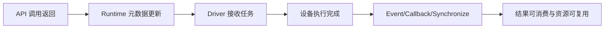
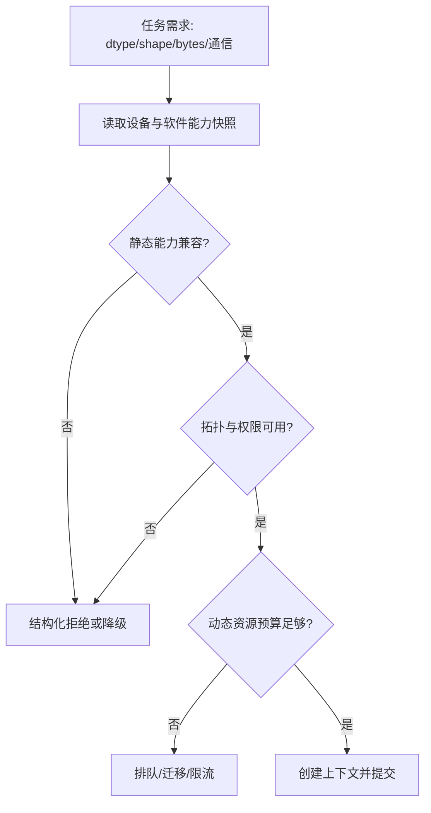
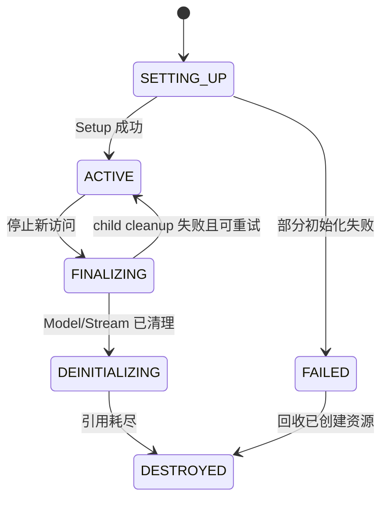
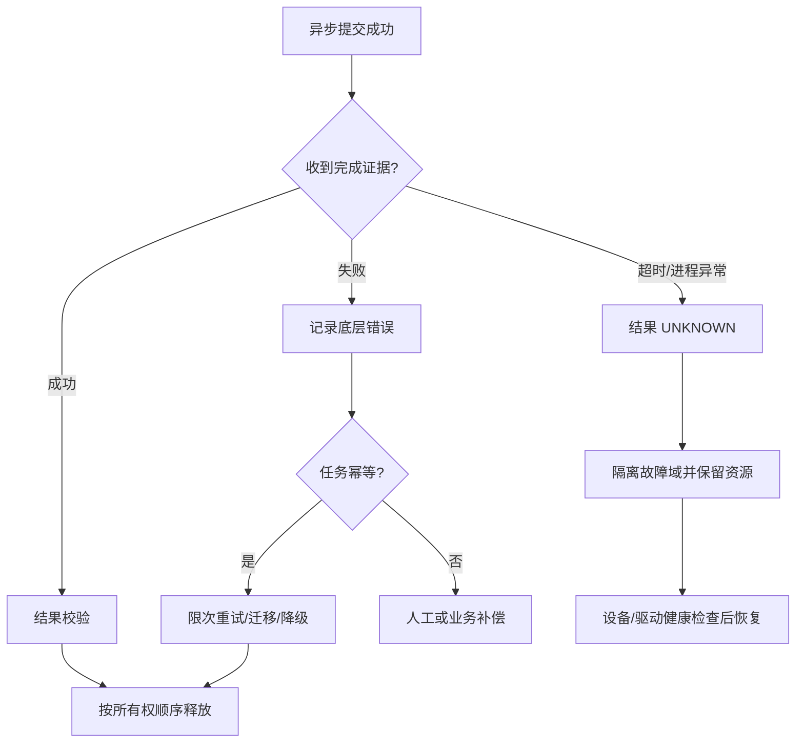
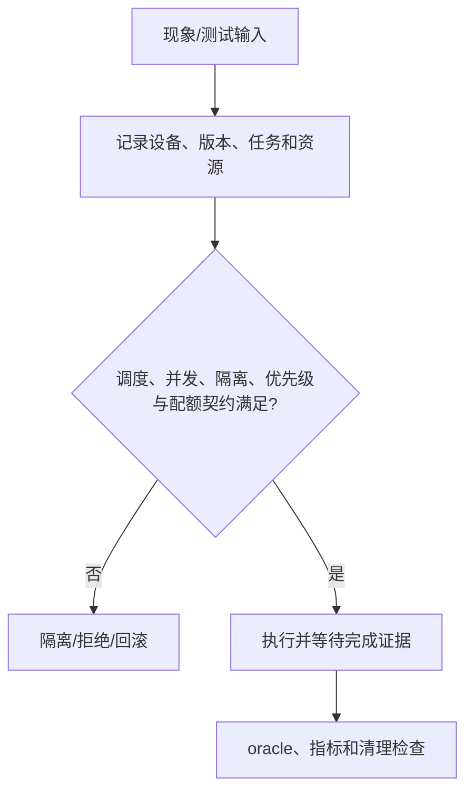
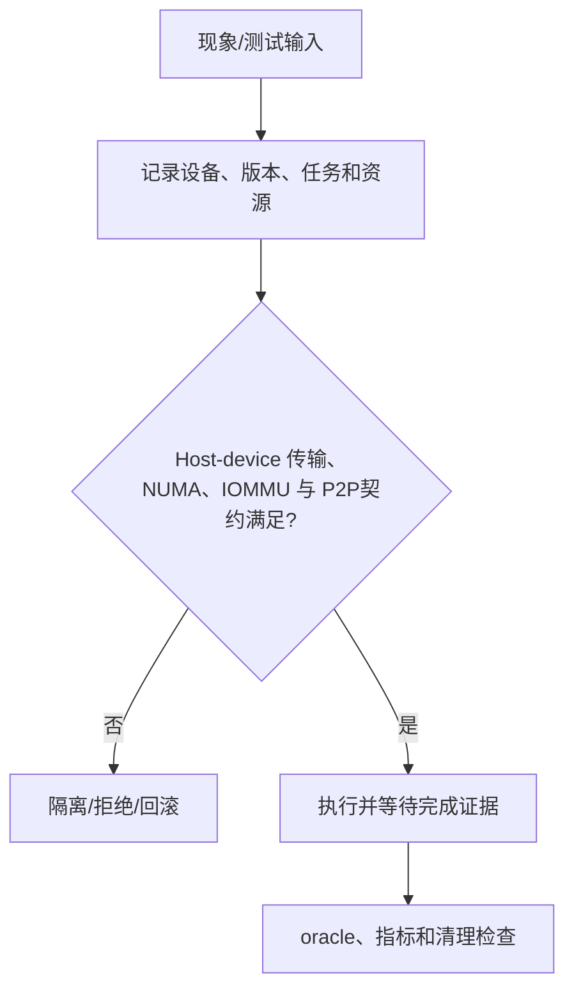
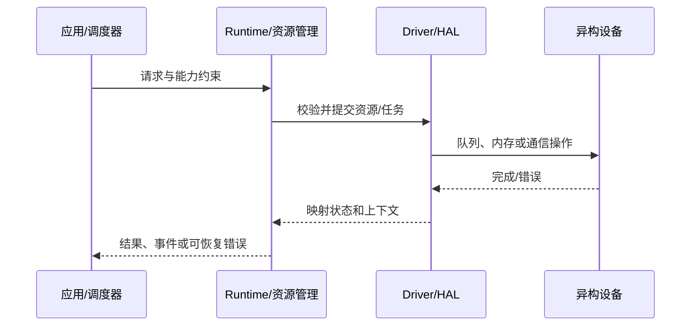
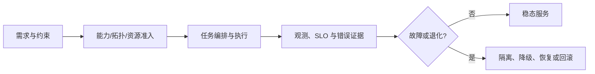

# 异构资源稳定性：入门级面试题

- 题数：100；稳定 ID：`HRS-B001`–`HRS-B100`
- 证据规则：源码/文档结论按 `[已确认]`、`[推断]` 区分；硬件、网络、多进程和性能实验按 `[待验证]` 处理。
- 单题门槛：每题包含元数据、背景、分析、答案、洞察、图示、拓展、追问、反例、实践、评分和证据。

## HRS-B001. 如何定义异构资源系统的稳定性，并区分它与“服务可用”？

- 难度：入门级
- 知识域：K01 稳定性目标、边界与故障模型
- 考察能力：概念解释、原理推导、边界辨析
- 题型：概念解释与辨析
- 面试频率：高频
- 前置知识：操作系统中的进程/线程、基本可靠性指标和资源生命周期
- 关联题目：后续 `HRS-B002`、`HRS-B003`、`HRS-B004`
- 事实状态：`[已确认]` `[推断]` `[建议]`

#### 1. 背景知识

异构资源系统同时使用 CPU、GPU、NPU、设备内存、主机内存、执行队列和互联链路。**稳定性**应描述系统在正常输入、资源紧张和局部故障下，是否仍能保持正确、可用、资源安全、可恢复和可诊断。**可用性**只是其中一项，通常回答“请求是否能在约定时间内得到成功或明确失败的结果”。

还要区分三个时刻：主机 API 返回成功、Runtime/驱动接受任务、设备真正完成任务。它们不必同时发生。[已确认] CANN 文档明确将主机 API 成功、Runtime 元数据变化、Driver 接受请求和设备任务完成视为不同时间点。[cann/docs/project-understanding/90-cross-module/memory-and-resource-lifecycle.md:24-25]

#### 2. 问题分析

先把“稳定”拆成可观察属性，而不是把“不崩溃”当定义：

1. 正确性：结果、顺序、数据可见性和资源归属正确；
2. 可用性：成功率、延迟和明确失败符合 SLO；
3. 资源安全：无泄漏、越界、重复释放、死锁和无界耗尽；
4. 可恢复性：可重试、迁移、降级或回滚，且不扩大故障；
5. 可诊断性：保留设备、Context、Stream/Queue、任务阶段和原始错误证据。

然后用反例检验：一个 API 返回成功但设备随后执行失败的请求，可能“提交可用”但“业务不可用”；一个结果正确但每次分配后泄漏的程序，短测可用但长期不稳定；一个吞吐很高但 P99 超出 SLO 的系统，也不能称为满足服务稳定性目标。

#### 3. 具体答案

面试中可以这样回答：

> 异构资源稳定性不是“进程不退出”，而是在明确的硬件、软件版本、负载和故障模型下，同时满足正确性、可用性、资源安全、可恢复性和可诊断性。可用性只关心请求是否完成，稳定性还关心结果是否正确、异步资源是否安全、局部失败能否隔离恢复，以及我们能否用证据定位问题。
>
> 例如，提交 kernel 返回成功只说明请求通过了当前层的检查或进入队列，不能证明设备已经完成；在完成事件或同步边界之前，不能提前复用输入 buffer、销毁 Stream 或释放模型。稳定性契约需要明确输入、输出、状态转移、资源所有权、完成信号和失败动作。
>
> 实际设计时，我会为每一类资源定义不变量：任务引用的内存不能在完成前释放；每个请求只能有一个终态；一个故障域内的失败不能无限阻塞其他请求；每个错误要保留最底层上下文。再用成功率、P99、OOM/设备错误率、队列深度、资源水位和恢复时间验证这些目标。

#### 4. 技术洞察

稳定性的核心是“契约 + 状态 + 证据”。可以用一个简化模型表示：

```text
稳定性 = 正确性 ∩ 可用性 ∩ 资源安全 ∩ 可恢复性 ∩ 可诊断性
```

这是交集而不是并集：只满足其中一项不能掩盖另一项失败。另一个关键不变量是：

```text
resource.reusable == true  ⇔  task completion is proven
```

`task completion is proven` 必须绑定具体完成机制，例如同步返回、Event wait、callback 已确认完成，而不能把“提交函数返回 0”当作证明。[推断] 这条不变量由 CANN 资源生命周期文档中的异步边界和同步释放规则推得，具体设备的完成语义仍需目标环境验证。

#### 5. 图文说明



- A 只代表主机调用完成；
- B 代表软件对象或状态发生变化；
- C 代表请求进入更下游的承载路径；
- D 是设备执行语义，具体时序待验证；
- E 是应用可以采用的完成证据；
- F 才是通常可以安全消费结果、复用 buffer 或释放相关资源的边界。

该图不能证明特定平台的每个 API 都有相同的同步语义，也不能给出性能或完成延迟。

#### 6. 拓展知识

可继续学习线性一致性与异步 API 的完成契约、SLO/SLA/SLI、故障域、资源配额、幂等重试、错误预算和 graceful degradation。对比“高可用”和“高可靠”：前者强调可服务时间，后者还包含正确性、持久性和恢复能力，具体定义需结合组织语境。

#### 7. 常见追问及回答要点

1. **如果 API 返回成功但业务结果错误，算稳定吗？**
   - 不能只看 API 返回值；检查设备异步错误、输入/输出 buffer、dtype/shape、结果 oracle 和错误传播。
2. **为什么不能简单地每次失败都重试？**
   - 先判断任务是否已执行、操作是否幂等、资源是否部分提交，以及重试是否会重复副作用或放大拥塞。
3. **稳定性指标应该只看平均延迟吗？**
   - 不应；至少区分成功率、P50/P95/P99、错误类型、队列等待、设备利用率和恢复时间。

#### 8. 易错点与反例

- 错误直觉：“进程没崩就是稳定。”反例：后台队列死锁，进程仍存活但请求永不完成。
- 错误直觉：“返回成功就是任务完成。”反例：异步提交后设备执行失败，错误在同步或 callback 处才出现。
- 错误直觉：“只要增加资源就能恢复。”反例：根因是错误的 Context/Stream 生命周期，增加设备只会扩大泄漏范围。

#### 9. 实践与验证

[待验证] 设计一个不依赖真实设备的状态机练习：

- 输入：任务状态 `NEW/SUBMITTED/COMPLETED/FAILED/CANCELLED`，资源状态 `HELD/REUSABLE/RELEASED`；
- 步骤：枚举提交成功、设备失败、超时、取消、重复完成五种事件；
- 预期结果：任何终态只出现一次；未确认完成时资源不能转为 `REUSABLE`；
- 判定准则（oracle）：状态转移表中的非法边全部被拒绝，资源引用计数最终归零；
- 指标：终态重复数、未释放资源数、错误上下文完整率；
- 失败判断：若 `SUBMITTED → RELEASED` 无完成证据，说明生命周期不变量被破坏。

真实 GPU/NPU 执行、异步时序和性能数据本批未运行。

#### 10. 评分标准

- 不合格：把稳定性等同于不崩溃或平均延迟，无法解释异步完成。
- 合格：能区分正确性、可用性和资源安全，并举出提交成功不等于完成的例子。
- 良好：能定义资源复用、请求终态和错误证据不变量，给出指标和验证 oracle。
- 优秀：能结合故障域、幂等性、降级、恢复时间和成本约束，说明不同 SLO 下的取舍。

**证据与来源：** `[已确认]` `cann/docs/project-understanding/90-cross-module/memory-and-resource-lifecycle.md:24-25,88-100`；`[已确认]` `cann/docs/project-understanding/00-overview/global-error-model.md:29-42`；推断和实验边界见 [00-overview/sources-and-evidence.md](../00-overview/sources-and-evidence.md)。

## HRS-B002. 如何在提交任务前完成异构设备的能力协商？

- 难度：入门级
- 知识域：K02 设备发现、拓扑、能力协商与兼容
- 考察能力：原理推导、配置分析、验证设计
- 题型：原理推导与算法分析
- 面试频率：高频
- 前置知识：设备枚举、版本号、基本数据类型和矩阵/张量 shape
- 关联题目：前置 `HRS-B001`；后续 `HRS-B003`
- 事实状态：`[已确认]` `[推断]` `[待验证]` `[建议]`

#### 1. 背景知识

设备 ID 只是索引，不是完整能力描述。能力协商应至少收集设备类型和型号、驱动/固件/Runtime 版本、支持的数据类型和算子、显存/内存容量、拓扑和 P2P/通信能力、可用队列或并发限制，以及当前资源水位。CANN 架构文档指出跨仓构建和发布存在 ABI、头文件、二进制符号及版本配套代价。[已确认] 来源：[cann/docs/project-understanding/00-overview/architecture.md:50-53]

#### 2. 问题分析

把准入问题分成四层：

1. **身份层**：设备是否存在、可访问，驱动和 Runtime 是否匹配；
2. **能力层**：任务所需 dtype、shape、算子、内存和队列能力是否支持；
3. **拓扑层**：数据需要跨卡、跨 NUMA 节点或跨节点时，链路是否可用；
4. **资源层**：此刻是否有足够内存、队列、带宽和配额。

先生成不可变的 `capability_snapshot`，再根据任务需求计算 `admission_result`。不要在任务已提交后才发现设备不支持某个 dtype；也不要把“枚举成功”当成“可运行”。

#### 3. 具体答案

建议的最小流程如下：

```python
from dataclasses import dataclass

@dataclass(frozen=True)
class Capability:
    device_id: int
    kind: str
    runtime_version: str
    supported_dtypes: frozenset[str]
    memory_bytes: int
    peer_devices: frozenset[int]
    available: bool

def admit(cap: Capability, req: dict) -> tuple[bool, list[str]]:
    reasons = []
    if not cap.available:
        reasons.append("device_unavailable")
    if req["dtype"] not in cap.supported_dtypes:
        reasons.append("dtype_unsupported")
    if req["bytes"] > cap.memory_bytes:
        reasons.append("insufficient_memory_snapshot")
    if req.get("peer") is not None and req["peer"] not in cap.peer_devices:
        reasons.append("topology_not_supported")
    return not reasons, reasons
```

生产实现还要校验版本兼容、权限、上下文创建和实时资源水位；上面代码只是能力协商的可读模型，不代表任一厂商 API 的完整实现。准入失败应返回结构化原因，并选择其他设备、排队等待、降级或明确拒绝，而不是无上下文地重试。

#### 4. 技术洞察

能力快照有时间属性，`memory_bytes` 和可用队列数会变化。因此它不是永久真相，只能作为“提交前准入检查”；提交后仍需要处理竞态：其他租户可能抢占资源、设备可能进入错误状态、拓扑链路可能失效。[推断] 稳定设计应将静态能力和动态水位分离，并在真正分配/提交处再次验证。

一个简单准入关系是：

```text
admit(task, device) = static_compatible ∧ topology_compatible ∧ dynamic_budget_available
```

任何一项为假都不能把任务标记为可运行。能力快照还应记录采集时间、版本、设备序列/逻辑标识和探测错误，便于复盘。

#### 5. 图文说明



任务需求是输入；快照提供候选约束；三个判断分别表示静态能力、拓扑/权限和动态资源。`创建上下文并提交` 仍不是完成边界，须由 K03/K05 的生命周期和同步规则继续保证。图示没有证明设备侧最终执行一定成功。

#### 6. 拓展知识

进一步可学习 capability negotiation、feature flag、设备插件、异构调度器、拓扑感知调度、版本矩阵、ABI/API 兼容、资源预留和 admission control。对于统一抽象层，必须保留厂商特有能力和“不支持”状态，不能把所有设备强行降到同一个最小接口后丢失诊断信息。

#### 7. 常见追问及回答要点

1. **能力快照刚刚显示有显存，为什么分配仍可能失败？**
   - 快照有时效性；还要考虑碎片、对齐、池/模块限制、并发竞争、权限和 Driver/HAL 失败。
2. **发现 GPU 不支持某 dtype 时应如何降级？**
   - 明确精度和正确率预算，选择转换、CPU/NPU 替代或拒绝；必须记录降级原因并验证结果 oracle。
3. **多卡调度只看显存是否够吗？**
   - 不够；还要看 P2P/互联拓扑、NUMA、通信带宽、集合通信参与者和故障域。

#### 8. 易错点与反例

- 把设备编号当能力：同一逻辑编号在不同节点可能代表不同型号或软件栈。
- 把总显存当可分配显存：碎片、对齐、缓存池和其他租户都会改变实际可用量。
- 只检查静态版本，不检查动态资源：启动时通过，稳态高峰仍可能 OOM 或排队超时。

#### 9. 实践与验证

[待验证] 使用模拟设备注册表完成表驱动测试：

- 输入：三台设备，分别缺少 dtype、缺少 peer 链路、动态预算不足；任务包含 `dtype`、`bytes`、`peer` 和版本约束；
- 步骤：生成快照，运行 `admit`，再改变动态预算并重复提交；
- 预期结果：静态不兼容始终拒绝；动态不足进入排队/降级分支；
- oracle：拒绝原因集合与预设原因完全一致，不能只返回笼统的 `unavailable`；
- 指标：准入延迟、拒绝原因分布、快照年龄、误准入率；
- 失败判断：若快照显示不支持却提交成功，或动态预算变化后结果不变，说明准入边界错误。

真实设备能力、拓扑和版本组合未运行，结果标为 `[待验证]`。

#### 10. 评分标准

- 不合格：只说“检查设备 ID 和显存”。
- 合格：能列出设备型号、版本、dtype、内存和拓扑等基本条件。
- 良好：能分离静态能力、拓扑和动态资源，设计结构化拒绝及降级路径。
- 优秀：能讨论快照竞态、版本矩阵、故障域、准入误判指标和运行时二次验证。

**证据与来源：** `[已确认]` `cann/docs/project-understanding/00-overview/architecture.md:50-53`；`[建议]/[推断]` 为本题的通用准入设计；动态设备行为需在目标环境验证。

## HRS-B003. 如何解释 Context、Stream 和设备任务的生命周期顺序？

- 难度：入门级
- 知识域：K03 Context/Device/Stream/Event/Queue 生命周期
- 考察能力：流程追踪、实现分析、资源生命周期推理
- 题型：流程/调用链/数据流追踪
- 面试频率：高频
- 前置知识：HRS-B001、线程局部状态、句柄和引用计数
- 关联题目：前置 `HRS-B002`；后续 `HRS-B004`
- 事实状态：`[已确认]` `[推断]` `[待验证]`

#### 1. 背景知识

Context 通常把线程、设备和相关资源联系起来；Stream/Queue 表达任务提交顺序或依赖；Event/Callback/Synchronize 用于观察某个完成边界。不同厂商的主 Context、显式 Context 和句柄语义可能不同，不能仅凭名称推断完全相同的行为。

CANN Runtime 文档记录：显式 Context 创建时会校验设备、保留设备引用、初始化分配器和 Stream，最后才把状态设为 `ACTIVE`；销毁时先清理模型和 Streams，再清除线程绑定，并等待引用条件满足。[已确认] 来源：[cann/docs/project-understanding/90-cross-module/memory-and-resource-lifecycle.md:38-55]

#### 2. 问题分析

生命周期题要同时跟踪对象状态和所有权：

- Context 是否已创建、绑定当前线程并处于 `ACTIVE`；
- Stream 是否属于某 Context，是否仍有 pending task；
- Event 是否已经记录，等待是否真的跨过设备完成边界；
- Model、Kernel、Memory 和 callback data 是否仍被任务引用；
- teardown 是否取得唯一执行权，失败后能否重试。

安全销毁的关键不是调用顺序“看起来合理”，而是先停止新访问，再等待/处理未完成任务，最后销毁被依赖对象。若 Stream 清理失败，不能无条件 delete Context。

#### 3. 具体答案

一个可解释的顺序是：

```text
设备发现
  -> 创建/取得 Context
  -> Context Setup 与默认 Stream
  -> 创建其他 Stream/Event/Model/Memory
  -> 在 Stream 上提交任务
  -> 通过 Event/Callback/Synchronize 证明完成
  -> 停止新提交
  -> 清理 Model、Stream、Event 和绑定
  -> 释放 Context 与设备引用
```

Context 是生命周期的上层边界，Stream 和任务依赖它；任务又可能引用 Model、Memory、Event 和 callback data。因此销毁通常是依赖图的逆拓扑序，而不是简单的创建逆序。CANN 文档给出的资源顺序是“停止新访问 → 清理 Model → flush/清理 Stream → 清除线程绑定 → 等待引用耗尽 → 移除 Registry → 删除 Context”。[已确认] 来源：[cann/docs/project-understanding/90-cross-module/memory-and-resource-lifecycle.md:46-55]

#### 4. 技术洞察

可以用状态机表达 Context：

```text
NEW -> SETTING_UP -> ACTIVE -> FINALIZING -> DEINITIALIZING -> DESTROYED
             \\-> FAILED
```

`ACTIVE` 才允许正常提交；`FINALIZING` 拒绝新访问但允许清理；`FAILED` 的局部资源必须按已成功初始化的子集回收。[推断] 采用状态机能避免把“句柄非空”误认为“对象可用”。

资源释放必须满足：

```text
destroy(context) only when pending_tasks == 0
                         and child_handles == 0
                         and owner_refs == 0
```

实际实现可能选择同步等待、异步延迟删除或返回 busy；具体策略需查目标 Runtime。CANN 文档确认某些 teardown 失败时会恢复 owner stream 以支持重试，但设备 pending task 的具体行为未在硬件上验证。

#### 5. 图文说明



状态表示 Context 的软件生命周期；箭头是合法事件或清理结果。`ACTIVE → FINALIZING` 是管理动作，不代表设备任务已经完成；`DEINITIALIZING → DESTROYED` 还需要引用和 child handle 条件。图示不证明所有 Runtime 都提供同名状态。

#### 6. 拓展知识

可继续学习 RAII、引用计数、hazard pointer、epoch reclamation、异步析构、primary context、stream-ordered allocation、对象注册表、句柄 ABA 风险和进程退出清理。高级场景还需讨论设备 reset、Context 隔离、热升级和 pending callback 的取消语义。

#### 7. 常见追问及回答要点

1. **为什么不能先销毁 Context 再销毁 Stream？**
   - Stream 属于或依赖 Context，任务和回调可能仍访问 Context；先销毁会产生悬空句柄和未定义行为。
2. **teardown 返回 busy 时怎么办？**
   - 保留对象和所有权，记录 pending task/child handle，等待明确完成或按策略重试；不要直接 free 底层句柄。
3. **线程绑定和 Context 所有权有什么关系？**
   - 线程局部 current context 只是访问路径之一，不能代替全局对象引用；销毁前需清除绑定并确认其他引用。

#### 8. 易错点与反例

- 把 Context 当成整数 device ID：Context 还承载分配器、Stream 和线程/设备关系。
- 看到指针非空就调用 destroy：对象可能处于 `FINALIZING`、`FAILED` 或已有 child handle。
- 用 sleep 代替完成确认：固定等待不能证明长任务、异常任务或不同负载下已经完成。

#### 9. 实践与验证

[待验证] 用纯软件模型验证依赖图：

- 输入：Context、两个 Stream、一个 Event、一个 Model 和两块被任务引用的 Memory；
- 步骤：提交跨 Stream 任务，分别尝试提前销毁 Model、Stream、Context；再注入 Stream cleanup 失败；
- 预期结果：有 pending task 或 child handle 时拒绝销毁；清理失败后 Context 保留在可重试状态；
- oracle：所有非法顺序返回明确状态错误，成功路径无悬挂引用；
- 指标：pending task 数、child handle 数、teardown 重试次数、最终泄漏数；
- 失败判断：若 Context 已销毁但 Stream 仍可提交，或失败清理后句柄既不可用又无法回收，说明状态机不完整。

真实 CANN/GPU/NPU teardown 语义、设备 reset 和 busy 返回值未运行验证。

#### 10. 评分标准

- 不合格：只会说“创建 Context、创建 Stream、最后释放”。
- 合格：能解释 Context、Stream、Event 的角色和基本逆序清理。
- 良好：能画状态机，说明 pending task、引用和 teardown 失败后的重试。
- 优秀：能从依赖图、不变量、异步析构、故障域和版本差异分析销毁策略及验证方法。

**证据与来源：** `[已确认]` `cann/docs/project-understanding/90-cross-module/memory-and-resource-lifecycle.md:38-55`；`[推断]` 状态机和不变量；设备 pending task 的具体行为为 `[待验证]`。

## HRS-B004. 如何用状态机和伪代码处理异步任务提交后的设备或进程异常？

- 难度：入门级
- 知识域：K03 Context/Stream/Event/Queue 生命周期（关联 K09 错误、恢复与故障注入）
- 考察能力：实现分析、故障排查、资源生命周期分析
- 题型：代码、伪代码或配置分析
- 面试频率：高频
- 前置知识：HRS-B003、错误码、日志和最小复现
- 关联题目：前置 `HRS-B003`；后续 `HRS-B005`
- 事实状态：`[已确认]` `[推断]` `[待验证]` `[建议]`

#### 1. 背景知识

异步路径中，提交函数返回成功只说明当前调用阶段没有立即拒绝。错误可能在 Driver、设备执行、Event wait、callback 或后续同步时才暴露。CANN 错误模型要求保留底层错误码、设备 ID、Context/Stream、模型/Graph 标识和调用阶段，不能只记录顶层 `ACL_ERROR`。[已确认] 来源：[cann/docs/project-understanding/00-overview/global-error-model.md:29-42]

进程异常还会使 Runtime 元数据、Driver 句柄、设备任务和主机记录处于不同状态。重启服务不等于资源一定被清理，必须依据设备和驱动的清理契约验证。

#### 2. 问题分析

按排障顺序处理，而不是先重启：

1. 保护系统：限流、停止新提交、标记受影响故障域，避免继续扩大损害；
2. 固定证据：版本、设备、进程、线程、Context、Stream、任务 ID、时间戳和原始错误；
3. 找第一个失败边界：提交前参数、Driver 接收、设备执行、同步/回调、结果校验或清理；
4. 建立最小复现和单卡/单任务对照组；
5. 判断任务是否执行、是否可重试、资源是否仍被引用；
6. 按所有权顺序清理，并验证资源水位和后续新任务。

这种顺序符合 CANN 调试建议：固定版本/SoC/工具链，记录 API 阶段和上下文，找到第一个失败边界，再沿 ACL → Runtime → HAL → SDK/kernel 反查。[已确认] 来源：[cann/docs/project-understanding/99-roadmap/debugging-guide.md:13-30]

#### 3. 具体答案

我会先将请求标为 `UNKNOWN`，而不是直接判定成功或失败：

```text
提交返回成功
  -> 等待完成证据
       -> 完成成功：校验结果，释放资源
       -> 完成失败：保留原始错误，按幂等性决定重试/降级
       -> 超时：隔离故障域，停止新提交，采集诊断
       -> 进程异常：执行恢复流程，验证设备/驱动状态后再接纳流量
```

临时措施是保护用户和资源，例如暂停受影响设备、限制重试次数、把请求路由到健康设备或返回明确的可重试错误。永久修复要补上状态机、错误上下文、超时和取消语义、清理验证以及回归测试。

清理时保守处理：在未证明任务完成前，不复用其 Memory、Model、Stream 和 callback data；优先使用目标 Runtime 提供的同步、事件等待或设备恢复 API；若设备处于错误状态，按照运维手册隔离或 reset，并记录 reset 的故障域影响。[建议] 具体 reset 是否安全、是否释放所有 backing，需要目标硬件验证。

#### 4. 技术洞察

核心是区分三态结果：`SUCCESS`、`FAILURE`、`UNKNOWN`。超时或进程崩溃后，不能把 `UNKNOWN` 直接转换成 `FAILURE` 并重试，因为任务可能已经产生外部副作用；也不能直接转换成 `SUCCESS` 并释放资源。

故障排查证据表可写为：

| 现象 | 假设 | 证据 | 动作 |
|---|---|---|---|
| 提交成功后无回调 | Driver/设备卡住或 callback 丢失 | 队列深度、设备状态、日志、超时栈 | 隔离并停止新提交 |
| 同步返回设备错误 | 任务执行失败 | 原始 Driver/HAL 错误、任务 ID | 按幂等性决定恢复 |
| 重启后仍不可分配 | 设备/驱动残留或资源未回收 | 设备重置日志、资源水位 | 扩大隔离并人工确认 |

#### 5. 图文说明



“完成证据”可以是同步、Event 或已确认 callback；“结果校验”是业务 oracle，不是单纯 API 返回值；“保留资源”表示先保护可能仍被设备引用的对象。图示没有承诺重启或 reset 必然清理设备资源。

#### 6. 拓展知识

可继续学习两阶段提交式思路、幂等键、事务性 outbox、熔断器、bulkhead 隔离、指数退避、设备 watchdog、故障注入、core dump、分布式 tracing 和 postmortem。跨节点集合通信还要处理参与者不一致和集体调用死锁，属于 K08/K09 的高级内容。

#### 7. 常见追问及回答要点

1. **超时后能否立即释放 buffer？**
   - 不能默认释放；先确认设备完成/取消语义，或把设备和相关资源隔离到可证明安全的恢复边界。
2. **什么情况下可以重试？**
   - 明确任务幂等、未产生不可逆副作用、原资源状态可控，并设置次数、退避和熔断。
3. **只记录最终错误码够吗？**
   - 不够；要记录原始错误、层级映射、设备/Context/Stream、阶段、任务 ID、版本和时间线。

#### 8. 易错点与反例

- 直接重启：可能丢失证据，且设备任务或驱动资源仍处于未知状态。
- 无限重试：会增加队列拥塞、重复副作用和跨设备级联故障。
- 只看顶层错误：`ACL_ERROR` 可能掩盖 Runtime、HAL 或 Driver 的第一个失败边界。
- 把超时当作任务未执行：异步系统中超时只说明在观察窗口内没有完成证据。

#### 9. 实践与验证

[待验证] 构造纯软件故障注入测试：

- 输入：异步任务状态机和故障点 `submit/driver/device/wait/callback/cleanup`；
- 步骤：在每个故障点注入错误、延迟、重复 callback、进程崩溃标记；执行限流、隔离和清理流程；
- 预期结果：每个请求只有一个终态；未知结果不会未经判定进入成功或可重试分支；资源引用不会在完成证据前归零；
- oracle：状态转移合法、原始错误上下文完整、清理操作幂等；
- 指标：检测时间、隔离时间、恢复时间、重复副作用数、泄漏数、重试放大倍数；
- 失败判断：出现无终态请求、重复终态、错误上下文缺字段或未知状态下提前释放，测试失败。

真实设备异常、驱动 reset、callback 丢失和多进程恢复未执行，均为 `[待验证]`。

#### 10. 评分标准

- 不合格：建议直接重启或无限重试，无法区分提交和完成。
- 合格：能按现象、日志、设备和同步边界排查，并说明暂不释放资源。
- 良好：能建立 `SUCCESS/FAILURE/UNKNOWN` 状态，讨论幂等、限次重试和故障隔离。
- 优秀：能设计跨层证据链、故障注入、恢复/回滚、SLO 影响和防复发治理。

**证据与来源：** `[已确认]` `cann/docs/project-understanding/00-overview/global-error-model.md:13-42`；`[建议/已确认: 文档化流程建议]` `cann/docs/project-understanding/99-roadmap/debugging-guide.md:13-30`；`[已确认]` `cann/docs/project-understanding/90-cross-module/memory-and-resource-lifecycle.md:88-100`；硬件恢复语义为 `[待验证]`。

## HRS-B005. 异步提交、完成语义与内存可见性：两种常见方案的适用边界是什么？

- 难度：入门级
- 知识域：K05 异步提交、完成语义与内存可见性
- 考察能力：对比决策
- 题型：对比与取舍
- 面试频率：高频
- 前置知识：HRS-B004
- 关联题目：前置 `HRS-B004`；后续 `HRS-B006`
- 事实状态：`[推断]` `[待验证]` `[建议]`

#### 1. 背景知识

提交、设备消费、事件完成、主机可见和资源可复用是不同完成边界。 本题属于入门级，目标是建立概念、基本机制和最小可验证模型。异构平台同名对象不必拥有相同语义；涉及 CANN 时，GE、Runtime 和 Driver 的职责边界应以目标版本资料为准。用 sleep 或 API 返回值代替事件/同步完成证明。

#### 2. 问题分析

先列约束和指标，再比较至少两种方案的适用边界与二阶代价。 先固定输入、输出、状态、资源所有权、执行上下文、版本和故障模型；再检查正常、异常和边界路径。不要把静态文档能够证明的事实、跨文档推断和必须通过运行验证的行为混在一起。

#### 3. 具体答案

结论是：提交、设备消费、事件完成、主机可见和资源可复用是不同完成边界。 面试回答不能停留在 API 名称；应先固定设备、版本、负载和完成边界，再说明对象如何协作。对最小实现，至少维护任务状态、资源所有权和明确的失败结果。用 sleep 或 API 返回值代替事件/同步完成证明。

#### 4. 技术洞察

关键不变量是：任务仍可能引用的资源不能提前释放；每个请求只能有一个终态；底层原始错误不能被顶层映射吞掉；恢复动作不能突破故障域。可以用以下抽象检查问题：

```text
admit = static_capability ∧ topology_ok ∧ dynamic_budget
reuse = completion_proven ∧ refs == 0 ∧ owner_released
recover = failure_classified ∧ action_idempotent ∧ blast_radius_bounded
```

这些是用于推理和测试的模型，不是所有厂商 Runtime 的 API 契约。特定设备完成语义、错误码、带宽和容量需要目标环境核实。

#### 5. 图文说明

| 维度 | 方案一 | 方案二 | 判断依据 |
|---|---|---|---|
| 延迟 | 取决于等待和路径 | 取决于搬迁/重试 | P99 与队列 |
| 资源 | 占用可预测性 | 峰值和碎片 | 水位与容量 |
| 故障 | 隔离粒度 | 恢复复杂度 | 故障域与幂等 |
| 成本 | 开发/运维成本 | 硬件/通信成本 | 总拥有成本 |

图中节点分别表示任务需求、资源/Runtime 控制面、Driver/HAL、设备和观测/恢复边界；箭头表示调用、数据传递或状态转移，具体含义取决于题型。图示强调控制流与资源生命周期，不能单独证明设备行为或性能收益。

#### 6. 拓展知识

可拓展到：异步提交、完成语义与内存可见性 的厂商实现差异、设备 reset、容器/虚拟化、跨进程边界、SLO/错误预算和长期演进。相关证据入口为 `cann/docs/project-understanding/90-cross-module/memory-and-resource-lifecycle.md:88-100`；若源码、版本或硬件条件不同，应重新核实。

#### 7. 常见追问及回答要点

1. 如果资源水位或设备状态在检查后立即变化，如何避免误准入？回答需提到快照时效、提交处二次校验、预留/配额和结构化拒绝。
2. 如果任务已提交但完成证据丢失，能否重试？回答需区分 `SUCCESS/FAILURE/UNKNOWN`、幂等性、外部副作用、资源隔离和限次退避。
3. 如果面试官要求跨厂商迁移，哪些结论不能直接复用？回答需指出 API/ABI、Context/Stream/Event、内存可见性、错误码和拓扑语义必须重新验证。

#### 8. 易错点与反例

- 把“用 sleep 或 API 返回值代替事件/同步完成证明。”当作稳定性结论；
- 只给最佳实践，不写适用条件、反例和失败后的动作；
- 只看平均延迟或顶层错误，忽略尾延迟、原始错误、资源水位和时间线；
- 把未运行的硬件/网络/压测结果写成已验证；
- 忽略取消、超时、进程崩溃、重复回调和清理幂等性。

#### 9. 实践与验证

[待验证] 设计一个围绕“异步提交、完成语义与内存可见性”的最小练习：

- 输入：两种设备能力/资源状态，任务包含必要的 shape、dtype、大小、超时和故障注入字段；
- 步骤：先生成带版本和时间戳的快照，执行准入/提交，注入一次边界或异步失败，再执行完成确认和清理；
- 预期结果：合法路径只有一个终态，资源在完成证据前不可复用，失败路径保留原始错误和上下文；
- 判定准则（oracle）：状态转移符合不变量，资源引用最终归零，结构化错误原因与注入点一致；
- 观测指标：成功率、P99、队列等待、资源峰值、错误类型、重试/回滚次数和泄漏数；
- 失败判断：出现提前释放、重复终态、无界重试、错误上下文缺失或跨故障域扩散即判失败。

真实设备、驱动、固件、网络、RDMA、多进程和性能结论当前未执行，均保持 `[待验证]`。

#### 10. 评分标准

- 不合格：只复述术语或给出“加资源、重试、加强监控”等无条件建议。
- 合格：能说明核心对象、正常流程、一个边界和基本验证方法。
- 良好：能给出状态/不变量、证据字段、异常处理、oracle 和方案取舍。
- 优秀：能在明确假设下做定量或故障域分析，比较替代路线，设计恢复/回滚、观测和长期演进，并主动标识 `[待验证]` 内容。

**证据与来源：** `cann/docs/project-understanding/90-cross-module/memory-and-resource-lifecycle.md:88-100`；本题通用机制中由证据推得的部分标为 `[推断]`，建议性设计标为 `[建议]`，硬件/网络/性能行为标为 `[待验证]`。

## HRS-B006. 调度、并发、隔离、优先级与配额：如何设计正常、异常和边界用例？

- 难度：入门级
- 知识域：K06 调度、并发、隔离、优先级与配额
- 考察能力：测试验证
- 题型：测试、实验与验证设计
- 面试频率：中频
- 前置知识：HRS-B005
- 关联题目：前置 `HRS-B005`；后续 `HRS-B007`
- 事实状态：`[已确认]` `[待验证]` `[建议]`

#### 1. 背景知识

共享异构设备需要处理队列、公平性、优先级、租户配额、背压和故障隔离。 本题属于入门级，目标是建立概念、基本机制和最小可验证模型。异构平台同名对象不必拥有相同语义；涉及 CANN 时，GE、Runtime 和 Driver 的职责边界应以目标版本资料为准。只追求平均利用率，忽略尾延迟、饥饿、优先级反转和 noisy neighbor。

#### 2. 问题分析

先定义控制变量、oracle、指标和环境，再安排正常、异常、边界用例。 先固定输入、输出、状态、资源所有权、执行上下文、版本和故障模型；再检查正常、异常和边界路径。不要把静态文档能够证明的事实、跨文档推断和必须通过运行验证的行为混在一起。

#### 3. 具体答案

结论是：共享异构设备需要处理队列、公平性、优先级、租户配额、背压和故障隔离。 面试回答不能停留在 API 名称；应先固定设备、版本、负载和完成边界，再说明对象如何协作。对最小实现，至少维护任务状态、资源所有权和明确的失败结果。只追求平均利用率，忽略尾延迟、饥饿、优先级反转和 noisy neighbor。

#### 4. 技术洞察

关键不变量是：任务仍可能引用的资源不能提前释放；每个请求只能有一个终态；底层原始错误不能被顶层映射吞掉；恢复动作不能突破故障域。可以用以下抽象检查问题：

```text
admit = static_capability ∧ topology_ok ∧ dynamic_budget
reuse = completion_proven ∧ refs == 0 ∧ owner_released
recover = failure_classified ∧ action_idempotent ∧ blast_radius_bounded
```

这些是用于推理和测试的模型，不是所有厂商 Runtime 的 API 契约。特定设备完成语义、错误码、带宽和容量需要目标环境核实。

#### 5. 图文说明



图中节点分别表示任务需求、资源/Runtime 控制面、Driver/HAL、设备和观测/恢复边界；箭头表示调用、数据传递或状态转移，具体含义取决于题型。图示强调控制流与资源生命周期，不能单独证明设备行为或性能收益。

#### 6. 拓展知识

可拓展到：调度、并发、隔离、优先级与配额 的厂商实现差异、设备 reset、容器/虚拟化、跨进程边界、SLO/错误预算和长期演进。相关证据入口为 `cann/docs/project-understanding/90-cross-module/performance-critical-paths.md:24-43`；若源码、版本或硬件条件不同，应重新核实。

#### 7. 常见追问及回答要点

1. 如果资源水位或设备状态在检查后立即变化，如何避免误准入？回答需提到快照时效、提交处二次校验、预留/配额和结构化拒绝。
2. 如果任务已提交但完成证据丢失，能否重试？回答需区分 `SUCCESS/FAILURE/UNKNOWN`、幂等性、外部副作用、资源隔离和限次退避。
3. 如果面试官要求跨厂商迁移，哪些结论不能直接复用？回答需指出 API/ABI、Context/Stream/Event、内存可见性、错误码和拓扑语义必须重新验证。

#### 8. 易错点与反例

- 把“只追求平均利用率，忽略尾延迟、饥饿、优先级反转和 noisy neighbor。”当作稳定性结论；
- 只给最佳实践，不写适用条件、反例和失败后的动作；
- 只看平均延迟或顶层错误，忽略尾延迟、原始错误、资源水位和时间线；
- 把未运行的硬件/网络/压测结果写成已验证；
- 忽略取消、超时、进程崩溃、重复回调和清理幂等性。

#### 9. 实践与验证

[待验证] 设计一个围绕“调度、并发、隔离、优先级与配额”的最小练习：

- 输入：两种设备能力/资源状态，任务包含必要的 shape、dtype、大小、超时和故障注入字段；
- 步骤：先生成带版本和时间戳的快照，执行准入/提交，注入一次边界或异步失败，再执行完成确认和清理；
- 预期结果：合法路径只有一个终态，资源在完成证据前不可复用，失败路径保留原始错误和上下文；
- 判定准则（oracle）：状态转移符合不变量，资源引用最终归零，结构化错误原因与注入点一致；
- 观测指标：成功率、P99、队列等待、资源峰值、错误类型、重试/回滚次数和泄漏数；
- 失败判断：出现提前释放、重复终态、无界重试、错误上下文缺失或跨故障域扩散即判失败。

真实设备、驱动、固件、网络、RDMA、多进程和性能结论当前未执行，均保持 `[待验证]`。

#### 10. 评分标准

- 不合格：只复述术语或给出“加资源、重试、加强监控”等无条件建议。
- 合格：能说明核心对象、正常流程、一个边界和基本验证方法。
- 良好：能给出状态/不变量、证据字段、异常处理、oracle 和方案取舍。
- 优秀：能在明确假设下做定量或故障域分析，比较替代路线，设计恢复/回滚、观测和长期演进，并主动标识 `[待验证]` 内容。

**证据与来源：** `cann/docs/project-understanding/90-cross-module/performance-critical-paths.md:24-43`；本题通用机制中由证据推得的部分标为 `[推断]`，建议性设计标为 `[建议]`，硬件/网络/性能行为标为 `[待验证]`。

## HRS-B007. Host-device 传输、NUMA、IOMMU 与 P2P：现象和影响如何分层？

- 难度：入门级
- 知识域：K07 Host-device 传输、NUMA、IOMMU 与 P2P
- 考察能力：故障排查
- 题型：故障排查与事故复盘
- 面试频率：高频
- 前置知识：HRS-B006
- 关联题目：前置 `HRS-B006`；后续 `HRS-B008`
- 事实状态：`[已确认]` `[待验证]` `[建议]`

#### 1. 背景知识

传输路径受内存位置、pin/map、DMA、NUMA、IOMMU、PCIe 和 P2P 能力共同约束。 本题属于入门级，目标是建立概念、基本机制和最小可验证模型。异构平台同名对象不必拥有相同语义；涉及 CANN 时，GE、Runtime 和 Driver 的职责边界应以目标版本资料为准。把能访问指针当作高效 DMA，把设备可见当作传输已完成。

#### 2. 问题分析

按现象、保护、假设、证据、排除、缓解、修复和复盘顺序处理。 先固定输入、输出、状态、资源所有权、执行上下文、版本和故障模型；再检查正常、异常和边界路径。不要把静态文档能够证明的事实、跨文档推断和必须通过运行验证的行为混在一起。

#### 3. 具体答案

结论是：传输路径受内存位置、pin/map、DMA、NUMA、IOMMU、PCIe 和 P2P 能力共同约束。 面试回答不能停留在 API 名称；应先固定设备、版本、负载和完成边界，再说明对象如何协作。对最小实现，至少维护任务状态、资源所有权和明确的失败结果。把能访问指针当作高效 DMA，把设备可见当作传输已完成。

临时措施是先停止扩大影响、隔离故障域和保留证据；永久修复要补回归测试、监控和恢复演练。超时后的结果可能是 `UNKNOWN`，不能未经幂等性判断直接重试。

#### 4. 技术洞察

关键不变量是：任务仍可能引用的资源不能提前释放；每个请求只能有一个终态；底层原始错误不能被顶层映射吞掉；恢复动作不能突破故障域。可以用以下抽象检查问题：

```text
admit = static_capability ∧ topology_ok ∧ dynamic_budget
reuse = completion_proven ∧ refs == 0 ∧ owner_released
recover = failure_classified ∧ action_idempotent ∧ blast_radius_bounded
```

这些是用于推理和测试的模型，不是所有厂商 Runtime 的 API 契约。特定设备完成语义、错误码、带宽和容量需要目标环境核实。

#### 5. 图文说明



图中节点分别表示任务需求、资源/Runtime 控制面、Driver/HAL、设备和观测/恢复边界；箭头表示调用、数据传递或状态转移，具体含义取决于题型。图示强调控制流与资源生命周期，不能单独证明设备行为或性能收益。

#### 6. 拓展知识

可拓展到：Host-device 传输、NUMA、IOMMU 与 P2P 的厂商实现差异、设备 reset、容器/虚拟化、跨进程边界、SLO/错误预算和长期演进。相关证据入口为 `cann/docs/project-understanding/90-cross-module/performance-critical-paths.md:24-30`；若源码、版本或硬件条件不同，应重新核实。

#### 7. 常见追问及回答要点

1. 如果资源水位或设备状态在检查后立即变化，如何避免误准入？回答需提到快照时效、提交处二次校验、预留/配额和结构化拒绝。
2. 如果任务已提交但完成证据丢失，能否重试？回答需区分 `SUCCESS/FAILURE/UNKNOWN`、幂等性、外部副作用、资源隔离和限次退避。
3. 如果面试官要求跨厂商迁移，哪些结论不能直接复用？回答需指出 API/ABI、Context/Stream/Event、内存可见性、错误码和拓扑语义必须重新验证。

#### 8. 易错点与反例

- 把“把能访问指针当作高效 DMA，把设备可见当作传输已完成。”当作稳定性结论；
- 只给最佳实践，不写适用条件、反例和失败后的动作；
- 只看平均延迟或顶层错误，忽略尾延迟、原始错误、资源水位和时间线；
- 把未运行的硬件/网络/压测结果写成已验证；
- 忽略取消、超时、进程崩溃、重复回调和清理幂等性。

#### 9. 实践与验证

[待验证] 设计一个围绕“Host-device 传输、NUMA、IOMMU 与 P2P”的最小练习：

- 输入：两种设备能力/资源状态，任务包含必要的 shape、dtype、大小、超时和故障注入字段；
- 步骤：先生成带版本和时间戳的快照，执行准入/提交，注入一次边界或异步失败，再执行完成确认和清理；
- 预期结果：合法路径只有一个终态，资源在完成证据前不可复用，失败路径保留原始错误和上下文；
- 判定准则（oracle）：状态转移符合不变量，资源引用最终归零，结构化错误原因与注入点一致；
- 观测指标：成功率、P99、队列等待、资源峰值、错误类型、重试/回滚次数和泄漏数；
- 失败判断：出现提前释放、重复终态、无界重试、错误上下文缺失或跨故障域扩散即判失败。

真实设备、驱动、固件、网络、RDMA、多进程和性能结论当前未执行，均保持 `[待验证]`。

#### 10. 评分标准

- 不合格：只复述术语或给出“加资源、重试、加强监控”等无条件建议。
- 合格：能说明核心对象、正常流程、一个边界和基本验证方法。
- 良好：能给出状态/不变量、证据字段、异常处理、oracle 和方案取舍。
- 优秀：能在明确假设下做定量或故障域分析，比较替代路线，设计恢复/回滚、观测和长期演进，并主动标识 `[待验证]` 内容。

**证据与来源：** `cann/docs/project-understanding/90-cross-module/performance-critical-paths.md:24-30`；本题通用机制中由证据推得的部分标为 `[推断]`，建议性设计标为 `[建议]`，硬件/网络/性能行为标为 `[待验证]`。

## HRS-B008. 跨卡/跨节点通信、集合通信与 RDMA：如何定义吞吐、P99、利用率和成本口径？

- 难度：入门级
- 知识域：K08 跨卡/跨节点通信、集合通信与 RDMA
- 考察能力：性能分析
- 题型：性能、容量与成本分析
- 面试频率：高频
- 前置知识：HRS-B007
- 关联题目：前置 `HRS-B007`；后续 `HRS-B009`
- 事实状态：`[已确认]` `[待验证]` `[建议]`

#### 1. 背景知识

集体通信要求参与者、顺序、拓扑、缓冲区和完成协议一致；局部失败可能导致全局阻塞。 本题属于入门级，目标是建立概念、基本机制和最小可验证模型。异构平台同名对象不必拥有相同语义；涉及 CANN 时，GE、Runtime 和 Driver 的职责边界应以目标版本资料为准。只在单卡测试通信，或对 collective 超时无限重试。

#### 2. 问题分析

先统一指标口径并做数量级估算，再定位瓶颈和优化副作用。 先固定输入、输出、状态、资源所有权、执行上下文、版本和故障模型；再检查正常、异常和边界路径。不要把静态文档能够证明的事实、跨文档推断和必须通过运行验证的行为混在一起。

#### 3. 具体答案

结论是：集体通信要求参与者、顺序、拓扑、缓冲区和完成协议一致；局部失败可能导致全局阻塞。 面试回答不能停留在 API 名称；应先固定设备、版本、负载和完成边界，再说明对象如何协作。对最小实现，至少维护任务状态、资源所有权和明确的失败结果。只在单卡测试通信，或对 collective 超时无限重试。

至少报告吞吐、P50/P95/P99、队列等待、设备利用率、内存峰值、错误率和单位请求成本；没有实际运行记录的数字必须写为 `[待验证]`。

#### 4. 技术洞察

关键不变量是：任务仍可能引用的资源不能提前释放；每个请求只能有一个终态；底层原始错误不能被顶层映射吞掉；恢复动作不能突破故障域。可以用以下抽象检查问题：

```text
admit = static_capability ∧ topology_ok ∧ dynamic_budget
reuse = completion_proven ∧ refs == 0 ∧ owner_released
recover = failure_classified ∧ action_idempotent ∧ blast_radius_bounded
```

这些是用于推理和测试的模型，不是所有厂商 Runtime 的 API 契约。特定设备完成语义、错误码、带宽和容量需要目标环境核实。

#### 5. 图文说明



图中节点分别表示任务需求、资源/Runtime 控制面、Driver/HAL、设备和观测/恢复边界；箭头表示调用、数据传递或状态转移，具体含义取决于题型。图示强调控制流与资源生命周期，不能单独证明设备行为或性能收益。

#### 6. 拓展知识

可拓展到：跨卡/跨节点通信、集合通信与 RDMA 的厂商实现差异、设备 reset、容器/虚拟化、跨进程边界、SLO/错误预算和长期演进。相关证据入口为 `cann/docs/project-understanding/90-cross-module/error-boundaries.md:40-48`；若源码、版本或硬件条件不同，应重新核实。

#### 7. 常见追问及回答要点

1. 如果资源水位或设备状态在检查后立即变化，如何避免误准入？回答需提到快照时效、提交处二次校验、预留/配额和结构化拒绝。
2. 如果任务已提交但完成证据丢失，能否重试？回答需区分 `SUCCESS/FAILURE/UNKNOWN`、幂等性、外部副作用、资源隔离和限次退避。
3. 如果面试官要求跨厂商迁移，哪些结论不能直接复用？回答需指出 API/ABI、Context/Stream/Event、内存可见性、错误码和拓扑语义必须重新验证。

#### 8. 易错点与反例

- 把“只在单卡测试通信，或对 collective 超时无限重试。”当作稳定性结论；
- 只给最佳实践，不写适用条件、反例和失败后的动作；
- 只看平均延迟或顶层错误，忽略尾延迟、原始错误、资源水位和时间线；
- 把未运行的硬件/网络/压测结果写成已验证；
- 忽略取消、超时、进程崩溃、重复回调和清理幂等性。

#### 9. 实践与验证

[待验证] 设计一个围绕“跨卡/跨节点通信、集合通信与 RDMA”的最小练习：

- 输入：两种设备能力/资源状态，任务包含必要的 shape、dtype、大小、超时和故障注入字段；
- 步骤：先生成带版本和时间戳的快照，执行准入/提交，注入一次边界或异步失败，再执行完成确认和清理；
- 预期结果：合法路径只有一个终态，资源在完成证据前不可复用，失败路径保留原始错误和上下文；
- 判定准则（oracle）：状态转移符合不变量，资源引用最终归零，结构化错误原因与注入点一致；
- 观测指标：成功率、P99、队列等待、资源峰值、错误类型、重试/回滚次数和泄漏数；
- 失败判断：出现提前释放、重复终态、无界重试、错误上下文缺失或跨故障域扩散即判失败。

真实设备、驱动、固件、网络、RDMA、多进程和性能结论当前未执行，均保持 `[待验证]`。

#### 10. 评分标准

- 不合格：只复述术语或给出“加资源、重试、加强监控”等无条件建议。
- 合格：能说明核心对象、正常流程、一个边界和基本验证方法。
- 良好：能给出状态/不变量、证据字段、异常处理、oracle 和方案取舍。
- 优秀：能在明确假设下做定量或故障域分析，比较替代路线，设计恢复/回滚、观测和长期演进，并主动标识 `[待验证]` 内容。

**证据与来源：** `cann/docs/project-understanding/90-cross-module/error-boundaries.md:40-48`；本题通用机制中由证据推得的部分标为 `[推断]`，建议性设计标为 `[建议]`，硬件/网络/性能行为标为 `[待验证]`。

## HRS-B009. 错误传播、超时、取消、恢复与故障注入：请先澄清需求和约束再给最小方案？

- 难度：入门级
- 知识域：K09 错误传播、超时、取消、恢复与故障注入
- 考察能力：系统设计
- 题型：系统设计与工程落地
- 面试频率：中频
- 前置知识：HRS-B008
- 关联题目：前置 `HRS-B008`；后续 `HRS-B010`
- 事实状态：`[推断]` `[待验证]` `[建议]`

#### 1. 背景知识

错误要跨 Driver/HAL/Runtime/ACL/GE 保留上下文，并以状态机区分失败、成功和未知。 本题属于入门级，目标是建立概念、基本机制和最小可验证模型。异构平台同名对象不必拥有相同语义；涉及 CANN 时，GE、Runtime 和 Driver 的职责边界应以目标版本资料为准。丢弃原始错误码、无限重试或未经幂等性判断执行补偿。

#### 2. 问题分析

先澄清需求与故障模型，再给最小架构、接口、状态、运维和回滚。 先固定输入、输出、状态、资源所有权、执行上下文、版本和故障模型；再检查正常、异常和边界路径。不要把静态文档能够证明的事实、跨文档推断和必须通过运行验证的行为混在一起。

#### 3. 具体答案

结论是：错误要跨 Driver/HAL/Runtime/ACL/GE 保留上下文，并以状态机区分失败、成功和未知。 面试回答不能停留在 API 名称；应先固定设备、版本、负载和完成边界，再说明对象如何协作。对最小实现，至少维护任务状态、资源所有权和明确的失败结果。丢弃原始错误码、无限重试或未经幂等性判断执行补偿。

接口应返回结构化状态和诊断上下文；资源层应提供配额、取消、回收和健康检查；发布必须有灰度、回滚和兼容矩阵。

#### 4. 技术洞察

关键不变量是：任务仍可能引用的资源不能提前释放；每个请求只能有一个终态；底层原始错误不能被顶层映射吞掉；恢复动作不能突破故障域。可以用以下抽象检查问题：

```text
admit = static_capability ∧ topology_ok ∧ dynamic_budget
reuse = completion_proven ∧ refs == 0 ∧ owner_released
recover = failure_classified ∧ action_idempotent ∧ blast_radius_bounded
```

这些是用于推理和测试的模型，不是所有厂商 Runtime 的 API 契约。特定设备完成语义、错误码、带宽和容量需要目标环境核实。

#### 5. 图文说明



图中节点分别表示任务需求、资源/Runtime 控制面、Driver/HAL、设备和观测/恢复边界；箭头表示调用、数据传递或状态转移，具体含义取决于题型。图示强调控制流与资源生命周期，不能单独证明设备行为或性能收益。

#### 6. 拓展知识

可拓展到：错误传播、超时、取消、恢复与故障注入 的厂商实现差异、设备 reset、容器/虚拟化、跨进程边界、SLO/错误预算和长期演进。相关证据入口为 `cann/docs/project-understanding/90-cross-module/error-boundaries.md:25-48`；若源码、版本或硬件条件不同，应重新核实。

#### 7. 常见追问及回答要点

1. 如果资源水位或设备状态在检查后立即变化，如何避免误准入？回答需提到快照时效、提交处二次校验、预留/配额和结构化拒绝。
2. 如果任务已提交但完成证据丢失，能否重试？回答需区分 `SUCCESS/FAILURE/UNKNOWN`、幂等性、外部副作用、资源隔离和限次退避。
3. 如果面试官要求跨厂商迁移，哪些结论不能直接复用？回答需指出 API/ABI、Context/Stream/Event、内存可见性、错误码和拓扑语义必须重新验证。

#### 8. 易错点与反例

- 把“丢弃原始错误码、无限重试或未经幂等性判断执行补偿。”当作稳定性结论；
- 只给最佳实践，不写适用条件、反例和失败后的动作；
- 只看平均延迟或顶层错误，忽略尾延迟、原始错误、资源水位和时间线；
- 把未运行的硬件/网络/压测结果写成已验证；
- 忽略取消、超时、进程崩溃、重复回调和清理幂等性。

#### 9. 实践与验证

[待验证] 设计一个围绕“错误传播、超时、取消、恢复与故障注入”的最小练习：

- 输入：两种设备能力/资源状态，任务包含必要的 shape、dtype、大小、超时和故障注入字段；
- 步骤：先生成带版本和时间戳的快照，执行准入/提交，注入一次边界或异步失败，再执行完成确认和清理；
- 预期结果：合法路径只有一个终态，资源在完成证据前不可复用，失败路径保留原始错误和上下文；
- 判定准则（oracle）：状态转移符合不变量，资源引用最终归零，结构化错误原因与注入点一致；
- 观测指标：成功率、P99、队列等待、资源峰值、错误类型、重试/回滚次数和泄漏数；
- 失败判断：出现提前释放、重复终态、无界重试、错误上下文缺失或跨故障域扩散即判失败。

真实设备、驱动、固件、网络、RDMA、多进程和性能结论当前未执行，均保持 `[待验证]`。

#### 10. 评分标准

- 不合格：只复述术语或给出“加资源、重试、加强监控”等无条件建议。
- 合格：能说明核心对象、正常流程、一个边界和基本验证方法。
- 良好：能给出状态/不变量、证据字段、异常处理、oracle 和方案取舍。
- 优秀：能在明确假设下做定量或故障域分析，比较替代路线，设计恢复/回滚、观测和长期演进，并主动标识 `[待验证]` 内容。

**证据与来源：** `cann/docs/project-understanding/90-cross-module/error-boundaries.md:25-48`；本题通用机制中由证据推得的部分标为 `[推断]`，建议性设计标为 `[建议]`，硬件/网络/性能行为标为 `[待验证]`。

## HRS-B010. 日志、指标、Tracing、dump、SLO 与诊断证据链：在信息不完整时你会先声明哪些假设？

- 难度：入门级
- 知识域：K10 日志、指标、Tracing、dump、SLO 与诊断证据链
- 考察能力：专家判断
- 题型：综合开放题与专家追问
- 面试频率：高频
- 前置知识：HRS-B009
- 关联题目：前置 `HRS-B009`；后续 `HRS-B011`
- 事实状态：`[推断]` `[待验证]` `[建议]`

#### 1. 背景知识

可观测性要关联时间、设备、Context、任务、资源、版本和错误边界，支持从症状回溯根因。 本题属于入门级，目标是建立概念、基本机制和最小可验证模型。异构平台同名对象不必拥有相同语义；涉及 CANN 时，GE、Runtime 和 Driver 的职责边界应以目标版本资料为准。只采集平均延迟或只记录顶层错误，无法重建跨层时间线。

#### 2. 问题分析

显式写出事实、假设和未知，比较路线并定义验证与演进门槛。 先固定输入、输出、状态、资源所有权、执行上下文、版本和故障模型；再检查正常、异常和边界路径。不要把静态文档能够证明的事实、跨文档推断和必须通过运行验证的行为混在一起。

#### 3. 具体答案

结论是：可观测性要关联时间、设备、Context、任务、资源、版本和错误边界，支持从症状回溯根因。 面试回答不能停留在 API 名称；应先固定设备、版本、负载和完成边界，再说明对象如何协作。对最小实现，至少维护任务状态、资源所有权和明确的失败结果。只采集平均延迟或只记录顶层错误，无法重建跨层时间线。

没有唯一最佳方案：选择应由 SLO、故障域、数据一致性、运维能力和总成本决定。凡依赖具体驱动、固件、网络或硬件的行为都要列入验证清单。

#### 4. 技术洞察

关键不变量是：任务仍可能引用的资源不能提前释放；每个请求只能有一个终态；底层原始错误不能被顶层映射吞掉；恢复动作不能突破故障域。可以用以下抽象检查问题：

```text
admit = static_capability ∧ topology_ok ∧ dynamic_budget
reuse = completion_proven ∧ refs == 0 ∧ owner_released
recover = failure_classified ∧ action_idempotent ∧ blast_radius_bounded
```

这些是用于推理和测试的模型，不是所有厂商 Runtime 的 API 契约。特定设备完成语义、错误码、带宽和容量需要目标环境核实。

#### 5. 图文说明


图中节点分别表示任务需求、资源/Runtime 控制面、Driver/HAL、设备和观测/恢复边界；箭头表示调用、数据传递或状态转移，具体含义取决于题型。图示强调控制流与资源生命周期，不能单独证明设备行为或性能收益。

#### 6. 拓展知识

可拓展到：日志、指标、Tracing、dump、SLO 与诊断证据链 的厂商实现差异、设备 reset、容器/虚拟化、跨进程边界、SLO/错误预算和长期演进。相关证据入口为 `cann/docs/project-understanding/00-overview/global-error-model.md:38-42`；若源码、版本或硬件条件不同，应重新核实。

#### 7. 常见追问及回答要点

1. 如果资源水位或设备状态在检查后立即变化，如何避免误准入？回答需提到快照时效、提交处二次校验、预留/配额和结构化拒绝。
2. 如果任务已提交但完成证据丢失，能否重试？回答需区分 `SUCCESS/FAILURE/UNKNOWN`、幂等性、外部副作用、资源隔离和限次退避。
3. 如果面试官要求跨厂商迁移，哪些结论不能直接复用？回答需指出 API/ABI、Context/Stream/Event、内存可见性、错误码和拓扑语义必须重新验证。

#### 8. 易错点与反例

- 把“只采集平均延迟或只记录顶层错误，无法重建跨层时间线。”当作稳定性结论；
- 只给最佳实践，不写适用条件、反例和失败后的动作；
- 只看平均延迟或顶层错误，忽略尾延迟、原始错误、资源水位和时间线；
- 把未运行的硬件/网络/压测结果写成已验证；
- 忽略取消、超时、进程崩溃、重复回调和清理幂等性。

#### 9. 实践与验证

[待验证] 设计一个围绕“日志、指标、Tracing、dump、SLO 与诊断证据链”的最小练习：

- 输入：两种设备能力/资源状态，任务包含必要的 shape、dtype、大小、超时和故障注入字段；
- 步骤：先生成带版本和时间戳的快照，执行准入/提交，注入一次边界或异步失败，再执行完成确认和清理；
- 预期结果：合法路径只有一个终态，资源在完成证据前不可复用，失败路径保留原始错误和上下文；
- 判定准则（oracle）：状态转移符合不变量，资源引用最终归零，结构化错误原因与注入点一致；
- 观测指标：成功率、P99、队列等待、资源峰值、错误类型、重试/回滚次数和泄漏数；
- 失败判断：出现提前释放、重复终态、无界重试、错误上下文缺失或跨故障域扩散即判失败。

真实设备、驱动、固件、网络、RDMA、多进程和性能结论当前未执行，均保持 `[待验证]`。

#### 10. 评分标准

- 不合格：只复述术语或给出“加资源、重试、加强监控”等无条件建议。
- 合格：能说明核心对象、正常流程、一个边界和基本验证方法。
- 良好：能给出状态/不变量、证据字段、异常处理、oracle 和方案取舍。
- 优秀：能在明确假设下做定量或故障域分析，比较替代路线，设计恢复/回滚、观测和长期演进，并主动标识 `[待验证]` 内容。

**证据与来源：** `cann/docs/project-understanding/00-overview/global-error-model.md:38-42`；本题通用机制中由证据推得的部分标为 `[推断]`，建议性设计标为 `[建议]`，硬件/网络/性能行为标为 `[待验证]`。

## HRS-B011. 性能、容量、碎片、成本与降级：为什么不能用一个简单指标替代它？

- 难度：入门级
- 知识域：K11 性能、容量、碎片、成本与降级
- 考察能力：概念解释
- 题型：概念解释与辨析
- 面试频率：高频
- 前置知识：HRS-B010
- 关联题目：前置 `HRS-B010`；后续 `HRS-B012`
- 事实状态：`[已确认]` `[推断]` `[建议]`

#### 1. 背景知识

稳定性容量要同时建模吞吐、尾延迟、队列、内存、碎片、通信和成本，并设计可验证降级。 本题属于入门级，目标是建立概念、基本机制和最小可验证模型。异构平台同名对象不必拥有相同语义；涉及 CANN 时，GE、Runtime 和 Driver 的职责边界应以目标版本资料为准。凭空承诺百分比收益，或只增加资源而不定位瓶颈。

#### 2. 问题分析

先给出定义和边界，再用反例区分相近概念。 先固定输入、输出、状态、资源所有权、执行上下文、版本和故障模型；再检查正常、异常和边界路径。不要把静态文档能够证明的事实、跨文档推断和必须通过运行验证的行为混在一起。

#### 3. 具体答案

结论是：稳定性容量要同时建模吞吐、尾延迟、队列、内存、碎片、通信和成本，并设计可验证降级。 面试回答不能停留在 API 名称；应先固定设备、版本、负载和完成边界，再说明对象如何协作。对最小实现，至少维护任务状态、资源所有权和明确的失败结果。凭空承诺百分比收益，或只增加资源而不定位瓶颈。

#### 4. 技术洞察

关键不变量是：任务仍可能引用的资源不能提前释放；每个请求只能有一个终态；底层原始错误不能被顶层映射吞掉；恢复动作不能突破故障域。可以用以下抽象检查问题：

```text
admit = static_capability ∧ topology_ok ∧ dynamic_budget
reuse = completion_proven ∧ refs == 0 ∧ owner_released
recover = failure_classified ∧ action_idempotent ∧ blast_radius_bounded
```

这些是用于推理和测试的模型，不是所有厂商 Runtime 的 API 契约。特定设备完成语义、错误码、带宽和容量需要目标环境核实。

#### 5. 图文说明


图中节点分别表示任务需求、资源/Runtime 控制面、Driver/HAL、设备和观测/恢复边界；箭头表示调用、数据传递或状态转移，具体含义取决于题型。图示强调控制流与资源生命周期，不能单独证明设备行为或性能收益。

#### 6. 拓展知识

可拓展到：性能、容量、碎片、成本与降级 的厂商实现差异、设备 reset、容器/虚拟化、跨进程边界、SLO/错误预算和长期演进。相关证据入口为 `cann/docs/project-understanding/90-cross-module/performance-critical-paths.md:24-43`；若源码、版本或硬件条件不同，应重新核实。

#### 7. 常见追问及回答要点

1. 如果资源水位或设备状态在检查后立即变化，如何避免误准入？回答需提到快照时效、提交处二次校验、预留/配额和结构化拒绝。
2. 如果任务已提交但完成证据丢失，能否重试？回答需区分 `SUCCESS/FAILURE/UNKNOWN`、幂等性、外部副作用、资源隔离和限次退避。
3. 如果面试官要求跨厂商迁移，哪些结论不能直接复用？回答需指出 API/ABI、Context/Stream/Event、内存可见性、错误码和拓扑语义必须重新验证。

#### 8. 易错点与反例

- 把“凭空承诺百分比收益，或只增加资源而不定位瓶颈。”当作稳定性结论；
- 只给最佳实践，不写适用条件、反例和失败后的动作；
- 只看平均延迟或顶层错误，忽略尾延迟、原始错误、资源水位和时间线；
- 把未运行的硬件/网络/压测结果写成已验证；
- 忽略取消、超时、进程崩溃、重复回调和清理幂等性。

#### 9. 实践与验证

[待验证] 设计一个围绕“性能、容量、碎片、成本与降级”的最小练习：

- 输入：两种设备能力/资源状态，任务包含必要的 shape、dtype、大小、超时和故障注入字段；
- 步骤：先生成带版本和时间戳的快照，执行准入/提交，注入一次边界或异步失败，再执行完成确认和清理；
- 预期结果：合法路径只有一个终态，资源在完成证据前不可复用，失败路径保留原始错误和上下文；
- 判定准则（oracle）：状态转移符合不变量，资源引用最终归零，结构化错误原因与注入点一致；
- 观测指标：成功率、P99、队列等待、资源峰值、错误类型、重试/回滚次数和泄漏数；
- 失败判断：出现提前释放、重复终态、无界重试、错误上下文缺失或跨故障域扩散即判失败。

真实设备、驱动、固件、网络、RDMA、多进程和性能结论当前未执行，均保持 `[待验证]`。

#### 10. 评分标准

- 不合格：只复述术语或给出“加资源、重试、加强监控”等无条件建议。
- 合格：能说明核心对象、正常流程、一个边界和基本验证方法。
- 良好：能给出状态/不变量、证据字段、异常处理、oracle 和方案取舍。
- 优秀：能在明确假设下做定量或故障域分析，比较替代路线，设计恢复/回滚、观测和长期演进，并主动标识 `[待验证]` 内容。

**证据与来源：** `cann/docs/project-understanding/90-cross-module/performance-critical-paths.md:24-43`；本题通用机制中由证据推得的部分标为 `[推断]`，建议性设计标为 `[建议]`，硬件/网络/性能行为标为 `[待验证]`。

## HRS-B012. 生产架构、发布迁移、灾备与前沿演进：如何建立时间、空间或通信复杂度模型？

- 难度：入门级
- 知识域：K12 生产架构、发布迁移、灾备与前沿演进
- 考察能力：原理推导
- 题型：原理推导与算法分析
- 面试频率：中频
- 前置知识：HRS-B011
- 关联题目：前置 `HRS-B011`；后续 `HRS-B013`
- 事实状态：`[已确认]` `[推断]` `[建议]`

#### 1. 背景知识

生产系统需跨设备、版本、节点和故障域进行灰度、兼容、迁移、回滚和灾备治理。 本题属于入门级，目标是建立概念、基本机制和最小可验证模型。异构平台同名对象不必拥有相同语义；涉及 CANN 时，GE、Runtime 和 Driver 的职责边界应以目标版本资料为准。把单环境成功当作可发布，把热升级和 reset 当作无影响操作。

#### 2. 问题分析

先写假设、变量和不变量，再推导正常与最坏路径。 先固定输入、输出、状态、资源所有权、执行上下文、版本和故障模型；再检查正常、异常和边界路径。不要把静态文档能够证明的事实、跨文档推断和必须通过运行验证的行为混在一起。

#### 3. 具体答案

结论是：生产系统需跨设备、版本、节点和故障域进行灰度、兼容、迁移、回滚和灾备治理。 面试回答不能停留在 API 名称；应先固定设备、版本、负载和完成边界，再说明对象如何协作。对最小实现，至少维护任务状态、资源所有权和明确的失败结果。把单环境成功当作可发布，把热升级和 reset 当作无影响操作。

可用简化关系表达约束：`可复用资源 = 完成证据 ∧ 引用数为零 ∧ 所有权已归还`；容量问题则应把有效容量、峰值、碎片和安全余量分开。具体常数、硬件上限和性能收益不能从静态文档直接推出。

#### 4. 技术洞察

关键不变量是：任务仍可能引用的资源不能提前释放；每个请求只能有一个终态；底层原始错误不能被顶层映射吞掉；恢复动作不能突破故障域。可以用以下抽象检查问题：

```text
admit = static_capability ∧ topology_ok ∧ dynamic_budget
reuse = completion_proven ∧ refs == 0 ∧ owner_released
recover = failure_classified ∧ action_idempotent ∧ blast_radius_bounded
```

这些是用于推理和测试的模型，不是所有厂商 Runtime 的 API 契约。特定设备完成语义、错误码、带宽和容量需要目标环境核实。

#### 5. 图文说明


图中节点分别表示任务需求、资源/Runtime 控制面、Driver/HAL、设备和观测/恢复边界；箭头表示调用、数据传递或状态转移，具体含义取决于题型。图示强调控制流与资源生命周期，不能单独证明设备行为或性能收益。

#### 6. 拓展知识

可拓展到：生产架构、发布迁移、灾备与前沿演进 的厂商实现差异、设备 reset、容器/虚拟化、跨进程边界、SLO/错误预算和长期演进。相关证据入口为 `cann/docs/project-understanding/00-overview/architecture.md:50-53`；若源码、版本或硬件条件不同，应重新核实。

#### 7. 常见追问及回答要点

1. 如果资源水位或设备状态在检查后立即变化，如何避免误准入？回答需提到快照时效、提交处二次校验、预留/配额和结构化拒绝。
2. 如果任务已提交但完成证据丢失，能否重试？回答需区分 `SUCCESS/FAILURE/UNKNOWN`、幂等性、外部副作用、资源隔离和限次退避。
3. 如果面试官要求跨厂商迁移，哪些结论不能直接复用？回答需指出 API/ABI、Context/Stream/Event、内存可见性、错误码和拓扑语义必须重新验证。

#### 8. 易错点与反例

- 把“把单环境成功当作可发布，把热升级和 reset 当作无影响操作。”当作稳定性结论；
- 只给最佳实践，不写适用条件、反例和失败后的动作；
- 只看平均延迟或顶层错误，忽略尾延迟、原始错误、资源水位和时间线；
- 把未运行的硬件/网络/压测结果写成已验证；
- 忽略取消、超时、进程崩溃、重复回调和清理幂等性。

#### 9. 实践与验证

[待验证] 设计一个围绕“生产架构、发布迁移、灾备与前沿演进”的最小练习：

- 输入：两种设备能力/资源状态，任务包含必要的 shape、dtype、大小、超时和故障注入字段；
- 步骤：先生成带版本和时间戳的快照，执行准入/提交，注入一次边界或异步失败，再执行完成确认和清理；
- 预期结果：合法路径只有一个终态，资源在完成证据前不可复用，失败路径保留原始错误和上下文；
- 判定准则（oracle）：状态转移符合不变量，资源引用最终归零，结构化错误原因与注入点一致；
- 观测指标：成功率、P99、队列等待、资源峰值、错误类型、重试/回滚次数和泄漏数；
- 失败判断：出现提前释放、重复终态、无界重试、错误上下文缺失或跨故障域扩散即判失败。

真实设备、驱动、固件、网络、RDMA、多进程和性能结论当前未执行，均保持 `[待验证]`。

#### 10. 评分标准

- 不合格：只复述术语或给出“加资源、重试、加强监控”等无条件建议。
- 合格：能说明核心对象、正常流程、一个边界和基本验证方法。
- 良好：能给出状态/不变量、证据字段、异常处理、oracle 和方案取舍。
- 优秀：能在明确假设下做定量或故障域分析，比较替代路线，设计恢复/回滚、观测和长期演进，并主动标识 `[待验证]` 内容。

**证据与来源：** `cann/docs/project-understanding/00-overview/architecture.md:50-53`；本题通用机制中由证据推得的部分标为 `[推断]`，建议性设计标为 `[建议]`，硬件/网络/性能行为标为 `[待验证]`。

## HRS-B013. 稳定性目标、边界与故障模型：正常路径中有哪些关键分派和转换？

- 难度：入门级
- 知识域：K01 稳定性目标、边界与故障模型
- 考察能力：流程追踪
- 题型：流程/调用链/数据流追踪
- 面试频率：高频
- 前置知识：HRS-B012
- 关联题目：前置 `HRS-B012`；后续 `HRS-B014`
- 事实状态：`[已确认]` `[推断]` `[待验证]`

#### 1. 背景知识

正确性、可用性、资源安全、可恢复性和可诊断性必须同时纳入稳定性契约。 本题属于入门级，目标是建立概念、基本机制和最小可验证模型。异构平台同名对象不必拥有相同语义；涉及 CANN 时，GE、Runtime 和 Driver 的职责边界应以目标版本资料为准。把 API 返回成功等同于任务完成，或把超时直接判定为未执行。

#### 2. 问题分析

从入口沿数据、控制和资源流追踪到完成或副作用位置。 先固定输入、输出、状态、资源所有权、执行上下文、版本和故障模型；再检查正常、异常和边界路径。不要把静态文档能够证明的事实、跨文档推断和必须通过运行验证的行为混在一起。

#### 3. 具体答案

结论是：正确性、可用性、资源安全、可恢复性和可诊断性必须同时纳入稳定性契约。 面试回答不能停留在 API 名称；应先固定设备、版本、负载和完成边界，再说明对象如何协作。对最小实现，至少维护任务状态、资源所有权和明确的失败结果。把 API 返回成功等同于任务完成，或把超时直接判定为未执行。

#### 4. 技术洞察

关键不变量是：任务仍可能引用的资源不能提前释放；每个请求只能有一个终态；底层原始错误不能被顶层映射吞掉；恢复动作不能突破故障域。可以用以下抽象检查问题：

```text
admit = static_capability ∧ topology_ok ∧ dynamic_budget
reuse = completion_proven ∧ refs == 0 ∧ owner_released
recover = failure_classified ∧ action_idempotent ∧ blast_radius_bounded
```

这些是用于推理和测试的模型，不是所有厂商 Runtime 的 API 契约。特定设备完成语义、错误码、带宽和容量需要目标环境核实。

#### 5. 图文说明


图中节点分别表示任务需求、资源/Runtime 控制面、Driver/HAL、设备和观测/恢复边界；箭头表示调用、数据传递或状态转移，具体含义取决于题型。图示强调控制流与资源生命周期，不能单独证明设备行为或性能收益。

#### 6. 拓展知识

可拓展到：稳定性目标、边界与故障模型 的厂商实现差异、设备 reset、容器/虚拟化、跨进程边界、SLO/错误预算和长期演进。相关证据入口为 `cann/docs/project-understanding/00-overview/global-error-model.md:29-42`；若源码、版本或硬件条件不同，应重新核实。

#### 7. 常见追问及回答要点

1. 如果资源水位或设备状态在检查后立即变化，如何避免误准入？回答需提到快照时效、提交处二次校验、预留/配额和结构化拒绝。
2. 如果任务已提交但完成证据丢失，能否重试？回答需区分 `SUCCESS/FAILURE/UNKNOWN`、幂等性、外部副作用、资源隔离和限次退避。
3. 如果面试官要求跨厂商迁移，哪些结论不能直接复用？回答需指出 API/ABI、Context/Stream/Event、内存可见性、错误码和拓扑语义必须重新验证。

#### 8. 易错点与反例

- 把“把 API 返回成功等同于任务完成，或把超时直接判定为未执行。”当作稳定性结论；
- 只给最佳实践，不写适用条件、反例和失败后的动作；
- 只看平均延迟或顶层错误，忽略尾延迟、原始错误、资源水位和时间线；
- 把未运行的硬件/网络/压测结果写成已验证；
- 忽略取消、超时、进程崩溃、重复回调和清理幂等性。

#### 9. 实践与验证

[待验证] 设计一个围绕“稳定性目标、边界与故障模型”的最小练习：

- 输入：两种设备能力/资源状态，任务包含必要的 shape、dtype、大小、超时和故障注入字段；
- 步骤：先生成带版本和时间戳的快照，执行准入/提交，注入一次边界或异步失败，再执行完成确认和清理；
- 预期结果：合法路径只有一个终态，资源在完成证据前不可复用，失败路径保留原始错误和上下文；
- 判定准则（oracle）：状态转移符合不变量，资源引用最终归零，结构化错误原因与注入点一致；
- 观测指标：成功率、P99、队列等待、资源峰值、错误类型、重试/回滚次数和泄漏数；
- 失败判断：出现提前释放、重复终态、无界重试、错误上下文缺失或跨故障域扩散即判失败。

真实设备、驱动、固件、网络、RDMA、多进程和性能结论当前未执行，均保持 `[待验证]`。

#### 10. 评分标准

- 不合格：只复述术语或给出“加资源、重试、加强监控”等无条件建议。
- 合格：能说明核心对象、正常流程、一个边界和基本验证方法。
- 良好：能给出状态/不变量、证据字段、异常处理、oracle 和方案取舍。
- 优秀：能在明确假设下做定量或故障域分析，比较替代路线，设计恢复/回滚、观测和长期演进，并主动标识 `[待验证]` 内容。

**证据与来源：** `cann/docs/project-understanding/00-overview/global-error-model.md:29-42`；本题通用机制中由证据推得的部分标为 `[推断]`，建议性设计标为 `[建议]`，硬件/网络/性能行为标为 `[待验证]`。

## HRS-B014. 设备发现、拓扑、能力协商与兼容：配置字段如何投影到运行时行为？

- 难度：入门级
- 知识域：K02 设备发现、拓扑、能力协商与兼容
- 考察能力：实现分析
- 题型：代码、伪代码或配置分析
- 面试频率：高频
- 前置知识：HRS-B013
- 关联题目：前置 `HRS-B013`；后续 `HRS-B015`
- 事实状态：`[已确认]` `[推断]` `[待验证]`

#### 1. 背景知识

设备身份、静态能力、版本配套、拓扑和动态资源共同决定任务准入。 本题属于入门级，目标是建立概念、基本机制和最小可验证模型。异构平台同名对象不必拥有相同语义；涉及 CANN 时，GE、Runtime 和 Driver 的职责边界应以目标版本资料为准。只检查 device_id 或总显存，不检查 dtype、互联、权限、版本和快照时效。

#### 2. 问题分析

明确输入、输出、状态、锁/队列、异常和释放责任，再给伪代码。 先固定输入、输出、状态、资源所有权、执行上下文、版本和故障模型；再检查正常、异常和边界路径。不要把静态文档能够证明的事实、跨文档推断和必须通过运行验证的行为混在一起。

#### 3. 具体答案

结论是：设备身份、静态能力、版本配套、拓扑和动态资源共同决定任务准入。 面试回答不能停留在 API 名称；应先固定设备、版本、负载和完成边界，再说明对象如何协作。对最小实现，至少维护任务状态、资源所有权和明确的失败结果。只检查 device_id 或总显存，不检查 dtype、互联、权限、版本和快照时效。

#### 4. 技术洞察

关键不变量是：任务仍可能引用的资源不能提前释放；每个请求只能有一个终态；底层原始错误不能被顶层映射吞掉；恢复动作不能突破故障域。可以用以下抽象检查问题：

```text
admit = static_capability ∧ topology_ok ∧ dynamic_budget
reuse = completion_proven ∧ refs == 0 ∧ owner_released
recover = failure_classified ∧ action_idempotent ∧ blast_radius_bounded
```

这些是用于推理和测试的模型，不是所有厂商 Runtime 的 API 契约。特定设备完成语义、错误码、带宽和容量需要目标环境核实。

#### 5. 图文说明


图中节点分别表示任务需求、资源/Runtime 控制面、Driver/HAL、设备和观测/恢复边界；箭头表示调用、数据传递或状态转移，具体含义取决于题型。图示强调控制流与资源生命周期，不能单独证明设备行为或性能收益。

#### 6. 拓展知识

可拓展到：设备发现、拓扑、能力协商与兼容 的厂商实现差异、设备 reset、容器/虚拟化、跨进程边界、SLO/错误预算和长期演进。相关证据入口为 `cann/docs/project-understanding/00-overview/architecture.md:50-53`；若源码、版本或硬件条件不同，应重新核实。

#### 7. 常见追问及回答要点

1. 如果资源水位或设备状态在检查后立即变化，如何避免误准入？回答需提到快照时效、提交处二次校验、预留/配额和结构化拒绝。
2. 如果任务已提交但完成证据丢失，能否重试？回答需区分 `SUCCESS/FAILURE/UNKNOWN`、幂等性、外部副作用、资源隔离和限次退避。
3. 如果面试官要求跨厂商迁移，哪些结论不能直接复用？回答需指出 API/ABI、Context/Stream/Event、内存可见性、错误码和拓扑语义必须重新验证。

#### 8. 易错点与反例

- 把“只检查 device_id 或总显存，不检查 dtype、互联、权限、版本和快照时效。”当作稳定性结论；
- 只给最佳实践，不写适用条件、反例和失败后的动作；
- 只看平均延迟或顶层错误，忽略尾延迟、原始错误、资源水位和时间线；
- 把未运行的硬件/网络/压测结果写成已验证；
- 忽略取消、超时、进程崩溃、重复回调和清理幂等性。

#### 9. 实践与验证

[待验证] 设计一个围绕“设备发现、拓扑、能力协商与兼容”的最小练习：

- 输入：两种设备能力/资源状态，任务包含必要的 shape、dtype、大小、超时和故障注入字段；
- 步骤：先生成带版本和时间戳的快照，执行准入/提交，注入一次边界或异步失败，再执行完成确认和清理；
- 预期结果：合法路径只有一个终态，资源在完成证据前不可复用，失败路径保留原始错误和上下文；
- 判定准则（oracle）：状态转移符合不变量，资源引用最终归零，结构化错误原因与注入点一致；
- 观测指标：成功率、P99、队列等待、资源峰值、错误类型、重试/回滚次数和泄漏数；
- 失败判断：出现提前释放、重复终态、无界重试、错误上下文缺失或跨故障域扩散即判失败。

真实设备、驱动、固件、网络、RDMA、多进程和性能结论当前未执行，均保持 `[待验证]`。

#### 10. 评分标准

- 不合格：只复述术语或给出“加资源、重试、加强监控”等无条件建议。
- 合格：能说明核心对象、正常流程、一个边界和基本验证方法。
- 良好：能给出状态/不变量、证据字段、异常处理、oracle 和方案取舍。
- 优秀：能在明确假设下做定量或故障域分析，比较替代路线，设计恢复/回滚、观测和长期演进，并主动标识 `[待验证]` 内容。

**证据与来源：** `cann/docs/project-understanding/00-overview/architecture.md:50-53`；本题通用机制中由证据推得的部分标为 `[推断]`，建议性设计标为 `[建议]`，硬件/网络/性能行为标为 `[待验证]`。

## HRS-B015. Context、Stream、Event 与 Queue 生命周期：延迟、吞吐、可靠性和成本如何取舍？

- 难度：入门级
- 知识域：K03 Context、Stream、Event 与 Queue 生命周期
- 考察能力：对比决策
- 题型：对比与取舍
- 面试频率：中频
- 前置知识：HRS-B014
- 关联题目：前置 `HRS-B014`；后续 `HRS-B016`
- 事实状态：`[推断]` `[待验证]` `[建议]`

#### 1. 背景知识

执行对象要按依赖关系创建、绑定、完成、teardown 和引用归零；销毁通常是依赖图逆拓扑序。 本题属于入门级，目标是建立概念、基本机制和最小可验证模型。异构平台同名对象不必拥有相同语义；涉及 CANN 时，GE、Runtime 和 Driver 的职责边界应以目标版本资料为准。句柄非空就销毁 Context，或在 pending task 时释放 child object。

#### 2. 问题分析

先列约束和指标，再比较至少两种方案的适用边界与二阶代价。 先固定输入、输出、状态、资源所有权、执行上下文、版本和故障模型；再检查正常、异常和边界路径。不要把静态文档能够证明的事实、跨文档推断和必须通过运行验证的行为混在一起。

#### 3. 具体答案

结论是：执行对象要按依赖关系创建、绑定、完成、teardown 和引用归零；销毁通常是依赖图逆拓扑序。 面试回答不能停留在 API 名称；应先固定设备、版本、负载和完成边界，再说明对象如何协作。对最小实现，至少维护任务状态、资源所有权和明确的失败结果。句柄非空就销毁 Context，或在 pending task 时释放 child object。

#### 4. 技术洞察

关键不变量是：任务仍可能引用的资源不能提前释放；每个请求只能有一个终态；底层原始错误不能被顶层映射吞掉；恢复动作不能突破故障域。可以用以下抽象检查问题：

```text
admit = static_capability ∧ topology_ok ∧ dynamic_budget
reuse = completion_proven ∧ refs == 0 ∧ owner_released
recover = failure_classified ∧ action_idempotent ∧ blast_radius_bounded
```

这些是用于推理和测试的模型，不是所有厂商 Runtime 的 API 契约。特定设备完成语义、错误码、带宽和容量需要目标环境核实。

#### 5. 图文说明

| 维度 | 方案一 | 方案二 | 判断依据 |
|---|---|---|---|
| 延迟 | 取决于等待和路径 | 取决于搬迁/重试 | P99 与队列 |
| 资源 | 占用可预测性 | 峰值和碎片 | 水位与容量 |
| 故障 | 隔离粒度 | 恢复复杂度 | 故障域与幂等 |
| 成本 | 开发/运维成本 | 硬件/通信成本 | 总拥有成本 |

图中节点分别表示任务需求、资源/Runtime 控制面、Driver/HAL、设备和观测/恢复边界；箭头表示调用、数据传递或状态转移，具体含义取决于题型。图示强调控制流与资源生命周期，不能单独证明设备行为或性能收益。

#### 6. 拓展知识

可拓展到：Context、Stream、Event 与 Queue 生命周期 的厂商实现差异、设备 reset、容器/虚拟化、跨进程边界、SLO/错误预算和长期演进。相关证据入口为 `cann/docs/project-understanding/90-cross-module/memory-and-resource-lifecycle.md:38-55`；若源码、版本或硬件条件不同，应重新核实。

#### 7. 常见追问及回答要点

1. 如果资源水位或设备状态在检查后立即变化，如何避免误准入？回答需提到快照时效、提交处二次校验、预留/配额和结构化拒绝。
2. 如果任务已提交但完成证据丢失，能否重试？回答需区分 `SUCCESS/FAILURE/UNKNOWN`、幂等性、外部副作用、资源隔离和限次退避。
3. 如果面试官要求跨厂商迁移，哪些结论不能直接复用？回答需指出 API/ABI、Context/Stream/Event、内存可见性、错误码和拓扑语义必须重新验证。

#### 8. 易错点与反例

- 把“句柄非空就销毁 Context，或在 pending task 时释放 child object。”当作稳定性结论；
- 只给最佳实践，不写适用条件、反例和失败后的动作；
- 只看平均延迟或顶层错误，忽略尾延迟、原始错误、资源水位和时间线；
- 把未运行的硬件/网络/压测结果写成已验证；
- 忽略取消、超时、进程崩溃、重复回调和清理幂等性。

#### 9. 实践与验证

[待验证] 设计一个围绕“Context、Stream、Event 与 Queue 生命周期”的最小练习：

- 输入：两种设备能力/资源状态，任务包含必要的 shape、dtype、大小、超时和故障注入字段；
- 步骤：先生成带版本和时间戳的快照，执行准入/提交，注入一次边界或异步失败，再执行完成确认和清理；
- 预期结果：合法路径只有一个终态，资源在完成证据前不可复用，失败路径保留原始错误和上下文；
- 判定准则（oracle）：状态转移符合不变量，资源引用最终归零，结构化错误原因与注入点一致；
- 观测指标：成功率、P99、队列等待、资源峰值、错误类型、重试/回滚次数和泄漏数；
- 失败判断：出现提前释放、重复终态、无界重试、错误上下文缺失或跨故障域扩散即判失败。

真实设备、驱动、固件、网络、RDMA、多进程和性能结论当前未执行，均保持 `[待验证]`。

#### 10. 评分标准

- 不合格：只复述术语或给出“加资源、重试、加强监控”等无条件建议。
- 合格：能说明核心对象、正常流程、一个边界和基本验证方法。
- 良好：能给出状态/不变量、证据字段、异常处理、oracle 和方案取舍。
- 优秀：能在明确假设下做定量或故障域分析，比较替代路线，设计恢复/回滚、观测和长期演进，并主动标识 `[待验证]` 内容。

**证据与来源：** `cann/docs/project-understanding/90-cross-module/memory-and-resource-lifecycle.md:38-55`；本题通用机制中由证据推得的部分标为 `[推断]`，建议性设计标为 `[建议]`，硬件/网络/性能行为标为 `[待验证]`。

## HRS-B016. 设备/主机内存、地址空间与内存池：正确性 oracle 和性能指标分别是什么？

- 难度：入门级
- 知识域：K04 设备/主机内存、地址空间与内存池
- 考察能力：测试验证
- 题型：测试、实验与验证设计
- 面试频率：高频
- 前置知识：HRS-B015
- 关联题目：前置 `HRS-B015`；后续 `HRS-B017`
- 事实状态：`[已确认]` `[待验证]` `[建议]`

#### 1. 背景知识

虚拟地址、物理 backing、主机 pin/map、设备内存池和缓存段具有不同所有权与可见性。 本题属于入门级，目标是建立概念、基本机制和最小可验证模型。异构平台同名对象不必拥有相同语义；涉及 CANN 时，GE、Runtime 和 Driver 的职责边界应以目标版本资料为准。把总显存当可分配容量，或把 cached、free 和 busy 段混为一谈。

#### 2. 问题分析

先定义控制变量、oracle、指标和环境，再安排正常、异常、边界用例。 先固定输入、输出、状态、资源所有权、执行上下文、版本和故障模型；再检查正常、异常和边界路径。不要把静态文档能够证明的事实、跨文档推断和必须通过运行验证的行为混在一起。

#### 3. 具体答案

结论是：虚拟地址、物理 backing、主机 pin/map、设备内存池和缓存段具有不同所有权与可见性。 面试回答不能停留在 API 名称；应先固定设备、版本、负载和完成边界，再说明对象如何协作。对最小实现，至少维护任务状态、资源所有权和明确的失败结果。把总显存当可分配容量，或把 cached、free 和 busy 段混为一谈。

#### 4. 技术洞察

关键不变量是：任务仍可能引用的资源不能提前释放；每个请求只能有一个终态；底层原始错误不能被顶层映射吞掉；恢复动作不能突破故障域。可以用以下抽象检查问题：

```text
admit = static_capability ∧ topology_ok ∧ dynamic_budget
reuse = completion_proven ∧ refs == 0 ∧ owner_released
recover = failure_classified ∧ action_idempotent ∧ blast_radius_bounded
```

这些是用于推理和测试的模型，不是所有厂商 Runtime 的 API 契约。特定设备完成语义、错误码、带宽和容量需要目标环境核实。

#### 5. 图文说明


图中节点分别表示任务需求、资源/Runtime 控制面、Driver/HAL、设备和观测/恢复边界；箭头表示调用、数据传递或状态转移，具体含义取决于题型。图示强调控制流与资源生命周期，不能单独证明设备行为或性能收益。

#### 6. 拓展知识

可拓展到：设备/主机内存、地址空间与内存池 的厂商实现差异、设备 reset、容器/虚拟化、跨进程边界、SLO/错误预算和长期演进。相关证据入口为 `cann/docs/project-understanding/90-cross-module/memory-and-resource-lifecycle.md:57-85`；若源码、版本或硬件条件不同，应重新核实。

#### 7. 常见追问及回答要点

1. 如果资源水位或设备状态在检查后立即变化，如何避免误准入？回答需提到快照时效、提交处二次校验、预留/配额和结构化拒绝。
2. 如果任务已提交但完成证据丢失，能否重试？回答需区分 `SUCCESS/FAILURE/UNKNOWN`、幂等性、外部副作用、资源隔离和限次退避。
3. 如果面试官要求跨厂商迁移，哪些结论不能直接复用？回答需指出 API/ABI、Context/Stream/Event、内存可见性、错误码和拓扑语义必须重新验证。

#### 8. 易错点与反例

- 把“把总显存当可分配容量，或把 cached、free 和 busy 段混为一谈。”当作稳定性结论；
- 只给最佳实践，不写适用条件、反例和失败后的动作；
- 只看平均延迟或顶层错误，忽略尾延迟、原始错误、资源水位和时间线；
- 把未运行的硬件/网络/压测结果写成已验证；
- 忽略取消、超时、进程崩溃、重复回调和清理幂等性。

#### 9. 实践与验证

[待验证] 设计一个围绕“设备/主机内存、地址空间与内存池”的最小练习：

- 输入：两种设备能力/资源状态，任务包含必要的 shape、dtype、大小、超时和故障注入字段；
- 步骤：先生成带版本和时间戳的快照，执行准入/提交，注入一次边界或异步失败，再执行完成确认和清理；
- 预期结果：合法路径只有一个终态，资源在完成证据前不可复用，失败路径保留原始错误和上下文；
- 判定准则（oracle）：状态转移符合不变量，资源引用最终归零，结构化错误原因与注入点一致；
- 观测指标：成功率、P99、队列等待、资源峰值、错误类型、重试/回滚次数和泄漏数；
- 失败判断：出现提前释放、重复终态、无界重试、错误上下文缺失或跨故障域扩散即判失败。

真实设备、驱动、固件、网络、RDMA、多进程和性能结论当前未执行，均保持 `[待验证]`。

#### 10. 评分标准

- 不合格：只复述术语或给出“加资源、重试、加强监控”等无条件建议。
- 合格：能说明核心对象、正常流程、一个边界和基本验证方法。
- 良好：能给出状态/不变量、证据字段、异常处理、oracle 和方案取舍。
- 优秀：能在明确假设下做定量或故障域分析，比较替代路线，设计恢复/回滚、观测和长期演进，并主动标识 `[待验证]` 内容。

**证据与来源：** `cann/docs/project-understanding/90-cross-module/memory-and-resource-lifecycle.md:57-85`；本题通用机制中由证据推得的部分标为 `[推断]`，建议性设计标为 `[建议]`，硬件/网络/性能行为标为 `[待验证]`。

## HRS-B017. 异步提交、完成语义与内存可见性：如何先保护用户和故障域？

- 难度：入门级
- 知识域：K05 异步提交、完成语义与内存可见性
- 考察能力：故障排查
- 题型：故障排查与事故复盘
- 面试频率：高频
- 前置知识：HRS-B016
- 关联题目：前置 `HRS-B016`；后续 `HRS-B018`
- 事实状态：`[已确认]` `[待验证]` `[建议]`

#### 1. 背景知识

提交、设备消费、事件完成、主机可见和资源可复用是不同完成边界。 本题属于入门级，目标是建立概念、基本机制和最小可验证模型。异构平台同名对象不必拥有相同语义；涉及 CANN 时，GE、Runtime 和 Driver 的职责边界应以目标版本资料为准。用 sleep 或 API 返回值代替事件/同步完成证明。

#### 2. 问题分析

按现象、保护、假设、证据、排除、缓解、修复和复盘顺序处理。 先固定输入、输出、状态、资源所有权、执行上下文、版本和故障模型；再检查正常、异常和边界路径。不要把静态文档能够证明的事实、跨文档推断和必须通过运行验证的行为混在一起。

#### 3. 具体答案

结论是：提交、设备消费、事件完成、主机可见和资源可复用是不同完成边界。 面试回答不能停留在 API 名称；应先固定设备、版本、负载和完成边界，再说明对象如何协作。对最小实现，至少维护任务状态、资源所有权和明确的失败结果。用 sleep 或 API 返回值代替事件/同步完成证明。

临时措施是先停止扩大影响、隔离故障域和保留证据；永久修复要补回归测试、监控和恢复演练。超时后的结果可能是 `UNKNOWN`，不能未经幂等性判断直接重试。

#### 4. 技术洞察

关键不变量是：任务仍可能引用的资源不能提前释放；每个请求只能有一个终态；底层原始错误不能被顶层映射吞掉；恢复动作不能突破故障域。可以用以下抽象检查问题：

```text
admit = static_capability ∧ topology_ok ∧ dynamic_budget
reuse = completion_proven ∧ refs == 0 ∧ owner_released
recover = failure_classified ∧ action_idempotent ∧ blast_radius_bounded
```

这些是用于推理和测试的模型，不是所有厂商 Runtime 的 API 契约。特定设备完成语义、错误码、带宽和容量需要目标环境核实。

#### 5. 图文说明


图中节点分别表示任务需求、资源/Runtime 控制面、Driver/HAL、设备和观测/恢复边界；箭头表示调用、数据传递或状态转移，具体含义取决于题型。图示强调控制流与资源生命周期，不能单独证明设备行为或性能收益。

#### 6. 拓展知识

可拓展到：异步提交、完成语义与内存可见性 的厂商实现差异、设备 reset、容器/虚拟化、跨进程边界、SLO/错误预算和长期演进。相关证据入口为 `cann/docs/project-understanding/90-cross-module/memory-and-resource-lifecycle.md:88-100`；若源码、版本或硬件条件不同，应重新核实。

#### 7. 常见追问及回答要点

1. 如果资源水位或设备状态在检查后立即变化，如何避免误准入？回答需提到快照时效、提交处二次校验、预留/配额和结构化拒绝。
2. 如果任务已提交但完成证据丢失，能否重试？回答需区分 `SUCCESS/FAILURE/UNKNOWN`、幂等性、外部副作用、资源隔离和限次退避。
3. 如果面试官要求跨厂商迁移，哪些结论不能直接复用？回答需指出 API/ABI、Context/Stream/Event、内存可见性、错误码和拓扑语义必须重新验证。

#### 8. 易错点与反例

- 把“用 sleep 或 API 返回值代替事件/同步完成证明。”当作稳定性结论；
- 只给最佳实践，不写适用条件、反例和失败后的动作；
- 只看平均延迟或顶层错误，忽略尾延迟、原始错误、资源水位和时间线；
- 把未运行的硬件/网络/压测结果写成已验证；
- 忽略取消、超时、进程崩溃、重复回调和清理幂等性。

#### 9. 实践与验证

[待验证] 设计一个围绕“异步提交、完成语义与内存可见性”的最小练习：

- 输入：两种设备能力/资源状态，任务包含必要的 shape、dtype、大小、超时和故障注入字段；
- 步骤：先生成带版本和时间戳的快照，执行准入/提交，注入一次边界或异步失败，再执行完成确认和清理；
- 预期结果：合法路径只有一个终态，资源在完成证据前不可复用，失败路径保留原始错误和上下文；
- 判定准则（oracle）：状态转移符合不变量，资源引用最终归零，结构化错误原因与注入点一致；
- 观测指标：成功率、P99、队列等待、资源峰值、错误类型、重试/回滚次数和泄漏数；
- 失败判断：出现提前释放、重复终态、无界重试、错误上下文缺失或跨故障域扩散即判失败。

真实设备、驱动、固件、网络、RDMA、多进程和性能结论当前未执行，均保持 `[待验证]`。

#### 10. 评分标准

- 不合格：只复述术语或给出“加资源、重试、加强监控”等无条件建议。
- 合格：能说明核心对象、正常流程、一个边界和基本验证方法。
- 良好：能给出状态/不变量、证据字段、异常处理、oracle 和方案取舍。
- 优秀：能在明确假设下做定量或故障域分析，比较替代路线，设计恢复/回滚、观测和长期演进，并主动标识 `[待验证]` 内容。

**证据与来源：** `cann/docs/project-understanding/90-cross-module/memory-and-resource-lifecycle.md:88-100`；本题通用机制中由证据推得的部分标为 `[推断]`，建议性设计标为 `[建议]`，硬件/网络/性能行为标为 `[待验证]`。

## HRS-B018. 调度、并发、隔离、优先级与配额：如何做数量级容量估算？

- 难度：入门级
- 知识域：K06 调度、并发、隔离、优先级与配额
- 考察能力：性能分析
- 题型：性能、容量与成本分析
- 面试频率：中频
- 前置知识：HRS-B017
- 关联题目：前置 `HRS-B017`；后续 `HRS-B019`
- 事实状态：`[已确认]` `[待验证]` `[建议]`

#### 1. 背景知识

共享异构设备需要处理队列、公平性、优先级、租户配额、背压和故障隔离。 本题属于入门级，目标是建立概念、基本机制和最小可验证模型。异构平台同名对象不必拥有相同语义；涉及 CANN 时，GE、Runtime 和 Driver 的职责边界应以目标版本资料为准。只追求平均利用率，忽略尾延迟、饥饿、优先级反转和 noisy neighbor。

#### 2. 问题分析

先统一指标口径并做数量级估算，再定位瓶颈和优化副作用。 先固定输入、输出、状态、资源所有权、执行上下文、版本和故障模型；再检查正常、异常和边界路径。不要把静态文档能够证明的事实、跨文档推断和必须通过运行验证的行为混在一起。

#### 3. 具体答案

结论是：共享异构设备需要处理队列、公平性、优先级、租户配额、背压和故障隔离。 面试回答不能停留在 API 名称；应先固定设备、版本、负载和完成边界，再说明对象如何协作。对最小实现，至少维护任务状态、资源所有权和明确的失败结果。只追求平均利用率，忽略尾延迟、饥饿、优先级反转和 noisy neighbor。

至少报告吞吐、P50/P95/P99、队列等待、设备利用率、内存峰值、错误率和单位请求成本；没有实际运行记录的数字必须写为 `[待验证]`。

#### 4. 技术洞察

关键不变量是：任务仍可能引用的资源不能提前释放；每个请求只能有一个终态；底层原始错误不能被顶层映射吞掉；恢复动作不能突破故障域。可以用以下抽象检查问题：

```text
admit = static_capability ∧ topology_ok ∧ dynamic_budget
reuse = completion_proven ∧ refs == 0 ∧ owner_released
recover = failure_classified ∧ action_idempotent ∧ blast_radius_bounded
```

这些是用于推理和测试的模型，不是所有厂商 Runtime 的 API 契约。特定设备完成语义、错误码、带宽和容量需要目标环境核实。

#### 5. 图文说明


图中节点分别表示任务需求、资源/Runtime 控制面、Driver/HAL、设备和观测/恢复边界；箭头表示调用、数据传递或状态转移，具体含义取决于题型。图示强调控制流与资源生命周期，不能单独证明设备行为或性能收益。

#### 6. 拓展知识

可拓展到：调度、并发、隔离、优先级与配额 的厂商实现差异、设备 reset、容器/虚拟化、跨进程边界、SLO/错误预算和长期演进。相关证据入口为 `cann/docs/project-understanding/90-cross-module/performance-critical-paths.md:24-43`；若源码、版本或硬件条件不同，应重新核实。

#### 7. 常见追问及回答要点

1. 如果资源水位或设备状态在检查后立即变化，如何避免误准入？回答需提到快照时效、提交处二次校验、预留/配额和结构化拒绝。
2. 如果任务已提交但完成证据丢失，能否重试？回答需区分 `SUCCESS/FAILURE/UNKNOWN`、幂等性、外部副作用、资源隔离和限次退避。
3. 如果面试官要求跨厂商迁移，哪些结论不能直接复用？回答需指出 API/ABI、Context/Stream/Event、内存可见性、错误码和拓扑语义必须重新验证。

#### 8. 易错点与反例

- 把“只追求平均利用率，忽略尾延迟、饥饿、优先级反转和 noisy neighbor。”当作稳定性结论；
- 只给最佳实践，不写适用条件、反例和失败后的动作；
- 只看平均延迟或顶层错误，忽略尾延迟、原始错误、资源水位和时间线；
- 把未运行的硬件/网络/压测结果写成已验证；
- 忽略取消、超时、进程崩溃、重复回调和清理幂等性。

#### 9. 实践与验证

[待验证] 设计一个围绕“调度、并发、隔离、优先级与配额”的最小练习：

- 输入：两种设备能力/资源状态，任务包含必要的 shape、dtype、大小、超时和故障注入字段；
- 步骤：先生成带版本和时间戳的快照，执行准入/提交，注入一次边界或异步失败，再执行完成确认和清理；
- 预期结果：合法路径只有一个终态，资源在完成证据前不可复用，失败路径保留原始错误和上下文；
- 判定准则（oracle）：状态转移符合不变量，资源引用最终归零，结构化错误原因与注入点一致；
- 观测指标：成功率、P99、队列等待、资源峰值、错误类型、重试/回滚次数和泄漏数；
- 失败判断：出现提前释放、重复终态、无界重试、错误上下文缺失或跨故障域扩散即判失败。

真实设备、驱动、固件、网络、RDMA、多进程和性能结论当前未执行，均保持 `[待验证]`。

#### 10. 评分标准

- 不合格：只复述术语或给出“加资源、重试、加强监控”等无条件建议。
- 合格：能说明核心对象、正常流程、一个边界和基本验证方法。
- 良好：能给出状态/不变量、证据字段、异常处理、oracle 和方案取舍。
- 优秀：能在明确假设下做定量或故障域分析，比较替代路线，设计恢复/回滚、观测和长期演进，并主动标识 `[待验证]` 内容。

**证据与来源：** `cann/docs/project-understanding/90-cross-module/performance-critical-paths.md:24-43`；本题通用机制中由证据推得的部分标为 `[推断]`，建议性设计标为 `[建议]`，硬件/网络/性能行为标为 `[待验证]`。

## HRS-B019. Host-device 传输、NUMA、IOMMU 与 P2P：接口、数据模型和状态机如何设计？

- 难度：入门级
- 知识域：K07 Host-device 传输、NUMA、IOMMU 与 P2P
- 考察能力：系统设计
- 题型：系统设计与工程落地
- 面试频率：高频
- 前置知识：HRS-B018
- 关联题目：前置 `HRS-B018`；后续 `HRS-B020`
- 事实状态：`[推断]` `[待验证]` `[建议]`

#### 1. 背景知识

传输路径受内存位置、pin/map、DMA、NUMA、IOMMU、PCIe 和 P2P 能力共同约束。 本题属于入门级，目标是建立概念、基本机制和最小可验证模型。异构平台同名对象不必拥有相同语义；涉及 CANN 时，GE、Runtime 和 Driver 的职责边界应以目标版本资料为准。把能访问指针当作高效 DMA，把设备可见当作传输已完成。

#### 2. 问题分析

先澄清需求与故障模型，再给最小架构、接口、状态、运维和回滚。 先固定输入、输出、状态、资源所有权、执行上下文、版本和故障模型；再检查正常、异常和边界路径。不要把静态文档能够证明的事实、跨文档推断和必须通过运行验证的行为混在一起。

#### 3. 具体答案

结论是：传输路径受内存位置、pin/map、DMA、NUMA、IOMMU、PCIe 和 P2P 能力共同约束。 面试回答不能停留在 API 名称；应先固定设备、版本、负载和完成边界，再说明对象如何协作。对最小实现，至少维护任务状态、资源所有权和明确的失败结果。把能访问指针当作高效 DMA，把设备可见当作传输已完成。

接口应返回结构化状态和诊断上下文；资源层应提供配额、取消、回收和健康检查；发布必须有灰度、回滚和兼容矩阵。

#### 4. 技术洞察

关键不变量是：任务仍可能引用的资源不能提前释放；每个请求只能有一个终态；底层原始错误不能被顶层映射吞掉；恢复动作不能突破故障域。可以用以下抽象检查问题：

```text
admit = static_capability ∧ topology_ok ∧ dynamic_budget
reuse = completion_proven ∧ refs == 0 ∧ owner_released
recover = failure_classified ∧ action_idempotent ∧ blast_radius_bounded
```

这些是用于推理和测试的模型，不是所有厂商 Runtime 的 API 契约。特定设备完成语义、错误码、带宽和容量需要目标环境核实。

#### 5. 图文说明


图中节点分别表示任务需求、资源/Runtime 控制面、Driver/HAL、设备和观测/恢复边界；箭头表示调用、数据传递或状态转移，具体含义取决于题型。图示强调控制流与资源生命周期，不能单独证明设备行为或性能收益。

#### 6. 拓展知识

可拓展到：Host-device 传输、NUMA、IOMMU 与 P2P 的厂商实现差异、设备 reset、容器/虚拟化、跨进程边界、SLO/错误预算和长期演进。相关证据入口为 `cann/docs/project-understanding/90-cross-module/performance-critical-paths.md:24-30`；若源码、版本或硬件条件不同，应重新核实。

#### 7. 常见追问及回答要点

1. 如果资源水位或设备状态在检查后立即变化，如何避免误准入？回答需提到快照时效、提交处二次校验、预留/配额和结构化拒绝。
2. 如果任务已提交但完成证据丢失，能否重试？回答需区分 `SUCCESS/FAILURE/UNKNOWN`、幂等性、外部副作用、资源隔离和限次退避。
3. 如果面试官要求跨厂商迁移，哪些结论不能直接复用？回答需指出 API/ABI、Context/Stream/Event、内存可见性、错误码和拓扑语义必须重新验证。

#### 8. 易错点与反例

- 把“把能访问指针当作高效 DMA，把设备可见当作传输已完成。”当作稳定性结论；
- 只给最佳实践，不写适用条件、反例和失败后的动作；
- 只看平均延迟或顶层错误，忽略尾延迟、原始错误、资源水位和时间线；
- 把未运行的硬件/网络/压测结果写成已验证；
- 忽略取消、超时、进程崩溃、重复回调和清理幂等性。

#### 9. 实践与验证

[待验证] 设计一个围绕“Host-device 传输、NUMA、IOMMU 与 P2P”的最小练习：

- 输入：两种设备能力/资源状态，任务包含必要的 shape、dtype、大小、超时和故障注入字段；
- 步骤：先生成带版本和时间戳的快照，执行准入/提交，注入一次边界或异步失败，再执行完成确认和清理；
- 预期结果：合法路径只有一个终态，资源在完成证据前不可复用，失败路径保留原始错误和上下文；
- 判定准则（oracle）：状态转移符合不变量，资源引用最终归零，结构化错误原因与注入点一致；
- 观测指标：成功率、P99、队列等待、资源峰值、错误类型、重试/回滚次数和泄漏数；
- 失败判断：出现提前释放、重复终态、无界重试、错误上下文缺失或跨故障域扩散即判失败。

真实设备、驱动、固件、网络、RDMA、多进程和性能结论当前未执行，均保持 `[待验证]`。

#### 10. 评分标准

- 不合格：只复述术语或给出“加资源、重试、加强监控”等无条件建议。
- 合格：能说明核心对象、正常流程、一个边界和基本验证方法。
- 良好：能给出状态/不变量、证据字段、异常处理、oracle 和方案取舍。
- 优秀：能在明确假设下做定量或故障域分析，比较替代路线，设计恢复/回滚、观测和长期演进，并主动标识 `[待验证]` 内容。

**证据与来源：** `cann/docs/project-understanding/90-cross-module/performance-critical-paths.md:24-30`；本题通用机制中由证据推得的部分标为 `[推断]`，建议性设计标为 `[建议]`，硬件/网络/性能行为标为 `[待验证]`。

## HRS-B020. 跨卡/跨节点通信、集合通信与 RDMA：哪个隐藏约束最可能推翻方案？

- 难度：入门级
- 知识域：K08 跨卡/跨节点通信、集合通信与 RDMA
- 考察能力：专家判断
- 题型：综合开放题与专家追问
- 面试频率：高频
- 前置知识：HRS-B019
- 关联题目：前置 `HRS-B019`；后续 `HRS-B021`
- 事实状态：`[推断]` `[待验证]` `[建议]`

#### 1. 背景知识

集体通信要求参与者、顺序、拓扑、缓冲区和完成协议一致；局部失败可能导致全局阻塞。 本题属于入门级，目标是建立概念、基本机制和最小可验证模型。异构平台同名对象不必拥有相同语义；涉及 CANN 时，GE、Runtime 和 Driver 的职责边界应以目标版本资料为准。只在单卡测试通信，或对 collective 超时无限重试。

#### 2. 问题分析

显式写出事实、假设和未知，比较路线并定义验证与演进门槛。 先固定输入、输出、状态、资源所有权、执行上下文、版本和故障模型；再检查正常、异常和边界路径。不要把静态文档能够证明的事实、跨文档推断和必须通过运行验证的行为混在一起。

#### 3. 具体答案

结论是：集体通信要求参与者、顺序、拓扑、缓冲区和完成协议一致；局部失败可能导致全局阻塞。 面试回答不能停留在 API 名称；应先固定设备、版本、负载和完成边界，再说明对象如何协作。对最小实现，至少维护任务状态、资源所有权和明确的失败结果。只在单卡测试通信，或对 collective 超时无限重试。

没有唯一最佳方案：选择应由 SLO、故障域、数据一致性、运维能力和总成本决定。凡依赖具体驱动、固件、网络或硬件的行为都要列入验证清单。

#### 4. 技术洞察

关键不变量是：任务仍可能引用的资源不能提前释放；每个请求只能有一个终态；底层原始错误不能被顶层映射吞掉；恢复动作不能突破故障域。可以用以下抽象检查问题：

```text
admit = static_capability ∧ topology_ok ∧ dynamic_budget
reuse = completion_proven ∧ refs == 0 ∧ owner_released
recover = failure_classified ∧ action_idempotent ∧ blast_radius_bounded
```

这些是用于推理和测试的模型，不是所有厂商 Runtime 的 API 契约。特定设备完成语义、错误码、带宽和容量需要目标环境核实。

#### 5. 图文说明


图中节点分别表示任务需求、资源/Runtime 控制面、Driver/HAL、设备和观测/恢复边界；箭头表示调用、数据传递或状态转移，具体含义取决于题型。图示强调控制流与资源生命周期，不能单独证明设备行为或性能收益。

#### 6. 拓展知识

可拓展到：跨卡/跨节点通信、集合通信与 RDMA 的厂商实现差异、设备 reset、容器/虚拟化、跨进程边界、SLO/错误预算和长期演进。相关证据入口为 `cann/docs/project-understanding/90-cross-module/error-boundaries.md:40-48`；若源码、版本或硬件条件不同，应重新核实。

#### 7. 常见追问及回答要点

1. 如果资源水位或设备状态在检查后立即变化，如何避免误准入？回答需提到快照时效、提交处二次校验、预留/配额和结构化拒绝。
2. 如果任务已提交但完成证据丢失，能否重试？回答需区分 `SUCCESS/FAILURE/UNKNOWN`、幂等性、外部副作用、资源隔离和限次退避。
3. 如果面试官要求跨厂商迁移，哪些结论不能直接复用？回答需指出 API/ABI、Context/Stream/Event、内存可见性、错误码和拓扑语义必须重新验证。

#### 8. 易错点与反例

- 把“只在单卡测试通信，或对 collective 超时无限重试。”当作稳定性结论；
- 只给最佳实践，不写适用条件、反例和失败后的动作；
- 只看平均延迟或顶层错误，忽略尾延迟、原始错误、资源水位和时间线；
- 把未运行的硬件/网络/压测结果写成已验证；
- 忽略取消、超时、进程崩溃、重复回调和清理幂等性。

#### 9. 实践与验证

[待验证] 设计一个围绕“跨卡/跨节点通信、集合通信与 RDMA”的最小练习：

- 输入：两种设备能力/资源状态，任务包含必要的 shape、dtype、大小、超时和故障注入字段；
- 步骤：先生成带版本和时间戳的快照，执行准入/提交，注入一次边界或异步失败，再执行完成确认和清理；
- 预期结果：合法路径只有一个终态，资源在完成证据前不可复用，失败路径保留原始错误和上下文；
- 判定准则（oracle）：状态转移符合不变量，资源引用最终归零，结构化错误原因与注入点一致；
- 观测指标：成功率、P99、队列等待、资源峰值、错误类型、重试/回滚次数和泄漏数；
- 失败判断：出现提前释放、重复终态、无界重试、错误上下文缺失或跨故障域扩散即判失败。

真实设备、驱动、固件、网络、RDMA、多进程和性能结论当前未执行，均保持 `[待验证]`。

#### 10. 评分标准

- 不合格：只复述术语或给出“加资源、重试、加强监控”等无条件建议。
- 合格：能说明核心对象、正常流程、一个边界和基本验证方法。
- 良好：能给出状态/不变量、证据字段、异常处理、oracle 和方案取舍。
- 优秀：能在明确假设下做定量或故障域分析，比较替代路线，设计恢复/回滚、观测和长期演进，并主动标识 `[待验证]` 内容。

**证据与来源：** `cann/docs/project-understanding/90-cross-module/error-boundaries.md:40-48`；本题通用机制中由证据推得的部分标为 `[推断]`，建议性设计标为 `[建议]`，硬件/网络/性能行为标为 `[待验证]`。

## HRS-B021. 错误传播、超时、取消、恢复与故障注入：它与最相近的两个概念有何区别？

- 难度：入门级
- 知识域：K09 错误传播、超时、取消、恢复与故障注入
- 考察能力：概念解释
- 题型：概念解释与辨析
- 面试频率：中频
- 前置知识：HRS-B020
- 关联题目：前置 `HRS-B020`；后续 `HRS-B022`
- 事实状态：`[已确认]` `[推断]` `[建议]`

#### 1. 背景知识

错误要跨 Driver/HAL/Runtime/ACL/GE 保留上下文，并以状态机区分失败、成功和未知。 本题属于入门级，目标是建立概念、基本机制和最小可验证模型。异构平台同名对象不必拥有相同语义；涉及 CANN 时，GE、Runtime 和 Driver 的职责边界应以目标版本资料为准。丢弃原始错误码、无限重试或未经幂等性判断执行补偿。

#### 2. 问题分析

先给出定义和边界，再用反例区分相近概念。 先固定输入、输出、状态、资源所有权、执行上下文、版本和故障模型；再检查正常、异常和边界路径。不要把静态文档能够证明的事实、跨文档推断和必须通过运行验证的行为混在一起。

#### 3. 具体答案

结论是：错误要跨 Driver/HAL/Runtime/ACL/GE 保留上下文，并以状态机区分失败、成功和未知。 面试回答不能停留在 API 名称；应先固定设备、版本、负载和完成边界，再说明对象如何协作。对最小实现，至少维护任务状态、资源所有权和明确的失败结果。丢弃原始错误码、无限重试或未经幂等性判断执行补偿。

#### 4. 技术洞察

关键不变量是：任务仍可能引用的资源不能提前释放；每个请求只能有一个终态；底层原始错误不能被顶层映射吞掉；恢复动作不能突破故障域。可以用以下抽象检查问题：

```text
admit = static_capability ∧ topology_ok ∧ dynamic_budget
reuse = completion_proven ∧ refs == 0 ∧ owner_released
recover = failure_classified ∧ action_idempotent ∧ blast_radius_bounded
```

这些是用于推理和测试的模型，不是所有厂商 Runtime 的 API 契约。特定设备完成语义、错误码、带宽和容量需要目标环境核实。

#### 5. 图文说明


图中节点分别表示任务需求、资源/Runtime 控制面、Driver/HAL、设备和观测/恢复边界；箭头表示调用、数据传递或状态转移，具体含义取决于题型。图示强调控制流与资源生命周期，不能单独证明设备行为或性能收益。

#### 6. 拓展知识

可拓展到：错误传播、超时、取消、恢复与故障注入 的厂商实现差异、设备 reset、容器/虚拟化、跨进程边界、SLO/错误预算和长期演进。相关证据入口为 `cann/docs/project-understanding/90-cross-module/error-boundaries.md:25-48`；若源码、版本或硬件条件不同，应重新核实。

#### 7. 常见追问及回答要点

1. 如果资源水位或设备状态在检查后立即变化，如何避免误准入？回答需提到快照时效、提交处二次校验、预留/配额和结构化拒绝。
2. 如果任务已提交但完成证据丢失，能否重试？回答需区分 `SUCCESS/FAILURE/UNKNOWN`、幂等性、外部副作用、资源隔离和限次退避。
3. 如果面试官要求跨厂商迁移，哪些结论不能直接复用？回答需指出 API/ABI、Context/Stream/Event、内存可见性、错误码和拓扑语义必须重新验证。

#### 8. 易错点与反例

- 把“丢弃原始错误码、无限重试或未经幂等性判断执行补偿。”当作稳定性结论；
- 只给最佳实践，不写适用条件、反例和失败后的动作；
- 只看平均延迟或顶层错误，忽略尾延迟、原始错误、资源水位和时间线；
- 把未运行的硬件/网络/压测结果写成已验证；
- 忽略取消、超时、进程崩溃、重复回调和清理幂等性。

#### 9. 实践与验证

[待验证] 设计一个围绕“错误传播、超时、取消、恢复与故障注入”的最小练习：

- 输入：两种设备能力/资源状态，任务包含必要的 shape、dtype、大小、超时和故障注入字段；
- 步骤：先生成带版本和时间戳的快照，执行准入/提交，注入一次边界或异步失败，再执行完成确认和清理；
- 预期结果：合法路径只有一个终态，资源在完成证据前不可复用，失败路径保留原始错误和上下文；
- 判定准则（oracle）：状态转移符合不变量，资源引用最终归零，结构化错误原因与注入点一致；
- 观测指标：成功率、P99、队列等待、资源峰值、错误类型、重试/回滚次数和泄漏数；
- 失败判断：出现提前释放、重复终态、无界重试、错误上下文缺失或跨故障域扩散即判失败。

真实设备、驱动、固件、网络、RDMA、多进程和性能结论当前未执行，均保持 `[待验证]`。

#### 10. 评分标准

- 不合格：只复述术语或给出“加资源、重试、加强监控”等无条件建议。
- 合格：能说明核心对象、正常流程、一个边界和基本验证方法。
- 良好：能给出状态/不变量、证据字段、异常处理、oracle 和方案取舍。
- 优秀：能在明确假设下做定量或故障域分析，比较替代路线，设计恢复/回滚、观测和长期演进，并主动标识 `[待验证]` 内容。

**证据与来源：** `cann/docs/project-understanding/90-cross-module/error-boundaries.md:25-48`；本题通用机制中由证据推得的部分标为 `[推断]`，建议性设计标为 `[建议]`，硬件/网络/性能行为标为 `[待验证]`。

## HRS-B022. 日志、指标、Tracing、dump、SLO 与诊断证据链：哪个状态转移决定正确性？

- 难度：入门级
- 知识域：K10 日志、指标、Tracing、dump、SLO 与诊断证据链
- 考察能力：原理推导
- 题型：原理推导与算法分析
- 面试频率：高频
- 前置知识：HRS-B021
- 关联题目：前置 `HRS-B021`；后续 `HRS-B023`
- 事实状态：`[已确认]` `[推断]` `[建议]`

#### 1. 背景知识

可观测性要关联时间、设备、Context、任务、资源、版本和错误边界，支持从症状回溯根因。 本题属于入门级，目标是建立概念、基本机制和最小可验证模型。异构平台同名对象不必拥有相同语义；涉及 CANN 时，GE、Runtime 和 Driver 的职责边界应以目标版本资料为准。只采集平均延迟或只记录顶层错误，无法重建跨层时间线。

#### 2. 问题分析

先写假设、变量和不变量，再推导正常与最坏路径。 先固定输入、输出、状态、资源所有权、执行上下文、版本和故障模型；再检查正常、异常和边界路径。不要把静态文档能够证明的事实、跨文档推断和必须通过运行验证的行为混在一起。

#### 3. 具体答案

结论是：可观测性要关联时间、设备、Context、任务、资源、版本和错误边界，支持从症状回溯根因。 面试回答不能停留在 API 名称；应先固定设备、版本、负载和完成边界，再说明对象如何协作。对最小实现，至少维护任务状态、资源所有权和明确的失败结果。只采集平均延迟或只记录顶层错误，无法重建跨层时间线。

可用简化关系表达约束：`可复用资源 = 完成证据 ∧ 引用数为零 ∧ 所有权已归还`；容量问题则应把有效容量、峰值、碎片和安全余量分开。具体常数、硬件上限和性能收益不能从静态文档直接推出。

#### 4. 技术洞察

关键不变量是：任务仍可能引用的资源不能提前释放；每个请求只能有一个终态；底层原始错误不能被顶层映射吞掉；恢复动作不能突破故障域。可以用以下抽象检查问题：

```text
admit = static_capability ∧ topology_ok ∧ dynamic_budget
reuse = completion_proven ∧ refs == 0 ∧ owner_released
recover = failure_classified ∧ action_idempotent ∧ blast_radius_bounded
```

这些是用于推理和测试的模型，不是所有厂商 Runtime 的 API 契约。特定设备完成语义、错误码、带宽和容量需要目标环境核实。

#### 5. 图文说明


图中节点分别表示任务需求、资源/Runtime 控制面、Driver/HAL、设备和观测/恢复边界；箭头表示调用、数据传递或状态转移，具体含义取决于题型。图示强调控制流与资源生命周期，不能单独证明设备行为或性能收益。

#### 6. 拓展知识

可拓展到：日志、指标、Tracing、dump、SLO 与诊断证据链 的厂商实现差异、设备 reset、容器/虚拟化、跨进程边界、SLO/错误预算和长期演进。相关证据入口为 `cann/docs/project-understanding/00-overview/global-error-model.md:38-42`；若源码、版本或硬件条件不同，应重新核实。

#### 7. 常见追问及回答要点

1. 如果资源水位或设备状态在检查后立即变化，如何避免误准入？回答需提到快照时效、提交处二次校验、预留/配额和结构化拒绝。
2. 如果任务已提交但完成证据丢失，能否重试？回答需区分 `SUCCESS/FAILURE/UNKNOWN`、幂等性、外部副作用、资源隔离和限次退避。
3. 如果面试官要求跨厂商迁移，哪些结论不能直接复用？回答需指出 API/ABI、Context/Stream/Event、内存可见性、错误码和拓扑语义必须重新验证。

#### 8. 易错点与反例

- 把“只采集平均延迟或只记录顶层错误，无法重建跨层时间线。”当作稳定性结论；
- 只给最佳实践，不写适用条件、反例和失败后的动作；
- 只看平均延迟或顶层错误，忽略尾延迟、原始错误、资源水位和时间线；
- 把未运行的硬件/网络/压测结果写成已验证；
- 忽略取消、超时、进程崩溃、重复回调和清理幂等性。

#### 9. 实践与验证

[待验证] 设计一个围绕“日志、指标、Tracing、dump、SLO 与诊断证据链”的最小练习：

- 输入：两种设备能力/资源状态，任务包含必要的 shape、dtype、大小、超时和故障注入字段；
- 步骤：先生成带版本和时间戳的快照，执行准入/提交，注入一次边界或异步失败，再执行完成确认和清理；
- 预期结果：合法路径只有一个终态，资源在完成证据前不可复用，失败路径保留原始错误和上下文；
- 判定准则（oracle）：状态转移符合不变量，资源引用最终归零，结构化错误原因与注入点一致；
- 观测指标：成功率、P99、队列等待、资源峰值、错误类型、重试/回滚次数和泄漏数；
- 失败判断：出现提前释放、重复终态、无界重试、错误上下文缺失或跨故障域扩散即判失败。

真实设备、驱动、固件、网络、RDMA、多进程和性能结论当前未执行，均保持 `[待验证]`。

#### 10. 评分标准

- 不合格：只复述术语或给出“加资源、重试、加强监控”等无条件建议。
- 合格：能说明核心对象、正常流程、一个边界和基本验证方法。
- 良好：能给出状态/不变量、证据字段、异常处理、oracle 和方案取舍。
- 优秀：能在明确假设下做定量或故障域分析，比较替代路线，设计恢复/回滚、观测和长期演进，并主动标识 `[待验证]` 内容。

**证据与来源：** `cann/docs/project-understanding/00-overview/global-error-model.md:38-42`；本题通用机制中由证据推得的部分标为 `[推断]`，建议性设计标为 `[建议]`，硬件/网络/性能行为标为 `[待验证]`。

## HRS-B023. 性能、容量、碎片、成本与降级：异常路径在哪个边界最早暴露？

- 难度：入门级
- 知识域：K11 性能、容量、碎片、成本与降级
- 考察能力：流程追踪
- 题型：流程/调用链/数据流追踪
- 面试频率：高频
- 前置知识：HRS-B022
- 关联题目：前置 `HRS-B022`；后续 `HRS-B024`
- 事实状态：`[已确认]` `[推断]` `[待验证]`

#### 1. 背景知识

稳定性容量要同时建模吞吐、尾延迟、队列、内存、碎片、通信和成本，并设计可验证降级。 本题属于入门级，目标是建立概念、基本机制和最小可验证模型。异构平台同名对象不必拥有相同语义；涉及 CANN 时，GE、Runtime 和 Driver 的职责边界应以目标版本资料为准。凭空承诺百分比收益，或只增加资源而不定位瓶颈。

#### 2. 问题分析

从入口沿数据、控制和资源流追踪到完成或副作用位置。 先固定输入、输出、状态、资源所有权、执行上下文、版本和故障模型；再检查正常、异常和边界路径。不要把静态文档能够证明的事实、跨文档推断和必须通过运行验证的行为混在一起。

#### 3. 具体答案

结论是：稳定性容量要同时建模吞吐、尾延迟、队列、内存、碎片、通信和成本，并设计可验证降级。 面试回答不能停留在 API 名称；应先固定设备、版本、负载和完成边界，再说明对象如何协作。对最小实现，至少维护任务状态、资源所有权和明确的失败结果。凭空承诺百分比收益，或只增加资源而不定位瓶颈。

#### 4. 技术洞察

关键不变量是：任务仍可能引用的资源不能提前释放；每个请求只能有一个终态；底层原始错误不能被顶层映射吞掉；恢复动作不能突破故障域。可以用以下抽象检查问题：

```text
admit = static_capability ∧ topology_ok ∧ dynamic_budget
reuse = completion_proven ∧ refs == 0 ∧ owner_released
recover = failure_classified ∧ action_idempotent ∧ blast_radius_bounded
```

这些是用于推理和测试的模型，不是所有厂商 Runtime 的 API 契约。特定设备完成语义、错误码、带宽和容量需要目标环境核实。

#### 5. 图文说明

```mermaid
sequenceDiagram
    participant A as 应用/调度器
    participant R as Runtime/资源管理
    participant D as Driver/HAL
    participant H as 异构设备
    A->>R: 请求与能力约束
    R->>D: 校验并提交资源/任务
    D->>H: 队列、内存或通信操作
    H-->>D: 完成/错误
    D-->>R: 映射状态和上下文
    R-->>A: 结果、事件或可恢复错误
```

图中节点分别表示任务需求、资源/Runtime 控制面、Driver/HAL、设备和观测/恢复边界；箭头表示调用、数据传递或状态转移，具体含义取决于题型。图示强调控制流与资源生命周期，不能单独证明设备行为或性能收益。

#### 6. 拓展知识

可拓展到：性能、容量、碎片、成本与降级 的厂商实现差异、设备 reset、容器/虚拟化、跨进程边界、SLO/错误预算和长期演进。相关证据入口为 `cann/docs/project-understanding/90-cross-module/performance-critical-paths.md:24-43`；若源码、版本或硬件条件不同，应重新核实。

#### 7. 常见追问及回答要点

1. 如果资源水位或设备状态在检查后立即变化，如何避免误准入？回答需提到快照时效、提交处二次校验、预留/配额和结构化拒绝。
2. 如果任务已提交但完成证据丢失，能否重试？回答需区分 `SUCCESS/FAILURE/UNKNOWN`、幂等性、外部副作用、资源隔离和限次退避。
3. 如果面试官要求跨厂商迁移，哪些结论不能直接复用？回答需指出 API/ABI、Context/Stream/Event、内存可见性、错误码和拓扑语义必须重新验证。

#### 8. 易错点与反例

- 把“凭空承诺百分比收益，或只增加资源而不定位瓶颈。”当作稳定性结论；
- 只给最佳实践，不写适用条件、反例和失败后的动作；
- 只看平均延迟或顶层错误，忽略尾延迟、原始错误、资源水位和时间线；
- 把未运行的硬件/网络/压测结果写成已验证；
- 忽略取消、超时、进程崩溃、重复回调和清理幂等性。

#### 9. 实践与验证

[待验证] 设计一个围绕“性能、容量、碎片、成本与降级”的最小练习：

- 输入：两种设备能力/资源状态，任务包含必要的 shape、dtype、大小、超时和故障注入字段；
- 步骤：先生成带版本和时间戳的快照，执行准入/提交，注入一次边界或异步失败，再执行完成确认和清理；
- 预期结果：合法路径只有一个终态，资源在完成证据前不可复用，失败路径保留原始错误和上下文；
- 判定准则（oracle）：状态转移符合不变量，资源引用最终归零，结构化错误原因与注入点一致；
- 观测指标：成功率、P99、队列等待、资源峰值、错误类型、重试/回滚次数和泄漏数；
- 失败判断：出现提前释放、重复终态、无界重试、错误上下文缺失或跨故障域扩散即判失败。

真实设备、驱动、固件、网络、RDMA、多进程和性能结论当前未执行，均保持 `[待验证]`。

#### 10. 评分标准

- 不合格：只复述术语或给出“加资源、重试、加强监控”等无条件建议。
- 合格：能说明核心对象、正常流程、一个边界和基本验证方法。
- 良好：能给出状态/不变量、证据字段、异常处理、oracle 和方案取舍。
- 优秀：能在明确假设下做定量或故障域分析，比较替代路线，设计恢复/回滚、观测和长期演进，并主动标识 `[待验证]` 内容。

**证据与来源：** `cann/docs/project-understanding/90-cross-module/performance-critical-paths.md:24-43`；本题通用机制中由证据推得的部分标为 `[推断]`，建议性设计标为 `[建议]`，硬件/网络/性能行为标为 `[待验证]`。

## HRS-B024. 生产架构、发布迁移、灾备与前沿演进：如何处理并发、异常和资源释放？

- 难度：入门级
- 知识域：K12 生产架构、发布迁移、灾备与前沿演进
- 考察能力：实现分析
- 题型：代码、伪代码或配置分析
- 面试频率：中频
- 前置知识：HRS-B023
- 关联题目：前置 `HRS-B023`；后续 `HRS-B025`
- 事实状态：`[已确认]` `[推断]` `[待验证]`

#### 1. 背景知识

生产系统需跨设备、版本、节点和故障域进行灰度、兼容、迁移、回滚和灾备治理。 本题属于入门级，目标是建立概念、基本机制和最小可验证模型。异构平台同名对象不必拥有相同语义；涉及 CANN 时，GE、Runtime 和 Driver 的职责边界应以目标版本资料为准。把单环境成功当作可发布，把热升级和 reset 当作无影响操作。

#### 2. 问题分析

明确输入、输出、状态、锁/队列、异常和释放责任，再给伪代码。 先固定输入、输出、状态、资源所有权、执行上下文、版本和故障模型；再检查正常、异常和边界路径。不要把静态文档能够证明的事实、跨文档推断和必须通过运行验证的行为混在一起。

#### 3. 具体答案

结论是：生产系统需跨设备、版本、节点和故障域进行灰度、兼容、迁移、回滚和灾备治理。 面试回答不能停留在 API 名称；应先固定设备、版本、负载和完成边界，再说明对象如何协作。对最小实现，至少维护任务状态、资源所有权和明确的失败结果。把单环境成功当作可发布，把热升级和 reset 当作无影响操作。

#### 4. 技术洞察

关键不变量是：任务仍可能引用的资源不能提前释放；每个请求只能有一个终态；底层原始错误不能被顶层映射吞掉；恢复动作不能突破故障域。可以用以下抽象检查问题：

```text
admit = static_capability ∧ topology_ok ∧ dynamic_budget
reuse = completion_proven ∧ refs == 0 ∧ owner_released
recover = failure_classified ∧ action_idempotent ∧ blast_radius_bounded
```

这些是用于推理和测试的模型，不是所有厂商 Runtime 的 API 契约。特定设备完成语义、错误码、带宽和容量需要目标环境核实。

#### 5. 图文说明

```mermaid
sequenceDiagram
    participant A as 应用/调度器
    participant R as Runtime/资源管理
    participant D as Driver/HAL
    participant H as 异构设备
    A->>R: 请求与能力约束
    R->>D: 校验并提交资源/任务
    D->>H: 队列、内存或通信操作
    H-->>D: 完成/错误
    D-->>R: 映射状态和上下文
    R-->>A: 结果、事件或可恢复错误
```

图中节点分别表示任务需求、资源/Runtime 控制面、Driver/HAL、设备和观测/恢复边界；箭头表示调用、数据传递或状态转移，具体含义取决于题型。图示强调控制流与资源生命周期，不能单独证明设备行为或性能收益。

#### 6. 拓展知识

可拓展到：生产架构、发布迁移、灾备与前沿演进 的厂商实现差异、设备 reset、容器/虚拟化、跨进程边界、SLO/错误预算和长期演进。相关证据入口为 `cann/docs/project-understanding/00-overview/architecture.md:50-53`；若源码、版本或硬件条件不同，应重新核实。

#### 7. 常见追问及回答要点

1. 如果资源水位或设备状态在检查后立即变化，如何避免误准入？回答需提到快照时效、提交处二次校验、预留/配额和结构化拒绝。
2. 如果任务已提交但完成证据丢失，能否重试？回答需区分 `SUCCESS/FAILURE/UNKNOWN`、幂等性、外部副作用、资源隔离和限次退避。
3. 如果面试官要求跨厂商迁移，哪些结论不能直接复用？回答需指出 API/ABI、Context/Stream/Event、内存可见性、错误码和拓扑语义必须重新验证。

#### 8. 易错点与反例

- 把“把单环境成功当作可发布，把热升级和 reset 当作无影响操作。”当作稳定性结论；
- 只给最佳实践，不写适用条件、反例和失败后的动作；
- 只看平均延迟或顶层错误，忽略尾延迟、原始错误、资源水位和时间线；
- 把未运行的硬件/网络/压测结果写成已验证；
- 忽略取消、超时、进程崩溃、重复回调和清理幂等性。

#### 9. 实践与验证

[待验证] 设计一个围绕“生产架构、发布迁移、灾备与前沿演进”的最小练习：

- 输入：两种设备能力/资源状态，任务包含必要的 shape、dtype、大小、超时和故障注入字段；
- 步骤：先生成带版本和时间戳的快照，执行准入/提交，注入一次边界或异步失败，再执行完成确认和清理；
- 预期结果：合法路径只有一个终态，资源在完成证据前不可复用，失败路径保留原始错误和上下文；
- 判定准则（oracle）：状态转移符合不变量，资源引用最终归零，结构化错误原因与注入点一致；
- 观测指标：成功率、P99、队列等待、资源峰值、错误类型、重试/回滚次数和泄漏数；
- 失败判断：出现提前释放、重复终态、无界重试、错误上下文缺失或跨故障域扩散即判失败。

真实设备、驱动、固件、网络、RDMA、多进程和性能结论当前未执行，均保持 `[待验证]`。

#### 10. 评分标准

- 不合格：只复述术语或给出“加资源、重试、加强监控”等无条件建议。
- 合格：能说明核心对象、正常流程、一个边界和基本验证方法。
- 良好：能给出状态/不变量、证据字段、异常处理、oracle 和方案取舍。
- 优秀：能在明确假设下做定量或故障域分析，比较替代路线，设计恢复/回滚、观测和长期演进，并主动标识 `[待验证]` 内容。

**证据与来源：** `cann/docs/project-understanding/00-overview/architecture.md:50-53`；本题通用机制中由证据推得的部分标为 `[推断]`，建议性设计标为 `[建议]`，硬件/网络/性能行为标为 `[待验证]`。

## HRS-B025. 稳定性目标、边界与故障模型：何时选择排队而不是迁移？

- 难度：入门级
- 知识域：K01 稳定性目标、边界与故障模型
- 考察能力：对比决策
- 题型：对比与取舍
- 面试频率：高频
- 前置知识：HRS-B024
- 关联题目：前置 `HRS-B024`；后续 `HRS-B026`
- 事实状态：`[推断]` `[待验证]` `[建议]`

#### 1. 背景知识

正确性、可用性、资源安全、可恢复性和可诊断性必须同时纳入稳定性契约。 本题属于入门级，目标是建立概念、基本机制和最小可验证模型。异构平台同名对象不必拥有相同语义；涉及 CANN 时，GE、Runtime 和 Driver 的职责边界应以目标版本资料为准。把 API 返回成功等同于任务完成，或把超时直接判定为未执行。

#### 2. 问题分析

先列约束和指标，再比较至少两种方案的适用边界与二阶代价。 先固定输入、输出、状态、资源所有权、执行上下文、版本和故障模型；再检查正常、异常和边界路径。不要把静态文档能够证明的事实、跨文档推断和必须通过运行验证的行为混在一起。

#### 3. 具体答案

结论是：正确性、可用性、资源安全、可恢复性和可诊断性必须同时纳入稳定性契约。 面试回答不能停留在 API 名称；应先固定设备、版本、负载和完成边界，再说明对象如何协作。对最小实现，至少维护任务状态、资源所有权和明确的失败结果。把 API 返回成功等同于任务完成，或把超时直接判定为未执行。

#### 4. 技术洞察

关键不变量是：任务仍可能引用的资源不能提前释放；每个请求只能有一个终态；底层原始错误不能被顶层映射吞掉；恢复动作不能突破故障域。可以用以下抽象检查问题：

```text
admit = static_capability ∧ topology_ok ∧ dynamic_budget
reuse = completion_proven ∧ refs == 0 ∧ owner_released
recover = failure_classified ∧ action_idempotent ∧ blast_radius_bounded
```

这些是用于推理和测试的模型，不是所有厂商 Runtime 的 API 契约。特定设备完成语义、错误码、带宽和容量需要目标环境核实。

#### 5. 图文说明

| 维度 | 方案一 | 方案二 | 判断依据 |
|---|---|---|---|
| 延迟 | 取决于等待和路径 | 取决于搬迁/重试 | P99 与队列 |
| 资源 | 占用可预测性 | 峰值和碎片 | 水位与容量 |
| 故障 | 隔离粒度 | 恢复复杂度 | 故障域与幂等 |
| 成本 | 开发/运维成本 | 硬件/通信成本 | 总拥有成本 |

图中节点分别表示任务需求、资源/Runtime 控制面、Driver/HAL、设备和观测/恢复边界；箭头表示调用、数据传递或状态转移，具体含义取决于题型。图示强调控制流与资源生命周期，不能单独证明设备行为或性能收益。

#### 6. 拓展知识

可拓展到：稳定性目标、边界与故障模型 的厂商实现差异、设备 reset、容器/虚拟化、跨进程边界、SLO/错误预算和长期演进。相关证据入口为 `cann/docs/project-understanding/00-overview/global-error-model.md:29-42`；若源码、版本或硬件条件不同，应重新核实。

#### 7. 常见追问及回答要点

1. 如果资源水位或设备状态在检查后立即变化，如何避免误准入？回答需提到快照时效、提交处二次校验、预留/配额和结构化拒绝。
2. 如果任务已提交但完成证据丢失，能否重试？回答需区分 `SUCCESS/FAILURE/UNKNOWN`、幂等性、外部副作用、资源隔离和限次退避。
3. 如果面试官要求跨厂商迁移，哪些结论不能直接复用？回答需指出 API/ABI、Context/Stream/Event、内存可见性、错误码和拓扑语义必须重新验证。

#### 8. 易错点与反例

- 把“把 API 返回成功等同于任务完成，或把超时直接判定为未执行。”当作稳定性结论；
- 只给最佳实践，不写适用条件、反例和失败后的动作；
- 只看平均延迟或顶层错误，忽略尾延迟、原始错误、资源水位和时间线；
- 把未运行的硬件/网络/压测结果写成已验证；
- 忽略取消、超时、进程崩溃、重复回调和清理幂等性。

#### 9. 实践与验证

[待验证] 设计一个围绕“稳定性目标、边界与故障模型”的最小练习：

- 输入：两种设备能力/资源状态，任务包含必要的 shape、dtype、大小、超时和故障注入字段；
- 步骤：先生成带版本和时间戳的快照，执行准入/提交，注入一次边界或异步失败，再执行完成确认和清理；
- 预期结果：合法路径只有一个终态，资源在完成证据前不可复用，失败路径保留原始错误和上下文；
- 判定准则（oracle）：状态转移符合不变量，资源引用最终归零，结构化错误原因与注入点一致；
- 观测指标：成功率、P99、队列等待、资源峰值、错误类型、重试/回滚次数和泄漏数；
- 失败判断：出现提前释放、重复终态、无界重试、错误上下文缺失或跨故障域扩散即判失败。

真实设备、驱动、固件、网络、RDMA、多进程和性能结论当前未执行，均保持 `[待验证]`。

#### 10. 评分标准

- 不合格：只复述术语或给出“加资源、重试、加强监控”等无条件建议。
- 合格：能说明核心对象、正常流程、一个边界和基本验证方法。
- 良好：能给出状态/不变量、证据字段、异常处理、oracle 和方案取舍。
- 优秀：能在明确假设下做定量或故障域分析，比较替代路线，设计恢复/回滚、观测和长期演进，并主动标识 `[待验证]` 内容。

**证据与来源：** `cann/docs/project-understanding/00-overview/global-error-model.md:29-42`；本题通用机制中由证据推得的部分标为 `[推断]`，建议性设计标为 `[建议]`，硬件/网络/性能行为标为 `[待验证]`。

## HRS-B026. 设备发现、拓扑、能力协商与兼容：如何控制变量并构造对照组？

- 难度：入门级
- 知识域：K02 设备发现、拓扑、能力协商与兼容
- 考察能力：测试验证
- 题型：测试、实验与验证设计
- 面试频率：高频
- 前置知识：HRS-B025
- 关联题目：前置 `HRS-B025`；后续 `HRS-B027`
- 事实状态：`[已确认]` `[待验证]` `[建议]`

#### 1. 背景知识

设备身份、静态能力、版本配套、拓扑和动态资源共同决定任务准入。 本题属于入门级，目标是建立概念、基本机制和最小可验证模型。异构平台同名对象不必拥有相同语义；涉及 CANN 时，GE、Runtime 和 Driver 的职责边界应以目标版本资料为准。只检查 device_id 或总显存，不检查 dtype、互联、权限、版本和快照时效。

#### 2. 问题分析

先定义控制变量、oracle、指标和环境，再安排正常、异常、边界用例。 先固定输入、输出、状态、资源所有权、执行上下文、版本和故障模型；再检查正常、异常和边界路径。不要把静态文档能够证明的事实、跨文档推断和必须通过运行验证的行为混在一起。

#### 3. 具体答案

结论是：设备身份、静态能力、版本配套、拓扑和动态资源共同决定任务准入。 面试回答不能停留在 API 名称；应先固定设备、版本、负载和完成边界，再说明对象如何协作。对最小实现，至少维护任务状态、资源所有权和明确的失败结果。只检查 device_id 或总显存，不检查 dtype、互联、权限、版本和快照时效。

#### 4. 技术洞察

关键不变量是：任务仍可能引用的资源不能提前释放；每个请求只能有一个终态；底层原始错误不能被顶层映射吞掉；恢复动作不能突破故障域。可以用以下抽象检查问题：

```text
admit = static_capability ∧ topology_ok ∧ dynamic_budget
reuse = completion_proven ∧ refs == 0 ∧ owner_released
recover = failure_classified ∧ action_idempotent ∧ blast_radius_bounded
```

这些是用于推理和测试的模型，不是所有厂商 Runtime 的 API 契约。特定设备完成语义、错误码、带宽和容量需要目标环境核实。

#### 5. 图文说明

```mermaid
flowchart TD
    A[现象/测试输入] --> B[记录设备、版本、任务和资源]
    B --> C{设备发现、拓扑、能力协商与兼容契约满足?}
    C -- 否 --> D1[隔离/拒绝/回滚]
    C -- 是 --> D2[执行并等待完成证据]
    D2 --> E[oracle、指标和清理检查]
```

图中节点分别表示任务需求、资源/Runtime 控制面、Driver/HAL、设备和观测/恢复边界；箭头表示调用、数据传递或状态转移，具体含义取决于题型。图示强调控制流与资源生命周期，不能单独证明设备行为或性能收益。

#### 6. 拓展知识

可拓展到：设备发现、拓扑、能力协商与兼容 的厂商实现差异、设备 reset、容器/虚拟化、跨进程边界、SLO/错误预算和长期演进。相关证据入口为 `cann/docs/project-understanding/00-overview/architecture.md:50-53`；若源码、版本或硬件条件不同，应重新核实。

#### 7. 常见追问及回答要点

1. 如果资源水位或设备状态在检查后立即变化，如何避免误准入？回答需提到快照时效、提交处二次校验、预留/配额和结构化拒绝。
2. 如果任务已提交但完成证据丢失，能否重试？回答需区分 `SUCCESS/FAILURE/UNKNOWN`、幂等性、外部副作用、资源隔离和限次退避。
3. 如果面试官要求跨厂商迁移，哪些结论不能直接复用？回答需指出 API/ABI、Context/Stream/Event、内存可见性、错误码和拓扑语义必须重新验证。

#### 8. 易错点与反例

- 把“只检查 device_id 或总显存，不检查 dtype、互联、权限、版本和快照时效。”当作稳定性结论；
- 只给最佳实践，不写适用条件、反例和失败后的动作；
- 只看平均延迟或顶层错误，忽略尾延迟、原始错误、资源水位和时间线；
- 把未运行的硬件/网络/压测结果写成已验证；
- 忽略取消、超时、进程崩溃、重复回调和清理幂等性。

#### 9. 实践与验证

[待验证] 设计一个围绕“设备发现、拓扑、能力协商与兼容”的最小练习：

- 输入：两种设备能力/资源状态，任务包含必要的 shape、dtype、大小、超时和故障注入字段；
- 步骤：先生成带版本和时间戳的快照，执行准入/提交，注入一次边界或异步失败，再执行完成确认和清理；
- 预期结果：合法路径只有一个终态，资源在完成证据前不可复用，失败路径保留原始错误和上下文；
- 判定准则（oracle）：状态转移符合不变量，资源引用最终归零，结构化错误原因与注入点一致；
- 观测指标：成功率、P99、队列等待、资源峰值、错误类型、重试/回滚次数和泄漏数；
- 失败判断：出现提前释放、重复终态、无界重试、错误上下文缺失或跨故障域扩散即判失败。

真实设备、驱动、固件、网络、RDMA、多进程和性能结论当前未执行，均保持 `[待验证]`。

#### 10. 评分标准

- 不合格：只复述术语或给出“加资源、重试、加强监控”等无条件建议。
- 合格：能说明核心对象、正常流程、一个边界和基本验证方法。
- 良好：能给出状态/不变量、证据字段、异常处理、oracle 和方案取舍。
- 优秀：能在明确假设下做定量或故障域分析，比较替代路线，设计恢复/回滚、观测和长期演进，并主动标识 `[待验证]` 内容。

**证据与来源：** `cann/docs/project-understanding/00-overview/architecture.md:50-53`；本题通用机制中由证据推得的部分标为 `[推断]`，建议性设计标为 `[建议]`，硬件/网络/性能行为标为 `[待验证]`。

## HRS-B027. Context、Stream、Event 与 Queue 生命周期：如何找到第一个失败边界？

- 难度：入门级
- 知识域：K03 Context、Stream、Event 与 Queue 生命周期
- 考察能力：故障排查
- 题型：故障排查与事故复盘
- 面试频率：中频
- 前置知识：HRS-B026
- 关联题目：前置 `HRS-B026`；后续 `HRS-B028`
- 事实状态：`[已确认]` `[待验证]` `[建议]`

#### 1. 背景知识

执行对象要按依赖关系创建、绑定、完成、teardown 和引用归零；销毁通常是依赖图逆拓扑序。 本题属于入门级，目标是建立概念、基本机制和最小可验证模型。异构平台同名对象不必拥有相同语义；涉及 CANN 时，GE、Runtime 和 Driver 的职责边界应以目标版本资料为准。句柄非空就销毁 Context，或在 pending task 时释放 child object。

#### 2. 问题分析

按现象、保护、假设、证据、排除、缓解、修复和复盘顺序处理。 先固定输入、输出、状态、资源所有权、执行上下文、版本和故障模型；再检查正常、异常和边界路径。不要把静态文档能够证明的事实、跨文档推断和必须通过运行验证的行为混在一起。

#### 3. 具体答案

结论是：执行对象要按依赖关系创建、绑定、完成、teardown 和引用归零；销毁通常是依赖图逆拓扑序。 面试回答不能停留在 API 名称；应先固定设备、版本、负载和完成边界，再说明对象如何协作。对最小实现，至少维护任务状态、资源所有权和明确的失败结果。句柄非空就销毁 Context，或在 pending task 时释放 child object。

临时措施是先停止扩大影响、隔离故障域和保留证据；永久修复要补回归测试、监控和恢复演练。超时后的结果可能是 `UNKNOWN`，不能未经幂等性判断直接重试。

#### 4. 技术洞察

关键不变量是：任务仍可能引用的资源不能提前释放；每个请求只能有一个终态；底层原始错误不能被顶层映射吞掉；恢复动作不能突破故障域。可以用以下抽象检查问题：

```text
admit = static_capability ∧ topology_ok ∧ dynamic_budget
reuse = completion_proven ∧ refs == 0 ∧ owner_released
recover = failure_classified ∧ action_idempotent ∧ blast_radius_bounded
```

这些是用于推理和测试的模型，不是所有厂商 Runtime 的 API 契约。特定设备完成语义、错误码、带宽和容量需要目标环境核实。

#### 5. 图文说明

```mermaid
flowchart TD
    A[现象/测试输入] --> B[记录设备、版本、任务和资源]
    B --> C{Context、Stream、Event 与 Queue 生命周期契约满足?}
    C -- 否 --> D1[隔离/拒绝/回滚]
    C -- 是 --> D2[执行并等待完成证据]
    D2 --> E[oracle、指标和清理检查]
```

图中节点分别表示任务需求、资源/Runtime 控制面、Driver/HAL、设备和观测/恢复边界；箭头表示调用、数据传递或状态转移，具体含义取决于题型。图示强调控制流与资源生命周期，不能单独证明设备行为或性能收益。

#### 6. 拓展知识

可拓展到：Context、Stream、Event 与 Queue 生命周期 的厂商实现差异、设备 reset、容器/虚拟化、跨进程边界、SLO/错误预算和长期演进。相关证据入口为 `cann/docs/project-understanding/90-cross-module/memory-and-resource-lifecycle.md:38-55`；若源码、版本或硬件条件不同，应重新核实。

#### 7. 常见追问及回答要点

1. 如果资源水位或设备状态在检查后立即变化，如何避免误准入？回答需提到快照时效、提交处二次校验、预留/配额和结构化拒绝。
2. 如果任务已提交但完成证据丢失，能否重试？回答需区分 `SUCCESS/FAILURE/UNKNOWN`、幂等性、外部副作用、资源隔离和限次退避。
3. 如果面试官要求跨厂商迁移，哪些结论不能直接复用？回答需指出 API/ABI、Context/Stream/Event、内存可见性、错误码和拓扑语义必须重新验证。

#### 8. 易错点与反例

- 把“句柄非空就销毁 Context，或在 pending task 时释放 child object。”当作稳定性结论；
- 只给最佳实践，不写适用条件、反例和失败后的动作；
- 只看平均延迟或顶层错误，忽略尾延迟、原始错误、资源水位和时间线；
- 把未运行的硬件/网络/压测结果写成已验证；
- 忽略取消、超时、进程崩溃、重复回调和清理幂等性。

#### 9. 实践与验证

[待验证] 设计一个围绕“Context、Stream、Event 与 Queue 生命周期”的最小练习：

- 输入：两种设备能力/资源状态，任务包含必要的 shape、dtype、大小、超时和故障注入字段；
- 步骤：先生成带版本和时间戳的快照，执行准入/提交，注入一次边界或异步失败，再执行完成确认和清理；
- 预期结果：合法路径只有一个终态，资源在完成证据前不可复用，失败路径保留原始错误和上下文；
- 判定准则（oracle）：状态转移符合不变量，资源引用最终归零，结构化错误原因与注入点一致；
- 观测指标：成功率、P99、队列等待、资源峰值、错误类型、重试/回滚次数和泄漏数；
- 失败判断：出现提前释放、重复终态、无界重试、错误上下文缺失或跨故障域扩散即判失败。

真实设备、驱动、固件、网络、RDMA、多进程和性能结论当前未执行，均保持 `[待验证]`。

#### 10. 评分标准

- 不合格：只复述术语或给出“加资源、重试、加强监控”等无条件建议。
- 合格：能说明核心对象、正常流程、一个边界和基本验证方法。
- 良好：能给出状态/不变量、证据字段、异常处理、oracle 和方案取舍。
- 优秀：能在明确假设下做定量或故障域分析，比较替代路线，设计恢复/回滚、观测和长期演进，并主动标识 `[待验证]` 内容。

**证据与来源：** `cann/docs/project-understanding/90-cross-module/memory-and-resource-lifecycle.md:38-55`；本题通用机制中由证据推得的部分标为 `[推断]`，建议性设计标为 `[建议]`，硬件/网络/性能行为标为 `[待验证]`。

## HRS-B028. 设备/主机内存、地址空间与内存池：潜在瓶颈如何分层定位？

- 难度：入门级
- 知识域：K04 设备/主机内存、地址空间与内存池
- 考察能力：性能分析
- 题型：性能、容量与成本分析
- 面试频率：高频
- 前置知识：HRS-B027
- 关联题目：前置 `HRS-B027`；后续 `HRS-B029`
- 事实状态：`[已确认]` `[待验证]` `[建议]`

#### 1. 背景知识

虚拟地址、物理 backing、主机 pin/map、设备内存池和缓存段具有不同所有权与可见性。 本题属于入门级，目标是建立概念、基本机制和最小可验证模型。异构平台同名对象不必拥有相同语义；涉及 CANN 时，GE、Runtime 和 Driver 的职责边界应以目标版本资料为准。把总显存当可分配容量，或把 cached、free 和 busy 段混为一谈。

#### 2. 问题分析

先统一指标口径并做数量级估算，再定位瓶颈和优化副作用。 先固定输入、输出、状态、资源所有权、执行上下文、版本和故障模型；再检查正常、异常和边界路径。不要把静态文档能够证明的事实、跨文档推断和必须通过运行验证的行为混在一起。

#### 3. 具体答案

结论是：虚拟地址、物理 backing、主机 pin/map、设备内存池和缓存段具有不同所有权与可见性。 面试回答不能停留在 API 名称；应先固定设备、版本、负载和完成边界，再说明对象如何协作。对最小实现，至少维护任务状态、资源所有权和明确的失败结果。把总显存当可分配容量，或把 cached、free 和 busy 段混为一谈。

至少报告吞吐、P50/P95/P99、队列等待、设备利用率、内存峰值、错误率和单位请求成本；没有实际运行记录的数字必须写为 `[待验证]`。

#### 4. 技术洞察

关键不变量是：任务仍可能引用的资源不能提前释放；每个请求只能有一个终态；底层原始错误不能被顶层映射吞掉；恢复动作不能突破故障域。可以用以下抽象检查问题：

```text
admit = static_capability ∧ topology_ok ∧ dynamic_budget
reuse = completion_proven ∧ refs == 0 ∧ owner_released
recover = failure_classified ∧ action_idempotent ∧ blast_radius_bounded
```

这些是用于推理和测试的模型，不是所有厂商 Runtime 的 API 契约。特定设备完成语义、错误码、带宽和容量需要目标环境核实。

#### 5. 图文说明

```mermaid
sequenceDiagram
    participant A as 应用/调度器
    participant R as Runtime/资源管理
    participant D as Driver/HAL
    participant H as 异构设备
    A->>R: 请求与能力约束
    R->>D: 校验并提交资源/任务
    D->>H: 队列、内存或通信操作
    H-->>D: 完成/错误
    D-->>R: 映射状态和上下文
    R-->>A: 结果、事件或可恢复错误
```

图中节点分别表示任务需求、资源/Runtime 控制面、Driver/HAL、设备和观测/恢复边界；箭头表示调用、数据传递或状态转移，具体含义取决于题型。图示强调控制流与资源生命周期，不能单独证明设备行为或性能收益。

#### 6. 拓展知识

可拓展到：设备/主机内存、地址空间与内存池 的厂商实现差异、设备 reset、容器/虚拟化、跨进程边界、SLO/错误预算和长期演进。相关证据入口为 `cann/docs/project-understanding/90-cross-module/memory-and-resource-lifecycle.md:57-85`；若源码、版本或硬件条件不同，应重新核实。

#### 7. 常见追问及回答要点

1. 如果资源水位或设备状态在检查后立即变化，如何避免误准入？回答需提到快照时效、提交处二次校验、预留/配额和结构化拒绝。
2. 如果任务已提交但完成证据丢失，能否重试？回答需区分 `SUCCESS/FAILURE/UNKNOWN`、幂等性、外部副作用、资源隔离和限次退避。
3. 如果面试官要求跨厂商迁移，哪些结论不能直接复用？回答需指出 API/ABI、Context/Stream/Event、内存可见性、错误码和拓扑语义必须重新验证。

#### 8. 易错点与反例

- 把“把总显存当可分配容量，或把 cached、free 和 busy 段混为一谈。”当作稳定性结论；
- 只给最佳实践，不写适用条件、反例和失败后的动作；
- 只看平均延迟或顶层错误，忽略尾延迟、原始错误、资源水位和时间线；
- 把未运行的硬件/网络/压测结果写成已验证；
- 忽略取消、超时、进程崩溃、重复回调和清理幂等性。

#### 9. 实践与验证

[待验证] 设计一个围绕“设备/主机内存、地址空间与内存池”的最小练习：

- 输入：两种设备能力/资源状态，任务包含必要的 shape、dtype、大小、超时和故障注入字段；
- 步骤：先生成带版本和时间戳的快照，执行准入/提交，注入一次边界或异步失败，再执行完成确认和清理；
- 预期结果：合法路径只有一个终态，资源在完成证据前不可复用，失败路径保留原始错误和上下文；
- 判定准则（oracle）：状态转移符合不变量，资源引用最终归零，结构化错误原因与注入点一致；
- 观测指标：成功率、P99、队列等待、资源峰值、错误类型、重试/回滚次数和泄漏数；
- 失败判断：出现提前释放、重复终态、无界重试、错误上下文缺失或跨故障域扩散即判失败。

真实设备、驱动、固件、网络、RDMA、多进程和性能结论当前未执行，均保持 `[待验证]`。

#### 10. 评分标准

- 不合格：只复述术语或给出“加资源、重试、加强监控”等无条件建议。
- 合格：能说明核心对象、正常流程、一个边界和基本验证方法。
- 良好：能给出状态/不变量、证据字段、异常处理、oracle 和方案取舍。
- 优秀：能在明确假设下做定量或故障域分析，比较替代路线，设计恢复/回滚、观测和长期演进，并主动标识 `[待验证]` 内容。

**证据与来源：** `cann/docs/project-understanding/90-cross-module/memory-and-resource-lifecycle.md:57-85`；本题通用机制中由证据推得的部分标为 `[推断]`，建议性设计标为 `[建议]`，硬件/网络/性能行为标为 `[待验证]`。

## HRS-B029. 异步提交、完成语义与内存可见性：如何处理资源所有权和并发？

- 难度：入门级
- 知识域：K05 异步提交、完成语义与内存可见性
- 考察能力：系统设计
- 题型：系统设计与工程落地
- 面试频率：高频
- 前置知识：HRS-B028
- 关联题目：前置 `HRS-B028`；后续 `HRS-B030`
- 事实状态：`[推断]` `[待验证]` `[建议]`

#### 1. 背景知识

提交、设备消费、事件完成、主机可见和资源可复用是不同完成边界。 本题属于入门级，目标是建立概念、基本机制和最小可验证模型。异构平台同名对象不必拥有相同语义；涉及 CANN 时，GE、Runtime 和 Driver 的职责边界应以目标版本资料为准。用 sleep 或 API 返回值代替事件/同步完成证明。

#### 2. 问题分析

先澄清需求与故障模型，再给最小架构、接口、状态、运维和回滚。 先固定输入、输出、状态、资源所有权、执行上下文、版本和故障模型；再检查正常、异常和边界路径。不要把静态文档能够证明的事实、跨文档推断和必须通过运行验证的行为混在一起。

#### 3. 具体答案

结论是：提交、设备消费、事件完成、主机可见和资源可复用是不同完成边界。 面试回答不能停留在 API 名称；应先固定设备、版本、负载和完成边界，再说明对象如何协作。对最小实现，至少维护任务状态、资源所有权和明确的失败结果。用 sleep 或 API 返回值代替事件/同步完成证明。

接口应返回结构化状态和诊断上下文；资源层应提供配额、取消、回收和健康检查；发布必须有灰度、回滚和兼容矩阵。

#### 4. 技术洞察

关键不变量是：任务仍可能引用的资源不能提前释放；每个请求只能有一个终态；底层原始错误不能被顶层映射吞掉；恢复动作不能突破故障域。可以用以下抽象检查问题：

```text
admit = static_capability ∧ topology_ok ∧ dynamic_budget
reuse = completion_proven ∧ refs == 0 ∧ owner_released
recover = failure_classified ∧ action_idempotent ∧ blast_radius_bounded
```

这些是用于推理和测试的模型，不是所有厂商 Runtime 的 API 契约。特定设备完成语义、错误码、带宽和容量需要目标环境核实。

#### 5. 图文说明

```mermaid
flowchart LR
    R[需求与约束] --> P[能力/拓扑/资源准入]
    P --> X[任务编排与执行]
    X --> O[观测、SLO 与错误证据]
    O --> G{故障或退化?}
    G -- 否 --> S[稳态服务]
    G -- 是 --> F[隔离、降级、恢复或回滚]
```

图中节点分别表示任务需求、资源/Runtime 控制面、Driver/HAL、设备和观测/恢复边界；箭头表示调用、数据传递或状态转移，具体含义取决于题型。图示强调控制流与资源生命周期，不能单独证明设备行为或性能收益。

#### 6. 拓展知识

可拓展到：异步提交、完成语义与内存可见性 的厂商实现差异、设备 reset、容器/虚拟化、跨进程边界、SLO/错误预算和长期演进。相关证据入口为 `cann/docs/project-understanding/90-cross-module/memory-and-resource-lifecycle.md:88-100`；若源码、版本或硬件条件不同，应重新核实。

#### 7. 常见追问及回答要点

1. 如果资源水位或设备状态在检查后立即变化，如何避免误准入？回答需提到快照时效、提交处二次校验、预留/配额和结构化拒绝。
2. 如果任务已提交但完成证据丢失，能否重试？回答需区分 `SUCCESS/FAILURE/UNKNOWN`、幂等性、外部副作用、资源隔离和限次退避。
3. 如果面试官要求跨厂商迁移，哪些结论不能直接复用？回答需指出 API/ABI、Context/Stream/Event、内存可见性、错误码和拓扑语义必须重新验证。

#### 8. 易错点与反例

- 把“用 sleep 或 API 返回值代替事件/同步完成证明。”当作稳定性结论；
- 只给最佳实践，不写适用条件、反例和失败后的动作；
- 只看平均延迟或顶层错误，忽略尾延迟、原始错误、资源水位和时间线；
- 把未运行的硬件/网络/压测结果写成已验证；
- 忽略取消、超时、进程崩溃、重复回调和清理幂等性。

#### 9. 实践与验证

[待验证] 设计一个围绕“异步提交、完成语义与内存可见性”的最小练习：

- 输入：两种设备能力/资源状态，任务包含必要的 shape、dtype、大小、超时和故障注入字段；
- 步骤：先生成带版本和时间戳的快照，执行准入/提交，注入一次边界或异步失败，再执行完成确认和清理；
- 预期结果：合法路径只有一个终态，资源在完成证据前不可复用，失败路径保留原始错误和上下文；
- 判定准则（oracle）：状态转移符合不变量，资源引用最终归零，结构化错误原因与注入点一致；
- 观测指标：成功率、P99、队列等待、资源峰值、错误类型、重试/回滚次数和泄漏数；
- 失败判断：出现提前释放、重复终态、无界重试、错误上下文缺失或跨故障域扩散即判失败。

真实设备、驱动、固件、网络、RDMA、多进程和性能结论当前未执行，均保持 `[待验证]`。

#### 10. 评分标准

- 不合格：只复述术语或给出“加资源、重试、加强监控”等无条件建议。
- 合格：能说明核心对象、正常流程、一个边界和基本验证方法。
- 良好：能给出状态/不变量、证据字段、异常处理、oracle 和方案取舍。
- 优秀：能在明确假设下做定量或故障域分析，比较替代路线，设计恢复/回滚、观测和长期演进，并主动标识 `[待验证]` 内容。

**证据与来源：** `cann/docs/project-understanding/90-cross-module/memory-and-resource-lifecycle.md:88-100`；本题通用机制中由证据推得的部分标为 `[推断]`，建议性设计标为 `[建议]`，硬件/网络/性能行为标为 `[待验证]`。

## HRS-B030. 调度、并发、隔离、优先级与配额：如何比较至少两种可行路线？

- 难度：入门级
- 知识域：K06 调度、并发、隔离、优先级与配额
- 考察能力：专家判断
- 题型：综合开放题与专家追问
- 面试频率：中频
- 前置知识：HRS-B029
- 关联题目：前置 `HRS-B029`；后续 `HRS-B031`
- 事实状态：`[推断]` `[待验证]` `[建议]`

#### 1. 背景知识

共享异构设备需要处理队列、公平性、优先级、租户配额、背压和故障隔离。 本题属于入门级，目标是建立概念、基本机制和最小可验证模型。异构平台同名对象不必拥有相同语义；涉及 CANN 时，GE、Runtime 和 Driver 的职责边界应以目标版本资料为准。只追求平均利用率，忽略尾延迟、饥饿、优先级反转和 noisy neighbor。

#### 2. 问题分析

显式写出事实、假设和未知，比较路线并定义验证与演进门槛。 先固定输入、输出、状态、资源所有权、执行上下文、版本和故障模型；再检查正常、异常和边界路径。不要把静态文档能够证明的事实、跨文档推断和必须通过运行验证的行为混在一起。

#### 3. 具体答案

结论是：共享异构设备需要处理队列、公平性、优先级、租户配额、背压和故障隔离。 面试回答不能停留在 API 名称；应先固定设备、版本、负载和完成边界，再说明对象如何协作。对最小实现，至少维护任务状态、资源所有权和明确的失败结果。只追求平均利用率，忽略尾延迟、饥饿、优先级反转和 noisy neighbor。

没有唯一最佳方案：选择应由 SLO、故障域、数据一致性、运维能力和总成本决定。凡依赖具体驱动、固件、网络或硬件的行为都要列入验证清单。

#### 4. 技术洞察

关键不变量是：任务仍可能引用的资源不能提前释放；每个请求只能有一个终态；底层原始错误不能被顶层映射吞掉；恢复动作不能突破故障域。可以用以下抽象检查问题：

```text
admit = static_capability ∧ topology_ok ∧ dynamic_budget
reuse = completion_proven ∧ refs == 0 ∧ owner_released
recover = failure_classified ∧ action_idempotent ∧ blast_radius_bounded
```

这些是用于推理和测试的模型，不是所有厂商 Runtime 的 API 契约。特定设备完成语义、错误码、带宽和容量需要目标环境核实。

#### 5. 图文说明

```mermaid
flowchart LR
    R[需求与约束] --> P[能力/拓扑/资源准入]
    P --> X[任务编排与执行]
    X --> O[观测、SLO 与错误证据]
    O --> G{故障或退化?}
    G -- 否 --> S[稳态服务]
    G -- 是 --> F[隔离、降级、恢复或回滚]
```

图中节点分别表示任务需求、资源/Runtime 控制面、Driver/HAL、设备和观测/恢复边界；箭头表示调用、数据传递或状态转移，具体含义取决于题型。图示强调控制流与资源生命周期，不能单独证明设备行为或性能收益。

#### 6. 拓展知识

可拓展到：调度、并发、隔离、优先级与配额 的厂商实现差异、设备 reset、容器/虚拟化、跨进程边界、SLO/错误预算和长期演进。相关证据入口为 `cann/docs/project-understanding/90-cross-module/performance-critical-paths.md:24-43`；若源码、版本或硬件条件不同，应重新核实。

#### 7. 常见追问及回答要点

1. 如果资源水位或设备状态在检查后立即变化，如何避免误准入？回答需提到快照时效、提交处二次校验、预留/配额和结构化拒绝。
2. 如果任务已提交但完成证据丢失，能否重试？回答需区分 `SUCCESS/FAILURE/UNKNOWN`、幂等性、外部副作用、资源隔离和限次退避。
3. 如果面试官要求跨厂商迁移，哪些结论不能直接复用？回答需指出 API/ABI、Context/Stream/Event、内存可见性、错误码和拓扑语义必须重新验证。

#### 8. 易错点与反例

- 把“只追求平均利用率，忽略尾延迟、饥饿、优先级反转和 noisy neighbor。”当作稳定性结论；
- 只给最佳实践，不写适用条件、反例和失败后的动作；
- 只看平均延迟或顶层错误，忽略尾延迟、原始错误、资源水位和时间线；
- 把未运行的硬件/网络/压测结果写成已验证；
- 忽略取消、超时、进程崩溃、重复回调和清理幂等性。

#### 9. 实践与验证

[待验证] 设计一个围绕“调度、并发、隔离、优先级与配额”的最小练习：

- 输入：两种设备能力/资源状态，任务包含必要的 shape、dtype、大小、超时和故障注入字段；
- 步骤：先生成带版本和时间戳的快照，执行准入/提交，注入一次边界或异步失败，再执行完成确认和清理；
- 预期结果：合法路径只有一个终态，资源在完成证据前不可复用，失败路径保留原始错误和上下文；
- 判定准则（oracle）：状态转移符合不变量，资源引用最终归零，结构化错误原因与注入点一致；
- 观测指标：成功率、P99、队列等待、资源峰值、错误类型、重试/回滚次数和泄漏数；
- 失败判断：出现提前释放、重复终态、无界重试、错误上下文缺失或跨故障域扩散即判失败。

真实设备、驱动、固件、网络、RDMA、多进程和性能结论当前未执行，均保持 `[待验证]`。

#### 10. 评分标准

- 不合格：只复述术语或给出“加资源、重试、加强监控”等无条件建议。
- 合格：能说明核心对象、正常流程、一个边界和基本验证方法。
- 良好：能给出状态/不变量、证据字段、异常处理、oracle 和方案取舍。
- 优秀：能在明确假设下做定量或故障域分析，比较替代路线，设计恢复/回滚、观测和长期演进，并主动标识 `[待验证]` 内容。

**证据与来源：** `cann/docs/project-understanding/90-cross-module/performance-critical-paths.md:24-43`；本题通用机制中由证据推得的部分标为 `[推断]`，建议性设计标为 `[建议]`，硬件/网络/性能行为标为 `[待验证]`。

## HRS-B031. Host-device 传输、NUMA、IOMMU 与 P2P：哪些对象和状态必须纳入模型？

- 难度：入门级
- 知识域：K07 Host-device 传输、NUMA、IOMMU 与 P2P
- 考察能力：概念解释
- 题型：概念解释与辨析
- 面试频率：高频
- 前置知识：HRS-B030
- 关联题目：前置 `HRS-B030`；后续 `HRS-B032`
- 事实状态：`[已确认]` `[推断]` `[建议]`

#### 1. 背景知识

传输路径受内存位置、pin/map、DMA、NUMA、IOMMU、PCIe 和 P2P 能力共同约束。 本题属于入门级，目标是建立概念、基本机制和最小可验证模型。异构平台同名对象不必拥有相同语义；涉及 CANN 时，GE、Runtime 和 Driver 的职责边界应以目标版本资料为准。把能访问指针当作高效 DMA，把设备可见当作传输已完成。

#### 2. 问题分析

先给出定义和边界，再用反例区分相近概念。 先固定输入、输出、状态、资源所有权、执行上下文、版本和故障模型；再检查正常、异常和边界路径。不要把静态文档能够证明的事实、跨文档推断和必须通过运行验证的行为混在一起。

#### 3. 具体答案

结论是：传输路径受内存位置、pin/map、DMA、NUMA、IOMMU、PCIe 和 P2P 能力共同约束。 面试回答不能停留在 API 名称；应先固定设备、版本、负载和完成边界，再说明对象如何协作。对最小实现，至少维护任务状态、资源所有权和明确的失败结果。把能访问指针当作高效 DMA，把设备可见当作传输已完成。

#### 4. 技术洞察

关键不变量是：任务仍可能引用的资源不能提前释放；每个请求只能有一个终态；底层原始错误不能被顶层映射吞掉；恢复动作不能突破故障域。可以用以下抽象检查问题：

```text
admit = static_capability ∧ topology_ok ∧ dynamic_budget
reuse = completion_proven ∧ refs == 0 ∧ owner_released
recover = failure_classified ∧ action_idempotent ∧ blast_radius_bounded
```

这些是用于推理和测试的模型，不是所有厂商 Runtime 的 API 契约。特定设备完成语义、错误码、带宽和容量需要目标环境核实。

#### 5. 图文说明

```mermaid
sequenceDiagram
    participant A as 应用/调度器
    participant R as Runtime/资源管理
    participant D as Driver/HAL
    participant H as 异构设备
    A->>R: 请求与能力约束
    R->>D: 校验并提交资源/任务
    D->>H: 队列、内存或通信操作
    H-->>D: 完成/错误
    D-->>R: 映射状态和上下文
    R-->>A: 结果、事件或可恢复错误
```

图中节点分别表示任务需求、资源/Runtime 控制面、Driver/HAL、设备和观测/恢复边界；箭头表示调用、数据传递或状态转移，具体含义取决于题型。图示强调控制流与资源生命周期，不能单独证明设备行为或性能收益。

#### 6. 拓展知识

可拓展到：Host-device 传输、NUMA、IOMMU 与 P2P 的厂商实现差异、设备 reset、容器/虚拟化、跨进程边界、SLO/错误预算和长期演进。相关证据入口为 `cann/docs/project-understanding/90-cross-module/performance-critical-paths.md:24-30`；若源码、版本或硬件条件不同，应重新核实。

#### 7. 常见追问及回答要点

1. 如果资源水位或设备状态在检查后立即变化，如何避免误准入？回答需提到快照时效、提交处二次校验、预留/配额和结构化拒绝。
2. 如果任务已提交但完成证据丢失，能否重试？回答需区分 `SUCCESS/FAILURE/UNKNOWN`、幂等性、外部副作用、资源隔离和限次退避。
3. 如果面试官要求跨厂商迁移，哪些结论不能直接复用？回答需指出 API/ABI、Context/Stream/Event、内存可见性、错误码和拓扑语义必须重新验证。

#### 8. 易错点与反例

- 把“把能访问指针当作高效 DMA，把设备可见当作传输已完成。”当作稳定性结论；
- 只给最佳实践，不写适用条件、反例和失败后的动作；
- 只看平均延迟或顶层错误，忽略尾延迟、原始错误、资源水位和时间线；
- 把未运行的硬件/网络/压测结果写成已验证；
- 忽略取消、超时、进程崩溃、重复回调和清理幂等性。

#### 9. 实践与验证

[待验证] 设计一个围绕“Host-device 传输、NUMA、IOMMU 与 P2P”的最小练习：

- 输入：两种设备能力/资源状态，任务包含必要的 shape、dtype、大小、超时和故障注入字段；
- 步骤：先生成带版本和时间戳的快照，执行准入/提交，注入一次边界或异步失败，再执行完成确认和清理；
- 预期结果：合法路径只有一个终态，资源在完成证据前不可复用，失败路径保留原始错误和上下文；
- 判定准则（oracle）：状态转移符合不变量，资源引用最终归零，结构化错误原因与注入点一致；
- 观测指标：成功率、P99、队列等待、资源峰值、错误类型、重试/回滚次数和泄漏数；
- 失败判断：出现提前释放、重复终态、无界重试、错误上下文缺失或跨故障域扩散即判失败。

真实设备、驱动、固件、网络、RDMA、多进程和性能结论当前未执行，均保持 `[待验证]`。

#### 10. 评分标准

- 不合格：只复述术语或给出“加资源、重试、加强监控”等无条件建议。
- 合格：能说明核心对象、正常流程、一个边界和基本验证方法。
- 良好：能给出状态/不变量、证据字段、异常处理、oracle 和方案取舍。
- 优秀：能在明确假设下做定量或故障域分析，比较替代路线，设计恢复/回滚、观测和长期演进，并主动标识 `[待验证]` 内容。

**证据与来源：** `cann/docs/project-understanding/90-cross-module/performance-critical-paths.md:24-30`；本题通用机制中由证据推得的部分标为 `[推断]`，建议性设计标为 `[建议]`，硬件/网络/性能行为标为 `[待验证]`。

## HRS-B032. 跨卡/跨节点通信、集合通信与 RDMA：资源竞争时为什么会出现该现象？

- 难度：入门级
- 知识域：K08 跨卡/跨节点通信、集合通信与 RDMA
- 考察能力：原理推导
- 题型：原理推导与算法分析
- 面试频率：高频
- 前置知识：HRS-B031
- 关联题目：前置 `HRS-B031`；后续 `HRS-B033`
- 事实状态：`[已确认]` `[推断]` `[建议]`

#### 1. 背景知识

集体通信要求参与者、顺序、拓扑、缓冲区和完成协议一致；局部失败可能导致全局阻塞。 本题属于入门级，目标是建立概念、基本机制和最小可验证模型。异构平台同名对象不必拥有相同语义；涉及 CANN 时，GE、Runtime 和 Driver 的职责边界应以目标版本资料为准。只在单卡测试通信，或对 collective 超时无限重试。

#### 2. 问题分析

先写假设、变量和不变量，再推导正常与最坏路径。 先固定输入、输出、状态、资源所有权、执行上下文、版本和故障模型；再检查正常、异常和边界路径。不要把静态文档能够证明的事实、跨文档推断和必须通过运行验证的行为混在一起。

#### 3. 具体答案

结论是：集体通信要求参与者、顺序、拓扑、缓冲区和完成协议一致；局部失败可能导致全局阻塞。 面试回答不能停留在 API 名称；应先固定设备、版本、负载和完成边界，再说明对象如何协作。对最小实现，至少维护任务状态、资源所有权和明确的失败结果。只在单卡测试通信，或对 collective 超时无限重试。

可用简化关系表达约束：`可复用资源 = 完成证据 ∧ 引用数为零 ∧ 所有权已归还`；容量问题则应把有效容量、峰值、碎片和安全余量分开。具体常数、硬件上限和性能收益不能从静态文档直接推出。

#### 4. 技术洞察

关键不变量是：任务仍可能引用的资源不能提前释放；每个请求只能有一个终态；底层原始错误不能被顶层映射吞掉；恢复动作不能突破故障域。可以用以下抽象检查问题：

```text
admit = static_capability ∧ topology_ok ∧ dynamic_budget
reuse = completion_proven ∧ refs == 0 ∧ owner_released
recover = failure_classified ∧ action_idempotent ∧ blast_radius_bounded
```

这些是用于推理和测试的模型，不是所有厂商 Runtime 的 API 契约。特定设备完成语义、错误码、带宽和容量需要目标环境核实。

#### 5. 图文说明

```mermaid
sequenceDiagram
    participant A as 应用/调度器
    participant R as Runtime/资源管理
    participant D as Driver/HAL
    participant H as 异构设备
    A->>R: 请求与能力约束
    R->>D: 校验并提交资源/任务
    D->>H: 队列、内存或通信操作
    H-->>D: 完成/错误
    D-->>R: 映射状态和上下文
    R-->>A: 结果、事件或可恢复错误
```

图中节点分别表示任务需求、资源/Runtime 控制面、Driver/HAL、设备和观测/恢复边界；箭头表示调用、数据传递或状态转移，具体含义取决于题型。图示强调控制流与资源生命周期，不能单独证明设备行为或性能收益。

#### 6. 拓展知识

可拓展到：跨卡/跨节点通信、集合通信与 RDMA 的厂商实现差异、设备 reset、容器/虚拟化、跨进程边界、SLO/错误预算和长期演进。相关证据入口为 `cann/docs/project-understanding/90-cross-module/error-boundaries.md:40-48`；若源码、版本或硬件条件不同，应重新核实。

#### 7. 常见追问及回答要点

1. 如果资源水位或设备状态在检查后立即变化，如何避免误准入？回答需提到快照时效、提交处二次校验、预留/配额和结构化拒绝。
2. 如果任务已提交但完成证据丢失，能否重试？回答需区分 `SUCCESS/FAILURE/UNKNOWN`、幂等性、外部副作用、资源隔离和限次退避。
3. 如果面试官要求跨厂商迁移，哪些结论不能直接复用？回答需指出 API/ABI、Context/Stream/Event、内存可见性、错误码和拓扑语义必须重新验证。

#### 8. 易错点与反例

- 把“只在单卡测试通信，或对 collective 超时无限重试。”当作稳定性结论；
- 只给最佳实践，不写适用条件、反例和失败后的动作；
- 只看平均延迟或顶层错误，忽略尾延迟、原始错误、资源水位和时间线；
- 把未运行的硬件/网络/压测结果写成已验证；
- 忽略取消、超时、进程崩溃、重复回调和清理幂等性。

#### 9. 实践与验证

[待验证] 设计一个围绕“跨卡/跨节点通信、集合通信与 RDMA”的最小练习：

- 输入：两种设备能力/资源状态，任务包含必要的 shape、dtype、大小、超时和故障注入字段；
- 步骤：先生成带版本和时间戳的快照，执行准入/提交，注入一次边界或异步失败，再执行完成确认和清理；
- 预期结果：合法路径只有一个终态，资源在完成证据前不可复用，失败路径保留原始错误和上下文；
- 判定准则（oracle）：状态转移符合不变量，资源引用最终归零，结构化错误原因与注入点一致；
- 观测指标：成功率、P99、队列等待、资源峰值、错误类型、重试/回滚次数和泄漏数；
- 失败判断：出现提前释放、重复终态、无界重试、错误上下文缺失或跨故障域扩散即判失败。

真实设备、驱动、固件、网络、RDMA、多进程和性能结论当前未执行，均保持 `[待验证]`。

#### 10. 评分标准

- 不合格：只复述术语或给出“加资源、重试、加强监控”等无条件建议。
- 合格：能说明核心对象、正常流程、一个边界和基本验证方法。
- 良好：能给出状态/不变量、证据字段、异常处理、oracle 和方案取舍。
- 优秀：能在明确假设下做定量或故障域分析，比较替代路线，设计恢复/回滚、观测和长期演进，并主动标识 `[待验证]` 内容。

**证据与来源：** `cann/docs/project-understanding/90-cross-module/error-boundaries.md:40-48`；本题通用机制中由证据推得的部分标为 `[推断]`，建议性设计标为 `[建议]`，硬件/网络/性能行为标为 `[待验证]`。

## HRS-B033. 错误传播、超时、取消、恢复与故障注入：哪些状态跨线程、进程或设备传播？

- 难度：入门级
- 知识域：K09 错误传播、超时、取消、恢复与故障注入
- 考察能力：流程追踪
- 题型：流程/调用链/数据流追踪
- 面试频率：中频
- 前置知识：HRS-B032
- 关联题目：前置 `HRS-B032`；后续 `HRS-B034`
- 事实状态：`[已确认]` `[推断]` `[待验证]`

#### 1. 背景知识

错误要跨 Driver/HAL/Runtime/ACL/GE 保留上下文，并以状态机区分失败、成功和未知。 本题属于入门级，目标是建立概念、基本机制和最小可验证模型。异构平台同名对象不必拥有相同语义；涉及 CANN 时，GE、Runtime 和 Driver 的职责边界应以目标版本资料为准。丢弃原始错误码、无限重试或未经幂等性判断执行补偿。

#### 2. 问题分析

从入口沿数据、控制和资源流追踪到完成或副作用位置。 先固定输入、输出、状态、资源所有权、执行上下文、版本和故障模型；再检查正常、异常和边界路径。不要把静态文档能够证明的事实、跨文档推断和必须通过运行验证的行为混在一起。

#### 3. 具体答案

结论是：错误要跨 Driver/HAL/Runtime/ACL/GE 保留上下文，并以状态机区分失败、成功和未知。 面试回答不能停留在 API 名称；应先固定设备、版本、负载和完成边界，再说明对象如何协作。对最小实现，至少维护任务状态、资源所有权和明确的失败结果。丢弃原始错误码、无限重试或未经幂等性判断执行补偿。

#### 4. 技术洞察

关键不变量是：任务仍可能引用的资源不能提前释放；每个请求只能有一个终态；底层原始错误不能被顶层映射吞掉；恢复动作不能突破故障域。可以用以下抽象检查问题：

```text
admit = static_capability ∧ topology_ok ∧ dynamic_budget
reuse = completion_proven ∧ refs == 0 ∧ owner_released
recover = failure_classified ∧ action_idempotent ∧ blast_radius_bounded
```

这些是用于推理和测试的模型，不是所有厂商 Runtime 的 API 契约。特定设备完成语义、错误码、带宽和容量需要目标环境核实。

#### 5. 图文说明

```mermaid
sequenceDiagram
    participant A as 应用/调度器
    participant R as Runtime/资源管理
    participant D as Driver/HAL
    participant H as 异构设备
    A->>R: 请求与能力约束
    R->>D: 校验并提交资源/任务
    D->>H: 队列、内存或通信操作
    H-->>D: 完成/错误
    D-->>R: 映射状态和上下文
    R-->>A: 结果、事件或可恢复错误
```

图中节点分别表示任务需求、资源/Runtime 控制面、Driver/HAL、设备和观测/恢复边界；箭头表示调用、数据传递或状态转移，具体含义取决于题型。图示强调控制流与资源生命周期，不能单独证明设备行为或性能收益。

#### 6. 拓展知识

可拓展到：错误传播、超时、取消、恢复与故障注入 的厂商实现差异、设备 reset、容器/虚拟化、跨进程边界、SLO/错误预算和长期演进。相关证据入口为 `cann/docs/project-understanding/90-cross-module/error-boundaries.md:25-48`；若源码、版本或硬件条件不同，应重新核实。

#### 7. 常见追问及回答要点

1. 如果资源水位或设备状态在检查后立即变化，如何避免误准入？回答需提到快照时效、提交处二次校验、预留/配额和结构化拒绝。
2. 如果任务已提交但完成证据丢失，能否重试？回答需区分 `SUCCESS/FAILURE/UNKNOWN`、幂等性、外部副作用、资源隔离和限次退避。
3. 如果面试官要求跨厂商迁移，哪些结论不能直接复用？回答需指出 API/ABI、Context/Stream/Event、内存可见性、错误码和拓扑语义必须重新验证。

#### 8. 易错点与反例

- 把“丢弃原始错误码、无限重试或未经幂等性判断执行补偿。”当作稳定性结论；
- 只给最佳实践，不写适用条件、反例和失败后的动作；
- 只看平均延迟或顶层错误，忽略尾延迟、原始错误、资源水位和时间线；
- 把未运行的硬件/网络/压测结果写成已验证；
- 忽略取消、超时、进程崩溃、重复回调和清理幂等性。

#### 9. 实践与验证

[待验证] 设计一个围绕“错误传播、超时、取消、恢复与故障注入”的最小练习：

- 输入：两种设备能力/资源状态，任务包含必要的 shape、dtype、大小、超时和故障注入字段；
- 步骤：先生成带版本和时间戳的快照，执行准入/提交，注入一次边界或异步失败，再执行完成确认和清理；
- 预期结果：合法路径只有一个终态，资源在完成证据前不可复用，失败路径保留原始错误和上下文；
- 判定准则（oracle）：状态转移符合不变量，资源引用最终归零，结构化错误原因与注入点一致；
- 观测指标：成功率、P99、队列等待、资源峰值、错误类型、重试/回滚次数和泄漏数；
- 失败判断：出现提前释放、重复终态、无界重试、错误上下文缺失或跨故障域扩散即判失败。

真实设备、驱动、固件、网络、RDMA、多进程和性能结论当前未执行，均保持 `[待验证]`。

#### 10. 评分标准

- 不合格：只复述术语或给出“加资源、重试、加强监控”等无条件建议。
- 合格：能说明核心对象、正常流程、一个边界和基本验证方法。
- 良好：能给出状态/不变量、证据字段、异常处理、oracle 和方案取舍。
- 优秀：能在明确假设下做定量或故障域分析，比较替代路线，设计恢复/回滚、观测和长期演进，并主动标识 `[待验证]` 内容。

**证据与来源：** `cann/docs/project-understanding/90-cross-module/error-boundaries.md:25-48`；本题通用机制中由证据推得的部分标为 `[推断]`，建议性设计标为 `[建议]`，硬件/网络/性能行为标为 `[待验证]`。

## HRS-B034. 日志、指标、Tracing、dump、SLO 与诊断证据链：如何避免悬空句柄和重复清理？

- 难度：入门级
- 知识域：K10 日志、指标、Tracing、dump、SLO 与诊断证据链
- 考察能力：实现分析
- 题型：代码、伪代码或配置分析
- 面试频率：高频
- 前置知识：HRS-B033
- 关联题目：前置 `HRS-B033`；后续 `HRS-B035`
- 事实状态：`[已确认]` `[推断]` `[待验证]`

#### 1. 背景知识

可观测性要关联时间、设备、Context、任务、资源、版本和错误边界，支持从症状回溯根因。 本题属于入门级，目标是建立概念、基本机制和最小可验证模型。异构平台同名对象不必拥有相同语义；涉及 CANN 时，GE、Runtime 和 Driver 的职责边界应以目标版本资料为准。只采集平均延迟或只记录顶层错误，无法重建跨层时间线。

#### 2. 问题分析

明确输入、输出、状态、锁/队列、异常和释放责任，再给伪代码。 先固定输入、输出、状态、资源所有权、执行上下文、版本和故障模型；再检查正常、异常和边界路径。不要把静态文档能够证明的事实、跨文档推断和必须通过运行验证的行为混在一起。

#### 3. 具体答案

结论是：可观测性要关联时间、设备、Context、任务、资源、版本和错误边界，支持从症状回溯根因。 面试回答不能停留在 API 名称；应先固定设备、版本、负载和完成边界，再说明对象如何协作。对最小实现，至少维护任务状态、资源所有权和明确的失败结果。只采集平均延迟或只记录顶层错误，无法重建跨层时间线。

#### 4. 技术洞察

关键不变量是：任务仍可能引用的资源不能提前释放；每个请求只能有一个终态；底层原始错误不能被顶层映射吞掉；恢复动作不能突破故障域。可以用以下抽象检查问题：

```text
admit = static_capability ∧ topology_ok ∧ dynamic_budget
reuse = completion_proven ∧ refs == 0 ∧ owner_released
recover = failure_classified ∧ action_idempotent ∧ blast_radius_bounded
```

这些是用于推理和测试的模型，不是所有厂商 Runtime 的 API 契约。特定设备完成语义、错误码、带宽和容量需要目标环境核实。

#### 5. 图文说明

```mermaid
sequenceDiagram
    participant A as 应用/调度器
    participant R as Runtime/资源管理
    participant D as Driver/HAL
    participant H as 异构设备
    A->>R: 请求与能力约束
    R->>D: 校验并提交资源/任务
    D->>H: 队列、内存或通信操作
    H-->>D: 完成/错误
    D-->>R: 映射状态和上下文
    R-->>A: 结果、事件或可恢复错误
```

图中节点分别表示任务需求、资源/Runtime 控制面、Driver/HAL、设备和观测/恢复边界；箭头表示调用、数据传递或状态转移，具体含义取决于题型。图示强调控制流与资源生命周期，不能单独证明设备行为或性能收益。

#### 6. 拓展知识

可拓展到：日志、指标、Tracing、dump、SLO 与诊断证据链 的厂商实现差异、设备 reset、容器/虚拟化、跨进程边界、SLO/错误预算和长期演进。相关证据入口为 `cann/docs/project-understanding/00-overview/global-error-model.md:38-42`；若源码、版本或硬件条件不同，应重新核实。

#### 7. 常见追问及回答要点

1. 如果资源水位或设备状态在检查后立即变化，如何避免误准入？回答需提到快照时效、提交处二次校验、预留/配额和结构化拒绝。
2. 如果任务已提交但完成证据丢失，能否重试？回答需区分 `SUCCESS/FAILURE/UNKNOWN`、幂等性、外部副作用、资源隔离和限次退避。
3. 如果面试官要求跨厂商迁移，哪些结论不能直接复用？回答需指出 API/ABI、Context/Stream/Event、内存可见性、错误码和拓扑语义必须重新验证。

#### 8. 易错点与反例

- 把“只采集平均延迟或只记录顶层错误，无法重建跨层时间线。”当作稳定性结论；
- 只给最佳实践，不写适用条件、反例和失败后的动作；
- 只看平均延迟或顶层错误，忽略尾延迟、原始错误、资源水位和时间线；
- 把未运行的硬件/网络/压测结果写成已验证；
- 忽略取消、超时、进程崩溃、重复回调和清理幂等性。

#### 9. 实践与验证

[待验证] 设计一个围绕“日志、指标、Tracing、dump、SLO 与诊断证据链”的最小练习：

- 输入：两种设备能力/资源状态，任务包含必要的 shape、dtype、大小、超时和故障注入字段；
- 步骤：先生成带版本和时间戳的快照，执行准入/提交，注入一次边界或异步失败，再执行完成确认和清理；
- 预期结果：合法路径只有一个终态，资源在完成证据前不可复用，失败路径保留原始错误和上下文；
- 判定准则（oracle）：状态转移符合不变量，资源引用最终归零，结构化错误原因与注入点一致；
- 观测指标：成功率、P99、队列等待、资源峰值、错误类型、重试/回滚次数和泄漏数；
- 失败判断：出现提前释放、重复终态、无界重试、错误上下文缺失或跨故障域扩散即判失败。

真实设备、驱动、固件、网络、RDMA、多进程和性能结论当前未执行，均保持 `[待验证]`。

#### 10. 评分标准

- 不合格：只复述术语或给出“加资源、重试、加强监控”等无条件建议。
- 合格：能说明核心对象、正常流程、一个边界和基本验证方法。
- 良好：能给出状态/不变量、证据字段、异常处理、oracle 和方案取舍。
- 优秀：能在明确假设下做定量或故障域分析，比较替代路线，设计恢复/回滚、观测和长期演进，并主动标识 `[待验证]` 内容。

**证据与来源：** `cann/docs/project-understanding/00-overview/global-error-model.md:38-42`；本题通用机制中由证据推得的部分标为 `[推断]`，建议性设计标为 `[建议]`，硬件/网络/性能行为标为 `[待验证]`。

## HRS-B035. 性能、容量、碎片、成本与降级：何时选择缓存而不是重新分配？

- 难度：入门级
- 知识域：K11 性能、容量、碎片、成本与降级
- 考察能力：对比决策
- 题型：对比与取舍
- 面试频率：高频
- 前置知识：HRS-B034
- 关联题目：前置 `HRS-B034`；后续 `HRS-B036`
- 事实状态：`[推断]` `[待验证]` `[建议]`

#### 1. 背景知识

稳定性容量要同时建模吞吐、尾延迟、队列、内存、碎片、通信和成本，并设计可验证降级。 本题属于入门级，目标是建立概念、基本机制和最小可验证模型。异构平台同名对象不必拥有相同语义；涉及 CANN 时，GE、Runtime 和 Driver 的职责边界应以目标版本资料为准。凭空承诺百分比收益，或只增加资源而不定位瓶颈。

#### 2. 问题分析

先列约束和指标，再比较至少两种方案的适用边界与二阶代价。 先固定输入、输出、状态、资源所有权、执行上下文、版本和故障模型；再检查正常、异常和边界路径。不要把静态文档能够证明的事实、跨文档推断和必须通过运行验证的行为混在一起。

#### 3. 具体答案

结论是：稳定性容量要同时建模吞吐、尾延迟、队列、内存、碎片、通信和成本，并设计可验证降级。 面试回答不能停留在 API 名称；应先固定设备、版本、负载和完成边界，再说明对象如何协作。对最小实现，至少维护任务状态、资源所有权和明确的失败结果。凭空承诺百分比收益，或只增加资源而不定位瓶颈。

#### 4. 技术洞察

关键不变量是：任务仍可能引用的资源不能提前释放；每个请求只能有一个终态；底层原始错误不能被顶层映射吞掉；恢复动作不能突破故障域。可以用以下抽象检查问题：

```text
admit = static_capability ∧ topology_ok ∧ dynamic_budget
reuse = completion_proven ∧ refs == 0 ∧ owner_released
recover = failure_classified ∧ action_idempotent ∧ blast_radius_bounded
```

这些是用于推理和测试的模型，不是所有厂商 Runtime 的 API 契约。特定设备完成语义、错误码、带宽和容量需要目标环境核实。

#### 5. 图文说明

| 维度 | 方案一 | 方案二 | 判断依据 |
|---|---|---|---|
| 延迟 | 取决于等待和路径 | 取决于搬迁/重试 | P99 与队列 |
| 资源 | 占用可预测性 | 峰值和碎片 | 水位与容量 |
| 故障 | 隔离粒度 | 恢复复杂度 | 故障域与幂等 |
| 成本 | 开发/运维成本 | 硬件/通信成本 | 总拥有成本 |

图中节点分别表示任务需求、资源/Runtime 控制面、Driver/HAL、设备和观测/恢复边界；箭头表示调用、数据传递或状态转移，具体含义取决于题型。图示强调控制流与资源生命周期，不能单独证明设备行为或性能收益。

#### 6. 拓展知识

可拓展到：性能、容量、碎片、成本与降级 的厂商实现差异、设备 reset、容器/虚拟化、跨进程边界、SLO/错误预算和长期演进。相关证据入口为 `cann/docs/project-understanding/90-cross-module/performance-critical-paths.md:24-43`；若源码、版本或硬件条件不同，应重新核实。

#### 7. 常见追问及回答要点

1. 如果资源水位或设备状态在检查后立即变化，如何避免误准入？回答需提到快照时效、提交处二次校验、预留/配额和结构化拒绝。
2. 如果任务已提交但完成证据丢失，能否重试？回答需区分 `SUCCESS/FAILURE/UNKNOWN`、幂等性、外部副作用、资源隔离和限次退避。
3. 如果面试官要求跨厂商迁移，哪些结论不能直接复用？回答需指出 API/ABI、Context/Stream/Event、内存可见性、错误码和拓扑语义必须重新验证。

#### 8. 易错点与反例

- 把“凭空承诺百分比收益，或只增加资源而不定位瓶颈。”当作稳定性结论；
- 只给最佳实践，不写适用条件、反例和失败后的动作；
- 只看平均延迟或顶层错误，忽略尾延迟、原始错误、资源水位和时间线；
- 把未运行的硬件/网络/压测结果写成已验证；
- 忽略取消、超时、进程崩溃、重复回调和清理幂等性。

#### 9. 实践与验证

[待验证] 设计一个围绕“性能、容量、碎片、成本与降级”的最小练习：

- 输入：两种设备能力/资源状态，任务包含必要的 shape、dtype、大小、超时和故障注入字段；
- 步骤：先生成带版本和时间戳的快照，执行准入/提交，注入一次边界或异步失败，再执行完成确认和清理；
- 预期结果：合法路径只有一个终态，资源在完成证据前不可复用，失败路径保留原始错误和上下文；
- 判定准则（oracle）：状态转移符合不变量，资源引用最终归零，结构化错误原因与注入点一致；
- 观测指标：成功率、P99、队列等待、资源峰值、错误类型、重试/回滚次数和泄漏数；
- 失败判断：出现提前释放、重复终态、无界重试、错误上下文缺失或跨故障域扩散即判失败。

真实设备、驱动、固件、网络、RDMA、多进程和性能结论当前未执行，均保持 `[待验证]`。

#### 10. 评分标准

- 不合格：只复述术语或给出“加资源、重试、加强监控”等无条件建议。
- 合格：能说明核心对象、正常流程、一个边界和基本验证方法。
- 良好：能给出状态/不变量、证据字段、异常处理、oracle 和方案取舍。
- 优秀：能在明确假设下做定量或故障域分析，比较替代路线，设计恢复/回滚、观测和长期演进，并主动标识 `[待验证]` 内容。

**证据与来源：** `cann/docs/project-understanding/90-cross-module/performance-critical-paths.md:24-43`；本题通用机制中由证据推得的部分标为 `[推断]`，建议性设计标为 `[建议]`，硬件/网络/性能行为标为 `[待验证]`。

## HRS-B036. 生产架构、发布迁移、灾备与前沿演进：如何注入延迟、丢失或部分失败？

- 难度：入门级
- 知识域：K12 生产架构、发布迁移、灾备与前沿演进
- 考察能力：测试验证
- 题型：测试、实验与验证设计
- 面试频率：中频
- 前置知识：HRS-B035
- 关联题目：前置 `HRS-B035`；后续 `HRS-B037`
- 事实状态：`[已确认]` `[待验证]` `[建议]`

#### 1. 背景知识

生产系统需跨设备、版本、节点和故障域进行灰度、兼容、迁移、回滚和灾备治理。 本题属于入门级，目标是建立概念、基本机制和最小可验证模型。异构平台同名对象不必拥有相同语义；涉及 CANN 时，GE、Runtime 和 Driver 的职责边界应以目标版本资料为准。把单环境成功当作可发布，把热升级和 reset 当作无影响操作。

#### 2. 问题分析

先定义控制变量、oracle、指标和环境，再安排正常、异常、边界用例。 先固定输入、输出、状态、资源所有权、执行上下文、版本和故障模型；再检查正常、异常和边界路径。不要把静态文档能够证明的事实、跨文档推断和必须通过运行验证的行为混在一起。

#### 3. 具体答案

结论是：生产系统需跨设备、版本、节点和故障域进行灰度、兼容、迁移、回滚和灾备治理。 面试回答不能停留在 API 名称；应先固定设备、版本、负载和完成边界，再说明对象如何协作。对最小实现，至少维护任务状态、资源所有权和明确的失败结果。把单环境成功当作可发布，把热升级和 reset 当作无影响操作。

#### 4. 技术洞察

关键不变量是：任务仍可能引用的资源不能提前释放；每个请求只能有一个终态；底层原始错误不能被顶层映射吞掉；恢复动作不能突破故障域。可以用以下抽象检查问题：

```text
admit = static_capability ∧ topology_ok ∧ dynamic_budget
reuse = completion_proven ∧ refs == 0 ∧ owner_released
recover = failure_classified ∧ action_idempotent ∧ blast_radius_bounded
```

这些是用于推理和测试的模型，不是所有厂商 Runtime 的 API 契约。特定设备完成语义、错误码、带宽和容量需要目标环境核实。

#### 5. 图文说明

```mermaid
flowchart TD
    A[现象/测试输入] --> B[记录设备、版本、任务和资源]
    B --> C{生产架构、发布迁移、灾备与前沿演进契约满足?}
    C -- 否 --> D1[隔离/拒绝/回滚]
    C -- 是 --> D2[执行并等待完成证据]
    D2 --> E[oracle、指标和清理检查]
```

图中节点分别表示任务需求、资源/Runtime 控制面、Driver/HAL、设备和观测/恢复边界；箭头表示调用、数据传递或状态转移，具体含义取决于题型。图示强调控制流与资源生命周期，不能单独证明设备行为或性能收益。

#### 6. 拓展知识

可拓展到：生产架构、发布迁移、灾备与前沿演进 的厂商实现差异、设备 reset、容器/虚拟化、跨进程边界、SLO/错误预算和长期演进。相关证据入口为 `cann/docs/project-understanding/00-overview/architecture.md:50-53`；若源码、版本或硬件条件不同，应重新核实。

#### 7. 常见追问及回答要点

1. 如果资源水位或设备状态在检查后立即变化，如何避免误准入？回答需提到快照时效、提交处二次校验、预留/配额和结构化拒绝。
2. 如果任务已提交但完成证据丢失，能否重试？回答需区分 `SUCCESS/FAILURE/UNKNOWN`、幂等性、外部副作用、资源隔离和限次退避。
3. 如果面试官要求跨厂商迁移，哪些结论不能直接复用？回答需指出 API/ABI、Context/Stream/Event、内存可见性、错误码和拓扑语义必须重新验证。

#### 8. 易错点与反例

- 把“把单环境成功当作可发布，把热升级和 reset 当作无影响操作。”当作稳定性结论；
- 只给最佳实践，不写适用条件、反例和失败后的动作；
- 只看平均延迟或顶层错误，忽略尾延迟、原始错误、资源水位和时间线；
- 把未运行的硬件/网络/压测结果写成已验证；
- 忽略取消、超时、进程崩溃、重复回调和清理幂等性。

#### 9. 实践与验证

[待验证] 设计一个围绕“生产架构、发布迁移、灾备与前沿演进”的最小练习：

- 输入：两种设备能力/资源状态，任务包含必要的 shape、dtype、大小、超时和故障注入字段；
- 步骤：先生成带版本和时间戳的快照，执行准入/提交，注入一次边界或异步失败，再执行完成确认和清理；
- 预期结果：合法路径只有一个终态，资源在完成证据前不可复用，失败路径保留原始错误和上下文；
- 判定准则（oracle）：状态转移符合不变量，资源引用最终归零，结构化错误原因与注入点一致；
- 观测指标：成功率、P99、队列等待、资源峰值、错误类型、重试/回滚次数和泄漏数；
- 失败判断：出现提前释放、重复终态、无界重试、错误上下文缺失或跨故障域扩散即判失败。

真实设备、驱动、固件、网络、RDMA、多进程和性能结论当前未执行，均保持 `[待验证]`。

#### 10. 评分标准

- 不合格：只复述术语或给出“加资源、重试、加强监控”等无条件建议。
- 合格：能说明核心对象、正常流程、一个边界和基本验证方法。
- 良好：能给出状态/不变量、证据字段、异常处理、oracle 和方案取舍。
- 优秀：能在明确假设下做定量或故障域分析，比较替代路线，设计恢复/回滚、观测和长期演进，并主动标识 `[待验证]` 内容。

**证据与来源：** `cann/docs/project-understanding/00-overview/architecture.md:50-53`；本题通用机制中由证据推得的部分标为 `[推断]`，建议性设计标为 `[建议]`，硬件/网络/性能行为标为 `[待验证]`。

## HRS-B037. 稳定性目标、边界与故障模型：应采集哪些日志、指标和调用栈？

- 难度：入门级
- 知识域：K01 稳定性目标、边界与故障模型
- 考察能力：故障排查
- 题型：故障排查与事故复盘
- 面试频率：高频
- 前置知识：HRS-B036
- 关联题目：前置 `HRS-B036`；后续 `HRS-B038`
- 事实状态：`[已确认]` `[待验证]` `[建议]`

#### 1. 背景知识

正确性、可用性、资源安全、可恢复性和可诊断性必须同时纳入稳定性契约。 本题属于入门级，目标是建立概念、基本机制和最小可验证模型。异构平台同名对象不必拥有相同语义；涉及 CANN 时，GE、Runtime 和 Driver 的职责边界应以目标版本资料为准。把 API 返回成功等同于任务完成，或把超时直接判定为未执行。

#### 2. 问题分析

按现象、保护、假设、证据、排除、缓解、修复和复盘顺序处理。 先固定输入、输出、状态、资源所有权、执行上下文、版本和故障模型；再检查正常、异常和边界路径。不要把静态文档能够证明的事实、跨文档推断和必须通过运行验证的行为混在一起。

#### 3. 具体答案

结论是：正确性、可用性、资源安全、可恢复性和可诊断性必须同时纳入稳定性契约。 面试回答不能停留在 API 名称；应先固定设备、版本、负载和完成边界，再说明对象如何协作。对最小实现，至少维护任务状态、资源所有权和明确的失败结果。把 API 返回成功等同于任务完成，或把超时直接判定为未执行。

临时措施是先停止扩大影响、隔离故障域和保留证据；永久修复要补回归测试、监控和恢复演练。超时后的结果可能是 `UNKNOWN`，不能未经幂等性判断直接重试。

#### 4. 技术洞察

关键不变量是：任务仍可能引用的资源不能提前释放；每个请求只能有一个终态；底层原始错误不能被顶层映射吞掉；恢复动作不能突破故障域。可以用以下抽象检查问题：

```text
admit = static_capability ∧ topology_ok ∧ dynamic_budget
reuse = completion_proven ∧ refs == 0 ∧ owner_released
recover = failure_classified ∧ action_idempotent ∧ blast_radius_bounded
```

这些是用于推理和测试的模型，不是所有厂商 Runtime 的 API 契约。特定设备完成语义、错误码、带宽和容量需要目标环境核实。

#### 5. 图文说明

```mermaid
flowchart TD
    A[现象/测试输入] --> B[记录设备、版本、任务和资源]
    B --> C{稳定性目标、边界与故障模型契约满足?}
    C -- 否 --> D1[隔离/拒绝/回滚]
    C -- 是 --> D2[执行并等待完成证据]
    D2 --> E[oracle、指标和清理检查]
```

图中节点分别表示任务需求、资源/Runtime 控制面、Driver/HAL、设备和观测/恢复边界；箭头表示调用、数据传递或状态转移，具体含义取决于题型。图示强调控制流与资源生命周期，不能单独证明设备行为或性能收益。

#### 6. 拓展知识

可拓展到：稳定性目标、边界与故障模型 的厂商实现差异、设备 reset、容器/虚拟化、跨进程边界、SLO/错误预算和长期演进。相关证据入口为 `cann/docs/project-understanding/00-overview/global-error-model.md:29-42`；若源码、版本或硬件条件不同，应重新核实。

#### 7. 常见追问及回答要点

1. 如果资源水位或设备状态在检查后立即变化，如何避免误准入？回答需提到快照时效、提交处二次校验、预留/配额和结构化拒绝。
2. 如果任务已提交但完成证据丢失，能否重试？回答需区分 `SUCCESS/FAILURE/UNKNOWN`、幂等性、外部副作用、资源隔离和限次退避。
3. 如果面试官要求跨厂商迁移，哪些结论不能直接复用？回答需指出 API/ABI、Context/Stream/Event、内存可见性、错误码和拓扑语义必须重新验证。

#### 8. 易错点与反例

- 把“把 API 返回成功等同于任务完成，或把超时直接判定为未执行。”当作稳定性结论；
- 只给最佳实践，不写适用条件、反例和失败后的动作；
- 只看平均延迟或顶层错误，忽略尾延迟、原始错误、资源水位和时间线；
- 把未运行的硬件/网络/压测结果写成已验证；
- 忽略取消、超时、进程崩溃、重复回调和清理幂等性。

#### 9. 实践与验证

[待验证] 设计一个围绕“稳定性目标、边界与故障模型”的最小练习：

- 输入：两种设备能力/资源状态，任务包含必要的 shape、dtype、大小、超时和故障注入字段；
- 步骤：先生成带版本和时间戳的快照，执行准入/提交，注入一次边界或异步失败，再执行完成确认和清理；
- 预期结果：合法路径只有一个终态，资源在完成证据前不可复用，失败路径保留原始错误和上下文；
- 判定准则（oracle）：状态转移符合不变量，资源引用最终归零，结构化错误原因与注入点一致；
- 观测指标：成功率、P99、队列等待、资源峰值、错误类型、重试/回滚次数和泄漏数；
- 失败判断：出现提前释放、重复终态、无界重试、错误上下文缺失或跨故障域扩散即判失败。

真实设备、驱动、固件、网络、RDMA、多进程和性能结论当前未执行，均保持 `[待验证]`。

#### 10. 评分标准

- 不合格：只复述术语或给出“加资源、重试、加强监控”等无条件建议。
- 合格：能说明核心对象、正常流程、一个边界和基本验证方法。
- 良好：能给出状态/不变量、证据字段、异常处理、oracle 和方案取舍。
- 优秀：能在明确假设下做定量或故障域分析，比较替代路线，设计恢复/回滚、观测和长期演进，并主动标识 `[待验证]` 内容。

**证据与来源：** `cann/docs/project-understanding/00-overview/global-error-model.md:29-42`；本题通用机制中由证据推得的部分标为 `[推断]`，建议性设计标为 `[建议]`，硬件/网络/性能行为标为 `[待验证]`。

## HRS-B038. 设备发现、拓扑、能力协商与兼容：碎片、同步或通信如何影响尾延迟？

- 难度：入门级
- 知识域：K02 设备发现、拓扑、能力协商与兼容
- 考察能力：性能分析
- 题型：性能、容量与成本分析
- 面试频率：高频
- 前置知识：HRS-B037
- 关联题目：前置 `HRS-B037`；后续 `HRS-B039`
- 事实状态：`[已确认]` `[待验证]` `[建议]`

#### 1. 背景知识

设备身份、静态能力、版本配套、拓扑和动态资源共同决定任务准入。 本题属于入门级，目标是建立概念、基本机制和最小可验证模型。异构平台同名对象不必拥有相同语义；涉及 CANN 时，GE、Runtime 和 Driver 的职责边界应以目标版本资料为准。只检查 device_id 或总显存，不检查 dtype、互联、权限、版本和快照时效。

#### 2. 问题分析

先统一指标口径并做数量级估算，再定位瓶颈和优化副作用。 先固定输入、输出、状态、资源所有权、执行上下文、版本和故障模型；再检查正常、异常和边界路径。不要把静态文档能够证明的事实、跨文档推断和必须通过运行验证的行为混在一起。

#### 3. 具体答案

结论是：设备身份、静态能力、版本配套、拓扑和动态资源共同决定任务准入。 面试回答不能停留在 API 名称；应先固定设备、版本、负载和完成边界，再说明对象如何协作。对最小实现，至少维护任务状态、资源所有权和明确的失败结果。只检查 device_id 或总显存，不检查 dtype、互联、权限、版本和快照时效。

至少报告吞吐、P50/P95/P99、队列等待、设备利用率、内存峰值、错误率和单位请求成本；没有实际运行记录的数字必须写为 `[待验证]`。

#### 4. 技术洞察

关键不变量是：任务仍可能引用的资源不能提前释放；每个请求只能有一个终态；底层原始错误不能被顶层映射吞掉；恢复动作不能突破故障域。可以用以下抽象检查问题：

```text
admit = static_capability ∧ topology_ok ∧ dynamic_budget
reuse = completion_proven ∧ refs == 0 ∧ owner_released
recover = failure_classified ∧ action_idempotent ∧ blast_radius_bounded
```

这些是用于推理和测试的模型，不是所有厂商 Runtime 的 API 契约。特定设备完成语义、错误码、带宽和容量需要目标环境核实。

#### 5. 图文说明

```mermaid
sequenceDiagram
    participant A as 应用/调度器
    participant R as Runtime/资源管理
    participant D as Driver/HAL
    participant H as 异构设备
    A->>R: 请求与能力约束
    R->>D: 校验并提交资源/任务
    D->>H: 队列、内存或通信操作
    H-->>D: 完成/错误
    D-->>R: 映射状态和上下文
    R-->>A: 结果、事件或可恢复错误
```

图中节点分别表示任务需求、资源/Runtime 控制面、Driver/HAL、设备和观测/恢复边界；箭头表示调用、数据传递或状态转移，具体含义取决于题型。图示强调控制流与资源生命周期，不能单独证明设备行为或性能收益。

#### 6. 拓展知识

可拓展到：设备发现、拓扑、能力协商与兼容 的厂商实现差异、设备 reset、容器/虚拟化、跨进程边界、SLO/错误预算和长期演进。相关证据入口为 `cann/docs/project-understanding/00-overview/architecture.md:50-53`；若源码、版本或硬件条件不同，应重新核实。

#### 7. 常见追问及回答要点

1. 如果资源水位或设备状态在检查后立即变化，如何避免误准入？回答需提到快照时效、提交处二次校验、预留/配额和结构化拒绝。
2. 如果任务已提交但完成证据丢失，能否重试？回答需区分 `SUCCESS/FAILURE/UNKNOWN`、幂等性、外部副作用、资源隔离和限次退避。
3. 如果面试官要求跨厂商迁移，哪些结论不能直接复用？回答需指出 API/ABI、Context/Stream/Event、内存可见性、错误码和拓扑语义必须重新验证。

#### 8. 易错点与反例

- 把“只检查 device_id 或总显存，不检查 dtype、互联、权限、版本和快照时效。”当作稳定性结论；
- 只给最佳实践，不写适用条件、反例和失败后的动作；
- 只看平均延迟或顶层错误，忽略尾延迟、原始错误、资源水位和时间线；
- 把未运行的硬件/网络/压测结果写成已验证；
- 忽略取消、超时、进程崩溃、重复回调和清理幂等性。

#### 9. 实践与验证

[待验证] 设计一个围绕“设备发现、拓扑、能力协商与兼容”的最小练习：

- 输入：两种设备能力/资源状态，任务包含必要的 shape、dtype、大小、超时和故障注入字段；
- 步骤：先生成带版本和时间戳的快照，执行准入/提交，注入一次边界或异步失败，再执行完成确认和清理；
- 预期结果：合法路径只有一个终态，资源在完成证据前不可复用，失败路径保留原始错误和上下文；
- 判定准则（oracle）：状态转移符合不变量，资源引用最终归零，结构化错误原因与注入点一致；
- 观测指标：成功率、P99、队列等待、资源峰值、错误类型、重试/回滚次数和泄漏数；
- 失败判断：出现提前释放、重复终态、无界重试、错误上下文缺失或跨故障域扩散即判失败。

真实设备、驱动、固件、网络、RDMA、多进程和性能结论当前未执行，均保持 `[待验证]`。

#### 10. 评分标准

- 不合格：只复述术语或给出“加资源、重试、加强监控”等无条件建议。
- 合格：能说明核心对象、正常流程、一个边界和基本验证方法。
- 良好：能给出状态/不变量、证据字段、异常处理、oracle 和方案取舍。
- 优秀：能在明确假设下做定量或故障域分析，比较替代路线，设计恢复/回滚、观测和长期演进，并主动标识 `[待验证]` 内容。

**证据与来源：** `cann/docs/project-understanding/00-overview/architecture.md:50-53`；本题通用机制中由证据推得的部分标为 `[推断]`，建议性设计标为 `[建议]`，硬件/网络/性能行为标为 `[待验证]`。

## HRS-B039. Context、Stream、Event 与 Queue 生命周期：如何做限流、隔离和降级？

- 难度：入门级
- 知识域：K03 Context、Stream、Event 与 Queue 生命周期
- 考察能力：系统设计
- 题型：系统设计与工程落地
- 面试频率：中频
- 前置知识：HRS-B038
- 关联题目：前置 `HRS-B038`；后续 `HRS-B040`
- 事实状态：`[推断]` `[待验证]` `[建议]`

#### 1. 背景知识

执行对象要按依赖关系创建、绑定、完成、teardown 和引用归零；销毁通常是依赖图逆拓扑序。 本题属于入门级，目标是建立概念、基本机制和最小可验证模型。异构平台同名对象不必拥有相同语义；涉及 CANN 时，GE、Runtime 和 Driver 的职责边界应以目标版本资料为准。句柄非空就销毁 Context，或在 pending task 时释放 child object。

#### 2. 问题分析

先澄清需求与故障模型，再给最小架构、接口、状态、运维和回滚。 先固定输入、输出、状态、资源所有权、执行上下文、版本和故障模型；再检查正常、异常和边界路径。不要把静态文档能够证明的事实、跨文档推断和必须通过运行验证的行为混在一起。

#### 3. 具体答案

结论是：执行对象要按依赖关系创建、绑定、完成、teardown 和引用归零；销毁通常是依赖图逆拓扑序。 面试回答不能停留在 API 名称；应先固定设备、版本、负载和完成边界，再说明对象如何协作。对最小实现，至少维护任务状态、资源所有权和明确的失败结果。句柄非空就销毁 Context，或在 pending task 时释放 child object。

接口应返回结构化状态和诊断上下文；资源层应提供配额、取消、回收和健康检查；发布必须有灰度、回滚和兼容矩阵。

#### 4. 技术洞察

关键不变量是：任务仍可能引用的资源不能提前释放；每个请求只能有一个终态；底层原始错误不能被顶层映射吞掉；恢复动作不能突破故障域。可以用以下抽象检查问题：

```text
admit = static_capability ∧ topology_ok ∧ dynamic_budget
reuse = completion_proven ∧ refs == 0 ∧ owner_released
recover = failure_classified ∧ action_idempotent ∧ blast_radius_bounded
```

这些是用于推理和测试的模型，不是所有厂商 Runtime 的 API 契约。特定设备完成语义、错误码、带宽和容量需要目标环境核实。

#### 5. 图文说明

```mermaid
flowchart LR
    R[需求与约束] --> P[能力/拓扑/资源准入]
    P --> X[任务编排与执行]
    X --> O[观测、SLO 与错误证据]
    O --> G{故障或退化?}
    G -- 否 --> S[稳态服务]
    G -- 是 --> F[隔离、降级、恢复或回滚]
```

图中节点分别表示任务需求、资源/Runtime 控制面、Driver/HAL、设备和观测/恢复边界；箭头表示调用、数据传递或状态转移，具体含义取决于题型。图示强调控制流与资源生命周期，不能单独证明设备行为或性能收益。

#### 6. 拓展知识

可拓展到：Context、Stream、Event 与 Queue 生命周期 的厂商实现差异、设备 reset、容器/虚拟化、跨进程边界、SLO/错误预算和长期演进。相关证据入口为 `cann/docs/project-understanding/90-cross-module/memory-and-resource-lifecycle.md:38-55`；若源码、版本或硬件条件不同，应重新核实。

#### 7. 常见追问及回答要点

1. 如果资源水位或设备状态在检查后立即变化，如何避免误准入？回答需提到快照时效、提交处二次校验、预留/配额和结构化拒绝。
2. 如果任务已提交但完成证据丢失，能否重试？回答需区分 `SUCCESS/FAILURE/UNKNOWN`、幂等性、外部副作用、资源隔离和限次退避。
3. 如果面试官要求跨厂商迁移，哪些结论不能直接复用？回答需指出 API/ABI、Context/Stream/Event、内存可见性、错误码和拓扑语义必须重新验证。

#### 8. 易错点与反例

- 把“句柄非空就销毁 Context，或在 pending task 时释放 child object。”当作稳定性结论；
- 只给最佳实践，不写适用条件、反例和失败后的动作；
- 只看平均延迟或顶层错误，忽略尾延迟、原始错误、资源水位和时间线；
- 把未运行的硬件/网络/压测结果写成已验证；
- 忽略取消、超时、进程崩溃、重复回调和清理幂等性。

#### 9. 实践与验证

[待验证] 设计一个围绕“Context、Stream、Event 与 Queue 生命周期”的最小练习：

- 输入：两种设备能力/资源状态，任务包含必要的 shape、dtype、大小、超时和故障注入字段；
- 步骤：先生成带版本和时间戳的快照，执行准入/提交，注入一次边界或异步失败，再执行完成确认和清理；
- 预期结果：合法路径只有一个终态，资源在完成证据前不可复用，失败路径保留原始错误和上下文；
- 判定准则（oracle）：状态转移符合不变量，资源引用最终归零，结构化错误原因与注入点一致；
- 观测指标：成功率、P99、队列等待、资源峰值、错误类型、重试/回滚次数和泄漏数；
- 失败判断：出现提前释放、重复终态、无界重试、错误上下文缺失或跨故障域扩散即判失败。

真实设备、驱动、固件、网络、RDMA、多进程和性能结论当前未执行，均保持 `[待验证]`。

#### 10. 评分标准

- 不合格：只复述术语或给出“加资源、重试、加强监控”等无条件建议。
- 合格：能说明核心对象、正常流程、一个边界和基本验证方法。
- 良好：能给出状态/不变量、证据字段、异常处理、oracle 和方案取舍。
- 优秀：能在明确假设下做定量或故障域分析，比较替代路线，设计恢复/回滚、观测和长期演进，并主动标识 `[待验证]` 内容。

**证据与来源：** `cann/docs/project-understanding/90-cross-module/memory-and-resource-lifecycle.md:38-55`；本题通用机制中由证据推得的部分标为 `[推断]`，建议性设计标为 `[建议]`，硬件/网络/性能行为标为 `[待验证]`。

## HRS-B040. 设备/主机内存、地址空间与内存池：如何处理极端规模和长期运行？

- 难度：入门级
- 知识域：K04 设备/主机内存、地址空间与内存池
- 考察能力：专家判断
- 题型：综合开放题与专家追问
- 面试频率：高频
- 前置知识：HRS-B039
- 关联题目：前置 `HRS-B039`；后续 `HRS-B041`
- 事实状态：`[推断]` `[待验证]` `[建议]`

#### 1. 背景知识

虚拟地址、物理 backing、主机 pin/map、设备内存池和缓存段具有不同所有权与可见性。 本题属于入门级，目标是建立概念、基本机制和最小可验证模型。异构平台同名对象不必拥有相同语义；涉及 CANN 时，GE、Runtime 和 Driver 的职责边界应以目标版本资料为准。把总显存当可分配容量，或把 cached、free 和 busy 段混为一谈。

#### 2. 问题分析

显式写出事实、假设和未知，比较路线并定义验证与演进门槛。 先固定输入、输出、状态、资源所有权、执行上下文、版本和故障模型；再检查正常、异常和边界路径。不要把静态文档能够证明的事实、跨文档推断和必须通过运行验证的行为混在一起。

#### 3. 具体答案

结论是：虚拟地址、物理 backing、主机 pin/map、设备内存池和缓存段具有不同所有权与可见性。 面试回答不能停留在 API 名称；应先固定设备、版本、负载和完成边界，再说明对象如何协作。对最小实现，至少维护任务状态、资源所有权和明确的失败结果。把总显存当可分配容量，或把 cached、free 和 busy 段混为一谈。

没有唯一最佳方案：选择应由 SLO、故障域、数据一致性、运维能力和总成本决定。凡依赖具体驱动、固件、网络或硬件的行为都要列入验证清单。

#### 4. 技术洞察

关键不变量是：任务仍可能引用的资源不能提前释放；每个请求只能有一个终态；底层原始错误不能被顶层映射吞掉；恢复动作不能突破故障域。可以用以下抽象检查问题：

```text
admit = static_capability ∧ topology_ok ∧ dynamic_budget
reuse = completion_proven ∧ refs == 0 ∧ owner_released
recover = failure_classified ∧ action_idempotent ∧ blast_radius_bounded
```

这些是用于推理和测试的模型，不是所有厂商 Runtime 的 API 契约。特定设备完成语义、错误码、带宽和容量需要目标环境核实。

#### 5. 图文说明

```mermaid
flowchart LR
    R[需求与约束] --> P[能力/拓扑/资源准入]
    P --> X[任务编排与执行]
    X --> O[观测、SLO 与错误证据]
    O --> G{故障或退化?}
    G -- 否 --> S[稳态服务]
    G -- 是 --> F[隔离、降级、恢复或回滚]
```

图中节点分别表示任务需求、资源/Runtime 控制面、Driver/HAL、设备和观测/恢复边界；箭头表示调用、数据传递或状态转移，具体含义取决于题型。图示强调控制流与资源生命周期，不能单独证明设备行为或性能收益。

#### 6. 拓展知识

可拓展到：设备/主机内存、地址空间与内存池 的厂商实现差异、设备 reset、容器/虚拟化、跨进程边界、SLO/错误预算和长期演进。相关证据入口为 `cann/docs/project-understanding/90-cross-module/memory-and-resource-lifecycle.md:57-85`；若源码、版本或硬件条件不同，应重新核实。

#### 7. 常见追问及回答要点

1. 如果资源水位或设备状态在检查后立即变化，如何避免误准入？回答需提到快照时效、提交处二次校验、预留/配额和结构化拒绝。
2. 如果任务已提交但完成证据丢失，能否重试？回答需区分 `SUCCESS/FAILURE/UNKNOWN`、幂等性、外部副作用、资源隔离和限次退避。
3. 如果面试官要求跨厂商迁移，哪些结论不能直接复用？回答需指出 API/ABI、Context/Stream/Event、内存可见性、错误码和拓扑语义必须重新验证。

#### 8. 易错点与反例

- 把“把总显存当可分配容量，或把 cached、free 和 busy 段混为一谈。”当作稳定性结论；
- 只给最佳实践，不写适用条件、反例和失败后的动作；
- 只看平均延迟或顶层错误，忽略尾延迟、原始错误、资源水位和时间线；
- 把未运行的硬件/网络/压测结果写成已验证；
- 忽略取消、超时、进程崩溃、重复回调和清理幂等性。

#### 9. 实践与验证

[待验证] 设计一个围绕“设备/主机内存、地址空间与内存池”的最小练习：

- 输入：两种设备能力/资源状态，任务包含必要的 shape、dtype、大小、超时和故障注入字段；
- 步骤：先生成带版本和时间戳的快照，执行准入/提交，注入一次边界或异步失败，再执行完成确认和清理；
- 预期结果：合法路径只有一个终态，资源在完成证据前不可复用，失败路径保留原始错误和上下文；
- 判定准则（oracle）：状态转移符合不变量，资源引用最终归零，结构化错误原因与注入点一致；
- 观测指标：成功率、P99、队列等待、资源峰值、错误类型、重试/回滚次数和泄漏数；
- 失败判断：出现提前释放、重复终态、无界重试、错误上下文缺失或跨故障域扩散即判失败。

真实设备、驱动、固件、网络、RDMA、多进程和性能结论当前未执行，均保持 `[待验证]`。

#### 10. 评分标准

- 不合格：只复述术语或给出“加资源、重试、加强监控”等无条件建议。
- 合格：能说明核心对象、正常流程、一个边界和基本验证方法。
- 良好：能给出状态/不变量、证据字段、异常处理、oracle 和方案取舍。
- 优秀：能在明确假设下做定量或故障域分析，比较替代路线，设计恢复/回滚、观测和长期演进，并主动标识 `[待验证]` 内容。

**证据与来源：** `cann/docs/project-understanding/90-cross-module/memory-and-resource-lifecycle.md:57-85`；本题通用机制中由证据推得的部分标为 `[推断]`，建议性设计标为 `[建议]`，硬件/网络/性能行为标为 `[待验证]`。

## HRS-B041. 异步提交、完成语义与内存可见性：在最小系统中它如何体现？

- 难度：入门级
- 知识域：K05 异步提交、完成语义与内存可见性
- 考察能力：概念解释
- 题型：概念解释与辨析
- 面试频率：高频
- 前置知识：HRS-B040
- 关联题目：前置 `HRS-B040`；后续 `HRS-B042`
- 事实状态：`[已确认]` `[推断]` `[建议]`

#### 1. 背景知识

提交、设备消费、事件完成、主机可见和资源可复用是不同完成边界。 本题属于入门级，目标是建立概念、基本机制和最小可验证模型。异构平台同名对象不必拥有相同语义；涉及 CANN 时，GE、Runtime 和 Driver 的职责边界应以目标版本资料为准。用 sleep 或 API 返回值代替事件/同步完成证明。

#### 2. 问题分析

先给出定义和边界，再用反例区分相近概念。 先固定输入、输出、状态、资源所有权、执行上下文、版本和故障模型；再检查正常、异常和边界路径。不要把静态文档能够证明的事实、跨文档推断和必须通过运行验证的行为混在一起。

#### 3. 具体答案

结论是：提交、设备消费、事件完成、主机可见和资源可复用是不同完成边界。 面试回答不能停留在 API 名称；应先固定设备、版本、负载和完成边界，再说明对象如何协作。对最小实现，至少维护任务状态、资源所有权和明确的失败结果。用 sleep 或 API 返回值代替事件/同步完成证明。

#### 4. 技术洞察

关键不变量是：任务仍可能引用的资源不能提前释放；每个请求只能有一个终态；底层原始错误不能被顶层映射吞掉；恢复动作不能突破故障域。可以用以下抽象检查问题：

```text
admit = static_capability ∧ topology_ok ∧ dynamic_budget
reuse = completion_proven ∧ refs == 0 ∧ owner_released
recover = failure_classified ∧ action_idempotent ∧ blast_radius_bounded
```

这些是用于推理和测试的模型，不是所有厂商 Runtime 的 API 契约。特定设备完成语义、错误码、带宽和容量需要目标环境核实。

#### 5. 图文说明

```mermaid
sequenceDiagram
    participant A as 应用/调度器
    participant R as Runtime/资源管理
    participant D as Driver/HAL
    participant H as 异构设备
    A->>R: 请求与能力约束
    R->>D: 校验并提交资源/任务
    D->>H: 队列、内存或通信操作
    H-->>D: 完成/错误
    D-->>R: 映射状态和上下文
    R-->>A: 结果、事件或可恢复错误
```

图中节点分别表示任务需求、资源/Runtime 控制面、Driver/HAL、设备和观测/恢复边界；箭头表示调用、数据传递或状态转移，具体含义取决于题型。图示强调控制流与资源生命周期，不能单独证明设备行为或性能收益。

#### 6. 拓展知识

可拓展到：异步提交、完成语义与内存可见性 的厂商实现差异、设备 reset、容器/虚拟化、跨进程边界、SLO/错误预算和长期演进。相关证据入口为 `cann/docs/project-understanding/90-cross-module/memory-and-resource-lifecycle.md:88-100`；若源码、版本或硬件条件不同，应重新核实。

#### 7. 常见追问及回答要点

1. 如果资源水位或设备状态在检查后立即变化，如何避免误准入？回答需提到快照时效、提交处二次校验、预留/配额和结构化拒绝。
2. 如果任务已提交但完成证据丢失，能否重试？回答需区分 `SUCCESS/FAILURE/UNKNOWN`、幂等性、外部副作用、资源隔离和限次退避。
3. 如果面试官要求跨厂商迁移，哪些结论不能直接复用？回答需指出 API/ABI、Context/Stream/Event、内存可见性、错误码和拓扑语义必须重新验证。

#### 8. 易错点与反例

- 把“用 sleep 或 API 返回值代替事件/同步完成证明。”当作稳定性结论；
- 只给最佳实践，不写适用条件、反例和失败后的动作；
- 只看平均延迟或顶层错误，忽略尾延迟、原始错误、资源水位和时间线；
- 把未运行的硬件/网络/压测结果写成已验证；
- 忽略取消、超时、进程崩溃、重复回调和清理幂等性。

#### 9. 实践与验证

[待验证] 设计一个围绕“异步提交、完成语义与内存可见性”的最小练习：

- 输入：两种设备能力/资源状态，任务包含必要的 shape、dtype、大小、超时和故障注入字段；
- 步骤：先生成带版本和时间戳的快照，执行准入/提交，注入一次边界或异步失败，再执行完成确认和清理；
- 预期结果：合法路径只有一个终态，资源在完成证据前不可复用，失败路径保留原始错误和上下文；
- 判定准则（oracle）：状态转移符合不变量，资源引用最终归零，结构化错误原因与注入点一致；
- 观测指标：成功率、P99、队列等待、资源峰值、错误类型、重试/回滚次数和泄漏数；
- 失败判断：出现提前释放、重复终态、无界重试、错误上下文缺失或跨故障域扩散即判失败。

真实设备、驱动、固件、网络、RDMA、多进程和性能结论当前未执行，均保持 `[待验证]`。

#### 10. 评分标准

- 不合格：只复述术语或给出“加资源、重试、加强监控”等无条件建议。
- 合格：能说明核心对象、正常流程、一个边界和基本验证方法。
- 良好：能给出状态/不变量、证据字段、异常处理、oracle 和方案取舍。
- 优秀：能在明确假设下做定量或故障域分析，比较替代路线，设计恢复/回滚、观测和长期演进，并主动标识 `[待验证]` 内容。

**证据与来源：** `cann/docs/project-understanding/90-cross-module/memory-and-resource-lifecycle.md:88-100`；本题通用机制中由证据推得的部分标为 `[推断]`，建议性设计标为 `[建议]`，硬件/网络/性能行为标为 `[待验证]`。

## HRS-B042. 调度、并发、隔离、优先级与配额：如何用反例检验推导？

- 难度：入门级
- 知识域：K06 调度、并发、隔离、优先级与配额
- 考察能力：原理推导
- 题型：原理推导与算法分析
- 面试频率：中频
- 前置知识：HRS-B041
- 关联题目：前置 `HRS-B041`；后续 `HRS-B043`
- 事实状态：`[已确认]` `[推断]` `[建议]`

#### 1. 背景知识

共享异构设备需要处理队列、公平性、优先级、租户配额、背压和故障隔离。 本题属于入门级，目标是建立概念、基本机制和最小可验证模型。异构平台同名对象不必拥有相同语义；涉及 CANN 时，GE、Runtime 和 Driver 的职责边界应以目标版本资料为准。只追求平均利用率，忽略尾延迟、饥饿、优先级反转和 noisy neighbor。

#### 2. 问题分析

先写假设、变量和不变量，再推导正常与最坏路径。 先固定输入、输出、状态、资源所有权、执行上下文、版本和故障模型；再检查正常、异常和边界路径。不要把静态文档能够证明的事实、跨文档推断和必须通过运行验证的行为混在一起。

#### 3. 具体答案

结论是：共享异构设备需要处理队列、公平性、优先级、租户配额、背压和故障隔离。 面试回答不能停留在 API 名称；应先固定设备、版本、负载和完成边界，再说明对象如何协作。对最小实现，至少维护任务状态、资源所有权和明确的失败结果。只追求平均利用率，忽略尾延迟、饥饿、优先级反转和 noisy neighbor。

可用简化关系表达约束：`可复用资源 = 完成证据 ∧ 引用数为零 ∧ 所有权已归还`；容量问题则应把有效容量、峰值、碎片和安全余量分开。具体常数、硬件上限和性能收益不能从静态文档直接推出。

#### 4. 技术洞察

关键不变量是：任务仍可能引用的资源不能提前释放；每个请求只能有一个终态；底层原始错误不能被顶层映射吞掉；恢复动作不能突破故障域。可以用以下抽象检查问题：

```text
admit = static_capability ∧ topology_ok ∧ dynamic_budget
reuse = completion_proven ∧ refs == 0 ∧ owner_released
recover = failure_classified ∧ action_idempotent ∧ blast_radius_bounded
```

这些是用于推理和测试的模型，不是所有厂商 Runtime 的 API 契约。特定设备完成语义、错误码、带宽和容量需要目标环境核实。

#### 5. 图文说明

```mermaid
sequenceDiagram
    participant A as 应用/调度器
    participant R as Runtime/资源管理
    participant D as Driver/HAL
    participant H as 异构设备
    A->>R: 请求与能力约束
    R->>D: 校验并提交资源/任务
    D->>H: 队列、内存或通信操作
    H-->>D: 完成/错误
    D-->>R: 映射状态和上下文
    R-->>A: 结果、事件或可恢复错误
```

图中节点分别表示任务需求、资源/Runtime 控制面、Driver/HAL、设备和观测/恢复边界；箭头表示调用、数据传递或状态转移，具体含义取决于题型。图示强调控制流与资源生命周期，不能单独证明设备行为或性能收益。

#### 6. 拓展知识

可拓展到：调度、并发、隔离、优先级与配额 的厂商实现差异、设备 reset、容器/虚拟化、跨进程边界、SLO/错误预算和长期演进。相关证据入口为 `cann/docs/project-understanding/90-cross-module/performance-critical-paths.md:24-43`；若源码、版本或硬件条件不同，应重新核实。

#### 7. 常见追问及回答要点

1. 如果资源水位或设备状态在检查后立即变化，如何避免误准入？回答需提到快照时效、提交处二次校验、预留/配额和结构化拒绝。
2. 如果任务已提交但完成证据丢失，能否重试？回答需区分 `SUCCESS/FAILURE/UNKNOWN`、幂等性、外部副作用、资源隔离和限次退避。
3. 如果面试官要求跨厂商迁移，哪些结论不能直接复用？回答需指出 API/ABI、Context/Stream/Event、内存可见性、错误码和拓扑语义必须重新验证。

#### 8. 易错点与反例

- 把“只追求平均利用率，忽略尾延迟、饥饿、优先级反转和 noisy neighbor。”当作稳定性结论；
- 只给最佳实践，不写适用条件、反例和失败后的动作；
- 只看平均延迟或顶层错误，忽略尾延迟、原始错误、资源水位和时间线；
- 把未运行的硬件/网络/压测结果写成已验证；
- 忽略取消、超时、进程崩溃、重复回调和清理幂等性。

#### 9. 实践与验证

[待验证] 设计一个围绕“调度、并发、隔离、优先级与配额”的最小练习：

- 输入：两种设备能力/资源状态，任务包含必要的 shape、dtype、大小、超时和故障注入字段；
- 步骤：先生成带版本和时间戳的快照，执行准入/提交，注入一次边界或异步失败，再执行完成确认和清理；
- 预期结果：合法路径只有一个终态，资源在完成证据前不可复用，失败路径保留原始错误和上下文；
- 判定准则（oracle）：状态转移符合不变量，资源引用最终归零，结构化错误原因与注入点一致；
- 观测指标：成功率、P99、队列等待、资源峰值、错误类型、重试/回滚次数和泄漏数；
- 失败判断：出现提前释放、重复终态、无界重试、错误上下文缺失或跨故障域扩散即判失败。

真实设备、驱动、固件、网络、RDMA、多进程和性能结论当前未执行，均保持 `[待验证]`。

#### 10. 评分标准

- 不合格：只复述术语或给出“加资源、重试、加强监控”等无条件建议。
- 合格：能说明核心对象、正常流程、一个边界和基本验证方法。
- 良好：能给出状态/不变量、证据字段、异常处理、oracle 和方案取舍。
- 优秀：能在明确假设下做定量或故障域分析，比较替代路线，设计恢复/回滚、观测和长期演进，并主动标识 `[待验证]` 内容。

**证据与来源：** `cann/docs/project-understanding/90-cross-module/performance-critical-paths.md:24-43`；本题通用机制中由证据推得的部分标为 `[推断]`，建议性设计标为 `[建议]`，硬件/网络/性能行为标为 `[待验证]`。

## HRS-B043. Host-device 传输、NUMA、IOMMU 与 P2P：如何确认异步回调对应的真实任务？

- 难度：入门级
- 知识域：K07 Host-device 传输、NUMA、IOMMU 与 P2P
- 考察能力：流程追踪
- 题型：流程/调用链/数据流追踪
- 面试频率：高频
- 前置知识：HRS-B042
- 关联题目：前置 `HRS-B042`；后续 `HRS-B044`
- 事实状态：`[已确认]` `[推断]` `[待验证]`

#### 1. 背景知识

传输路径受内存位置、pin/map、DMA、NUMA、IOMMU、PCIe 和 P2P 能力共同约束。 本题属于入门级，目标是建立概念、基本机制和最小可验证模型。异构平台同名对象不必拥有相同语义；涉及 CANN 时，GE、Runtime 和 Driver 的职责边界应以目标版本资料为准。把能访问指针当作高效 DMA，把设备可见当作传输已完成。

#### 2. 问题分析

从入口沿数据、控制和资源流追踪到完成或副作用位置。 先固定输入、输出、状态、资源所有权、执行上下文、版本和故障模型；再检查正常、异常和边界路径。不要把静态文档能够证明的事实、跨文档推断和必须通过运行验证的行为混在一起。

#### 3. 具体答案

结论是：传输路径受内存位置、pin/map、DMA、NUMA、IOMMU、PCIe 和 P2P 能力共同约束。 面试回答不能停留在 API 名称；应先固定设备、版本、负载和完成边界，再说明对象如何协作。对最小实现，至少维护任务状态、资源所有权和明确的失败结果。把能访问指针当作高效 DMA，把设备可见当作传输已完成。

#### 4. 技术洞察

关键不变量是：任务仍可能引用的资源不能提前释放；每个请求只能有一个终态；底层原始错误不能被顶层映射吞掉；恢复动作不能突破故障域。可以用以下抽象检查问题：

```text
admit = static_capability ∧ topology_ok ∧ dynamic_budget
reuse = completion_proven ∧ refs == 0 ∧ owner_released
recover = failure_classified ∧ action_idempotent ∧ blast_radius_bounded
```

这些是用于推理和测试的模型，不是所有厂商 Runtime 的 API 契约。特定设备完成语义、错误码、带宽和容量需要目标环境核实。

#### 5. 图文说明

```mermaid
sequenceDiagram
    participant A as 应用/调度器
    participant R as Runtime/资源管理
    participant D as Driver/HAL
    participant H as 异构设备
    A->>R: 请求与能力约束
    R->>D: 校验并提交资源/任务
    D->>H: 队列、内存或通信操作
    H-->>D: 完成/错误
    D-->>R: 映射状态和上下文
    R-->>A: 结果、事件或可恢复错误
```

图中节点分别表示任务需求、资源/Runtime 控制面、Driver/HAL、设备和观测/恢复边界；箭头表示调用、数据传递或状态转移，具体含义取决于题型。图示强调控制流与资源生命周期，不能单独证明设备行为或性能收益。

#### 6. 拓展知识

可拓展到：Host-device 传输、NUMA、IOMMU 与 P2P 的厂商实现差异、设备 reset、容器/虚拟化、跨进程边界、SLO/错误预算和长期演进。相关证据入口为 `cann/docs/project-understanding/90-cross-module/performance-critical-paths.md:24-30`；若源码、版本或硬件条件不同，应重新核实。

#### 7. 常见追问及回答要点

1. 如果资源水位或设备状态在检查后立即变化，如何避免误准入？回答需提到快照时效、提交处二次校验、预留/配额和结构化拒绝。
2. 如果任务已提交但完成证据丢失，能否重试？回答需区分 `SUCCESS/FAILURE/UNKNOWN`、幂等性、外部副作用、资源隔离和限次退避。
3. 如果面试官要求跨厂商迁移，哪些结论不能直接复用？回答需指出 API/ABI、Context/Stream/Event、内存可见性、错误码和拓扑语义必须重新验证。

#### 8. 易错点与反例

- 把“把能访问指针当作高效 DMA，把设备可见当作传输已完成。”当作稳定性结论；
- 只给最佳实践，不写适用条件、反例和失败后的动作；
- 只看平均延迟或顶层错误，忽略尾延迟、原始错误、资源水位和时间线；
- 把未运行的硬件/网络/压测结果写成已验证；
- 忽略取消、超时、进程崩溃、重复回调和清理幂等性。

#### 9. 实践与验证

[待验证] 设计一个围绕“Host-device 传输、NUMA、IOMMU 与 P2P”的最小练习：

- 输入：两种设备能力/资源状态，任务包含必要的 shape、dtype、大小、超时和故障注入字段；
- 步骤：先生成带版本和时间戳的快照，执行准入/提交，注入一次边界或异步失败，再执行完成确认和清理；
- 预期结果：合法路径只有一个终态，资源在完成证据前不可复用，失败路径保留原始错误和上下文；
- 判定准则（oracle）：状态转移符合不变量，资源引用最终归零，结构化错误原因与注入点一致；
- 观测指标：成功率、P99、队列等待、资源峰值、错误类型、重试/回滚次数和泄漏数；
- 失败判断：出现提前释放、重复终态、无界重试、错误上下文缺失或跨故障域扩散即判失败。

真实设备、驱动、固件、网络、RDMA、多进程和性能结论当前未执行，均保持 `[待验证]`。

#### 10. 评分标准

- 不合格：只复述术语或给出“加资源、重试、加强监控”等无条件建议。
- 合格：能说明核心对象、正常流程、一个边界和基本验证方法。
- 良好：能给出状态/不变量、证据字段、异常处理、oracle 和方案取舍。
- 优秀：能在明确假设下做定量或故障域分析，比较替代路线，设计恢复/回滚、观测和长期演进，并主动标识 `[待验证]` 内容。

**证据与来源：** `cann/docs/project-understanding/90-cross-module/performance-critical-paths.md:24-30`；本题通用机制中由证据推得的部分标为 `[推断]`，建议性设计标为 `[建议]`，硬件/网络/性能行为标为 `[待验证]`。

## HRS-B044. 跨卡/跨节点通信、集合通信与 RDMA：代码中应记录哪些上下文？

- 难度：入门级
- 知识域：K08 跨卡/跨节点通信、集合通信与 RDMA
- 考察能力：实现分析
- 题型：代码、伪代码或配置分析
- 面试频率：高频
- 前置知识：HRS-B043
- 关联题目：前置 `HRS-B043`；后续 `HRS-B045`
- 事实状态：`[已确认]` `[推断]` `[待验证]`

#### 1. 背景知识

集体通信要求参与者、顺序、拓扑、缓冲区和完成协议一致；局部失败可能导致全局阻塞。 本题属于入门级，目标是建立概念、基本机制和最小可验证模型。异构平台同名对象不必拥有相同语义；涉及 CANN 时，GE、Runtime 和 Driver 的职责边界应以目标版本资料为准。只在单卡测试通信，或对 collective 超时无限重试。

#### 2. 问题分析

明确输入、输出、状态、锁/队列、异常和释放责任，再给伪代码。 先固定输入、输出、状态、资源所有权、执行上下文、版本和故障模型；再检查正常、异常和边界路径。不要把静态文档能够证明的事实、跨文档推断和必须通过运行验证的行为混在一起。

#### 3. 具体答案

结论是：集体通信要求参与者、顺序、拓扑、缓冲区和完成协议一致；局部失败可能导致全局阻塞。 面试回答不能停留在 API 名称；应先固定设备、版本、负载和完成边界，再说明对象如何协作。对最小实现，至少维护任务状态、资源所有权和明确的失败结果。只在单卡测试通信，或对 collective 超时无限重试。

#### 4. 技术洞察

关键不变量是：任务仍可能引用的资源不能提前释放；每个请求只能有一个终态；底层原始错误不能被顶层映射吞掉；恢复动作不能突破故障域。可以用以下抽象检查问题：

```text
admit = static_capability ∧ topology_ok ∧ dynamic_budget
reuse = completion_proven ∧ refs == 0 ∧ owner_released
recover = failure_classified ∧ action_idempotent ∧ blast_radius_bounded
```

这些是用于推理和测试的模型，不是所有厂商 Runtime 的 API 契约。特定设备完成语义、错误码、带宽和容量需要目标环境核实。

#### 5. 图文说明

```mermaid
sequenceDiagram
    participant A as 应用/调度器
    participant R as Runtime/资源管理
    participant D as Driver/HAL
    participant H as 异构设备
    A->>R: 请求与能力约束
    R->>D: 校验并提交资源/任务
    D->>H: 队列、内存或通信操作
    H-->>D: 完成/错误
    D-->>R: 映射状态和上下文
    R-->>A: 结果、事件或可恢复错误
```

图中节点分别表示任务需求、资源/Runtime 控制面、Driver/HAL、设备和观测/恢复边界；箭头表示调用、数据传递或状态转移，具体含义取决于题型。图示强调控制流与资源生命周期，不能单独证明设备行为或性能收益。

#### 6. 拓展知识

可拓展到：跨卡/跨节点通信、集合通信与 RDMA 的厂商实现差异、设备 reset、容器/虚拟化、跨进程边界、SLO/错误预算和长期演进。相关证据入口为 `cann/docs/project-understanding/90-cross-module/error-boundaries.md:40-48`；若源码、版本或硬件条件不同，应重新核实。

#### 7. 常见追问及回答要点

1. 如果资源水位或设备状态在检查后立即变化，如何避免误准入？回答需提到快照时效、提交处二次校验、预留/配额和结构化拒绝。
2. 如果任务已提交但完成证据丢失，能否重试？回答需区分 `SUCCESS/FAILURE/UNKNOWN`、幂等性、外部副作用、资源隔离和限次退避。
3. 如果面试官要求跨厂商迁移，哪些结论不能直接复用？回答需指出 API/ABI、Context/Stream/Event、内存可见性、错误码和拓扑语义必须重新验证。

#### 8. 易错点与反例

- 把“只在单卡测试通信，或对 collective 超时无限重试。”当作稳定性结论；
- 只给最佳实践，不写适用条件、反例和失败后的动作；
- 只看平均延迟或顶层错误，忽略尾延迟、原始错误、资源水位和时间线；
- 把未运行的硬件/网络/压测结果写成已验证；
- 忽略取消、超时、进程崩溃、重复回调和清理幂等性。

#### 9. 实践与验证

[待验证] 设计一个围绕“跨卡/跨节点通信、集合通信与 RDMA”的最小练习：

- 输入：两种设备能力/资源状态，任务包含必要的 shape、dtype、大小、超时和故障注入字段；
- 步骤：先生成带版本和时间戳的快照，执行准入/提交，注入一次边界或异步失败，再执行完成确认和清理；
- 预期结果：合法路径只有一个终态，资源在完成证据前不可复用，失败路径保留原始错误和上下文；
- 判定准则（oracle）：状态转移符合不变量，资源引用最终归零，结构化错误原因与注入点一致；
- 观测指标：成功率、P99、队列等待、资源峰值、错误类型、重试/回滚次数和泄漏数；
- 失败判断：出现提前释放、重复终态、无界重试、错误上下文缺失或跨故障域扩散即判失败。

真实设备、驱动、固件、网络、RDMA、多进程和性能结论当前未执行，均保持 `[待验证]`。

#### 10. 评分标准

- 不合格：只复述术语或给出“加资源、重试、加强监控”等无条件建议。
- 合格：能说明核心对象、正常流程、一个边界和基本验证方法。
- 良好：能给出状态/不变量、证据字段、异常处理、oracle 和方案取舍。
- 优秀：能在明确假设下做定量或故障域分析，比较替代路线，设计恢复/回滚、观测和长期演进，并主动标识 `[待验证]` 内容。

**证据与来源：** `cann/docs/project-understanding/90-cross-module/error-boundaries.md:40-48`；本题通用机制中由证据推得的部分标为 `[推断]`，建议性设计标为 `[建议]`，硬件/网络/性能行为标为 `[待验证]`。

## HRS-B045. 错误传播、超时、取消、恢复与故障注入：统一抽象和厂商特化各自代价是什么？

- 难度：入门级
- 知识域：K09 错误传播、超时、取消、恢复与故障注入
- 考察能力：对比决策
- 题型：对比与取舍
- 面试频率：中频
- 前置知识：HRS-B044
- 关联题目：前置 `HRS-B044`；后续 `HRS-B046`
- 事实状态：`[推断]` `[待验证]` `[建议]`

#### 1. 背景知识

错误要跨 Driver/HAL/Runtime/ACL/GE 保留上下文，并以状态机区分失败、成功和未知。 本题属于入门级，目标是建立概念、基本机制和最小可验证模型。异构平台同名对象不必拥有相同语义；涉及 CANN 时，GE、Runtime 和 Driver 的职责边界应以目标版本资料为准。丢弃原始错误码、无限重试或未经幂等性判断执行补偿。

#### 2. 问题分析

先列约束和指标，再比较至少两种方案的适用边界与二阶代价。 先固定输入、输出、状态、资源所有权、执行上下文、版本和故障模型；再检查正常、异常和边界路径。不要把静态文档能够证明的事实、跨文档推断和必须通过运行验证的行为混在一起。

#### 3. 具体答案

结论是：错误要跨 Driver/HAL/Runtime/ACL/GE 保留上下文，并以状态机区分失败、成功和未知。 面试回答不能停留在 API 名称；应先固定设备、版本、负载和完成边界，再说明对象如何协作。对最小实现，至少维护任务状态、资源所有权和明确的失败结果。丢弃原始错误码、无限重试或未经幂等性判断执行补偿。

#### 4. 技术洞察

关键不变量是：任务仍可能引用的资源不能提前释放；每个请求只能有一个终态；底层原始错误不能被顶层映射吞掉；恢复动作不能突破故障域。可以用以下抽象检查问题：

```text
admit = static_capability ∧ topology_ok ∧ dynamic_budget
reuse = completion_proven ∧ refs == 0 ∧ owner_released
recover = failure_classified ∧ action_idempotent ∧ blast_radius_bounded
```

这些是用于推理和测试的模型，不是所有厂商 Runtime 的 API 契约。特定设备完成语义、错误码、带宽和容量需要目标环境核实。

#### 5. 图文说明

| 维度 | 方案一 | 方案二 | 判断依据 |
|---|---|---|---|
| 延迟 | 取决于等待和路径 | 取决于搬迁/重试 | P99 与队列 |
| 资源 | 占用可预测性 | 峰值和碎片 | 水位与容量 |
| 故障 | 隔离粒度 | 恢复复杂度 | 故障域与幂等 |
| 成本 | 开发/运维成本 | 硬件/通信成本 | 总拥有成本 |

图中节点分别表示任务需求、资源/Runtime 控制面、Driver/HAL、设备和观测/恢复边界；箭头表示调用、数据传递或状态转移，具体含义取决于题型。图示强调控制流与资源生命周期，不能单独证明设备行为或性能收益。

#### 6. 拓展知识

可拓展到：错误传播、超时、取消、恢复与故障注入 的厂商实现差异、设备 reset、容器/虚拟化、跨进程边界、SLO/错误预算和长期演进。相关证据入口为 `cann/docs/project-understanding/90-cross-module/error-boundaries.md:25-48`；若源码、版本或硬件条件不同，应重新核实。

#### 7. 常见追问及回答要点

1. 如果资源水位或设备状态在检查后立即变化，如何避免误准入？回答需提到快照时效、提交处二次校验、预留/配额和结构化拒绝。
2. 如果任务已提交但完成证据丢失，能否重试？回答需区分 `SUCCESS/FAILURE/UNKNOWN`、幂等性、外部副作用、资源隔离和限次退避。
3. 如果面试官要求跨厂商迁移，哪些结论不能直接复用？回答需指出 API/ABI、Context/Stream/Event、内存可见性、错误码和拓扑语义必须重新验证。

#### 8. 易错点与反例

- 把“丢弃原始错误码、无限重试或未经幂等性判断执行补偿。”当作稳定性结论；
- 只给最佳实践，不写适用条件、反例和失败后的动作；
- 只看平均延迟或顶层错误，忽略尾延迟、原始错误、资源水位和时间线；
- 把未运行的硬件/网络/压测结果写成已验证；
- 忽略取消、超时、进程崩溃、重复回调和清理幂等性。

#### 9. 实践与验证

[待验证] 设计一个围绕“错误传播、超时、取消、恢复与故障注入”的最小练习：

- 输入：两种设备能力/资源状态，任务包含必要的 shape、dtype、大小、超时和故障注入字段；
- 步骤：先生成带版本和时间戳的快照，执行准入/提交，注入一次边界或异步失败，再执行完成确认和清理；
- 预期结果：合法路径只有一个终态，资源在完成证据前不可复用，失败路径保留原始错误和上下文；
- 判定准则（oracle）：状态转移符合不变量，资源引用最终归零，结构化错误原因与注入点一致；
- 观测指标：成功率、P99、队列等待、资源峰值、错误类型、重试/回滚次数和泄漏数；
- 失败判断：出现提前释放、重复终态、无界重试、错误上下文缺失或跨故障域扩散即判失败。

真实设备、驱动、固件、网络、RDMA、多进程和性能结论当前未执行，均保持 `[待验证]`。

#### 10. 评分标准

- 不合格：只复述术语或给出“加资源、重试、加强监控”等无条件建议。
- 合格：能说明核心对象、正常流程、一个边界和基本验证方法。
- 良好：能给出状态/不变量、证据字段、异常处理、oracle 和方案取舍。
- 优秀：能在明确假设下做定量或故障域分析，比较替代路线，设计恢复/回滚、观测和长期演进，并主动标识 `[待验证]` 内容。

**证据与来源：** `cann/docs/project-understanding/90-cross-module/error-boundaries.md:25-48`；本题通用机制中由证据推得的部分标为 `[推断]`，建议性设计标为 `[建议]`，硬件/网络/性能行为标为 `[待验证]`。

## HRS-B046. 日志、指标、Tracing、dump、SLO 与诊断证据链：怎样验证资源最终归还？

- 难度：入门级
- 知识域：K10 日志、指标、Tracing、dump、SLO 与诊断证据链
- 考察能力：测试验证
- 题型：测试、实验与验证设计
- 面试频率：高频
- 前置知识：HRS-B045
- 关联题目：前置 `HRS-B045`；后续 `HRS-B047`
- 事实状态：`[已确认]` `[待验证]` `[建议]`

#### 1. 背景知识

可观测性要关联时间、设备、Context、任务、资源、版本和错误边界，支持从症状回溯根因。 本题属于入门级，目标是建立概念、基本机制和最小可验证模型。异构平台同名对象不必拥有相同语义；涉及 CANN 时，GE、Runtime 和 Driver 的职责边界应以目标版本资料为准。只采集平均延迟或只记录顶层错误，无法重建跨层时间线。

#### 2. 问题分析

先定义控制变量、oracle、指标和环境，再安排正常、异常、边界用例。 先固定输入、输出、状态、资源所有权、执行上下文、版本和故障模型；再检查正常、异常和边界路径。不要把静态文档能够证明的事实、跨文档推断和必须通过运行验证的行为混在一起。

#### 3. 具体答案

结论是：可观测性要关联时间、设备、Context、任务、资源、版本和错误边界，支持从症状回溯根因。 面试回答不能停留在 API 名称；应先固定设备、版本、负载和完成边界，再说明对象如何协作。对最小实现，至少维护任务状态、资源所有权和明确的失败结果。只采集平均延迟或只记录顶层错误，无法重建跨层时间线。

#### 4. 技术洞察

关键不变量是：任务仍可能引用的资源不能提前释放；每个请求只能有一个终态；底层原始错误不能被顶层映射吞掉；恢复动作不能突破故障域。可以用以下抽象检查问题：

```text
admit = static_capability ∧ topology_ok ∧ dynamic_budget
reuse = completion_proven ∧ refs == 0 ∧ owner_released
recover = failure_classified ∧ action_idempotent ∧ blast_radius_bounded
```

这些是用于推理和测试的模型，不是所有厂商 Runtime 的 API 契约。特定设备完成语义、错误码、带宽和容量需要目标环境核实。

#### 5. 图文说明

```mermaid
flowchart TD
    A[现象/测试输入] --> B[记录设备、版本、任务和资源]
    B --> C{日志、指标、Tracing、dump、SLO 与诊断证据链契约满足?}
    C -- 否 --> D1[隔离/拒绝/回滚]
    C -- 是 --> D2[执行并等待完成证据]
    D2 --> E[oracle、指标和清理检查]
```

图中节点分别表示任务需求、资源/Runtime 控制面、Driver/HAL、设备和观测/恢复边界；箭头表示调用、数据传递或状态转移，具体含义取决于题型。图示强调控制流与资源生命周期，不能单独证明设备行为或性能收益。

#### 6. 拓展知识

可拓展到：日志、指标、Tracing、dump、SLO 与诊断证据链 的厂商实现差异、设备 reset、容器/虚拟化、跨进程边界、SLO/错误预算和长期演进。相关证据入口为 `cann/docs/project-understanding/00-overview/global-error-model.md:38-42`；若源码、版本或硬件条件不同，应重新核实。

#### 7. 常见追问及回答要点

1. 如果资源水位或设备状态在检查后立即变化，如何避免误准入？回答需提到快照时效、提交处二次校验、预留/配额和结构化拒绝。
2. 如果任务已提交但完成证据丢失，能否重试？回答需区分 `SUCCESS/FAILURE/UNKNOWN`、幂等性、外部副作用、资源隔离和限次退避。
3. 如果面试官要求跨厂商迁移，哪些结论不能直接复用？回答需指出 API/ABI、Context/Stream/Event、内存可见性、错误码和拓扑语义必须重新验证。

#### 8. 易错点与反例

- 把“只采集平均延迟或只记录顶层错误，无法重建跨层时间线。”当作稳定性结论；
- 只给最佳实践，不写适用条件、反例和失败后的动作；
- 只看平均延迟或顶层错误，忽略尾延迟、原始错误、资源水位和时间线；
- 把未运行的硬件/网络/压测结果写成已验证；
- 忽略取消、超时、进程崩溃、重复回调和清理幂等性。

#### 9. 实践与验证

[待验证] 设计一个围绕“日志、指标、Tracing、dump、SLO 与诊断证据链”的最小练习：

- 输入：两种设备能力/资源状态，任务包含必要的 shape、dtype、大小、超时和故障注入字段；
- 步骤：先生成带版本和时间戳的快照，执行准入/提交，注入一次边界或异步失败，再执行完成确认和清理；
- 预期结果：合法路径只有一个终态，资源在完成证据前不可复用，失败路径保留原始错误和上下文；
- 判定准则（oracle）：状态转移符合不变量，资源引用最终归零，结构化错误原因与注入点一致；
- 观测指标：成功率、P99、队列等待、资源峰值、错误类型、重试/回滚次数和泄漏数；
- 失败判断：出现提前释放、重复终态、无界重试、错误上下文缺失或跨故障域扩散即判失败。

真实设备、驱动、固件、网络、RDMA、多进程和性能结论当前未执行，均保持 `[待验证]`。

#### 10. 评分标准

- 不合格：只复述术语或给出“加资源、重试、加强监控”等无条件建议。
- 合格：能说明核心对象、正常流程、一个边界和基本验证方法。
- 良好：能给出状态/不变量、证据字段、异常处理、oracle 和方案取舍。
- 优秀：能在明确假设下做定量或故障域分析，比较替代路线，设计恢复/回滚、观测和长期演进，并主动标识 `[待验证]` 内容。

**证据与来源：** `cann/docs/project-understanding/00-overview/global-error-model.md:38-42`；本题通用机制中由证据推得的部分标为 `[推断]`，建议性设计标为 `[建议]`，硬件/网络/性能行为标为 `[待验证]`。

## HRS-B047. 性能、容量、碎片、成本与降级：如何建立最小复现和对照组？

- 难度：入门级
- 知识域：K11 性能、容量、碎片、成本与降级
- 考察能力：故障排查
- 题型：故障排查与事故复盘
- 面试频率：高频
- 前置知识：HRS-B046
- 关联题目：前置 `HRS-B046`；后续 `HRS-B048`
- 事实状态：`[已确认]` `[待验证]` `[建议]`

#### 1. 背景知识

稳定性容量要同时建模吞吐、尾延迟、队列、内存、碎片、通信和成本，并设计可验证降级。 本题属于入门级，目标是建立概念、基本机制和最小可验证模型。异构平台同名对象不必拥有相同语义；涉及 CANN 时，GE、Runtime 和 Driver 的职责边界应以目标版本资料为准。凭空承诺百分比收益，或只增加资源而不定位瓶颈。

#### 2. 问题分析

按现象、保护、假设、证据、排除、缓解、修复和复盘顺序处理。 先固定输入、输出、状态、资源所有权、执行上下文、版本和故障模型；再检查正常、异常和边界路径。不要把静态文档能够证明的事实、跨文档推断和必须通过运行验证的行为混在一起。

#### 3. 具体答案

结论是：稳定性容量要同时建模吞吐、尾延迟、队列、内存、碎片、通信和成本，并设计可验证降级。 面试回答不能停留在 API 名称；应先固定设备、版本、负载和完成边界，再说明对象如何协作。对最小实现，至少维护任务状态、资源所有权和明确的失败结果。凭空承诺百分比收益，或只增加资源而不定位瓶颈。

临时措施是先停止扩大影响、隔离故障域和保留证据；永久修复要补回归测试、监控和恢复演练。超时后的结果可能是 `UNKNOWN`，不能未经幂等性判断直接重试。

#### 4. 技术洞察

关键不变量是：任务仍可能引用的资源不能提前释放；每个请求只能有一个终态；底层原始错误不能被顶层映射吞掉；恢复动作不能突破故障域。可以用以下抽象检查问题：

```text
admit = static_capability ∧ topology_ok ∧ dynamic_budget
reuse = completion_proven ∧ refs == 0 ∧ owner_released
recover = failure_classified ∧ action_idempotent ∧ blast_radius_bounded
```

这些是用于推理和测试的模型，不是所有厂商 Runtime 的 API 契约。特定设备完成语义、错误码、带宽和容量需要目标环境核实。

#### 5. 图文说明

```mermaid
flowchart TD
    A[现象/测试输入] --> B[记录设备、版本、任务和资源]
    B --> C{性能、容量、碎片、成本与降级契约满足?}
    C -- 否 --> D1[隔离/拒绝/回滚]
    C -- 是 --> D2[执行并等待完成证据]
    D2 --> E[oracle、指标和清理检查]
```

图中节点分别表示任务需求、资源/Runtime 控制面、Driver/HAL、设备和观测/恢复边界；箭头表示调用、数据传递或状态转移，具体含义取决于题型。图示强调控制流与资源生命周期，不能单独证明设备行为或性能收益。

#### 6. 拓展知识

可拓展到：性能、容量、碎片、成本与降级 的厂商实现差异、设备 reset、容器/虚拟化、跨进程边界、SLO/错误预算和长期演进。相关证据入口为 `cann/docs/project-understanding/90-cross-module/performance-critical-paths.md:24-43`；若源码、版本或硬件条件不同，应重新核实。

#### 7. 常见追问及回答要点

1. 如果资源水位或设备状态在检查后立即变化，如何避免误准入？回答需提到快照时效、提交处二次校验、预留/配额和结构化拒绝。
2. 如果任务已提交但完成证据丢失，能否重试？回答需区分 `SUCCESS/FAILURE/UNKNOWN`、幂等性、外部副作用、资源隔离和限次退避。
3. 如果面试官要求跨厂商迁移，哪些结论不能直接复用？回答需指出 API/ABI、Context/Stream/Event、内存可见性、错误码和拓扑语义必须重新验证。

#### 8. 易错点与反例

- 把“凭空承诺百分比收益，或只增加资源而不定位瓶颈。”当作稳定性结论；
- 只给最佳实践，不写适用条件、反例和失败后的动作；
- 只看平均延迟或顶层错误，忽略尾延迟、原始错误、资源水位和时间线；
- 把未运行的硬件/网络/压测结果写成已验证；
- 忽略取消、超时、进程崩溃、重复回调和清理幂等性。

#### 9. 实践与验证

[待验证] 设计一个围绕“性能、容量、碎片、成本与降级”的最小练习：

- 输入：两种设备能力/资源状态，任务包含必要的 shape、dtype、大小、超时和故障注入字段；
- 步骤：先生成带版本和时间戳的快照，执行准入/提交，注入一次边界或异步失败，再执行完成确认和清理；
- 预期结果：合法路径只有一个终态，资源在完成证据前不可复用，失败路径保留原始错误和上下文；
- 判定准则（oracle）：状态转移符合不变量，资源引用最终归零，结构化错误原因与注入点一致；
- 观测指标：成功率、P99、队列等待、资源峰值、错误类型、重试/回滚次数和泄漏数；
- 失败判断：出现提前释放、重复终态、无界重试、错误上下文缺失或跨故障域扩散即判失败。

真实设备、驱动、固件、网络、RDMA、多进程和性能结论当前未执行，均保持 `[待验证]`。

#### 10. 评分标准

- 不合格：只复述术语或给出“加资源、重试、加强监控”等无条件建议。
- 合格：能说明核心对象、正常流程、一个边界和基本验证方法。
- 良好：能给出状态/不变量、证据字段、异常处理、oracle 和方案取舍。
- 优秀：能在明确假设下做定量或故障域分析，比较替代路线，设计恢复/回滚、观测和长期演进，并主动标识 `[待验证]` 内容。

**证据与来源：** `cann/docs/project-understanding/90-cross-module/performance-critical-paths.md:24-43`；本题通用机制中由证据推得的部分标为 `[推断]`，建议性设计标为 `[建议]`，硬件/网络/性能行为标为 `[待验证]`。

## HRS-B048. 生产架构、发布迁移、灾备与前沿演进：优化可能破坏什么正确性或隔离性？

- 难度：入门级
- 知识域：K12 生产架构、发布迁移、灾备与前沿演进
- 考察能力：性能分析
- 题型：性能、容量与成本分析
- 面试频率：中频
- 前置知识：HRS-B047
- 关联题目：前置 `HRS-B047`；后续 `HRS-B049`
- 事实状态：`[已确认]` `[待验证]` `[建议]`

#### 1. 背景知识

生产系统需跨设备、版本、节点和故障域进行灰度、兼容、迁移、回滚和灾备治理。 本题属于入门级，目标是建立概念、基本机制和最小可验证模型。异构平台同名对象不必拥有相同语义；涉及 CANN 时，GE、Runtime 和 Driver 的职责边界应以目标版本资料为准。把单环境成功当作可发布，把热升级和 reset 当作无影响操作。

#### 2. 问题分析

先统一指标口径并做数量级估算，再定位瓶颈和优化副作用。 先固定输入、输出、状态、资源所有权、执行上下文、版本和故障模型；再检查正常、异常和边界路径。不要把静态文档能够证明的事实、跨文档推断和必须通过运行验证的行为混在一起。

#### 3. 具体答案

结论是：生产系统需跨设备、版本、节点和故障域进行灰度、兼容、迁移、回滚和灾备治理。 面试回答不能停留在 API 名称；应先固定设备、版本、负载和完成边界，再说明对象如何协作。对最小实现，至少维护任务状态、资源所有权和明确的失败结果。把单环境成功当作可发布，把热升级和 reset 当作无影响操作。

至少报告吞吐、P50/P95/P99、队列等待、设备利用率、内存峰值、错误率和单位请求成本；没有实际运行记录的数字必须写为 `[待验证]`。

#### 4. 技术洞察

关键不变量是：任务仍可能引用的资源不能提前释放；每个请求只能有一个终态；底层原始错误不能被顶层映射吞掉；恢复动作不能突破故障域。可以用以下抽象检查问题：

```text
admit = static_capability ∧ topology_ok ∧ dynamic_budget
reuse = completion_proven ∧ refs == 0 ∧ owner_released
recover = failure_classified ∧ action_idempotent ∧ blast_radius_bounded
```

这些是用于推理和测试的模型，不是所有厂商 Runtime 的 API 契约。特定设备完成语义、错误码、带宽和容量需要目标环境核实。

#### 5. 图文说明

```mermaid
sequenceDiagram
    participant A as 应用/调度器
    participant R as Runtime/资源管理
    participant D as Driver/HAL
    participant H as 异构设备
    A->>R: 请求与能力约束
    R->>D: 校验并提交资源/任务
    D->>H: 队列、内存或通信操作
    H-->>D: 完成/错误
    D-->>R: 映射状态和上下文
    R-->>A: 结果、事件或可恢复错误
```

图中节点分别表示任务需求、资源/Runtime 控制面、Driver/HAL、设备和观测/恢复边界；箭头表示调用、数据传递或状态转移，具体含义取决于题型。图示强调控制流与资源生命周期，不能单独证明设备行为或性能收益。

#### 6. 拓展知识

可拓展到：生产架构、发布迁移、灾备与前沿演进 的厂商实现差异、设备 reset、容器/虚拟化、跨进程边界、SLO/错误预算和长期演进。相关证据入口为 `cann/docs/project-understanding/00-overview/architecture.md:50-53`；若源码、版本或硬件条件不同，应重新核实。

#### 7. 常见追问及回答要点

1. 如果资源水位或设备状态在检查后立即变化，如何避免误准入？回答需提到快照时效、提交处二次校验、预留/配额和结构化拒绝。
2. 如果任务已提交但完成证据丢失，能否重试？回答需区分 `SUCCESS/FAILURE/UNKNOWN`、幂等性、外部副作用、资源隔离和限次退避。
3. 如果面试官要求跨厂商迁移，哪些结论不能直接复用？回答需指出 API/ABI、Context/Stream/Event、内存可见性、错误码和拓扑语义必须重新验证。

#### 8. 易错点与反例

- 把“把单环境成功当作可发布，把热升级和 reset 当作无影响操作。”当作稳定性结论；
- 只给最佳实践，不写适用条件、反例和失败后的动作；
- 只看平均延迟或顶层错误，忽略尾延迟、原始错误、资源水位和时间线；
- 把未运行的硬件/网络/压测结果写成已验证；
- 忽略取消、超时、进程崩溃、重复回调和清理幂等性。

#### 9. 实践与验证

[待验证] 设计一个围绕“生产架构、发布迁移、灾备与前沿演进”的最小练习：

- 输入：两种设备能力/资源状态，任务包含必要的 shape、dtype、大小、超时和故障注入字段；
- 步骤：先生成带版本和时间戳的快照，执行准入/提交，注入一次边界或异步失败，再执行完成确认和清理；
- 预期结果：合法路径只有一个终态，资源在完成证据前不可复用，失败路径保留原始错误和上下文；
- 判定准则（oracle）：状态转移符合不变量，资源引用最终归零，结构化错误原因与注入点一致；
- 观测指标：成功率、P99、队列等待、资源峰值、错误类型、重试/回滚次数和泄漏数；
- 失败判断：出现提前释放、重复终态、无界重试、错误上下文缺失或跨故障域扩散即判失败。

真实设备、驱动、固件、网络、RDMA、多进程和性能结论当前未执行，均保持 `[待验证]`。

#### 10. 评分标准

- 不合格：只复述术语或给出“加资源、重试、加强监控”等无条件建议。
- 合格：能说明核心对象、正常流程、一个边界和基本验证方法。
- 良好：能给出状态/不变量、证据字段、异常处理、oracle 和方案取舍。
- 优秀：能在明确假设下做定量或故障域分析，比较替代路线，设计恢复/回滚、观测和长期演进，并主动标识 `[待验证]` 内容。

**证据与来源：** `cann/docs/project-understanding/00-overview/architecture.md:50-53`；本题通用机制中由证据推得的部分标为 `[推断]`，建议性设计标为 `[建议]`，硬件/网络/性能行为标为 `[待验证]`。

## HRS-B049. 稳定性目标、边界与故障模型：如何观测、发布和回滚？

- 难度：入门级
- 知识域：K01 稳定性目标、边界与故障模型
- 考察能力：系统设计
- 题型：系统设计与工程落地
- 面试频率：高频
- 前置知识：HRS-B048
- 关联题目：前置 `HRS-B048`；后续 `HRS-B050`
- 事实状态：`[推断]` `[待验证]` `[建议]`

#### 1. 背景知识

正确性、可用性、资源安全、可恢复性和可诊断性必须同时纳入稳定性契约。 本题属于入门级，目标是建立概念、基本机制和最小可验证模型。异构平台同名对象不必拥有相同语义；涉及 CANN 时，GE、Runtime 和 Driver 的职责边界应以目标版本资料为准。把 API 返回成功等同于任务完成，或把超时直接判定为未执行。

#### 2. 问题分析

先澄清需求与故障模型，再给最小架构、接口、状态、运维和回滚。 先固定输入、输出、状态、资源所有权、执行上下文、版本和故障模型；再检查正常、异常和边界路径。不要把静态文档能够证明的事实、跨文档推断和必须通过运行验证的行为混在一起。

#### 3. 具体答案

结论是：正确性、可用性、资源安全、可恢复性和可诊断性必须同时纳入稳定性契约。 面试回答不能停留在 API 名称；应先固定设备、版本、负载和完成边界，再说明对象如何协作。对最小实现，至少维护任务状态、资源所有权和明确的失败结果。把 API 返回成功等同于任务完成，或把超时直接判定为未执行。

接口应返回结构化状态和诊断上下文；资源层应提供配额、取消、回收和健康检查；发布必须有灰度、回滚和兼容矩阵。

#### 4. 技术洞察

关键不变量是：任务仍可能引用的资源不能提前释放；每个请求只能有一个终态；底层原始错误不能被顶层映射吞掉；恢复动作不能突破故障域。可以用以下抽象检查问题：

```text
admit = static_capability ∧ topology_ok ∧ dynamic_budget
reuse = completion_proven ∧ refs == 0 ∧ owner_released
recover = failure_classified ∧ action_idempotent ∧ blast_radius_bounded
```

这些是用于推理和测试的模型，不是所有厂商 Runtime 的 API 契约。特定设备完成语义、错误码、带宽和容量需要目标环境核实。

#### 5. 图文说明

```mermaid
flowchart LR
    R[需求与约束] --> P[能力/拓扑/资源准入]
    P --> X[任务编排与执行]
    X --> O[观测、SLO 与错误证据]
    O --> G{故障或退化?}
    G -- 否 --> S[稳态服务]
    G -- 是 --> F[隔离、降级、恢复或回滚]
```

图中节点分别表示任务需求、资源/Runtime 控制面、Driver/HAL、设备和观测/恢复边界；箭头表示调用、数据传递或状态转移，具体含义取决于题型。图示强调控制流与资源生命周期，不能单独证明设备行为或性能收益。

#### 6. 拓展知识

可拓展到：稳定性目标、边界与故障模型 的厂商实现差异、设备 reset、容器/虚拟化、跨进程边界、SLO/错误预算和长期演进。相关证据入口为 `cann/docs/project-understanding/00-overview/global-error-model.md:29-42`；若源码、版本或硬件条件不同，应重新核实。

#### 7. 常见追问及回答要点

1. 如果资源水位或设备状态在检查后立即变化，如何避免误准入？回答需提到快照时效、提交处二次校验、预留/配额和结构化拒绝。
2. 如果任务已提交但完成证据丢失，能否重试？回答需区分 `SUCCESS/FAILURE/UNKNOWN`、幂等性、外部副作用、资源隔离和限次退避。
3. 如果面试官要求跨厂商迁移，哪些结论不能直接复用？回答需指出 API/ABI、Context/Stream/Event、内存可见性、错误码和拓扑语义必须重新验证。

#### 8. 易错点与反例

- 把“把 API 返回成功等同于任务完成，或把超时直接判定为未执行。”当作稳定性结论；
- 只给最佳实践，不写适用条件、反例和失败后的动作；
- 只看平均延迟或顶层错误，忽略尾延迟、原始错误、资源水位和时间线；
- 把未运行的硬件/网络/压测结果写成已验证；
- 忽略取消、超时、进程崩溃、重复回调和清理幂等性。

#### 9. 实践与验证

[待验证] 设计一个围绕“稳定性目标、边界与故障模型”的最小练习：

- 输入：两种设备能力/资源状态，任务包含必要的 shape、dtype、大小、超时和故障注入字段；
- 步骤：先生成带版本和时间戳的快照，执行准入/提交，注入一次边界或异步失败，再执行完成确认和清理；
- 预期结果：合法路径只有一个终态，资源在完成证据前不可复用，失败路径保留原始错误和上下文；
- 判定准则（oracle）：状态转移符合不变量，资源引用最终归零，结构化错误原因与注入点一致；
- 观测指标：成功率、P99、队列等待、资源峰值、错误类型、重试/回滚次数和泄漏数；
- 失败判断：出现提前释放、重复终态、无界重试、错误上下文缺失或跨故障域扩散即判失败。

真实设备、驱动、固件、网络、RDMA、多进程和性能结论当前未执行，均保持 `[待验证]`。

#### 10. 评分标准

- 不合格：只复述术语或给出“加资源、重试、加强监控”等无条件建议。
- 合格：能说明核心对象、正常流程、一个边界和基本验证方法。
- 良好：能给出状态/不变量、证据字段、异常处理、oracle 和方案取舍。
- 优秀：能在明确假设下做定量或故障域分析，比较替代路线，设计恢复/回滚、观测和长期演进，并主动标识 `[待验证]` 内容。

**证据与来源：** `cann/docs/project-understanding/00-overview/global-error-model.md:29-42`；本题通用机制中由证据推得的部分标为 `[推断]`，建议性设计标为 `[建议]`，硬件/网络/性能行为标为 `[待验证]`。

## HRS-B050. 设备发现、拓扑、能力协商与兼容：部分失败时哪些不变量必须保持？

- 难度：入门级
- 知识域：K02 设备发现、拓扑、能力协商与兼容
- 考察能力：专家判断
- 题型：综合开放题与专家追问
- 面试频率：高频
- 前置知识：HRS-B049
- 关联题目：前置 `HRS-B049`；后续 `HRS-B051`
- 事实状态：`[推断]` `[待验证]` `[建议]`

#### 1. 背景知识

设备身份、静态能力、版本配套、拓扑和动态资源共同决定任务准入。 本题属于入门级，目标是建立概念、基本机制和最小可验证模型。异构平台同名对象不必拥有相同语义；涉及 CANN 时，GE、Runtime 和 Driver 的职责边界应以目标版本资料为准。只检查 device_id 或总显存，不检查 dtype、互联、权限、版本和快照时效。

#### 2. 问题分析

显式写出事实、假设和未知，比较路线并定义验证与演进门槛。 先固定输入、输出、状态、资源所有权、执行上下文、版本和故障模型；再检查正常、异常和边界路径。不要把静态文档能够证明的事实、跨文档推断和必须通过运行验证的行为混在一起。

#### 3. 具体答案

结论是：设备身份、静态能力、版本配套、拓扑和动态资源共同决定任务准入。 面试回答不能停留在 API 名称；应先固定设备、版本、负载和完成边界，再说明对象如何协作。对最小实现，至少维护任务状态、资源所有权和明确的失败结果。只检查 device_id 或总显存，不检查 dtype、互联、权限、版本和快照时效。

没有唯一最佳方案：选择应由 SLO、故障域、数据一致性、运维能力和总成本决定。凡依赖具体驱动、固件、网络或硬件的行为都要列入验证清单。

#### 4. 技术洞察

关键不变量是：任务仍可能引用的资源不能提前释放；每个请求只能有一个终态；底层原始错误不能被顶层映射吞掉；恢复动作不能突破故障域。可以用以下抽象检查问题：

```text
admit = static_capability ∧ topology_ok ∧ dynamic_budget
reuse = completion_proven ∧ refs == 0 ∧ owner_released
recover = failure_classified ∧ action_idempotent ∧ blast_radius_bounded
```

这些是用于推理和测试的模型，不是所有厂商 Runtime 的 API 契约。特定设备完成语义、错误码、带宽和容量需要目标环境核实。

#### 5. 图文说明

```mermaid
flowchart LR
    R[需求与约束] --> P[能力/拓扑/资源准入]
    P --> X[任务编排与执行]
    X --> O[观测、SLO 与错误证据]
    O --> G{故障或退化?}
    G -- 否 --> S[稳态服务]
    G -- 是 --> F[隔离、降级、恢复或回滚]
```

图中节点分别表示任务需求、资源/Runtime 控制面、Driver/HAL、设备和观测/恢复边界；箭头表示调用、数据传递或状态转移，具体含义取决于题型。图示强调控制流与资源生命周期，不能单独证明设备行为或性能收益。

#### 6. 拓展知识

可拓展到：设备发现、拓扑、能力协商与兼容 的厂商实现差异、设备 reset、容器/虚拟化、跨进程边界、SLO/错误预算和长期演进。相关证据入口为 `cann/docs/project-understanding/00-overview/architecture.md:50-53`；若源码、版本或硬件条件不同，应重新核实。

#### 7. 常见追问及回答要点

1. 如果资源水位或设备状态在检查后立即变化，如何避免误准入？回答需提到快照时效、提交处二次校验、预留/配额和结构化拒绝。
2. 如果任务已提交但完成证据丢失，能否重试？回答需区分 `SUCCESS/FAILURE/UNKNOWN`、幂等性、外部副作用、资源隔离和限次退避。
3. 如果面试官要求跨厂商迁移，哪些结论不能直接复用？回答需指出 API/ABI、Context/Stream/Event、内存可见性、错误码和拓扑语义必须重新验证。

#### 8. 易错点与反例

- 把“只检查 device_id 或总显存，不检查 dtype、互联、权限、版本和快照时效。”当作稳定性结论；
- 只给最佳实践，不写适用条件、反例和失败后的动作；
- 只看平均延迟或顶层错误，忽略尾延迟、原始错误、资源水位和时间线；
- 把未运行的硬件/网络/压测结果写成已验证；
- 忽略取消、超时、进程崩溃、重复回调和清理幂等性。

#### 9. 实践与验证

[待验证] 设计一个围绕“设备发现、拓扑、能力协商与兼容”的最小练习：

- 输入：两种设备能力/资源状态，任务包含必要的 shape、dtype、大小、超时和故障注入字段；
- 步骤：先生成带版本和时间戳的快照，执行准入/提交，注入一次边界或异步失败，再执行完成确认和清理；
- 预期结果：合法路径只有一个终态，资源在完成证据前不可复用，失败路径保留原始错误和上下文；
- 判定准则（oracle）：状态转移符合不变量，资源引用最终归零，结构化错误原因与注入点一致；
- 观测指标：成功率、P99、队列等待、资源峰值、错误类型、重试/回滚次数和泄漏数；
- 失败判断：出现提前释放、重复终态、无界重试、错误上下文缺失或跨故障域扩散即判失败。

真实设备、驱动、固件、网络、RDMA、多进程和性能结论当前未执行，均保持 `[待验证]`。

#### 10. 评分标准

- 不合格：只复述术语或给出“加资源、重试、加强监控”等无条件建议。
- 合格：能说明核心对象、正常流程、一个边界和基本验证方法。
- 良好：能给出状态/不变量、证据字段、异常处理、oracle 和方案取舍。
- 优秀：能在明确假设下做定量或故障域分析，比较替代路线，设计恢复/回滚、观测和长期演进，并主动标识 `[待验证]` 内容。

**证据与来源：** `cann/docs/project-understanding/00-overview/architecture.md:50-53`；本题通用机制中由证据推得的部分标为 `[推断]`，建议性设计标为 `[建议]`，硬件/网络/性能行为标为 `[待验证]`。

## HRS-B051. Context、Stream、Event 与 Queue 生命周期：什么条件下该抽象会失效？

- 难度：入门级
- 知识域：K03 Context、Stream、Event 与 Queue 生命周期
- 考察能力：概念解释
- 题型：概念解释与辨析
- 面试频率：中频
- 前置知识：HRS-B050
- 关联题目：前置 `HRS-B050`；后续 `HRS-B052`
- 事实状态：`[已确认]` `[推断]` `[建议]`

#### 1. 背景知识

执行对象要按依赖关系创建、绑定、完成、teardown 和引用归零；销毁通常是依赖图逆拓扑序。 本题属于入门级，目标是建立概念、基本机制和最小可验证模型。异构平台同名对象不必拥有相同语义；涉及 CANN 时，GE、Runtime 和 Driver 的职责边界应以目标版本资料为准。句柄非空就销毁 Context，或在 pending task 时释放 child object。

#### 2. 问题分析

先给出定义和边界，再用反例区分相近概念。 先固定输入、输出、状态、资源所有权、执行上下文、版本和故障模型；再检查正常、异常和边界路径。不要把静态文档能够证明的事实、跨文档推断和必须通过运行验证的行为混在一起。

#### 3. 具体答案

结论是：执行对象要按依赖关系创建、绑定、完成、teardown 和引用归零；销毁通常是依赖图逆拓扑序。 面试回答不能停留在 API 名称；应先固定设备、版本、负载和完成边界，再说明对象如何协作。对最小实现，至少维护任务状态、资源所有权和明确的失败结果。句柄非空就销毁 Context，或在 pending task 时释放 child object。

#### 4. 技术洞察

关键不变量是：任务仍可能引用的资源不能提前释放；每个请求只能有一个终态；底层原始错误不能被顶层映射吞掉；恢复动作不能突破故障域。可以用以下抽象检查问题：

```text
admit = static_capability ∧ topology_ok ∧ dynamic_budget
reuse = completion_proven ∧ refs == 0 ∧ owner_released
recover = failure_classified ∧ action_idempotent ∧ blast_radius_bounded
```

这些是用于推理和测试的模型，不是所有厂商 Runtime 的 API 契约。特定设备完成语义、错误码、带宽和容量需要目标环境核实。

#### 5. 图文说明

```mermaid
sequenceDiagram
    participant A as 应用/调度器
    participant R as Runtime/资源管理
    participant D as Driver/HAL
    participant H as 异构设备
    A->>R: 请求与能力约束
    R->>D: 校验并提交资源/任务
    D->>H: 队列、内存或通信操作
    H-->>D: 完成/错误
    D-->>R: 映射状态和上下文
    R-->>A: 结果、事件或可恢复错误
```

图中节点分别表示任务需求、资源/Runtime 控制面、Driver/HAL、设备和观测/恢复边界；箭头表示调用、数据传递或状态转移，具体含义取决于题型。图示强调控制流与资源生命周期，不能单独证明设备行为或性能收益。

#### 6. 拓展知识

可拓展到：Context、Stream、Event 与 Queue 生命周期 的厂商实现差异、设备 reset、容器/虚拟化、跨进程边界、SLO/错误预算和长期演进。相关证据入口为 `cann/docs/project-understanding/90-cross-module/memory-and-resource-lifecycle.md:38-55`；若源码、版本或硬件条件不同，应重新核实。

#### 7. 常见追问及回答要点

1. 如果资源水位或设备状态在检查后立即变化，如何避免误准入？回答需提到快照时效、提交处二次校验、预留/配额和结构化拒绝。
2. 如果任务已提交但完成证据丢失，能否重试？回答需区分 `SUCCESS/FAILURE/UNKNOWN`、幂等性、外部副作用、资源隔离和限次退避。
3. 如果面试官要求跨厂商迁移，哪些结论不能直接复用？回答需指出 API/ABI、Context/Stream/Event、内存可见性、错误码和拓扑语义必须重新验证。

#### 8. 易错点与反例

- 把“句柄非空就销毁 Context，或在 pending task 时释放 child object。”当作稳定性结论；
- 只给最佳实践，不写适用条件、反例和失败后的动作；
- 只看平均延迟或顶层错误，忽略尾延迟、原始错误、资源水位和时间线；
- 把未运行的硬件/网络/压测结果写成已验证；
- 忽略取消、超时、进程崩溃、重复回调和清理幂等性。

#### 9. 实践与验证

[待验证] 设计一个围绕“Context、Stream、Event 与 Queue 生命周期”的最小练习：

- 输入：两种设备能力/资源状态，任务包含必要的 shape、dtype、大小、超时和故障注入字段；
- 步骤：先生成带版本和时间戳的快照，执行准入/提交，注入一次边界或异步失败，再执行完成确认和清理；
- 预期结果：合法路径只有一个终态，资源在完成证据前不可复用，失败路径保留原始错误和上下文；
- 判定准则（oracle）：状态转移符合不变量，资源引用最终归零，结构化错误原因与注入点一致；
- 观测指标：成功率、P99、队列等待、资源峰值、错误类型、重试/回滚次数和泄漏数；
- 失败判断：出现提前释放、重复终态、无界重试、错误上下文缺失或跨故障域扩散即判失败。

真实设备、驱动、固件、网络、RDMA、多进程和性能结论当前未执行，均保持 `[待验证]`。

#### 10. 评分标准

- 不合格：只复述术语或给出“加资源、重试、加强监控”等无条件建议。
- 合格：能说明核心对象、正常流程、一个边界和基本验证方法。
- 良好：能给出状态/不变量、证据字段、异常处理、oracle 和方案取舍。
- 优秀：能在明确假设下做定量或故障域分析，比较替代路线，设计恢复/回滚、观测和长期演进，并主动标识 `[待验证]` 内容。

**证据与来源：** `cann/docs/project-understanding/90-cross-module/memory-and-resource-lifecycle.md:38-55`；本题通用机制中由证据推得的部分标为 `[推断]`，建议性设计标为 `[建议]`，硬件/网络/性能行为标为 `[待验证]`。

## HRS-B052. 设备/主机内存、地址空间与内存池：哪些变量是静态的，哪些会随负载变化？

- 难度：入门级
- 知识域：K04 设备/主机内存、地址空间与内存池
- 考察能力：原理推导
- 题型：原理推导与算法分析
- 面试频率：高频
- 前置知识：HRS-B051
- 关联题目：前置 `HRS-B051`；后续 `HRS-B053`
- 事实状态：`[已确认]` `[推断]` `[建议]`

#### 1. 背景知识

虚拟地址、物理 backing、主机 pin/map、设备内存池和缓存段具有不同所有权与可见性。 本题属于入门级，目标是建立概念、基本机制和最小可验证模型。异构平台同名对象不必拥有相同语义；涉及 CANN 时，GE、Runtime 和 Driver 的职责边界应以目标版本资料为准。把总显存当可分配容量，或把 cached、free 和 busy 段混为一谈。

#### 2. 问题分析

先写假设、变量和不变量，再推导正常与最坏路径。 先固定输入、输出、状态、资源所有权、执行上下文、版本和故障模型；再检查正常、异常和边界路径。不要把静态文档能够证明的事实、跨文档推断和必须通过运行验证的行为混在一起。

#### 3. 具体答案

结论是：虚拟地址、物理 backing、主机 pin/map、设备内存池和缓存段具有不同所有权与可见性。 面试回答不能停留在 API 名称；应先固定设备、版本、负载和完成边界，再说明对象如何协作。对最小实现，至少维护任务状态、资源所有权和明确的失败结果。把总显存当可分配容量，或把 cached、free 和 busy 段混为一谈。

可用简化关系表达约束：`可复用资源 = 完成证据 ∧ 引用数为零 ∧ 所有权已归还`；容量问题则应把有效容量、峰值、碎片和安全余量分开。具体常数、硬件上限和性能收益不能从静态文档直接推出。

#### 4. 技术洞察

关键不变量是：任务仍可能引用的资源不能提前释放；每个请求只能有一个终态；底层原始错误不能被顶层映射吞掉；恢复动作不能突破故障域。可以用以下抽象检查问题：

```text
admit = static_capability ∧ topology_ok ∧ dynamic_budget
reuse = completion_proven ∧ refs == 0 ∧ owner_released
recover = failure_classified ∧ action_idempotent ∧ blast_radius_bounded
```

这些是用于推理和测试的模型，不是所有厂商 Runtime 的 API 契约。特定设备完成语义、错误码、带宽和容量需要目标环境核实。

#### 5. 图文说明

```mermaid
sequenceDiagram
    participant A as 应用/调度器
    participant R as Runtime/资源管理
    participant D as Driver/HAL
    participant H as 异构设备
    A->>R: 请求与能力约束
    R->>D: 校验并提交资源/任务
    D->>H: 队列、内存或通信操作
    H-->>D: 完成/错误
    D-->>R: 映射状态和上下文
    R-->>A: 结果、事件或可恢复错误
```

图中节点分别表示任务需求、资源/Runtime 控制面、Driver/HAL、设备和观测/恢复边界；箭头表示调用、数据传递或状态转移，具体含义取决于题型。图示强调控制流与资源生命周期，不能单独证明设备行为或性能收益。

#### 6. 拓展知识

可拓展到：设备/主机内存、地址空间与内存池 的厂商实现差异、设备 reset、容器/虚拟化、跨进程边界、SLO/错误预算和长期演进。相关证据入口为 `cann/docs/project-understanding/90-cross-module/memory-and-resource-lifecycle.md:57-85`；若源码、版本或硬件条件不同，应重新核实。

#### 7. 常见追问及回答要点

1. 如果资源水位或设备状态在检查后立即变化，如何避免误准入？回答需提到快照时效、提交处二次校验、预留/配额和结构化拒绝。
2. 如果任务已提交但完成证据丢失，能否重试？回答需区分 `SUCCESS/FAILURE/UNKNOWN`、幂等性、外部副作用、资源隔离和限次退避。
3. 如果面试官要求跨厂商迁移，哪些结论不能直接复用？回答需指出 API/ABI、Context/Stream/Event、内存可见性、错误码和拓扑语义必须重新验证。

#### 8. 易错点与反例

- 把“把总显存当可分配容量，或把 cached、free 和 busy 段混为一谈。”当作稳定性结论；
- 只给最佳实践，不写适用条件、反例和失败后的动作；
- 只看平均延迟或顶层错误，忽略尾延迟、原始错误、资源水位和时间线；
- 把未运行的硬件/网络/压测结果写成已验证；
- 忽略取消、超时、进程崩溃、重复回调和清理幂等性。

#### 9. 实践与验证

[待验证] 设计一个围绕“设备/主机内存、地址空间与内存池”的最小练习：

- 输入：两种设备能力/资源状态，任务包含必要的 shape、dtype、大小、超时和故障注入字段；
- 步骤：先生成带版本和时间戳的快照，执行准入/提交，注入一次边界或异步失败，再执行完成确认和清理；
- 预期结果：合法路径只有一个终态，资源在完成证据前不可复用，失败路径保留原始错误和上下文；
- 判定准则（oracle）：状态转移符合不变量，资源引用最终归零，结构化错误原因与注入点一致；
- 观测指标：成功率、P99、队列等待、资源峰值、错误类型、重试/回滚次数和泄漏数；
- 失败判断：出现提前释放、重复终态、无界重试、错误上下文缺失或跨故障域扩散即判失败。

真实设备、驱动、固件、网络、RDMA、多进程和性能结论当前未执行，均保持 `[待验证]`。

#### 10. 评分标准

- 不合格：只复述术语或给出“加资源、重试、加强监控”等无条件建议。
- 合格：能说明核心对象、正常流程、一个边界和基本验证方法。
- 良好：能给出状态/不变量、证据字段、异常处理、oracle 和方案取舍。
- 优秀：能在明确假设下做定量或故障域分析，比较替代路线，设计恢复/回滚、观测和长期演进，并主动标识 `[待验证]` 内容。

**证据与来源：** `cann/docs/project-understanding/90-cross-module/memory-and-resource-lifecycle.md:57-85`；本题通用机制中由证据推得的部分标为 `[推断]`，建议性设计标为 `[建议]`，硬件/网络/性能行为标为 `[待验证]`。

## HRS-B053. 异步提交、完成语义与内存可见性：哪个对象负责创建、持有和释放资源？

- 难度：入门级
- 知识域：K05 异步提交、完成语义与内存可见性
- 考察能力：流程追踪
- 题型：流程/调用链/数据流追踪
- 面试频率：高频
- 前置知识：HRS-B052
- 关联题目：前置 `HRS-B052`；后续 `HRS-B054`
- 事实状态：`[已确认]` `[推断]` `[待验证]`

#### 1. 背景知识

提交、设备消费、事件完成、主机可见和资源可复用是不同完成边界。 本题属于入门级，目标是建立概念、基本机制和最小可验证模型。异构平台同名对象不必拥有相同语义；涉及 CANN 时，GE、Runtime 和 Driver 的职责边界应以目标版本资料为准。用 sleep 或 API 返回值代替事件/同步完成证明。

#### 2. 问题分析

从入口沿数据、控制和资源流追踪到完成或副作用位置。 先固定输入、输出、状态、资源所有权、执行上下文、版本和故障模型；再检查正常、异常和边界路径。不要把静态文档能够证明的事实、跨文档推断和必须通过运行验证的行为混在一起。

#### 3. 具体答案

结论是：提交、设备消费、事件完成、主机可见和资源可复用是不同完成边界。 面试回答不能停留在 API 名称；应先固定设备、版本、负载和完成边界，再说明对象如何协作。对最小实现，至少维护任务状态、资源所有权和明确的失败结果。用 sleep 或 API 返回值代替事件/同步完成证明。

#### 4. 技术洞察

关键不变量是：任务仍可能引用的资源不能提前释放；每个请求只能有一个终态；底层原始错误不能被顶层映射吞掉；恢复动作不能突破故障域。可以用以下抽象检查问题：

```text
admit = static_capability ∧ topology_ok ∧ dynamic_budget
reuse = completion_proven ∧ refs == 0 ∧ owner_released
recover = failure_classified ∧ action_idempotent ∧ blast_radius_bounded
```

这些是用于推理和测试的模型，不是所有厂商 Runtime 的 API 契约。特定设备完成语义、错误码、带宽和容量需要目标环境核实。

#### 5. 图文说明

```mermaid
sequenceDiagram
    participant A as 应用/调度器
    participant R as Runtime/资源管理
    participant D as Driver/HAL
    participant H as 异构设备
    A->>R: 请求与能力约束
    R->>D: 校验并提交资源/任务
    D->>H: 队列、内存或通信操作
    H-->>D: 完成/错误
    D-->>R: 映射状态和上下文
    R-->>A: 结果、事件或可恢复错误
```

图中节点分别表示任务需求、资源/Runtime 控制面、Driver/HAL、设备和观测/恢复边界；箭头表示调用、数据传递或状态转移，具体含义取决于题型。图示强调控制流与资源生命周期，不能单独证明设备行为或性能收益。

#### 6. 拓展知识

可拓展到：异步提交、完成语义与内存可见性 的厂商实现差异、设备 reset、容器/虚拟化、跨进程边界、SLO/错误预算和长期演进。相关证据入口为 `cann/docs/project-understanding/90-cross-module/memory-and-resource-lifecycle.md:88-100`；若源码、版本或硬件条件不同，应重新核实。

#### 7. 常见追问及回答要点

1. 如果资源水位或设备状态在检查后立即变化，如何避免误准入？回答需提到快照时效、提交处二次校验、预留/配额和结构化拒绝。
2. 如果任务已提交但完成证据丢失，能否重试？回答需区分 `SUCCESS/FAILURE/UNKNOWN`、幂等性、外部副作用、资源隔离和限次退避。
3. 如果面试官要求跨厂商迁移，哪些结论不能直接复用？回答需指出 API/ABI、Context/Stream/Event、内存可见性、错误码和拓扑语义必须重新验证。

#### 8. 易错点与反例

- 把“用 sleep 或 API 返回值代替事件/同步完成证明。”当作稳定性结论；
- 只给最佳实践，不写适用条件、反例和失败后的动作；
- 只看平均延迟或顶层错误，忽略尾延迟、原始错误、资源水位和时间线；
- 把未运行的硬件/网络/压测结果写成已验证；
- 忽略取消、超时、进程崩溃、重复回调和清理幂等性。

#### 9. 实践与验证

[待验证] 设计一个围绕“异步提交、完成语义与内存可见性”的最小练习：

- 输入：两种设备能力/资源状态，任务包含必要的 shape、dtype、大小、超时和故障注入字段；
- 步骤：先生成带版本和时间戳的快照，执行准入/提交，注入一次边界或异步失败，再执行完成确认和清理；
- 预期结果：合法路径只有一个终态，资源在完成证据前不可复用，失败路径保留原始错误和上下文；
- 判定准则（oracle）：状态转移符合不变量，资源引用最终归零，结构化错误原因与注入点一致；
- 观测指标：成功率、P99、队列等待、资源峰值、错误类型、重试/回滚次数和泄漏数；
- 失败判断：出现提前释放、重复终态、无界重试、错误上下文缺失或跨故障域扩散即判失败。

真实设备、驱动、固件、网络、RDMA、多进程和性能结论当前未执行，均保持 `[待验证]`。

#### 10. 评分标准

- 不合格：只复述术语或给出“加资源、重试、加强监控”等无条件建议。
- 合格：能说明核心对象、正常流程、一个边界和基本验证方法。
- 良好：能给出状态/不变量、证据字段、异常处理、oracle 和方案取舍。
- 优秀：能在明确假设下做定量或故障域分析，比较替代路线，设计恢复/回滚、观测和长期演进，并主动标识 `[待验证]` 内容。

**证据与来源：** `cann/docs/project-understanding/90-cross-module/memory-and-resource-lifecycle.md:88-100`；本题通用机制中由证据推得的部分标为 `[推断]`，建议性设计标为 `[建议]`，硬件/网络/性能行为标为 `[待验证]`。

## HRS-B054. 调度、并发、隔离、优先级与配额：如何让失败操作幂等？

- 难度：入门级
- 知识域：K06 调度、并发、隔离、优先级与配额
- 考察能力：实现分析
- 题型：代码、伪代码或配置分析
- 面试频率：中频
- 前置知识：HRS-B053
- 关联题目：前置 `HRS-B053`；后续 `HRS-B055`
- 事实状态：`[已确认]` `[推断]` `[待验证]`

#### 1. 背景知识

共享异构设备需要处理队列、公平性、优先级、租户配额、背压和故障隔离。 本题属于入门级，目标是建立概念、基本机制和最小可验证模型。异构平台同名对象不必拥有相同语义；涉及 CANN 时，GE、Runtime 和 Driver 的职责边界应以目标版本资料为准。只追求平均利用率，忽略尾延迟、饥饿、优先级反转和 noisy neighbor。

#### 2. 问题分析

明确输入、输出、状态、锁/队列、异常和释放责任，再给伪代码。 先固定输入、输出、状态、资源所有权、执行上下文、版本和故障模型；再检查正常、异常和边界路径。不要把静态文档能够证明的事实、跨文档推断和必须通过运行验证的行为混在一起。

#### 3. 具体答案

结论是：共享异构设备需要处理队列、公平性、优先级、租户配额、背压和故障隔离。 面试回答不能停留在 API 名称；应先固定设备、版本、负载和完成边界，再说明对象如何协作。对最小实现，至少维护任务状态、资源所有权和明确的失败结果。只追求平均利用率，忽略尾延迟、饥饿、优先级反转和 noisy neighbor。

#### 4. 技术洞察

关键不变量是：任务仍可能引用的资源不能提前释放；每个请求只能有一个终态；底层原始错误不能被顶层映射吞掉；恢复动作不能突破故障域。可以用以下抽象检查问题：

```text
admit = static_capability ∧ topology_ok ∧ dynamic_budget
reuse = completion_proven ∧ refs == 0 ∧ owner_released
recover = failure_classified ∧ action_idempotent ∧ blast_radius_bounded
```

这些是用于推理和测试的模型，不是所有厂商 Runtime 的 API 契约。特定设备完成语义、错误码、带宽和容量需要目标环境核实。

#### 5. 图文说明

```mermaid
sequenceDiagram
    participant A as 应用/调度器
    participant R as Runtime/资源管理
    participant D as Driver/HAL
    participant H as 异构设备
    A->>R: 请求与能力约束
    R->>D: 校验并提交资源/任务
    D->>H: 队列、内存或通信操作
    H-->>D: 完成/错误
    D-->>R: 映射状态和上下文
    R-->>A: 结果、事件或可恢复错误
```

图中节点分别表示任务需求、资源/Runtime 控制面、Driver/HAL、设备和观测/恢复边界；箭头表示调用、数据传递或状态转移，具体含义取决于题型。图示强调控制流与资源生命周期，不能单独证明设备行为或性能收益。

#### 6. 拓展知识

可拓展到：调度、并发、隔离、优先级与配额 的厂商实现差异、设备 reset、容器/虚拟化、跨进程边界、SLO/错误预算和长期演进。相关证据入口为 `cann/docs/project-understanding/90-cross-module/performance-critical-paths.md:24-43`；若源码、版本或硬件条件不同，应重新核实。

#### 7. 常见追问及回答要点

1. 如果资源水位或设备状态在检查后立即变化，如何避免误准入？回答需提到快照时效、提交处二次校验、预留/配额和结构化拒绝。
2. 如果任务已提交但完成证据丢失，能否重试？回答需区分 `SUCCESS/FAILURE/UNKNOWN`、幂等性、外部副作用、资源隔离和限次退避。
3. 如果面试官要求跨厂商迁移，哪些结论不能直接复用？回答需指出 API/ABI、Context/Stream/Event、内存可见性、错误码和拓扑语义必须重新验证。

#### 8. 易错点与反例

- 把“只追求平均利用率，忽略尾延迟、饥饿、优先级反转和 noisy neighbor。”当作稳定性结论；
- 只给最佳实践，不写适用条件、反例和失败后的动作；
- 只看平均延迟或顶层错误，忽略尾延迟、原始错误、资源水位和时间线；
- 把未运行的硬件/网络/压测结果写成已验证；
- 忽略取消、超时、进程崩溃、重复回调和清理幂等性。

#### 9. 实践与验证

[待验证] 设计一个围绕“调度、并发、隔离、优先级与配额”的最小练习：

- 输入：两种设备能力/资源状态，任务包含必要的 shape、dtype、大小、超时和故障注入字段；
- 步骤：先生成带版本和时间戳的快照，执行准入/提交，注入一次边界或异步失败，再执行完成确认和清理；
- 预期结果：合法路径只有一个终态，资源在完成证据前不可复用，失败路径保留原始错误和上下文；
- 判定准则（oracle）：状态转移符合不变量，资源引用最终归零，结构化错误原因与注入点一致；
- 观测指标：成功率、P99、队列等待、资源峰值、错误类型、重试/回滚次数和泄漏数；
- 失败判断：出现提前释放、重复终态、无界重试、错误上下文缺失或跨故障域扩散即判失败。

真实设备、驱动、固件、网络、RDMA、多进程和性能结论当前未执行，均保持 `[待验证]`。

#### 10. 评分标准

- 不合格：只复述术语或给出“加资源、重试、加强监控”等无条件建议。
- 合格：能说明核心对象、正常流程、一个边界和基本验证方法。
- 良好：能给出状态/不变量、证据字段、异常处理、oracle 和方案取舍。
- 优秀：能在明确假设下做定量或故障域分析，比较替代路线，设计恢复/回滚、观测和长期演进，并主动标识 `[待验证]` 内容。

**证据与来源：** `cann/docs/project-understanding/90-cross-module/performance-critical-paths.md:24-43`；本题通用机制中由证据推得的部分标为 `[推断]`，建议性设计标为 `[建议]`，硬件/网络/性能行为标为 `[待验证]`。

## HRS-B055. Host-device 传输、NUMA、IOMMU 与 P2P：同步和异步方案如何比较？

- 难度：入门级
- 知识域：K07 Host-device 传输、NUMA、IOMMU 与 P2P
- 考察能力：对比决策
- 题型：对比与取舍
- 面试频率：高频
- 前置知识：HRS-B054
- 关联题目：前置 `HRS-B054`；后续 `HRS-B056`
- 事实状态：`[推断]` `[待验证]` `[建议]`

#### 1. 背景知识

传输路径受内存位置、pin/map、DMA、NUMA、IOMMU、PCIe 和 P2P 能力共同约束。 本题属于入门级，目标是建立概念、基本机制和最小可验证模型。异构平台同名对象不必拥有相同语义；涉及 CANN 时，GE、Runtime 和 Driver 的职责边界应以目标版本资料为准。把能访问指针当作高效 DMA，把设备可见当作传输已完成。

#### 2. 问题分析

先列约束和指标，再比较至少两种方案的适用边界与二阶代价。 先固定输入、输出、状态、资源所有权、执行上下文、版本和故障模型；再检查正常、异常和边界路径。不要把静态文档能够证明的事实、跨文档推断和必须通过运行验证的行为混在一起。

#### 3. 具体答案

结论是：传输路径受内存位置、pin/map、DMA、NUMA、IOMMU、PCIe 和 P2P 能力共同约束。 面试回答不能停留在 API 名称；应先固定设备、版本、负载和完成边界，再说明对象如何协作。对最小实现，至少维护任务状态、资源所有权和明确的失败结果。把能访问指针当作高效 DMA，把设备可见当作传输已完成。

#### 4. 技术洞察

关键不变量是：任务仍可能引用的资源不能提前释放；每个请求只能有一个终态；底层原始错误不能被顶层映射吞掉；恢复动作不能突破故障域。可以用以下抽象检查问题：

```text
admit = static_capability ∧ topology_ok ∧ dynamic_budget
reuse = completion_proven ∧ refs == 0 ∧ owner_released
recover = failure_classified ∧ action_idempotent ∧ blast_radius_bounded
```

这些是用于推理和测试的模型，不是所有厂商 Runtime 的 API 契约。特定设备完成语义、错误码、带宽和容量需要目标环境核实。

#### 5. 图文说明

| 维度 | 方案一 | 方案二 | 判断依据 |
|---|---|---|---|
| 延迟 | 取决于等待和路径 | 取决于搬迁/重试 | P99 与队列 |
| 资源 | 占用可预测性 | 峰值和碎片 | 水位与容量 |
| 故障 | 隔离粒度 | 恢复复杂度 | 故障域与幂等 |
| 成本 | 开发/运维成本 | 硬件/通信成本 | 总拥有成本 |

图中节点分别表示任务需求、资源/Runtime 控制面、Driver/HAL、设备和观测/恢复边界；箭头表示调用、数据传递或状态转移，具体含义取决于题型。图示强调控制流与资源生命周期，不能单独证明设备行为或性能收益。

#### 6. 拓展知识

可拓展到：Host-device 传输、NUMA、IOMMU 与 P2P 的厂商实现差异、设备 reset、容器/虚拟化、跨进程边界、SLO/错误预算和长期演进。相关证据入口为 `cann/docs/project-understanding/90-cross-module/performance-critical-paths.md:24-30`；若源码、版本或硬件条件不同，应重新核实。

#### 7. 常见追问及回答要点

1. 如果资源水位或设备状态在检查后立即变化，如何避免误准入？回答需提到快照时效、提交处二次校验、预留/配额和结构化拒绝。
2. 如果任务已提交但完成证据丢失，能否重试？回答需区分 `SUCCESS/FAILURE/UNKNOWN`、幂等性、外部副作用、资源隔离和限次退避。
3. 如果面试官要求跨厂商迁移，哪些结论不能直接复用？回答需指出 API/ABI、Context/Stream/Event、内存可见性、错误码和拓扑语义必须重新验证。

#### 8. 易错点与反例

- 把“把能访问指针当作高效 DMA，把设备可见当作传输已完成。”当作稳定性结论；
- 只给最佳实践，不写适用条件、反例和失败后的动作；
- 只看平均延迟或顶层错误，忽略尾延迟、原始错误、资源水位和时间线；
- 把未运行的硬件/网络/压测结果写成已验证；
- 忽略取消、超时、进程崩溃、重复回调和清理幂等性。

#### 9. 实践与验证

[待验证] 设计一个围绕“Host-device 传输、NUMA、IOMMU 与 P2P”的最小练习：

- 输入：两种设备能力/资源状态，任务包含必要的 shape、dtype、大小、超时和故障注入字段；
- 步骤：先生成带版本和时间戳的快照，执行准入/提交，注入一次边界或异步失败，再执行完成确认和清理；
- 预期结果：合法路径只有一个终态，资源在完成证据前不可复用，失败路径保留原始错误和上下文；
- 判定准则（oracle）：状态转移符合不变量，资源引用最终归零，结构化错误原因与注入点一致；
- 观测指标：成功率、P99、队列等待、资源峰值、错误类型、重试/回滚次数和泄漏数；
- 失败判断：出现提前释放、重复终态、无界重试、错误上下文缺失或跨故障域扩散即判失败。

真实设备、驱动、固件、网络、RDMA、多进程和性能结论当前未执行，均保持 `[待验证]`。

#### 10. 评分标准

- 不合格：只复述术语或给出“加资源、重试、加强监控”等无条件建议。
- 合格：能说明核心对象、正常流程、一个边界和基本验证方法。
- 良好：能给出状态/不变量、证据字段、异常处理、oracle 和方案取舍。
- 优秀：能在明确假设下做定量或故障域分析，比较替代路线，设计恢复/回滚、观测和长期演进，并主动标识 `[待验证]` 内容。

**证据与来源：** `cann/docs/project-understanding/90-cross-module/performance-critical-paths.md:24-30`；本题通用机制中由证据推得的部分标为 `[推断]`，建议性设计标为 `[建议]`，硬件/网络/性能行为标为 `[待验证]`。

## HRS-B056. 跨卡/跨节点通信、集合通信与 RDMA：如何避免把实验方案写成实验结论？

- 难度：入门级
- 知识域：K08 跨卡/跨节点通信、集合通信与 RDMA
- 考察能力：测试验证
- 题型：测试、实验与验证设计
- 面试频率：高频
- 前置知识：HRS-B055
- 关联题目：前置 `HRS-B055`；后续 `HRS-B057`
- 事实状态：`[已确认]` `[待验证]` `[建议]`

#### 1. 背景知识

集体通信要求参与者、顺序、拓扑、缓冲区和完成协议一致；局部失败可能导致全局阻塞。 本题属于入门级，目标是建立概念、基本机制和最小可验证模型。异构平台同名对象不必拥有相同语义；涉及 CANN 时，GE、Runtime 和 Driver 的职责边界应以目标版本资料为准。只在单卡测试通信，或对 collective 超时无限重试。

#### 2. 问题分析

先定义控制变量、oracle、指标和环境，再安排正常、异常、边界用例。 先固定输入、输出、状态、资源所有权、执行上下文、版本和故障模型；再检查正常、异常和边界路径。不要把静态文档能够证明的事实、跨文档推断和必须通过运行验证的行为混在一起。

#### 3. 具体答案

结论是：集体通信要求参与者、顺序、拓扑、缓冲区和完成协议一致；局部失败可能导致全局阻塞。 面试回答不能停留在 API 名称；应先固定设备、版本、负载和完成边界，再说明对象如何协作。对最小实现，至少维护任务状态、资源所有权和明确的失败结果。只在单卡测试通信，或对 collective 超时无限重试。

#### 4. 技术洞察

关键不变量是：任务仍可能引用的资源不能提前释放；每个请求只能有一个终态；底层原始错误不能被顶层映射吞掉；恢复动作不能突破故障域。可以用以下抽象检查问题：

```text
admit = static_capability ∧ topology_ok ∧ dynamic_budget
reuse = completion_proven ∧ refs == 0 ∧ owner_released
recover = failure_classified ∧ action_idempotent ∧ blast_radius_bounded
```

这些是用于推理和测试的模型，不是所有厂商 Runtime 的 API 契约。特定设备完成语义、错误码、带宽和容量需要目标环境核实。

#### 5. 图文说明

```mermaid
flowchart TD
    A[现象/测试输入] --> B[记录设备、版本、任务和资源]
    B --> C{跨卡/跨节点通信、集合通信与 RDMA契约满足?}
    C -- 否 --> D1[隔离/拒绝/回滚]
    C -- 是 --> D2[执行并等待完成证据]
    D2 --> E[oracle、指标和清理检查]
```

图中节点分别表示任务需求、资源/Runtime 控制面、Driver/HAL、设备和观测/恢复边界；箭头表示调用、数据传递或状态转移，具体含义取决于题型。图示强调控制流与资源生命周期，不能单独证明设备行为或性能收益。

#### 6. 拓展知识

可拓展到：跨卡/跨节点通信、集合通信与 RDMA 的厂商实现差异、设备 reset、容器/虚拟化、跨进程边界、SLO/错误预算和长期演进。相关证据入口为 `cann/docs/project-understanding/90-cross-module/error-boundaries.md:40-48`；若源码、版本或硬件条件不同，应重新核实。

#### 7. 常见追问及回答要点

1. 如果资源水位或设备状态在检查后立即变化，如何避免误准入？回答需提到快照时效、提交处二次校验、预留/配额和结构化拒绝。
2. 如果任务已提交但完成证据丢失，能否重试？回答需区分 `SUCCESS/FAILURE/UNKNOWN`、幂等性、外部副作用、资源隔离和限次退避。
3. 如果面试官要求跨厂商迁移，哪些结论不能直接复用？回答需指出 API/ABI、Context/Stream/Event、内存可见性、错误码和拓扑语义必须重新验证。

#### 8. 易错点与反例

- 把“只在单卡测试通信，或对 collective 超时无限重试。”当作稳定性结论；
- 只给最佳实践，不写适用条件、反例和失败后的动作；
- 只看平均延迟或顶层错误，忽略尾延迟、原始错误、资源水位和时间线；
- 把未运行的硬件/网络/压测结果写成已验证；
- 忽略取消、超时、进程崩溃、重复回调和清理幂等性。

#### 9. 实践与验证

[待验证] 设计一个围绕“跨卡/跨节点通信、集合通信与 RDMA”的最小练习：

- 输入：两种设备能力/资源状态，任务包含必要的 shape、dtype、大小、超时和故障注入字段；
- 步骤：先生成带版本和时间戳的快照，执行准入/提交，注入一次边界或异步失败，再执行完成确认和清理；
- 预期结果：合法路径只有一个终态，资源在完成证据前不可复用，失败路径保留原始错误和上下文；
- 判定准则（oracle）：状态转移符合不变量，资源引用最终归零，结构化错误原因与注入点一致；
- 观测指标：成功率、P99、队列等待、资源峰值、错误类型、重试/回滚次数和泄漏数；
- 失败判断：出现提前释放、重复终态、无界重试、错误上下文缺失或跨故障域扩散即判失败。

真实设备、驱动、固件、网络、RDMA、多进程和性能结论当前未执行，均保持 `[待验证]`。

#### 10. 评分标准

- 不合格：只复述术语或给出“加资源、重试、加强监控”等无条件建议。
- 合格：能说明核心对象、正常流程、一个边界和基本验证方法。
- 良好：能给出状态/不变量、证据字段、异常处理、oracle 和方案取舍。
- 优秀：能在明确假设下做定量或故障域分析，比较替代路线，设计恢复/回滚、观测和长期演进，并主动标识 `[待验证]` 内容。

**证据与来源：** `cann/docs/project-understanding/90-cross-module/error-boundaries.md:40-48`；本题通用机制中由证据推得的部分标为 `[推断]`，建议性设计标为 `[建议]`，硬件/网络/性能行为标为 `[待验证]`。

## HRS-B057. 错误传播、超时、取消、恢复与故障注入：何时可以重试、取消或迁移？

- 难度：入门级
- 知识域：K09 错误传播、超时、取消、恢复与故障注入
- 考察能力：故障排查
- 题型：故障排查与事故复盘
- 面试频率：中频
- 前置知识：HRS-B056
- 关联题目：前置 `HRS-B056`；后续 `HRS-B058`
- 事实状态：`[已确认]` `[待验证]` `[建议]`

#### 1. 背景知识

错误要跨 Driver/HAL/Runtime/ACL/GE 保留上下文，并以状态机区分失败、成功和未知。 本题属于入门级，目标是建立概念、基本机制和最小可验证模型。异构平台同名对象不必拥有相同语义；涉及 CANN 时，GE、Runtime 和 Driver 的职责边界应以目标版本资料为准。丢弃原始错误码、无限重试或未经幂等性判断执行补偿。

#### 2. 问题分析

按现象、保护、假设、证据、排除、缓解、修复和复盘顺序处理。 先固定输入、输出、状态、资源所有权、执行上下文、版本和故障模型；再检查正常、异常和边界路径。不要把静态文档能够证明的事实、跨文档推断和必须通过运行验证的行为混在一起。

#### 3. 具体答案

结论是：错误要跨 Driver/HAL/Runtime/ACL/GE 保留上下文，并以状态机区分失败、成功和未知。 面试回答不能停留在 API 名称；应先固定设备、版本、负载和完成边界，再说明对象如何协作。对最小实现，至少维护任务状态、资源所有权和明确的失败结果。丢弃原始错误码、无限重试或未经幂等性判断执行补偿。

临时措施是先停止扩大影响、隔离故障域和保留证据；永久修复要补回归测试、监控和恢复演练。超时后的结果可能是 `UNKNOWN`，不能未经幂等性判断直接重试。

#### 4. 技术洞察

关键不变量是：任务仍可能引用的资源不能提前释放；每个请求只能有一个终态；底层原始错误不能被顶层映射吞掉；恢复动作不能突破故障域。可以用以下抽象检查问题：

```text
admit = static_capability ∧ topology_ok ∧ dynamic_budget
reuse = completion_proven ∧ refs == 0 ∧ owner_released
recover = failure_classified ∧ action_idempotent ∧ blast_radius_bounded
```

这些是用于推理和测试的模型，不是所有厂商 Runtime 的 API 契约。特定设备完成语义、错误码、带宽和容量需要目标环境核实。

#### 5. 图文说明

```mermaid
flowchart TD
    A[现象/测试输入] --> B[记录设备、版本、任务和资源]
    B --> C{错误传播、超时、取消、恢复与故障注入契约满足?}
    C -- 否 --> D1[隔离/拒绝/回滚]
    C -- 是 --> D2[执行并等待完成证据]
    D2 --> E[oracle、指标和清理检查]
```

图中节点分别表示任务需求、资源/Runtime 控制面、Driver/HAL、设备和观测/恢复边界；箭头表示调用、数据传递或状态转移，具体含义取决于题型。图示强调控制流与资源生命周期，不能单独证明设备行为或性能收益。

#### 6. 拓展知识

可拓展到：错误传播、超时、取消、恢复与故障注入 的厂商实现差异、设备 reset、容器/虚拟化、跨进程边界、SLO/错误预算和长期演进。相关证据入口为 `cann/docs/project-understanding/90-cross-module/error-boundaries.md:25-48`；若源码、版本或硬件条件不同，应重新核实。

#### 7. 常见追问及回答要点

1. 如果资源水位或设备状态在检查后立即变化，如何避免误准入？回答需提到快照时效、提交处二次校验、预留/配额和结构化拒绝。
2. 如果任务已提交但完成证据丢失，能否重试？回答需区分 `SUCCESS/FAILURE/UNKNOWN`、幂等性、外部副作用、资源隔离和限次退避。
3. 如果面试官要求跨厂商迁移，哪些结论不能直接复用？回答需指出 API/ABI、Context/Stream/Event、内存可见性、错误码和拓扑语义必须重新验证。

#### 8. 易错点与反例

- 把“丢弃原始错误码、无限重试或未经幂等性判断执行补偿。”当作稳定性结论；
- 只给最佳实践，不写适用条件、反例和失败后的动作；
- 只看平均延迟或顶层错误，忽略尾延迟、原始错误、资源水位和时间线；
- 把未运行的硬件/网络/压测结果写成已验证；
- 忽略取消、超时、进程崩溃、重复回调和清理幂等性。

#### 9. 实践与验证

[待验证] 设计一个围绕“错误传播、超时、取消、恢复与故障注入”的最小练习：

- 输入：两种设备能力/资源状态，任务包含必要的 shape、dtype、大小、超时和故障注入字段；
- 步骤：先生成带版本和时间戳的快照，执行准入/提交，注入一次边界或异步失败，再执行完成确认和清理；
- 预期结果：合法路径只有一个终态，资源在完成证据前不可复用，失败路径保留原始错误和上下文；
- 判定准则（oracle）：状态转移符合不变量，资源引用最终归零，结构化错误原因与注入点一致；
- 观测指标：成功率、P99、队列等待、资源峰值、错误类型、重试/回滚次数和泄漏数；
- 失败判断：出现提前释放、重复终态、无界重试、错误上下文缺失或跨故障域扩散即判失败。

真实设备、驱动、固件、网络、RDMA、多进程和性能结论当前未执行，均保持 `[待验证]`。

#### 10. 评分标准

- 不合格：只复述术语或给出“加资源、重试、加强监控”等无条件建议。
- 合格：能说明核心对象、正常流程、一个边界和基本验证方法。
- 良好：能给出状态/不变量、证据字段、异常处理、oracle 和方案取舍。
- 优秀：能在明确假设下做定量或故障域分析，比较替代路线，设计恢复/回滚、观测和长期演进，并主动标识 `[待验证]` 内容。

**证据与来源：** `cann/docs/project-understanding/90-cross-module/error-boundaries.md:25-48`；本题通用机制中由证据推得的部分标为 `[推断]`，建议性设计标为 `[建议]`，硬件/网络/性能行为标为 `[待验证]`。

## HRS-B058. 日志、指标、Tracing、dump、SLO 与诊断证据链：如何设计稳态和长时间压测？

- 难度：入门级
- 知识域：K10 日志、指标、Tracing、dump、SLO 与诊断证据链
- 考察能力：性能分析
- 题型：性能、容量与成本分析
- 面试频率：高频
- 前置知识：HRS-B057
- 关联题目：前置 `HRS-B057`；后续 `HRS-B059`
- 事实状态：`[已确认]` `[待验证]` `[建议]`

#### 1. 背景知识

可观测性要关联时间、设备、Context、任务、资源、版本和错误边界，支持从症状回溯根因。 本题属于入门级，目标是建立概念、基本机制和最小可验证模型。异构平台同名对象不必拥有相同语义；涉及 CANN 时，GE、Runtime 和 Driver 的职责边界应以目标版本资料为准。只采集平均延迟或只记录顶层错误，无法重建跨层时间线。

#### 2. 问题分析

先统一指标口径并做数量级估算，再定位瓶颈和优化副作用。 先固定输入、输出、状态、资源所有权、执行上下文、版本和故障模型；再检查正常、异常和边界路径。不要把静态文档能够证明的事实、跨文档推断和必须通过运行验证的行为混在一起。

#### 3. 具体答案

结论是：可观测性要关联时间、设备、Context、任务、资源、版本和错误边界，支持从症状回溯根因。 面试回答不能停留在 API 名称；应先固定设备、版本、负载和完成边界，再说明对象如何协作。对最小实现，至少维护任务状态、资源所有权和明确的失败结果。只采集平均延迟或只记录顶层错误，无法重建跨层时间线。

至少报告吞吐、P50/P95/P99、队列等待、设备利用率、内存峰值、错误率和单位请求成本；没有实际运行记录的数字必须写为 `[待验证]`。

#### 4. 技术洞察

关键不变量是：任务仍可能引用的资源不能提前释放；每个请求只能有一个终态；底层原始错误不能被顶层映射吞掉；恢复动作不能突破故障域。可以用以下抽象检查问题：

```text
admit = static_capability ∧ topology_ok ∧ dynamic_budget
reuse = completion_proven ∧ refs == 0 ∧ owner_released
recover = failure_classified ∧ action_idempotent ∧ blast_radius_bounded
```

这些是用于推理和测试的模型，不是所有厂商 Runtime 的 API 契约。特定设备完成语义、错误码、带宽和容量需要目标环境核实。

#### 5. 图文说明

```mermaid
sequenceDiagram
    participant A as 应用/调度器
    participant R as Runtime/资源管理
    participant D as Driver/HAL
    participant H as 异构设备
    A->>R: 请求与能力约束
    R->>D: 校验并提交资源/任务
    D->>H: 队列、内存或通信操作
    H-->>D: 完成/错误
    D-->>R: 映射状态和上下文
    R-->>A: 结果、事件或可恢复错误
```

图中节点分别表示任务需求、资源/Runtime 控制面、Driver/HAL、设备和观测/恢复边界；箭头表示调用、数据传递或状态转移，具体含义取决于题型。图示强调控制流与资源生命周期，不能单独证明设备行为或性能收益。

#### 6. 拓展知识

可拓展到：日志、指标、Tracing、dump、SLO 与诊断证据链 的厂商实现差异、设备 reset、容器/虚拟化、跨进程边界、SLO/错误预算和长期演进。相关证据入口为 `cann/docs/project-understanding/00-overview/global-error-model.md:38-42`；若源码、版本或硬件条件不同，应重新核实。

#### 7. 常见追问及回答要点

1. 如果资源水位或设备状态在检查后立即变化，如何避免误准入？回答需提到快照时效、提交处二次校验、预留/配额和结构化拒绝。
2. 如果任务已提交但完成证据丢失，能否重试？回答需区分 `SUCCESS/FAILURE/UNKNOWN`、幂等性、外部副作用、资源隔离和限次退避。
3. 如果面试官要求跨厂商迁移，哪些结论不能直接复用？回答需指出 API/ABI、Context/Stream/Event、内存可见性、错误码和拓扑语义必须重新验证。

#### 8. 易错点与反例

- 把“只采集平均延迟或只记录顶层错误，无法重建跨层时间线。”当作稳定性结论；
- 只给最佳实践，不写适用条件、反例和失败后的动作；
- 只看平均延迟或顶层错误，忽略尾延迟、原始错误、资源水位和时间线；
- 把未运行的硬件/网络/压测结果写成已验证；
- 忽略取消、超时、进程崩溃、重复回调和清理幂等性。

#### 9. 实践与验证

[待验证] 设计一个围绕“日志、指标、Tracing、dump、SLO 与诊断证据链”的最小练习：

- 输入：两种设备能力/资源状态，任务包含必要的 shape、dtype、大小、超时和故障注入字段；
- 步骤：先生成带版本和时间戳的快照，执行准入/提交，注入一次边界或异步失败，再执行完成确认和清理；
- 预期结果：合法路径只有一个终态，资源在完成证据前不可复用，失败路径保留原始错误和上下文；
- 判定准则（oracle）：状态转移符合不变量，资源引用最终归零，结构化错误原因与注入点一致；
- 观测指标：成功率、P99、队列等待、资源峰值、错误类型、重试/回滚次数和泄漏数；
- 失败判断：出现提前释放、重复终态、无界重试、错误上下文缺失或跨故障域扩散即判失败。

真实设备、驱动、固件、网络、RDMA、多进程和性能结论当前未执行，均保持 `[待验证]`。

#### 10. 评分标准

- 不合格：只复述术语或给出“加资源、重试、加强监控”等无条件建议。
- 合格：能说明核心对象、正常流程、一个边界和基本验证方法。
- 良好：能给出状态/不变量、证据字段、异常处理、oracle 和方案取舍。
- 优秀：能在明确假设下做定量或故障域分析，比较替代路线，设计恢复/回滚、观测和长期演进，并主动标识 `[待验证]` 内容。

**证据与来源：** `cann/docs/project-understanding/00-overview/global-error-model.md:38-42`；本题通用机制中由证据推得的部分标为 `[推断]`，建议性设计标为 `[建议]`，硬件/网络/性能行为标为 `[待验证]`。

## HRS-B059. 性能、容量、碎片、成本与降级：故障域如何划分？

- 难度：入门级
- 知识域：K11 性能、容量、碎片、成本与降级
- 考察能力：系统设计
- 题型：系统设计与工程落地
- 面试频率：高频
- 前置知识：HRS-B058
- 关联题目：前置 `HRS-B058`；后续 `HRS-B060`
- 事实状态：`[推断]` `[待验证]` `[建议]`

#### 1. 背景知识

稳定性容量要同时建模吞吐、尾延迟、队列、内存、碎片、通信和成本，并设计可验证降级。 本题属于入门级，目标是建立概念、基本机制和最小可验证模型。异构平台同名对象不必拥有相同语义；涉及 CANN 时，GE、Runtime 和 Driver 的职责边界应以目标版本资料为准。凭空承诺百分比收益，或只增加资源而不定位瓶颈。

#### 2. 问题分析

先澄清需求与故障模型，再给最小架构、接口、状态、运维和回滚。 先固定输入、输出、状态、资源所有权、执行上下文、版本和故障模型；再检查正常、异常和边界路径。不要把静态文档能够证明的事实、跨文档推断和必须通过运行验证的行为混在一起。

#### 3. 具体答案

结论是：稳定性容量要同时建模吞吐、尾延迟、队列、内存、碎片、通信和成本，并设计可验证降级。 面试回答不能停留在 API 名称；应先固定设备、版本、负载和完成边界，再说明对象如何协作。对最小实现，至少维护任务状态、资源所有权和明确的失败结果。凭空承诺百分比收益，或只增加资源而不定位瓶颈。

接口应返回结构化状态和诊断上下文；资源层应提供配额、取消、回收和健康检查；发布必须有灰度、回滚和兼容矩阵。

#### 4. 技术洞察

关键不变量是：任务仍可能引用的资源不能提前释放；每个请求只能有一个终态；底层原始错误不能被顶层映射吞掉；恢复动作不能突破故障域。可以用以下抽象检查问题：

```text
admit = static_capability ∧ topology_ok ∧ dynamic_budget
reuse = completion_proven ∧ refs == 0 ∧ owner_released
recover = failure_classified ∧ action_idempotent ∧ blast_radius_bounded
```

这些是用于推理和测试的模型，不是所有厂商 Runtime 的 API 契约。特定设备完成语义、错误码、带宽和容量需要目标环境核实。

#### 5. 图文说明

```mermaid
flowchart LR
    R[需求与约束] --> P[能力/拓扑/资源准入]
    P --> X[任务编排与执行]
    X --> O[观测、SLO 与错误证据]
    O --> G{故障或退化?}
    G -- 否 --> S[稳态服务]
    G -- 是 --> F[隔离、降级、恢复或回滚]
```

图中节点分别表示任务需求、资源/Runtime 控制面、Driver/HAL、设备和观测/恢复边界；箭头表示调用、数据传递或状态转移，具体含义取决于题型。图示强调控制流与资源生命周期，不能单独证明设备行为或性能收益。

#### 6. 拓展知识

可拓展到：性能、容量、碎片、成本与降级 的厂商实现差异、设备 reset、容器/虚拟化、跨进程边界、SLO/错误预算和长期演进。相关证据入口为 `cann/docs/project-understanding/90-cross-module/performance-critical-paths.md:24-43`；若源码、版本或硬件条件不同，应重新核实。

#### 7. 常见追问及回答要点

1. 如果资源水位或设备状态在检查后立即变化，如何避免误准入？回答需提到快照时效、提交处二次校验、预留/配额和结构化拒绝。
2. 如果任务已提交但完成证据丢失，能否重试？回答需区分 `SUCCESS/FAILURE/UNKNOWN`、幂等性、外部副作用、资源隔离和限次退避。
3. 如果面试官要求跨厂商迁移，哪些结论不能直接复用？回答需指出 API/ABI、Context/Stream/Event、内存可见性、错误码和拓扑语义必须重新验证。

#### 8. 易错点与反例

- 把“凭空承诺百分比收益，或只增加资源而不定位瓶颈。”当作稳定性结论；
- 只给最佳实践，不写适用条件、反例和失败后的动作；
- 只看平均延迟或顶层错误，忽略尾延迟、原始错误、资源水位和时间线；
- 把未运行的硬件/网络/压测结果写成已验证；
- 忽略取消、超时、进程崩溃、重复回调和清理幂等性。

#### 9. 实践与验证

[待验证] 设计一个围绕“性能、容量、碎片、成本与降级”的最小练习：

- 输入：两种设备能力/资源状态，任务包含必要的 shape、dtype、大小、超时和故障注入字段；
- 步骤：先生成带版本和时间戳的快照，执行准入/提交，注入一次边界或异步失败，再执行完成确认和清理；
- 预期结果：合法路径只有一个终态，资源在完成证据前不可复用，失败路径保留原始错误和上下文；
- 判定准则（oracle）：状态转移符合不变量，资源引用最终归零，结构化错误原因与注入点一致；
- 观测指标：成功率、P99、队列等待、资源峰值、错误类型、重试/回滚次数和泄漏数；
- 失败判断：出现提前释放、重复终态、无界重试、错误上下文缺失或跨故障域扩散即判失败。

真实设备、驱动、固件、网络、RDMA、多进程和性能结论当前未执行，均保持 `[待验证]`。

#### 10. 评分标准

- 不合格：只复述术语或给出“加资源、重试、加强监控”等无条件建议。
- 合格：能说明核心对象、正常流程、一个边界和基本验证方法。
- 良好：能给出状态/不变量、证据字段、异常处理、oracle 和方案取舍。
- 优秀：能在明确假设下做定量或故障域分析，比较替代路线，设计恢复/回滚、观测和长期演进，并主动标识 `[待验证]` 内容。

**证据与来源：** `cann/docs/project-understanding/90-cross-module/performance-critical-paths.md:24-43`；本题通用机制中由证据推得的部分标为 `[推断]`，建议性设计标为 `[建议]`，硬件/网络/性能行为标为 `[待验证]`。

## HRS-B060. 生产架构、发布迁移、灾备与前沿演进：短期、长期和二阶影响是什么？

- 难度：入门级
- 知识域：K12 生产架构、发布迁移、灾备与前沿演进
- 考察能力：专家判断
- 题型：综合开放题与专家追问
- 面试频率：中频
- 前置知识：HRS-B059
- 关联题目：前置 `HRS-B059`；后续 `HRS-B061`
- 事实状态：`[推断]` `[待验证]` `[建议]`

#### 1. 背景知识

生产系统需跨设备、版本、节点和故障域进行灰度、兼容、迁移、回滚和灾备治理。 本题属于入门级，目标是建立概念、基本机制和最小可验证模型。异构平台同名对象不必拥有相同语义；涉及 CANN 时，GE、Runtime 和 Driver 的职责边界应以目标版本资料为准。把单环境成功当作可发布，把热升级和 reset 当作无影响操作。

#### 2. 问题分析

显式写出事实、假设和未知，比较路线并定义验证与演进门槛。 先固定输入、输出、状态、资源所有权、执行上下文、版本和故障模型；再检查正常、异常和边界路径。不要把静态文档能够证明的事实、跨文档推断和必须通过运行验证的行为混在一起。

#### 3. 具体答案

结论是：生产系统需跨设备、版本、节点和故障域进行灰度、兼容、迁移、回滚和灾备治理。 面试回答不能停留在 API 名称；应先固定设备、版本、负载和完成边界，再说明对象如何协作。对最小实现，至少维护任务状态、资源所有权和明确的失败结果。把单环境成功当作可发布，把热升级和 reset 当作无影响操作。

没有唯一最佳方案：选择应由 SLO、故障域、数据一致性、运维能力和总成本决定。凡依赖具体驱动、固件、网络或硬件的行为都要列入验证清单。

#### 4. 技术洞察

关键不变量是：任务仍可能引用的资源不能提前释放；每个请求只能有一个终态；底层原始错误不能被顶层映射吞掉；恢复动作不能突破故障域。可以用以下抽象检查问题：

```text
admit = static_capability ∧ topology_ok ∧ dynamic_budget
reuse = completion_proven ∧ refs == 0 ∧ owner_released
recover = failure_classified ∧ action_idempotent ∧ blast_radius_bounded
```

这些是用于推理和测试的模型，不是所有厂商 Runtime 的 API 契约。特定设备完成语义、错误码、带宽和容量需要目标环境核实。

#### 5. 图文说明

```mermaid
flowchart LR
    R[需求与约束] --> P[能力/拓扑/资源准入]
    P --> X[任务编排与执行]
    X --> O[观测、SLO 与错误证据]
    O --> G{故障或退化?}
    G -- 否 --> S[稳态服务]
    G -- 是 --> F[隔离、降级、恢复或回滚]
```

图中节点分别表示任务需求、资源/Runtime 控制面、Driver/HAL、设备和观测/恢复边界；箭头表示调用、数据传递或状态转移，具体含义取决于题型。图示强调控制流与资源生命周期，不能单独证明设备行为或性能收益。

#### 6. 拓展知识

可拓展到：生产架构、发布迁移、灾备与前沿演进 的厂商实现差异、设备 reset、容器/虚拟化、跨进程边界、SLO/错误预算和长期演进。相关证据入口为 `cann/docs/project-understanding/00-overview/architecture.md:50-53`；若源码、版本或硬件条件不同，应重新核实。

#### 7. 常见追问及回答要点

1. 如果资源水位或设备状态在检查后立即变化，如何避免误准入？回答需提到快照时效、提交处二次校验、预留/配额和结构化拒绝。
2. 如果任务已提交但完成证据丢失，能否重试？回答需区分 `SUCCESS/FAILURE/UNKNOWN`、幂等性、外部副作用、资源隔离和限次退避。
3. 如果面试官要求跨厂商迁移，哪些结论不能直接复用？回答需指出 API/ABI、Context/Stream/Event、内存可见性、错误码和拓扑语义必须重新验证。

#### 8. 易错点与反例

- 把“把单环境成功当作可发布，把热升级和 reset 当作无影响操作。”当作稳定性结论；
- 只给最佳实践，不写适用条件、反例和失败后的动作；
- 只看平均延迟或顶层错误，忽略尾延迟、原始错误、资源水位和时间线；
- 把未运行的硬件/网络/压测结果写成已验证；
- 忽略取消、超时、进程崩溃、重复回调和清理幂等性。

#### 9. 实践与验证

[待验证] 设计一个围绕“生产架构、发布迁移、灾备与前沿演进”的最小练习：

- 输入：两种设备能力/资源状态，任务包含必要的 shape、dtype、大小、超时和故障注入字段；
- 步骤：先生成带版本和时间戳的快照，执行准入/提交，注入一次边界或异步失败，再执行完成确认和清理；
- 预期结果：合法路径只有一个终态，资源在完成证据前不可复用，失败路径保留原始错误和上下文；
- 判定准则（oracle）：状态转移符合不变量，资源引用最终归零，结构化错误原因与注入点一致；
- 观测指标：成功率、P99、队列等待、资源峰值、错误类型、重试/回滚次数和泄漏数；
- 失败判断：出现提前释放、重复终态、无界重试、错误上下文缺失或跨故障域扩散即判失败。

真实设备、驱动、固件、网络、RDMA、多进程和性能结论当前未执行，均保持 `[待验证]`。

#### 10. 评分标准

- 不合格：只复述术语或给出“加资源、重试、加强监控”等无条件建议。
- 合格：能说明核心对象、正常流程、一个边界和基本验证方法。
- 良好：能给出状态/不变量、证据字段、异常处理、oracle 和方案取舍。
- 优秀：能在明确假设下做定量或故障域分析，比较替代路线，设计恢复/回滚、观测和长期演进，并主动标识 `[待验证]` 内容。

**证据与来源：** `cann/docs/project-understanding/00-overview/architecture.md:50-53`；本题通用机制中由证据推得的部分标为 `[推断]`，建议性设计标为 `[建议]`，硬件/网络/性能行为标为 `[待验证]`。

## HRS-B061. 稳定性目标、边界与故障模型：如何向跨领域面试官解释？

- 难度：入门级
- 知识域：K01 稳定性目标、边界与故障模型
- 考察能力：概念解释
- 题型：概念解释与辨析
- 面试频率：高频
- 前置知识：HRS-B060
- 关联题目：前置 `HRS-B060`；后续 `HRS-B062`
- 事实状态：`[已确认]` `[推断]` `[建议]`

#### 1. 背景知识

正确性、可用性、资源安全、可恢复性和可诊断性必须同时纳入稳定性契约。 本题属于入门级，目标是建立概念、基本机制和最小可验证模型。异构平台同名对象不必拥有相同语义；涉及 CANN 时，GE、Runtime 和 Driver 的职责边界应以目标版本资料为准。把 API 返回成功等同于任务完成，或把超时直接判定为未执行。

#### 2. 问题分析

先给出定义和边界，再用反例区分相近概念。 先固定输入、输出、状态、资源所有权、执行上下文、版本和故障模型；再检查正常、异常和边界路径。不要把静态文档能够证明的事实、跨文档推断和必须通过运行验证的行为混在一起。

#### 3. 具体答案

结论是：正确性、可用性、资源安全、可恢复性和可诊断性必须同时纳入稳定性契约。 面试回答不能停留在 API 名称；应先固定设备、版本、负载和完成边界，再说明对象如何协作。对最小实现，至少维护任务状态、资源所有权和明确的失败结果。把 API 返回成功等同于任务完成，或把超时直接判定为未执行。

#### 4. 技术洞察

关键不变量是：任务仍可能引用的资源不能提前释放；每个请求只能有一个终态；底层原始错误不能被顶层映射吞掉；恢复动作不能突破故障域。可以用以下抽象检查问题：

```text
admit = static_capability ∧ topology_ok ∧ dynamic_budget
reuse = completion_proven ∧ refs == 0 ∧ owner_released
recover = failure_classified ∧ action_idempotent ∧ blast_radius_bounded
```

这些是用于推理和测试的模型，不是所有厂商 Runtime 的 API 契约。特定设备完成语义、错误码、带宽和容量需要目标环境核实。

#### 5. 图文说明

```mermaid
sequenceDiagram
    participant A as 应用/调度器
    participant R as Runtime/资源管理
    participant D as Driver/HAL
    participant H as 异构设备
    A->>R: 请求与能力约束
    R->>D: 校验并提交资源/任务
    D->>H: 队列、内存或通信操作
    H-->>D: 完成/错误
    D-->>R: 映射状态和上下文
    R-->>A: 结果、事件或可恢复错误
```

图中节点分别表示任务需求、资源/Runtime 控制面、Driver/HAL、设备和观测/恢复边界；箭头表示调用、数据传递或状态转移，具体含义取决于题型。图示强调控制流与资源生命周期，不能单独证明设备行为或性能收益。

#### 6. 拓展知识

可拓展到：稳定性目标、边界与故障模型 的厂商实现差异、设备 reset、容器/虚拟化、跨进程边界、SLO/错误预算和长期演进。相关证据入口为 `cann/docs/project-understanding/00-overview/global-error-model.md:29-42`；若源码、版本或硬件条件不同，应重新核实。

#### 7. 常见追问及回答要点

1. 如果资源水位或设备状态在检查后立即变化，如何避免误准入？回答需提到快照时效、提交处二次校验、预留/配额和结构化拒绝。
2. 如果任务已提交但完成证据丢失，能否重试？回答需区分 `SUCCESS/FAILURE/UNKNOWN`、幂等性、外部副作用、资源隔离和限次退避。
3. 如果面试官要求跨厂商迁移，哪些结论不能直接复用？回答需指出 API/ABI、Context/Stream/Event、内存可见性、错误码和拓扑语义必须重新验证。

#### 8. 易错点与反例

- 把“把 API 返回成功等同于任务完成，或把超时直接判定为未执行。”当作稳定性结论；
- 只给最佳实践，不写适用条件、反例和失败后的动作；
- 只看平均延迟或顶层错误，忽略尾延迟、原始错误、资源水位和时间线；
- 把未运行的硬件/网络/压测结果写成已验证；
- 忽略取消、超时、进程崩溃、重复回调和清理幂等性。

#### 9. 实践与验证

[待验证] 设计一个围绕“稳定性目标、边界与故障模型”的最小练习：

- 输入：两种设备能力/资源状态，任务包含必要的 shape、dtype、大小、超时和故障注入字段；
- 步骤：先生成带版本和时间戳的快照，执行准入/提交，注入一次边界或异步失败，再执行完成确认和清理；
- 预期结果：合法路径只有一个终态，资源在完成证据前不可复用，失败路径保留原始错误和上下文；
- 判定准则（oracle）：状态转移符合不变量，资源引用最终归零，结构化错误原因与注入点一致；
- 观测指标：成功率、P99、队列等待、资源峰值、错误类型、重试/回滚次数和泄漏数；
- 失败判断：出现提前释放、重复终态、无界重试、错误上下文缺失或跨故障域扩散即判失败。

真实设备、驱动、固件、网络、RDMA、多进程和性能结论当前未执行，均保持 `[待验证]`。

#### 10. 评分标准

- 不合格：只复述术语或给出“加资源、重试、加强监控”等无条件建议。
- 合格：能说明核心对象、正常流程、一个边界和基本验证方法。
- 良好：能给出状态/不变量、证据字段、异常处理、oracle 和方案取舍。
- 优秀：能在明确假设下做定量或故障域分析，比较替代路线，设计恢复/回滚、观测和长期演进，并主动标识 `[待验证]` 内容。

**证据与来源：** `cann/docs/project-understanding/00-overview/global-error-model.md:29-42`；本题通用机制中由证据推得的部分标为 `[推断]`，建议性设计标为 `[建议]`，硬件/网络/性能行为标为 `[待验证]`。

## HRS-B062. 设备发现、拓扑、能力协商与兼容：如何推导最坏情况边界？

- 难度：入门级
- 知识域：K02 设备发现、拓扑、能力协商与兼容
- 考察能力：原理推导
- 题型：原理推导与算法分析
- 面试频率：高频
- 前置知识：HRS-B061
- 关联题目：前置 `HRS-B061`；后续 `HRS-B063`
- 事实状态：`[已确认]` `[推断]` `[建议]`

#### 1. 背景知识

设备身份、静态能力、版本配套、拓扑和动态资源共同决定任务准入。 本题属于入门级，目标是建立概念、基本机制和最小可验证模型。异构平台同名对象不必拥有相同语义；涉及 CANN 时，GE、Runtime 和 Driver 的职责边界应以目标版本资料为准。只检查 device_id 或总显存，不检查 dtype、互联、权限、版本和快照时效。

#### 2. 问题分析

先写假设、变量和不变量，再推导正常与最坏路径。 先固定输入、输出、状态、资源所有权、执行上下文、版本和故障模型；再检查正常、异常和边界路径。不要把静态文档能够证明的事实、跨文档推断和必须通过运行验证的行为混在一起。

#### 3. 具体答案

结论是：设备身份、静态能力、版本配套、拓扑和动态资源共同决定任务准入。 面试回答不能停留在 API 名称；应先固定设备、版本、负载和完成边界，再说明对象如何协作。对最小实现，至少维护任务状态、资源所有权和明确的失败结果。只检查 device_id 或总显存，不检查 dtype、互联、权限、版本和快照时效。

可用简化关系表达约束：`可复用资源 = 完成证据 ∧ 引用数为零 ∧ 所有权已归还`；容量问题则应把有效容量、峰值、碎片和安全余量分开。具体常数、硬件上限和性能收益不能从静态文档直接推出。

#### 4. 技术洞察

关键不变量是：任务仍可能引用的资源不能提前释放；每个请求只能有一个终态；底层原始错误不能被顶层映射吞掉；恢复动作不能突破故障域。可以用以下抽象检查问题：

```text
admit = static_capability ∧ topology_ok ∧ dynamic_budget
reuse = completion_proven ∧ refs == 0 ∧ owner_released
recover = failure_classified ∧ action_idempotent ∧ blast_radius_bounded
```

这些是用于推理和测试的模型，不是所有厂商 Runtime 的 API 契约。特定设备完成语义、错误码、带宽和容量需要目标环境核实。

#### 5. 图文说明

```mermaid
sequenceDiagram
    participant A as 应用/调度器
    participant R as Runtime/资源管理
    participant D as Driver/HAL
    participant H as 异构设备
    A->>R: 请求与能力约束
    R->>D: 校验并提交资源/任务
    D->>H: 队列、内存或通信操作
    H-->>D: 完成/错误
    D-->>R: 映射状态和上下文
    R-->>A: 结果、事件或可恢复错误
```

图中节点分别表示任务需求、资源/Runtime 控制面、Driver/HAL、设备和观测/恢复边界；箭头表示调用、数据传递或状态转移，具体含义取决于题型。图示强调控制流与资源生命周期，不能单独证明设备行为或性能收益。

#### 6. 拓展知识

可拓展到：设备发现、拓扑、能力协商与兼容 的厂商实现差异、设备 reset、容器/虚拟化、跨进程边界、SLO/错误预算和长期演进。相关证据入口为 `cann/docs/project-understanding/00-overview/architecture.md:50-53`；若源码、版本或硬件条件不同，应重新核实。

#### 7. 常见追问及回答要点

1. 如果资源水位或设备状态在检查后立即变化，如何避免误准入？回答需提到快照时效、提交处二次校验、预留/配额和结构化拒绝。
2. 如果任务已提交但完成证据丢失，能否重试？回答需区分 `SUCCESS/FAILURE/UNKNOWN`、幂等性、外部副作用、资源隔离和限次退避。
3. 如果面试官要求跨厂商迁移，哪些结论不能直接复用？回答需指出 API/ABI、Context/Stream/Event、内存可见性、错误码和拓扑语义必须重新验证。

#### 8. 易错点与反例

- 把“只检查 device_id 或总显存，不检查 dtype、互联、权限、版本和快照时效。”当作稳定性结论；
- 只给最佳实践，不写适用条件、反例和失败后的动作；
- 只看平均延迟或顶层错误，忽略尾延迟、原始错误、资源水位和时间线；
- 把未运行的硬件/网络/压测结果写成已验证；
- 忽略取消、超时、进程崩溃、重复回调和清理幂等性。

#### 9. 实践与验证

[待验证] 设计一个围绕“设备发现、拓扑、能力协商与兼容”的最小练习：

- 输入：两种设备能力/资源状态，任务包含必要的 shape、dtype、大小、超时和故障注入字段；
- 步骤：先生成带版本和时间戳的快照，执行准入/提交，注入一次边界或异步失败，再执行完成确认和清理；
- 预期结果：合法路径只有一个终态，资源在完成证据前不可复用，失败路径保留原始错误和上下文；
- 判定准则（oracle）：状态转移符合不变量，资源引用最终归零，结构化错误原因与注入点一致；
- 观测指标：成功率、P99、队列等待、资源峰值、错误类型、重试/回滚次数和泄漏数；
- 失败判断：出现提前释放、重复终态、无界重试、错误上下文缺失或跨故障域扩散即判失败。

真实设备、驱动、固件、网络、RDMA、多进程和性能结论当前未执行，均保持 `[待验证]`。

#### 10. 评分标准

- 不合格：只复述术语或给出“加资源、重试、加强监控”等无条件建议。
- 合格：能说明核心对象、正常流程、一个边界和基本验证方法。
- 良好：能给出状态/不变量、证据字段、异常处理、oracle 和方案取舍。
- 优秀：能在明确假设下做定量或故障域分析，比较替代路线，设计恢复/回滚、观测和长期演进，并主动标识 `[待验证]` 内容。

**证据与来源：** `cann/docs/project-understanding/00-overview/architecture.md:50-53`；本题通用机制中由证据推得的部分标为 `[推断]`，建议性设计标为 `[建议]`，硬件/网络/性能行为标为 `[待验证]`。

## HRS-B063. Context、Stream、Event 与 Queue 生命周期：如何区分提交、执行和完成？

- 难度：入门级
- 知识域：K03 Context、Stream、Event 与 Queue 生命周期
- 考察能力：流程追踪
- 题型：流程/调用链/数据流追踪
- 面试频率：中频
- 前置知识：HRS-B062
- 关联题目：前置 `HRS-B062`；后续 `HRS-B064`
- 事实状态：`[已确认]` `[推断]` `[待验证]`

#### 1. 背景知识

执行对象要按依赖关系创建、绑定、完成、teardown 和引用归零；销毁通常是依赖图逆拓扑序。 本题属于入门级，目标是建立概念、基本机制和最小可验证模型。异构平台同名对象不必拥有相同语义；涉及 CANN 时，GE、Runtime 和 Driver 的职责边界应以目标版本资料为准。句柄非空就销毁 Context，或在 pending task 时释放 child object。

#### 2. 问题分析

从入口沿数据、控制和资源流追踪到完成或副作用位置。 先固定输入、输出、状态、资源所有权、执行上下文、版本和故障模型；再检查正常、异常和边界路径。不要把静态文档能够证明的事实、跨文档推断和必须通过运行验证的行为混在一起。

#### 3. 具体答案

结论是：执行对象要按依赖关系创建、绑定、完成、teardown 和引用归零；销毁通常是依赖图逆拓扑序。 面试回答不能停留在 API 名称；应先固定设备、版本、负载和完成边界，再说明对象如何协作。对最小实现，至少维护任务状态、资源所有权和明确的失败结果。句柄非空就销毁 Context，或在 pending task 时释放 child object。

#### 4. 技术洞察

关键不变量是：任务仍可能引用的资源不能提前释放；每个请求只能有一个终态；底层原始错误不能被顶层映射吞掉；恢复动作不能突破故障域。可以用以下抽象检查问题：

```text
admit = static_capability ∧ topology_ok ∧ dynamic_budget
reuse = completion_proven ∧ refs == 0 ∧ owner_released
recover = failure_classified ∧ action_idempotent ∧ blast_radius_bounded
```

这些是用于推理和测试的模型，不是所有厂商 Runtime 的 API 契约。特定设备完成语义、错误码、带宽和容量需要目标环境核实。

#### 5. 图文说明

```mermaid
sequenceDiagram
    participant A as 应用/调度器
    participant R as Runtime/资源管理
    participant D as Driver/HAL
    participant H as 异构设备
    A->>R: 请求与能力约束
    R->>D: 校验并提交资源/任务
    D->>H: 队列、内存或通信操作
    H-->>D: 完成/错误
    D-->>R: 映射状态和上下文
    R-->>A: 结果、事件或可恢复错误
```

图中节点分别表示任务需求、资源/Runtime 控制面、Driver/HAL、设备和观测/恢复边界；箭头表示调用、数据传递或状态转移，具体含义取决于题型。图示强调控制流与资源生命周期，不能单独证明设备行为或性能收益。

#### 6. 拓展知识

可拓展到：Context、Stream、Event 与 Queue 生命周期 的厂商实现差异、设备 reset、容器/虚拟化、跨进程边界、SLO/错误预算和长期演进。相关证据入口为 `cann/docs/project-understanding/90-cross-module/memory-and-resource-lifecycle.md:38-55`；若源码、版本或硬件条件不同，应重新核实。

#### 7. 常见追问及回答要点

1. 如果资源水位或设备状态在检查后立即变化，如何避免误准入？回答需提到快照时效、提交处二次校验、预留/配额和结构化拒绝。
2. 如果任务已提交但完成证据丢失，能否重试？回答需区分 `SUCCESS/FAILURE/UNKNOWN`、幂等性、外部副作用、资源隔离和限次退避。
3. 如果面试官要求跨厂商迁移，哪些结论不能直接复用？回答需指出 API/ABI、Context/Stream/Event、内存可见性、错误码和拓扑语义必须重新验证。

#### 8. 易错点与反例

- 把“句柄非空就销毁 Context，或在 pending task 时释放 child object。”当作稳定性结论；
- 只给最佳实践，不写适用条件、反例和失败后的动作；
- 只看平均延迟或顶层错误，忽略尾延迟、原始错误、资源水位和时间线；
- 把未运行的硬件/网络/压测结果写成已验证；
- 忽略取消、超时、进程崩溃、重复回调和清理幂等性。

#### 9. 实践与验证

[待验证] 设计一个围绕“Context、Stream、Event 与 Queue 生命周期”的最小练习：

- 输入：两种设备能力/资源状态，任务包含必要的 shape、dtype、大小、超时和故障注入字段；
- 步骤：先生成带版本和时间戳的快照，执行准入/提交，注入一次边界或异步失败，再执行完成确认和清理；
- 预期结果：合法路径只有一个终态，资源在完成证据前不可复用，失败路径保留原始错误和上下文；
- 判定准则（oracle）：状态转移符合不变量，资源引用最终归零，结构化错误原因与注入点一致；
- 观测指标：成功率、P99、队列等待、资源峰值、错误类型、重试/回滚次数和泄漏数；
- 失败判断：出现提前释放、重复终态、无界重试、错误上下文缺失或跨故障域扩散即判失败。

真实设备、驱动、固件、网络、RDMA、多进程和性能结论当前未执行，均保持 `[待验证]`。

#### 10. 评分标准

- 不合格：只复述术语或给出“加资源、重试、加强监控”等无条件建议。
- 合格：能说明核心对象、正常流程、一个边界和基本验证方法。
- 良好：能给出状态/不变量、证据字段、异常处理、oracle 和方案取舍。
- 优秀：能在明确假设下做定量或故障域分析，比较替代路线，设计恢复/回滚、观测和长期演进，并主动标识 `[待验证]` 内容。

**证据与来源：** `cann/docs/project-understanding/90-cross-module/memory-and-resource-lifecycle.md:38-55`；本题通用机制中由证据推得的部分标为 `[推断]`，建议性设计标为 `[建议]`，硬件/网络/性能行为标为 `[待验证]`。

## HRS-B064. 设备/主机内存、地址空间与内存池：如何测试这个实现的边界？

- 难度：入门级
- 知识域：K04 设备/主机内存、地址空间与内存池
- 考察能力：实现分析
- 题型：代码、伪代码或配置分析
- 面试频率：高频
- 前置知识：HRS-B063
- 关联题目：前置 `HRS-B063`；后续 `HRS-B065`
- 事实状态：`[已确认]` `[推断]` `[待验证]`

#### 1. 背景知识

虚拟地址、物理 backing、主机 pin/map、设备内存池和缓存段具有不同所有权与可见性。 本题属于入门级，目标是建立概念、基本机制和最小可验证模型。异构平台同名对象不必拥有相同语义；涉及 CANN 时，GE、Runtime 和 Driver 的职责边界应以目标版本资料为准。把总显存当可分配容量，或把 cached、free 和 busy 段混为一谈。

#### 2. 问题分析

明确输入、输出、状态、锁/队列、异常和释放责任，再给伪代码。 先固定输入、输出、状态、资源所有权、执行上下文、版本和故障模型；再检查正常、异常和边界路径。不要把静态文档能够证明的事实、跨文档推断和必须通过运行验证的行为混在一起。

#### 3. 具体答案

结论是：虚拟地址、物理 backing、主机 pin/map、设备内存池和缓存段具有不同所有权与可见性。 面试回答不能停留在 API 名称；应先固定设备、版本、负载和完成边界，再说明对象如何协作。对最小实现，至少维护任务状态、资源所有权和明确的失败结果。把总显存当可分配容量，或把 cached、free 和 busy 段混为一谈。

#### 4. 技术洞察

关键不变量是：任务仍可能引用的资源不能提前释放；每个请求只能有一个终态；底层原始错误不能被顶层映射吞掉；恢复动作不能突破故障域。可以用以下抽象检查问题：

```text
admit = static_capability ∧ topology_ok ∧ dynamic_budget
reuse = completion_proven ∧ refs == 0 ∧ owner_released
recover = failure_classified ∧ action_idempotent ∧ blast_radius_bounded
```

这些是用于推理和测试的模型，不是所有厂商 Runtime 的 API 契约。特定设备完成语义、错误码、带宽和容量需要目标环境核实。

#### 5. 图文说明

```mermaid
sequenceDiagram
    participant A as 应用/调度器
    participant R as Runtime/资源管理
    participant D as Driver/HAL
    participant H as 异构设备
    A->>R: 请求与能力约束
    R->>D: 校验并提交资源/任务
    D->>H: 队列、内存或通信操作
    H-->>D: 完成/错误
    D-->>R: 映射状态和上下文
    R-->>A: 结果、事件或可恢复错误
```

图中节点分别表示任务需求、资源/Runtime 控制面、Driver/HAL、设备和观测/恢复边界；箭头表示调用、数据传递或状态转移，具体含义取决于题型。图示强调控制流与资源生命周期，不能单独证明设备行为或性能收益。

#### 6. 拓展知识

可拓展到：设备/主机内存、地址空间与内存池 的厂商实现差异、设备 reset、容器/虚拟化、跨进程边界、SLO/错误预算和长期演进。相关证据入口为 `cann/docs/project-understanding/90-cross-module/memory-and-resource-lifecycle.md:57-85`；若源码、版本或硬件条件不同，应重新核实。

#### 7. 常见追问及回答要点

1. 如果资源水位或设备状态在检查后立即变化，如何避免误准入？回答需提到快照时效、提交处二次校验、预留/配额和结构化拒绝。
2. 如果任务已提交但完成证据丢失，能否重试？回答需区分 `SUCCESS/FAILURE/UNKNOWN`、幂等性、外部副作用、资源隔离和限次退避。
3. 如果面试官要求跨厂商迁移，哪些结论不能直接复用？回答需指出 API/ABI、Context/Stream/Event、内存可见性、错误码和拓扑语义必须重新验证。

#### 8. 易错点与反例

- 把“把总显存当可分配容量，或把 cached、free 和 busy 段混为一谈。”当作稳定性结论；
- 只给最佳实践，不写适用条件、反例和失败后的动作；
- 只看平均延迟或顶层错误，忽略尾延迟、原始错误、资源水位和时间线；
- 把未运行的硬件/网络/压测结果写成已验证；
- 忽略取消、超时、进程崩溃、重复回调和清理幂等性。

#### 9. 实践与验证

[待验证] 设计一个围绕“设备/主机内存、地址空间与内存池”的最小练习：

- 输入：两种设备能力/资源状态，任务包含必要的 shape、dtype、大小、超时和故障注入字段；
- 步骤：先生成带版本和时间戳的快照，执行准入/提交，注入一次边界或异步失败，再执行完成确认和清理；
- 预期结果：合法路径只有一个终态，资源在完成证据前不可复用，失败路径保留原始错误和上下文；
- 判定准则（oracle）：状态转移符合不变量，资源引用最终归零，结构化错误原因与注入点一致；
- 观测指标：成功率、P99、队列等待、资源峰值、错误类型、重试/回滚次数和泄漏数；
- 失败判断：出现提前释放、重复终态、无界重试、错误上下文缺失或跨故障域扩散即判失败。

真实设备、驱动、固件、网络、RDMA、多进程和性能结论当前未执行，均保持 `[待验证]`。

#### 10. 评分标准

- 不合格：只复述术语或给出“加资源、重试、加强监控”等无条件建议。
- 合格：能说明核心对象、正常流程、一个边界和基本验证方法。
- 良好：能给出状态/不变量、证据字段、异常处理、oracle 和方案取舍。
- 优秀：能在明确假设下做定量或故障域分析，比较替代路线，设计恢复/回滚、观测和长期演进，并主动标识 `[待验证]` 内容。

**证据与来源：** `cann/docs/project-understanding/90-cross-module/memory-and-resource-lifecycle.md:57-85`；本题通用机制中由证据推得的部分标为 `[推断]`，建议性设计标为 `[建议]`，硬件/网络/性能行为标为 `[待验证]`。

## HRS-B065. 异步提交、完成语义与内存可见性：集中式和分布式控制面如何比较？

- 难度：入门级
- 知识域：K05 异步提交、完成语义与内存可见性
- 考察能力：对比决策
- 题型：对比与取舍
- 面试频率：高频
- 前置知识：HRS-B064
- 关联题目：前置 `HRS-B064`；后续 `HRS-B066`
- 事实状态：`[推断]` `[待验证]` `[建议]`

#### 1. 背景知识

提交、设备消费、事件完成、主机可见和资源可复用是不同完成边界。 本题属于入门级，目标是建立概念、基本机制和最小可验证模型。异构平台同名对象不必拥有相同语义；涉及 CANN 时，GE、Runtime 和 Driver 的职责边界应以目标版本资料为准。用 sleep 或 API 返回值代替事件/同步完成证明。

#### 2. 问题分析

先列约束和指标，再比较至少两种方案的适用边界与二阶代价。 先固定输入、输出、状态、资源所有权、执行上下文、版本和故障模型；再检查正常、异常和边界路径。不要把静态文档能够证明的事实、跨文档推断和必须通过运行验证的行为混在一起。

#### 3. 具体答案

结论是：提交、设备消费、事件完成、主机可见和资源可复用是不同完成边界。 面试回答不能停留在 API 名称；应先固定设备、版本、负载和完成边界，再说明对象如何协作。对最小实现，至少维护任务状态、资源所有权和明确的失败结果。用 sleep 或 API 返回值代替事件/同步完成证明。

#### 4. 技术洞察

关键不变量是：任务仍可能引用的资源不能提前释放；每个请求只能有一个终态；底层原始错误不能被顶层映射吞掉；恢复动作不能突破故障域。可以用以下抽象检查问题：

```text
admit = static_capability ∧ topology_ok ∧ dynamic_budget
reuse = completion_proven ∧ refs == 0 ∧ owner_released
recover = failure_classified ∧ action_idempotent ∧ blast_radius_bounded
```

这些是用于推理和测试的模型，不是所有厂商 Runtime 的 API 契约。特定设备完成语义、错误码、带宽和容量需要目标环境核实。

#### 5. 图文说明

| 维度 | 方案一 | 方案二 | 判断依据 |
|---|---|---|---|
| 延迟 | 取决于等待和路径 | 取决于搬迁/重试 | P99 与队列 |
| 资源 | 占用可预测性 | 峰值和碎片 | 水位与容量 |
| 故障 | 隔离粒度 | 恢复复杂度 | 故障域与幂等 |
| 成本 | 开发/运维成本 | 硬件/通信成本 | 总拥有成本 |

图中节点分别表示任务需求、资源/Runtime 控制面、Driver/HAL、设备和观测/恢复边界；箭头表示调用、数据传递或状态转移，具体含义取决于题型。图示强调控制流与资源生命周期，不能单独证明设备行为或性能收益。

#### 6. 拓展知识

可拓展到：异步提交、完成语义与内存可见性 的厂商实现差异、设备 reset、容器/虚拟化、跨进程边界、SLO/错误预算和长期演进。相关证据入口为 `cann/docs/project-understanding/90-cross-module/memory-and-resource-lifecycle.md:88-100`；若源码、版本或硬件条件不同，应重新核实。

#### 7. 常见追问及回答要点

1. 如果资源水位或设备状态在检查后立即变化，如何避免误准入？回答需提到快照时效、提交处二次校验、预留/配额和结构化拒绝。
2. 如果任务已提交但完成证据丢失，能否重试？回答需区分 `SUCCESS/FAILURE/UNKNOWN`、幂等性、外部副作用、资源隔离和限次退避。
3. 如果面试官要求跨厂商迁移，哪些结论不能直接复用？回答需指出 API/ABI、Context/Stream/Event、内存可见性、错误码和拓扑语义必须重新验证。

#### 8. 易错点与反例

- 把“用 sleep 或 API 返回值代替事件/同步完成证明。”当作稳定性结论；
- 只给最佳实践，不写适用条件、反例和失败后的动作；
- 只看平均延迟或顶层错误，忽略尾延迟、原始错误、资源水位和时间线；
- 把未运行的硬件/网络/压测结果写成已验证；
- 忽略取消、超时、进程崩溃、重复回调和清理幂等性。

#### 9. 实践与验证

[待验证] 设计一个围绕“异步提交、完成语义与内存可见性”的最小练习：

- 输入：两种设备能力/资源状态，任务包含必要的 shape、dtype、大小、超时和故障注入字段；
- 步骤：先生成带版本和时间戳的快照，执行准入/提交，注入一次边界或异步失败，再执行完成确认和清理；
- 预期结果：合法路径只有一个终态，资源在完成证据前不可复用，失败路径保留原始错误和上下文；
- 判定准则（oracle）：状态转移符合不变量，资源引用最终归零，结构化错误原因与注入点一致；
- 观测指标：成功率、P99、队列等待、资源峰值、错误类型、重试/回滚次数和泄漏数；
- 失败判断：出现提前释放、重复终态、无界重试、错误上下文缺失或跨故障域扩散即判失败。

真实设备、驱动、固件、网络、RDMA、多进程和性能结论当前未执行，均保持 `[待验证]`。

#### 10. 评分标准

- 不合格：只复述术语或给出“加资源、重试、加强监控”等无条件建议。
- 合格：能说明核心对象、正常流程、一个边界和基本验证方法。
- 良好：能给出状态/不变量、证据字段、异常处理、oracle 和方案取舍。
- 优秀：能在明确假设下做定量或故障域分析，比较替代路线，设计恢复/回滚、观测和长期演进，并主动标识 `[待验证]` 内容。

**证据与来源：** `cann/docs/project-understanding/90-cross-module/memory-and-resource-lifecycle.md:88-100`；本题通用机制中由证据推得的部分标为 `[推断]`，建议性设计标为 `[建议]`，硬件/网络/性能行为标为 `[待验证]`。

## HRS-B066. 调度、并发、隔离、优先级与配额：如何做单元到端到端分层测试？

- 难度：入门级
- 知识域：K06 调度、并发、隔离、优先级与配额
- 考察能力：测试验证
- 题型：测试、实验与验证设计
- 面试频率：中频
- 前置知识：HRS-B065
- 关联题目：前置 `HRS-B065`；后续 `HRS-B067`
- 事实状态：`[已确认]` `[待验证]` `[建议]`

#### 1. 背景知识

共享异构设备需要处理队列、公平性、优先级、租户配额、背压和故障隔离。 本题属于入门级，目标是建立概念、基本机制和最小可验证模型。异构平台同名对象不必拥有相同语义；涉及 CANN 时，GE、Runtime 和 Driver 的职责边界应以目标版本资料为准。只追求平均利用率，忽略尾延迟、饥饿、优先级反转和 noisy neighbor。

#### 2. 问题分析

先定义控制变量、oracle、指标和环境，再安排正常、异常、边界用例。 先固定输入、输出、状态、资源所有权、执行上下文、版本和故障模型；再检查正常、异常和边界路径。不要把静态文档能够证明的事实、跨文档推断和必须通过运行验证的行为混在一起。

#### 3. 具体答案

结论是：共享异构设备需要处理队列、公平性、优先级、租户配额、背压和故障隔离。 面试回答不能停留在 API 名称；应先固定设备、版本、负载和完成边界，再说明对象如何协作。对最小实现，至少维护任务状态、资源所有权和明确的失败结果。只追求平均利用率，忽略尾延迟、饥饿、优先级反转和 noisy neighbor。

#### 4. 技术洞察

关键不变量是：任务仍可能引用的资源不能提前释放；每个请求只能有一个终态；底层原始错误不能被顶层映射吞掉；恢复动作不能突破故障域。可以用以下抽象检查问题：

```text
admit = static_capability ∧ topology_ok ∧ dynamic_budget
reuse = completion_proven ∧ refs == 0 ∧ owner_released
recover = failure_classified ∧ action_idempotent ∧ blast_radius_bounded
```

这些是用于推理和测试的模型，不是所有厂商 Runtime 的 API 契约。特定设备完成语义、错误码、带宽和容量需要目标环境核实。

#### 5. 图文说明

```mermaid
flowchart TD
    A[现象/测试输入] --> B[记录设备、版本、任务和资源]
    B --> C{调度、并发、隔离、优先级与配额契约满足?}
    C -- 否 --> D1[隔离/拒绝/回滚]
    C -- 是 --> D2[执行并等待完成证据]
    D2 --> E[oracle、指标和清理检查]
```

图中节点分别表示任务需求、资源/Runtime 控制面、Driver/HAL、设备和观测/恢复边界；箭头表示调用、数据传递或状态转移，具体含义取决于题型。图示强调控制流与资源生命周期，不能单独证明设备行为或性能收益。

#### 6. 拓展知识

可拓展到：调度、并发、隔离、优先级与配额 的厂商实现差异、设备 reset、容器/虚拟化、跨进程边界、SLO/错误预算和长期演进。相关证据入口为 `cann/docs/project-understanding/90-cross-module/performance-critical-paths.md:24-43`；若源码、版本或硬件条件不同，应重新核实。

#### 7. 常见追问及回答要点

1. 如果资源水位或设备状态在检查后立即变化，如何避免误准入？回答需提到快照时效、提交处二次校验、预留/配额和结构化拒绝。
2. 如果任务已提交但完成证据丢失，能否重试？回答需区分 `SUCCESS/FAILURE/UNKNOWN`、幂等性、外部副作用、资源隔离和限次退避。
3. 如果面试官要求跨厂商迁移，哪些结论不能直接复用？回答需指出 API/ABI、Context/Stream/Event、内存可见性、错误码和拓扑语义必须重新验证。

#### 8. 易错点与反例

- 把“只追求平均利用率，忽略尾延迟、饥饿、优先级反转和 noisy neighbor。”当作稳定性结论；
- 只给最佳实践，不写适用条件、反例和失败后的动作；
- 只看平均延迟或顶层错误，忽略尾延迟、原始错误、资源水位和时间线；
- 把未运行的硬件/网络/压测结果写成已验证；
- 忽略取消、超时、进程崩溃、重复回调和清理幂等性。

#### 9. 实践与验证

[待验证] 设计一个围绕“调度、并发、隔离、优先级与配额”的最小练习：

- 输入：两种设备能力/资源状态，任务包含必要的 shape、dtype、大小、超时和故障注入字段；
- 步骤：先生成带版本和时间戳的快照，执行准入/提交，注入一次边界或异步失败，再执行完成确认和清理；
- 预期结果：合法路径只有一个终态，资源在完成证据前不可复用，失败路径保留原始错误和上下文；
- 判定准则（oracle）：状态转移符合不变量，资源引用最终归零，结构化错误原因与注入点一致；
- 观测指标：成功率、P99、队列等待、资源峰值、错误类型、重试/回滚次数和泄漏数；
- 失败判断：出现提前释放、重复终态、无界重试、错误上下文缺失或跨故障域扩散即判失败。

真实设备、驱动、固件、网络、RDMA、多进程和性能结论当前未执行，均保持 `[待验证]`。

#### 10. 评分标准

- 不合格：只复述术语或给出“加资源、重试、加强监控”等无条件建议。
- 合格：能说明核心对象、正常流程、一个边界和基本验证方法。
- 良好：能给出状态/不变量、证据字段、异常处理、oracle 和方案取舍。
- 优秀：能在明确假设下做定量或故障域分析，比较替代路线，设计恢复/回滚、观测和长期演进，并主动标识 `[待验证]` 内容。

**证据与来源：** `cann/docs/project-understanding/90-cross-module/performance-critical-paths.md:24-43`；本题通用机制中由证据推得的部分标为 `[推断]`，建议性设计标为 `[建议]`，硬件/网络/性能行为标为 `[待验证]`。

## HRS-B067. Host-device 传输、NUMA、IOMMU 与 P2P：临时缓解与永久修复分别是什么？

- 难度：入门级
- 知识域：K07 Host-device 传输、NUMA、IOMMU 与 P2P
- 考察能力：故障排查
- 题型：故障排查与事故复盘
- 面试频率：高频
- 前置知识：HRS-B066
- 关联题目：前置 `HRS-B066`；后续 `HRS-B068`
- 事实状态：`[已确认]` `[待验证]` `[建议]`

#### 1. 背景知识

传输路径受内存位置、pin/map、DMA、NUMA、IOMMU、PCIe 和 P2P 能力共同约束。 本题属于入门级，目标是建立概念、基本机制和最小可验证模型。异构平台同名对象不必拥有相同语义；涉及 CANN 时，GE、Runtime 和 Driver 的职责边界应以目标版本资料为准。把能访问指针当作高效 DMA，把设备可见当作传输已完成。

#### 2. 问题分析

按现象、保护、假设、证据、排除、缓解、修复和复盘顺序处理。 先固定输入、输出、状态、资源所有权、执行上下文、版本和故障模型；再检查正常、异常和边界路径。不要把静态文档能够证明的事实、跨文档推断和必须通过运行验证的行为混在一起。

#### 3. 具体答案

结论是：传输路径受内存位置、pin/map、DMA、NUMA、IOMMU、PCIe 和 P2P 能力共同约束。 面试回答不能停留在 API 名称；应先固定设备、版本、负载和完成边界，再说明对象如何协作。对最小实现，至少维护任务状态、资源所有权和明确的失败结果。把能访问指针当作高效 DMA，把设备可见当作传输已完成。

临时措施是先停止扩大影响、隔离故障域和保留证据；永久修复要补回归测试、监控和恢复演练。超时后的结果可能是 `UNKNOWN`，不能未经幂等性判断直接重试。

#### 4. 技术洞察

关键不变量是：任务仍可能引用的资源不能提前释放；每个请求只能有一个终态；底层原始错误不能被顶层映射吞掉；恢复动作不能突破故障域。可以用以下抽象检查问题：

```text
admit = static_capability ∧ topology_ok ∧ dynamic_budget
reuse = completion_proven ∧ refs == 0 ∧ owner_released
recover = failure_classified ∧ action_idempotent ∧ blast_radius_bounded
```

这些是用于推理和测试的模型，不是所有厂商 Runtime 的 API 契约。特定设备完成语义、错误码、带宽和容量需要目标环境核实。

#### 5. 图文说明

```mermaid
flowchart TD
    A[现象/测试输入] --> B[记录设备、版本、任务和资源]
    B --> C{Host-device 传输、NUMA、IOMMU 与 P2P契约满足?}
    C -- 否 --> D1[隔离/拒绝/回滚]
    C -- 是 --> D2[执行并等待完成证据]
    D2 --> E[oracle、指标和清理检查]
```

图中节点分别表示任务需求、资源/Runtime 控制面、Driver/HAL、设备和观测/恢复边界；箭头表示调用、数据传递或状态转移，具体含义取决于题型。图示强调控制流与资源生命周期，不能单独证明设备行为或性能收益。

#### 6. 拓展知识

可拓展到：Host-device 传输、NUMA、IOMMU 与 P2P 的厂商实现差异、设备 reset、容器/虚拟化、跨进程边界、SLO/错误预算和长期演进。相关证据入口为 `cann/docs/project-understanding/90-cross-module/performance-critical-paths.md:24-30`；若源码、版本或硬件条件不同，应重新核实。

#### 7. 常见追问及回答要点

1. 如果资源水位或设备状态在检查后立即变化，如何避免误准入？回答需提到快照时效、提交处二次校验、预留/配额和结构化拒绝。
2. 如果任务已提交但完成证据丢失，能否重试？回答需区分 `SUCCESS/FAILURE/UNKNOWN`、幂等性、外部副作用、资源隔离和限次退避。
3. 如果面试官要求跨厂商迁移，哪些结论不能直接复用？回答需指出 API/ABI、Context/Stream/Event、内存可见性、错误码和拓扑语义必须重新验证。

#### 8. 易错点与反例

- 把“把能访问指针当作高效 DMA，把设备可见当作传输已完成。”当作稳定性结论；
- 只给最佳实践，不写适用条件、反例和失败后的动作；
- 只看平均延迟或顶层错误，忽略尾延迟、原始错误、资源水位和时间线；
- 把未运行的硬件/网络/压测结果写成已验证；
- 忽略取消、超时、进程崩溃、重复回调和清理幂等性。

#### 9. 实践与验证

[待验证] 设计一个围绕“Host-device 传输、NUMA、IOMMU 与 P2P”的最小练习：

- 输入：两种设备能力/资源状态，任务包含必要的 shape、dtype、大小、超时和故障注入字段；
- 步骤：先生成带版本和时间戳的快照，执行准入/提交，注入一次边界或异步失败，再执行完成确认和清理；
- 预期结果：合法路径只有一个终态，资源在完成证据前不可复用，失败路径保留原始错误和上下文；
- 判定准则（oracle）：状态转移符合不变量，资源引用最终归零，结构化错误原因与注入点一致；
- 观测指标：成功率、P99、队列等待、资源峰值、错误类型、重试/回滚次数和泄漏数；
- 失败判断：出现提前释放、重复终态、无界重试、错误上下文缺失或跨故障域扩散即判失败。

真实设备、驱动、固件、网络、RDMA、多进程和性能结论当前未执行，均保持 `[待验证]`。

#### 10. 评分标准

- 不合格：只复述术语或给出“加资源、重试、加强监控”等无条件建议。
- 合格：能说明核心对象、正常流程、一个边界和基本验证方法。
- 良好：能给出状态/不变量、证据字段、异常处理、oracle 和方案取舍。
- 优秀：能在明确假设下做定量或故障域分析，比较替代路线，设计恢复/回滚、观测和长期演进，并主动标识 `[待验证]` 内容。

**证据与来源：** `cann/docs/project-understanding/90-cross-module/performance-critical-paths.md:24-30`；本题通用机制中由证据推得的部分标为 `[推断]`，建议性设计标为 `[建议]`，硬件/网络/性能行为标为 `[待验证]`。

## HRS-B068. 跨卡/跨节点通信、集合通信与 RDMA：如何比较命中、miss、fallback 和 shrink？

- 难度：入门级
- 知识域：K08 跨卡/跨节点通信、集合通信与 RDMA
- 考察能力：性能分析
- 题型：性能、容量与成本分析
- 面试频率：高频
- 前置知识：HRS-B067
- 关联题目：前置 `HRS-B067`；后续 `HRS-B069`
- 事实状态：`[已确认]` `[待验证]` `[建议]`

#### 1. 背景知识

集体通信要求参与者、顺序、拓扑、缓冲区和完成协议一致；局部失败可能导致全局阻塞。 本题属于入门级，目标是建立概念、基本机制和最小可验证模型。异构平台同名对象不必拥有相同语义；涉及 CANN 时，GE、Runtime 和 Driver 的职责边界应以目标版本资料为准。只在单卡测试通信，或对 collective 超时无限重试。

#### 2. 问题分析

先统一指标口径并做数量级估算，再定位瓶颈和优化副作用。 先固定输入、输出、状态、资源所有权、执行上下文、版本和故障模型；再检查正常、异常和边界路径。不要把静态文档能够证明的事实、跨文档推断和必须通过运行验证的行为混在一起。

#### 3. 具体答案

结论是：集体通信要求参与者、顺序、拓扑、缓冲区和完成协议一致；局部失败可能导致全局阻塞。 面试回答不能停留在 API 名称；应先固定设备、版本、负载和完成边界，再说明对象如何协作。对最小实现，至少维护任务状态、资源所有权和明确的失败结果。只在单卡测试通信，或对 collective 超时无限重试。

至少报告吞吐、P50/P95/P99、队列等待、设备利用率、内存峰值、错误率和单位请求成本；没有实际运行记录的数字必须写为 `[待验证]`。

#### 4. 技术洞察

关键不变量是：任务仍可能引用的资源不能提前释放；每个请求只能有一个终态；底层原始错误不能被顶层映射吞掉；恢复动作不能突破故障域。可以用以下抽象检查问题：

```text
admit = static_capability ∧ topology_ok ∧ dynamic_budget
reuse = completion_proven ∧ refs == 0 ∧ owner_released
recover = failure_classified ∧ action_idempotent ∧ blast_radius_bounded
```

这些是用于推理和测试的模型，不是所有厂商 Runtime 的 API 契约。特定设备完成语义、错误码、带宽和容量需要目标环境核实。

#### 5. 图文说明

```mermaid
sequenceDiagram
    participant A as 应用/调度器
    participant R as Runtime/资源管理
    participant D as Driver/HAL
    participant H as 异构设备
    A->>R: 请求与能力约束
    R->>D: 校验并提交资源/任务
    D->>H: 队列、内存或通信操作
    H-->>D: 完成/错误
    D-->>R: 映射状态和上下文
    R-->>A: 结果、事件或可恢复错误
```

图中节点分别表示任务需求、资源/Runtime 控制面、Driver/HAL、设备和观测/恢复边界；箭头表示调用、数据传递或状态转移，具体含义取决于题型。图示强调控制流与资源生命周期，不能单独证明设备行为或性能收益。

#### 6. 拓展知识

可拓展到：跨卡/跨节点通信、集合通信与 RDMA 的厂商实现差异、设备 reset、容器/虚拟化、跨进程边界、SLO/错误预算和长期演进。相关证据入口为 `cann/docs/project-understanding/90-cross-module/error-boundaries.md:40-48`；若源码、版本或硬件条件不同，应重新核实。

#### 7. 常见追问及回答要点

1. 如果资源水位或设备状态在检查后立即变化，如何避免误准入？回答需提到快照时效、提交处二次校验、预留/配额和结构化拒绝。
2. 如果任务已提交但完成证据丢失，能否重试？回答需区分 `SUCCESS/FAILURE/UNKNOWN`、幂等性、外部副作用、资源隔离和限次退避。
3. 如果面试官要求跨厂商迁移，哪些结论不能直接复用？回答需指出 API/ABI、Context/Stream/Event、内存可见性、错误码和拓扑语义必须重新验证。

#### 8. 易错点与反例

- 把“只在单卡测试通信，或对 collective 超时无限重试。”当作稳定性结论；
- 只给最佳实践，不写适用条件、反例和失败后的动作；
- 只看平均延迟或顶层错误，忽略尾延迟、原始错误、资源水位和时间线；
- 把未运行的硬件/网络/压测结果写成已验证；
- 忽略取消、超时、进程崩溃、重复回调和清理幂等性。

#### 9. 实践与验证

[待验证] 设计一个围绕“跨卡/跨节点通信、集合通信与 RDMA”的最小练习：

- 输入：两种设备能力/资源状态，任务包含必要的 shape、dtype、大小、超时和故障注入字段；
- 步骤：先生成带版本和时间戳的快照，执行准入/提交，注入一次边界或异步失败，再执行完成确认和清理；
- 预期结果：合法路径只有一个终态，资源在完成证据前不可复用，失败路径保留原始错误和上下文；
- 判定准则（oracle）：状态转移符合不变量，资源引用最终归零，结构化错误原因与注入点一致；
- 观测指标：成功率、P99、队列等待、资源峰值、错误类型、重试/回滚次数和泄漏数；
- 失败判断：出现提前释放、重复终态、无界重试、错误上下文缺失或跨故障域扩散即判失败。

真实设备、驱动、固件、网络、RDMA、多进程和性能结论当前未执行，均保持 `[待验证]`。

#### 10. 评分标准

- 不合格：只复述术语或给出“加资源、重试、加强监控”等无条件建议。
- 合格：能说明核心对象、正常流程、一个边界和基本验证方法。
- 良好：能给出状态/不变量、证据字段、异常处理、oracle 和方案取舍。
- 优秀：能在明确假设下做定量或故障域分析，比较替代路线，设计恢复/回滚、观测和长期演进，并主动标识 `[待验证]` 内容。

**证据与来源：** `cann/docs/project-understanding/90-cross-module/error-boundaries.md:40-48`；本题通用机制中由证据推得的部分标为 `[推断]`，建议性设计标为 `[建议]`，硬件/网络/性能行为标为 `[待验证]`。

## HRS-B069. 错误传播、超时、取消、恢复与故障注入：如何估算容量和成本？

- 难度：入门级
- 知识域：K09 错误传播、超时、取消、恢复与故障注入
- 考察能力：系统设计
- 题型：系统设计与工程落地
- 面试频率：中频
- 前置知识：HRS-B068
- 关联题目：前置 `HRS-B068`；后续 `HRS-B070`
- 事实状态：`[推断]` `[待验证]` `[建议]`

#### 1. 背景知识

错误要跨 Driver/HAL/Runtime/ACL/GE 保留上下文，并以状态机区分失败、成功和未知。 本题属于入门级，目标是建立概念、基本机制和最小可验证模型。异构平台同名对象不必拥有相同语义；涉及 CANN 时，GE、Runtime 和 Driver 的职责边界应以目标版本资料为准。丢弃原始错误码、无限重试或未经幂等性判断执行补偿。

#### 2. 问题分析

先澄清需求与故障模型，再给最小架构、接口、状态、运维和回滚。 先固定输入、输出、状态、资源所有权、执行上下文、版本和故障模型；再检查正常、异常和边界路径。不要把静态文档能够证明的事实、跨文档推断和必须通过运行验证的行为混在一起。

#### 3. 具体答案

结论是：错误要跨 Driver/HAL/Runtime/ACL/GE 保留上下文，并以状态机区分失败、成功和未知。 面试回答不能停留在 API 名称；应先固定设备、版本、负载和完成边界，再说明对象如何协作。对最小实现，至少维护任务状态、资源所有权和明确的失败结果。丢弃原始错误码、无限重试或未经幂等性判断执行补偿。

接口应返回结构化状态和诊断上下文；资源层应提供配额、取消、回收和健康检查；发布必须有灰度、回滚和兼容矩阵。

#### 4. 技术洞察

关键不变量是：任务仍可能引用的资源不能提前释放；每个请求只能有一个终态；底层原始错误不能被顶层映射吞掉；恢复动作不能突破故障域。可以用以下抽象检查问题：

```text
admit = static_capability ∧ topology_ok ∧ dynamic_budget
reuse = completion_proven ∧ refs == 0 ∧ owner_released
recover = failure_classified ∧ action_idempotent ∧ blast_radius_bounded
```

这些是用于推理和测试的模型，不是所有厂商 Runtime 的 API 契约。特定设备完成语义、错误码、带宽和容量需要目标环境核实。

#### 5. 图文说明

```mermaid
flowchart LR
    R[需求与约束] --> P[能力/拓扑/资源准入]
    P --> X[任务编排与执行]
    X --> O[观测、SLO 与错误证据]
    O --> G{故障或退化?}
    G -- 否 --> S[稳态服务]
    G -- 是 --> F[隔离、降级、恢复或回滚]
```

图中节点分别表示任务需求、资源/Runtime 控制面、Driver/HAL、设备和观测/恢复边界；箭头表示调用、数据传递或状态转移，具体含义取决于题型。图示强调控制流与资源生命周期，不能单独证明设备行为或性能收益。

#### 6. 拓展知识

可拓展到：错误传播、超时、取消、恢复与故障注入 的厂商实现差异、设备 reset、容器/虚拟化、跨进程边界、SLO/错误预算和长期演进。相关证据入口为 `cann/docs/project-understanding/90-cross-module/error-boundaries.md:25-48`；若源码、版本或硬件条件不同，应重新核实。

#### 7. 常见追问及回答要点

1. 如果资源水位或设备状态在检查后立即变化，如何避免误准入？回答需提到快照时效、提交处二次校验、预留/配额和结构化拒绝。
2. 如果任务已提交但完成证据丢失，能否重试？回答需区分 `SUCCESS/FAILURE/UNKNOWN`、幂等性、外部副作用、资源隔离和限次退避。
3. 如果面试官要求跨厂商迁移，哪些结论不能直接复用？回答需指出 API/ABI、Context/Stream/Event、内存可见性、错误码和拓扑语义必须重新验证。

#### 8. 易错点与反例

- 把“丢弃原始错误码、无限重试或未经幂等性判断执行补偿。”当作稳定性结论；
- 只给最佳实践，不写适用条件、反例和失败后的动作；
- 只看平均延迟或顶层错误，忽略尾延迟、原始错误、资源水位和时间线；
- 把未运行的硬件/网络/压测结果写成已验证；
- 忽略取消、超时、进程崩溃、重复回调和清理幂等性。

#### 9. 实践与验证

[待验证] 设计一个围绕“错误传播、超时、取消、恢复与故障注入”的最小练习：

- 输入：两种设备能力/资源状态，任务包含必要的 shape、dtype、大小、超时和故障注入字段；
- 步骤：先生成带版本和时间戳的快照，执行准入/提交，注入一次边界或异步失败，再执行完成确认和清理；
- 预期结果：合法路径只有一个终态，资源在完成证据前不可复用，失败路径保留原始错误和上下文；
- 判定准则（oracle）：状态转移符合不变量，资源引用最终归零，结构化错误原因与注入点一致；
- 观测指标：成功率、P99、队列等待、资源峰值、错误类型、重试/回滚次数和泄漏数；
- 失败判断：出现提前释放、重复终态、无界重试、错误上下文缺失或跨故障域扩散即判失败。

真实设备、驱动、固件、网络、RDMA、多进程和性能结论当前未执行，均保持 `[待验证]`。

#### 10. 评分标准

- 不合格：只复述术语或给出“加资源、重试、加强监控”等无条件建议。
- 合格：能说明核心对象、正常流程、一个边界和基本验证方法。
- 良好：能给出状态/不变量、证据字段、异常处理、oracle 和方案取舍。
- 优秀：能在明确假设下做定量或故障域分析，比较替代路线，设计恢复/回滚、观测和长期演进，并主动标识 `[待验证]` 内容。

**证据与来源：** `cann/docs/project-understanding/90-cross-module/error-boundaries.md:25-48`；本题通用机制中由证据推得的部分标为 `[推断]`，建议性设计标为 `[建议]`，硬件/网络/性能行为标为 `[待验证]`。

## HRS-B070. 日志、指标、Tracing、dump、SLO 与诊断证据链：如何用证据评审他人的结论？

- 难度：入门级
- 知识域：K10 日志、指标、Tracing、dump、SLO 与诊断证据链
- 考察能力：专家判断
- 题型：综合开放题与专家追问
- 面试频率：高频
- 前置知识：HRS-B069
- 关联题目：前置 `HRS-B069`；后续 `HRS-B071`
- 事实状态：`[推断]` `[待验证]` `[建议]`

#### 1. 背景知识

可观测性要关联时间、设备、Context、任务、资源、版本和错误边界，支持从症状回溯根因。 本题属于入门级，目标是建立概念、基本机制和最小可验证模型。异构平台同名对象不必拥有相同语义；涉及 CANN 时，GE、Runtime 和 Driver 的职责边界应以目标版本资料为准。只采集平均延迟或只记录顶层错误，无法重建跨层时间线。

#### 2. 问题分析

显式写出事实、假设和未知，比较路线并定义验证与演进门槛。 先固定输入、输出、状态、资源所有权、执行上下文、版本和故障模型；再检查正常、异常和边界路径。不要把静态文档能够证明的事实、跨文档推断和必须通过运行验证的行为混在一起。

#### 3. 具体答案

结论是：可观测性要关联时间、设备、Context、任务、资源、版本和错误边界，支持从症状回溯根因。 面试回答不能停留在 API 名称；应先固定设备、版本、负载和完成边界，再说明对象如何协作。对最小实现，至少维护任务状态、资源所有权和明确的失败结果。只采集平均延迟或只记录顶层错误，无法重建跨层时间线。

没有唯一最佳方案：选择应由 SLO、故障域、数据一致性、运维能力和总成本决定。凡依赖具体驱动、固件、网络或硬件的行为都要列入验证清单。

#### 4. 技术洞察

关键不变量是：任务仍可能引用的资源不能提前释放；每个请求只能有一个终态；底层原始错误不能被顶层映射吞掉；恢复动作不能突破故障域。可以用以下抽象检查问题：

```text
admit = static_capability ∧ topology_ok ∧ dynamic_budget
reuse = completion_proven ∧ refs == 0 ∧ owner_released
recover = failure_classified ∧ action_idempotent ∧ blast_radius_bounded
```

这些是用于推理和测试的模型，不是所有厂商 Runtime 的 API 契约。特定设备完成语义、错误码、带宽和容量需要目标环境核实。

#### 5. 图文说明

```mermaid
flowchart LR
    R[需求与约束] --> P[能力/拓扑/资源准入]
    P --> X[任务编排与执行]
    X --> O[观测、SLO 与错误证据]
    O --> G{故障或退化?}
    G -- 否 --> S[稳态服务]
    G -- 是 --> F[隔离、降级、恢复或回滚]
```

图中节点分别表示任务需求、资源/Runtime 控制面、Driver/HAL、设备和观测/恢复边界；箭头表示调用、数据传递或状态转移，具体含义取决于题型。图示强调控制流与资源生命周期，不能单独证明设备行为或性能收益。

#### 6. 拓展知识

可拓展到：日志、指标、Tracing、dump、SLO 与诊断证据链 的厂商实现差异、设备 reset、容器/虚拟化、跨进程边界、SLO/错误预算和长期演进。相关证据入口为 `cann/docs/project-understanding/00-overview/global-error-model.md:38-42`；若源码、版本或硬件条件不同，应重新核实。

#### 7. 常见追问及回答要点

1. 如果资源水位或设备状态在检查后立即变化，如何避免误准入？回答需提到快照时效、提交处二次校验、预留/配额和结构化拒绝。
2. 如果任务已提交但完成证据丢失，能否重试？回答需区分 `SUCCESS/FAILURE/UNKNOWN`、幂等性、外部副作用、资源隔离和限次退避。
3. 如果面试官要求跨厂商迁移，哪些结论不能直接复用？回答需指出 API/ABI、Context/Stream/Event、内存可见性、错误码和拓扑语义必须重新验证。

#### 8. 易错点与反例

- 把“只采集平均延迟或只记录顶层错误，无法重建跨层时间线。”当作稳定性结论；
- 只给最佳实践，不写适用条件、反例和失败后的动作；
- 只看平均延迟或顶层错误，忽略尾延迟、原始错误、资源水位和时间线；
- 把未运行的硬件/网络/压测结果写成已验证；
- 忽略取消、超时、进程崩溃、重复回调和清理幂等性。

#### 9. 实践与验证

[待验证] 设计一个围绕“日志、指标、Tracing、dump、SLO 与诊断证据链”的最小练习：

- 输入：两种设备能力/资源状态，任务包含必要的 shape、dtype、大小、超时和故障注入字段；
- 步骤：先生成带版本和时间戳的快照，执行准入/提交，注入一次边界或异步失败，再执行完成确认和清理；
- 预期结果：合法路径只有一个终态，资源在完成证据前不可复用，失败路径保留原始错误和上下文；
- 判定准则（oracle）：状态转移符合不变量，资源引用最终归零，结构化错误原因与注入点一致；
- 观测指标：成功率、P99、队列等待、资源峰值、错误类型、重试/回滚次数和泄漏数；
- 失败判断：出现提前释放、重复终态、无界重试、错误上下文缺失或跨故障域扩散即判失败。

真实设备、驱动、固件、网络、RDMA、多进程和性能结论当前未执行，均保持 `[待验证]`。

#### 10. 评分标准

- 不合格：只复述术语或给出“加资源、重试、加强监控”等无条件建议。
- 合格：能说明核心对象、正常流程、一个边界和基本验证方法。
- 良好：能给出状态/不变量、证据字段、异常处理、oracle 和方案取舍。
- 优秀：能在明确假设下做定量或故障域分析，比较替代路线，设计恢复/回滚、观测和长期演进，并主动标识 `[待验证]` 内容。

**证据与来源：** `cann/docs/project-understanding/00-overview/global-error-model.md:38-42`；本题通用机制中由证据推得的部分标为 `[推断]`，建议性设计标为 `[建议]`，硬件/网络/性能行为标为 `[待验证]`。

## HRS-B071. 性能、容量、碎片、成本与降级：如何识别一个看似正确的错误答案？

- 难度：入门级
- 知识域：K11 性能、容量、碎片、成本与降级
- 考察能力：概念解释
- 题型：概念解释与辨析
- 面试频率：高频
- 前置知识：HRS-B070
- 关联题目：前置 `HRS-B070`；后续 `HRS-B072`
- 事实状态：`[已确认]` `[推断]` `[建议]`

#### 1. 背景知识

稳定性容量要同时建模吞吐、尾延迟、队列、内存、碎片、通信和成本，并设计可验证降级。 本题属于入门级，目标是建立概念、基本机制和最小可验证模型。异构平台同名对象不必拥有相同语义；涉及 CANN 时，GE、Runtime 和 Driver 的职责边界应以目标版本资料为准。凭空承诺百分比收益，或只增加资源而不定位瓶颈。

#### 2. 问题分析

先给出定义和边界，再用反例区分相近概念。 先固定输入、输出、状态、资源所有权、执行上下文、版本和故障模型；再检查正常、异常和边界路径。不要把静态文档能够证明的事实、跨文档推断和必须通过运行验证的行为混在一起。

#### 3. 具体答案

结论是：稳定性容量要同时建模吞吐、尾延迟、队列、内存、碎片、通信和成本，并设计可验证降级。 面试回答不能停留在 API 名称；应先固定设备、版本、负载和完成边界，再说明对象如何协作。对最小实现，至少维护任务状态、资源所有权和明确的失败结果。凭空承诺百分比收益，或只增加资源而不定位瓶颈。

#### 4. 技术洞察

关键不变量是：任务仍可能引用的资源不能提前释放；每个请求只能有一个终态；底层原始错误不能被顶层映射吞掉；恢复动作不能突破故障域。可以用以下抽象检查问题：

```text
admit = static_capability ∧ topology_ok ∧ dynamic_budget
reuse = completion_proven ∧ refs == 0 ∧ owner_released
recover = failure_classified ∧ action_idempotent ∧ blast_radius_bounded
```

这些是用于推理和测试的模型，不是所有厂商 Runtime 的 API 契约。特定设备完成语义、错误码、带宽和容量需要目标环境核实。

#### 5. 图文说明

```mermaid
sequenceDiagram
    participant A as 应用/调度器
    participant R as Runtime/资源管理
    participant D as Driver/HAL
    participant H as 异构设备
    A->>R: 请求与能力约束
    R->>D: 校验并提交资源/任务
    D->>H: 队列、内存或通信操作
    H-->>D: 完成/错误
    D-->>R: 映射状态和上下文
    R-->>A: 结果、事件或可恢复错误
```

图中节点分别表示任务需求、资源/Runtime 控制面、Driver/HAL、设备和观测/恢复边界；箭头表示调用、数据传递或状态转移，具体含义取决于题型。图示强调控制流与资源生命周期，不能单独证明设备行为或性能收益。

#### 6. 拓展知识

可拓展到：性能、容量、碎片、成本与降级 的厂商实现差异、设备 reset、容器/虚拟化、跨进程边界、SLO/错误预算和长期演进。相关证据入口为 `cann/docs/project-understanding/90-cross-module/performance-critical-paths.md:24-43`；若源码、版本或硬件条件不同，应重新核实。

#### 7. 常见追问及回答要点

1. 如果资源水位或设备状态在检查后立即变化，如何避免误准入？回答需提到快照时效、提交处二次校验、预留/配额和结构化拒绝。
2. 如果任务已提交但完成证据丢失，能否重试？回答需区分 `SUCCESS/FAILURE/UNKNOWN`、幂等性、外部副作用、资源隔离和限次退避。
3. 如果面试官要求跨厂商迁移，哪些结论不能直接复用？回答需指出 API/ABI、Context/Stream/Event、内存可见性、错误码和拓扑语义必须重新验证。

#### 8. 易错点与反例

- 把“凭空承诺百分比收益，或只增加资源而不定位瓶颈。”当作稳定性结论；
- 只给最佳实践，不写适用条件、反例和失败后的动作；
- 只看平均延迟或顶层错误，忽略尾延迟、原始错误、资源水位和时间线；
- 把未运行的硬件/网络/压测结果写成已验证；
- 忽略取消、超时、进程崩溃、重复回调和清理幂等性。

#### 9. 实践与验证

[待验证] 设计一个围绕“性能、容量、碎片、成本与降级”的最小练习：

- 输入：两种设备能力/资源状态，任务包含必要的 shape、dtype、大小、超时和故障注入字段；
- 步骤：先生成带版本和时间戳的快照，执行准入/提交，注入一次边界或异步失败，再执行完成确认和清理；
- 预期结果：合法路径只有一个终态，资源在完成证据前不可复用，失败路径保留原始错误和上下文；
- 判定准则（oracle）：状态转移符合不变量，资源引用最终归零，结构化错误原因与注入点一致；
- 观测指标：成功率、P99、队列等待、资源峰值、错误类型、重试/回滚次数和泄漏数；
- 失败判断：出现提前释放、重复终态、无界重试、错误上下文缺失或跨故障域扩散即判失败。

真实设备、驱动、固件、网络、RDMA、多进程和性能结论当前未执行，均保持 `[待验证]`。

#### 10. 评分标准

- 不合格：只复述术语或给出“加资源、重试、加强监控”等无条件建议。
- 合格：能说明核心对象、正常流程、一个边界和基本验证方法。
- 良好：能给出状态/不变量、证据字段、异常处理、oracle 和方案取舍。
- 优秀：能在明确假设下做定量或故障域分析，比较替代路线，设计恢复/回滚、观测和长期演进，并主动标识 `[待验证]` 内容。

**证据与来源：** `cann/docs/project-understanding/90-cross-module/performance-critical-paths.md:24-43`；本题通用机制中由证据推得的部分标为 `[推断]`，建议性设计标为 `[建议]`，硬件/网络/性能行为标为 `[待验证]`。

## HRS-B072. 生产架构、发布迁移、灾备与前沿演进：如何比较两种算法的代价？

- 难度：入门级
- 知识域：K12 生产架构、发布迁移、灾备与前沿演进
- 考察能力：原理推导
- 题型：原理推导与算法分析
- 面试频率：中频
- 前置知识：HRS-B071
- 关联题目：前置 `HRS-B071`；后续 `HRS-B073`
- 事实状态：`[已确认]` `[推断]` `[建议]`

#### 1. 背景知识

生产系统需跨设备、版本、节点和故障域进行灰度、兼容、迁移、回滚和灾备治理。 本题属于入门级，目标是建立概念、基本机制和最小可验证模型。异构平台同名对象不必拥有相同语义；涉及 CANN 时，GE、Runtime 和 Driver 的职责边界应以目标版本资料为准。把单环境成功当作可发布，把热升级和 reset 当作无影响操作。

#### 2. 问题分析

先写假设、变量和不变量，再推导正常与最坏路径。 先固定输入、输出、状态、资源所有权、执行上下文、版本和故障模型；再检查正常、异常和边界路径。不要把静态文档能够证明的事实、跨文档推断和必须通过运行验证的行为混在一起。

#### 3. 具体答案

结论是：生产系统需跨设备、版本、节点和故障域进行灰度、兼容、迁移、回滚和灾备治理。 面试回答不能停留在 API 名称；应先固定设备、版本、负载和完成边界，再说明对象如何协作。对最小实现，至少维护任务状态、资源所有权和明确的失败结果。把单环境成功当作可发布，把热升级和 reset 当作无影响操作。

可用简化关系表达约束：`可复用资源 = 完成证据 ∧ 引用数为零 ∧ 所有权已归还`；容量问题则应把有效容量、峰值、碎片和安全余量分开。具体常数、硬件上限和性能收益不能从静态文档直接推出。

#### 4. 技术洞察

关键不变量是：任务仍可能引用的资源不能提前释放；每个请求只能有一个终态；底层原始错误不能被顶层映射吞掉；恢复动作不能突破故障域。可以用以下抽象检查问题：

```text
admit = static_capability ∧ topology_ok ∧ dynamic_budget
reuse = completion_proven ∧ refs == 0 ∧ owner_released
recover = failure_classified ∧ action_idempotent ∧ blast_radius_bounded
```

这些是用于推理和测试的模型，不是所有厂商 Runtime 的 API 契约。特定设备完成语义、错误码、带宽和容量需要目标环境核实。

#### 5. 图文说明

```mermaid
sequenceDiagram
    participant A as 应用/调度器
    participant R as Runtime/资源管理
    participant D as Driver/HAL
    participant H as 异构设备
    A->>R: 请求与能力约束
    R->>D: 校验并提交资源/任务
    D->>H: 队列、内存或通信操作
    H-->>D: 完成/错误
    D-->>R: 映射状态和上下文
    R-->>A: 结果、事件或可恢复错误
```

图中节点分别表示任务需求、资源/Runtime 控制面、Driver/HAL、设备和观测/恢复边界；箭头表示调用、数据传递或状态转移，具体含义取决于题型。图示强调控制流与资源生命周期，不能单独证明设备行为或性能收益。

#### 6. 拓展知识

可拓展到：生产架构、发布迁移、灾备与前沿演进 的厂商实现差异、设备 reset、容器/虚拟化、跨进程边界、SLO/错误预算和长期演进。相关证据入口为 `cann/docs/project-understanding/00-overview/architecture.md:50-53`；若源码、版本或硬件条件不同，应重新核实。

#### 7. 常见追问及回答要点

1. 如果资源水位或设备状态在检查后立即变化，如何避免误准入？回答需提到快照时效、提交处二次校验、预留/配额和结构化拒绝。
2. 如果任务已提交但完成证据丢失，能否重试？回答需区分 `SUCCESS/FAILURE/UNKNOWN`、幂等性、外部副作用、资源隔离和限次退避。
3. 如果面试官要求跨厂商迁移，哪些结论不能直接复用？回答需指出 API/ABI、Context/Stream/Event、内存可见性、错误码和拓扑语义必须重新验证。

#### 8. 易错点与反例

- 把“把单环境成功当作可发布，把热升级和 reset 当作无影响操作。”当作稳定性结论；
- 只给最佳实践，不写适用条件、反例和失败后的动作；
- 只看平均延迟或顶层错误，忽略尾延迟、原始错误、资源水位和时间线；
- 把未运行的硬件/网络/压测结果写成已验证；
- 忽略取消、超时、进程崩溃、重复回调和清理幂等性。

#### 9. 实践与验证

[待验证] 设计一个围绕“生产架构、发布迁移、灾备与前沿演进”的最小练习：

- 输入：两种设备能力/资源状态，任务包含必要的 shape、dtype、大小、超时和故障注入字段；
- 步骤：先生成带版本和时间戳的快照，执行准入/提交，注入一次边界或异步失败，再执行完成确认和清理；
- 预期结果：合法路径只有一个终态，资源在完成证据前不可复用，失败路径保留原始错误和上下文；
- 判定准则（oracle）：状态转移符合不变量，资源引用最终归零，结构化错误原因与注入点一致；
- 观测指标：成功率、P99、队列等待、资源峰值、错误类型、重试/回滚次数和泄漏数；
- 失败判断：出现提前释放、重复终态、无界重试、错误上下文缺失或跨故障域扩散即判失败。

真实设备、驱动、固件、网络、RDMA、多进程和性能结论当前未执行，均保持 `[待验证]`。

#### 10. 评分标准

- 不合格：只复述术语或给出“加资源、重试、加强监控”等无条件建议。
- 合格：能说明核心对象、正常流程、一个边界和基本验证方法。
- 良好：能给出状态/不变量、证据字段、异常处理、oracle 和方案取舍。
- 优秀：能在明确假设下做定量或故障域分析，比较替代路线，设计恢复/回滚、观测和长期演进，并主动标识 `[待验证]` 内容。

**证据与来源：** `cann/docs/project-understanding/00-overview/architecture.md:50-53`；本题通用机制中由证据推得的部分标为 `[推断]`，建议性设计标为 `[建议]`，硬件/网络/性能行为标为 `[待验证]`。

## HRS-B073. 稳定性目标、边界与故障模型：版本差异会改变哪一步？

- 难度：入门级
- 知识域：K01 稳定性目标、边界与故障模型
- 考察能力：流程追踪
- 题型：流程/调用链/数据流追踪
- 面试频率：高频
- 前置知识：HRS-B072
- 关联题目：前置 `HRS-B072`；后续 `HRS-B074`
- 事实状态：`[已确认]` `[推断]` `[待验证]`

#### 1. 背景知识

正确性、可用性、资源安全、可恢复性和可诊断性必须同时纳入稳定性契约。 本题属于入门级，目标是建立概念、基本机制和最小可验证模型。异构平台同名对象不必拥有相同语义；涉及 CANN 时，GE、Runtime 和 Driver 的职责边界应以目标版本资料为准。把 API 返回成功等同于任务完成，或把超时直接判定为未执行。

#### 2. 问题分析

从入口沿数据、控制和资源流追踪到完成或副作用位置。 先固定输入、输出、状态、资源所有权、执行上下文、版本和故障模型；再检查正常、异常和边界路径。不要把静态文档能够证明的事实、跨文档推断和必须通过运行验证的行为混在一起。

#### 3. 具体答案

结论是：正确性、可用性、资源安全、可恢复性和可诊断性必须同时纳入稳定性契约。 面试回答不能停留在 API 名称；应先固定设备、版本、负载和完成边界，再说明对象如何协作。对最小实现，至少维护任务状态、资源所有权和明确的失败结果。把 API 返回成功等同于任务完成，或把超时直接判定为未执行。

#### 4. 技术洞察

关键不变量是：任务仍可能引用的资源不能提前释放；每个请求只能有一个终态；底层原始错误不能被顶层映射吞掉；恢复动作不能突破故障域。可以用以下抽象检查问题：

```text
admit = static_capability ∧ topology_ok ∧ dynamic_budget
reuse = completion_proven ∧ refs == 0 ∧ owner_released
recover = failure_classified ∧ action_idempotent ∧ blast_radius_bounded
```

这些是用于推理和测试的模型，不是所有厂商 Runtime 的 API 契约。特定设备完成语义、错误码、带宽和容量需要目标环境核实。

#### 5. 图文说明

```mermaid
sequenceDiagram
    participant A as 应用/调度器
    participant R as Runtime/资源管理
    participant D as Driver/HAL
    participant H as 异构设备
    A->>R: 请求与能力约束
    R->>D: 校验并提交资源/任务
    D->>H: 队列、内存或通信操作
    H-->>D: 完成/错误
    D-->>R: 映射状态和上下文
    R-->>A: 结果、事件或可恢复错误
```

图中节点分别表示任务需求、资源/Runtime 控制面、Driver/HAL、设备和观测/恢复边界；箭头表示调用、数据传递或状态转移，具体含义取决于题型。图示强调控制流与资源生命周期，不能单独证明设备行为或性能收益。

#### 6. 拓展知识

可拓展到：稳定性目标、边界与故障模型 的厂商实现差异、设备 reset、容器/虚拟化、跨进程边界、SLO/错误预算和长期演进。相关证据入口为 `cann/docs/project-understanding/00-overview/global-error-model.md:29-42`；若源码、版本或硬件条件不同，应重新核实。

#### 7. 常见追问及回答要点

1. 如果资源水位或设备状态在检查后立即变化，如何避免误准入？回答需提到快照时效、提交处二次校验、预留/配额和结构化拒绝。
2. 如果任务已提交但完成证据丢失，能否重试？回答需区分 `SUCCESS/FAILURE/UNKNOWN`、幂等性、外部副作用、资源隔离和限次退避。
3. 如果面试官要求跨厂商迁移，哪些结论不能直接复用？回答需指出 API/ABI、Context/Stream/Event、内存可见性、错误码和拓扑语义必须重新验证。

#### 8. 易错点与反例

- 把“把 API 返回成功等同于任务完成，或把超时直接判定为未执行。”当作稳定性结论；
- 只给最佳实践，不写适用条件、反例和失败后的动作；
- 只看平均延迟或顶层错误，忽略尾延迟、原始错误、资源水位和时间线；
- 把未运行的硬件/网络/压测结果写成已验证；
- 忽略取消、超时、进程崩溃、重复回调和清理幂等性。

#### 9. 实践与验证

[待验证] 设计一个围绕“稳定性目标、边界与故障模型”的最小练习：

- 输入：两种设备能力/资源状态，任务包含必要的 shape、dtype、大小、超时和故障注入字段；
- 步骤：先生成带版本和时间戳的快照，执行准入/提交，注入一次边界或异步失败，再执行完成确认和清理；
- 预期结果：合法路径只有一个终态，资源在完成证据前不可复用，失败路径保留原始错误和上下文；
- 判定准则（oracle）：状态转移符合不变量，资源引用最终归零，结构化错误原因与注入点一致；
- 观测指标：成功率、P99、队列等待、资源峰值、错误类型、重试/回滚次数和泄漏数；
- 失败判断：出现提前释放、重复终态、无界重试、错误上下文缺失或跨故障域扩散即判失败。

真实设备、驱动、固件、网络、RDMA、多进程和性能结论当前未执行，均保持 `[待验证]`。

#### 10. 评分标准

- 不合格：只复述术语或给出“加资源、重试、加强监控”等无条件建议。
- 合格：能说明核心对象、正常流程、一个边界和基本验证方法。
- 良好：能给出状态/不变量、证据字段、异常处理、oracle 和方案取舍。
- 优秀：能在明确假设下做定量或故障域分析，比较替代路线，设计恢复/回滚、观测和长期演进，并主动标识 `[待验证]` 内容。

**证据与来源：** `cann/docs/project-understanding/00-overview/global-error-model.md:29-42`；本题通用机制中由证据推得的部分标为 `[推断]`，建议性设计标为 `[建议]`，硬件/网络/性能行为标为 `[待验证]`。

## HRS-B074. 设备发现、拓扑、能力协商与兼容：哪个锁或队列范围最值得审查？

- 难度：入门级
- 知识域：K02 设备发现、拓扑、能力协商与兼容
- 考察能力：实现分析
- 题型：代码、伪代码或配置分析
- 面试频率：高频
- 前置知识：HRS-B073
- 关联题目：前置 `HRS-B073`；后续 `HRS-B075`
- 事实状态：`[已确认]` `[推断]` `[待验证]`

#### 1. 背景知识

设备身份、静态能力、版本配套、拓扑和动态资源共同决定任务准入。 本题属于入门级，目标是建立概念、基本机制和最小可验证模型。异构平台同名对象不必拥有相同语义；涉及 CANN 时，GE、Runtime 和 Driver 的职责边界应以目标版本资料为准。只检查 device_id 或总显存，不检查 dtype、互联、权限、版本和快照时效。

#### 2. 问题分析

明确输入、输出、状态、锁/队列、异常和释放责任，再给伪代码。 先固定输入、输出、状态、资源所有权、执行上下文、版本和故障模型；再检查正常、异常和边界路径。不要把静态文档能够证明的事实、跨文档推断和必须通过运行验证的行为混在一起。

#### 3. 具体答案

结论是：设备身份、静态能力、版本配套、拓扑和动态资源共同决定任务准入。 面试回答不能停留在 API 名称；应先固定设备、版本、负载和完成边界，再说明对象如何协作。对最小实现，至少维护任务状态、资源所有权和明确的失败结果。只检查 device_id 或总显存，不检查 dtype、互联、权限、版本和快照时效。

#### 4. 技术洞察

关键不变量是：任务仍可能引用的资源不能提前释放；每个请求只能有一个终态；底层原始错误不能被顶层映射吞掉；恢复动作不能突破故障域。可以用以下抽象检查问题：

```text
admit = static_capability ∧ topology_ok ∧ dynamic_budget
reuse = completion_proven ∧ refs == 0 ∧ owner_released
recover = failure_classified ∧ action_idempotent ∧ blast_radius_bounded
```

这些是用于推理和测试的模型，不是所有厂商 Runtime 的 API 契约。特定设备完成语义、错误码、带宽和容量需要目标环境核实。

#### 5. 图文说明

```mermaid
sequenceDiagram
    participant A as 应用/调度器
    participant R as Runtime/资源管理
    participant D as Driver/HAL
    participant H as 异构设备
    A->>R: 请求与能力约束
    R->>D: 校验并提交资源/任务
    D->>H: 队列、内存或通信操作
    H-->>D: 完成/错误
    D-->>R: 映射状态和上下文
    R-->>A: 结果、事件或可恢复错误
```

图中节点分别表示任务需求、资源/Runtime 控制面、Driver/HAL、设备和观测/恢复边界；箭头表示调用、数据传递或状态转移，具体含义取决于题型。图示强调控制流与资源生命周期，不能单独证明设备行为或性能收益。

#### 6. 拓展知识

可拓展到：设备发现、拓扑、能力协商与兼容 的厂商实现差异、设备 reset、容器/虚拟化、跨进程边界、SLO/错误预算和长期演进。相关证据入口为 `cann/docs/project-understanding/00-overview/architecture.md:50-53`；若源码、版本或硬件条件不同，应重新核实。

#### 7. 常见追问及回答要点

1. 如果资源水位或设备状态在检查后立即变化，如何避免误准入？回答需提到快照时效、提交处二次校验、预留/配额和结构化拒绝。
2. 如果任务已提交但完成证据丢失，能否重试？回答需区分 `SUCCESS/FAILURE/UNKNOWN`、幂等性、外部副作用、资源隔离和限次退避。
3. 如果面试官要求跨厂商迁移，哪些结论不能直接复用？回答需指出 API/ABI、Context/Stream/Event、内存可见性、错误码和拓扑语义必须重新验证。

#### 8. 易错点与反例

- 把“只检查 device_id 或总显存，不检查 dtype、互联、权限、版本和快照时效。”当作稳定性结论；
- 只给最佳实践，不写适用条件、反例和失败后的动作；
- 只看平均延迟或顶层错误，忽略尾延迟、原始错误、资源水位和时间线；
- 把未运行的硬件/网络/压测结果写成已验证；
- 忽略取消、超时、进程崩溃、重复回调和清理幂等性。

#### 9. 实践与验证

[待验证] 设计一个围绕“设备发现、拓扑、能力协商与兼容”的最小练习：

- 输入：两种设备能力/资源状态，任务包含必要的 shape、dtype、大小、超时和故障注入字段；
- 步骤：先生成带版本和时间戳的快照，执行准入/提交，注入一次边界或异步失败，再执行完成确认和清理；
- 预期结果：合法路径只有一个终态，资源在完成证据前不可复用，失败路径保留原始错误和上下文；
- 判定准则（oracle）：状态转移符合不变量，资源引用最终归零，结构化错误原因与注入点一致；
- 观测指标：成功率、P99、队列等待、资源峰值、错误类型、重试/回滚次数和泄漏数；
- 失败判断：出现提前释放、重复终态、无界重试、错误上下文缺失或跨故障域扩散即判失败。

真实设备、驱动、固件、网络、RDMA、多进程和性能结论当前未执行，均保持 `[待验证]`。

#### 10. 评分标准

- 不合格：只复述术语或给出“加资源、重试、加强监控”等无条件建议。
- 合格：能说明核心对象、正常流程、一个边界和基本验证方法。
- 良好：能给出状态/不变量、证据字段、异常处理、oracle 和方案取舍。
- 优秀：能在明确假设下做定量或故障域分析，比较替代路线，设计恢复/回滚、观测和长期演进，并主动标识 `[待验证]` 内容。

**证据与来源：** `cann/docs/project-understanding/00-overview/architecture.md:50-53`；本题通用机制中由证据推得的部分标为 `[推断]`，建议性设计标为 `[建议]`，硬件/网络/性能行为标为 `[待验证]`。

## HRS-B075. Context、Stream、Event 与 Queue 生命周期：强隔离和高利用率如何平衡？

- 难度：入门级
- 知识域：K03 Context、Stream、Event 与 Queue 生命周期
- 考察能力：对比决策
- 题型：对比与取舍
- 面试频率：中频
- 前置知识：HRS-B074
- 关联题目：前置 `HRS-B074`；后续 `HRS-B076`
- 事实状态：`[推断]` `[待验证]` `[建议]`

#### 1. 背景知识

执行对象要按依赖关系创建、绑定、完成、teardown 和引用归零；销毁通常是依赖图逆拓扑序。 本题属于入门级，目标是建立概念、基本机制和最小可验证模型。异构平台同名对象不必拥有相同语义；涉及 CANN 时，GE、Runtime 和 Driver 的职责边界应以目标版本资料为准。句柄非空就销毁 Context，或在 pending task 时释放 child object。

#### 2. 问题分析

先列约束和指标，再比较至少两种方案的适用边界与二阶代价。 先固定输入、输出、状态、资源所有权、执行上下文、版本和故障模型；再检查正常、异常和边界路径。不要把静态文档能够证明的事实、跨文档推断和必须通过运行验证的行为混在一起。

#### 3. 具体答案

结论是：执行对象要按依赖关系创建、绑定、完成、teardown 和引用归零；销毁通常是依赖图逆拓扑序。 面试回答不能停留在 API 名称；应先固定设备、版本、负载和完成边界，再说明对象如何协作。对最小实现，至少维护任务状态、资源所有权和明确的失败结果。句柄非空就销毁 Context，或在 pending task 时释放 child object。

#### 4. 技术洞察

关键不变量是：任务仍可能引用的资源不能提前释放；每个请求只能有一个终态；底层原始错误不能被顶层映射吞掉；恢复动作不能突破故障域。可以用以下抽象检查问题：

```text
admit = static_capability ∧ topology_ok ∧ dynamic_budget
reuse = completion_proven ∧ refs == 0 ∧ owner_released
recover = failure_classified ∧ action_idempotent ∧ blast_radius_bounded
```

这些是用于推理和测试的模型，不是所有厂商 Runtime 的 API 契约。特定设备完成语义、错误码、带宽和容量需要目标环境核实。

#### 5. 图文说明

| 维度 | 方案一 | 方案二 | 判断依据 |
|---|---|---|---|
| 延迟 | 取决于等待和路径 | 取决于搬迁/重试 | P99 与队列 |
| 资源 | 占用可预测性 | 峰值和碎片 | 水位与容量 |
| 故障 | 隔离粒度 | 恢复复杂度 | 故障域与幂等 |
| 成本 | 开发/运维成本 | 硬件/通信成本 | 总拥有成本 |

图中节点分别表示任务需求、资源/Runtime 控制面、Driver/HAL、设备和观测/恢复边界；箭头表示调用、数据传递或状态转移，具体含义取决于题型。图示强调控制流与资源生命周期，不能单独证明设备行为或性能收益。

#### 6. 拓展知识

可拓展到：Context、Stream、Event 与 Queue 生命周期 的厂商实现差异、设备 reset、容器/虚拟化、跨进程边界、SLO/错误预算和长期演进。相关证据入口为 `cann/docs/project-understanding/90-cross-module/memory-and-resource-lifecycle.md:38-55`；若源码、版本或硬件条件不同，应重新核实。

#### 7. 常见追问及回答要点

1. 如果资源水位或设备状态在检查后立即变化，如何避免误准入？回答需提到快照时效、提交处二次校验、预留/配额和结构化拒绝。
2. 如果任务已提交但完成证据丢失，能否重试？回答需区分 `SUCCESS/FAILURE/UNKNOWN`、幂等性、外部副作用、资源隔离和限次退避。
3. 如果面试官要求跨厂商迁移，哪些结论不能直接复用？回答需指出 API/ABI、Context/Stream/Event、内存可见性、错误码和拓扑语义必须重新验证。

#### 8. 易错点与反例

- 把“句柄非空就销毁 Context，或在 pending task 时释放 child object。”当作稳定性结论；
- 只给最佳实践，不写适用条件、反例和失败后的动作；
- 只看平均延迟或顶层错误，忽略尾延迟、原始错误、资源水位和时间线；
- 把未运行的硬件/网络/压测结果写成已验证；
- 忽略取消、超时、进程崩溃、重复回调和清理幂等性。

#### 9. 实践与验证

[待验证] 设计一个围绕“Context、Stream、Event 与 Queue 生命周期”的最小练习：

- 输入：两种设备能力/资源状态，任务包含必要的 shape、dtype、大小、超时和故障注入字段；
- 步骤：先生成带版本和时间戳的快照，执行准入/提交，注入一次边界或异步失败，再执行完成确认和清理；
- 预期结果：合法路径只有一个终态，资源在完成证据前不可复用，失败路径保留原始错误和上下文；
- 判定准则（oracle）：状态转移符合不变量，资源引用最终归零，结构化错误原因与注入点一致；
- 观测指标：成功率、P99、队列等待、资源峰值、错误类型、重试/回滚次数和泄漏数；
- 失败判断：出现提前释放、重复终态、无界重试、错误上下文缺失或跨故障域扩散即判失败。

真实设备、驱动、固件、网络、RDMA、多进程和性能结论当前未执行，均保持 `[待验证]`。

#### 10. 评分标准

- 不合格：只复述术语或给出“加资源、重试、加强监控”等无条件建议。
- 合格：能说明核心对象、正常流程、一个边界和基本验证方法。
- 良好：能给出状态/不变量、证据字段、异常处理、oracle 和方案取舍。
- 优秀：能在明确假设下做定量或故障域分析，比较替代路线，设计恢复/回滚、观测和长期演进，并主动标识 `[待验证]` 内容。

**证据与来源：** `cann/docs/project-understanding/90-cross-module/memory-and-resource-lifecycle.md:38-55`；本题通用机制中由证据推得的部分标为 `[推断]`，建议性设计标为 `[建议]`，硬件/网络/性能行为标为 `[待验证]`。

## HRS-B076. 设备/主机内存、地址空间与内存池：如何判断回归是真实回归？

- 难度：入门级
- 知识域：K04 设备/主机内存、地址空间与内存池
- 考察能力：测试验证
- 题型：测试、实验与验证设计
- 面试频率：高频
- 前置知识：HRS-B075
- 关联题目：前置 `HRS-B075`；后续 `HRS-B077`
- 事实状态：`[已确认]` `[待验证]` `[建议]`

#### 1. 背景知识

虚拟地址、物理 backing、主机 pin/map、设备内存池和缓存段具有不同所有权与可见性。 本题属于入门级，目标是建立概念、基本机制和最小可验证模型。异构平台同名对象不必拥有相同语义；涉及 CANN 时，GE、Runtime 和 Driver 的职责边界应以目标版本资料为准。把总显存当可分配容量，或把 cached、free 和 busy 段混为一谈。

#### 2. 问题分析

先定义控制变量、oracle、指标和环境，再安排正常、异常、边界用例。 先固定输入、输出、状态、资源所有权、执行上下文、版本和故障模型；再检查正常、异常和边界路径。不要把静态文档能够证明的事实、跨文档推断和必须通过运行验证的行为混在一起。

#### 3. 具体答案

结论是：虚拟地址、物理 backing、主机 pin/map、设备内存池和缓存段具有不同所有权与可见性。 面试回答不能停留在 API 名称；应先固定设备、版本、负载和完成边界，再说明对象如何协作。对最小实现，至少维护任务状态、资源所有权和明确的失败结果。把总显存当可分配容量，或把 cached、free 和 busy 段混为一谈。

#### 4. 技术洞察

关键不变量是：任务仍可能引用的资源不能提前释放；每个请求只能有一个终态；底层原始错误不能被顶层映射吞掉；恢复动作不能突破故障域。可以用以下抽象检查问题：

```text
admit = static_capability ∧ topology_ok ∧ dynamic_budget
reuse = completion_proven ∧ refs == 0 ∧ owner_released
recover = failure_classified ∧ action_idempotent ∧ blast_radius_bounded
```

这些是用于推理和测试的模型，不是所有厂商 Runtime 的 API 契约。特定设备完成语义、错误码、带宽和容量需要目标环境核实。

#### 5. 图文说明

```mermaid
flowchart TD
    A[现象/测试输入] --> B[记录设备、版本、任务和资源]
    B --> C{设备/主机内存、地址空间与内存池契约满足?}
    C -- 否 --> D1[隔离/拒绝/回滚]
    C -- 是 --> D2[执行并等待完成证据]
    D2 --> E[oracle、指标和清理检查]
```

图中节点分别表示任务需求、资源/Runtime 控制面、Driver/HAL、设备和观测/恢复边界；箭头表示调用、数据传递或状态转移，具体含义取决于题型。图示强调控制流与资源生命周期，不能单独证明设备行为或性能收益。

#### 6. 拓展知识

可拓展到：设备/主机内存、地址空间与内存池 的厂商实现差异、设备 reset、容器/虚拟化、跨进程边界、SLO/错误预算和长期演进。相关证据入口为 `cann/docs/project-understanding/90-cross-module/memory-and-resource-lifecycle.md:57-85`；若源码、版本或硬件条件不同，应重新核实。

#### 7. 常见追问及回答要点

1. 如果资源水位或设备状态在检查后立即变化，如何避免误准入？回答需提到快照时效、提交处二次校验、预留/配额和结构化拒绝。
2. 如果任务已提交但完成证据丢失，能否重试？回答需区分 `SUCCESS/FAILURE/UNKNOWN`、幂等性、外部副作用、资源隔离和限次退避。
3. 如果面试官要求跨厂商迁移，哪些结论不能直接复用？回答需指出 API/ABI、Context/Stream/Event、内存可见性、错误码和拓扑语义必须重新验证。

#### 8. 易错点与反例

- 把“把总显存当可分配容量，或把 cached、free 和 busy 段混为一谈。”当作稳定性结论；
- 只给最佳实践，不写适用条件、反例和失败后的动作；
- 只看平均延迟或顶层错误，忽略尾延迟、原始错误、资源水位和时间线；
- 把未运行的硬件/网络/压测结果写成已验证；
- 忽略取消、超时、进程崩溃、重复回调和清理幂等性。

#### 9. 实践与验证

[待验证] 设计一个围绕“设备/主机内存、地址空间与内存池”的最小练习：

- 输入：两种设备能力/资源状态，任务包含必要的 shape、dtype、大小、超时和故障注入字段；
- 步骤：先生成带版本和时间戳的快照，执行准入/提交，注入一次边界或异步失败，再执行完成确认和清理；
- 预期结果：合法路径只有一个终态，资源在完成证据前不可复用，失败路径保留原始错误和上下文；
- 判定准则（oracle）：状态转移符合不变量，资源引用最终归零，结构化错误原因与注入点一致；
- 观测指标：成功率、P99、队列等待、资源峰值、错误类型、重试/回滚次数和泄漏数；
- 失败判断：出现提前释放、重复终态、无界重试、错误上下文缺失或跨故障域扩散即判失败。

真实设备、驱动、固件、网络、RDMA、多进程和性能结论当前未执行，均保持 `[待验证]`。

#### 10. 评分标准

- 不合格：只复述术语或给出“加资源、重试、加强监控”等无条件建议。
- 合格：能说明核心对象、正常流程、一个边界和基本验证方法。
- 良好：能给出状态/不变量、证据字段、异常处理、oracle 和方案取舍。
- 优秀：能在明确假设下做定量或故障域分析，比较替代路线，设计恢复/回滚、观测和长期演进，并主动标识 `[待验证]` 内容。

**证据与来源：** `cann/docs/project-understanding/90-cross-module/memory-and-resource-lifecycle.md:57-85`；本题通用机制中由证据推得的部分标为 `[推断]`，建议性设计标为 `[建议]`，硬件/网络/性能行为标为 `[待验证]`。

## HRS-B077. 异步提交、完成语义与内存可见性：如何防止级联故障？

- 难度：入门级
- 知识域：K05 异步提交、完成语义与内存可见性
- 考察能力：故障排查
- 题型：故障排查与事故复盘
- 面试频率：高频
- 前置知识：HRS-B076
- 关联题目：前置 `HRS-B076`；后续 `HRS-B078`
- 事实状态：`[已确认]` `[待验证]` `[建议]`

#### 1. 背景知识

提交、设备消费、事件完成、主机可见和资源可复用是不同完成边界。 本题属于入门级，目标是建立概念、基本机制和最小可验证模型。异构平台同名对象不必拥有相同语义；涉及 CANN 时，GE、Runtime 和 Driver 的职责边界应以目标版本资料为准。用 sleep 或 API 返回值代替事件/同步完成证明。

#### 2. 问题分析

按现象、保护、假设、证据、排除、缓解、修复和复盘顺序处理。 先固定输入、输出、状态、资源所有权、执行上下文、版本和故障模型；再检查正常、异常和边界路径。不要把静态文档能够证明的事实、跨文档推断和必须通过运行验证的行为混在一起。

#### 3. 具体答案

结论是：提交、设备消费、事件完成、主机可见和资源可复用是不同完成边界。 面试回答不能停留在 API 名称；应先固定设备、版本、负载和完成边界，再说明对象如何协作。对最小实现，至少维护任务状态、资源所有权和明确的失败结果。用 sleep 或 API 返回值代替事件/同步完成证明。

临时措施是先停止扩大影响、隔离故障域和保留证据；永久修复要补回归测试、监控和恢复演练。超时后的结果可能是 `UNKNOWN`，不能未经幂等性判断直接重试。

#### 4. 技术洞察

关键不变量是：任务仍可能引用的资源不能提前释放；每个请求只能有一个终态；底层原始错误不能被顶层映射吞掉；恢复动作不能突破故障域。可以用以下抽象检查问题：

```text
admit = static_capability ∧ topology_ok ∧ dynamic_budget
reuse = completion_proven ∧ refs == 0 ∧ owner_released
recover = failure_classified ∧ action_idempotent ∧ blast_radius_bounded
```

这些是用于推理和测试的模型，不是所有厂商 Runtime 的 API 契约。特定设备完成语义、错误码、带宽和容量需要目标环境核实。

#### 5. 图文说明

```mermaid
flowchart TD
    A[现象/测试输入] --> B[记录设备、版本、任务和资源]
    B --> C{异步提交、完成语义与内存可见性契约满足?}
    C -- 否 --> D1[隔离/拒绝/回滚]
    C -- 是 --> D2[执行并等待完成证据]
    D2 --> E[oracle、指标和清理检查]
```

图中节点分别表示任务需求、资源/Runtime 控制面、Driver/HAL、设备和观测/恢复边界；箭头表示调用、数据传递或状态转移，具体含义取决于题型。图示强调控制流与资源生命周期，不能单独证明设备行为或性能收益。

#### 6. 拓展知识

可拓展到：异步提交、完成语义与内存可见性 的厂商实现差异、设备 reset、容器/虚拟化、跨进程边界、SLO/错误预算和长期演进。相关证据入口为 `cann/docs/project-understanding/90-cross-module/memory-and-resource-lifecycle.md:88-100`；若源码、版本或硬件条件不同，应重新核实。

#### 7. 常见追问及回答要点

1. 如果资源水位或设备状态在检查后立即变化，如何避免误准入？回答需提到快照时效、提交处二次校验、预留/配额和结构化拒绝。
2. 如果任务已提交但完成证据丢失，能否重试？回答需区分 `SUCCESS/FAILURE/UNKNOWN`、幂等性、外部副作用、资源隔离和限次退避。
3. 如果面试官要求跨厂商迁移，哪些结论不能直接复用？回答需指出 API/ABI、Context/Stream/Event、内存可见性、错误码和拓扑语义必须重新验证。

#### 8. 易错点与反例

- 把“用 sleep 或 API 返回值代替事件/同步完成证明。”当作稳定性结论；
- 只给最佳实践，不写适用条件、反例和失败后的动作；
- 只看平均延迟或顶层错误，忽略尾延迟、原始错误、资源水位和时间线；
- 把未运行的硬件/网络/压测结果写成已验证；
- 忽略取消、超时、进程崩溃、重复回调和清理幂等性。

#### 9. 实践与验证

[待验证] 设计一个围绕“异步提交、完成语义与内存可见性”的最小练习：

- 输入：两种设备能力/资源状态，任务包含必要的 shape、dtype、大小、超时和故障注入字段；
- 步骤：先生成带版本和时间戳的快照，执行准入/提交，注入一次边界或异步失败，再执行完成确认和清理；
- 预期结果：合法路径只有一个终态，资源在完成证据前不可复用，失败路径保留原始错误和上下文；
- 判定准则（oracle）：状态转移符合不变量，资源引用最终归零，结构化错误原因与注入点一致；
- 观测指标：成功率、P99、队列等待、资源峰值、错误类型、重试/回滚次数和泄漏数；
- 失败判断：出现提前释放、重复终态、无界重试、错误上下文缺失或跨故障域扩散即判失败。

真实设备、驱动、固件、网络、RDMA、多进程和性能结论当前未执行，均保持 `[待验证]`。

#### 10. 评分标准

- 不合格：只复述术语或给出“加资源、重试、加强监控”等无条件建议。
- 合格：能说明核心对象、正常流程、一个边界和基本验证方法。
- 良好：能给出状态/不变量、证据字段、异常处理、oracle 和方案取舍。
- 优秀：能在明确假设下做定量或故障域分析，比较替代路线，设计恢复/回滚、观测和长期演进，并主动标识 `[待验证]` 内容。

**证据与来源：** `cann/docs/project-understanding/90-cross-module/memory-and-resource-lifecycle.md:88-100`；本题通用机制中由证据推得的部分标为 `[推断]`，建议性设计标为 `[建议]`，硬件/网络/性能行为标为 `[待验证]`。

## HRS-B078. 调度、并发、隔离、优先级与配额：资源扩展的边际收益如何判断？

- 难度：入门级
- 知识域：K06 调度、并发、隔离、优先级与配额
- 考察能力：性能分析
- 题型：性能、容量与成本分析
- 面试频率：中频
- 前置知识：HRS-B077
- 关联题目：前置 `HRS-B077`；后续 `HRS-B079`
- 事实状态：`[已确认]` `[待验证]` `[建议]`

#### 1. 背景知识

共享异构设备需要处理队列、公平性、优先级、租户配额、背压和故障隔离。 本题属于入门级，目标是建立概念、基本机制和最小可验证模型。异构平台同名对象不必拥有相同语义；涉及 CANN 时，GE、Runtime 和 Driver 的职责边界应以目标版本资料为准。只追求平均利用率，忽略尾延迟、饥饿、优先级反转和 noisy neighbor。

#### 2. 问题分析

先统一指标口径并做数量级估算，再定位瓶颈和优化副作用。 先固定输入、输出、状态、资源所有权、执行上下文、版本和故障模型；再检查正常、异常和边界路径。不要把静态文档能够证明的事实、跨文档推断和必须通过运行验证的行为混在一起。

#### 3. 具体答案

结论是：共享异构设备需要处理队列、公平性、优先级、租户配额、背压和故障隔离。 面试回答不能停留在 API 名称；应先固定设备、版本、负载和完成边界，再说明对象如何协作。对最小实现，至少维护任务状态、资源所有权和明确的失败结果。只追求平均利用率，忽略尾延迟、饥饿、优先级反转和 noisy neighbor。

至少报告吞吐、P50/P95/P99、队列等待、设备利用率、内存峰值、错误率和单位请求成本；没有实际运行记录的数字必须写为 `[待验证]`。

#### 4. 技术洞察

关键不变量是：任务仍可能引用的资源不能提前释放；每个请求只能有一个终态；底层原始错误不能被顶层映射吞掉；恢复动作不能突破故障域。可以用以下抽象检查问题：

```text
admit = static_capability ∧ topology_ok ∧ dynamic_budget
reuse = completion_proven ∧ refs == 0 ∧ owner_released
recover = failure_classified ∧ action_idempotent ∧ blast_radius_bounded
```

这些是用于推理和测试的模型，不是所有厂商 Runtime 的 API 契约。特定设备完成语义、错误码、带宽和容量需要目标环境核实。

#### 5. 图文说明

```mermaid
sequenceDiagram
    participant A as 应用/调度器
    participant R as Runtime/资源管理
    participant D as Driver/HAL
    participant H as 异构设备
    A->>R: 请求与能力约束
    R->>D: 校验并提交资源/任务
    D->>H: 队列、内存或通信操作
    H-->>D: 完成/错误
    D-->>R: 映射状态和上下文
    R-->>A: 结果、事件或可恢复错误
```

图中节点分别表示任务需求、资源/Runtime 控制面、Driver/HAL、设备和观测/恢复边界；箭头表示调用、数据传递或状态转移，具体含义取决于题型。图示强调控制流与资源生命周期，不能单独证明设备行为或性能收益。

#### 6. 拓展知识

可拓展到：调度、并发、隔离、优先级与配额 的厂商实现差异、设备 reset、容器/虚拟化、跨进程边界、SLO/错误预算和长期演进。相关证据入口为 `cann/docs/project-understanding/90-cross-module/performance-critical-paths.md:24-43`；若源码、版本或硬件条件不同，应重新核实。

#### 7. 常见追问及回答要点

1. 如果资源水位或设备状态在检查后立即变化，如何避免误准入？回答需提到快照时效、提交处二次校验、预留/配额和结构化拒绝。
2. 如果任务已提交但完成证据丢失，能否重试？回答需区分 `SUCCESS/FAILURE/UNKNOWN`、幂等性、外部副作用、资源隔离和限次退避。
3. 如果面试官要求跨厂商迁移，哪些结论不能直接复用？回答需指出 API/ABI、Context/Stream/Event、内存可见性、错误码和拓扑语义必须重新验证。

#### 8. 易错点与反例

- 把“只追求平均利用率，忽略尾延迟、饥饿、优先级反转和 noisy neighbor。”当作稳定性结论；
- 只给最佳实践，不写适用条件、反例和失败后的动作；
- 只看平均延迟或顶层错误，忽略尾延迟、原始错误、资源水位和时间线；
- 把未运行的硬件/网络/压测结果写成已验证；
- 忽略取消、超时、进程崩溃、重复回调和清理幂等性。

#### 9. 实践与验证

[待验证] 设计一个围绕“调度、并发、隔离、优先级与配额”的最小练习：

- 输入：两种设备能力/资源状态，任务包含必要的 shape、dtype、大小、超时和故障注入字段；
- 步骤：先生成带版本和时间戳的快照，执行准入/提交，注入一次边界或异步失败，再执行完成确认和清理；
- 预期结果：合法路径只有一个终态，资源在完成证据前不可复用，失败路径保留原始错误和上下文；
- 判定准则（oracle）：状态转移符合不变量，资源引用最终归零，结构化错误原因与注入点一致；
- 观测指标：成功率、P99、队列等待、资源峰值、错误类型、重试/回滚次数和泄漏数；
- 失败判断：出现提前释放、重复终态、无界重试、错误上下文缺失或跨故障域扩散即判失败。

真实设备、驱动、固件、网络、RDMA、多进程和性能结论当前未执行，均保持 `[待验证]`。

#### 10. 评分标准

- 不合格：只复述术语或给出“加资源、重试、加强监控”等无条件建议。
- 合格：能说明核心对象、正常流程、一个边界和基本验证方法。
- 良好：能给出状态/不变量、证据字段、异常处理、oracle 和方案取舍。
- 优秀：能在明确假设下做定量或故障域分析，比较替代路线，设计恢复/回滚、观测和长期演进，并主动标识 `[待验证]` 内容。

**证据与来源：** `cann/docs/project-understanding/90-cross-module/performance-critical-paths.md:24-43`；本题通用机制中由证据推得的部分标为 `[推断]`，建议性设计标为 `[建议]`，硬件/网络/性能行为标为 `[待验证]`。

## HRS-B079. Host-device 传输、NUMA、IOMMU 与 P2P：如何兼容不同厂商和版本？

- 难度：入门级
- 知识域：K07 Host-device 传输、NUMA、IOMMU 与 P2P
- 考察能力：系统设计
- 题型：系统设计与工程落地
- 面试频率：高频
- 前置知识：HRS-B078
- 关联题目：前置 `HRS-B078`；后续 `HRS-B080`
- 事实状态：`[推断]` `[待验证]` `[建议]`

#### 1. 背景知识

传输路径受内存位置、pin/map、DMA、NUMA、IOMMU、PCIe 和 P2P 能力共同约束。 本题属于入门级，目标是建立概念、基本机制和最小可验证模型。异构平台同名对象不必拥有相同语义；涉及 CANN 时，GE、Runtime 和 Driver 的职责边界应以目标版本资料为准。把能访问指针当作高效 DMA，把设备可见当作传输已完成。

#### 2. 问题分析

先澄清需求与故障模型，再给最小架构、接口、状态、运维和回滚。 先固定输入、输出、状态、资源所有权、执行上下文、版本和故障模型；再检查正常、异常和边界路径。不要把静态文档能够证明的事实、跨文档推断和必须通过运行验证的行为混在一起。

#### 3. 具体答案

结论是：传输路径受内存位置、pin/map、DMA、NUMA、IOMMU、PCIe 和 P2P 能力共同约束。 面试回答不能停留在 API 名称；应先固定设备、版本、负载和完成边界，再说明对象如何协作。对最小实现，至少维护任务状态、资源所有权和明确的失败结果。把能访问指针当作高效 DMA，把设备可见当作传输已完成。

接口应返回结构化状态和诊断上下文；资源层应提供配额、取消、回收和健康检查；发布必须有灰度、回滚和兼容矩阵。

#### 4. 技术洞察

关键不变量是：任务仍可能引用的资源不能提前释放；每个请求只能有一个终态；底层原始错误不能被顶层映射吞掉；恢复动作不能突破故障域。可以用以下抽象检查问题：

```text
admit = static_capability ∧ topology_ok ∧ dynamic_budget
reuse = completion_proven ∧ refs == 0 ∧ owner_released
recover = failure_classified ∧ action_idempotent ∧ blast_radius_bounded
```

这些是用于推理和测试的模型，不是所有厂商 Runtime 的 API 契约。特定设备完成语义、错误码、带宽和容量需要目标环境核实。

#### 5. 图文说明

```mermaid
flowchart LR
    R[需求与约束] --> P[能力/拓扑/资源准入]
    P --> X[任务编排与执行]
    X --> O[观测、SLO 与错误证据]
    O --> G{故障或退化?}
    G -- 否 --> S[稳态服务]
    G -- 是 --> F[隔离、降级、恢复或回滚]
```

图中节点分别表示任务需求、资源/Runtime 控制面、Driver/HAL、设备和观测/恢复边界；箭头表示调用、数据传递或状态转移，具体含义取决于题型。图示强调控制流与资源生命周期，不能单独证明设备行为或性能收益。

#### 6. 拓展知识

可拓展到：Host-device 传输、NUMA、IOMMU 与 P2P 的厂商实现差异、设备 reset、容器/虚拟化、跨进程边界、SLO/错误预算和长期演进。相关证据入口为 `cann/docs/project-understanding/90-cross-module/performance-critical-paths.md:24-30`；若源码、版本或硬件条件不同，应重新核实。

#### 7. 常见追问及回答要点

1. 如果资源水位或设备状态在检查后立即变化，如何避免误准入？回答需提到快照时效、提交处二次校验、预留/配额和结构化拒绝。
2. 如果任务已提交但完成证据丢失，能否重试？回答需区分 `SUCCESS/FAILURE/UNKNOWN`、幂等性、外部副作用、资源隔离和限次退避。
3. 如果面试官要求跨厂商迁移，哪些结论不能直接复用？回答需指出 API/ABI、Context/Stream/Event、内存可见性、错误码和拓扑语义必须重新验证。

#### 8. 易错点与反例

- 把“把能访问指针当作高效 DMA，把设备可见当作传输已完成。”当作稳定性结论；
- 只给最佳实践，不写适用条件、反例和失败后的动作；
- 只看平均延迟或顶层错误，忽略尾延迟、原始错误、资源水位和时间线；
- 把未运行的硬件/网络/压测结果写成已验证；
- 忽略取消、超时、进程崩溃、重复回调和清理幂等性。

#### 9. 实践与验证

[待验证] 设计一个围绕“Host-device 传输、NUMA、IOMMU 与 P2P”的最小练习：

- 输入：两种设备能力/资源状态，任务包含必要的 shape、dtype、大小、超时和故障注入字段；
- 步骤：先生成带版本和时间戳的快照，执行准入/提交，注入一次边界或异步失败，再执行完成确认和清理；
- 预期结果：合法路径只有一个终态，资源在完成证据前不可复用，失败路径保留原始错误和上下文；
- 判定准则（oracle）：状态转移符合不变量，资源引用最终归零，结构化错误原因与注入点一致；
- 观测指标：成功率、P99、队列等待、资源峰值、错误类型、重试/回滚次数和泄漏数；
- 失败判断：出现提前释放、重复终态、无界重试、错误上下文缺失或跨故障域扩散即判失败。

真实设备、驱动、固件、网络、RDMA、多进程和性能结论当前未执行，均保持 `[待验证]`。

#### 10. 评分标准

- 不合格：只复述术语或给出“加资源、重试、加强监控”等无条件建议。
- 合格：能说明核心对象、正常流程、一个边界和基本验证方法。
- 良好：能给出状态/不变量、证据字段、异常处理、oracle 和方案取舍。
- 优秀：能在明确假设下做定量或故障域分析，比较替代路线，设计恢复/回滚、观测和长期演进，并主动标识 `[待验证]` 内容。

**证据与来源：** `cann/docs/project-understanding/90-cross-module/performance-critical-paths.md:24-30`；本题通用机制中由证据推得的部分标为 `[推断]`，建议性设计标为 `[建议]`，硬件/网络/性能行为标为 `[待验证]`。

## HRS-B080. 跨卡/跨节点通信、集合通信与 RDMA：何时应该拒绝需求而不是继续加资源？

- 难度：入门级
- 知识域：K08 跨卡/跨节点通信、集合通信与 RDMA
- 考察能力：专家判断
- 题型：综合开放题与专家追问
- 面试频率：高频
- 前置知识：HRS-B079
- 关联题目：前置 `HRS-B079`；后续 `HRS-B081`
- 事实状态：`[推断]` `[待验证]` `[建议]`

#### 1. 背景知识

集体通信要求参与者、顺序、拓扑、缓冲区和完成协议一致；局部失败可能导致全局阻塞。 本题属于入门级，目标是建立概念、基本机制和最小可验证模型。异构平台同名对象不必拥有相同语义；涉及 CANN 时，GE、Runtime 和 Driver 的职责边界应以目标版本资料为准。只在单卡测试通信，或对 collective 超时无限重试。

#### 2. 问题分析

显式写出事实、假设和未知，比较路线并定义验证与演进门槛。 先固定输入、输出、状态、资源所有权、执行上下文、版本和故障模型；再检查正常、异常和边界路径。不要把静态文档能够证明的事实、跨文档推断和必须通过运行验证的行为混在一起。

#### 3. 具体答案

结论是：集体通信要求参与者、顺序、拓扑、缓冲区和完成协议一致；局部失败可能导致全局阻塞。 面试回答不能停留在 API 名称；应先固定设备、版本、负载和完成边界，再说明对象如何协作。对最小实现，至少维护任务状态、资源所有权和明确的失败结果。只在单卡测试通信，或对 collective 超时无限重试。

没有唯一最佳方案：选择应由 SLO、故障域、数据一致性、运维能力和总成本决定。凡依赖具体驱动、固件、网络或硬件的行为都要列入验证清单。

#### 4. 技术洞察

关键不变量是：任务仍可能引用的资源不能提前释放；每个请求只能有一个终态；底层原始错误不能被顶层映射吞掉；恢复动作不能突破故障域。可以用以下抽象检查问题：

```text
admit = static_capability ∧ topology_ok ∧ dynamic_budget
reuse = completion_proven ∧ refs == 0 ∧ owner_released
recover = failure_classified ∧ action_idempotent ∧ blast_radius_bounded
```

这些是用于推理和测试的模型，不是所有厂商 Runtime 的 API 契约。特定设备完成语义、错误码、带宽和容量需要目标环境核实。

#### 5. 图文说明

```mermaid
flowchart LR
    R[需求与约束] --> P[能力/拓扑/资源准入]
    P --> X[任务编排与执行]
    X --> O[观测、SLO 与错误证据]
    O --> G{故障或退化?}
    G -- 否 --> S[稳态服务]
    G -- 是 --> F[隔离、降级、恢复或回滚]
```

图中节点分别表示任务需求、资源/Runtime 控制面、Driver/HAL、设备和观测/恢复边界；箭头表示调用、数据传递或状态转移，具体含义取决于题型。图示强调控制流与资源生命周期，不能单独证明设备行为或性能收益。

#### 6. 拓展知识

可拓展到：跨卡/跨节点通信、集合通信与 RDMA 的厂商实现差异、设备 reset、容器/虚拟化、跨进程边界、SLO/错误预算和长期演进。相关证据入口为 `cann/docs/project-understanding/90-cross-module/error-boundaries.md:40-48`；若源码、版本或硬件条件不同，应重新核实。

#### 7. 常见追问及回答要点

1. 如果资源水位或设备状态在检查后立即变化，如何避免误准入？回答需提到快照时效、提交处二次校验、预留/配额和结构化拒绝。
2. 如果任务已提交但完成证据丢失，能否重试？回答需区分 `SUCCESS/FAILURE/UNKNOWN`、幂等性、外部副作用、资源隔离和限次退避。
3. 如果面试官要求跨厂商迁移，哪些结论不能直接复用？回答需指出 API/ABI、Context/Stream/Event、内存可见性、错误码和拓扑语义必须重新验证。

#### 8. 易错点与反例

- 把“只在单卡测试通信，或对 collective 超时无限重试。”当作稳定性结论；
- 只给最佳实践，不写适用条件、反例和失败后的动作；
- 只看平均延迟或顶层错误，忽略尾延迟、原始错误、资源水位和时间线；
- 把未运行的硬件/网络/压测结果写成已验证；
- 忽略取消、超时、进程崩溃、重复回调和清理幂等性。

#### 9. 实践与验证

[待验证] 设计一个围绕“跨卡/跨节点通信、集合通信与 RDMA”的最小练习：

- 输入：两种设备能力/资源状态，任务包含必要的 shape、dtype、大小、超时和故障注入字段；
- 步骤：先生成带版本和时间戳的快照，执行准入/提交，注入一次边界或异步失败，再执行完成确认和清理；
- 预期结果：合法路径只有一个终态，资源在完成证据前不可复用，失败路径保留原始错误和上下文；
- 判定准则（oracle）：状态转移符合不变量，资源引用最终归零，结构化错误原因与注入点一致；
- 观测指标：成功率、P99、队列等待、资源峰值、错误类型、重试/回滚次数和泄漏数；
- 失败判断：出现提前释放、重复终态、无界重试、错误上下文缺失或跨故障域扩散即判失败。

真实设备、驱动、固件、网络、RDMA、多进程和性能结论当前未执行，均保持 `[待验证]`。

#### 10. 评分标准

- 不合格：只复述术语或给出“加资源、重试、加强监控”等无条件建议。
- 合格：能说明核心对象、正常流程、一个边界和基本验证方法。
- 良好：能给出状态/不变量、证据字段、异常处理、oracle 和方案取舍。
- 优秀：能在明确假设下做定量或故障域分析，比较替代路线，设计恢复/回滚、观测和长期演进，并主动标识 `[待验证]` 内容。

**证据与来源：** `cann/docs/project-understanding/90-cross-module/error-boundaries.md:40-48`；本题通用机制中由证据推得的部分标为 `[推断]`，建议性设计标为 `[建议]`，硬件/网络/性能行为标为 `[待验证]`。

## HRS-B081. 错误传播、超时、取消、恢复与故障注入：它对资源稳定性目标的贡献是什么？

- 难度：入门级
- 知识域：K09 错误传播、超时、取消、恢复与故障注入
- 考察能力：概念解释
- 题型：概念解释与辨析
- 面试频率：中频
- 前置知识：HRS-B080
- 关联题目：前置 `HRS-B080`；后续 `HRS-B082`
- 事实状态：`[已确认]` `[推断]` `[建议]`

#### 1. 背景知识

错误要跨 Driver/HAL/Runtime/ACL/GE 保留上下文，并以状态机区分失败、成功和未知。 本题属于入门级，目标是建立概念、基本机制和最小可验证模型。异构平台同名对象不必拥有相同语义；涉及 CANN 时，GE、Runtime 和 Driver 的职责边界应以目标版本资料为准。丢弃原始错误码、无限重试或未经幂等性判断执行补偿。

#### 2. 问题分析

先给出定义和边界，再用反例区分相近概念。 先固定输入、输出、状态、资源所有权、执行上下文、版本和故障模型；再检查正常、异常和边界路径。不要把静态文档能够证明的事实、跨文档推断和必须通过运行验证的行为混在一起。

#### 3. 具体答案

结论是：错误要跨 Driver/HAL/Runtime/ACL/GE 保留上下文，并以状态机区分失败、成功和未知。 面试回答不能停留在 API 名称；应先固定设备、版本、负载和完成边界，再说明对象如何协作。对最小实现，至少维护任务状态、资源所有权和明确的失败结果。丢弃原始错误码、无限重试或未经幂等性判断执行补偿。

#### 4. 技术洞察

关键不变量是：任务仍可能引用的资源不能提前释放；每个请求只能有一个终态；底层原始错误不能被顶层映射吞掉；恢复动作不能突破故障域。可以用以下抽象检查问题：

```text
admit = static_capability ∧ topology_ok ∧ dynamic_budget
reuse = completion_proven ∧ refs == 0 ∧ owner_released
recover = failure_classified ∧ action_idempotent ∧ blast_radius_bounded
```

这些是用于推理和测试的模型，不是所有厂商 Runtime 的 API 契约。特定设备完成语义、错误码、带宽和容量需要目标环境核实。

#### 5. 图文说明

```mermaid
sequenceDiagram
    participant A as 应用/调度器
    participant R as Runtime/资源管理
    participant D as Driver/HAL
    participant H as 异构设备
    A->>R: 请求与能力约束
    R->>D: 校验并提交资源/任务
    D->>H: 队列、内存或通信操作
    H-->>D: 完成/错误
    D-->>R: 映射状态和上下文
    R-->>A: 结果、事件或可恢复错误
```

图中节点分别表示任务需求、资源/Runtime 控制面、Driver/HAL、设备和观测/恢复边界；箭头表示调用、数据传递或状态转移，具体含义取决于题型。图示强调控制流与资源生命周期，不能单独证明设备行为或性能收益。

#### 6. 拓展知识

可拓展到：错误传播、超时、取消、恢复与故障注入 的厂商实现差异、设备 reset、容器/虚拟化、跨进程边界、SLO/错误预算和长期演进。相关证据入口为 `cann/docs/project-understanding/90-cross-module/error-boundaries.md:25-48`；若源码、版本或硬件条件不同，应重新核实。

#### 7. 常见追问及回答要点

1. 如果资源水位或设备状态在检查后立即变化，如何避免误准入？回答需提到快照时效、提交处二次校验、预留/配额和结构化拒绝。
2. 如果任务已提交但完成证据丢失，能否重试？回答需区分 `SUCCESS/FAILURE/UNKNOWN`、幂等性、外部副作用、资源隔离和限次退避。
3. 如果面试官要求跨厂商迁移，哪些结论不能直接复用？回答需指出 API/ABI、Context/Stream/Event、内存可见性、错误码和拓扑语义必须重新验证。

#### 8. 易错点与反例

- 把“丢弃原始错误码、无限重试或未经幂等性判断执行补偿。”当作稳定性结论；
- 只给最佳实践，不写适用条件、反例和失败后的动作；
- 只看平均延迟或顶层错误，忽略尾延迟、原始错误、资源水位和时间线；
- 把未运行的硬件/网络/压测结果写成已验证；
- 忽略取消、超时、进程崩溃、重复回调和清理幂等性。

#### 9. 实践与验证

[待验证] 设计一个围绕“错误传播、超时、取消、恢复与故障注入”的最小练习：

- 输入：两种设备能力/资源状态，任务包含必要的 shape、dtype、大小、超时和故障注入字段；
- 步骤：先生成带版本和时间戳的快照，执行准入/提交，注入一次边界或异步失败，再执行完成确认和清理；
- 预期结果：合法路径只有一个终态，资源在完成证据前不可复用，失败路径保留原始错误和上下文；
- 判定准则（oracle）：状态转移符合不变量，资源引用最终归零，结构化错误原因与注入点一致；
- 观测指标：成功率、P99、队列等待、资源峰值、错误类型、重试/回滚次数和泄漏数；
- 失败判断：出现提前释放、重复终态、无界重试、错误上下文缺失或跨故障域扩散即判失败。

真实设备、驱动、固件、网络、RDMA、多进程和性能结论当前未执行，均保持 `[待验证]`。

#### 10. 评分标准

- 不合格：只复述术语或给出“加资源、重试、加强监控”等无条件建议。
- 合格：能说明核心对象、正常流程、一个边界和基本验证方法。
- 良好：能给出状态/不变量、证据字段、异常处理、oracle 和方案取舍。
- 优秀：能在明确假设下做定量或故障域分析，比较替代路线，设计恢复/回滚、观测和长期演进，并主动标识 `[待验证]` 内容。

**证据与来源：** `cann/docs/project-understanding/90-cross-module/error-boundaries.md:25-48`；本题通用机制中由证据推得的部分标为 `[推断]`，建议性设计标为 `[建议]`，硬件/网络/性能行为标为 `[待验证]`。

## HRS-B082. 日志、指标、Tracing、dump、SLO 与诊断证据链：如何把理论模型落到 Runtime？

- 难度：入门级
- 知识域：K10 日志、指标、Tracing、dump、SLO 与诊断证据链
- 考察能力：原理推导
- 题型：原理推导与算法分析
- 面试频率：高频
- 前置知识：HRS-B081
- 关联题目：前置 `HRS-B081`；后续 `HRS-B083`
- 事实状态：`[已确认]` `[推断]` `[建议]`

#### 1. 背景知识

可观测性要关联时间、设备、Context、任务、资源、版本和错误边界，支持从症状回溯根因。 本题属于入门级，目标是建立概念、基本机制和最小可验证模型。异构平台同名对象不必拥有相同语义；涉及 CANN 时，GE、Runtime 和 Driver 的职责边界应以目标版本资料为准。只采集平均延迟或只记录顶层错误，无法重建跨层时间线。

#### 2. 问题分析

先写假设、变量和不变量，再推导正常与最坏路径。 先固定输入、输出、状态、资源所有权、执行上下文、版本和故障模型；再检查正常、异常和边界路径。不要把静态文档能够证明的事实、跨文档推断和必须通过运行验证的行为混在一起。

#### 3. 具体答案

结论是：可观测性要关联时间、设备、Context、任务、资源、版本和错误边界，支持从症状回溯根因。 面试回答不能停留在 API 名称；应先固定设备、版本、负载和完成边界，再说明对象如何协作。对最小实现，至少维护任务状态、资源所有权和明确的失败结果。只采集平均延迟或只记录顶层错误，无法重建跨层时间线。

可用简化关系表达约束：`可复用资源 = 完成证据 ∧ 引用数为零 ∧ 所有权已归还`；容量问题则应把有效容量、峰值、碎片和安全余量分开。具体常数、硬件上限和性能收益不能从静态文档直接推出。

#### 4. 技术洞察

关键不变量是：任务仍可能引用的资源不能提前释放；每个请求只能有一个终态；底层原始错误不能被顶层映射吞掉；恢复动作不能突破故障域。可以用以下抽象检查问题：

```text
admit = static_capability ∧ topology_ok ∧ dynamic_budget
reuse = completion_proven ∧ refs == 0 ∧ owner_released
recover = failure_classified ∧ action_idempotent ∧ blast_radius_bounded
```

这些是用于推理和测试的模型，不是所有厂商 Runtime 的 API 契约。特定设备完成语义、错误码、带宽和容量需要目标环境核实。

#### 5. 图文说明

```mermaid
sequenceDiagram
    participant A as 应用/调度器
    participant R as Runtime/资源管理
    participant D as Driver/HAL
    participant H as 异构设备
    A->>R: 请求与能力约束
    R->>D: 校验并提交资源/任务
    D->>H: 队列、内存或通信操作
    H-->>D: 完成/错误
    D-->>R: 映射状态和上下文
    R-->>A: 结果、事件或可恢复错误
```

图中节点分别表示任务需求、资源/Runtime 控制面、Driver/HAL、设备和观测/恢复边界；箭头表示调用、数据传递或状态转移，具体含义取决于题型。图示强调控制流与资源生命周期，不能单独证明设备行为或性能收益。

#### 6. 拓展知识

可拓展到：日志、指标、Tracing、dump、SLO 与诊断证据链 的厂商实现差异、设备 reset、容器/虚拟化、跨进程边界、SLO/错误预算和长期演进。相关证据入口为 `cann/docs/project-understanding/00-overview/global-error-model.md:38-42`；若源码、版本或硬件条件不同，应重新核实。

#### 7. 常见追问及回答要点

1. 如果资源水位或设备状态在检查后立即变化，如何避免误准入？回答需提到快照时效、提交处二次校验、预留/配额和结构化拒绝。
2. 如果任务已提交但完成证据丢失，能否重试？回答需区分 `SUCCESS/FAILURE/UNKNOWN`、幂等性、外部副作用、资源隔离和限次退避。
3. 如果面试官要求跨厂商迁移，哪些结论不能直接复用？回答需指出 API/ABI、Context/Stream/Event、内存可见性、错误码和拓扑语义必须重新验证。

#### 8. 易错点与反例

- 把“只采集平均延迟或只记录顶层错误，无法重建跨层时间线。”当作稳定性结论；
- 只给最佳实践，不写适用条件、反例和失败后的动作；
- 只看平均延迟或顶层错误，忽略尾延迟、原始错误、资源水位和时间线；
- 把未运行的硬件/网络/压测结果写成已验证；
- 忽略取消、超时、进程崩溃、重复回调和清理幂等性。

#### 9. 实践与验证

[待验证] 设计一个围绕“日志、指标、Tracing、dump、SLO 与诊断证据链”的最小练习：

- 输入：两种设备能力/资源状态，任务包含必要的 shape、dtype、大小、超时和故障注入字段；
- 步骤：先生成带版本和时间戳的快照，执行准入/提交，注入一次边界或异步失败，再执行完成确认和清理；
- 预期结果：合法路径只有一个终态，资源在完成证据前不可复用，失败路径保留原始错误和上下文；
- 判定准则（oracle）：状态转移符合不变量，资源引用最终归零，结构化错误原因与注入点一致；
- 观测指标：成功率、P99、队列等待、资源峰值、错误类型、重试/回滚次数和泄漏数；
- 失败判断：出现提前释放、重复终态、无界重试、错误上下文缺失或跨故障域扩散即判失败。

真实设备、驱动、固件、网络、RDMA、多进程和性能结论当前未执行，均保持 `[待验证]`。

#### 10. 评分标准

- 不合格：只复述术语或给出“加资源、重试、加强监控”等无条件建议。
- 合格：能说明核心对象、正常流程、一个边界和基本验证方法。
- 良好：能给出状态/不变量、证据字段、异常处理、oracle 和方案取舍。
- 优秀：能在明确假设下做定量或故障域分析，比较替代路线，设计恢复/回滚、观测和长期演进，并主动标识 `[待验证]` 内容。

**证据与来源：** `cann/docs/project-understanding/00-overview/global-error-model.md:38-42`；本题通用机制中由证据推得的部分标为 `[推断]`，建议性设计标为 `[建议]`，硬件/网络/性能行为标为 `[待验证]`。

## HRS-B083. 性能、容量、碎片、成本与降级：如何画出一条可审计调用链？

- 难度：入门级
- 知识域：K11 性能、容量、碎片、成本与降级
- 考察能力：流程追踪
- 题型：流程/调用链/数据流追踪
- 面试频率：高频
- 前置知识：HRS-B082
- 关联题目：前置 `HRS-B082`；后续 `HRS-B084`
- 事实状态：`[已确认]` `[推断]` `[待验证]`

#### 1. 背景知识

稳定性容量要同时建模吞吐、尾延迟、队列、内存、碎片、通信和成本，并设计可验证降级。 本题属于入门级，目标是建立概念、基本机制和最小可验证模型。异构平台同名对象不必拥有相同语义；涉及 CANN 时，GE、Runtime 和 Driver 的职责边界应以目标版本资料为准。凭空承诺百分比收益，或只增加资源而不定位瓶颈。

#### 2. 问题分析

从入口沿数据、控制和资源流追踪到完成或副作用位置。 先固定输入、输出、状态、资源所有权、执行上下文、版本和故障模型；再检查正常、异常和边界路径。不要把静态文档能够证明的事实、跨文档推断和必须通过运行验证的行为混在一起。

#### 3. 具体答案

结论是：稳定性容量要同时建模吞吐、尾延迟、队列、内存、碎片、通信和成本，并设计可验证降级。 面试回答不能停留在 API 名称；应先固定设备、版本、负载和完成边界，再说明对象如何协作。对最小实现，至少维护任务状态、资源所有权和明确的失败结果。凭空承诺百分比收益，或只增加资源而不定位瓶颈。

#### 4. 技术洞察

关键不变量是：任务仍可能引用的资源不能提前释放；每个请求只能有一个终态；底层原始错误不能被顶层映射吞掉；恢复动作不能突破故障域。可以用以下抽象检查问题：

```text
admit = static_capability ∧ topology_ok ∧ dynamic_budget
reuse = completion_proven ∧ refs == 0 ∧ owner_released
recover = failure_classified ∧ action_idempotent ∧ blast_radius_bounded
```

这些是用于推理和测试的模型，不是所有厂商 Runtime 的 API 契约。特定设备完成语义、错误码、带宽和容量需要目标环境核实。

#### 5. 图文说明

```mermaid
sequenceDiagram
    participant A as 应用/调度器
    participant R as Runtime/资源管理
    participant D as Driver/HAL
    participant H as 异构设备
    A->>R: 请求与能力约束
    R->>D: 校验并提交资源/任务
    D->>H: 队列、内存或通信操作
    H-->>D: 完成/错误
    D-->>R: 映射状态和上下文
    R-->>A: 结果、事件或可恢复错误
```

图中节点分别表示任务需求、资源/Runtime 控制面、Driver/HAL、设备和观测/恢复边界；箭头表示调用、数据传递或状态转移，具体含义取决于题型。图示强调控制流与资源生命周期，不能单独证明设备行为或性能收益。

#### 6. 拓展知识

可拓展到：性能、容量、碎片、成本与降级 的厂商实现差异、设备 reset、容器/虚拟化、跨进程边界、SLO/错误预算和长期演进。相关证据入口为 `cann/docs/project-understanding/90-cross-module/performance-critical-paths.md:24-43`；若源码、版本或硬件条件不同，应重新核实。

#### 7. 常见追问及回答要点

1. 如果资源水位或设备状态在检查后立即变化，如何避免误准入？回答需提到快照时效、提交处二次校验、预留/配额和结构化拒绝。
2. 如果任务已提交但完成证据丢失，能否重试？回答需区分 `SUCCESS/FAILURE/UNKNOWN`、幂等性、外部副作用、资源隔离和限次退避。
3. 如果面试官要求跨厂商迁移，哪些结论不能直接复用？回答需指出 API/ABI、Context/Stream/Event、内存可见性、错误码和拓扑语义必须重新验证。

#### 8. 易错点与反例

- 把“凭空承诺百分比收益，或只增加资源而不定位瓶颈。”当作稳定性结论；
- 只给最佳实践，不写适用条件、反例和失败后的动作；
- 只看平均延迟或顶层错误，忽略尾延迟、原始错误、资源水位和时间线；
- 把未运行的硬件/网络/压测结果写成已验证；
- 忽略取消、超时、进程崩溃、重复回调和清理幂等性。

#### 9. 实践与验证

[待验证] 设计一个围绕“性能、容量、碎片、成本与降级”的最小练习：

- 输入：两种设备能力/资源状态，任务包含必要的 shape、dtype、大小、超时和故障注入字段；
- 步骤：先生成带版本和时间戳的快照，执行准入/提交，注入一次边界或异步失败，再执行完成确认和清理；
- 预期结果：合法路径只有一个终态，资源在完成证据前不可复用，失败路径保留原始错误和上下文；
- 判定准则（oracle）：状态转移符合不变量，资源引用最终归零，结构化错误原因与注入点一致；
- 观测指标：成功率、P99、队列等待、资源峰值、错误类型、重试/回滚次数和泄漏数；
- 失败判断：出现提前释放、重复终态、无界重试、错误上下文缺失或跨故障域扩散即判失败。

真实设备、驱动、固件、网络、RDMA、多进程和性能结论当前未执行，均保持 `[待验证]`。

#### 10. 评分标准

- 不合格：只复述术语或给出“加资源、重试、加强监控”等无条件建议。
- 合格：能说明核心对象、正常流程、一个边界和基本验证方法。
- 良好：能给出状态/不变量、证据字段、异常处理、oracle 和方案取舍。
- 优秀：能在明确假设下做定量或故障域分析，比较替代路线，设计恢复/回滚、观测和长期演进，并主动标识 `[待验证]` 内容。

**证据与来源：** `cann/docs/project-understanding/90-cross-module/performance-critical-paths.md:24-43`；本题通用机制中由证据推得的部分标为 `[推断]`，建议性设计标为 `[建议]`，硬件/网络/性能行为标为 `[待验证]`。

## HRS-B084. 生产架构、发布迁移、灾备与前沿演进：如何扩展到多设备？

- 难度：入门级
- 知识域：K12 生产架构、发布迁移、灾备与前沿演进
- 考察能力：实现分析
- 题型：代码、伪代码或配置分析
- 面试频率：中频
- 前置知识：HRS-B083
- 关联题目：前置 `HRS-B083`；后续 `HRS-B085`
- 事实状态：`[已确认]` `[推断]` `[待验证]`

#### 1. 背景知识

生产系统需跨设备、版本、节点和故障域进行灰度、兼容、迁移、回滚和灾备治理。 本题属于入门级，目标是建立概念、基本机制和最小可验证模型。异构平台同名对象不必拥有相同语义；涉及 CANN 时，GE、Runtime 和 Driver 的职责边界应以目标版本资料为准。把单环境成功当作可发布，把热升级和 reset 当作无影响操作。

#### 2. 问题分析

明确输入、输出、状态、锁/队列、异常和释放责任，再给伪代码。 先固定输入、输出、状态、资源所有权、执行上下文、版本和故障模型；再检查正常、异常和边界路径。不要把静态文档能够证明的事实、跨文档推断和必须通过运行验证的行为混在一起。

#### 3. 具体答案

结论是：生产系统需跨设备、版本、节点和故障域进行灰度、兼容、迁移、回滚和灾备治理。 面试回答不能停留在 API 名称；应先固定设备、版本、负载和完成边界，再说明对象如何协作。对最小实现，至少维护任务状态、资源所有权和明确的失败结果。把单环境成功当作可发布，把热升级和 reset 当作无影响操作。

#### 4. 技术洞察

关键不变量是：任务仍可能引用的资源不能提前释放；每个请求只能有一个终态；底层原始错误不能被顶层映射吞掉；恢复动作不能突破故障域。可以用以下抽象检查问题：

```text
admit = static_capability ∧ topology_ok ∧ dynamic_budget
reuse = completion_proven ∧ refs == 0 ∧ owner_released
recover = failure_classified ∧ action_idempotent ∧ blast_radius_bounded
```

这些是用于推理和测试的模型，不是所有厂商 Runtime 的 API 契约。特定设备完成语义、错误码、带宽和容量需要目标环境核实。

#### 5. 图文说明

```mermaid
sequenceDiagram
    participant A as 应用/调度器
    participant R as Runtime/资源管理
    participant D as Driver/HAL
    participant H as 异构设备
    A->>R: 请求与能力约束
    R->>D: 校验并提交资源/任务
    D->>H: 队列、内存或通信操作
    H-->>D: 完成/错误
    D-->>R: 映射状态和上下文
    R-->>A: 结果、事件或可恢复错误
```

图中节点分别表示任务需求、资源/Runtime 控制面、Driver/HAL、设备和观测/恢复边界；箭头表示调用、数据传递或状态转移，具体含义取决于题型。图示强调控制流与资源生命周期，不能单独证明设备行为或性能收益。

#### 6. 拓展知识

可拓展到：生产架构、发布迁移、灾备与前沿演进 的厂商实现差异、设备 reset、容器/虚拟化、跨进程边界、SLO/错误预算和长期演进。相关证据入口为 `cann/docs/project-understanding/00-overview/architecture.md:50-53`；若源码、版本或硬件条件不同，应重新核实。

#### 7. 常见追问及回答要点

1. 如果资源水位或设备状态在检查后立即变化，如何避免误准入？回答需提到快照时效、提交处二次校验、预留/配额和结构化拒绝。
2. 如果任务已提交但完成证据丢失，能否重试？回答需区分 `SUCCESS/FAILURE/UNKNOWN`、幂等性、外部副作用、资源隔离和限次退避。
3. 如果面试官要求跨厂商迁移，哪些结论不能直接复用？回答需指出 API/ABI、Context/Stream/Event、内存可见性、错误码和拓扑语义必须重新验证。

#### 8. 易错点与反例

- 把“把单环境成功当作可发布，把热升级和 reset 当作无影响操作。”当作稳定性结论；
- 只给最佳实践，不写适用条件、反例和失败后的动作；
- 只看平均延迟或顶层错误，忽略尾延迟、原始错误、资源水位和时间线；
- 把未运行的硬件/网络/压测结果写成已验证；
- 忽略取消、超时、进程崩溃、重复回调和清理幂等性。

#### 9. 实践与验证

[待验证] 设计一个围绕“生产架构、发布迁移、灾备与前沿演进”的最小练习：

- 输入：两种设备能力/资源状态，任务包含必要的 shape、dtype、大小、超时和故障注入字段；
- 步骤：先生成带版本和时间戳的快照，执行准入/提交，注入一次边界或异步失败，再执行完成确认和清理；
- 预期结果：合法路径只有一个终态，资源在完成证据前不可复用，失败路径保留原始错误和上下文；
- 判定准则（oracle）：状态转移符合不变量，资源引用最终归零，结构化错误原因与注入点一致；
- 观测指标：成功率、P99、队列等待、资源峰值、错误类型、重试/回滚次数和泄漏数；
- 失败判断：出现提前释放、重复终态、无界重试、错误上下文缺失或跨故障域扩散即判失败。

真实设备、驱动、固件、网络、RDMA、多进程和性能结论当前未执行，均保持 `[待验证]`。

#### 10. 评分标准

- 不合格：只复述术语或给出“加资源、重试、加强监控”等无条件建议。
- 合格：能说明核心对象、正常流程、一个边界和基本验证方法。
- 良好：能给出状态/不变量、证据字段、异常处理、oracle 和方案取舍。
- 优秀：能在明确假设下做定量或故障域分析，比较替代路线，设计恢复/回滚、观测和长期演进，并主动标识 `[待验证]` 内容。

**证据与来源：** `cann/docs/project-understanding/00-overview/architecture.md:50-53`；本题通用机制中由证据推得的部分标为 `[推断]`，建议性设计标为 `[建议]`，硬件/网络/性能行为标为 `[待验证]`。

## HRS-B085. 稳定性目标、边界与故障模型：短期修复和长期演进如何排序？

- 难度：入门级
- 知识域：K01 稳定性目标、边界与故障模型
- 考察能力：对比决策
- 题型：对比与取舍
- 面试频率：高频
- 前置知识：HRS-B084
- 关联题目：前置 `HRS-B084`；后续 `HRS-B086`
- 事实状态：`[推断]` `[待验证]` `[建议]`

#### 1. 背景知识

正确性、可用性、资源安全、可恢复性和可诊断性必须同时纳入稳定性契约。 本题属于入门级，目标是建立概念、基本机制和最小可验证模型。异构平台同名对象不必拥有相同语义；涉及 CANN 时，GE、Runtime 和 Driver 的职责边界应以目标版本资料为准。把 API 返回成功等同于任务完成，或把超时直接判定为未执行。

#### 2. 问题分析

先列约束和指标，再比较至少两种方案的适用边界与二阶代价。 先固定输入、输出、状态、资源所有权、执行上下文、版本和故障模型；再检查正常、异常和边界路径。不要把静态文档能够证明的事实、跨文档推断和必须通过运行验证的行为混在一起。

#### 3. 具体答案

结论是：正确性、可用性、资源安全、可恢复性和可诊断性必须同时纳入稳定性契约。 面试回答不能停留在 API 名称；应先固定设备、版本、负载和完成边界，再说明对象如何协作。对最小实现，至少维护任务状态、资源所有权和明确的失败结果。把 API 返回成功等同于任务完成，或把超时直接判定为未执行。

#### 4. 技术洞察

关键不变量是：任务仍可能引用的资源不能提前释放；每个请求只能有一个终态；底层原始错误不能被顶层映射吞掉；恢复动作不能突破故障域。可以用以下抽象检查问题：

```text
admit = static_capability ∧ topology_ok ∧ dynamic_budget
reuse = completion_proven ∧ refs == 0 ∧ owner_released
recover = failure_classified ∧ action_idempotent ∧ blast_radius_bounded
```

这些是用于推理和测试的模型，不是所有厂商 Runtime 的 API 契约。特定设备完成语义、错误码、带宽和容量需要目标环境核实。

#### 5. 图文说明

| 维度 | 方案一 | 方案二 | 判断依据 |
|---|---|---|---|
| 延迟 | 取决于等待和路径 | 取决于搬迁/重试 | P99 与队列 |
| 资源 | 占用可预测性 | 峰值和碎片 | 水位与容量 |
| 故障 | 隔离粒度 | 恢复复杂度 | 故障域与幂等 |
| 成本 | 开发/运维成本 | 硬件/通信成本 | 总拥有成本 |

图中节点分别表示任务需求、资源/Runtime 控制面、Driver/HAL、设备和观测/恢复边界；箭头表示调用、数据传递或状态转移，具体含义取决于题型。图示强调控制流与资源生命周期，不能单独证明设备行为或性能收益。

#### 6. 拓展知识

可拓展到：稳定性目标、边界与故障模型 的厂商实现差异、设备 reset、容器/虚拟化、跨进程边界、SLO/错误预算和长期演进。相关证据入口为 `cann/docs/project-understanding/00-overview/global-error-model.md:29-42`；若源码、版本或硬件条件不同，应重新核实。

#### 7. 常见追问及回答要点

1. 如果资源水位或设备状态在检查后立即变化，如何避免误准入？回答需提到快照时效、提交处二次校验、预留/配额和结构化拒绝。
2. 如果任务已提交但完成证据丢失，能否重试？回答需区分 `SUCCESS/FAILURE/UNKNOWN`、幂等性、外部副作用、资源隔离和限次退避。
3. 如果面试官要求跨厂商迁移，哪些结论不能直接复用？回答需指出 API/ABI、Context/Stream/Event、内存可见性、错误码和拓扑语义必须重新验证。

#### 8. 易错点与反例

- 把“把 API 返回成功等同于任务完成，或把超时直接判定为未执行。”当作稳定性结论；
- 只给最佳实践，不写适用条件、反例和失败后的动作；
- 只看平均延迟或顶层错误，忽略尾延迟、原始错误、资源水位和时间线；
- 把未运行的硬件/网络/压测结果写成已验证；
- 忽略取消、超时、进程崩溃、重复回调和清理幂等性。

#### 9. 实践与验证

[待验证] 设计一个围绕“稳定性目标、边界与故障模型”的最小练习：

- 输入：两种设备能力/资源状态，任务包含必要的 shape、dtype、大小、超时和故障注入字段；
- 步骤：先生成带版本和时间戳的快照，执行准入/提交，注入一次边界或异步失败，再执行完成确认和清理；
- 预期结果：合法路径只有一个终态，资源在完成证据前不可复用，失败路径保留原始错误和上下文；
- 判定准则（oracle）：状态转移符合不变量，资源引用最终归零，结构化错误原因与注入点一致；
- 观测指标：成功率、P99、队列等待、资源峰值、错误类型、重试/回滚次数和泄漏数；
- 失败判断：出现提前释放、重复终态、无界重试、错误上下文缺失或跨故障域扩散即判失败。

真实设备、驱动、固件、网络、RDMA、多进程和性能结论当前未执行，均保持 `[待验证]`。

#### 10. 评分标准

- 不合格：只复述术语或给出“加资源、重试、加强监控”等无条件建议。
- 合格：能说明核心对象、正常流程、一个边界和基本验证方法。
- 良好：能给出状态/不变量、证据字段、异常处理、oracle 和方案取舍。
- 优秀：能在明确假设下做定量或故障域分析，比较替代路线，设计恢复/回滚、观测和长期演进，并主动标识 `[待验证]` 内容。

**证据与来源：** `cann/docs/project-understanding/00-overview/global-error-model.md:29-42`；本题通用机制中由证据推得的部分标为 `[推断]`，建议性设计标为 `[建议]`，硬件/网络/性能行为标为 `[待验证]`。

## HRS-B086. 设备发现、拓扑、能力协商与兼容：如何在没有硬件时验证软件不变量？

- 难度：入门级
- 知识域：K02 设备发现、拓扑、能力协商与兼容
- 考察能力：测试验证
- 题型：测试、实验与验证设计
- 面试频率：高频
- 前置知识：HRS-B085
- 关联题目：前置 `HRS-B085`；后续 `HRS-B087`
- 事实状态：`[已确认]` `[待验证]` `[建议]`

#### 1. 背景知识

设备身份、静态能力、版本配套、拓扑和动态资源共同决定任务准入。 本题属于入门级，目标是建立概念、基本机制和最小可验证模型。异构平台同名对象不必拥有相同语义；涉及 CANN 时，GE、Runtime 和 Driver 的职责边界应以目标版本资料为准。只检查 device_id 或总显存，不检查 dtype、互联、权限、版本和快照时效。

#### 2. 问题分析

先定义控制变量、oracle、指标和环境，再安排正常、异常、边界用例。 先固定输入、输出、状态、资源所有权、执行上下文、版本和故障模型；再检查正常、异常和边界路径。不要把静态文档能够证明的事实、跨文档推断和必须通过运行验证的行为混在一起。

#### 3. 具体答案

结论是：设备身份、静态能力、版本配套、拓扑和动态资源共同决定任务准入。 面试回答不能停留在 API 名称；应先固定设备、版本、负载和完成边界，再说明对象如何协作。对最小实现，至少维护任务状态、资源所有权和明确的失败结果。只检查 device_id 或总显存，不检查 dtype、互联、权限、版本和快照时效。

#### 4. 技术洞察

关键不变量是：任务仍可能引用的资源不能提前释放；每个请求只能有一个终态；底层原始错误不能被顶层映射吞掉；恢复动作不能突破故障域。可以用以下抽象检查问题：

```text
admit = static_capability ∧ topology_ok ∧ dynamic_budget
reuse = completion_proven ∧ refs == 0 ∧ owner_released
recover = failure_classified ∧ action_idempotent ∧ blast_radius_bounded
```

这些是用于推理和测试的模型，不是所有厂商 Runtime 的 API 契约。特定设备完成语义、错误码、带宽和容量需要目标环境核实。

#### 5. 图文说明

```mermaid
flowchart TD
    A[现象/测试输入] --> B[记录设备、版本、任务和资源]
    B --> C{设备发现、拓扑、能力协商与兼容契约满足?}
    C -- 否 --> D1[隔离/拒绝/回滚]
    C -- 是 --> D2[执行并等待完成证据]
    D2 --> E[oracle、指标和清理检查]
```

图中节点分别表示任务需求、资源/Runtime 控制面、Driver/HAL、设备和观测/恢复边界；箭头表示调用、数据传递或状态转移，具体含义取决于题型。图示强调控制流与资源生命周期，不能单独证明设备行为或性能收益。

#### 6. 拓展知识

可拓展到：设备发现、拓扑、能力协商与兼容 的厂商实现差异、设备 reset、容器/虚拟化、跨进程边界、SLO/错误预算和长期演进。相关证据入口为 `cann/docs/project-understanding/00-overview/architecture.md:50-53`；若源码、版本或硬件条件不同，应重新核实。

#### 7. 常见追问及回答要点

1. 如果资源水位或设备状态在检查后立即变化，如何避免误准入？回答需提到快照时效、提交处二次校验、预留/配额和结构化拒绝。
2. 如果任务已提交但完成证据丢失，能否重试？回答需区分 `SUCCESS/FAILURE/UNKNOWN`、幂等性、外部副作用、资源隔离和限次退避。
3. 如果面试官要求跨厂商迁移，哪些结论不能直接复用？回答需指出 API/ABI、Context/Stream/Event、内存可见性、错误码和拓扑语义必须重新验证。

#### 8. 易错点与反例

- 把“只检查 device_id 或总显存，不检查 dtype、互联、权限、版本和快照时效。”当作稳定性结论；
- 只给最佳实践，不写适用条件、反例和失败后的动作；
- 只看平均延迟或顶层错误，忽略尾延迟、原始错误、资源水位和时间线；
- 把未运行的硬件/网络/压测结果写成已验证；
- 忽略取消、超时、进程崩溃、重复回调和清理幂等性。

#### 9. 实践与验证

[待验证] 设计一个围绕“设备发现、拓扑、能力协商与兼容”的最小练习：

- 输入：两种设备能力/资源状态，任务包含必要的 shape、dtype、大小、超时和故障注入字段；
- 步骤：先生成带版本和时间戳的快照，执行准入/提交，注入一次边界或异步失败，再执行完成确认和清理；
- 预期结果：合法路径只有一个终态，资源在完成证据前不可复用，失败路径保留原始错误和上下文；
- 判定准则（oracle）：状态转移符合不变量，资源引用最终归零，结构化错误原因与注入点一致；
- 观测指标：成功率、P99、队列等待、资源峰值、错误类型、重试/回滚次数和泄漏数；
- 失败判断：出现提前释放、重复终态、无界重试、错误上下文缺失或跨故障域扩散即判失败。

真实设备、驱动、固件、网络、RDMA、多进程和性能结论当前未执行，均保持 `[待验证]`。

#### 10. 评分标准

- 不合格：只复述术语或给出“加资源、重试、加强监控”等无条件建议。
- 合格：能说明核心对象、正常流程、一个边界和基本验证方法。
- 良好：能给出状态/不变量、证据字段、异常处理、oracle 和方案取舍。
- 优秀：能在明确假设下做定量或故障域分析，比较替代路线，设计恢复/回滚、观测和长期演进，并主动标识 `[待验证]` 内容。

**证据与来源：** `cann/docs/project-understanding/00-overview/architecture.md:50-53`；本题通用机制中由证据推得的部分标为 `[推断]`，建议性设计标为 `[建议]`，硬件/网络/性能行为标为 `[待验证]`。

## HRS-B087. Context、Stream、Event 与 Queue 生命周期：如何设计回归和复盘动作？

- 难度：入门级
- 知识域：K03 Context、Stream、Event 与 Queue 生命周期
- 考察能力：故障排查
- 题型：故障排查与事故复盘
- 面试频率：中频
- 前置知识：HRS-B086
- 关联题目：前置 `HRS-B086`；后续 `HRS-B088`
- 事实状态：`[已确认]` `[待验证]` `[建议]`

#### 1. 背景知识

执行对象要按依赖关系创建、绑定、完成、teardown 和引用归零；销毁通常是依赖图逆拓扑序。 本题属于入门级，目标是建立概念、基本机制和最小可验证模型。异构平台同名对象不必拥有相同语义；涉及 CANN 时，GE、Runtime 和 Driver 的职责边界应以目标版本资料为准。句柄非空就销毁 Context，或在 pending task 时释放 child object。

#### 2. 问题分析

按现象、保护、假设、证据、排除、缓解、修复和复盘顺序处理。 先固定输入、输出、状态、资源所有权、执行上下文、版本和故障模型；再检查正常、异常和边界路径。不要把静态文档能够证明的事实、跨文档推断和必须通过运行验证的行为混在一起。

#### 3. 具体答案

结论是：执行对象要按依赖关系创建、绑定、完成、teardown 和引用归零；销毁通常是依赖图逆拓扑序。 面试回答不能停留在 API 名称；应先固定设备、版本、负载和完成边界，再说明对象如何协作。对最小实现，至少维护任务状态、资源所有权和明确的失败结果。句柄非空就销毁 Context，或在 pending task 时释放 child object。

临时措施是先停止扩大影响、隔离故障域和保留证据；永久修复要补回归测试、监控和恢复演练。超时后的结果可能是 `UNKNOWN`，不能未经幂等性判断直接重试。

#### 4. 技术洞察

关键不变量是：任务仍可能引用的资源不能提前释放；每个请求只能有一个终态；底层原始错误不能被顶层映射吞掉；恢复动作不能突破故障域。可以用以下抽象检查问题：

```text
admit = static_capability ∧ topology_ok ∧ dynamic_budget
reuse = completion_proven ∧ refs == 0 ∧ owner_released
recover = failure_classified ∧ action_idempotent ∧ blast_radius_bounded
```

这些是用于推理和测试的模型，不是所有厂商 Runtime 的 API 契约。特定设备完成语义、错误码、带宽和容量需要目标环境核实。

#### 5. 图文说明

```mermaid
flowchart TD
    A[现象/测试输入] --> B[记录设备、版本、任务和资源]
    B --> C{Context、Stream、Event 与 Queue 生命周期契约满足?}
    C -- 否 --> D1[隔离/拒绝/回滚]
    C -- 是 --> D2[执行并等待完成证据]
    D2 --> E[oracle、指标和清理检查]
```

图中节点分别表示任务需求、资源/Runtime 控制面、Driver/HAL、设备和观测/恢复边界；箭头表示调用、数据传递或状态转移，具体含义取决于题型。图示强调控制流与资源生命周期，不能单独证明设备行为或性能收益。

#### 6. 拓展知识

可拓展到：Context、Stream、Event 与 Queue 生命周期 的厂商实现差异、设备 reset、容器/虚拟化、跨进程边界、SLO/错误预算和长期演进。相关证据入口为 `cann/docs/project-understanding/90-cross-module/memory-and-resource-lifecycle.md:38-55`；若源码、版本或硬件条件不同，应重新核实。

#### 7. 常见追问及回答要点

1. 如果资源水位或设备状态在检查后立即变化，如何避免误准入？回答需提到快照时效、提交处二次校验、预留/配额和结构化拒绝。
2. 如果任务已提交但完成证据丢失，能否重试？回答需区分 `SUCCESS/FAILURE/UNKNOWN`、幂等性、外部副作用、资源隔离和限次退避。
3. 如果面试官要求跨厂商迁移，哪些结论不能直接复用？回答需指出 API/ABI、Context/Stream/Event、内存可见性、错误码和拓扑语义必须重新验证。

#### 8. 易错点与反例

- 把“句柄非空就销毁 Context，或在 pending task 时释放 child object。”当作稳定性结论；
- 只给最佳实践，不写适用条件、反例和失败后的动作；
- 只看平均延迟或顶层错误，忽略尾延迟、原始错误、资源水位和时间线；
- 把未运行的硬件/网络/压测结果写成已验证；
- 忽略取消、超时、进程崩溃、重复回调和清理幂等性。

#### 9. 实践与验证

[待验证] 设计一个围绕“Context、Stream、Event 与 Queue 生命周期”的最小练习：

- 输入：两种设备能力/资源状态，任务包含必要的 shape、dtype、大小、超时和故障注入字段；
- 步骤：先生成带版本和时间戳的快照，执行准入/提交，注入一次边界或异步失败，再执行完成确认和清理；
- 预期结果：合法路径只有一个终态，资源在完成证据前不可复用，失败路径保留原始错误和上下文；
- 判定准则（oracle）：状态转移符合不变量，资源引用最终归零，结构化错误原因与注入点一致；
- 观测指标：成功率、P99、队列等待、资源峰值、错误类型、重试/回滚次数和泄漏数；
- 失败判断：出现提前释放、重复终态、无界重试、错误上下文缺失或跨故障域扩散即判失败。

真实设备、驱动、固件、网络、RDMA、多进程和性能结论当前未执行，均保持 `[待验证]`。

#### 10. 评分标准

- 不合格：只复述术语或给出“加资源、重试、加强监控”等无条件建议。
- 合格：能说明核心对象、正常流程、一个边界和基本验证方法。
- 良好：能给出状态/不变量、证据字段、异常处理、oracle 和方案取舍。
- 优秀：能在明确假设下做定量或故障域分析，比较替代路线，设计恢复/回滚、观测和长期演进，并主动标识 `[待验证]` 内容。

**证据与来源：** `cann/docs/project-understanding/90-cross-module/memory-and-resource-lifecycle.md:38-55`；本题通用机制中由证据推得的部分标为 `[推断]`，建议性设计标为 `[建议]`，硬件/网络/性能行为标为 `[待验证]`。

## HRS-B088. 设备/主机内存、地址空间与内存池：如何把 profiling 开销纳入结论？

- 难度：入门级
- 知识域：K04 设备/主机内存、地址空间与内存池
- 考察能力：性能分析
- 题型：性能、容量与成本分析
- 面试频率：高频
- 前置知识：HRS-B087
- 关联题目：前置 `HRS-B087`；后续 `HRS-B089`
- 事实状态：`[已确认]` `[待验证]` `[建议]`

#### 1. 背景知识

虚拟地址、物理 backing、主机 pin/map、设备内存池和缓存段具有不同所有权与可见性。 本题属于入门级，目标是建立概念、基本机制和最小可验证模型。异构平台同名对象不必拥有相同语义；涉及 CANN 时，GE、Runtime 和 Driver 的职责边界应以目标版本资料为准。把总显存当可分配容量，或把 cached、free 和 busy 段混为一谈。

#### 2. 问题分析

先统一指标口径并做数量级估算，再定位瓶颈和优化副作用。 先固定输入、输出、状态、资源所有权、执行上下文、版本和故障模型；再检查正常、异常和边界路径。不要把静态文档能够证明的事实、跨文档推断和必须通过运行验证的行为混在一起。

#### 3. 具体答案

结论是：虚拟地址、物理 backing、主机 pin/map、设备内存池和缓存段具有不同所有权与可见性。 面试回答不能停留在 API 名称；应先固定设备、版本、负载和完成边界，再说明对象如何协作。对最小实现，至少维护任务状态、资源所有权和明确的失败结果。把总显存当可分配容量，或把 cached、free 和 busy 段混为一谈。

至少报告吞吐、P50/P95/P99、队列等待、设备利用率、内存峰值、错误率和单位请求成本；没有实际运行记录的数字必须写为 `[待验证]`。

#### 4. 技术洞察

关键不变量是：任务仍可能引用的资源不能提前释放；每个请求只能有一个终态；底层原始错误不能被顶层映射吞掉；恢复动作不能突破故障域。可以用以下抽象检查问题：

```text
admit = static_capability ∧ topology_ok ∧ dynamic_budget
reuse = completion_proven ∧ refs == 0 ∧ owner_released
recover = failure_classified ∧ action_idempotent ∧ blast_radius_bounded
```

这些是用于推理和测试的模型，不是所有厂商 Runtime 的 API 契约。特定设备完成语义、错误码、带宽和容量需要目标环境核实。

#### 5. 图文说明

```mermaid
sequenceDiagram
    participant A as 应用/调度器
    participant R as Runtime/资源管理
    participant D as Driver/HAL
    participant H as 异构设备
    A->>R: 请求与能力约束
    R->>D: 校验并提交资源/任务
    D->>H: 队列、内存或通信操作
    H-->>D: 完成/错误
    D-->>R: 映射状态和上下文
    R-->>A: 结果、事件或可恢复错误
```

图中节点分别表示任务需求、资源/Runtime 控制面、Driver/HAL、设备和观测/恢复边界；箭头表示调用、数据传递或状态转移，具体含义取决于题型。图示强调控制流与资源生命周期，不能单独证明设备行为或性能收益。

#### 6. 拓展知识

可拓展到：设备/主机内存、地址空间与内存池 的厂商实现差异、设备 reset、容器/虚拟化、跨进程边界、SLO/错误预算和长期演进。相关证据入口为 `cann/docs/project-understanding/90-cross-module/memory-and-resource-lifecycle.md:57-85`；若源码、版本或硬件条件不同，应重新核实。

#### 7. 常见追问及回答要点

1. 如果资源水位或设备状态在检查后立即变化，如何避免误准入？回答需提到快照时效、提交处二次校验、预留/配额和结构化拒绝。
2. 如果任务已提交但完成证据丢失，能否重试？回答需区分 `SUCCESS/FAILURE/UNKNOWN`、幂等性、外部副作用、资源隔离和限次退避。
3. 如果面试官要求跨厂商迁移，哪些结论不能直接复用？回答需指出 API/ABI、Context/Stream/Event、内存可见性、错误码和拓扑语义必须重新验证。

#### 8. 易错点与反例

- 把“把总显存当可分配容量，或把 cached、free 和 busy 段混为一谈。”当作稳定性结论；
- 只给最佳实践，不写适用条件、反例和失败后的动作；
- 只看平均延迟或顶层错误，忽略尾延迟、原始错误、资源水位和时间线；
- 把未运行的硬件/网络/压测结果写成已验证；
- 忽略取消、超时、进程崩溃、重复回调和清理幂等性。

#### 9. 实践与验证

[待验证] 设计一个围绕“设备/主机内存、地址空间与内存池”的最小练习：

- 输入：两种设备能力/资源状态，任务包含必要的 shape、dtype、大小、超时和故障注入字段；
- 步骤：先生成带版本和时间戳的快照，执行准入/提交，注入一次边界或异步失败，再执行完成确认和清理；
- 预期结果：合法路径只有一个终态，资源在完成证据前不可复用，失败路径保留原始错误和上下文；
- 判定准则（oracle）：状态转移符合不变量，资源引用最终归零，结构化错误原因与注入点一致；
- 观测指标：成功率、P99、队列等待、资源峰值、错误类型、重试/回滚次数和泄漏数；
- 失败判断：出现提前释放、重复终态、无界重试、错误上下文缺失或跨故障域扩散即判失败。

真实设备、驱动、固件、网络、RDMA、多进程和性能结论当前未执行，均保持 `[待验证]`。

#### 10. 评分标准

- 不合格：只复述术语或给出“加资源、重试、加强监控”等无条件建议。
- 合格：能说明核心对象、正常流程、一个边界和基本验证方法。
- 良好：能给出状态/不变量、证据字段、异常处理、oracle 和方案取舍。
- 优秀：能在明确假设下做定量或故障域分析，比较替代路线，设计恢复/回滚、观测和长期演进，并主动标识 `[待验证]` 内容。

**证据与来源：** `cann/docs/project-understanding/90-cross-module/memory-and-resource-lifecycle.md:57-85`；本题通用机制中由证据推得的部分标为 `[推断]`，建议性设计标为 `[建议]`，硬件/网络/性能行为标为 `[待验证]`。

## HRS-B089. 异步提交、完成语义与内存可见性：如何迁移旧系统而不扩大风险？

- 难度：入门级
- 知识域：K05 异步提交、完成语义与内存可见性
- 考察能力：系统设计
- 题型：系统设计与工程落地
- 面试频率：高频
- 前置知识：HRS-B088
- 关联题目：前置 `HRS-B088`；后续 `HRS-B090`
- 事实状态：`[推断]` `[待验证]` `[建议]`

#### 1. 背景知识

提交、设备消费、事件完成、主机可见和资源可复用是不同完成边界。 本题属于入门级，目标是建立概念、基本机制和最小可验证模型。异构平台同名对象不必拥有相同语义；涉及 CANN 时，GE、Runtime 和 Driver 的职责边界应以目标版本资料为准。用 sleep 或 API 返回值代替事件/同步完成证明。

#### 2. 问题分析

先澄清需求与故障模型，再给最小架构、接口、状态、运维和回滚。 先固定输入、输出、状态、资源所有权、执行上下文、版本和故障模型；再检查正常、异常和边界路径。不要把静态文档能够证明的事实、跨文档推断和必须通过运行验证的行为混在一起。

#### 3. 具体答案

结论是：提交、设备消费、事件完成、主机可见和资源可复用是不同完成边界。 面试回答不能停留在 API 名称；应先固定设备、版本、负载和完成边界，再说明对象如何协作。对最小实现，至少维护任务状态、资源所有权和明确的失败结果。用 sleep 或 API 返回值代替事件/同步完成证明。

接口应返回结构化状态和诊断上下文；资源层应提供配额、取消、回收和健康检查；发布必须有灰度、回滚和兼容矩阵。

#### 4. 技术洞察

关键不变量是：任务仍可能引用的资源不能提前释放；每个请求只能有一个终态；底层原始错误不能被顶层映射吞掉；恢复动作不能突破故障域。可以用以下抽象检查问题：

```text
admit = static_capability ∧ topology_ok ∧ dynamic_budget
reuse = completion_proven ∧ refs == 0 ∧ owner_released
recover = failure_classified ∧ action_idempotent ∧ blast_radius_bounded
```

这些是用于推理和测试的模型，不是所有厂商 Runtime 的 API 契约。特定设备完成语义、错误码、带宽和容量需要目标环境核实。

#### 5. 图文说明

```mermaid
flowchart LR
    R[需求与约束] --> P[能力/拓扑/资源准入]
    P --> X[任务编排与执行]
    X --> O[观测、SLO 与错误证据]
    O --> G{故障或退化?}
    G -- 否 --> S[稳态服务]
    G -- 是 --> F[隔离、降级、恢复或回滚]
```

图中节点分别表示任务需求、资源/Runtime 控制面、Driver/HAL、设备和观测/恢复边界；箭头表示调用、数据传递或状态转移，具体含义取决于题型。图示强调控制流与资源生命周期，不能单独证明设备行为或性能收益。

#### 6. 拓展知识

可拓展到：异步提交、完成语义与内存可见性 的厂商实现差异、设备 reset、容器/虚拟化、跨进程边界、SLO/错误预算和长期演进。相关证据入口为 `cann/docs/project-understanding/90-cross-module/memory-and-resource-lifecycle.md:88-100`；若源码、版本或硬件条件不同，应重新核实。

#### 7. 常见追问及回答要点

1. 如果资源水位或设备状态在检查后立即变化，如何避免误准入？回答需提到快照时效、提交处二次校验、预留/配额和结构化拒绝。
2. 如果任务已提交但完成证据丢失，能否重试？回答需区分 `SUCCESS/FAILURE/UNKNOWN`、幂等性、外部副作用、资源隔离和限次退避。
3. 如果面试官要求跨厂商迁移，哪些结论不能直接复用？回答需指出 API/ABI、Context/Stream/Event、内存可见性、错误码和拓扑语义必须重新验证。

#### 8. 易错点与反例

- 把“用 sleep 或 API 返回值代替事件/同步完成证明。”当作稳定性结论；
- 只给最佳实践，不写适用条件、反例和失败后的动作；
- 只看平均延迟或顶层错误，忽略尾延迟、原始错误、资源水位和时间线；
- 把未运行的硬件/网络/压测结果写成已验证；
- 忽略取消、超时、进程崩溃、重复回调和清理幂等性。

#### 9. 实践与验证

[待验证] 设计一个围绕“异步提交、完成语义与内存可见性”的最小练习：

- 输入：两种设备能力/资源状态，任务包含必要的 shape、dtype、大小、超时和故障注入字段；
- 步骤：先生成带版本和时间戳的快照，执行准入/提交，注入一次边界或异步失败，再执行完成确认和清理；
- 预期结果：合法路径只有一个终态，资源在完成证据前不可复用，失败路径保留原始错误和上下文；
- 判定准则（oracle）：状态转移符合不变量，资源引用最终归零，结构化错误原因与注入点一致；
- 观测指标：成功率、P99、队列等待、资源峰值、错误类型、重试/回滚次数和泄漏数；
- 失败判断：出现提前释放、重复终态、无界重试、错误上下文缺失或跨故障域扩散即判失败。

真实设备、驱动、固件、网络、RDMA、多进程和性能结论当前未执行，均保持 `[待验证]`。

#### 10. 评分标准

- 不合格：只复述术语或给出“加资源、重试、加强监控”等无条件建议。
- 合格：能说明核心对象、正常流程、一个边界和基本验证方法。
- 良好：能给出状态/不变量、证据字段、异常处理、oracle 和方案取舍。
- 优秀：能在明确假设下做定量或故障域分析，比较替代路线，设计恢复/回滚、观测和长期演进，并主动标识 `[待验证]` 内容。

**证据与来源：** `cann/docs/project-understanding/90-cross-module/memory-and-resource-lifecycle.md:88-100`；本题通用机制中由证据推得的部分标为 `[推断]`，建议性设计标为 `[建议]`，硬件/网络/性能行为标为 `[待验证]`。

## HRS-B090. 调度、并发、隔离、优先级与配额：如何把经验沉淀为团队标准？

- 难度：入门级
- 知识域：K06 调度、并发、隔离、优先级与配额
- 考察能力：专家判断
- 题型：综合开放题与专家追问
- 面试频率：中频
- 前置知识：HRS-B089
- 关联题目：前置 `HRS-B089`；后续 `HRS-B091`
- 事实状态：`[推断]` `[待验证]` `[建议]`

#### 1. 背景知识

共享异构设备需要处理队列、公平性、优先级、租户配额、背压和故障隔离。 本题属于入门级，目标是建立概念、基本机制和最小可验证模型。异构平台同名对象不必拥有相同语义；涉及 CANN 时，GE、Runtime 和 Driver 的职责边界应以目标版本资料为准。只追求平均利用率，忽略尾延迟、饥饿、优先级反转和 noisy neighbor。

#### 2. 问题分析

显式写出事实、假设和未知，比较路线并定义验证与演进门槛。 先固定输入、输出、状态、资源所有权、执行上下文、版本和故障模型；再检查正常、异常和边界路径。不要把静态文档能够证明的事实、跨文档推断和必须通过运行验证的行为混在一起。

#### 3. 具体答案

结论是：共享异构设备需要处理队列、公平性、优先级、租户配额、背压和故障隔离。 面试回答不能停留在 API 名称；应先固定设备、版本、负载和完成边界，再说明对象如何协作。对最小实现，至少维护任务状态、资源所有权和明确的失败结果。只追求平均利用率，忽略尾延迟、饥饿、优先级反转和 noisy neighbor。

没有唯一最佳方案：选择应由 SLO、故障域、数据一致性、运维能力和总成本决定。凡依赖具体驱动、固件、网络或硬件的行为都要列入验证清单。

#### 4. 技术洞察

关键不变量是：任务仍可能引用的资源不能提前释放；每个请求只能有一个终态；底层原始错误不能被顶层映射吞掉；恢复动作不能突破故障域。可以用以下抽象检查问题：

```text
admit = static_capability ∧ topology_ok ∧ dynamic_budget
reuse = completion_proven ∧ refs == 0 ∧ owner_released
recover = failure_classified ∧ action_idempotent ∧ blast_radius_bounded
```

这些是用于推理和测试的模型，不是所有厂商 Runtime 的 API 契约。特定设备完成语义、错误码、带宽和容量需要目标环境核实。

#### 5. 图文说明

```mermaid
flowchart LR
    R[需求与约束] --> P[能力/拓扑/资源准入]
    P --> X[任务编排与执行]
    X --> O[观测、SLO 与错误证据]
    O --> G{故障或退化?}
    G -- 否 --> S[稳态服务]
    G -- 是 --> F[隔离、降级、恢复或回滚]
```

图中节点分别表示任务需求、资源/Runtime 控制面、Driver/HAL、设备和观测/恢复边界；箭头表示调用、数据传递或状态转移，具体含义取决于题型。图示强调控制流与资源生命周期，不能单独证明设备行为或性能收益。

#### 6. 拓展知识

可拓展到：调度、并发、隔离、优先级与配额 的厂商实现差异、设备 reset、容器/虚拟化、跨进程边界、SLO/错误预算和长期演进。相关证据入口为 `cann/docs/project-understanding/90-cross-module/performance-critical-paths.md:24-43`；若源码、版本或硬件条件不同，应重新核实。

#### 7. 常见追问及回答要点

1. 如果资源水位或设备状态在检查后立即变化，如何避免误准入？回答需提到快照时效、提交处二次校验、预留/配额和结构化拒绝。
2. 如果任务已提交但完成证据丢失，能否重试？回答需区分 `SUCCESS/FAILURE/UNKNOWN`、幂等性、外部副作用、资源隔离和限次退避。
3. 如果面试官要求跨厂商迁移，哪些结论不能直接复用？回答需指出 API/ABI、Context/Stream/Event、内存可见性、错误码和拓扑语义必须重新验证。

#### 8. 易错点与反例

- 把“只追求平均利用率，忽略尾延迟、饥饿、优先级反转和 noisy neighbor。”当作稳定性结论；
- 只给最佳实践，不写适用条件、反例和失败后的动作；
- 只看平均延迟或顶层错误，忽略尾延迟、原始错误、资源水位和时间线；
- 把未运行的硬件/网络/压测结果写成已验证；
- 忽略取消、超时、进程崩溃、重复回调和清理幂等性。

#### 9. 实践与验证

[待验证] 设计一个围绕“调度、并发、隔离、优先级与配额”的最小练习：

- 输入：两种设备能力/资源状态，任务包含必要的 shape、dtype、大小、超时和故障注入字段；
- 步骤：先生成带版本和时间戳的快照，执行准入/提交，注入一次边界或异步失败，再执行完成确认和清理；
- 预期结果：合法路径只有一个终态，资源在完成证据前不可复用，失败路径保留原始错误和上下文；
- 判定准则（oracle）：状态转移符合不变量，资源引用最终归零，结构化错误原因与注入点一致；
- 观测指标：成功率、P99、队列等待、资源峰值、错误类型、重试/回滚次数和泄漏数；
- 失败判断：出现提前释放、重复终态、无界重试、错误上下文缺失或跨故障域扩散即判失败。

真实设备、驱动、固件、网络、RDMA、多进程和性能结论当前未执行，均保持 `[待验证]`。

#### 10. 评分标准

- 不合格：只复述术语或给出“加资源、重试、加强监控”等无条件建议。
- 合格：能说明核心对象、正常流程、一个边界和基本验证方法。
- 良好：能给出状态/不变量、证据字段、异常处理、oracle 和方案取舍。
- 优秀：能在明确假设下做定量或故障域分析，比较替代路线，设计恢复/回滚、观测和长期演进，并主动标识 `[待验证]` 内容。

**证据与来源：** `cann/docs/project-understanding/90-cross-module/performance-critical-paths.md:24-43`；本题通用机制中由证据推得的部分标为 `[推断]`，建议性设计标为 `[建议]`，硬件/网络/性能行为标为 `[待验证]`。

## HRS-B091. Host-device 传输、NUMA、IOMMU 与 P2P：哪些事实必须查目标实现而不能凭经验回答？

- 难度：入门级
- 知识域：K07 Host-device 传输、NUMA、IOMMU 与 P2P
- 考察能力：概念解释
- 题型：概念解释与辨析
- 面试频率：高频
- 前置知识：HRS-B090
- 关联题目：前置 `HRS-B090`；后续 `HRS-B092`
- 事实状态：`[已确认]` `[推断]` `[建议]`

#### 1. 背景知识

传输路径受内存位置、pin/map、DMA、NUMA、IOMMU、PCIe 和 P2P 能力共同约束。 本题属于入门级，目标是建立概念、基本机制和最小可验证模型。异构平台同名对象不必拥有相同语义；涉及 CANN 时，GE、Runtime 和 Driver 的职责边界应以目标版本资料为准。把能访问指针当作高效 DMA，把设备可见当作传输已完成。

#### 2. 问题分析

先给出定义和边界，再用反例区分相近概念。 先固定输入、输出、状态、资源所有权、执行上下文、版本和故障模型；再检查正常、异常和边界路径。不要把静态文档能够证明的事实、跨文档推断和必须通过运行验证的行为混在一起。

#### 3. 具体答案

结论是：传输路径受内存位置、pin/map、DMA、NUMA、IOMMU、PCIe 和 P2P 能力共同约束。 面试回答不能停留在 API 名称；应先固定设备、版本、负载和完成边界，再说明对象如何协作。对最小实现，至少维护任务状态、资源所有权和明确的失败结果。把能访问指针当作高效 DMA，把设备可见当作传输已完成。

#### 4. 技术洞察

关键不变量是：任务仍可能引用的资源不能提前释放；每个请求只能有一个终态；底层原始错误不能被顶层映射吞掉；恢复动作不能突破故障域。可以用以下抽象检查问题：

```text
admit = static_capability ∧ topology_ok ∧ dynamic_budget
reuse = completion_proven ∧ refs == 0 ∧ owner_released
recover = failure_classified ∧ action_idempotent ∧ blast_radius_bounded
```

这些是用于推理和测试的模型，不是所有厂商 Runtime 的 API 契约。特定设备完成语义、错误码、带宽和容量需要目标环境核实。

#### 5. 图文说明

```mermaid
sequenceDiagram
    participant A as 应用/调度器
    participant R as Runtime/资源管理
    participant D as Driver/HAL
    participant H as 异构设备
    A->>R: 请求与能力约束
    R->>D: 校验并提交资源/任务
    D->>H: 队列、内存或通信操作
    H-->>D: 完成/错误
    D-->>R: 映射状态和上下文
    R-->>A: 结果、事件或可恢复错误
```

图中节点分别表示任务需求、资源/Runtime 控制面、Driver/HAL、设备和观测/恢复边界；箭头表示调用、数据传递或状态转移，具体含义取决于题型。图示强调控制流与资源生命周期，不能单独证明设备行为或性能收益。

#### 6. 拓展知识

可拓展到：Host-device 传输、NUMA、IOMMU 与 P2P 的厂商实现差异、设备 reset、容器/虚拟化、跨进程边界、SLO/错误预算和长期演进。相关证据入口为 `cann/docs/project-understanding/90-cross-module/performance-critical-paths.md:24-30`；若源码、版本或硬件条件不同，应重新核实。

#### 7. 常见追问及回答要点

1. 如果资源水位或设备状态在检查后立即变化，如何避免误准入？回答需提到快照时效、提交处二次校验、预留/配额和结构化拒绝。
2. 如果任务已提交但完成证据丢失，能否重试？回答需区分 `SUCCESS/FAILURE/UNKNOWN`、幂等性、外部副作用、资源隔离和限次退避。
3. 如果面试官要求跨厂商迁移，哪些结论不能直接复用？回答需指出 API/ABI、Context/Stream/Event、内存可见性、错误码和拓扑语义必须重新验证。

#### 8. 易错点与反例

- 把“把能访问指针当作高效 DMA，把设备可见当作传输已完成。”当作稳定性结论；
- 只给最佳实践，不写适用条件、反例和失败后的动作；
- 只看平均延迟或顶层错误，忽略尾延迟、原始错误、资源水位和时间线；
- 把未运行的硬件/网络/压测结果写成已验证；
- 忽略取消、超时、进程崩溃、重复回调和清理幂等性。

#### 9. 实践与验证

[待验证] 设计一个围绕“Host-device 传输、NUMA、IOMMU 与 P2P”的最小练习：

- 输入：两种设备能力/资源状态，任务包含必要的 shape、dtype、大小、超时和故障注入字段；
- 步骤：先生成带版本和时间戳的快照，执行准入/提交，注入一次边界或异步失败，再执行完成确认和清理；
- 预期结果：合法路径只有一个终态，资源在完成证据前不可复用，失败路径保留原始错误和上下文；
- 判定准则（oracle）：状态转移符合不变量，资源引用最终归零，结构化错误原因与注入点一致；
- 观测指标：成功率、P99、队列等待、资源峰值、错误类型、重试/回滚次数和泄漏数；
- 失败判断：出现提前释放、重复终态、无界重试、错误上下文缺失或跨故障域扩散即判失败。

真实设备、驱动、固件、网络、RDMA、多进程和性能结论当前未执行，均保持 `[待验证]`。

#### 10. 评分标准

- 不合格：只复述术语或给出“加资源、重试、加强监控”等无条件建议。
- 合格：能说明核心对象、正常流程、一个边界和基本验证方法。
- 良好：能给出状态/不变量、证据字段、异常处理、oracle 和方案取舍。
- 优秀：能在明确假设下做定量或故障域分析，比较替代路线，设计恢复/回滚、观测和长期演进，并主动标识 `[待验证]` 内容。

**证据与来源：** `cann/docs/project-understanding/90-cross-module/performance-critical-paths.md:24-30`；本题通用机制中由证据推得的部分标为 `[推断]`，建议性设计标为 `[建议]`，硬件/网络/性能行为标为 `[待验证]`。

## HRS-B092. 跨卡/跨节点通信、集合通信与 RDMA：哪些结论需要实验而不能仅由源码推出？

- 难度：入门级
- 知识域：K08 跨卡/跨节点通信、集合通信与 RDMA
- 考察能力：原理推导
- 题型：原理推导与算法分析
- 面试频率：高频
- 前置知识：HRS-B091
- 关联题目：前置 `HRS-B091`；后续 `HRS-B093`
- 事实状态：`[已确认]` `[推断]` `[建议]`

#### 1. 背景知识

集体通信要求参与者、顺序、拓扑、缓冲区和完成协议一致；局部失败可能导致全局阻塞。 本题属于入门级，目标是建立概念、基本机制和最小可验证模型。异构平台同名对象不必拥有相同语义；涉及 CANN 时，GE、Runtime 和 Driver 的职责边界应以目标版本资料为准。只在单卡测试通信，或对 collective 超时无限重试。

#### 2. 问题分析

先写假设、变量和不变量，再推导正常与最坏路径。 先固定输入、输出、状态、资源所有权、执行上下文、版本和故障模型；再检查正常、异常和边界路径。不要把静态文档能够证明的事实、跨文档推断和必须通过运行验证的行为混在一起。

#### 3. 具体答案

结论是：集体通信要求参与者、顺序、拓扑、缓冲区和完成协议一致；局部失败可能导致全局阻塞。 面试回答不能停留在 API 名称；应先固定设备、版本、负载和完成边界，再说明对象如何协作。对最小实现，至少维护任务状态、资源所有权和明确的失败结果。只在单卡测试通信，或对 collective 超时无限重试。

可用简化关系表达约束：`可复用资源 = 完成证据 ∧ 引用数为零 ∧ 所有权已归还`；容量问题则应把有效容量、峰值、碎片和安全余量分开。具体常数、硬件上限和性能收益不能从静态文档直接推出。

#### 4. 技术洞察

关键不变量是：任务仍可能引用的资源不能提前释放；每个请求只能有一个终态；底层原始错误不能被顶层映射吞掉；恢复动作不能突破故障域。可以用以下抽象检查问题：

```text
admit = static_capability ∧ topology_ok ∧ dynamic_budget
reuse = completion_proven ∧ refs == 0 ∧ owner_released
recover = failure_classified ∧ action_idempotent ∧ blast_radius_bounded
```

这些是用于推理和测试的模型，不是所有厂商 Runtime 的 API 契约。特定设备完成语义、错误码、带宽和容量需要目标环境核实。

#### 5. 图文说明

```mermaid
sequenceDiagram
    participant A as 应用/调度器
    participant R as Runtime/资源管理
    participant D as Driver/HAL
    participant H as 异构设备
    A->>R: 请求与能力约束
    R->>D: 校验并提交资源/任务
    D->>H: 队列、内存或通信操作
    H-->>D: 完成/错误
    D-->>R: 映射状态和上下文
    R-->>A: 结果、事件或可恢复错误
```

图中节点分别表示任务需求、资源/Runtime 控制面、Driver/HAL、设备和观测/恢复边界；箭头表示调用、数据传递或状态转移，具体含义取决于题型。图示强调控制流与资源生命周期，不能单独证明设备行为或性能收益。

#### 6. 拓展知识

可拓展到：跨卡/跨节点通信、集合通信与 RDMA 的厂商实现差异、设备 reset、容器/虚拟化、跨进程边界、SLO/错误预算和长期演进。相关证据入口为 `cann/docs/project-understanding/90-cross-module/error-boundaries.md:40-48`；若源码、版本或硬件条件不同，应重新核实。

#### 7. 常见追问及回答要点

1. 如果资源水位或设备状态在检查后立即变化，如何避免误准入？回答需提到快照时效、提交处二次校验、预留/配额和结构化拒绝。
2. 如果任务已提交但完成证据丢失，能否重试？回答需区分 `SUCCESS/FAILURE/UNKNOWN`、幂等性、外部副作用、资源隔离和限次退避。
3. 如果面试官要求跨厂商迁移，哪些结论不能直接复用？回答需指出 API/ABI、Context/Stream/Event、内存可见性、错误码和拓扑语义必须重新验证。

#### 8. 易错点与反例

- 把“只在单卡测试通信，或对 collective 超时无限重试。”当作稳定性结论；
- 只给最佳实践，不写适用条件、反例和失败后的动作；
- 只看平均延迟或顶层错误，忽略尾延迟、原始错误、资源水位和时间线；
- 把未运行的硬件/网络/压测结果写成已验证；
- 忽略取消、超时、进程崩溃、重复回调和清理幂等性。

#### 9. 实践与验证

[待验证] 设计一个围绕“跨卡/跨节点通信、集合通信与 RDMA”的最小练习：

- 输入：两种设备能力/资源状态，任务包含必要的 shape、dtype、大小、超时和故障注入字段；
- 步骤：先生成带版本和时间戳的快照，执行准入/提交，注入一次边界或异步失败，再执行完成确认和清理；
- 预期结果：合法路径只有一个终态，资源在完成证据前不可复用，失败路径保留原始错误和上下文；
- 判定准则（oracle）：状态转移符合不变量，资源引用最终归零，结构化错误原因与注入点一致；
- 观测指标：成功率、P99、队列等待、资源峰值、错误类型、重试/回滚次数和泄漏数；
- 失败判断：出现提前释放、重复终态、无界重试、错误上下文缺失或跨故障域扩散即判失败。

真实设备、驱动、固件、网络、RDMA、多进程和性能结论当前未执行，均保持 `[待验证]`。

#### 10. 评分标准

- 不合格：只复述术语或给出“加资源、重试、加强监控”等无条件建议。
- 合格：能说明核心对象、正常流程、一个边界和基本验证方法。
- 良好：能给出状态/不变量、证据字段、异常处理、oracle 和方案取舍。
- 优秀：能在明确假设下做定量或故障域分析，比较替代路线，设计恢复/回滚、观测和长期演进，并主动标识 `[待验证]` 内容。

**证据与来源：** `cann/docs/project-understanding/90-cross-module/error-boundaries.md:40-48`；本题通用机制中由证据推得的部分标为 `[推断]`，建议性设计标为 `[建议]`，硬件/网络/性能行为标为 `[待验证]`。

## HRS-B093. 错误传播、超时、取消、恢复与故障注入：哪些路径需要最小复现来确认？

- 难度：入门级
- 知识域：K09 错误传播、超时、取消、恢复与故障注入
- 考察能力：流程追踪
- 题型：流程/调用链/数据流追踪
- 面试频率：中频
- 前置知识：HRS-B092
- 关联题目：前置 `HRS-B092`；后续 `HRS-B094`
- 事实状态：`[已确认]` `[推断]` `[待验证]`

#### 1. 背景知识

错误要跨 Driver/HAL/Runtime/ACL/GE 保留上下文，并以状态机区分失败、成功和未知。 本题属于入门级，目标是建立概念、基本机制和最小可验证模型。异构平台同名对象不必拥有相同语义；涉及 CANN 时，GE、Runtime 和 Driver 的职责边界应以目标版本资料为准。丢弃原始错误码、无限重试或未经幂等性判断执行补偿。

#### 2. 问题分析

从入口沿数据、控制和资源流追踪到完成或副作用位置。 先固定输入、输出、状态、资源所有权、执行上下文、版本和故障模型；再检查正常、异常和边界路径。不要把静态文档能够证明的事实、跨文档推断和必须通过运行验证的行为混在一起。

#### 3. 具体答案

结论是：错误要跨 Driver/HAL/Runtime/ACL/GE 保留上下文，并以状态机区分失败、成功和未知。 面试回答不能停留在 API 名称；应先固定设备、版本、负载和完成边界，再说明对象如何协作。对最小实现，至少维护任务状态、资源所有权和明确的失败结果。丢弃原始错误码、无限重试或未经幂等性判断执行补偿。

#### 4. 技术洞察

关键不变量是：任务仍可能引用的资源不能提前释放；每个请求只能有一个终态；底层原始错误不能被顶层映射吞掉；恢复动作不能突破故障域。可以用以下抽象检查问题：

```text
admit = static_capability ∧ topology_ok ∧ dynamic_budget
reuse = completion_proven ∧ refs == 0 ∧ owner_released
recover = failure_classified ∧ action_idempotent ∧ blast_radius_bounded
```

这些是用于推理和测试的模型，不是所有厂商 Runtime 的 API 契约。特定设备完成语义、错误码、带宽和容量需要目标环境核实。

#### 5. 图文说明

```mermaid
sequenceDiagram
    participant A as 应用/调度器
    participant R as Runtime/资源管理
    participant D as Driver/HAL
    participant H as 异构设备
    A->>R: 请求与能力约束
    R->>D: 校验并提交资源/任务
    D->>H: 队列、内存或通信操作
    H-->>D: 完成/错误
    D-->>R: 映射状态和上下文
    R-->>A: 结果、事件或可恢复错误
```

图中节点分别表示任务需求、资源/Runtime 控制面、Driver/HAL、设备和观测/恢复边界；箭头表示调用、数据传递或状态转移，具体含义取决于题型。图示强调控制流与资源生命周期，不能单独证明设备行为或性能收益。

#### 6. 拓展知识

可拓展到：错误传播、超时、取消、恢复与故障注入 的厂商实现差异、设备 reset、容器/虚拟化、跨进程边界、SLO/错误预算和长期演进。相关证据入口为 `cann/docs/project-understanding/90-cross-module/error-boundaries.md:25-48`；若源码、版本或硬件条件不同，应重新核实。

#### 7. 常见追问及回答要点

1. 如果资源水位或设备状态在检查后立即变化，如何避免误准入？回答需提到快照时效、提交处二次校验、预留/配额和结构化拒绝。
2. 如果任务已提交但完成证据丢失，能否重试？回答需区分 `SUCCESS/FAILURE/UNKNOWN`、幂等性、外部副作用、资源隔离和限次退避。
3. 如果面试官要求跨厂商迁移，哪些结论不能直接复用？回答需指出 API/ABI、Context/Stream/Event、内存可见性、错误码和拓扑语义必须重新验证。

#### 8. 易错点与反例

- 把“丢弃原始错误码、无限重试或未经幂等性判断执行补偿。”当作稳定性结论；
- 只给最佳实践，不写适用条件、反例和失败后的动作；
- 只看平均延迟或顶层错误，忽略尾延迟、原始错误、资源水位和时间线；
- 把未运行的硬件/网络/压测结果写成已验证；
- 忽略取消、超时、进程崩溃、重复回调和清理幂等性。

#### 9. 实践与验证

[待验证] 设计一个围绕“错误传播、超时、取消、恢复与故障注入”的最小练习：

- 输入：两种设备能力/资源状态，任务包含必要的 shape、dtype、大小、超时和故障注入字段；
- 步骤：先生成带版本和时间戳的快照，执行准入/提交，注入一次边界或异步失败，再执行完成确认和清理；
- 预期结果：合法路径只有一个终态，资源在完成证据前不可复用，失败路径保留原始错误和上下文；
- 判定准则（oracle）：状态转移符合不变量，资源引用最终归零，结构化错误原因与注入点一致；
- 观测指标：成功率、P99、队列等待、资源峰值、错误类型、重试/回滚次数和泄漏数；
- 失败判断：出现提前释放、重复终态、无界重试、错误上下文缺失或跨故障域扩散即判失败。

真实设备、驱动、固件、网络、RDMA、多进程和性能结论当前未执行，均保持 `[待验证]`。

#### 10. 评分标准

- 不合格：只复述术语或给出“加资源、重试、加强监控”等无条件建议。
- 合格：能说明核心对象、正常流程、一个边界和基本验证方法。
- 良好：能给出状态/不变量、证据字段、异常处理、oracle 和方案取舍。
- 优秀：能在明确假设下做定量或故障域分析，比较替代路线，设计恢复/回滚、观测和长期演进，并主动标识 `[待验证]` 内容。

**证据与来源：** `cann/docs/project-understanding/90-cross-module/error-boundaries.md:25-48`；本题通用机制中由证据推得的部分标为 `[推断]`，建议性设计标为 `[建议]`，硬件/网络/性能行为标为 `[待验证]`。

## HRS-B094. 日志、指标、Tracing、dump、SLO 与诊断证据链：如何在不改变 API 的情况下增强诊断？

- 难度：入门级
- 知识域：K10 日志、指标、Tracing、dump、SLO 与诊断证据链
- 考察能力：实现分析
- 题型：代码、伪代码或配置分析
- 面试频率：高频
- 前置知识：HRS-B093
- 关联题目：前置 `HRS-B093`；后续 `HRS-B095`
- 事实状态：`[已确认]` `[推断]` `[待验证]`

#### 1. 背景知识

可观测性要关联时间、设备、Context、任务、资源、版本和错误边界，支持从症状回溯根因。 本题属于入门级，目标是建立概念、基本机制和最小可验证模型。异构平台同名对象不必拥有相同语义；涉及 CANN 时，GE、Runtime 和 Driver 的职责边界应以目标版本资料为准。只采集平均延迟或只记录顶层错误，无法重建跨层时间线。

#### 2. 问题分析

明确输入、输出、状态、锁/队列、异常和释放责任，再给伪代码。 先固定输入、输出、状态、资源所有权、执行上下文、版本和故障模型；再检查正常、异常和边界路径。不要把静态文档能够证明的事实、跨文档推断和必须通过运行验证的行为混在一起。

#### 3. 具体答案

结论是：可观测性要关联时间、设备、Context、任务、资源、版本和错误边界，支持从症状回溯根因。 面试回答不能停留在 API 名称；应先固定设备、版本、负载和完成边界，再说明对象如何协作。对最小实现，至少维护任务状态、资源所有权和明确的失败结果。只采集平均延迟或只记录顶层错误，无法重建跨层时间线。

#### 4. 技术洞察

关键不变量是：任务仍可能引用的资源不能提前释放；每个请求只能有一个终态；底层原始错误不能被顶层映射吞掉；恢复动作不能突破故障域。可以用以下抽象检查问题：

```text
admit = static_capability ∧ topology_ok ∧ dynamic_budget
reuse = completion_proven ∧ refs == 0 ∧ owner_released
recover = failure_classified ∧ action_idempotent ∧ blast_radius_bounded
```

这些是用于推理和测试的模型，不是所有厂商 Runtime 的 API 契约。特定设备完成语义、错误码、带宽和容量需要目标环境核实。

#### 5. 图文说明

```mermaid
sequenceDiagram
    participant A as 应用/调度器
    participant R as Runtime/资源管理
    participant D as Driver/HAL
    participant H as 异构设备
    A->>R: 请求与能力约束
    R->>D: 校验并提交资源/任务
    D->>H: 队列、内存或通信操作
    H-->>D: 完成/错误
    D-->>R: 映射状态和上下文
    R-->>A: 结果、事件或可恢复错误
```

图中节点分别表示任务需求、资源/Runtime 控制面、Driver/HAL、设备和观测/恢复边界；箭头表示调用、数据传递或状态转移，具体含义取决于题型。图示强调控制流与资源生命周期，不能单独证明设备行为或性能收益。

#### 6. 拓展知识

可拓展到：日志、指标、Tracing、dump、SLO 与诊断证据链 的厂商实现差异、设备 reset、容器/虚拟化、跨进程边界、SLO/错误预算和长期演进。相关证据入口为 `cann/docs/project-understanding/00-overview/global-error-model.md:38-42`；若源码、版本或硬件条件不同，应重新核实。

#### 7. 常见追问及回答要点

1. 如果资源水位或设备状态在检查后立即变化，如何避免误准入？回答需提到快照时效、提交处二次校验、预留/配额和结构化拒绝。
2. 如果任务已提交但完成证据丢失，能否重试？回答需区分 `SUCCESS/FAILURE/UNKNOWN`、幂等性、外部副作用、资源隔离和限次退避。
3. 如果面试官要求跨厂商迁移，哪些结论不能直接复用？回答需指出 API/ABI、Context/Stream/Event、内存可见性、错误码和拓扑语义必须重新验证。

#### 8. 易错点与反例

- 把“只采集平均延迟或只记录顶层错误，无法重建跨层时间线。”当作稳定性结论；
- 只给最佳实践，不写适用条件、反例和失败后的动作；
- 只看平均延迟或顶层错误，忽略尾延迟、原始错误、资源水位和时间线；
- 把未运行的硬件/网络/压测结果写成已验证；
- 忽略取消、超时、进程崩溃、重复回调和清理幂等性。

#### 9. 实践与验证

[待验证] 设计一个围绕“日志、指标、Tracing、dump、SLO 与诊断证据链”的最小练习：

- 输入：两种设备能力/资源状态，任务包含必要的 shape、dtype、大小、超时和故障注入字段；
- 步骤：先生成带版本和时间戳的快照，执行准入/提交，注入一次边界或异步失败，再执行完成确认和清理；
- 预期结果：合法路径只有一个终态，资源在完成证据前不可复用，失败路径保留原始错误和上下文；
- 判定准则（oracle）：状态转移符合不变量，资源引用最终归零，结构化错误原因与注入点一致；
- 观测指标：成功率、P99、队列等待、资源峰值、错误类型、重试/回滚次数和泄漏数；
- 失败判断：出现提前释放、重复终态、无界重试、错误上下文缺失或跨故障域扩散即判失败。

真实设备、驱动、固件、网络、RDMA、多进程和性能结论当前未执行，均保持 `[待验证]`。

#### 10. 评分标准

- 不合格：只复述术语或给出“加资源、重试、加强监控”等无条件建议。
- 合格：能说明核心对象、正常流程、一个边界和基本验证方法。
- 良好：能给出状态/不变量、证据字段、异常处理、oracle 和方案取舍。
- 优秀：能在明确假设下做定量或故障域分析，比较替代路线，设计恢复/回滚、观测和长期演进，并主动标识 `[待验证]` 内容。

**证据与来源：** `cann/docs/project-understanding/00-overview/global-error-model.md:38-42`；本题通用机制中由证据推得的部分标为 `[推断]`，建议性设计标为 `[建议]`，硬件/网络/性能行为标为 `[待验证]`。

## HRS-B095. 性能、容量、碎片、成本与降级：需要哪些数据才能作出选择？

- 难度：入门级
- 知识域：K11 性能、容量、碎片、成本与降级
- 考察能力：对比决策
- 题型：对比与取舍
- 面试频率：高频
- 前置知识：HRS-B094
- 关联题目：前置 `HRS-B094`；后续 `HRS-B096`
- 事实状态：`[推断]` `[待验证]` `[建议]`

#### 1. 背景知识

稳定性容量要同时建模吞吐、尾延迟、队列、内存、碎片、通信和成本，并设计可验证降级。 本题属于入门级，目标是建立概念、基本机制和最小可验证模型。异构平台同名对象不必拥有相同语义；涉及 CANN 时，GE、Runtime 和 Driver 的职责边界应以目标版本资料为准。凭空承诺百分比收益，或只增加资源而不定位瓶颈。

#### 2. 问题分析

先列约束和指标，再比较至少两种方案的适用边界与二阶代价。 先固定输入、输出、状态、资源所有权、执行上下文、版本和故障模型；再检查正常、异常和边界路径。不要把静态文档能够证明的事实、跨文档推断和必须通过运行验证的行为混在一起。

#### 3. 具体答案

结论是：稳定性容量要同时建模吞吐、尾延迟、队列、内存、碎片、通信和成本，并设计可验证降级。 面试回答不能停留在 API 名称；应先固定设备、版本、负载和完成边界，再说明对象如何协作。对最小实现，至少维护任务状态、资源所有权和明确的失败结果。凭空承诺百分比收益，或只增加资源而不定位瓶颈。

#### 4. 技术洞察

关键不变量是：任务仍可能引用的资源不能提前释放；每个请求只能有一个终态；底层原始错误不能被顶层映射吞掉；恢复动作不能突破故障域。可以用以下抽象检查问题：

```text
admit = static_capability ∧ topology_ok ∧ dynamic_budget
reuse = completion_proven ∧ refs == 0 ∧ owner_released
recover = failure_classified ∧ action_idempotent ∧ blast_radius_bounded
```

这些是用于推理和测试的模型，不是所有厂商 Runtime 的 API 契约。特定设备完成语义、错误码、带宽和容量需要目标环境核实。

#### 5. 图文说明

| 维度 | 方案一 | 方案二 | 判断依据 |
|---|---|---|---|
| 延迟 | 取决于等待和路径 | 取决于搬迁/重试 | P99 与队列 |
| 资源 | 占用可预测性 | 峰值和碎片 | 水位与容量 |
| 故障 | 隔离粒度 | 恢复复杂度 | 故障域与幂等 |
| 成本 | 开发/运维成本 | 硬件/通信成本 | 总拥有成本 |

图中节点分别表示任务需求、资源/Runtime 控制面、Driver/HAL、设备和观测/恢复边界；箭头表示调用、数据传递或状态转移，具体含义取决于题型。图示强调控制流与资源生命周期，不能单独证明设备行为或性能收益。

#### 6. 拓展知识

可拓展到：性能、容量、碎片、成本与降级 的厂商实现差异、设备 reset、容器/虚拟化、跨进程边界、SLO/错误预算和长期演进。相关证据入口为 `cann/docs/project-understanding/90-cross-module/performance-critical-paths.md:24-43`；若源码、版本或硬件条件不同，应重新核实。

#### 7. 常见追问及回答要点

1. 如果资源水位或设备状态在检查后立即变化，如何避免误准入？回答需提到快照时效、提交处二次校验、预留/配额和结构化拒绝。
2. 如果任务已提交但完成证据丢失，能否重试？回答需区分 `SUCCESS/FAILURE/UNKNOWN`、幂等性、外部副作用、资源隔离和限次退避。
3. 如果面试官要求跨厂商迁移，哪些结论不能直接复用？回答需指出 API/ABI、Context/Stream/Event、内存可见性、错误码和拓扑语义必须重新验证。

#### 8. 易错点与反例

- 把“凭空承诺百分比收益，或只增加资源而不定位瓶颈。”当作稳定性结论；
- 只给最佳实践，不写适用条件、反例和失败后的动作；
- 只看平均延迟或顶层错误，忽略尾延迟、原始错误、资源水位和时间线；
- 把未运行的硬件/网络/压测结果写成已验证；
- 忽略取消、超时、进程崩溃、重复回调和清理幂等性。

#### 9. 实践与验证

[待验证] 设计一个围绕“性能、容量、碎片、成本与降级”的最小练习：

- 输入：两种设备能力/资源状态，任务包含必要的 shape、dtype、大小、超时和故障注入字段；
- 步骤：先生成带版本和时间戳的快照，执行准入/提交，注入一次边界或异步失败，再执行完成确认和清理；
- 预期结果：合法路径只有一个终态，资源在完成证据前不可复用，失败路径保留原始错误和上下文；
- 判定准则（oracle）：状态转移符合不变量，资源引用最终归零，结构化错误原因与注入点一致；
- 观测指标：成功率、P99、队列等待、资源峰值、错误类型、重试/回滚次数和泄漏数；
- 失败判断：出现提前释放、重复终态、无界重试、错误上下文缺失或跨故障域扩散即判失败。

真实设备、驱动、固件、网络、RDMA、多进程和性能结论当前未执行，均保持 `[待验证]`。

#### 10. 评分标准

- 不合格：只复述术语或给出“加资源、重试、加强监控”等无条件建议。
- 合格：能说明核心对象、正常流程、一个边界和基本验证方法。
- 良好：能给出状态/不变量、证据字段、异常处理、oracle 和方案取舍。
- 优秀：能在明确假设下做定量或故障域分析，比较替代路线，设计恢复/回滚、观测和长期演进，并主动标识 `[待验证]` 内容。

**证据与来源：** `cann/docs/project-understanding/90-cross-module/performance-critical-paths.md:24-43`；本题通用机制中由证据推得的部分标为 `[推断]`，建议性设计标为 `[建议]`，硬件/网络/性能行为标为 `[待验证]`。

## HRS-B096. 生产架构、发布迁移、灾备与前沿演进：如何定义通过、失败和不确定？

- 难度：入门级
- 知识域：K12 生产架构、发布迁移、灾备与前沿演进
- 考察能力：测试验证
- 题型：测试、实验与验证设计
- 面试频率：中频
- 前置知识：HRS-B095
- 关联题目：前置 `HRS-B095`；后续 `HRS-B097`
- 事实状态：`[已确认]` `[待验证]` `[建议]`

#### 1. 背景知识

生产系统需跨设备、版本、节点和故障域进行灰度、兼容、迁移、回滚和灾备治理。 本题属于入门级，目标是建立概念、基本机制和最小可验证模型。异构平台同名对象不必拥有相同语义；涉及 CANN 时，GE、Runtime 和 Driver 的职责边界应以目标版本资料为准。把单环境成功当作可发布，把热升级和 reset 当作无影响操作。

#### 2. 问题分析

先定义控制变量、oracle、指标和环境，再安排正常、异常、边界用例。 先固定输入、输出、状态、资源所有权、执行上下文、版本和故障模型；再检查正常、异常和边界路径。不要把静态文档能够证明的事实、跨文档推断和必须通过运行验证的行为混在一起。

#### 3. 具体答案

结论是：生产系统需跨设备、版本、节点和故障域进行灰度、兼容、迁移、回滚和灾备治理。 面试回答不能停留在 API 名称；应先固定设备、版本、负载和完成边界，再说明对象如何协作。对最小实现，至少维护任务状态、资源所有权和明确的失败结果。把单环境成功当作可发布，把热升级和 reset 当作无影响操作。

#### 4. 技术洞察

关键不变量是：任务仍可能引用的资源不能提前释放；每个请求只能有一个终态；底层原始错误不能被顶层映射吞掉；恢复动作不能突破故障域。可以用以下抽象检查问题：

```text
admit = static_capability ∧ topology_ok ∧ dynamic_budget
reuse = completion_proven ∧ refs == 0 ∧ owner_released
recover = failure_classified ∧ action_idempotent ∧ blast_radius_bounded
```

这些是用于推理和测试的模型，不是所有厂商 Runtime 的 API 契约。特定设备完成语义、错误码、带宽和容量需要目标环境核实。

#### 5. 图文说明

```mermaid
flowchart TD
    A[现象/测试输入] --> B[记录设备、版本、任务和资源]
    B --> C{生产架构、发布迁移、灾备与前沿演进契约满足?}
    C -- 否 --> D1[隔离/拒绝/回滚]
    C -- 是 --> D2[执行并等待完成证据]
    D2 --> E[oracle、指标和清理检查]
```

图中节点分别表示任务需求、资源/Runtime 控制面、Driver/HAL、设备和观测/恢复边界；箭头表示调用、数据传递或状态转移，具体含义取决于题型。图示强调控制流与资源生命周期，不能单独证明设备行为或性能收益。

#### 6. 拓展知识

可拓展到：生产架构、发布迁移、灾备与前沿演进 的厂商实现差异、设备 reset、容器/虚拟化、跨进程边界、SLO/错误预算和长期演进。相关证据入口为 `cann/docs/project-understanding/00-overview/architecture.md:50-53`；若源码、版本或硬件条件不同，应重新核实。

#### 7. 常见追问及回答要点

1. 如果资源水位或设备状态在检查后立即变化，如何避免误准入？回答需提到快照时效、提交处二次校验、预留/配额和结构化拒绝。
2. 如果任务已提交但完成证据丢失，能否重试？回答需区分 `SUCCESS/FAILURE/UNKNOWN`、幂等性、外部副作用、资源隔离和限次退避。
3. 如果面试官要求跨厂商迁移，哪些结论不能直接复用？回答需指出 API/ABI、Context/Stream/Event、内存可见性、错误码和拓扑语义必须重新验证。

#### 8. 易错点与反例

- 把“把单环境成功当作可发布，把热升级和 reset 当作无影响操作。”当作稳定性结论；
- 只给最佳实践，不写适用条件、反例和失败后的动作；
- 只看平均延迟或顶层错误，忽略尾延迟、原始错误、资源水位和时间线；
- 把未运行的硬件/网络/压测结果写成已验证；
- 忽略取消、超时、进程崩溃、重复回调和清理幂等性。

#### 9. 实践与验证

[待验证] 设计一个围绕“生产架构、发布迁移、灾备与前沿演进”的最小练习：

- 输入：两种设备能力/资源状态，任务包含必要的 shape、dtype、大小、超时和故障注入字段；
- 步骤：先生成带版本和时间戳的快照，执行准入/提交，注入一次边界或异步失败，再执行完成确认和清理；
- 预期结果：合法路径只有一个终态，资源在完成证据前不可复用，失败路径保留原始错误和上下文；
- 判定准则（oracle）：状态转移符合不变量，资源引用最终归零，结构化错误原因与注入点一致；
- 观测指标：成功率、P99、队列等待、资源峰值、错误类型、重试/回滚次数和泄漏数；
- 失败判断：出现提前释放、重复终态、无界重试、错误上下文缺失或跨故障域扩散即判失败。

真实设备、驱动、固件、网络、RDMA、多进程和性能结论当前未执行，均保持 `[待验证]`。

#### 10. 评分标准

- 不合格：只复述术语或给出“加资源、重试、加强监控”等无条件建议。
- 合格：能说明核心对象、正常流程、一个边界和基本验证方法。
- 良好：能给出状态/不变量、证据字段、异常处理、oracle 和方案取舍。
- 优秀：能在明确假设下做定量或故障域分析，比较替代路线，设计恢复/回滚、观测和长期演进，并主动标识 `[待验证]` 内容。

**证据与来源：** `cann/docs/project-understanding/00-overview/architecture.md:50-53`；本题通用机制中由证据推得的部分标为 `[推断]`，建议性设计标为 `[建议]`，硬件/网络/性能行为标为 `[待验证]`。

## HRS-B097. 稳定性目标、边界与故障模型：哪些假设最容易误导排障？

- 难度：入门级
- 知识域：K01 稳定性目标、边界与故障模型
- 考察能力：故障排查
- 题型：故障排查与事故复盘
- 面试频率：高频
- 前置知识：HRS-B096
- 关联题目：前置 `HRS-B096`；后续 `HRS-B098`
- 事实状态：`[已确认]` `[待验证]` `[建议]`

#### 1. 背景知识

正确性、可用性、资源安全、可恢复性和可诊断性必须同时纳入稳定性契约。 本题属于入门级，目标是建立概念、基本机制和最小可验证模型。异构平台同名对象不必拥有相同语义；涉及 CANN 时，GE、Runtime 和 Driver 的职责边界应以目标版本资料为准。把 API 返回成功等同于任务完成，或把超时直接判定为未执行。

#### 2. 问题分析

按现象、保护、假设、证据、排除、缓解、修复和复盘顺序处理。 先固定输入、输出、状态、资源所有权、执行上下文、版本和故障模型；再检查正常、异常和边界路径。不要把静态文档能够证明的事实、跨文档推断和必须通过运行验证的行为混在一起。

#### 3. 具体答案

结论是：正确性、可用性、资源安全、可恢复性和可诊断性必须同时纳入稳定性契约。 面试回答不能停留在 API 名称；应先固定设备、版本、负载和完成边界，再说明对象如何协作。对最小实现，至少维护任务状态、资源所有权和明确的失败结果。把 API 返回成功等同于任务完成，或把超时直接判定为未执行。

临时措施是先停止扩大影响、隔离故障域和保留证据；永久修复要补回归测试、监控和恢复演练。超时后的结果可能是 `UNKNOWN`，不能未经幂等性判断直接重试。

#### 4. 技术洞察

关键不变量是：任务仍可能引用的资源不能提前释放；每个请求只能有一个终态；底层原始错误不能被顶层映射吞掉；恢复动作不能突破故障域。可以用以下抽象检查问题：

```text
admit = static_capability ∧ topology_ok ∧ dynamic_budget
reuse = completion_proven ∧ refs == 0 ∧ owner_released
recover = failure_classified ∧ action_idempotent ∧ blast_radius_bounded
```

这些是用于推理和测试的模型，不是所有厂商 Runtime 的 API 契约。特定设备完成语义、错误码、带宽和容量需要目标环境核实。

#### 5. 图文说明

```mermaid
flowchart TD
    A[现象/测试输入] --> B[记录设备、版本、任务和资源]
    B --> C{稳定性目标、边界与故障模型契约满足?}
    C -- 否 --> D1[隔离/拒绝/回滚]
    C -- 是 --> D2[执行并等待完成证据]
    D2 --> E[oracle、指标和清理检查]
```

图中节点分别表示任务需求、资源/Runtime 控制面、Driver/HAL、设备和观测/恢复边界；箭头表示调用、数据传递或状态转移，具体含义取决于题型。图示强调控制流与资源生命周期，不能单独证明设备行为或性能收益。

#### 6. 拓展知识

可拓展到：稳定性目标、边界与故障模型 的厂商实现差异、设备 reset、容器/虚拟化、跨进程边界、SLO/错误预算和长期演进。相关证据入口为 `cann/docs/project-understanding/00-overview/global-error-model.md:29-42`；若源码、版本或硬件条件不同，应重新核实。

#### 7. 常见追问及回答要点

1. 如果资源水位或设备状态在检查后立即变化，如何避免误准入？回答需提到快照时效、提交处二次校验、预留/配额和结构化拒绝。
2. 如果任务已提交但完成证据丢失，能否重试？回答需区分 `SUCCESS/FAILURE/UNKNOWN`、幂等性、外部副作用、资源隔离和限次退避。
3. 如果面试官要求跨厂商迁移，哪些结论不能直接复用？回答需指出 API/ABI、Context/Stream/Event、内存可见性、错误码和拓扑语义必须重新验证。

#### 8. 易错点与反例

- 把“把 API 返回成功等同于任务完成，或把超时直接判定为未执行。”当作稳定性结论；
- 只给最佳实践，不写适用条件、反例和失败后的动作；
- 只看平均延迟或顶层错误，忽略尾延迟、原始错误、资源水位和时间线；
- 把未运行的硬件/网络/压测结果写成已验证；
- 忽略取消、超时、进程崩溃、重复回调和清理幂等性。

#### 9. 实践与验证

[待验证] 设计一个围绕“稳定性目标、边界与故障模型”的最小练习：

- 输入：两种设备能力/资源状态，任务包含必要的 shape、dtype、大小、超时和故障注入字段；
- 步骤：先生成带版本和时间戳的快照，执行准入/提交，注入一次边界或异步失败，再执行完成确认和清理；
- 预期结果：合法路径只有一个终态，资源在完成证据前不可复用，失败路径保留原始错误和上下文；
- 判定准则（oracle）：状态转移符合不变量，资源引用最终归零，结构化错误原因与注入点一致；
- 观测指标：成功率、P99、队列等待、资源峰值、错误类型、重试/回滚次数和泄漏数；
- 失败判断：出现提前释放、重复终态、无界重试、错误上下文缺失或跨故障域扩散即判失败。

真实设备、驱动、固件、网络、RDMA、多进程和性能结论当前未执行，均保持 `[待验证]`。

#### 10. 评分标准

- 不合格：只复述术语或给出“加资源、重试、加强监控”等无条件建议。
- 合格：能说明核心对象、正常流程、一个边界和基本验证方法。
- 良好：能给出状态/不变量、证据字段、异常处理、oracle 和方案取舍。
- 优秀：能在明确假设下做定量或故障域分析，比较替代路线，设计恢复/回滚、观测和长期演进，并主动标识 `[待验证]` 内容。

**证据与来源：** `cann/docs/project-understanding/00-overview/global-error-model.md:29-42`；本题通用机制中由证据推得的部分标为 `[推断]`，建议性设计标为 `[建议]`，硬件/网络/性能行为标为 `[待验证]`。

## HRS-B098. 设备发现、拓扑、能力协商与兼容：哪些性能数字必须标为待验证？

- 难度：入门级
- 知识域：K02 设备发现、拓扑、能力协商与兼容
- 考察能力：性能分析
- 题型：性能、容量与成本分析
- 面试频率：高频
- 前置知识：HRS-B097
- 关联题目：前置 `HRS-B097`；后续 `HRS-B099`
- 事实状态：`[已确认]` `[待验证]` `[建议]`

#### 1. 背景知识

设备身份、静态能力、版本配套、拓扑和动态资源共同决定任务准入。 本题属于入门级，目标是建立概念、基本机制和最小可验证模型。异构平台同名对象不必拥有相同语义；涉及 CANN 时，GE、Runtime 和 Driver 的职责边界应以目标版本资料为准。只检查 device_id 或总显存，不检查 dtype、互联、权限、版本和快照时效。

#### 2. 问题分析

先统一指标口径并做数量级估算，再定位瓶颈和优化副作用。 先固定输入、输出、状态、资源所有权、执行上下文、版本和故障模型；再检查正常、异常和边界路径。不要把静态文档能够证明的事实、跨文档推断和必须通过运行验证的行为混在一起。

#### 3. 具体答案

结论是：设备身份、静态能力、版本配套、拓扑和动态资源共同决定任务准入。 面试回答不能停留在 API 名称；应先固定设备、版本、负载和完成边界，再说明对象如何协作。对最小实现，至少维护任务状态、资源所有权和明确的失败结果。只检查 device_id 或总显存，不检查 dtype、互联、权限、版本和快照时效。

至少报告吞吐、P50/P95/P99、队列等待、设备利用率、内存峰值、错误率和单位请求成本；没有实际运行记录的数字必须写为 `[待验证]`。

#### 4. 技术洞察

关键不变量是：任务仍可能引用的资源不能提前释放；每个请求只能有一个终态；底层原始错误不能被顶层映射吞掉；恢复动作不能突破故障域。可以用以下抽象检查问题：

```text
admit = static_capability ∧ topology_ok ∧ dynamic_budget
reuse = completion_proven ∧ refs == 0 ∧ owner_released
recover = failure_classified ∧ action_idempotent ∧ blast_radius_bounded
```

这些是用于推理和测试的模型，不是所有厂商 Runtime 的 API 契约。特定设备完成语义、错误码、带宽和容量需要目标环境核实。

#### 5. 图文说明

```mermaid
sequenceDiagram
    participant A as 应用/调度器
    participant R as Runtime/资源管理
    participant D as Driver/HAL
    participant H as 异构设备
    A->>R: 请求与能力约束
    R->>D: 校验并提交资源/任务
    D->>H: 队列、内存或通信操作
    H-->>D: 完成/错误
    D-->>R: 映射状态和上下文
    R-->>A: 结果、事件或可恢复错误
```

图中节点分别表示任务需求、资源/Runtime 控制面、Driver/HAL、设备和观测/恢复边界；箭头表示调用、数据传递或状态转移，具体含义取决于题型。图示强调控制流与资源生命周期，不能单独证明设备行为或性能收益。

#### 6. 拓展知识

可拓展到：设备发现、拓扑、能力协商与兼容 的厂商实现差异、设备 reset、容器/虚拟化、跨进程边界、SLO/错误预算和长期演进。相关证据入口为 `cann/docs/project-understanding/00-overview/architecture.md:50-53`；若源码、版本或硬件条件不同，应重新核实。

#### 7. 常见追问及回答要点

1. 如果资源水位或设备状态在检查后立即变化，如何避免误准入？回答需提到快照时效、提交处二次校验、预留/配额和结构化拒绝。
2. 如果任务已提交但完成证据丢失，能否重试？回答需区分 `SUCCESS/FAILURE/UNKNOWN`、幂等性、外部副作用、资源隔离和限次退避。
3. 如果面试官要求跨厂商迁移，哪些结论不能直接复用？回答需指出 API/ABI、Context/Stream/Event、内存可见性、错误码和拓扑语义必须重新验证。

#### 8. 易错点与反例

- 把“只检查 device_id 或总显存，不检查 dtype、互联、权限、版本和快照时效。”当作稳定性结论；
- 只给最佳实践，不写适用条件、反例和失败后的动作；
- 只看平均延迟或顶层错误，忽略尾延迟、原始错误、资源水位和时间线；
- 把未运行的硬件/网络/压测结果写成已验证；
- 忽略取消、超时、进程崩溃、重复回调和清理幂等性。

#### 9. 实践与验证

[待验证] 设计一个围绕“设备发现、拓扑、能力协商与兼容”的最小练习：

- 输入：两种设备能力/资源状态，任务包含必要的 shape、dtype、大小、超时和故障注入字段；
- 步骤：先生成带版本和时间戳的快照，执行准入/提交，注入一次边界或异步失败，再执行完成确认和清理；
- 预期结果：合法路径只有一个终态，资源在完成证据前不可复用，失败路径保留原始错误和上下文；
- 判定准则（oracle）：状态转移符合不变量，资源引用最终归零，结构化错误原因与注入点一致；
- 观测指标：成功率、P99、队列等待、资源峰值、错误类型、重试/回滚次数和泄漏数；
- 失败判断：出现提前释放、重复终态、无界重试、错误上下文缺失或跨故障域扩散即判失败。

真实设备、驱动、固件、网络、RDMA、多进程和性能结论当前未执行，均保持 `[待验证]`。

#### 10. 评分标准

- 不合格：只复述术语或给出“加资源、重试、加强监控”等无条件建议。
- 合格：能说明核心对象、正常流程、一个边界和基本验证方法。
- 良好：能给出状态/不变量、证据字段、异常处理、oracle 和方案取舍。
- 优秀：能在明确假设下做定量或故障域分析，比较替代路线，设计恢复/回滚、观测和长期演进，并主动标识 `[待验证]` 内容。

**证据与来源：** `cann/docs/project-understanding/00-overview/architecture.md:50-53`；本题通用机制中由证据推得的部分标为 `[推断]`，建议性设计标为 `[建议]`，硬件/网络/性能行为标为 `[待验证]`。

## HRS-B099. Context、Stream、Event 与 Queue 生命周期：如何定义验收和失败后的行动？

- 难度：入门级
- 知识域：K03 Context、Stream、Event 与 Queue 生命周期
- 考察能力：系统设计
- 题型：系统设计与工程落地
- 面试频率：中频
- 前置知识：HRS-B098
- 关联题目：前置 `HRS-B098`；后续 `HRS-B100`
- 事实状态：`[推断]` `[待验证]` `[建议]`

#### 1. 背景知识

执行对象要按依赖关系创建、绑定、完成、teardown 和引用归零；销毁通常是依赖图逆拓扑序。 本题属于入门级，目标是建立概念、基本机制和最小可验证模型。异构平台同名对象不必拥有相同语义；涉及 CANN 时，GE、Runtime 和 Driver 的职责边界应以目标版本资料为准。句柄非空就销毁 Context，或在 pending task 时释放 child object。

#### 2. 问题分析

先澄清需求与故障模型，再给最小架构、接口、状态、运维和回滚。 先固定输入、输出、状态、资源所有权、执行上下文、版本和故障模型；再检查正常、异常和边界路径。不要把静态文档能够证明的事实、跨文档推断和必须通过运行验证的行为混在一起。

#### 3. 具体答案

结论是：执行对象要按依赖关系创建、绑定、完成、teardown 和引用归零；销毁通常是依赖图逆拓扑序。 面试回答不能停留在 API 名称；应先固定设备、版本、负载和完成边界，再说明对象如何协作。对最小实现，至少维护任务状态、资源所有权和明确的失败结果。句柄非空就销毁 Context，或在 pending task 时释放 child object。

接口应返回结构化状态和诊断上下文；资源层应提供配额、取消、回收和健康检查；发布必须有灰度、回滚和兼容矩阵。

#### 4. 技术洞察

关键不变量是：任务仍可能引用的资源不能提前释放；每个请求只能有一个终态；底层原始错误不能被顶层映射吞掉；恢复动作不能突破故障域。可以用以下抽象检查问题：

```text
admit = static_capability ∧ topology_ok ∧ dynamic_budget
reuse = completion_proven ∧ refs == 0 ∧ owner_released
recover = failure_classified ∧ action_idempotent ∧ blast_radius_bounded
```

这些是用于推理和测试的模型，不是所有厂商 Runtime 的 API 契约。特定设备完成语义、错误码、带宽和容量需要目标环境核实。

#### 5. 图文说明

```mermaid
flowchart LR
    R[需求与约束] --> P[能力/拓扑/资源准入]
    P --> X[任务编排与执行]
    X --> O[观测、SLO 与错误证据]
    O --> G{故障或退化?}
    G -- 否 --> S[稳态服务]
    G -- 是 --> F[隔离、降级、恢复或回滚]
```

图中节点分别表示任务需求、资源/Runtime 控制面、Driver/HAL、设备和观测/恢复边界；箭头表示调用、数据传递或状态转移，具体含义取决于题型。图示强调控制流与资源生命周期，不能单独证明设备行为或性能收益。

#### 6. 拓展知识

可拓展到：Context、Stream、Event 与 Queue 生命周期 的厂商实现差异、设备 reset、容器/虚拟化、跨进程边界、SLO/错误预算和长期演进。相关证据入口为 `cann/docs/project-understanding/90-cross-module/memory-and-resource-lifecycle.md:38-55`；若源码、版本或硬件条件不同，应重新核实。

#### 7. 常见追问及回答要点

1. 如果资源水位或设备状态在检查后立即变化，如何避免误准入？回答需提到快照时效、提交处二次校验、预留/配额和结构化拒绝。
2. 如果任务已提交但完成证据丢失，能否重试？回答需区分 `SUCCESS/FAILURE/UNKNOWN`、幂等性、外部副作用、资源隔离和限次退避。
3. 如果面试官要求跨厂商迁移，哪些结论不能直接复用？回答需指出 API/ABI、Context/Stream/Event、内存可见性、错误码和拓扑语义必须重新验证。

#### 8. 易错点与反例

- 把“句柄非空就销毁 Context，或在 pending task 时释放 child object。”当作稳定性结论；
- 只给最佳实践，不写适用条件、反例和失败后的动作；
- 只看平均延迟或顶层错误，忽略尾延迟、原始错误、资源水位和时间线；
- 把未运行的硬件/网络/压测结果写成已验证；
- 忽略取消、超时、进程崩溃、重复回调和清理幂等性。

#### 9. 实践与验证

[待验证] 设计一个围绕“Context、Stream、Event 与 Queue 生命周期”的最小练习：

- 输入：两种设备能力/资源状态，任务包含必要的 shape、dtype、大小、超时和故障注入字段；
- 步骤：先生成带版本和时间戳的快照，执行准入/提交，注入一次边界或异步失败，再执行完成确认和清理；
- 预期结果：合法路径只有一个终态，资源在完成证据前不可复用，失败路径保留原始错误和上下文；
- 判定准则（oracle）：状态转移符合不变量，资源引用最终归零，结构化错误原因与注入点一致；
- 观测指标：成功率、P99、队列等待、资源峰值、错误类型、重试/回滚次数和泄漏数；
- 失败判断：出现提前释放、重复终态、无界重试、错误上下文缺失或跨故障域扩散即判失败。

真实设备、驱动、固件、网络、RDMA、多进程和性能结论当前未执行，均保持 `[待验证]`。

#### 10. 评分标准

- 不合格：只复述术语或给出“加资源、重试、加强监控”等无条件建议。
- 合格：能说明核心对象、正常流程、一个边界和基本验证方法。
- 良好：能给出状态/不变量、证据字段、异常处理、oracle 和方案取舍。
- 优秀：能在明确假设下做定量或故障域分析，比较替代路线，设计恢复/回滚、观测和长期演进，并主动标识 `[待验证]` 内容。

**证据与来源：** `cann/docs/project-understanding/90-cross-module/memory-and-resource-lifecycle.md:38-55`；本题通用机制中由证据推得的部分标为 `[推断]`，建议性设计标为 `[建议]`，硬件/网络/性能行为标为 `[待验证]`。

## HRS-B100. 设备/主机内存、地址空间与内存池：哪些前沿能力仍需目标环境验证？

- 难度：入门级
- 知识域：K04 设备/主机内存、地址空间与内存池
- 考察能力：专家判断
- 题型：综合开放题与专家追问
- 面试频率：高频
- 前置知识：HRS-B099
- 关联题目：前置 `HRS-B099`；后续 `-`
- 事实状态：`[推断]` `[待验证]` `[建议]`

#### 1. 背景知识

虚拟地址、物理 backing、主机 pin/map、设备内存池和缓存段具有不同所有权与可见性。 本题属于入门级，目标是建立概念、基本机制和最小可验证模型。异构平台同名对象不必拥有相同语义；涉及 CANN 时，GE、Runtime 和 Driver 的职责边界应以目标版本资料为准。把总显存当可分配容量，或把 cached、free 和 busy 段混为一谈。

#### 2. 问题分析

显式写出事实、假设和未知，比较路线并定义验证与演进门槛。 先固定输入、输出、状态、资源所有权、执行上下文、版本和故障模型；再检查正常、异常和边界路径。不要把静态文档能够证明的事实、跨文档推断和必须通过运行验证的行为混在一起。

#### 3. 具体答案

结论是：虚拟地址、物理 backing、主机 pin/map、设备内存池和缓存段具有不同所有权与可见性。 面试回答不能停留在 API 名称；应先固定设备、版本、负载和完成边界，再说明对象如何协作。对最小实现，至少维护任务状态、资源所有权和明确的失败结果。把总显存当可分配容量，或把 cached、free 和 busy 段混为一谈。

没有唯一最佳方案：选择应由 SLO、故障域、数据一致性、运维能力和总成本决定。凡依赖具体驱动、固件、网络或硬件的行为都要列入验证清单。

#### 4. 技术洞察

关键不变量是：任务仍可能引用的资源不能提前释放；每个请求只能有一个终态；底层原始错误不能被顶层映射吞掉；恢复动作不能突破故障域。可以用以下抽象检查问题：

```text
admit = static_capability ∧ topology_ok ∧ dynamic_budget
reuse = completion_proven ∧ refs == 0 ∧ owner_released
recover = failure_classified ∧ action_idempotent ∧ blast_radius_bounded
```

这些是用于推理和测试的模型，不是所有厂商 Runtime 的 API 契约。特定设备完成语义、错误码、带宽和容量需要目标环境核实。

#### 5. 图文说明

```mermaid
flowchart LR
    R[需求与约束] --> P[能力/拓扑/资源准入]
    P --> X[任务编排与执行]
    X --> O[观测、SLO 与错误证据]
    O --> G{故障或退化?}
    G -- 否 --> S[稳态服务]
    G -- 是 --> F[隔离、降级、恢复或回滚]
```

图中节点分别表示任务需求、资源/Runtime 控制面、Driver/HAL、设备和观测/恢复边界；箭头表示调用、数据传递或状态转移，具体含义取决于题型。图示强调控制流与资源生命周期，不能单独证明设备行为或性能收益。

#### 6. 拓展知识

可拓展到：设备/主机内存、地址空间与内存池 的厂商实现差异、设备 reset、容器/虚拟化、跨进程边界、SLO/错误预算和长期演进。相关证据入口为 `cann/docs/project-understanding/90-cross-module/memory-and-resource-lifecycle.md:57-85`；若源码、版本或硬件条件不同，应重新核实。

#### 7. 常见追问及回答要点

1. 如果资源水位或设备状态在检查后立即变化，如何避免误准入？回答需提到快照时效、提交处二次校验、预留/配额和结构化拒绝。
2. 如果任务已提交但完成证据丢失，能否重试？回答需区分 `SUCCESS/FAILURE/UNKNOWN`、幂等性、外部副作用、资源隔离和限次退避。
3. 如果面试官要求跨厂商迁移，哪些结论不能直接复用？回答需指出 API/ABI、Context/Stream/Event、内存可见性、错误码和拓扑语义必须重新验证。

#### 8. 易错点与反例

- 把“把总显存当可分配容量，或把 cached、free 和 busy 段混为一谈。”当作稳定性结论；
- 只给最佳实践，不写适用条件、反例和失败后的动作；
- 只看平均延迟或顶层错误，忽略尾延迟、原始错误、资源水位和时间线；
- 把未运行的硬件/网络/压测结果写成已验证；
- 忽略取消、超时、进程崩溃、重复回调和清理幂等性。

#### 9. 实践与验证

[待验证] 设计一个围绕“设备/主机内存、地址空间与内存池”的最小练习：

- 输入：两种设备能力/资源状态，任务包含必要的 shape、dtype、大小、超时和故障注入字段；
- 步骤：先生成带版本和时间戳的快照，执行准入/提交，注入一次边界或异步失败，再执行完成确认和清理；
- 预期结果：合法路径只有一个终态，资源在完成证据前不可复用，失败路径保留原始错误和上下文；
- 判定准则（oracle）：状态转移符合不变量，资源引用最终归零，结构化错误原因与注入点一致；
- 观测指标：成功率、P99、队列等待、资源峰值、错误类型、重试/回滚次数和泄漏数；
- 失败判断：出现提前释放、重复终态、无界重试、错误上下文缺失或跨故障域扩散即判失败。

真实设备、驱动、固件、网络、RDMA、多进程和性能结论当前未执行，均保持 `[待验证]`。

#### 10. 评分标准

- 不合格：只复述术语或给出“加资源、重试、加强监控”等无条件建议。
- 合格：能说明核心对象、正常流程、一个边界和基本验证方法。
- 良好：能给出状态/不变量、证据字段、异常处理、oracle 和方案取舍。
- 优秀：能在明确假设下做定量或故障域分析，比较替代路线，设计恢复/回滚、观测和长期演进，并主动标识 `[待验证]` 内容。

**证据与来源：** `cann/docs/project-understanding/90-cross-module/memory-and-resource-lifecycle.md:57-85`；本题通用机制中由证据推得的部分标为 `[推断]`，建议性设计标为 `[建议]`，硬件/网络/性能行为标为 `[待验证]`。

