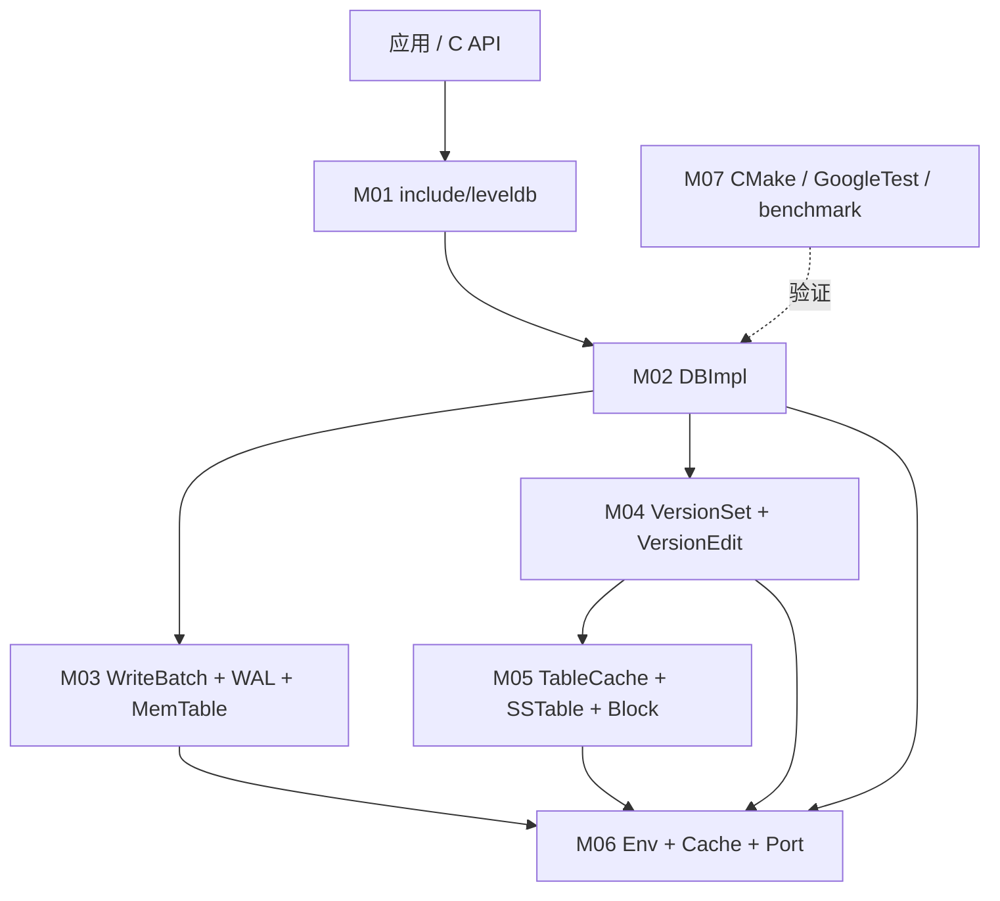

# 总体架构

- 文档目的：解释 LevelDB 的分层、模块关系和关键控制/数据流。
- 适用范围：`main` / `7ee830d`。
- 证据状态：机制已确认；动机和部分线程关系为推断。
- 最后更新：2026-09-10
- 前置阅读：[项目概览](project-overview.md)
- 后续阅读：[全局数据流](global-data-flow.md)、[跨模块链](../90-cross-module/cross-module-call-chains.md)

## 结论摘要

LevelDB 的核心不是一个单一索引，而是多个可替换层：公开 API 定义契约，`DBImpl` 持有数据库生命周期和并发状态，WAL/MemTable 承接最近写入，VersionSet 维护持久化版本，TableCache/SSTable 提供有序磁盘读，Env 提供操作系统抽象。

## 分层图

源码对应：公共接口在 [include/leveldb/db.h:42-146](../../source/leveldb/include/leveldb/db.h#L42-L146)，协调器字段在 [db/db_impl.h:157-204](../../source/leveldb/db/db_impl.h#L157-L204)，VersionSet 在 [db/version_set.h:166-315](../../source/leveldb/db/version_set.h#L166-L315)，Env 在 [include/leveldb/env.h:50-217](../../source/leveldb/include/leveldb/env.h#L50-L217)。

## 数据与控制边界

1. **写入控制**：`DBImpl::Write` 在 `mutex_` 保护下组织 writer 队列；日志写成功后批量插入 MemTable。关键符号：[db/db_impl.cc:1206-1330](../../source/leveldb/db/db_impl.cc#L1206-L1330)。
2. **读取控制**：`DBImpl::Get` 先根据 snapshot 形成 LookupKey，再查内存表和当前 Version；Version 对表文件查询委托 TableCache。关键入口：[db/db_impl.cc:1121-1166](../../source/leveldb/db/db_impl.cc#L1121-L1166)、[db/version_set.cc:324-452](../../source/leveldb/db/version_set.cc#L324-L452)。
3. **持久化状态**：VersionEdit 记录 log number、sequence、增删文件和 compact pointer；`LogAndApply` 把编辑写入 descriptor 并安装新 Version。[db/version_edit.h:28-101](../../source/leveldb/db/version_edit.h#L28-L101)、[db/version_set.cc:777-860](../../source/leveldb/db/version_set.cc#L777-L860)。
4. **后台控制**：`MaybeScheduleCompaction` 经 Env 调度 `BackgroundCall`；后台处理 immutable MemTable 或 compaction。[db/db_impl.cc:668-708](../../source/leveldb/db/db_impl.cc#L668-L708)。

## 资源所有权

- `DBImpl` 析构等待后台工作结束，再解锁数据库、删除 VersionSet/MemTable/log/TableCache，并按 `owns_*` 标志释放日志和缓存。[db/db_impl.cc:151-178](../../source/leveldb/db/db_impl.cc#L151-L178)。
- MemTable 是引用计数对象，迭代器使用期间调用方必须保持其存活。[db/memtable.h:19-50](../../source/leveldb/db/memtable.h#L19-L50)。
- Version 以引用计数保护活跃 Iterator；VersionSet 持有当前版本链。[db/version_set.h:59-91](../../source/leveldb/db/version_set.h#L59-L91)。
- Env 创建的文件对象由调用方按接口约定删除；具体实现由平台文件提供。

## 稳定契约与实现细节

稳定契约：`include/leveldb/*.h` 中 API、Status、线程安全和持久化枚举值；实现细节：`db/`、`table/` 内部类、文件名策略和 compaction 触发常数。README 明确要求调用方不要依赖内部头文件（[README.md:212-214](../../source/leveldb/README.md#L212-L214)）。

## 相关文档

- [运行模型](runtime-model.md)
- [全局数据流](global-data-flow.md)
- [依赖图](dependency-map.md)

## 源码证据摘要

- [db/db_impl.h:169-204](../../source/leveldb/db/db_impl.h#L169-L204)
- [doc/impl.md:7-49](../../source/leveldb/doc/impl.md#L7-L49)

## 未解决问题

Env 的 Schedule 是否创建固定数量线程取决于平台实现，不能从公共接口单独推断；需查看 `util/env_posix.cc`/`util/env_windows.cc` 并结合运行实验。

## 下一步阅读建议

沿 [global-data-flow.md](global-data-flow.md) 追踪一次写入和一次读取。
