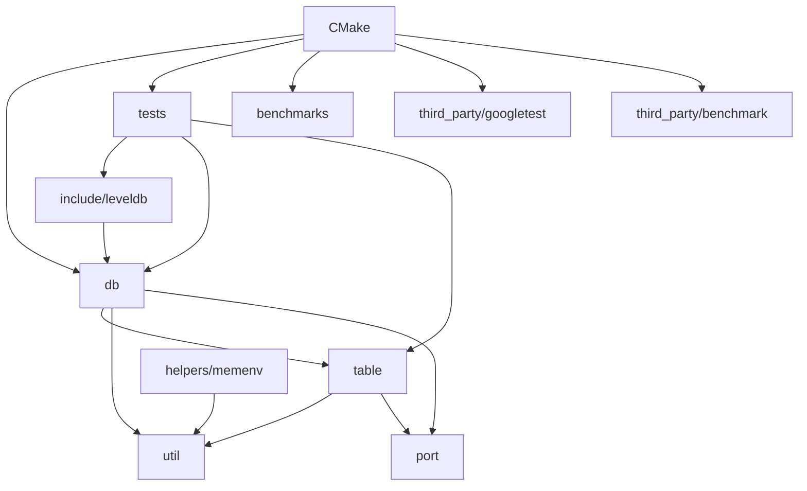

# 依赖地图

- 文档目的：说明源码依赖方向、外部依赖和构建边界。
- 适用范围：目标提交 `7ee830d`。
- 证据状态：已确认；循环依赖结论限于静态 include/构建观察。
- 最后更新：2026-09-10
- 前置阅读：[项目概览](project-overview.md)
- 后续阅读：[模块注册表](../01-modules/module-registry.md)

## 依赖图

## 内部方向

- `include/leveldb` 是公共方向的根；内部实现 include 它，但应用不应反向依赖 `db/`/`table/` 私有头。
- `db` 依赖 `table` 和 `util`；`table` 依赖 `util`/`port`；平台实现通过 `Env` 进入操作系统。
- `helpers/memenv` 实现 Env 替身并进入测试/库目标，但不是公共接口（[CMakeLists.txt:226-231](../../../CMakeLists.txt#L226-L231)）。
- 测试目标链接 `leveldb`、gmock、gtest；benchmark 目标链接 leveldb、benchmark 和可选对比库（[CMakeLists.txt:313-391](../../../CMakeLists.txt#L313-L391)、[CMakeLists.txt:407-468](../../../CMakeLists.txt#L407-L468)）。

## 外部依赖

| 依赖 | 必需性 | 影响 |
|---|---|---|
| C++17 编译器 / C11 | 基本 | 构建语言标准。 |
| Threads | 必需 | leveldb 目标链接 `Threads::Threads`。 |
| GoogleTest/GoogleMock | 测试 | 通过子模块构建。 |
| Google Benchmark | 默认基准 | 通过子模块构建。 |
| crc32c/Snappy/Zstd/tcmalloc | 可选 | CMake 探测后链接并启用能力。 |
| SQLite/KyotoCabinet | 可选 benchmark | 仅生成对应对比基准。 |

证据：[CMakeLists.txt:39-53](../../../CMakeLists.txt#L39-L53)、[CMakeLists.txt:270-285](../../../CMakeLists.txt#L270-L285)。

## 依赖风险

新增公共头依赖可能扩大 ABI；修改 `dbformat`/table format 会影响 WAL/SSTable 持久化兼容；平台实现差异不得泄漏到上层。静态依赖没有替代运行时行为测试。

## 相关文档

- [模块注册表](../01-modules/module-registry.md)
- [构建与部署](build-and-deploy.md)
- [配置影响图](../90-cross-module/configuration-impact-map.md)

## 源码证据摘要

见正文和 CMake 引用。

## 未解决问题

本知识库未深入第三方子模块内部；其版本/行为仅记录为构建边界。

## 下一步阅读建议

阅读 M06 了解 Env 如何隔离平台依赖。
