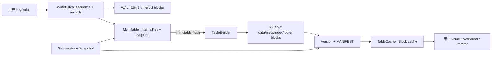

# 全局数据流

- 文档目的：用数据视角说明 key/value 如何从 API 进入日志、内存表和 SSTable，再回到读取结果。
- 适用范围：LevelDB 1.23.0。
- 对应源码版本：source/leveldb HEAD 7ee830d（2026-09-15 只读确认）。
- 证据状态：已确认；抽象时序中的“调用意图”为推断。
- 最后更新：2026-09-10
- 前置阅读：[运行模型](runtime-model.md)
- 后续阅读：[跨模块调用链](../90-cross-module/cross-module-call-chains.md)
## 结论摘要

写入数据在三个表示之间迁移：用户 WriteBatch 的编码表示、WAL 的物理记录表示、MemTable/SSTable 的 InternalKey 排序表示。读取以 snapshot sequence 为边界，按新到旧检查内存表和 Version 中的表，并在找到 value/deletion 后停止。

## 数据流图

WAL 分块和 CRC 由 [db/log_writer.cc:33-107](../../source/leveldb/db/log_writer.cc#L33-L107) 实现；SSTable 生成由 [table/table_builder.cc:93-267](../../source/leveldb/table/table_builder.cc#L93-L267) 实现。

## 写入数据的状态变化

1. `DBImpl::Write` 分配连续 sequence，并将 batch 写入日志。
2. `WriteBatchInternal::InsertInto` 以 `kTypeValue`/`kTypeDeletion` 写入 MemTable。
3. MemTable 满时成为 `imm_`，新 MemTable/log 接收后续写入。
4. `BuildTable` 迭代 MemTable，按序调用 TableBuilder，产生文件元数据。
5. VersionEdit 增加文件、更新 log/sequence，写入 MANIFEST 后安装新 Version。

## 读取数据的可见性

InternalKey tag 为 `sequence << 8 | type`；相同 user key 按 sequence 降序排列（[db/dbformat.h:99-116](../../source/leveldb/db/dbformat.h#L99-L116)）。Get 使用 LookupKey 限制不超过 snapshot 的 sequence；删除标记会产生 NotFound，旧版本可能在 compaction 中清除。

## 文件流

| 文件 | 作用 | 创建/更新 |
|---|---|---|
| `*.log` | 最近 WriteBatch 的 WAL | `log::Writer` 追加；恢复时 Reader 重放 |
| `*.ldb`/`*.sst` 表 | 排序后的数据/元数据块 | `TableBuilder::Finish` |
| `MANIFEST-*` | VersionEdit 日志 | `VersionSet::LogAndApply` |
| `CURRENT` | 指向当前 MANIFEST | `SetCurrentFile` |
| `LOCK` | 单进程互斥 | `Env::LockFile` |

证据：[doc/impl.md:7-62](../../source/leveldb/doc/impl.md#L7-L62)。

## 相关文档

- [共享数据与类型](../90-cross-module/shared-data-and-types.md)
- [M03 数据结构](../01-modules/M03-wal-memtable/data-structures.md)
- [M05 表格式](../01-modules/M05-sstable-table/data-structures.md)

## 源码证据摘要

见正文各段。

## 未解决问题

实际文件扩展名、平台 mmap/append 差异需在对应 Env 和 filename 源码中继续核实；不能仅以概念图代替格式验证。

## 下一步阅读建议

先读 `db/dbformat.h`，再读 log 和 table format。
