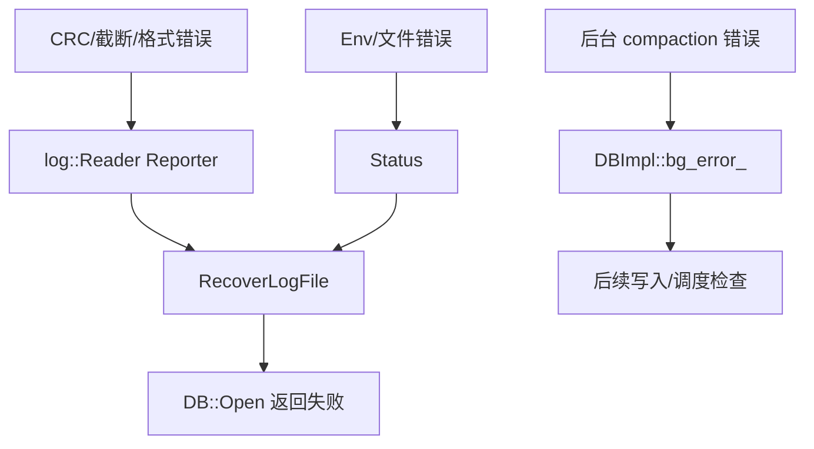

# 全局错误模型

- 文档目的：说明 Status、日志损坏、后台错误和恢复如何传播。
- 适用范围：LevelDB 1.23.0。
- 对应源码版本：source/leveldb HEAD 7ee830d（2026-09-15 只读确认）。
- 证据状态：主要机制已确认。
- 最后更新：2026-09-10
- 前置阅读：[运行模型](runtime-model.md)
- 后续阅读：[错误边界](../90-cross-module/error-boundaries.md)
## 结论摘要

LevelDB 主要不用 C++ 异常，而用 `Status` 返回错误；WAL Reader 将物理记录错误报告给 Reporter，恢复路径决定是否继续；后台错误写入 `bg_error_`，之后可能阻止继续写入或安全删除文件。`paranoid_checks` 控制部分可忽略错误是否升级。

## 错误流

## 关键规则

- 公共 API 的 `Put/Delete/Write/Get` 返回非 OK 表示失败；NotFound 是 Get 的正常语义之一（[include/leveldb/db.h:62-87](../../source/leveldb/include/leveldb/db.h#L62-L87)）。
- `MaybeIgnoreError` 在非 paranoid 模式下记录并清除可忽略错误，在 paranoid 模式保留错误（[db/db_impl.cc:215-221](../../source/leveldb/db/db_impl.cc#L215-L221)）。
- 日志 Reader 对文件尾不完整记录可视为 writer 崩溃并返回 EOF，而 CRC/记录类型问题报告 corruption（[db/log_reader.cc:143-170](../../source/leveldb/db/log_reader.cc#L143-L170)）。
- 后台错误时 `RemoveObsoleteFiles` 不安全执行垃圾回收，因为可能无法判断新版本是否已提交（[db/db_impl.cc:224-231](../../source/leveldb/db/db_impl.cc#L224-L231)）。

## 调试提示

先保存 `Status::ToString()`、info log 和数据库目录文件清单；区分 NotFound、IO error、Corruption、InvalidArgument 和后台错误。不要用 DestroyDB/RepairDB 替代备份，RepairDB 明确可能丢数据（[include/leveldb/db.h:149-162](../../source/leveldb/include/leveldb/db.h#L149-L162)）。

## 相关文档

- [M01 interfaces](../01-modules/M01-public-api/interfaces.md)
- [调试指南](../99-roadmap/debugging-guide.md)

## 源码证据摘要

见正文引用。

## 未解决问题

不同 Env 的具体 errno/Windows 错误文本需结合平台实现确认。

## 下一步阅读建议

阅读 M03 日志损坏路径和 M02 后台错误路径。
